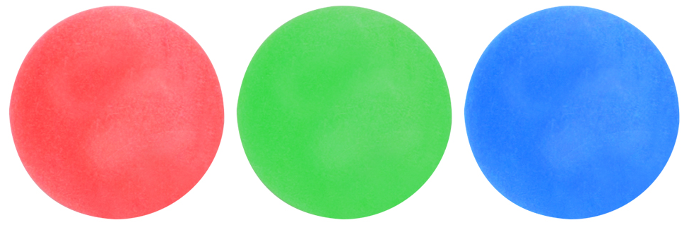
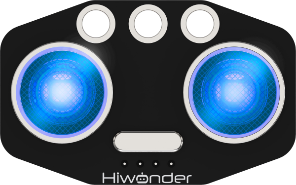
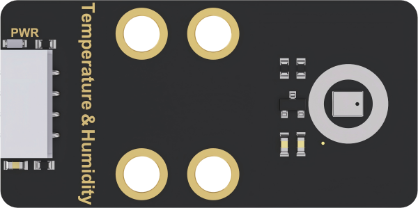
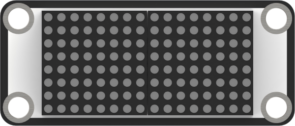
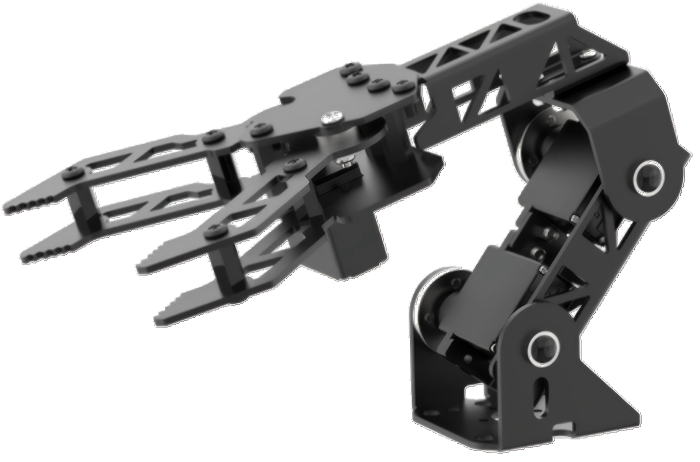
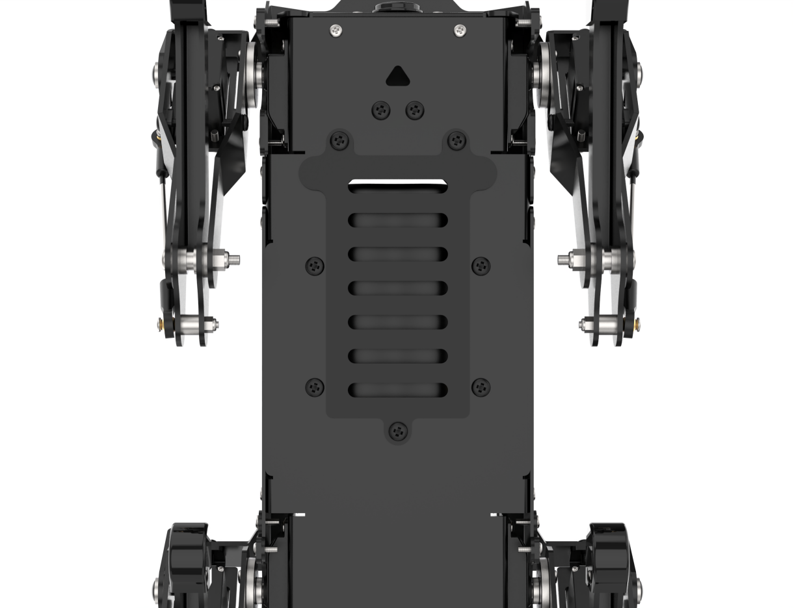

# 1. Quick Start Guide

## 1.1 PuppyPi Introduction

### 1.1.1 Product Introduction

Powered by Raspberry Pi 5, PuppyPi is an AI vision quadruped robot. It is made of aluminium alloy and loaded with 8 powerful coreless servos. Linkage mechanism on its leg attributes to flexible and diverse actions and enables it to walk, step up and down stair, etc.
The robot possesses first-person vision, enabling a variety of intriguing AI gameplay, such as target tracking, facial detection, visual patrolling, autonomous climbing, and more.
PuppyPi is based on ROS (robot operating system) and supports Gazebo simulation. It serves as a great platform for you to learn and verify machine vision, robot kinematics, quadruped gait controlling and other algorithms.

### 1.1.2 Usage Precautions

Please pay attention to the following points when using and storing this product:

This product contains conductive components. Avoid contact with metal objects when powered on.

After the robot is powered on, do not forcibly move the servo, as this may cause damage.

If the robot runs for an extended period, the servos may become hot. Allow the robot to "**rest**" and wait for the servos to cool before resuming operation.

Keep your face, glasses, and other body parts away from the robot while it is operating. Do not place fingers within the joint movement range to prevent injury. Also, be cautious of falls from high edges.

The robot's servos are precision components and consumable parts. They may need replacement after long-term or intensive use.

If the product will not be used for an extended period, fully charge the battery, remove it, and store it in a cool, dry place.

### 1.1.3 Copyright Notice

This manual is the property of Shenzhen Hiwonder Technology Co., Ltd. No organization or individual is permitted to reproduce, copy, translate, or distribute any content from this manual without authorization.

Any unauthorized use or infringement of this manual's copyright will be subject to legal action by our company.

### 1.1.4 Disclaimer

The product described in this manual (including hardware, software, etc.) is provided "**as is**". Every effort has been made to ensure the accuracy of this manual, but we cannot guarantee it is completely free from errors or omissions. This document is regularly reviewed, and we welcome feedback for improvements.

Product features and specifications may change with version upgrades. For the latest product information, please contact customer service when placing your order.

Furthermore, unless explicitly stated by Hiwonder, we are not responsible for any losses resulting from product malfunctions or damage under extreme conditions outside of typical use cases.

## 1.2 Packing List

(1) PuppyPi Standard Packing List

| **No.** | **Components**       | **Quantity** | **Picture**                                                                     |
| ------- | -------------------- | ------------ |---------------------------------------------------------------------------------|
| 1       | PuppyPi(with camera) | 1            |    |
| 2       | 8.4V charger         | 1            |    |
| 3       | Card Reader          | 1            |     |
| 4       | 4cm Balls            | 3            |    |
| 5       | 65*65mm Tags         | 3            |  |
| 6       | Screwdriver          | 1            |    |
| 7       | Accessory bag        | 1            |   |

(2) PuppyPi Advanced Packing List

| **No.** | **Components**       | **Quantity** | **Picture**                                                                     |
| ------- | -------------------- | ------------ |---------------------------------------------------------------------------------|
| 1       | PuppyPi(with camera) | 1            |    |
| 2       | 8.4V charger         | 1            |    |
| 3       | Card Reader          | 1            |     |
| 4       | 4cm Balls            | 3            |    |
| 5       | 65*65mm Tags         | 3            |  |
| 6       | Screwdriver          | 1            |    |
| 7       | Accessory bag        | 1            |   |
| 8       | WonderEchoPro        | 1            |   |

(3) PuppyPi Pro Packing List

| **No.** | **Components**                  | **Quantity** | **Picture**                                                                     |
| ------- | ------------------------------- | ------------ |---------------------------------------------------------------------------------|
| 1       | PuppyPi(with camera)            | 1            |    |
| 2       | 8.4V charger                    | 1            |    |
| 3       | Card Reader                     | 1            |     |
| 4       | 4cm Balls                       | 3            |    |
| 5       | 65*65mm Tags                    | 3            |  |
| 6       | Screwdriver                     | 1            |    |
| 7       | Accessory bag                   | 1            |   |
| 8       | WonderEchoPro                   | 1            |   |
| 9       | Wireless+Handle receiver        | 1            |   |
| 10      | Glowing ultrasonic sensor       | 1            |   |
| 11      | Temperature and humiditysensor  | 1            |   |
| 12      | Touch sensor                    | 1            |   |
| 13      | Dot matrix display              | 1            |   |
| 14      | Bracket (for ultransion sensor) | 1            |   |
| 15      | Sensor accessory bag            | 1            |   |
| 16      | TOF Lidar                       | 1            |   |
| 17      | Lidar adapter board             | 1            |   |

(4) PuppyPi Pro Ultimate Packing List

| **No.** | **Components**                  | **Quantity** | **Picture**                                                                     |
| ------- | ------------------------------- | ------------ |---------------------------------------------------------------------------------|
| 1       | PuppyPi(with camera)            | 1            |    |
| 2       | 8.4V charger                    | 1            |    |
| 3       | Card Reader                     | 1            |    |
| 4       | 4cm Balls                       | 3            |    |
| 5       | 65*65mm Tags                    | 3            |  |
| 6       | Screwdriver                     | 1            |    |
| 7       | Accessory bag                   | 1            |   |
| 8       | WonderEchoPro                   | 1            |   |
| 9       | Wireless+Handle receiver        | 1            |   |
| 10      | Glowing ultrasonic sensor       | 1            |   |
| 11      | Temperature and humiditysensor  | 1            |   |
| 12      | Touch sensor                    | 1            |   |
| 13      | Dot matrix display              | 1            |   |
| 14      | Bracket (for ultransion sensor) | 1            |   |
| 15      | Sensor accessory bag            | 1            |   |
| 16      | TOF Lidar                       | 1            |   |
| 17      | Lidar adapter board             | 1            |   |
| 18 |Sponge cube  | 3 |    |
| 19      | Robotic arm               | 1 |   |

## 1.3 Start PuppyPi

### 1.3.1 Charging

(1) Before charging, please remove the metal plate on the dog's belly with the screwdriver.

(2)  Before wiring, please push the switch on expansion board to OFF.

(3)  Take out the battery, and connect red wire to red wire and black to black.

(4)  After connection, insert the battery back to the battery slot, and then fix the metal plate on PuppyPi. The screws don't need to be tightened too much, just enough to secure them in place.

(5) Insert the included power adaptor into the round hole on Raspberry Pi expansion board.

(6)  Please wait until PuppyPi is fully charged. The indicator on power adaptor is green without plugged in. When plugged in, its indicator will turn red which indicates PuppyPi is charging. The charging time is approximately one and a half hours.When the indicator turns green again, PuppyPi gets fully charged. After charging, please unplug the power adaptor as soon as possible.

### 1.3.2 Boot up PuppyPi

:::{Note}
* Please do not place PuppyPi on rough and uneven surface.
* After PuppyPi turns on, please don't move the servo violently to avoid damage to the servo.
:::

(1) Before booting up, please place PuppyPi as pictured to avoid the damage caused by sudden force from servos.

(2) Then push the switch on expansion board to "**ON**". After booting up, current battery voltage will be displayed on digital tube at the back (Charge the robot at once when the voltage is below 6.8V), and LED1 and LED2 will turn blue. Later, LED1 will keep lighting up and LED2 will flash continuously, which means that the network configuration is done. Please wait until the buzzer beeps, at this time, Ros finishes configuration and PuppyPi completely boots up.

(3) The default network mode is AP Direct Connection Mode. After successful booting up, PuppyPi will generate a WiFi starting with "**HW**".

After successfully booting up PuppyPi, please move to "[**2. APP and Handle Control**](2.Quick_User_Experience.md)" to experience PuppyPi's function.
