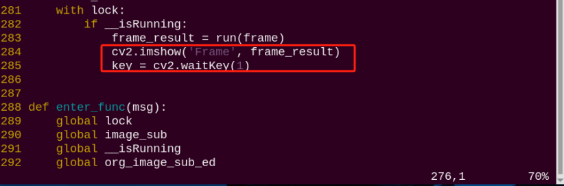
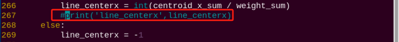

# 10. ROS1-AI Vision Line Following Course

## 10.1 Line Locating

### 10.1.1 Program Logic

Before line following, program PuppyPi to locate the line first.

Firstly, program to recognize color. Use Lab color space to convert the image from RGB into Lab. Then, perform binaryzation, corrosion, dilation, etc., on the image to obtain the contour which contains the target color. Next, mark the contour with rectangle.

Next, acquire the diagonal points of the rectangle, and draw the center of line.

Lastly, display the information about the center of line on the terminal.

### 10.1.2 Operation Steps

:::{Note}
The input command should be case and space sensitive.
:::

(1) Turn on PuppyPi, and then connect to Raspberry Pi desktop through VNC.

(2) Click  to open LX terminal.

(3) Input command and press Enter to start the game.

```bash
rosrun puppy_advanced_functions visual_patrol_demo.py
```

(4) If want to close this game, we can press "**Ctrl+C**". If it fails to close the game, please try again.

### 10.1.3 Program Outcome

:::{Note}
The program is default to recognize red.
:::

Use red electrical tape to set the line. Then place PuppyPi on the red line. After the line is recognized by PuppyPi, the line will be framed on the camera returned image and the center of line will be drawn. At the same time, the coordinate of the line center will be displayed on the terminal.


### 10.1.4 Program Analysis

The source code of this program is stored in [/home/ubuntu/puppy_pi/src/puppy_advanced_functions/scripts/visual_patrol_demo.py](../_static/source_code/visual_patrol_demo.zip)

* **Image Processing**

(1) Import Function Package

```python
import sys
import cv2
import math
import time
import rospy
import threading
import numpy as np
from threading import RLock, Timer
from ros_robot_controller.msg import RGBState, RGBsState
from std_srvs.srv import *
from sensor_msgs.msg import Image
from object_tracking.srv import *
from puppy_control.msg import Velocity, Pose, Gait

from common import Misc
```

Import the required modules through import statements: math provides a range of mathematical functions and constants for related calculations; rospy is used for ROS communication; from sensor_msgs.msg import Image: import Image information type from sensor_msgs.msg. Sensor_msgs package provides information definition and camera image of various sensor data. Puppy control imports action group.

(2) Obtain the Maximal Contour

```py
if debug:
   enter_func(1)
   start_running()
   __target_color = 'red'
```

Set the line color to red.

(3) Gussian Filtering

Before converting the image from RGB into Lab space, denoise the image and use GaussianBlur() function in cv2 library for Gaussian filtering.

```py
frame_gb = cv2.GaussianBlur(frame_resize, (3, 3), 3) 
```

The meaning of the parameters in bracket is as follow

The first parameter `frame_resize` is the input image

The second parameter `(3, 3)` is the size of Gaussian kernel

The third parameter `3` is the allowable variance around the average in Gaussian filtering. 

The larger the value, the larger the allowable variance.

(4) Binaryzation Processing

Adopt `inRange()` function in cv2 library to perform binaryzation on the image.

```py
frame_mask = cv2.inRange(frame_lab,
                              (color_range_list[detect_color]['min'][0],
                              color_range_list[detect_color]['min'][1],
                              color_range_list[detect_color]['min'][2]),
                              (color_range_list[detect_color]['max'][0],
                              color_range_list[detect_color]['max'][1],
                              color_range_list[detect_color]['max'][2]))  #对原图像和掩模进行位运算(perform bitwise operation to original image and mask)
```

The first parameter in the bracket is the input image.

 The second and the third parameters respectively are the lower limit and upper limit of the threshold. When the RGB value of the pixel is between the upper limit and lower limit, the pixel is assigned 1, otherwise, 0.

(5) Open Operation and Close Operation

:::{Note}
To reduce interference and make the image smoother, it is necessary to process the image.
:::

```py
opened = cv2.morphologyEx(frame_mask, cv2.MORPH_OPEN, np.ones((6, 6), np.uint8))  # 开运算(opening operation)
closed = cv2.morphologyEx(opened, cv2.MORPH_CLOSE, np.ones((6, 6), np.uint8))  # 闭运算(closing operation)
```

cv2.MORPH_OPEN refers to open operation where corrosion will be conducted first, then dilation. cv2.MORPH_CLOSE indicates close operation where dilation will be conducted first, then corrosion.
Take `opened = cv2.morphologyEx(frame_mask, cv2.MORPH_OPEN, np.ones((6, 6), np.uint8))` for example. The meaning of the parameters in bracket is as follow.
The first parameter `frame_mask` is the input image.
The second parameter `cv2.MORPH_OPEN` refers to processing method, open operation.
The third parameter `np.ones((6, 6), np.uint8)` is frame size.

(6) Acquire the Maximum Contour

After processing the image, acquire the contour of the target to be recognized, which involves `findContours()` function in cv2 library.

```py
cnts = cv2.findContours(closed , cv2.RETR_EXTERNAL, cv2.CHAIN_APPROX_TC89_L1)[-2]#找出所有轮廓(find out all the contours)
```

The first parameter in parentheses is the input image; 

the second parameter is the retrieval mode of the contour;

 the third parameter is the approximation method of the contour.

Find the contour of the maximum area among the obtained contours. To avoid interference, please set a minimum value. Only when the area is greater than this value, the target contour is valid.

```py
# 找出面积最大的轮廓(find out the contour with the maximal area)
# 参数为要比较的轮廓的列表(the parameter is the list of contour to be compared)
def getAreaMaxContour(contours):
    contour_area_temp = 0
    contour_area_max = 0
    area_max_contour = None

    for c in contours:  # 历遍所有轮廓(iterate through all contours)
        contour_area_temp = math.fabs(cv2.contourArea(c))  # 计算轮廓面积(calculate the contour area)
        if contour_area_temp > contour_area_max:
            contour_area_max = contour_area_temp
            if contour_area_temp > 50:  # 只有在面积大于50时，最大面积的轮廓才是有效的，以过滤干扰(only contours with an area greater than 50 are considered valid, filtering out interference)
                area_max_contour = c

    return area_max_contour, contour_area_max  # 返回最大的轮廓(return the maximal contour)
```

* **Acquire the Position**

(1) Frame the Line

Call  `drawContours()` function to set the rectangle pattern and frame the line.

```py
cv2.drawContours(img, [box], -1, (0,0,255,255), 2)#画出四个点组成的矩形(draw a rectangle formed by connecting the four points)
```

(2) Draw the Center

Next, acquire the diagonal points of the rectangle, and draw the line center through `circle()` function.

```py
#获取矩形的对角点(get the diagonal points of the rectangle)
pt1_x, pt1_y = box[0, 0], box[0, 1]
pt3_x, pt3_y = box[2, 0], box[2, 1]            
center_x, center_y = (pt1_x + pt3_x) / 2, (pt1_y + pt3_y) / 2#中心点(center point)
cv2.circle(img, (int(center_x), int(center_y)), 5, (0,0,255), -1)#画出中心点(draw the center point)
```

Lastly, display the information about the center of rectangle on the terminal.

```py
if weight_sum is not 0:
    #求最终得到的中心点(calculate the final resulting center point)
    cv2.circle(img, (line_centerx, int(center_y)), 10, (0,255,255), -1)#画出中心点(draw the center point)
    line_centerx = int(centroid_x_sum / weight_sum)  
    print('line_centerx',line_centerx)
else:
    line_centerx = -1
```

## 10.2 Auto Line Following

:::{Note}

 if PuppyPi's performance is not desired, we can debug according to "[10.2.5 Function Extension -> Close Debugging Interface and Printed Data ](#anchor_10_2_5)".
:::

### 10.2.1 Program Logic

PuppyPi can recognize the color of line and use algorithm to process the image so as to realize line following.  

Firstly, program to recognize the color of line. Use Lab color space to convert the image from RGB into Lab. Then, perform binaryzation, corrosion, dilation, etc., on the image to obtain the contour which contains the target color. Next, mark the contour with rectangle.

After color recognition, perform calculation based on the location of line in the image to control PuppyPi to move along the line.

### 10.2.2 Operation Steps

:::{Note}
The input command should be case and space sensitive.
:::

(1) Turn on PuppyPi, and then connect to Raspberry Pi desktop through VNC.

(2) Click  to open command line terminal.

(3) Input command "rosrun puppy_advanced_functions visual_patrol_demo.py" and press Enter to start the game.

```bash
rosrun puppy_advanced_functions visual_patrol_demo.py
```

(4) If want to close this game, we can press **"Ctrl+C"**. If it fails to close the game, please try again.

### 10.2.3 Program Outcome

:::{Note}
The program is default to detect red.
:::

Use the red electrical tape to set the line, and place PuppyPi on the red line. After the game starts, it will move along the red line.


### 10.2.4 Program Analysis

The source code of this program is stored in [/home/ubuntu/puppy_pi/src/puppy_advanced_functions/scripts/visual_patrol_demo.py](../_static/source_code/visual_patrol_demo.zip)

(1) Set the line color

```py
if debug:
    enter_func(1)
    start_running()
    __target_color = 'red'
```

Set the line color to red.

(2) Move Following the Line

After locating the line, control PuppyPi to move following the line according to the coordinate of the center of line.

```py
def move():
    global PuppyMove
    global draw_color

    global line_centerx
    rospy.sleep(1)
    while True:
        if __isRunning:
            if line_centerx != -1:
                if abs(line_centerx - img_centerx) <= 50:
                    PuppyMove['x'] = 10
                    PuppyMove['yaw_rate'] = math.radians(0)
                elif line_centerx - img_centerx > 50:
                    PuppyMove['x'] = 8
                    PuppyMove['yaw_rate'] = math.radians(-15)
                elif line_centerx - img_centerx < -50:
                    PuppyMove['x'] = 8
                    PuppyMove['yaw_rate'] = math.radians(15)
                
                PuppyVelocityPub.publish(x=PuppyMove['x'], y=PuppyMove['y'], yaw_rate=PuppyMove['yaw_rate'])
            else:
                PuppyMove['x'] = 0
                PuppyMove['yaw_rate'] = math.radians(0)
                PuppyVelocityPub.publish(x=PuppyMove['x'], y=PuppyMove['y'], yaw_rate=PuppyMove['yaw_rate'])
            time.sleep(0.001)
        else:
            time.sleep(0.001)
        if is_shutdown:break
```

(3) Walk

`PuppyPosePub.publish()`, `PuppyGaitConfigPub.publish` and `PuppyVelocityPub.publish` functions are used to control PuppyPi to walk. 

```py
# 初始位置(initial position)
def initMove(delay=True):
    global GaitConfig
    PuppyMove['x'] = 0
    PuppyMove['yaw_rate'] = math.radians(0)
    PuppyVelocityPub.publish(x=PuppyMove['x'], y=PuppyMove['y'], yaw_rate=PuppyMove['yaw_rate'])
    rospy.sleep(0.2)
    rospy.ServiceProxy('/puppy_control/go_home', Empty)()
    PuppyPosePub.publish(stance_x=PuppyPose['stance_x'], stance_y=PuppyPose['stance_y'], x_shift=PuppyPose['x_shift']
            ,height=PuppyPose['height'], roll=PuppyPose['roll'], pitch=PuppyPose['pitch'], yaw=PuppyPose['yaw'], run_time = 500)
    
    rospy.sleep(0.2)
    PuppyGaitConfigPub.publish(overlap_time = GaitConfig['overlap_time'], swing_time = GaitConfig['swing_time']
                    , clearance_time = GaitConfig['clearance_time'], z_clearance = GaitConfig['z_clearance'])
                    
    with lock:
        pass
    if delay:
        rospy.sleep(0.5)
```

PuppyPosePub.publish() function is used to control motion posture of PuppyPi.   

Take `PuppyPosePub.publish(stance_x=PuppyPose['stance_x'], stance_y=PuppyPose['stance_y'], x_shift=PuppyPose['x_shift'],height=PuppyPose['height'],roll=PuppyPose['roll'], pitch=PuppyPose['pitch'], yaw=PuppyPose['yaw'], run_time = 500)` for example. The meaning of the parameters in bracket is as follow.

â‘?The first parameter `stance_x` refers to the distance in cm that front legs and hind legs move in the opposite direction on x axis.

â‘?The second parameter `stance_y` refers to the distance in cm that front legs and hind legs move in the opposite direction on y axis. As there is no servo controlling legs to move along Y axis, this parameter is useless.

â‘?The third parameter `x_shift` is the distance that 4 legs move in the same direction on x axis. The smaller the value, the greater PuppyPi leans forward. The greater the value, the greater PuppyPi leans backward. We can adjust x_shift to balance PuppyPi during it is walking.

â‘?The fourth parameter `height` refers to PuppyPi's height that the perpendicular distance between foothold and the upper joint in cm.

â‘?The fifth parameter `roll` is PuppyPi's roll angle in degree.

â‘?The sixth parameter `pitch` is PuppyPi's pitch angle in degree.

â‘?The seventh parameter `yaw` is yaw angle in degree.

â‘?The eighth parameter `run_time` is the motion time in ms.

`PuppyGaitConfigPub.publish` function is used to control PuppyPi's gait.  

Take `PuppyGaitConfigPub.publish(overlap_time = GaitConfig['overlap_time'], swing_time = GaitConfig['swing_time'] , clearance_time = GaitConfig['clearance_time'], z_clearance = GaitConfig['z_clearance'])` for example. The meaning of the parameter in bracket is as follow.

â‘?The first parameter `overlap_time` is the time when all the lower legs of PuppyPi touch the ground. The unit is s.

â‘?The second parameter `swing_time` is the time when two lower legs are off the ground. The unit is s.

â‘?The third parameter `clearance_time` is the interval to switch between front leg and hind leg. The unit is s.

â‘?The fourth parameter `z_clearance` is the lifted height of lower leg. The unit is s.
`PuppyVelocityPub.publish()` is used to control PuppyPi's motion status. 

Take `PuppyVelocityPub.publish(x=PuppyMove['x'], y=PuppyMove['y'], 
yaw_rate=PuppyMove['yaw_rate'])` for example. The meaning of the parameters in bracket is as follow.

â‘?The first parameter `x` is the speed in cm/s of moving forward.Forward is taken as the positive direction.

â‘?The second parameter `y` is the speed in cm/s of moving sideways. Left is taken as the positive direction. As PuppyPi cannot move sideways, this parameter is useless.

â‘?The third parameter `yaw_rate` is the speed in rad/s of turning. Counterclockwise is taken as the positive direction.

<p id="anchor_10_2_5"></p>

### 10.2.5 Function Extension

* **Close Debugging Interface and Printed Data**

As the continuous refresh of debugging interface and printed data on terminal will occupy CPU of Raspberry Pi, we can close debugging interface and printed data to tackle choppy running.

(1) Input command and press Enter to edit the program file.

```bash
rosed puppy_advanced_functions visual_patrol_demo.py
```

(2) Next, jump to this line of code.




:::{Note}
we can input the line code and press **"Shift+G"** to jump to the corresponding line.
:::

(3)  Press **"i"** key to enter editing mode. Then add **"#"** in front of the codes in the red frame to comment.




(4) After modification, press **"Esc"** and input **":wq"** and press Enter to save and exit editing.

```bash
:wq
```

(5) Input the command  to restart the game and check PuppyPi's performance.

```bash
rosrun puppy_advanced_functions visual_patrol_demo.py
```

(6) If you need to view the debugging screen again (real-time feedback from the camera), you can uncomment the content boxed in step 3, i.e., remove the "**#**" in front of the code, then save, as shown in the following figure:


* **Change the Followed Color**

The program is default to follow red line. If you need to change the followed color, for example black, please follow the below steps to operate.

(1) Enter and press Enter to edit the auto line following program.

```bash
rosed puppy_advanced_functions visual_patrol_demo.py
```

(2) Next, jump to this line of code.


:::{Note}
we can input the line code and press **"Shift+G"** to jump to the corresponding line.
:::

(3) Press **"i"** key to enter editing mode. Modify **"red"** as **"black"**.


(4)  After modification, press **"Esc"** and input **":wq"** and press Enter to save and exit editing.

```bash
:wq
```

(5) Input the command  to restart the game and check PuppyPi's performance.

```bash
rosrun puppy_advanced_functions visual_patrol_demo.py
```
