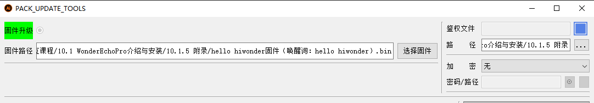
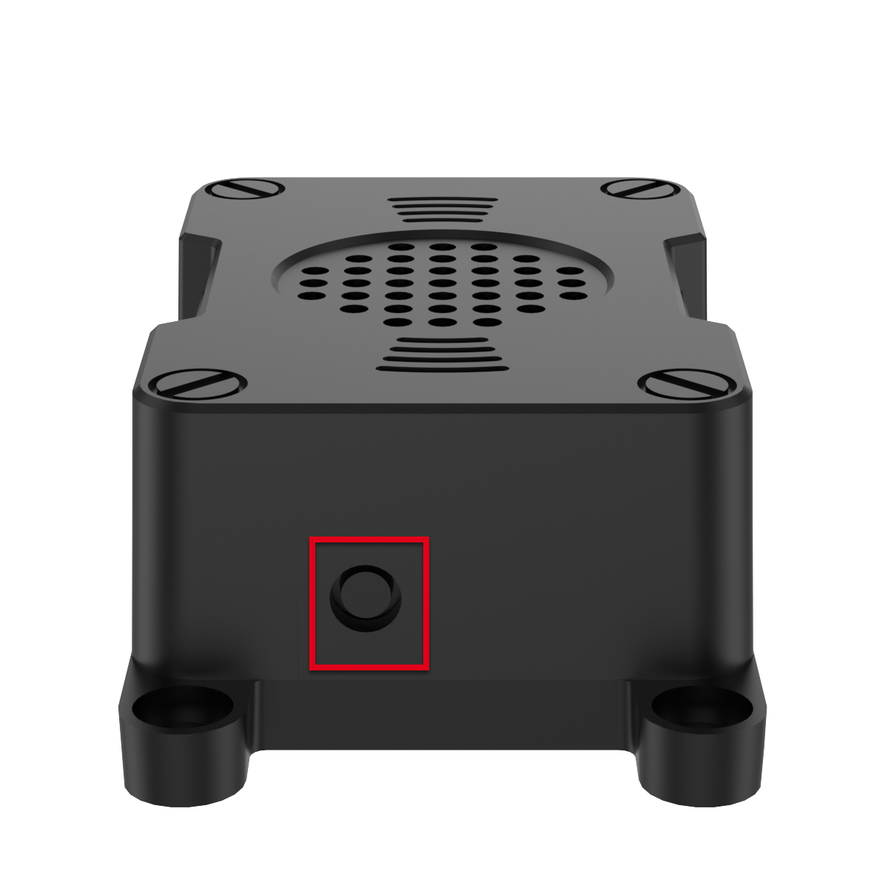
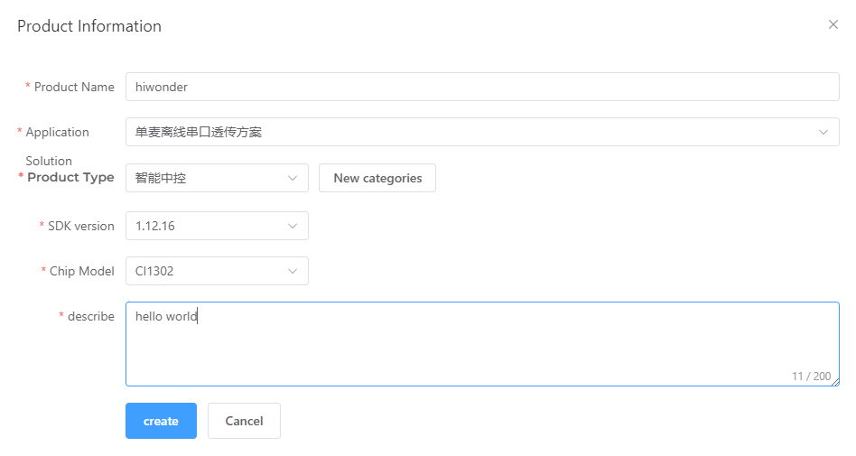

# 12. ROS AI Voice Interaction Courses

## 12.1 Introduction to WonderEcho Pro and Installation

### 12.1.1 Introduction to WonderEcho Pro

WonderEcho Pro, also known as the AI Voice Interaction Box, is equipped with a high-performance noise-canceling microphone and a high-fidelity speaker. Featuring a USB-to-audio module, it offers plug-and-play functionality without the need for drivers and is compatible with multiple systems for both playback and recording.

This device integrates various speech processing modules and uses advanced noise suppression algorithms to effectively filter out background noise, supporting a seamless process from wake-up to speech recognition and interaction. With its modular design, each functional component—such as wake-up, detection, recognition, and synthesis—can be developed and tested independently.

* **Features & Parameters**

(1) The device is equipped with an onboard microphone and speaker interface, supporting both audio input and output.

(2) It is driver-free, offering seamless plug-and-play functionality with broad system compatibility, including Windows, macOS, Linux, and Android. The `listen/speak` dual function ensures versatility across various platforms.

(3) It uses a standard USB 2.0 interface.

(4) Control Interface: USB

(5) Voice Chip Model: Cl1302

(6) Speaker Output: 3.0W per channel (4Ω BTL)

(7) Power Supply Voltage: 5V

* **Recording and Playback Test**

:::{Note}
The following steps demonstrate the process using the Raspberry Pi 5, but the connection and testing procedures are equally applicable to other compatible devices, such as NVIDIA Jetson controllers.
:::

### 12.1.2 Connection Setup and Verification


For Raspberry Pi, you can establish a remote connection to the system using VNC by following the [6 Remote Desktop Tool Installation and Connection / 6.1 Remote Tool Installation and Connection]() guide. Once connected, check the top-right corner of the desktop for the microphone and speaker icons, as shown below. If they are present, the connection has been successfully established.


For Jetson-based systems, you can use the Nomachine remote connection tool. Once connected, verify the presence of the speaker icon in the top-right corner of the system.


### 12.1.3 Recording Test

(1) Next, open a new command-line terminal and enter the following command to check for the use of the `-l` (lowercase L) option, and verify that the card number (card) is 0. This is just an example; please ensure to check your actual query results.

```
arecord -l
```

(2) Then, use the following command to start recording, replacing the highlighted card number (in red) with the one obtained from the previous query:

```
arecord -D hw:0,0 -f S16_LE -r 16000 -c 2 test.wav
```

(3) A `test.wav` file will be generated in the current folder.

(4) You can record for about 5 seconds, then press `Ctrl+C` to stop the recording.

### 12.1.4 Playback Test

(1) After completing the recording, you can check if the file was successfully recorded by running the following command in the current directory:

```
ls
```

(2) If `test.wav` appears, the recording was successful. To play the recorded file, use the command below, ensuring you replace the card number with the one obtained from your previous query:

```
aplay test.wav
```

### 12.1.5 WonderEcho Pro Installation


Connect the WonderEcho Pro to the port 2.


### 12.1.6 Firmware Flashing Method

In this lesson, we will learn how to flash firmware onto the WonderEcho Pro.

* **Flashing the Firmware**

(1) Begin by connecting the WonderEcho Pro to your computer using a Type-C data cable.


(2) Navigate to [05 Appendix\Firmware Flashing Tool]() and open the [PACK_UPDATE_TOOL.exe]() file. Select the CI1302 chip from the list, then click "**Firmware Upgrade**" to begin the process.


:::{Note}
For this example, we will use the **hello hiwonder firmware** (Wake word: **hello hiwonder**).
:::

(3) Select the firmware by locating the `hello hiwonder firmware (Wake word: hello hiwonder).bin` file under the [05 Appendix]() path.



(4) Identify the correct COM port and select it.


(5) Press the RST button on the WonderEcho Pro to initiate the flashing process. Wait for the process to complete successfully.




* **Testing the Wake Word**

After flashing the firmware, follow the steps in [`05 Appendix\\ Serial Port Debugging Tool`]() to install the serial port debugging tool. Then, follow the steps below to test whether the firmware is functioning correctly.

(1) Connect the WonderEcho Pro to your computer's USB port using a Type-C to USB adapter.


(2) Open the Serial Port Utility, select the connected COM port (including CH340), and set the baud rate to 115200, as shown in the image below.


(3) Say the wake word **hello hiwonder** as configured in the firmware settings. The corresponding flag information will appear on the right side (in hexadecimal format), confirming that the wake word was successfully recognized.


### 12.1.7 Firmware Development

In this lesson, you'll learn how to create and flash firmware for the WonderEcho Pro module.

* **Firmware Creation and Flashing**

:::{Note}
We'll use **HIWONDER** as an example to demonstrate the firmware creation process. The same procedure also applies to creating firmware with Chinese wake words. Note: English wake words must be entered in all uppercase letters to function properly.
:::

(1) Open the official firmware creation website: [https://aiplatform.chipintelli.com/home/index.html](); The platform interface is in Chinese. If needed, use your browser's translation feature to switch to English for easier navigation.

(2) First, visit the ChipIntelli Voice AI Platform by clicking on Platform Features in the top menu, and then select In-depth development of Product Firmware & SDK under the Product Development section.


(3) You will be prompted to log in. (Note: Currently, registration is only available for mainland China mobile numbers. For international users, we provide a shared account:
Username: 18033085495
Password: hiwonder

After successfully logging in, click **In-depth development of Product Firmware & SDK** again to access the development section.


(4) To create a new product, click the option in the left sidebar. You will be asked to provide a Product Name and a Description, both of which can be customized. For the other fields, follow the options shown in the red box. Specifically, choose Product Type: **通用 (General)** → **智能中控 (Smart Central Control)**. After completing these steps, click Create.




(5) Next, you will need to set the project language. Since we are configuring for English voice recognition, select English under Language Type. If you were configuring for Chinese recognition, you would select Chinese for both Voice Type and Acoustic Model. Once you've selected the appropriate options, click Continue to proceed.


(6) In the firmware configuration interface, you will make some important changes to the settings. Start by enabling the Echo Cancellation feature under Algorithm Settings.


(7) Under Hardware Settings, set the oscillator source to Internal RC and disable the Baud Rate Calibration function.


(8) In the UART Print Settings, configure UART1 to Open-Drain Mode, supporting external 5V pull-up.


(9) For Communication UART Settings, set the Baud Rate to 115200 and configure UART0 to Open-Drain Mode, also supporting external 5V pull-up. After adjusting these settings, click Continue to move forward.


(10) The next step involves configuring the command words. You will need to choose a voice output for the wake-up command. For this example, select **Dane – English Male Voice** as the output voice. (If you're using Chinese as the language, you may choose the voice option **Chengcheng – Standard Boy Ver.1**. The selection between Chinese and English voices is determined by the language settings configured in Step 5.)


(11) Next, upload the command word configuration file. Navigate to the folder [Wake Word Protocol List]() and locate the spreadsheet titled **Command Phrase and Playback Protocol List V3 – English Template**. Simply drag and drop the file into the upload area on the webpage.

:::{Note}
If you wish to change the wake word, open the spreadsheet and replace the default wake word HIWONDER with your preferred word. Keep in mind that the English version of the firmware only supports English wake words, and mixed-language wake words are not allowed. Additionally, English wake words must be written in uppercase letters to function properly.
:::


(12) After uploading the file, you will see the command data populated in the table below.


(13) Click **Submit** and wait a few minutes for the firmware generation process to complete. Once finished, click **Download** to obtain your customized firmware.


## 12.2 Voice Recognition

### 12.2.1 Preparation

Refer to [12.1 Introduction to WonderEcho Pro and Installation]() to flash the firmware onto the WonderEcho Pro module. Once the firmware has been successfully burned, install the module onto the robot.

By default, the wake-up word for the WonderEcho Pro factory firmware is **Hello, HiWonder**. If you wish to change the wake-up word to `PuppyPi`, please refer to the tutorial titled [12.1.6Firmware Flashing Method]() for step-by-step instructions.

### 12.2.2 Brief Game Instructions

The program receives data from the the WonderEcho Pro through the serial port and changes the RGB LED colors according to the recognized voice commands.

### 12.2.3 Starting and Stopping the Game

:::{Note}
When entering commands, ensure that case sensitivity is strictly followed. You can use the Tab key to auto-complete keywords.
:::

(1) Power on the robot and remotely connect to the Raspberry Pi desktop via VNC.

(2) On the Raspberry Pi desktop, double-click the `Terminator` icon  to open the command-line terminal and enter the ROS1 development environment.

(3) Execute the following command to disable the app service:

```
~/.stop_ros.sh
```

(4) Type the command and press Enter to start the low-level control node.

```
roslaunch ros_robot_controller ros_robot_controller_node.launch
```

(5) Open a new terminal window, enter the following command, and press Enter to switch to the directory where the program is located.

```
cd /home/ubuntu/puppypi/src/puppy_extend_demo/scripts
```

(6) Enter the following command and press Enter to initiate the program:

```
python3 ASR_detect_demo.py
```

(7) To exit this feature, simply press `Ctrl+C` in the terminal. If the command does not stop the program, please try again.

(8) Click the icon in the top-left corner of the Raspberry Pi desktop to open the terminal. Next, enter the command and press Enter to enable the mobile app's auto-start service.

```
sudo systemctl restart start_node.service
```

### 12.2.4 How It Works

:::{Note}
The wake-up commands vary depending on the firmware installed. If you are using the Chinese Xiaohuan Xiaohuan firmware, please use the Chinese commands below. For PuppyPi or Hello HiWonder firmware, use the English commands provided.
:::

| **User Command** | **Terminal print** | **Actions** |
|:--:|:--:|:--:|
| puppypi | AA 55 03 00 FB |  |
| RED-LIGHT | AA 55 00 8A FB | Red light on |
| GREEN-LIGHT | AA 55 00 8B FB | Green light on |
| BLUE-LIGHT | AA 55 00 8C FB | Blue light on |
| TURN-OFF-THE-LIGHT | AA 55 00 09 FB | Turn off the light |

:::{Note}
Once the program is running, simply say **Puppy** to activate voice recognition. After activation, you can control the RGB LED on the Raspberry Pi expansion board by speaking color commands—for example, saying **red light** will change the LED to red, while **green light** or **blue light** will switch it to green or blue, respectively. If there's no voice input for over 15 seconds, the system will automatically enter sleep mode. To wake it up, just say **PuppyPi** again.
:::

### 12.2.5 Program Download

[Source Code]()

### 12.2.6 Brief Program Analysis

* **Library Files Import**

{lineno-start=4}
```python
import os
import time
import rospy
import serial
import binascii
from std_srvs.srv import Trigger
from std_msgs.msg import String, Bool
from ros_robot_controller.msg import RGBState, RGBsState
```

* **RGB Light Settings**

Turn off the RGB light
Display the RGB light control function

{lineno-start=26}
```python
def turn_off_rgb():
    led1 = RGBState()
    led1.id = 1
    led1.r = 0
    led1.g = 0
    led1.b = 0
    led2 = RGBState()
    led2.id = 2
    led2.r = 0
    led2.g = 0
    led2.b = 0
    msg = RGBsState()
    msg.data = [led1, led2]
    rgb_pub.publish(msg)
    rospy.sleep(0.01)

def set_rgb_show(r, g, b):
    led1 = RGBState()
    led1.id = 1
    led1.r = r
    led1.g = g
    led1.b = b
    led2 = RGBState()
    led2.id = 2
    led2.r = r
    led2.g = g
    led2.b = b
    msg = RGBsState()
    msg.data = [led1, led2]
    rgb_pub.publish(msg)
    rospy.sleep(0.01)
```

* **Function Execution**

The system selects the appropriate color based on the recognition result returned by the WonderEchoPro module.

{lineno-start=66}
```python
def parse_serial_data(data):
    hex_data = ' '.join(format(byte, '02X') for byte in data)
    print(f"Received data: {hex_data}")

    if hex_data == "AA 55 00 8A FB":  # Red light(红灯)
        set_rgb_show(255, 0, 0)  # Red（红色)
    elif hex_data == "AA 55 00 8B FB":  # Green light（绿灯)
        set_rgb_show(0, 255, 0)  # Green（绿色)
    elif hex_data == "AA 55 00 8C FB":  # Blue light（蓝灯）
        set_rgb_show(0, 0, 255)  # Blue（蓝色）
    elif hex_data == "AA 55 00 09 FB":  # Stop（停止）
        set_rgb_show(0, 0, 0)  
        print("停止识别")
        global run_st
        run_st = False
```

### 12.2.7 Function Expansion

* **Change the Triggered Color**

:::{Note}
The program uses red, green, and blue as the default color commands. If you'd like to change these, you can follow the steps below. This section uses replacing the red command with yellow as an example for demonstration.
:::

(1) On the Raspberry Pi desktop, double-click the `Terminator` icon  to open the command-line terminal and enter the ROS1 development environment.

(2) Enter the following command and press Enter to navigate to the directory where the program is located:

```
cd /home/ubuntu/puppypi/src/puppy_extend_demo/scripts
```

(3) Run the following command to open the program file:

```
vim ASR_detect_demo.py
```

(4) Locate the code section in the area highlighted in the image.


(5) Press "**i**" on the keyboard to enter edit mode, then update the values in the `set_rgb_show` function to "255, 255, 0" to represent the color yellow, as shown in the example below.


(6) Once the modification is complete, press the `Esc` key. Then, type the following command (note that a colon : precedes the "wq") and press Enter to save the changes:

```
:wq
```

(7) Afterward, repeat the steps outlined in this document to run the program.

* **Change Recognition Command Word**

(1) On the Raspberry Pi desktop, double-click the `Terminator` icon  to open the command-line terminal and enter the ROS1 development environment.

(2) Enter the following command and press Enter to navigate to the directory where the program is located:

```
cd /home/ubuntu/puppypi/src/puppy_extend_demo/scripts
```

(3) Run the following command to open the program file:

```
vim ASR_detect_demo.py
```

(4) Locate the code section in the area highlighted in the image.


(5) Open the `Command Word Protocol Playlist`. For example, here we'll show how to change the command from `Red Light` to `Turn on the light`.


(6) Press "**i**" to enter edit mode, then update the protocol code to match the **Turn on the light** command, as illustrated below.


(7) Once the modification is complete, press the `Esc` key. Then, type the following command (note that a colon `:` precedes the `wq`) and press Enter to save the changes:

```
:wq
```

(8) Afterward, repeat the steps outlined in this document to run the program.

(9) For creating additional command words, please consult the [Firmware Development]() documentation for detailed instructions.

## 12.3 Sing and Dance

### 12.3.1 Preparation

Refer to [12.1 Introduction to WonderEcho Pro and Installation]() to flash the firmware onto the WonderEcho Pro module. Once the firmware has been successfully burned, install the module onto the robot.

By default, the wake-up word for the WonderEcho Pro factory firmware is **Hello, HiWonder**. If you wish to change the wake-up word to **PuppyPi**, please refer to the tutorial titled [12.1.6Firmware Flashing Method]() for step-by-step instructions.

### 12.3.2 Brief Game Instructions

The program plays **.mp3** audio files using the WonderEcho Pro module's sound card. Begin by creating a folder called **MP3** within the program's directory.

This program loads MP3 files from a specified directory, allowing users to select and play tracks. It simultaneously controls the robotic dog's posture, gait, and movements to perform a variety of complex actions, including marching in place, multi-axis coordination, and sliding steps.

The source code is located inside the Docker container at:
[/home/ubuntu/puppypi/src/puppy_extend_demo/scripts/mp3_moonwalk_demo.py]()

### 12.3.3 Starting and Stopping the Game

:::{Note}
When entering commands, ensure that case sensitivity is strictly followed. You can use the **Tab** key to auto-complete keywords.
:::

(1) Power on the robot and remotely connect to the Raspberry Pi desktop via VNC.

(2) On the Raspberry Pi desktop, double-click the `Terminator` icon  to open the command-line terminal and enter the ROS1 development environment.

(3) Enter the following command and press Enter to navigate to the directory where the program is located:

```
cd /home/ubuntu/puppypi/src/puppy_extend_demo/scripts
```

(4) Open a terminal, enter the following command and press Enter to initiate the program:

```
python3 mp3_moonwalk_demo.py
```

(5) Please enter the number of the track you want to play, for example, 11.

(6) To exit this feature, simply press `Ctrl+C` in the terminal. If the command does not stop the program, please try again.

### 12.3.4 How It Works

After running the program, the WonderEcho Pro module will play the specified music and perform a dance routine.

### 12.3.5 Program Download

[Source Code]()

### 12.3.6 Brief Program Analysis

* **Library Files Import**

{lineno-start=3}
```python
import os
import math
import rospy
import signal
import subprocess
from std_msgs.msg import *
from puppy_control.srv import SetRunActionName
from puppy_control.msg import Velocity, Pose, Gait
```

* **Robot Movement and Posture Settings**

{lineno-start=25}
```python
PuppyPose = {'roll': math.radians(0), 'pitch': math.radians(0), 'yaw': 0.000, 'height': -10, 'x_shift': -0.5, 'stance_x': 0, 'stance_y': 0}
GaitConfig = {'overlap_time': 0.3, 'swing_time': 0.2, 'clearance_time': 0.0, 'z_clearance': 5}

MP3_DIR = "//home/ubuntu/puppypi/src/puppy_extend_demo/scripts/MP3"
mpg123_process = None  
```

* **Acquire MP3 File**

{lineno-start=32}
```python
def get_mp3_files(directory):
    """Read all MP3 files from the directory.（从目录中读取所有 MP3 文件）"""
    files = [f for f in os.listdir(directory) if f.endswith(".mp3")]
    return {i + 1: os.path.join(directory, f) for i, f in enumerate(files)}
```

Retrieve all MP3 files from the specified directory and save their file paths in a dictionary.

* **Play the Audio**

{lineno-start=38}
```python
def play_audio(file_path):

    global mpg123_process
    try:
        if not os.path.exists(file_path):
            print(f"文件不存在: {file_path}")
            return
        mpg123_process = subprocess.Popen(["mpg123", file_path], stdout=subprocess.DEVNULL, stderr=subprocess.DEVNULL)
        print(f"正在播放音乐: {file_path}")
    except FileNotFoundError:
        print("未找到 `mpg123` 命令，检查系统安装了 `mpg123`。")
```

The program uses `subprocess.Popen` to run the `mpg123` command and play a specified MP3 file. If the file is missing or `mpg123` isn't installed, it will display an error message.

* **Example Action**

{lineno-start=75}
```python
def linkage(times=1):
    """Example: multi-axis coordination.（示例：多轴联动）"""
    for i in range(0, 15, 1):
        PuppyPose.update({'roll': math.radians(i), 'pitch': math.radians(0)})
        PuppyPosePub.publish(stance_x=PuppyPose['stance_x'], stance_y=PuppyPose['stance_y'], x_shift=PuppyPose['x_shift'],
                             height=PuppyPose['height'], roll=PuppyPose['roll'], pitch=PuppyPose['pitch'], yaw=PuppyPose['yaw'], run_time=30)
        rospy.sleep(0.03)
```

As an example, the robotic dog's posture (roll and pitch) is adjusted to perform coordinated multi-axis movements.

* **Robot Motion Control**

{lineno-start=117}
```python
while True:
    # Robot dog stands.（机器狗站立）
    PuppyPosePub.publish(stance_x=PuppyPose['stance_x'], stance_y=PuppyPose['stance_y'], x_shift=PuppyPose['x_shift'],
                         height=PuppyPose['height'], roll=PuppyPose['roll'], pitch=PuppyPose['pitch'], yaw=PuppyPose['yaw'], run_time=500)
    rospy.sleep(0.5)
    PuppyGaitConfigPub.publish(overlap_time=GaitConfig['overlap_time'], swing_time=GaitConfig['swing_time'],
                               clearance_time=GaitConfig['clearance_time'], z_clearance=GaitConfig['z_clearance'])

    # Marching in place.（原地踏步）
    PuppyVelocityPub.publish(x=0.01, y=0, yaw_rate=0)
    rospy.sleep(3)
    PuppyVelocityPub.publish(x=0, y=0, yaw_rate=0)
    rospy.sleep(1)

    # Multi-axis coordination.（多轴联动）
    linkage(2)

    # Move forward.（向前走）
    PuppyVelocityPub.publish(x=5, y=0, yaw_rate=0)
    rospy.sleep(3)
    PuppyVelocityPub.publish(x=0, y=0, yaw_rate=0)

    # Move backward.（向后走）
    rospy.sleep(1)
    PuppyVelocityPub.publish(x=-5, y=0, yaw_rate=0)
    rospy.sleep(3)
    PuppyVelocityPub.publish(x=0, y=0, yaw_rate=0)

    # Sliding motion group.（滑步动作组）
    runActionGroup_srv('moonwalk.d6ac', True)
    rospy.sleep(0.5)
```

It can control the robotic dog to carry out basic actions like standing, marching in place, multi-axis coordination, moving forward, and moving backward, as well as execute predefined action sequences such as the moonwalk.

### 12.3.7 Function Expansion

* **Modifying Dance Movements**

(1) Double-click the `Terminator` icon  on the Raspberry Pi desktop to launch the terminal and access the ROS1 development environment.

(2) Enter the following command and press Enter to navigate to the directory where the program is located:

```
cd /home/ubuntu/puppypi/src/puppy_extend_demo/scripts
```

(3) Run the following command to open the program file:

```
vim mp3_moonwalk_demo.py
```

(4) Locate the code section in the area highlighted in the image.


(5) Press the `i` key to enter edit mode. Modify the action group name at this location to match the action group from the `ActionGroups` file. For example, change it to `jump.d6ac`, as shown in the image.


(6) Once the modification is complete, press the `Esc` key. Then, type the following command (note that a colon `:` precedes the `wq`) and press Enter to save the changes:

```
:wq
```

(7) Afterward, repeat the steps outlined in this document to run the program.

(8) If you wish to implement additional actions, refer to the [ Action Editing]() document for guidance on creating action groups.

## 12.4 Voice Interaction

### 12.4.1 Preparation

Refer to [12.1 Introduction to WonderEcho Pro and Installation]() to flash the firmware onto the WonderEcho Pro module. Once the firmware has been successfully burned, install the module onto the robot.

By default, the wake-up word for the WonderEcho Pro factory firmware is **Hello, HiWonder**. If you wish to change the wake-up word to `PuppyPi`, please refer to the tutorial titled [12.1.6Firmware Flashing Method]() for step-by-step instructions.

### 12.4.2 Brief Game Instructions

This program receives commands through the serial port, processes them, and controls the robotic dog to perform the corresponding actions. Leveraging the ROS framework, it manages the robot's posture, gait, and speed, while enabling voice interaction by accepting external commands via serial communication.

### 12.4.3 Starting and Stopping the Game

:::{Note}
When entering commands, ensure that case sensitivity is strictly followed. You can use the Tab key to auto-complete keywords.
:::

(1) Power on the robot and remotely connect to the Raspberry Pi desktop via VNC.

(2) On the Raspberry Pi desktop, double-click the `Terminator` icon  to open the command-line terminal and enter the ROS1 development environment.

(3) Execute the following command to disable the app service:

```
~/.stop_ros.sh
```

(4) Type the command and press Enter to start the motion control node.

```
roslaunch puppy_control puppy_control.launch
```

(5) Open a new terminal window, enter the following command, and press Enter to switch to the directory where the program is located.

```
cd /home/ubuntu/puppypi/src/puppy_extend_demo/scripts
```

(6) Enter the following command and press Enter to initiate the program:

```
python3 voice_interaction_demo.py
```

(7) To exit this feature, simply press **Ctrl+C** in the terminal. If the command does not stop the program, please try again.

(8) Click the icon in the top-left corner of the Raspberry Pi desktop  to open the terminal. Next, enter the command and press Enter to enable the mobile app's auto-start service.

```
sudo systemctl restart start_node.service
```

### 12.4.4 How It Works

:::{Note}
The wake-up commands vary depending on the firmware installed. If you are using the Chinese Xiaohuan Xiaohuan firmware, please use the Chinese commands below. For PuppyPi or Hello HiWonder firmware, use the English commands provided.
:::

| **User Command** | **Terminal print** | **Actions** |
|:--:|:--:|:--:|
| puppypi | AA 55 03 00 FB |  |
| STAND-STILL | AA 55 00 76 FB | March on the spot |
| LOOK-UP | AA 55 00 8D FB | Look up |
| GET-DOWN | AA 55 00 0B FB | Lie down |
| TATTENTION | AA 55 00 0A FB | Stand at attention |

:::{Note}
Once the program is running, the robotic dog will stay in a standing position. To activate voice control, simply say **PuppyPi** After activation, you can issue various voice commands—for example, say **LOOK-UP** and the dog will lift its head, **GET-DOWN** to switch to a resting posture, **ATTENTION** to return to standing, or **STAND-STILL** to start stepping on the spot. If no commands are received for over 15 seconds, the system will automatically enter sleep mode. Just say **PuppyPi** again to wake it up.
:::

### 12.4.5 Program Download

[Source Code]()

### 12.4.6 Brief Program Analysis

The source code for this program is located inside the Docker container at:
[/home/ubuntu/puppypi/src/puppy_extend_demo/scripts/voice_interaction_demo.py]()

* **Library Files Import**

{lineno-start=1}
```python
import os
import sys
import rospy
import math
import serial
from std_msgs.msg import *
from puppy_control.msg import Velocity, Pose, Gait
```

* **Robot Movement and Posture Settings**

{lineno-start=22}
```python
# Initialize robot dog's posture and gait configuration.（初始化机器狗的姿态和步态配置）
PuppyPose = {'roll': math.radians(0), 'pitch': math.radians(0), 'yaw': 0.000, 'height': -10, 'x_shift': -0.5, 'stance_x': 0, 'stance_y': 0}
GaitConfig = {'overlap_time': 0.2, 'swing_time': 0.2, 'clearance_time': 0.0, 'z_clearance': 3}
```

* **Processing Incoming Data**

{lineno-start=33}
```python
# Parse serial data.（解析串口数据）
def parse_serial_data(data):
    # Convert byte data to hexadecimal string.（将字节数据转换为十六进制字符串）
    hex_data = ' '.join(format(byte, '02X') for byte in data)
    print(f"Received data: {hex_data}")
```

Convert the incoming byte data into a hexadecimal string and display it.

* **Performing Actions**

{lineno-start=39}
```python
# Execute corresponding actions based on different commands.（根据不同的指令执行相应的动作）
if hex_data == "AA 55 00 76 FB":  # March in place.（原地踏步）
    print("执行原地踏步")
    PuppyPose = {'roll':math.radians(0), 'pitch':math.radians(0), 'yaw':0.000, 'height':-10, 'x_shift':-0.5, 'stance_x':0, 'stance_y':0}
    PuppyPosePub.publish(stance_x=PuppyPose['stance_x'], stance_y=PuppyPose['stance_y'], x_shift=PuppyPose['x_shift'],height=PuppyPose['height'], roll=PuppyPose['roll'], pitch=PuppyPose['pitch'], yaw=PuppyPose['yaw'], run_time = 500)
    rospy.sleep(0.5)
    PuppyVelocityPub.publish(x=0.1, y=0, yaw_rate=0)
    rospy.sleep(2)
    PuppyVelocityPub.publish(x=0, y=0, yaw_rate=0)

elif hex_data == "AA 55 00 0A FB":  # Stand at attention.（立正）
    print("执行立正")
    PuppyPose = {'roll':math.radians(0), 'pitch':math.radians(0), 'yaw':0.000, 'height':-10, 'x_shift':-0.5, 'stance_x':0, 'stance_y':0}
    PuppyPosePub.publish(stance_x=PuppyPose['stance_x'], stance_y=PuppyPose['stance_y'], x_shift=PuppyPose['x_shift'],height=PuppyPose['height'], roll=PuppyPose['roll'], pitch=PuppyPose['pitch'], yaw=PuppyPose['yaw'], run_time = 500)
elif hex_data == "AA 55 00 0B FB":  # Lie down.（趴下）
    print("执行趴下")
    PuppyPose = {'roll':math.radians(0), 'pitch':math.radians(0), 'yaw':0.000, 'height':-6, 'x_shift':-0.5, 'stance_x':0, 'stance_y':0}
    PuppyPosePub.publish(stance_x=PuppyPose['stance_x'], stance_y=PuppyPose['stance_y'], x_shift=PuppyPose['x_shift'],height=PuppyPose['height'], roll=PuppyPose['roll'], pitch=PuppyPose['pitch'], yaw=PuppyPose['yaw'], run_time = 500)

elif hex_data == "AA 55 00 8D FB":  # （抬头）
    print("执行抬头")
    PuppyPose = {'roll':math.radians(0), 'pitch':math.radians(20), 'yaw':0.000, 'height':-10, 'x_shift':-0.5, 'stance_x':0, 'stance_y':0}
    PuppyPosePub.publish(stance_x=PuppyPose['stance_x'], stance_y=PuppyPose['stance_y'], x_shift=PuppyPose['x_shift'],height=PuppyPose['height'], roll=PuppyPose['roll'], pitch=PuppyPose['pitch'], yaw=PuppyPose['yaw'], run_time = 500)

elif hex_data == "AA 55 00 09 FB":  # Stop.（停止）
    print("停止识别")
    PuppyVelocityPub.publish(x=0, y=0, yaw_rate=0)
    global run_st
    run_st = False
```

Based on the received commands, the robot carries out the appropriate movements or posture changes.