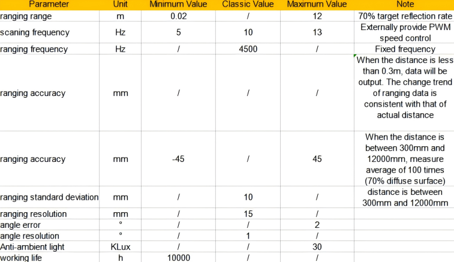

# 14. ROS1-Lidar Course

## 14.1 Introduction to Lidar

### 14.1.1 Introduction to Lidar

Lidar is a remote sensing device that utilizes laser technology to detect the position and speed of targets. Lidar offers high-ranging resolution, strong penetrability, excellent anti-interference ability, and remarkable anti-stealth capability.

There are three types of Lidar based on ranging principles: Triangulation Lidar, Pulse Lidar, and Coherent Lidar. The Lidar used by PuppyPi is a Pulse Lidar.


### 14.1.2 Lidar Working Principle

Lidar is composed of laser emitting system, scanning system, laser receiving system and signal processing system.

Firstly, laser emitting system will send the detection signal (laser beam), and the scanning system takes charge of scanning the surrounding to receive the related information.

Next, the laser receiving system will receive the laser reflected by the target object to generate receiving signal.

Lastly, the signal system will process the receiving signal to get the features of the target, such as shape and physical properties (position, height and speed), then build the model.

### 14.1.3 Lidar Parameter

The specifications of the laser radar used in the PuppyPi robot dog are as follows:

(1)  Electrical and Mechanical Parameters 


(2) Optics Parameter 


(3) Performance Parameter 



(4) Interface and Communication Protocol 

LD19 connects to the external system through ZH1.5T-4P 1.5mm connector to supply power and receive data. And the specific interface and parameter are listed on the table.


(5) Serial Port Specification 

You can connect Lidar to external system through the interfaces on Lidar. Based on communication protocol, it can acquire the point cloud data, device information and device status in real-time. And you can also set the working mode.


## 14.2 Lidar Ranging Principle

### 14.2.1 Lidar Ranging

Lidar can range the distance in two ways, including triangulation ranging and TOF.

The working principle of TOF is as pictured. Firstly, Lidar will cast the light on the object, and the object will reflect the light on the Lidar. Then Lidar will calculate the time taken for light to return, and multiply the time times the speed of light to get the distance between object and it.


Triangulation ranging is as the picture shown. During Lidar production, its angle of light casting on the object will be adjusted to let the light not directly hit on the object, but at a certain angle. This angle is set in advance and will not change during operation. And we can calculate the distance from the object to the Lidar by substituting this angle into the trigonometric function.


### 14.2.2 Lidar Working Result

Its working result is as follows. Lidar will emit light and shine it on the object surface. When receiving the light reflected by the object, Lidar will mark the contour of the object at the position where the light is reflected.


## 14.3 Lidar Obstacle Avoidance

If you want to know how to connect PuppyPi Pro to the APP, please refer to the material in "[**2. APP and Handle Control / 2.1 APP Installation and Connection**](https://docs.hiwonder.com/projects/PuppyPi/en/latest/docs/2_play_first_hand.html#app-installation-and-connection)"

### 14.3.1 Operation Steps

* **Turn on via APP**

(1) Open **"WonderPi"** APP, and connect it to PuppyPi.

(2) Select **"Lidar"** to enter the game interface.


(3) Click **"Avoid obstacle"** to start the game.


* **Turn on via Command**

:::{Note}
this game doesn't require closing the auto-start service of APP. If the auto-start service has already been closed, you can input the command "**sudo systemctl restart start_node.service**" to restart the auto-start service, and wait for the robot's buzzer to beep once.
:::

(1)  Turn on PuppyPi and connect it to the Raspberry Pi desktop through VNC.

(2)  Click the upper left icon  to open Terminator terminal.

(3)  Input command and press Enter to enter Lidar program.

```bash
rosservice call /lidar_app/enter "{}"
```

(4) After the device is successfully starting, input command and press Enter to turn on Lidar program.

```bash
rosservice call /lidar_app/set_running "data: 1"
```

:::{Note}
the effect is the same as when using the app. If you need to check the source code, you can find "**lidar.py**" in the "**/home/pi/puppy_pi/src/lidar_app/scripts**".
:::

(5) Input command and press Enter to stop this program.

```bash
rosservice call /lidar_app/set_running "data: 0"
```

(6) Then input command and press Enter to close Lidar obstacle avoidance program.

```bash
rosservice call /lidar_app/exit "{}"
```

:::{Note}
the game will continue to run while not exited, under the current power-on state of the Raspberry Pi. To avoid excessive consumption of the Raspberry Pi's operating memory, if you need to execute other game, please first close the current game according to the above instructions.
:::

### 14.3.2 Program Outcome

Here, we use a book as the object to be detected. It is important to note that when using the lidar tracking function, the object to be detected should be higher than the scanning height of the lidar. This allows PuppyPi onboard lidar to effectively scan its position information. Then, the PuppyPi moves straight ahead. When an obstacle is detected, the PuppyPi will automatically turn to avoid the obstacle.


### 14.3.3 Program Analysis

- #### Launch Brief Analysis

The Launch file path is **/home/ubuntu/puppy_pi/src/lidar_app/launch/**

First, launch the lidar with the following command: `$(find ldlidar)/launch/LD06.launch`. 

Then, start a node named lidar_app, using the lidar.py file from the lidar_app package. The parameters **output="screen"** indicate that the node's output will be displayed in the terminal, while "**respawn='false'**" means that the node will not restart if it unexpectedly terminates.

"**lidar.py**" is the source code file of this program, you can check it in this path "/home/ubuntu/puppy_pi/src/lidar_app/scripts/".

- #### Source Code Program Brief Analysis

The source code of this program is stored in：[/home/ubuntu/puppypi/src/lidar_app/scripts/lidar.py](https://store.hiwonder.com.cn/docs/PuppyPi/pi5/source_code/19/lidar.py)

(1) Initialization

```py
class LidarController:
    def __init__(self, name):
        rospy.init_node(name, anonymous=True,log_level=rospy.DEBUG)
        # rospy.on_shutdown(self.cleanup)
        self.name = name
        self.running_mode = 0 # 1：雷达避障模式 2：雷达警卫模式，(1: Radar obstacle avoidance mode 2: Radar guard mode)
        self.threshold = 0.3 # meters  距离阈值(distance threshold)
        self.scan_angle = math.radians(90)  # radians  向前的扫描角度(the forward scanning angle)
        self.speed = 0.12 # 单位米，避障模式的速度(the speed in meters per second for obstacle avoidance mode)
        self.last_act = 0
        self.timestamp = 0
        self.lock = RLock()
        self.lidar_sub = None
        self.velocity_pub = rospy.Publisher('/cmd_vel_nav', geo_msg.Twist, queue_size=1)
        self.velocity_pub.publish(geo_msg.Twist())
        # self.lidar_sub = rospy.Subscriber('/scan', sensor_msg.LaserScan, self.lidar_callback) 
```

`rospy.init_node(name, anonymous=True)`: Initialize a ROS node, using the provided name as the node's name, and set anonymous to True. 

`self.name`: Store the incoming name as an attribute of the object. Other attributes include some parameters controlling the Lidar, such as operation mode, threshold, scanning angle, speed, etc.

`self.lock`: A thread lock has been created for secure access in a multi-threaded environment.

(2) Create ROS service

```py
enter_srv = rospy.Service('/%s/enter'%ROS_NODE_NAME, Trigger, enter_func)
exit_srv = rospy.Service('/%s/exit'%ROS_NODE_NAME, Trigger, exit_func)
heartbeat_srv = rospy.Service('/%s/heartbeat'%ROS_NODE_NAME, SetBool, heartbeat_srv_cb)

set_running_srv = rospy.Service("/%s/set_running"%ROS_NODE_NAME, SetInt64, set_running_srv_callback)
set_parameters_srv = rospy.Service("/%s/set_parameters"%ROS_NODE_NAME, SetFloat64List, set_parameters_srv_callback)
```

A ROS service named `/enter` has been created with the type Trigger, and the callback function is set to enter_func. When this service is called, it will execute the enter_func function.

A ROS service named `/exit` has been created with the type Trigger, and the callback function is set to exit_func. When this service is called, it will execute the exit_func function.
A ROS service named `/set_running` has been created with the type SetInt64, and the callback function is set to set_running_srv_callback. When this service is called, it will execute the set_running_srv_callback function.

A ROS service named `/set_parameters` has been created with the type SetFloat64List, and the callback function is set to set_parameters_srv_callback. When this service is called, it will execute the set_parameters_srv_callback function.

A Heart object has been created, using the ROS topic `/%s/heartbeat`, with a set interval of 5 seconds. This is used to execute the heartbeat_srv_cb function when a message is triggered.

(3) Lidar obstacle avoidance

```py
#避障(obstacle avoidance)
if self.running_mode == 1 and self.timestamp <= time.time():
     if abs(angle) < self.scan_angle/2 and dist < self.threshold:
         twist.linear.x = self.speed / 6
         twist.angular.z = self.speed * 3 * -np.sign(angle)
         self.timestamp = time.time() + 0.8

      else:
          twist.linear.x = self.speed
          twist.angular.z = 0
      self.velocity_pub.publish(twist)
```

## 14.4 Lidar Following

If you want to know how to connect PuppyPi Pro to the APP, please refer to the material in "[**2.APP and Handle Control->2.1App Installation and Connection**](https://docs.hiwonder.com/projects/PuppyPi/en/latest/docs/2_play_first_hand.html#app)".

### 14.4.1 Operation Steps

* **Turn on via APP**

(1) Open **"WonderPi"** APP, and connect it to PuppyPi.

(2) Select **"Lidar"** to enter the game interface.


(3) Click **Lidar following** to start the game.


* **Turn on via Command**

:::{Note}
 this game doesn't require closing the auto-start service of APP. If the auto-start service has already been closed, you can input the command "**sudo systemctl restart start_node.service**" to restart the auto-start service, and wait for the robot's buzzer to beep once.
:::

(1) Turn on PuppyPi and connect it to the Raspberry Pi desktop through VNC.

(2) Click the upper left icon  to open the Terminator terminal.

(3) Input command and press Enter to enter Lidar program.

```bash
rosservice call /lidar_app/enter "{}"
```

(4) After the device is successfully starting, input command and press Enter to turn on Lidar program.

```bash
rosservice call /lidar_app/set_running "data: 2"
```

:::{Note}
the effect is the same as when using the app. If you need to check the source code, you can find "**lidar.py**" in the "**/home/ubuntu/puppy_pi/src/lidar_app/scripts**".
:::

(5) Input command and press Enter to stop this program.

```bash
rosservice call /lidar_app/set_running "data: 0"
```

(6) Then input command and press Enter to close Lidar obstacle avoidance program.

```bash
rosservice call /lidar_app/exit "{}"
```

:::{Note}
the game will continue to run while not exited, under the current power-on state of the Raspberry Pi. To avoid excessive consumption of the Raspberry Pi's operating memory, if you need to execute other game, please first close the current game according to the above instructions.
:::

### 14.4.2 Program Outcome

Here, we use a book as the object to be detected. It is important to note that when using the lidar tracking function, the object to be detected should be higher than the scanning height of the lidar. This allows PuppyPi onboard lidar to effectively scan its position information. Then, the PuppyPi will adjust it's position to maintain a distance of approximately 0.35 meters between itself and the obstacle at all times.

### 14.4.3 Program Analysis

(1)  Launch Brief Analysis 

The Launch file path is `/home/ubuntu/puppy_pi/src/lidar_app/launch/`

First, launch the lidar with the following command: "**$(find ldlidar)/launch/LD06.launch**". Then, start a node named lidar_app, using the lidar.py file from the lidar_app package. The parameters "**output='screen'**" indicate that the node's output will be displayed in the terminal, while "**respawn='false'**" means that the node will not restart if it unexpectedly terminates.

"**lidar.py**" is the source code file of this program, you can check it in this path **"/home/ubuntu/puppy_pi/src/lidar_app/scripts/".**

(2) Source Code Program Brief Analysis

Based on the implemented effects, summarize the program's process logic as shown in the diagram below: [/home/ubuntu/puppypi/src/lidar_app/scripts/lidar.py](https://store.hiwonder.com.cn/docs/PuppyPi/pi5/source_code/19/lidar.py)

① Initialization

```py
class LidarController:
    def __init__(self, name):
        rospy.init_node(name, anonymous=True,log_level=rospy.DEBUG)
        # rospy.on_shutdown(self.cleanup)
        self.name = name
        self.running_mode = 0 # 1：雷达避障模式 2：雷达警卫模式，(1: Radar obstacle avoidance mode 2: Radar guard mode)
        self.threshold = 0.3 # meters  距离阈值(distance threshold)
        self.scan_angle = math.radians(90)  # radians  向前的扫描角度(the forward scanning angle)
        self.speed = 0.12 # 单位米，避障模式的速度(the speed in meters per second for obstacle avoidance mode)
        self.last_act = 0
        self.timestamp = 0
        self.lock = RLock()
        self.lidar_sub = None
        self.velocity_pub = rospy.Publisher('/cmd_vel_nav', geo_msg.Twist, queue_size=1)
        self.velocity_pub.publish(geo_msg.Twist())
        # self.lidar_sub = rospy.Subscriber('/scan', sensor_msg.LaserScan, self.lidar_callback) 
```

`rospy.init_node(name, anonymous=True)`: Initialize a ROS node, using the provided name as the node's name, and set anonymous to True.
`self.name`: Store the incoming name as an attribute of the object. Other attributes include some parameters controlling the Lidar, such as operation mode, threshold, scanning angle, speed, etc.
`self.lock`: A thread lock has been created for secure access in a multi-threaded environment.

② Create ROS service

```py
enter_srv = rospy.Service('/%s/enter'%ROS_NODE_NAME, Trigger, enter_func)
exit_srv = rospy.Service('/%s/exit'%ROS_NODE_NAME, Trigger, exit_func)
heartbeat_srv = rospy.Service('/%s/heartbeat'%ROS_NODE_NAME, SetBool, heartbeat_srv_cb)

set_running_srv = rospy.Service("/%s/set_running"%ROS_NODE_NAME, SetInt64, set_running_srv_callback)
set_parameters_srv = rospy.Service("/%s/set_parameters"%ROS_NODE_NAME, SetFloat64List, set_parameters_srv_callback)
```

A ROS service named `/enter` has been created with the type Trigger, and the callback function is set to enter_func. When this service is called, it will execute the enter_func function.
A ROS service named `/exit` has been created with the type Trigger, and the callback function is set to exit_func. When this service is called, it will execute the exit_func function.
A ROS service named `/set_running` has been created with the type SetInt64, and the callback function is set to set_running_srv_callback. When this service is called, it will execute the set_running_srv_callback function.
A ROS service named `/set_parameters` has been created with the type SetFloat64List, and the callback function is set to set_parameters_srv_callback. When this service is called, it will execute the set_parameters_srv_callback function.
A Heart object has been created, using the ROS topic `/%s/heartbeat`, with a set interval of 5 seconds. This is used to execute the heartbeat_srv_cb function when a message is triggered.

③ Lidar obstacle avoidance

```py
# 追踪(tracking)
elif self.running_mode == 2 and self.timestamp <= time.time():

     if abs(angle) < self.scan_angle/2:
          if dist < self.threshold and abs(math.degrees(angle)) > 10: # 控制左右(control the left and the right)
              twist.linear.x = 0.01 # x方向的校正(correction in the x-direction)
              twist.angular.z = self.speed * 3 * np.sign(angle)
              self.timestamp = time.time() + 0.4
           else:
               if dist < self.threshold and dist > 0.35:
                    twist.linear.x = self.speed
                    twist.angular.z = 0
                    self.timestamp = time.time() + 0.4
                else:
                     twist.linear.x = 0
                     twist.angular.z = 0
       else:
            twist.linear.x = 0
             twist.angular.z = 0
       self.velocity_pub.publish(twist)
```

## 14.5 Lidar Guarding

If you want to know how to connect PuppyPi Pro to the APP, please refer to the material in "[**2.APP and Handle Control->2.1App Installation and Connection**](https://docs.hiwonder.com/projects/PuppyPi/en/latest/docs/2_play_first_hand.html#app-installation-and-connection)".

### 14.5.1 Operation Steps

* **Turn on via APP**

(1) Open **"WonderPi"** APP, and connect it to PuppyPi.

(2) Select **"Lidar"** to enter the game interface.

 

(3) Click **"Lidar guarding"** to start the game.

 

* **Turn on via Command**

:::{Note}
 this game doesn't require closing the auto-start service of APP. If the auto-start service has already been closed, you can input the command "**sudo systemctl restart start_node.service**" to restart the auto-start service, and wait for the robot's buzzer to beep once.
:::

(1) Turn on PuppyPi and connect it to the Raspberry Pi desktop through VNC.

(2) Click the upper left icon  to open the Terminator terminal.

(3) Input command and press Enter to enter Lidar program.

```bash 
rosservice call /lidar_app/enter "{}"
```

(4) After the device is successfully starting, input command and press Enter to turn on Lidar program.

```bash 
rosservice call /lidar_app/set_running "data: 3"
```

:::{Note}
the effect is the same as when using the app. If you need to check the source code, you can find "**[lidar.py](https://store.hiwonder.com.cn/docs/PuppyPi/pi5/source_code/19/lidar.py)**"  in the "/home/ubuntu/puppy_pi/src/lidar_app/scripts".
:::

(5) Input command and press Enter to stop this program.

```bash 
rosservice call /lidar_app/set_running "data: 0"
```

(6) Then input command and press Enter to close Lidar obstacle avoidance program.

```bash 
rosservice call /lidar_app/exit "{}"
```

:::{Note}
the game will continue to run while not exited, under the current power-on state of the Raspberry Pi. To avoid excessive consumption of the Raspberry Pi's operating memory, if you need to execute other game, please first close the current game according to the above instructions.
:::

### 14.5.2 Program Outcome

Here, we use a book as the object to be detected. It is important to note that when using the lidar tracking function, the object to be detected should be higher than the scanning height of the lidar. This allows PuppyPi onboard lidar to effectively scan its position information. Then, the PuppyPi will adjust its orientation so that its body faces the obstacle, with the camera directly faing the obstacle.

### 14.5.3 Program Analysis

(1) Launch Brief Analysis

The Launch file path is `/home/ubuntu/puppy_pi/src/lidar_app/launch/`

First, launch the lidar with the following command: "**$(find ldlidar)/launch/LD06.launch**". Then, start a node named lidar_app, using the lidar.py file from the lidar_app package. The parameters "**output='screen'**" indicate that the node's output will be displayed in the terminal, while "**respawn='false'**" means that the node will not restart if it unexpectedly terminates.

"**lidar.py**" is the source code file of this program, you can check it in this path `/home/ubuntu/puppy_pi/src/lidar_app/scripts/`.

(2) Source Code Program Brief Analysis

The source code of this program is stored in **[/home/ubuntu/puppypi/src/lidar_app/scripts/lidar.py](https://store.hiwonder.com.cn/docs/PuppyPi/pi5/source_code/19/lidar.py)**

① Initialization

```py
class LidarController:
    def __init__(self, name):
        rospy.init_node(name, anonymous=True,log_level=rospy.DEBUG)
        # rospy.on_shutdown(self.cleanup)
        self.name = name
        self.running_mode = 0 # 1：雷达避障模式 2：雷达警卫模式，(1: Radar obstacle avoidance mode 2: Radar guard mode)
        self.threshold = 0.3 # meters  距离阈值(distance threshold)
        self.scan_angle = math.radians(90)  # radians  向前的扫描角度(the forward scanning angle)
        self.speed = 0.12 # 单位米，避障模式的速度(the speed in meters per second for obstacle avoidance mode)
        self.last_act = 0
        self.timestamp = 0
        self.lock = RLock()
        self.lidar_sub = None
        self.velocity_pub = rospy.Publisher('/cmd_vel_nav', geo_msg.Twist, queue_size=1)
        self.velocity_pub.publish(geo_msg.Twist())
        # self.lidar_sub = rospy.Subscriber('/scan', sensor_msg.LaserScan, self.lidar_callback)
```

`rospy.init_node(name, anonymous=True)`: Initialize a ROS node, using the provided name as the node's name, and set anonymous to True.

`self.name`: Store the incoming name as an attribute of the object. Other attributes include some parameters controlling the Lidar, such as operation mode, threshold, scanning angle, speed, etc.

`self.lock`: A thread lock has been created for secure access in a multi-threaded environment.

② Create ROS service

```py
enter_srv = rospy.Service('/%s/enter'%ROS_NODE_NAME, Trigger, enter_func)
exit_srv = rospy.Service('/%s/exit'%ROS_NODE_NAME, Trigger, exit_func)
heartbeat_srv = rospy.Service('/%s/heartbeat'%ROS_NODE_NAME, SetBool, heartbeat_srv_cb)

set_running_srv = rospy.Service("/%s/set_running"%ROS_NODE_NAME, SetInt64, set_running_srv_callback)
set_parameters_srv = rospy.Service("/%s/set_parameters"%ROS_NODE_NAME, SetFloat64List, set_parameters_srv_callback)
```

A ROS service named `/enter` has been created with the type Trigger, and the callback function is set to enter_func. When this service is called, it will execute the enter_func function.

A ROS service named `/exit` has been created with the type Trigger, and the callback function is set to exit_func. When this service is called, it will execute the exit_func function.

A ROS service named `/set_running` has been created with the type SetInt64, and the callback function is set to set_running_srv_callback. When this service is called, it will execute the set_running_srv_callback function.

A ROS service named `/set_parameters` has been created with the type SetFloat64List, and the callback function is set to set_parameters_srv_callback. When this service is called, it will execute the set_parameters_srv_callback function.

A Heart object has been created, using the ROS topic "**/%s/heartbeat**", with a set interval of 5 seconds. This is used to execute the heartbeat_srv_cb function when a message is triggered.

③ Lidar guarding

```py
# 警卫看守(guard duty)
elif self.running_mode == 3 and self.timestamp <= time.time():

    if dist < self.threshold and abs(math.degrees(angle)) > 10 :
   #and abs(angle) < self.scan_angle/2: # 控制左右(control the left and the right)
        twist.linear.x = 0.01 # x方向的校正(correction in the x-direction)
        twist.angular.z = self.speed * 3 * np.sign(angle)
        self.timestamp = time.time() + 0.4
    else:
        twist.linear.x = 0
        twist.angular.z = 0
    self.velocity_pub.publish(twist)
```
