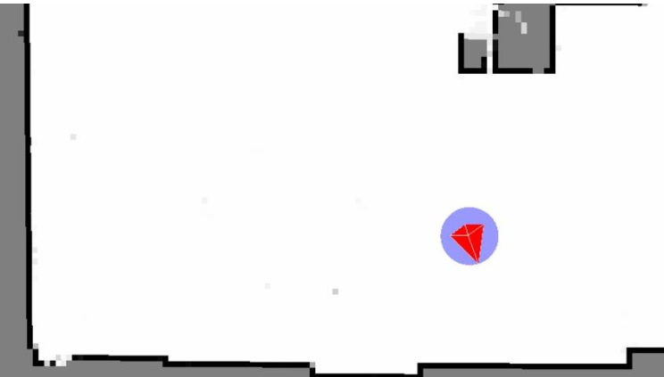
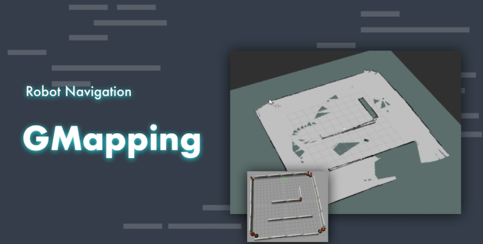
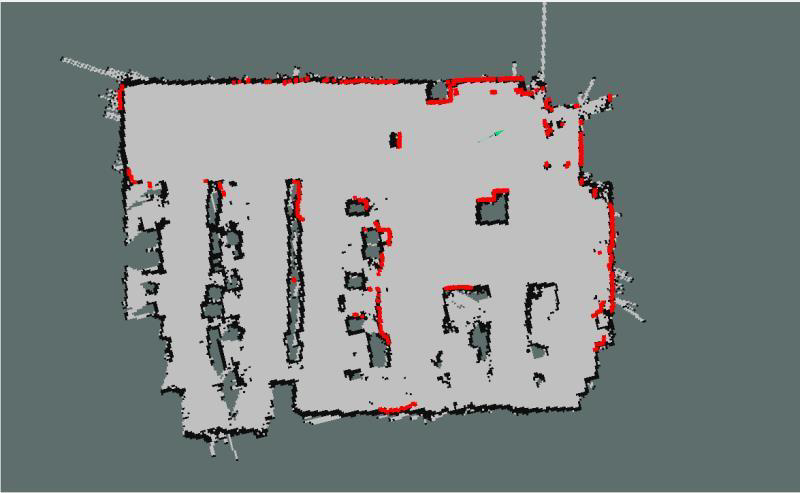
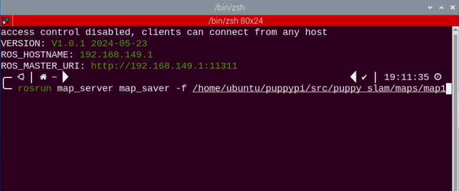

# 15. ROS1-SLAM Mapping Course

## 15.1 SLAM Mapping Principle

### 15.1.1 SLAM Introduction

Before starting the journey, both humans and robots need to know their current location. However, the way they do it differs. Humans use their eyes, while robots use Lidar sensors.

SLAM (Simultaneous Localization and Mapping) comprises two processes: localization and mapping. Localization determines the robot's position in the coordinate system. The origin of the coordinate system and the robot's pose can be determined using the first keyframe, the existing global map, road sign points, and GPS.

Mapping involves creating a map of the robot's surroundings. The primary geometric element of this map is a point. Navigation involves two parts: global planning/local planning and the control of the robot's movements.

### 15.1.2 Mapping Principle

Mapping contains three main processes:

(1)  Preprocessing: optimize the original point cloud data of Lidar by removing any wrong data and filtering it.

(2)  Matching: find the position on the map that corresponds to the point cloud data collected in a local area.

(3) Map integration: integrate the latest data received by Lidar into the existing map to update it. 
Lidar uses a pulse laser as the signal source to scan the surrounding obstacles and gather information about the target points. The scattered laser will then be reflected on the receiver of Lidar, enabling it to calculate the distance from the target points. By scanning the target points, the Lidar can gather data for all points and create a 3D image through processing.

### 15.1.3 Mapping Skill

(1) Place the robot in front of a wall or a box before enabling mapping, which allows the robot to scan more points.



(2) Try to keep the robot moving straight instead of turning to avoid sparse feature point collection by the Lidar. When the features in the environment are weak, it's best to map areas where feature points are obvious to improve accuracy.


(3) To map large environments effectively, it's recommended that the robot completes the mapping loop first and then focuses on scanning smaller details in the environment.

In environments like shopping malls, which have a lot of transparent glass and unclear environmental features, it's helpful to stop the robot at a suitable location if there are distinct features ahead, such as columns, left and right passages, or diagonal walls. The robot can then rotate in place towards the feature position and wait until the Lidar has scanned the feature environment before rotating back and continuing forward. However, it's best to avoid backing up during the rotation process to ensure accurate mapping.


### 15.1.4 Evaluation of Map Building Results

After the map construction is completed, the following points can be used to determine if the results meet the navigation requirements:

(1)  Whether the edges of obstacles in them map are clear.

(2)  Whether there are areas in the map that do not match the actual environment (e.g. loop closures).

(3) Whether there are gray areas within the robot's operational area in the map (e.g. unscanned areas).

(4) Whether there are obstacles in the map that will not exist during subsequent localization (e.g. moving obstacles).

(5) Whether the map ensures that the robot has explored every position within its operational area, with a 360-degree field of view.

### 15.1.5 The Differences of Mapping Algorithms

The robotic mapping function package is called puppy_slam, and it comes with pre-installed mapping algorithms Gmapping, Hector, and Karto. Different mapping algorithms can be started through the slam.launch file in the package. The table below provides a brief comparison of the various mapping algorithms for users to quickly understand (detailed descriptions of each algorithm can be found later). Users can choose the most suitable mapping algorithm based on their specific needs and environmental conditions.

| Algorithm | Accuracy | Real-time Performance | Computational Complexity | Requirements | Suitable Scenarios |
|:--:|:--:|:--:|:--:|:--:|:--:|
| Gmapping | High | Real-time | Medium | Requires high perceptibility of features and environment in the map | Small to medium-sized indoor environments requiring real-time mapping and precision. |
| Hector | Relatively accurate | Real-time | Low | Requires high update rate of laser data to adapt to the needs of fast-moving robots. | Robots with fast movement and environments with motion blur. |
| Karto | Relatively accurate | Real-time | Medium | Requires high requirements for features and structures in the environment to achieve accurate scan matching and mapping. At the same time, it has low computational resource requirements, suitable for platforms with limited resources. | Small environments, scenes with limited computational resources or low device performance. |

## 15.2 Gmapping Mapping Algorithm

:::{Note}
before mapping, please ensure PuppyPi is with sufficient power, and it is better to fully charge the robot.
:::

### 15.2.1 Gampping Introduction

The theoretical concept of Gmapping is relatively simple. It is an open-source SLAM algorithm based on the Rao-Blackwellized Particle Filter (RBPF) algorithm. The Gmapping algorithm separates the process of localization and mapping. It first performs localization using the particle filter algorithm and then performs scan matching between particles and the generated map. It continuously corrects odometry errors and adds new scans to the map.

As the scene size increases, the number of particles required will also increase. However, since each particle needs to carry a copy of the map, this leads to excessive computational and memory consumption for constructing large maps. Therefore, the Gmapping algorithm is more suitable for building small-scale maps.



### 15.2.2 Gmapping Principle

The implementation process of the Gmapping algorithm roughly involves predicting the current pose based on the map from the previous time step and the motion model. Then, weights are calculated based on sensor observations, resampling is performed, and particle maps are updated. This process repeats iteratively to complete map construction.

Gmapping makes two main improvements over the RBPF algorithm: improving the proposal distribution and implementing selective resampling.

Compared to other mapping algorithms, the advantages and disadvantages of the Gmapping algorithm are also quite significant.

The advantages of the Gmapping algorithm lie in its ability to construct indoor maps in real time, with lower computational requirements and higher accuracy for building small-scale maps. Compared to Hector, Gmapping has lower requirements for laser frequency and higher robustness. Hector is prone to errors in matching when the robot turns quickly, leading to misalignment in the generated map. This is mainly because the optimization algorithm is prone to getting stuck in local minima. Compared to Cartographer, Gmapping requires fewer particles and does not require loop detection when constructing small-scale maps, resulting in lower computational requirements than Cartographer while maintaining similar accuracy.

Gmapping effectively utilizes wheel odometry information, which is also why Gmapping has lower requirements for laser frequency: odometry can provide prior pose information for the robot. However, Hector and Cartographer were not originally designed to address the localization and mapping of ground robots. Hector is mainly used for uneven ground conditions such as disaster relief, where odometry cannot be used. Similarly, Cartographer is designed for handheld LiDAR devices to perform the SLAM process, so there is no odometry available.

The drawback of the Gmapping algorithm is that as the scene size increases, the required number of particles increases. Each particle carries a map, leading to increased memory and computational requirements when building large maps. Therefore, it is not suitable for constructing large-scale maps. Additionally, it lacks loop detection, which can cause map misalignment when loop closures occur. Although increasing the number of particles can help close the map, it comes at the cost of increased computational and memory resources. Therefore, it cannot build large maps like Cartographer. Despite claims of generating maps of tens of thousands of square meters in research papers, errors may occur in practical use even with maps of only a few thousand square meters.

Gmapping and Cartographer are two SLAM algorithms based on different frameworks: Gmapping is based on a filtering framework, while Cartographer is based on an optimization framework. Both algorithms involve a trade-off between time complexity and space complexity. Gmapping sacrifices space complexity to ensure time complexity, which makes it unsuitable for constructing large-scale maps. For example, consider building a map of a 200x200 meter environment with a grid resolution of 5 centimeters, where each grid occupies one byte of memory. In this case, each particle carrying a map would require 16 MB of memory. With 100 particles, this would require 1.6 GB of memory. If the map size increases to 500x500 meters with 200 particles, it could potentially lead to system crashes due to memory constraints.

Looking at the Cartographer algorithm, optimization is akin to using only one particle in the map, resulting in significantly smaller storage space compared to Gmapping. However, it requires a large amount of computation, making it difficult for regular laptops to generate good maps, or even run the algorithm at all. Optimization graphs involve complex matrix operations, which is why Google developed the Ceres library.

* Gmapping learning Wiki: http://wiki.ros.org/gmapping

* Slam_Gmapping software package: https://github.com/ros-perception/slam_gmapping

* OpenSlam_Gmapping open source algorithm: https://github.com/ros-perception/openslam_gmapping

### 15.2.3  Virtual Machine Installation and Configuration

Due to the limited computing power of Raspberry Pi, virtual machine will take over part of mapping work. Mapping and navigation both require communication between the virtual machine and PuppyPi, so we need to modify the configurations of both.

* **Open and Import Virtual Machine**

(1) Extract the virtual machine files from the directory to any non-Chinese path you prefer.


(2) Open a virtual machine.


(3)  Select the folder where virtual machine file is extracted, then open it.


(4) Set the name and storage path of the virtual machine according to your needs. Once set, click on **"Import"** to proceed.


:::{Note}
after the first importing, you can directly select the storage path for the previous virtual machine, and open it without importing it again.
:::

* **Network Configuration of Virtual Machine**

:::{Note}
if you are using desktop computer, please prepare a wireless LAN adapter or USB wireless adapter.
:::

(1) Firstly, start PuppyPi, and join the WiFi created by PuppyPi on computer.


(2)  Return to the virtual machine interface, and click **"edit->virtual machine editor"**.


(3) Select the wireless network card to be bridged. Then click OK.


(4)  Open virtual machine, and power on virtual machine.


(5) When entering the system desktop, right click the desktop and select **"open in terminal"**.


:::{Note}
The input command should be case sensitive and the keywords can be complemented by **"Tab"** key.
:::

(6) Input command **"ifconfig"** and press Enter to check the IP of virtual machine. And the IP is as the red frame shown.

```bash
ifconfig
```


(7) Right click the system desktop, and open a new command line terminal. Then input command and press Enter to configure the network.

```bash
sudo nano /etc/hosts
```

(8) Modify the IP in the second and the third lines as the IP of virtual machine and Raspberry Pi you got in the previous step. And the fixed IP of Raspberry Pi under direct connection mode is **"192.168.149.1"**.


:::{Note}
 When modifying the IP, please ensure the indent is consistent.
:::

(9)  After modification, press Ctrl+x, and Y key to save modified buffer, then press Enter.


* **PuppyPi Network Configuration**

(1) Get access to Raspberry Pi desktop via VNC.

(2) Click  or use shortcut **"Ctrl+Alt+T"** to open terminal

(3) Enter command and press Enter to change network configuration.

```bash
sudo vim /etc/hosts
```

(4) Find the code marked in the below figure, then enter the IP of virtual machine which can be obtained in step 1.2. After that, press **"Esc"** key, enter **":wq"** and press Enter key to save and exit.  

```bash
:wq
```


(5) Input command and press Enter to update the configuration.

```bash
source .bashrc
```

### 15.2.4  Enable Lidar Mapping

:::{Note}
The input command should be case sensitive, and the keyword can be complemented by "**Tab**" key.
:::

(1) Firstly, control PuppyPi with PS2 wireless handle to move around for perceiving the surrounding and start mapping. Turn on the handle, then press START button.

(2) Connect to Raspberry Pi desktop through VNC.

(3) Click  or press **"Ctrl+Alt+T"** to open the Terminator terminal.

(4) Input command, and press Enter to enable mapping service.

```bash
roslaunch puppy_slam gmapping.launch
```

(5) Open the virtual machine and open the terminal. Then input command and press Enter to enable the node to display URDF model.

```bash
rosparam set /puppy_control/joint_state_pub_topic true
```

(6) Enter command and press Enter to open the tool to view mapping process.

```bash
roslaunch puppy_description rviz_with_urdf.launch
```

(7) Click **"File->Open Config"** to open configuration file.


(8) Move to the folder **"puppy/puppy_sim/src/puppy_description"**, select "**mapping.rviz**" folder and open it.


(9) After a while, map will appear as pictured.


(10) Then you can use the wireless handle to control the robot dog to move to anywhere. As PuppyPi is moving, the map will become complete. For how to control PuppyPi to move with handle, please refer to the table below.

:::{Note}
 If PuppyPi is stuck during walking, you can close VNC which has occupied part of CPU.
:::

<!DOCTYPE html>
<html>
<head>
    <title>Controller Functions</title>
    <style>
        table {
            border-collapse: collapse;
            width: 100%;
            max-width: 600px;
            margin: 20px auto;
            font-family: Arial, sans-serif;
        }
        th, td {
            border: 1px solid #dddddd;
            text-align: left;
            padding: 12px;
        }
        th {
            background-color: #f2f2f2;
            font-weight: bold;
        }
        tr:nth-child(even) {
            background-color: #f9f9f9;
        }
        caption {
            font-size: 1.2em;
            margin-bottom: 10px;
            font-weight: bold;
        }
    </style>
</head>
<body>
    <table>
        <caption>Controller Functions</caption>
        <thead>
            <tr>
                <th>Button</th>
                <th>Function</th>
            </tr>
        </thead>
        <tbody>
            <tr>
                <td>START</td>
                <td>Reset body to initial posture</td>
            </tr>
            <tr>
                <td>L1</td>
                <td>Pitch up</td>
            </tr>
            <tr>
                <td>L2</td>
                <td>Pitch down</td>
            </tr>
            <tr>
                <td>R1</td>
                <td>Lean forward</td>
            </tr>
            <tr>
                <td>R2</td>
                <td>Lean backward</td>
            </tr>
            <tr>
                <td>↑ / Left stick up</td>
                <td>Move forward</td>
            </tr>
            <tr>
                <td>↓ / Left stick down</td>
                <td>Move backward</td>
            </tr>
            <tr>
                <td>← / Left stick left</td>
                <td>Turn left</td>
            </tr>
            <tr>
                <td>→ / Left stick right</td>
                <td>Turn right</td>
            </tr>
            <tr>
                <td>△ / Right stick up</td>
                <td>Increase body height</td>
            </tr>
            <tr>
                <td>× / Right stick down</td>
                <td>Decrease body height</td>
            </tr>
            <tr>
                <td>□ / Right stick left</td>
                <td>Decrease speed (use with "↑" or "↓")</td>
            </tr>
            <tr>
                <td>○ / Right stick right</td>
                <td>Increase speed (use with "↑" or "↓")</td>
            </tr>
        </tbody>
    </table>
</body>
</html>

(11) After PuppyPi has traveled around the surrounding, you need to save the map to Raspberry Pi. Return back to VNC, and open a new terminal, then input command. 

```bash
rosrun map_server map_saver -f /home/ubuntu/puppypi/src/puppy_slam/maps/map1
```

Map1 is the name of the map, and you change it. Press Enter, and after a while, the map will be kept in the specific path.

(12) open the file manager, and you can find the map under the path, "**/home/ubuntu/puppy_pi/src/puppy_slam/maps/**".


(13) At this time, SLAM mapping comes to the end. And you can press Crtl+C on terminal interface.

## 15.3 Hector Mapping Algorithm

:::{Note}
before mapping, please ensure PuppyPi is with sufficient power, and it is better to fully charge the robot.
:::

### 15.3.1 Hector Introduction 

The Hector algorithm utilizes the Gauss-Newton iteration method and is capable of constructing maps solely based on laser information.

The Hector algorithm does not require odometry data, making it suitable for uneven ground scenarios such as disaster relief. However, since it relies on laser data to estimate odometry information, this algorithm has higher requirements for the frame rate of the laser scanner.

The overall mapping accuracy of the Hector algorithm is generally better than that of the Gmapping algorithm. However, Hector requires higher parameter configuration, while Gmapping is known for its ease of use.



### 15.3.2 Hector Principle

The Hector algorithm utilizes the Gauss-Newton iteration method to solve the scan matching problem. Scan matching involves constructing an error function using the current frame and existing map data, and then utilizing the Gauss-Newton iteration method to obtain the optimal solution and deviation. The specific implementation process is as follows:
Firstly, at the initial moment, it's necessary to align the coordinates of the LiDAR sensor with the grid map coordinate system. This alignment allows us to obtain the initial pose of the LiDAR sensor in the map, as well as the coordinates of the first scan data frame of the LiDAR in the map.
Subsequently, the next step involves acquiring the second frame of scan data from the LiDAR and measuring its coordinates in the map. At this point, the relative position relationship between the second frame and the first frame is unknown.
Continuing, the next step involves matching these two frames of data. Assuming the two frames are infinitesimally close, the position increment is calculated through steps such as constructing a least squares method. By adding the position increment to the pose of the first frame, we can obtain the pose of the second frame in the map coordinate system.
Finally, based on the pose of the second frame's scan data, calculate its coordinates in the map, effectively mapping it onto the map. By continuously repeating the above steps, the mapping process can be completed.
The algorithm process of Hector is as shown in the figure below:


The diagram above serves not only as the algorithm flowchart for Hector SLAM but also as the structural diagram for the Hector source code. Users can refer to this diagram for code organization and study when learning the Hector SLAM algorithm in the later stages.

HectorSLAM related source code and WIKI address:

Hector Mapping ROS Wiki: http://wiki.ros.org/hector_mapping

Hector_slam software package: https://github.com/tu-darmstadt-ros-pkg/hector_slam 


### 15.3.3 Virtual Machine Installation and Configuration

Due to the limited computing power of Raspberry Pi, virtual machine will take over part of mapping work. Mapping and navigation both require communication between the virtual machine and PuppyPi. We need to modify the configurations of both to enable this.

* **Install Virtual Machine**

You can refer to the document **"[Virtual Machine Installation](#anchor_14_2_3_1)"** in the same directory for instructions on installing the virtual machine.

* **Open and Import Virtual Machine**

(1) Extract the virtual machine files from the directory to any non-Chinese path you prefer.


(2) Open a virtual machine.


(3) Select the folder where virtual machine file is extracted, then open it.


(4)  Enter the name and set the storage path for virtual machine. Then click **"Import"**.


:::{Note}
After the first importing, you can directly select the storage path for the previous virtual machine, and open it without importing it again.
:::

* **Network Configuration of Virtual Machine**

:::{Note}
if you are using desktop computer, please prepare a wireless LAN adapter or USB wireless adapter.
:::

(1) Firstly, start PuppyPi, and join the WiFi created by PuppyPi on computer.


(2) Return to the virtual machine interface, and click **"edit->virtual machine editor"**.


(3) Select the wireless network card to be bridged. Then click OK.


(4) Open virtual machine, and power on virtual machine.


(5) When entering the system desktop, right click the desktop and select "**open in terminal**".


:::{Note}
The input command should be case sensitive and the keywords can be complemented by **"Tab"** key.
:::

(6) Input command **"ifconfig"** and press Enter to check the IP of virtual machine. And the IP is as the red frame shown.

```bash
ifconfig
```


(7) Right click the system desktop, and open a new command line terminal. Then input command **"sudo nano /etc/hosts"** and press Enter to configure the network.

```bash
sudo nano /etc/hosts
```

(8) Modify the IP in the second and the third lines as the IP of virtual machine and Raspberry Pi you got in the previous step. And the fixed IP of Raspberry Pi under direct connection mode is "**192.168.149.1**".


:::{Note}
when modifying the IP, please ensure the indent is consistent.
:::

(9) After modification, press Ctrl+x, and Y key to save modified buffer, then press Enter.


* **PuppyPi Network Configuration**

(1) Get access to Raspberry Pi desktop via VNC.

(2)  Click  or use shortcut **"Ctrl+Alt+T"** to open terminal

(3)  Enter command and press Enter to change PuppyPi network configuration.

```bash
sudo vim /etc/hosts
```

(4) Find the code marked in the below figure, then enter the IP of virtual machine which can be obtained in step 1.2. After that, press **"Esc"** key, enter **":wq"** and press Enter key to save and exit.  

```bash
:wq
```


(5) Run the command **"source .bashrc"** and press Enter to update the configuration.

```bash
source .bashrc
```

### 15.3.4 Enable Lidar Mapping

:::{Note}
The input command should be case sensitive, and the keyword can be complemented by "**Tab**" key.
:::

(1) Firstly, control PuppyPi with PS2 wireless handle to move around for perceiving the surrounding and start mapping. Turn on the handle, then press START button.

(2) Connect to Raspberry Pi desktop through VNC.

(3) Click  to open the Terminator terminal.

(4) Input command, and press Enter to enable mapping service.

```bash
roslaunch puppy_slam hector.launch
```

(5) Open the virtual machine and open the terminal. Then input command and press Enter to enable the node to display URDF model.

```bash
rosparam set /puppy_control/joint_state_pub_topic true
```

(6) Enter command and press Enter to open the tool to view mapping process.

```bash
roslaunch puppy_description rviz_with_urdf.launch
```

(7) Click **"File->Open Config"** to open configuration file.


(8) Move to the folder **"puppy/puppy_sim/src/puppy_description"**, select **"mapping.rviz"** folder and open it.


(9) After a while, map will appear as pictured.


(10) Then you can use the wireless handle to control the robot dog to move to anywhere. As PuppyPi is moving, the map will become complete. For how to control PuppyPi to move with handle, please refer to the table below.

:::{Note}
if PuppyPi is stuck during walking, you can close VNC which has occupied part of CPU.
:::

<!DOCTYPE html>
<html>
<head>
    <title>Controller Functions</title>
    <style>
        table {
            border-collapse: collapse;
            width: 100%;
            max-width: 600px;
            margin: 20px auto;
            font-family: Arial, sans-serif;
        }
        th, td {
            border: 1px solid #dddddd;
            text-align: left;
            padding: 12px;
        }
        th {
            background-color: #f2f2f2;
            font-weight: bold;
        }
        tr:nth-child(even) {
            background-color: #f9f9f9;
        }
        caption {
            font-size: 1.2em;
            margin-bottom: 10px;
            font-weight: bold;
        }
    </style>
</head>
<body>
    <table>
        <caption>Controller Functions</caption>
        <thead>
            <tr>
                <th>Button</th>
                <th>Function</th>
            </tr>
        </thead>
        <tbody>
            <tr>
                <td>START</td>
                <td>Reset body to initial posture</td>
            </tr>
            <tr>
                <td>L1</td>
                <td>Pitch up</td>
            </tr>
            <tr>
                <td>L2</td>
                <td>Pitch down</td>
            </tr>
            <tr>
                <td>R1</td>
                <td>Lean forward</td>
            </tr>
            <tr>
                <td>R2</td>
                <td>Lean backward</td>
            </tr>
            <tr>
                <td>↑ / Left stick up</td>
                <td>Move forward</td>
            </tr>
            <tr>
                <td>↓ / Left stick down</td>
                <td>Move backward</td>
            </tr>
            <tr>
                <td>← / Left stick left</td>
                <td>Turn left</td>
            </tr>
            <tr>
                <td>→ / Left stick right</td>
                <td>Turn right</td>
            </tr>
            <tr>
                <td>△ / Right stick up</td>
                <td>Increase body height</td>
            </tr>
            <tr>
                <td>× / Right stick down</td>
                <td>Decrease body height</td>
            </tr>
            <tr>
                <td>□ / Right stick left</td>
                <td>Decrease speed (use with "↑" or "↓")</td>
            </tr>
            <tr>
                <td>○ / Right stick right</td>
                <td>Increase speed (use with "↑" or "↓")</td>
            </tr>
        </tbody>
    </table>
</body>
</html>

(11) After PuppyPi has traveled around the surrounding, you need to save the map to Raspberry Pi. Return back to VNC, and open a new terminal, then input command.

```bash
rosrun map_server map_saver -f /home/ubuntu/puppypi/src/puppy_slam/maps/map1
```

map1 is the name of the map, and you change it. Press Enter, and after a while, the map will be kept in the specific path.


(12) Click  to open the file manager, and you can find the map under the path, "**/home/pi/puppy_pi/src/puppy_slam/maps/**".


(13) At this time, SLAM mapping comes to the end. And you can press Crtl+C on terminal interface.

## 15.4 Karto Mapping Algorithm

:::{Note}
Before mapping, please ensure PuppyPi is with sufficient power, and it is better to fully charge the robot.
:::

### 15.4.1 Karto Introduction

The Karto algorithm is based on a graph optimization framework and utilizes a nonlinear least squares method to optimize the accumulated errors during the mapping process. To some extent, it replaces filter-based laser SLAM solutions.
The drawback of the Karto algorithm lies in the fact that it requires the construction of a subgraph before each local subgraph matching, which consumes a considerable amount of time.
The ROS version of Karto_SLAM utilizes Spare Pose Adjustment (SPA), which is associated with scan matching and loop closure detection. As the number of landmarks increases, the memory requirements also increase. However, the graph optimization method has a greater advantage in mapping large environments compared to other methods because it only involves a graph of points (robot pose), with the map being computed after obtaining the poses.
The algorithmic framework of Karto SLAM is illustrated in the diagram below:


From the diagram, it can be seen that the process is quite simple. The traditional soft real-time running mechanism of SLAM operates such that upon entering each frame of data, processing occurs, and then returns.

**KartoSLAM related source code and WIKI address:**

**KartoSLAM ROS Wiki:**http://wiki.ros.org/slam_karto** 

* **slam_karto software package:** https://github.com/ros-perception/slam_karto

* **open_karto open source algorithm:** https://github.com/ros-perception/open_karto

### 15.4.2 Karto Principle

The Karto algorithm is based on the principle of graph optimization, where the map is represented by the mean image, and each node represents a position point of the robot's trajectory along with a dataset of sensor measurements. Whenever a new node is added to the map, constraint calculations are performed based on the node's position to update the map information.
The data processing flow of the Karto algorithm is as follows:


First, the current pose of the robot is obtained based on odometry. Then, this pose is matched with the poses obtained after translating and rotating the robot within a certain range. Among these possible poses, the one with the highest likelihood is selected. If a single pose is obtained, it is considered as the matched pose. If multiple poses are obtained, their mean is calculated, and the resulting pose is considered as the matched pose.
Subsequently, a threshold is set for saving the laser scan data. During the scanning process, data that reaches this threshold are saved.
It's important to note that when the LiDAR moves from one area to another, this movement can result in overlap between the maps of the two areas. In this case, the robot first saves the non-overlapping part of the first map and then incorporates the overlapping part into the second map.
Finally, the map is updated based on the processed data, completing the map construction process.

### 15.4.3 Virtual Machine Installation and Configuration

Due to the limited computing power of Raspberry Pi, virtual machine will take over part of mapping work.

* **Install Virtual Machine**

You can refer to the document "**"[Virtual Machine Installation](#anchor_14_2_3_1)"**". in the same directory for instructions on installing the virtual machine.

* **Open and Import Virtual Machine**

(1)  Extract the virtual machine files from the directory to any non-Chinese path you prefer.


(2) Open a virtual machine.


(3) Select the folder where virtual machine file is extracted, then open it.


(4) Enter the name and set the storage path for virtual machine. Then click **"Import"**.


:::{Note}
After the first importing, you can directly select the storage path for the previous virtual machine, and open it without importing it again.
:::

* **Network Configuration of Virtual Machine**

:::{Note} 
If you are using desktop computer, please prepare a wireless LAN adapter or USB wireless adapter.
:::

(1) Firstly, start PuppyPi, and join the WiFi created by PuppyPi on computer.


(2) Return to the virtual machine interface, and click **"edit->virtual machine editor"**.


(3) Select the wireless network card to be bridged. Then click OK.


(4) Open virtual machine, and power on virtual machine.


(5) When entering the system desktop, right click the desktop and select "**open in terminal**".


:::{Note}
The input command should be case sensitive and the keywords can be complemented by "**Tab**" key.
:::

(6) Input command **"ifconfig"** and press Enter to check the IP of virtual machine. And the IP is as the red frame shown.

```bash
ifconfig
```


(7) Right click the system desktop, and open a new command line terminal. Then input command and press Enter to configure the network.

```bash
sudo nano /etc/hosts
```

(8) Modify the IP in the second and the third lines as the IP of virtual machine and Raspberry Pi you got in the previous step. And the fixed IP of Raspberry Pi under direct connection mode is "**192.168.149.1**".


:::{Note} 
when modifying the IP, please ensure the indent is consistent.
:::

(9)  After modification, press **Ctrl+x**, and Y key to save modified buffer, then press Enter.


* **PuppyPi Network Configuration**

(1) Get access to Raspberry Pi desktop via VNC.

(2) Click  or use shortcut **"Ctrl+Alt+T"** to open terminal

(3) Enter command **"sudo vim /etc/hosts"** and press Enter to change PuppyPi network configuration.

```bash
sudo vim /etc/hosts
```

(4) Find the code marked in the below figure, then enter the IP of virtual machine which can be obtained in step 1.2. After that�?press **"Esc"** key, enter **":wq"** and press Enter key to save and exit.  

```bash
:wq
```


(5) Input command and press Enter to update the configuration.

```bash
source .bashrc
```

### 15.4.4 Enable Lidar Mapping

:::{Note}
The input command should be case sensitive, and the keyword can be complemented by "**Tab**" key.
:::

(1) Firstly, control PuppyPi with PS2 wireless handle to move around for perceiving the surrounding and start mapping. Turn on the handle, then press START button.

(2) Connect to Raspberry Pi desktop through VNC.

(3) Click to open the Terminator terminal.

(4) Input command, and press Enter to enable mapping service.

```bash
roslaunch puppy_slam karto.launch
```

(5) Open the virtual machine and open the terminal. Then input command and press Enter to enable the node to display URDF model.

```bash
rosparam set /puppy_control/joint_state_pub_topic true
```

(6) Enter command and press Enter to open the tool to view mapping process.

```bash
roslaunch puppy_description rviz_with_urdf.launch
```

(7) Click **"File->Open Config"** to open configuration file.


(8) Move to the folder **"puppy/puppy_sim/src/puppy_description"**, select **"mapping.rviz"** folder and open it.


(9) After a while, map will appear as pictured.


(10) Then you can use the wireless handle to control the robot dog to move to anywhere. As PuppyPi is moving, the map will become complete. For how to control PuppyPi to move with handle, please refer to the table below.

:::{Note} 
if PuppyPi is stuck during walking, you can close VNC which has occupied part of CPU.
:::

<!DOCTYPE html>
<html>
<head>
    <title>Controller Functions</title>
    <style>
        table {
            border-collapse: collapse;
            width: 100%;
            max-width: 600px;
            margin: 20px auto;
            font-family: Arial, sans-serif;
        }
        th, td {
            border: 1px solid #dddddd;
            text-align: left;
            padding: 12px;
        }
        th {
            background-color: #f2f2f2;
            font-weight: bold;
        }
        tr:nth-child(even) {
            background-color: #f9f9f9;
        }
        caption {
            font-size: 1.2em;
            margin-bottom: 10px;
            font-weight: bold;
        }
    </style>
</head>
<body>
    <table>
        <caption>Controller Functions</caption>
        <thead>
            <tr>
                <th>Button</th>
                <th>Function</th>
            </tr>
        </thead>
        <tbody>
            <tr>
                <td>START</td>
                <td>Reset body to initial posture</td>
            </tr>
            <tr>
                <td>L1</td>
                <td>Pitch up</td>
            </tr>
            <tr>
                <td>L2</td>
                <td>Pitch down</td>
            </tr>
            <tr>
                <td>R1</td>
                <td>Lean forward</td>
            </tr>
            <tr>
                <td>R2</td>
                <td>Lean backward</td>
            </tr>
            <tr>
                <td>↑ / Left stick up</td>
                <td>Move forward</td>
            </tr>
            <tr>
                <td>↓ / Left stick down</td>
                <td>Move backward</td>
            </tr>
            <tr>
                <td>← / Left stick left</td>
                <td>Turn left</td>
            </tr>
            <tr>
                <td>→ / Left stick right</td>
                <td>Turn right</td>
            </tr>
            <tr>
                <td>△ / Right stick up</td>
                <td>Increase body height</td>
            </tr>
            <tr>
                <td>× / Right stick down</td>
                <td>Decrease body height</td>
            </tr>
            <tr>
                <td>□ / Right stick left</td>
                <td>Decrease speed (use with "↑" or "↓")</td>
            </tr>
            <tr>
                <td>○ / Right stick right</td>
                <td>Increase speed (use with "↑" or "↓")</td>
            </tr>
        </tbody>
    </table>
</body>
</html>

(11) After PuppyPi has traveled around the surrounding, you need to save the map to Raspberry Pi. Return back to VNC, and open a new terminal, then input command. 

```bash
rosrun map_server map_saver -f /home/ubuntu/puppypi/src/puppy_slam/maps/map1
```

map1 is the name of the map, and you change it. Press Enter, and after a while, the map will be kept in the specific path



(12) The saved map is located in the Docker container at the path '/homeubuntu/puppypi/src/puppy_slam/maps/'.


(13) At this time, SLAM mapping comes to the end. And you can press Crtl+C on terminal interface.

## 15.5 APP Navigation Algorithm

### 15.5.1 Preparation

Via the app, you can control PuppyPi's movement, view its mapping process and set the target point.

(1) **"Make A APP"** app is used for mapping and **"Map Nav"** app is used for navigation. 

(2)  These two apps only support Android system, and the installation pack is stored in the same folder.

<p id="anchor_14_5_2"></p>

### 15.5.2 Mapping

* **Enable App Mapping Service**

(1) Start PuppyPi, then connect to the Raspberry Pi desktop via VNC.

(2)  Click  to open the Terminator terminal. 

(3) Input command and press Enter to enable APP mapping service.

```bash
. /home/ubuntu/puppypi/src/puppy_slam/scripts/mapping_app.sh
```

* **App Mapping**

(1) Start robot dog, and connect it to VNC.

(2) Enable app service according to the steps in "[**15.5.2 Mapping -> Enable App Mapping Service**](#anchor_14_5_2)".

(3) Move to phone settings, and join the WiFi generated by robot dog.


(4) Open **"Make A Map"**. And input "**http://192.168.149.1:11311**" in "**Master URI**" bar, then click **"CONNECT"**.


The APP interface is divided into two parts:
Yellow area: display mapping process 


* **Save the Map**

(1) After robot completes mapping, save the map onto Raspberry Pi. Open a new terminal, and run this command "**rosrun map_server map_saver -f /home/ubuntu/puppy_pi/src/puppy_slam/maps/map1**" and press Enter to save the file to the designated path. 

```bash
rosrun map_server map_saver -f /home/ubuntu/puppypi/src/puppy_slam/maps/map1
```

**"map1"** is the name of the map file and you can rename it. Press Enter and wait for a moment. The map will be saved at the specified path under this command.


(2)  The saved map is located in the Docker container at the path "/homeubuntu/puppypi/src/puppy_slam/maps/"


(3) Press **"Ctrl+C"** on the terminal where mapping program is running to exit the program.

* **Map with Other Algorithms**

(1) Start PuppyPi, then access Raspberry Pi desktop through VNC.

(2) Click-on  at upper left corner to open the Terminator terminal.

(3)  Run the command and press Enter to navigate to the folder where .sh execution files are stored. 

```bash
roscd puppy_slam/scripts/
```

(4) Enter the command and press Enter to check app mapping file.

```bash
sudo vim mapping_app.sh
```

(5) Modify the 8th line indicated in the red frame to "**gmapping.launch**", "**hector.launch**" or "**karto.launch**". Then press "**Esc**" key and input "**:wq**" to save and exit the file. Then execute "[**14.5.2 Mapping -> Enable App Mapping Service**](#anchor_14_5_2)".

```bash
:wq
```


