# 16. ROS1-Autonomous Navigation

## 16.1 ROS Robot Autonomous Navigation Principle

### 16.1.1 Autonomous Navigation Introduction

The so-called autonomous navigation refers to the ability of the robot to move from point A to point B on its own. To achieve this functionality, the robot requires fixed components: global map, self-localization, path planning, motion control, and environmental perception. It is through these components that the subsequent autonomous navigation functionality can be realized. You can refer to the following image for more details:

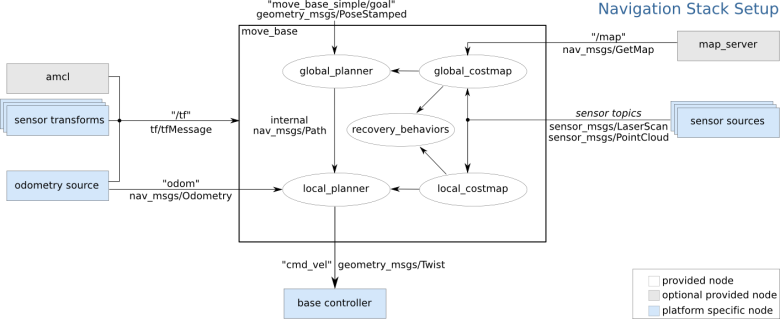

### 16.1.2 Autonomous Navigation Principle

The five essential components mentioned earlier correspond to different feature packs inside a robot.

**Global map:** The robot builds a global map of the environment through the process of Simultaneous Localization and Mapping (SLAM) for navigation. To learn more about SLAM, please refer to the file "[**16. ROS1- SLAM Mapping  Lesson -> 16.1 SLAM Mapping Principle**](https://docs.hiwonder.com/projects/PuppyPi/en/latest/docs/20_slam_mapping.html#slam-mapping-principle)".

**Self-localization:** The robot usually utilizes algorithms to calculate its current location. Two commonly used algorithms include using odometry to calculate the robot's position relative to a known origin, and using Lidar to sense the environment and compare the received information with the feature points of the map to determine the robot's location.

**Path planning:** The robot plans its path by utilizing both the global map and local map. The robot builds a global map through SLAM mapping and obtains a local map through real-time LIDAR scanning.

**Motion control:** The robot's movement can be controlled by sending messages to it.

**Environment perception:** The robot perceives its surroundings through lidar, which is helpful for SLAM mapping, self-localization, and navigation.

## 16.2 Adaptive Monte Carlo Localization

### 16.2.1 AMCL Localization

Localization involves estimating the robot's position in the global map. While SLAM includes localization algorithms, SLAM's localization is used to construct the global map and is part of the pre-navigation phase. Current localization is used during navigation when the robot needs to move along a predefined route. Through localization, we can assess whether the robot's actual trajectory matches the expected one. The ROS navigation function package, ros-navigation, provides the AMCL localization system for implementing robot localization during navigation.
AMCL (Adaptive Monte Carlo Localization) is a probabilistic localization system designed for 2D mobile robots. It implements the adaptive Monte Carlo localization method, which uses a particle filter to estimate the robot's position based on the existing map.
Localization resolves the association issue between robots and obstacles, as path planning essentially involves decision-making based on obstacles around the robot. In theory, as long as the robot's global positioning is known and real-time obstacle avoidance is achieved through sensor scan information from devices like laser radar, navigation tasks can be accomplished. However, the real-time accuracy of global positioning is generally not high, provided by local positioning methods such as odometers and IMUs, which ensure the real-time accuracy of the robot's motion trajectory with the IMU. The amcl node in the navigation function package provides global positioning by publishing map_odom. Global positioning by amcl is not mandatory; users can replace amcl global positioning with other methods that can provide map_odom, such as using SLAM, UWB, or QR code positioning.
Global positioning and local positioning have established a dynamic set of TF coordinates: map_odom, base_footprint, and the static TF coordinates between various sensors in the robot are provided through the robot's URDF model. This part of the TF relationship resolves the association problem between the robot and obstacles. For example, if a laser radar detects an obstacle 3 meters ahead, using the TF coordinates between the laser radar and the robot's chassis, the transformation from base_link to laser_link can be obtained, which reveals the relationship between the obstacle and the robot's chassis.

AMCL Learning Wiki：http://wiki.ros.org/amcl

AMCL Package Link：https://github.com/ros-planning/navigation/tree/melodic-devel/amcl

### 16.2.2 Particle Filter

Monte Carlo Localization (MCL) involves a particle update process for a one-dimensional robot. Initially, a group of particles is randomly generated, each representing possible states of the robot, including position, direction, or other estimated state variables. Each particle has a weight, indicating its similarity to the actual system state. Next, the state of each particle for the next time step is predicted based on the expected behavior of the real system. Subsequently, the weights of particles are updated based on measurements, with particles that match the measurement being assigned higher weights. Afterward, resampling is performed, discarding highly unlikely particles and replacing them with more probable ones. Finally, the weighted mean and covariance of the particle set are calculated to obtain the estimated state.


Monte Carlo methods vary, but tend to follow a specific pattern:

(1) Define the domain of possible inputs.

(2) Randomly generate inputs from the probability distribution over the domain.

(3) Perform deterministic computations on the inputs.

(4) Summarize the results.

Two important considerations are:

(1) If these points are not uniformly distributed, the approximation may be poor.

(2) This process requires many points. If only a few points are randomly placed within the entire square, the approximation is usually poor. On average, increasing the number of points improves the accuracy of the approximation.

The Monte Carlo particle filtering algorithm has wide-ranging applications in various fields such as physics, engineering, climatology, and computational biology.

### 16.2.3 Adaptive Monte Carlo Localization

AMCL can be regarded as an improved version of the Monte Carlo localization algorithm. It reduces execution time and enhances real-time performance by employing a small number of samples in the Monte Carlo localization algorithm. It implements an adaptive or KLD-sampling Monte Carlo localization method, which utilizes particle filtering to track a robot's pose with respect to a known map.
The Adaptive Monte Carlo Localization (AMCL) node primarily utilizes laser scans and laser map data to propagate messages and compute pose estimates. In the implementation process, it first initializes the particle filter of the Adaptive Monte Carlo Localization algorithm based on various initialization parameters provided by the ROS system. If the initial pose is not specified, the AMCL algorithm assumes that the robot starts running from the origin of the coordinate system, which can lead to relatively complex calculations.
Therefore, it is recommended to set the initial pose using the "**2D Pose Estimate**" button in rviz. For more information about Adaptive Monte Carlo Localization, you can also refer to the wiki page at the following link: https://github.com/ros-planning/navigation

### 16.2.4 Costmap

Whether generated by a laser scanner or depth camera, 2D or 3D SLAM maps cannot be directly used for actual navigation. They must be converted into costmaps. In ROS, costmaps are typically represented in grid format. Each grid cell in the grid map occupies one byte, which is eight bits, capable of storing data from 0 to 255. This means that each cell cost (the value of the grid) ranges from 0 to 255, with only three scenarios considered: Occupied (presence of obstacles), Free (open space without obstacles), and Unknown Space (areas where information is lacking).

Before introducing costmap_2d, let's first talk about the Bresenham algorithm. The Bresenham Line Algorithm is used to draw a straight line determined by two points. It calculates the closest points on an n-dimensional grid to the line segment. This algorithm only requires relatively fast integer addition, subtraction, and bit shifting operations, making it commonly used for drawing lines in computer graphics. It is one of the earliest developed algorithms in computer graphics.


Scan through the center of pixels in each row and column to construct a set of virtual grid lines as shown in the diagram above. Calculate the intersections of the line with each vertical grid line in the order from the starting point to the endpoint of the line, and then determine the pixel closest to this intersection point within the column of pixels based on the sign of the error term.
Algorithm Core Idea: Assume: k = dy/dx. Because the starting point of the line is at the center of a pixel, the initial value of the error term d is set to d0 = 0. As X increases by 1, the value of d increases correspondingly by the slope value k of the line, that is, d = d + k. Once d ≥ 1, subtract 1 from it to ensure that d remains between 0 and 1. When d ≥ 0.5, the pixel closest to the current pixel is the one at the upper right corner (x+1, y+1), and when d < 0.5, it is closer to the right pixel (x+1, y). For convenience in computation, let e = d - 0.5, where the initial value of e is -0.5, and the increment is k. When e ≥ 0, take the pixel at the upper right corner of the current pixel (xi, yi) as (x+1, y+1), and when e < 0, it is closer to the right pixel (x+1, y). To avoid division, integers can be used. Since only the sign of the error term is used in the algorithm, it can be replaced as follows: e1 = 2*e*dx.

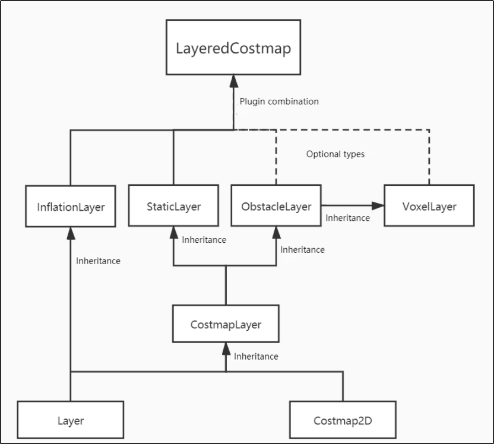

The Costmap2D class maintains the cost values for each grid. The Layer class is a virtual base class that provides a unified interface for various plugin costmap layers. The most important interface functions include:
The "**initialize**" function, which calls the "**onInitialize**" function, initializes each costmap layer separately.
The "**matchSize**" function, used in both the StaticLayer and ObstacleLayer classes, calls the "**matchSize**" function of the CostmapLayer class. This function initializes the size, resolution, origin, and default cost of each costmap layer, ensuring consistency with the layered_costmap. For the InflationLayer class, it calculates a cost table that varies with distance based on the inflation radius. This allows for querying the cost values of inflated grid cells based on distance. Additionally, the "**seen_**" array is defined to mark whether a grid cell has been traversed. For the VoxelLayer class, it initializes the size of voxel grids.

The "**updateBounds**" function adjusts the size range that the current costmap layer needs to update. For the StaticLayer class, it sets the update range of the costmap to the size of the static map (note: the static layer is generally used only in the global costmap). For the ObstacleLayer class, it traverses the sensor data in "**clearing_observations**" to determine the boundaries of the obstacles.

The "**initialize**" and "**matchSize**" functions are executed only once. The "**updateBounds**" and "**updateCosts**" functions are executed periodically, with their execution frequency determined by `map_update_frequency`.

The CostmapLayer class inherits from both the Layer class and the Costmap2D class and provides several methods for updating cost values. The StaticLayer and ObstacleLayer classes need to store the cost values of the instantiated costmap layer, so they both inherit from the CostmapLayer class. The StaticLayer class updates its costmap using static grid map data, while the ObstacleLayer class updates its costmap using sensor data. The VoxelLayer class, compared to the ObstacleLayer class, additionally considers data along the z-axis. The main difference in their effects is reflected in the clearing of obstacles: one performs clearing in a two-dimensional plane, while the other handles it in three dimensions.


The costmap is highly flexible in measuring obstacles, allowing for the creation of specific layers as needed, where obstacle information can be maintained. If the robot is equipped only with a laser scanner, an Obstacles layer should be created to maintain the obstacle information detected by the laser scanner. If the robot also has ultrasonic sensors, a new Sonar layer should be created to maintain the obstacle information detected by the sonar sensors. Each layer can have its own rules for updating obstacles, such as adding obstacles, removing obstacles, and updating the confidence of obstacle points, which greatly enhances the scalability of the navigation system.

**For more information, you can refer to:**

ROS navigation wiki: http://wiki.ros.org/navigation 

ROS move_base wiki: http://wiki.ros.org/move_base

### 16.2.5 Global Path Planning

Preface: Based on the mobile robot's understanding of the environment, the nature of the environment, and the algorithms used, path planning can be divided into environment-based path planning algorithms, map-based path planning algorithms, and completeness-based path planning algorithms.


Commonly used path planning algorithms in robot autonomous navigation include Dijkstra, A*, D*, PRM, RRT, genetic algorithms, ant colony algorithms, fuzzy algorithms, and others.

Dijkstra and A* are both graph-based path search algorithms commonly used in robotics. The navigation package integrates global path planning plugins such as navfn, global planner, and carrot planner. Users can choose one of them to load into move_base for navigation. Alternatively, third-party global path planning plugins like SBPL_Lattice_Planner and srl_global_planner can be selected and loaded into move_base. Additionally, users have the option to develop their own global path planning plugins according to the nav_core interface specifications.

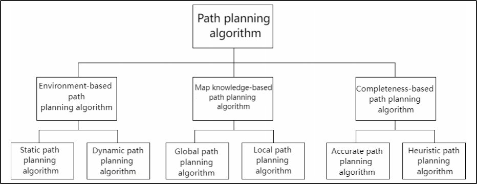

Robot navigation utilizes path planning to enable it to reach its destination. The navigation planning layer can be divided into global path planning layer, local path planning layer, behavior execution layer, and so on.
**(1) Global Path Planning Layer:** Based on the given target, it accepts costmap information to generate a global costmap, plans the global path from the starting point to the target location, and serves as a reference for local path planning.
**(2) Local Path Planning Layer:** As the local planning part of the navigation system, it accepts the generated local costmap information based on the costmap, and performs local path planning based on nearby obstacle information.
**(3) Behavior Execution Layer:** Combining the commands sent from the upper layers and the path planning results, it determines the current behavior of the mobile robot.
As a key focus area in mobile robot research, the quality of path planning algorithms largely determines the efficiency of the robot's operations.

* **Dijkstra algorithm**

The Dijkstra algorithm is a typical shortest path algorithm. It is a single-source shortest path algorithm characterized by expanding outward from the starting point in a breadth-first search manner until reaching the destination. It is a breadth-first algorithm that considers edge weights and is one of the most commonly used algorithms in global path planning problems.

Below is an illustration of the Dijkstra algorithm.

(1)  At the beginning, we initialize dis\[start\] to 0, and the rest of the points are initialized to inf.


(2)  In the first loop, we find the point 1 with the minimum dis value. We then mark 1 as visited and update the dis values of all adjacent blue points. Specifically, we set dis[2] = 2, dis\[3\] = 4, and dis\[4\] = 7.


(3)  In the second loop, we find the point 2 with the minimum dis value. We then mark 2 as visited and update the dis values of all adjacent blue points. Specifically, we set dis[3] = 3 and dis\[5\] = 4.


(4)  In the third loop, we find the point 3 with the minimum dis value. We then mark 3 as visited and update the dis value of the adjacent blue point. Specifically, we set dis[4] = 4.


(5) In the following two loops, we mark points 4 and 5 as visited, respectively, and the algorithm ends. We have found the shortest paths from the start node to all other nodes.

For information and usage instructions on the Dijkstra algorithm, you can visit the following link:  http://wiki.ros.org/navfn

*  **A\* algorithm**

A* algorithm is a modification of the Dijkstra algorithm, optimized for a single destination. While Dijkstra's algorithm can find paths to all locations, A* searches for the closest path to one or several locations. It prioritizes paths that appear to be closer to the goal.

A* algorithm's formula is: F = G + H, where G is the cost of moving from the starting point to the specified grid, and H is the estimated cost of moving from the specified grid to the endpoint. There are two common methods to calculate the H value: 

(1)  Calculate the distance of horizontal and vertical movement; diagonal movement is not considered (Manhattan distance).


(2)  Calculate the distance of horizontal and vertical movement, allowing diagonal movement (Euclidean distance).


For information and instructions on using the A* algorithm, please refer to the video tutorials or visit the following link on the wiki: http://wiki.ros.org/global planner

And redblobgames website: *[https://www.redblobgames.com/pathfinding/a-star/introduction.html#graphs](https://www.redblobgames.com/pathfinding/a-star/introduction.html#graphs)**

## 16.3 Single-point and Multi-points Navigation and Obstacle Avoidance

### 16.3.1 Virtual Machine Installation and Configuration

Due to the limited computing power of Raspberry Pi, virtual machine will take over part of mapping work. Mapping and navigation both require communication between the virtual machine and PuppyPi. We need to modify the configurations of both to enable this communication

* **Open and Import Virtual Machine**

(1) Unzip the virtual machine files in any non-Chinese directory within the same directory.


(2) Open a virtual machine.


(3) Select the folder where virtual machine file is extracted, then open it.


(4) Enter the name and set the storage path for virtual machine. Then click "**Import**".


:::{Note}
after the first importing, you can directly select the storage path for the previous virtual machine, and open it without importing it again.
:::

* **Network Configuration of Virtual Machine**

:::{Note}
if you are using desktop computer, please prepare a wireless LAN adapter or USB wireless adapter.
:::

(1) Firstly, start PuppyPi, and join the WiFi created by PuppyPi on computer.


(2) Return to the virtual machine interface, and click **"edit->virtual machine editor"**.


(3) Select the wireless network card to be bridged. Then click OK.


(4) Open virtual machine, and power on virtual machine.


(5) When entering the system desktop, right click the desktop and select **"open in terminal"**.

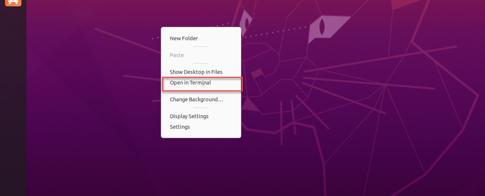

:::{Note}
The input command should be case sensitive and the keywords can be complemented by "**Tab**" key.
:::

(6) Input command **"ifconfig"** and press Enter to check the IP of virtual machine. And the IP is as the red frame shown.

```bash
ifconfig
```


(7)  Right click the system desktop, and open a new command line terminal. Then input command **"sudo nano /etc/hosts"** and press Enter to configure the network.

```bash
sudo nano /etc/hosts
```

(8) Modify the IP in the second and the third lines as the IP of virtual machine and Raspberry Pi you got in the previous step. And the fixed IP of Raspberry Pi under direct connection mode is "**192.168.149.1**".


:::{Note}
When modifying the IP, please ensure the indent is consistent.
:::

(9) After modification, press Ctrl+x, and Y key to save modified buffer, then press Enter.


* **PuppyPi Network Configuration**

(1) Get access to Raspberry Pi desktop via VNC.

(2)  Click  or use shortcut **"Ctrl+Alt+T"** to open terminal

(3) Enter command and press Enter to change network configuration.

```bash
sudo vim /etc/hosts
```

(4) Find the code marked in the below figure, then enter the IP of virtual machine which can be obtained in step 1.2. After that, press **"Esc"** key, enter **":wq"** and press Enter key to save and exit.  

```bash
:wq
```


(5) Run the command to update the configuration.

```bash
source .bashrc
```

### 16.3.2 Configure Navigation

(1)  Connect to PuppyPi system. Then open the terminal 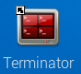.

(2) Input command and press Enter to open navigation service.

```bash
roslaunch puppy_navigation navigation.launch
```

:::{Note}
By default, the map selected here is map1.
:::

When you receive the following messages, PuppyPi navigation service is enabled successfully.

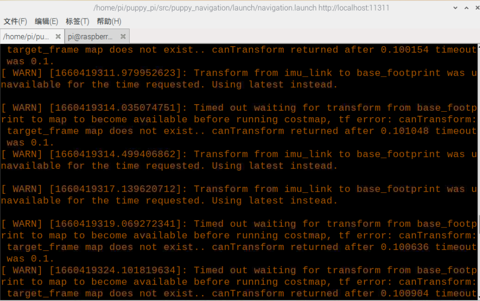

(3) Open virtual machine, then input command and press Enter to open the model to check node.

```bash
rosparam set /puppy_control/joint_state_pub_topic true
```

(4) Open a new command line terminal, then input command and press Enter to open model viewing software.

```bash
roslaunch puppy_description rviz_with_urdf.launch
```


(5)  Click **"File->Open Config"**.

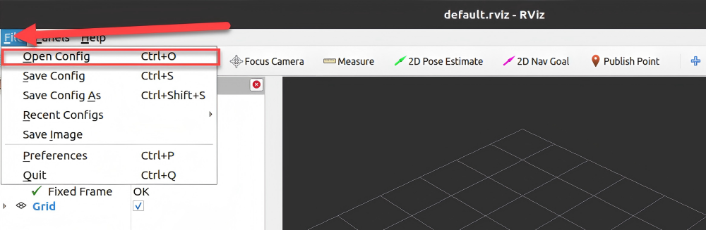

As shown in the image below, navigate to the corresponding path, select **"navigation.rviz",** and then click **"Open"**.

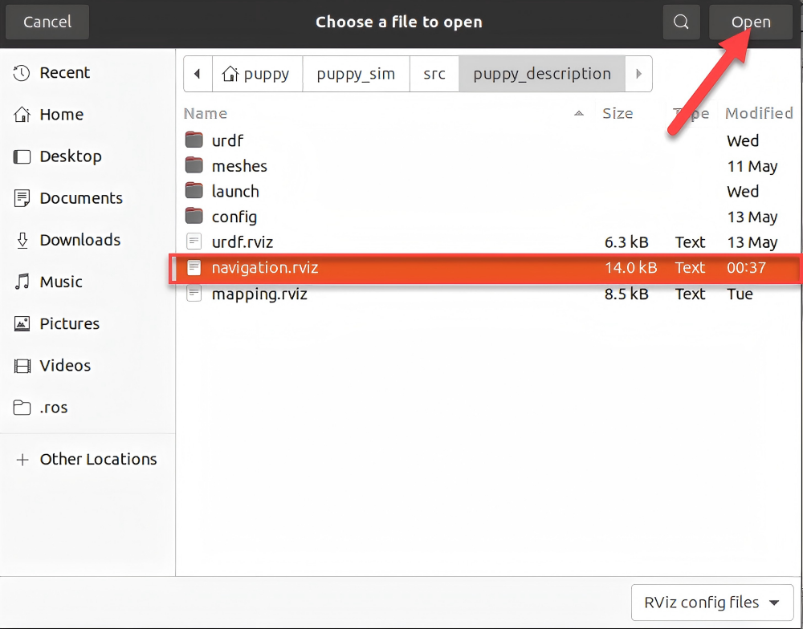


### 16.3.3 Start Navigation

You can issue commands to the robot dog based on the content highlighted in the red box in the image below. When navigating, we need to use the first tool to set the initial position of the robot dog. The second tool can be used to set the target point of the robot dog, while the third tool allows setting multiple target points. The robot dog will automatically set its route based on the map, avoiding obstacles to reach the target point.

:::{Note}
If you need to interrupt the navigation, simply use the second tool to set a target point at the current location of the robot dog. If you pick up the robot dog or its position is altered by external forces, you will need to reset its position manually.
:::


(1) In the software menu bar, **"2D Pose Estimate"** is used to set the initial position of the PuppyPi robot dog.


(2)  **"2D Nav Goal"** is used to set a single target point for the robot. Click the icon and select a location on the map as the target point. Press the left mouse button at that point, then drag the mouse to select both the destination and orientation for the robot. After selection, the robot will automatically generate a route and move to the target point.


Once the target point is set, two lines will be generated: a red line and a green line. The red line represents the straight-line distance from the robot dog to the target, while the green line represents the route planned by the robot dog itself.

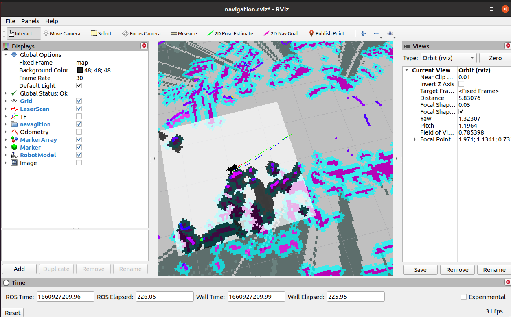

## 16.4 App Navigation

### 16.4.1 Preparation

Via the app, you can control PuppyPi's movement, view its mapping process and set the target point.

(1) **"Make A APP"** app is used for mapping and **"Map Nav"** app is used for navigation. 

(2) These two apps only support Android system, and the installation pack is stored in the same folder.

<p id="anchor_15_4_2"></p>

### 16.4.2 Navigation

* **Enable App Navigation Service**

(1) Start PuppyPi, then access Raspberry Pi desktop via VNC.

(2)  Click-on  at upper left corner to open the Terminator terminal.

(3) Run the command and press Enter to enable app navigation service.

```bash
. /home/ubuntu/puppypi/src/puppy_navigation/scripts/navigation_app.sh
```

* **App Navigation**

(1) Turn on PuppyPi, then connect it to the remote control software VNC.

(2) Enable app service according to the instructions in "[**16.4.2 Navigation -> Enable App Navigation Service**](#anchor_15_4_2)".

(3) Move to **"settings"**, and connect to the Wi-Fi generated by the robot.

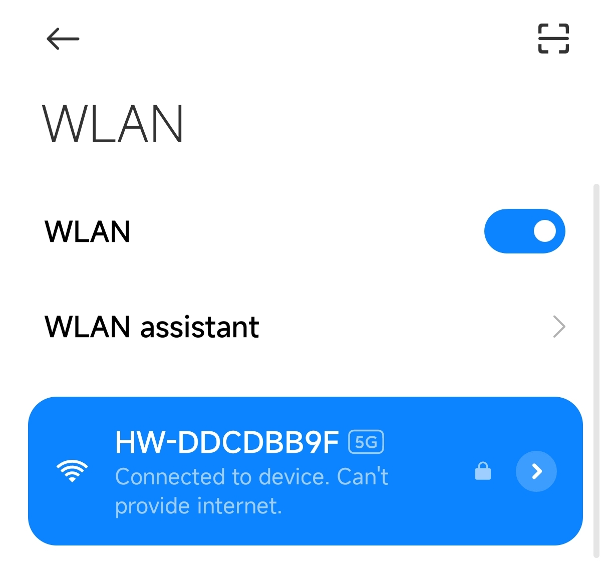

(4) Open the app **"Map Nav"**, and input "**http://192.168.149.1:11311**" in the filed **"Master URI"**. Then click **"CONNECT"** button. 


:::{Note}
The "**CHOOSE A MAP**" has no practical function. The map will be updated automatically.
:::

The app interface is divided into 3 parts:

**① Green area:** display the map

**② Red frame:** control robot's movement

**③ Blue frame:** the options **"Set Pose"** and **"Set Goal"** are used in conjunction with the green square. Set the initial position and the target position

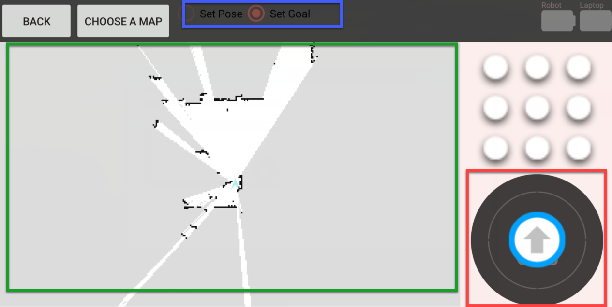

(5) Select **"Set Pose"**. Then press one point on the map to set it as the initial position for the robot.

(6) To calibrate robot's position, drag the arrow at upper right corner to control robot to go forward, downward, and turn left, right.

(7) Select **"Set Goal"** and press one point on the map to set it as the target point.

(8) After the initial position and the target point are set, the robot will generate the path automatically, then move from the initial position to the target point based on this path.
During PuppyPi is moving, its speed will be displayed in red area.

