# 18. ROS1_ROS Robot with Robot Arm

## 18.1 Robotic Arm Installation and Wiring

The installation tutorial video for the Puppypi robotic arm can be referred to in the same directory under `Robotic Arm Installation`. Below is a schematic diagram for the installation of the Puppypi robotic arm:

Use four M4*6 round head machine screw to secure the robotic arm to the Puppypi. Due to the replacement of old and new versions of Puppypi sheet metal parts, some sheet metal parts can only be installed with two M4*6 round head machine screws. Please refer to the actual Puppypi sheet metal parts for specifics.


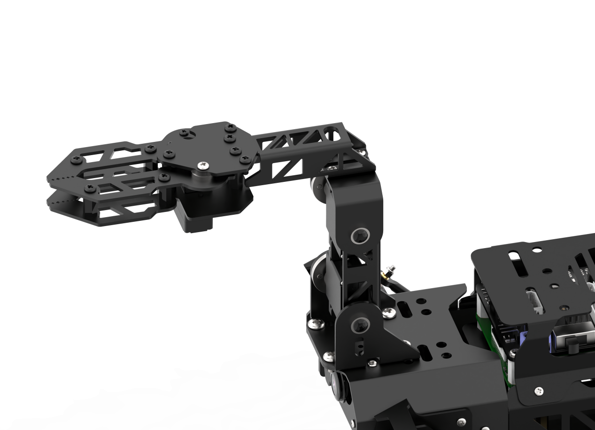

M4*6 round head screw

Connect the servos ID9, ID10, and ID11 on the robotic arm to the PWM servo interfaces 9, 10, and 11 on the Raspberry Pi expansion board as pictured:

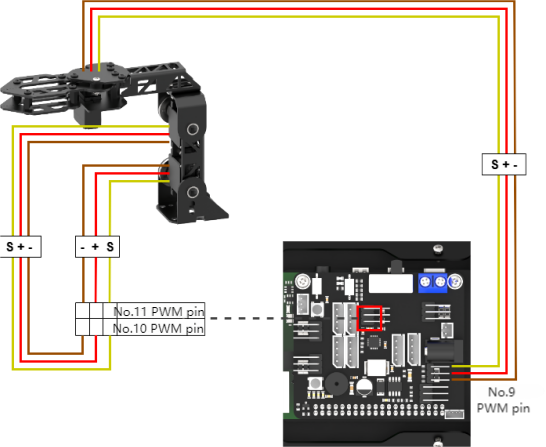

## 18.2 Power-on Inspection

### 18.2.1 Robot Power-on

:::{Note}
①Do not start PuppyPi on rough or uneven surfaces.

②Do not forcibly move the servos after powering on to avoid damaging them.
:::

(1) Before powering on, to avoid servo damage from sudden movement, place PuppyPi in a lying position on a flat surface. The robotic arm should be positioned facing forward, as shown in the diagram below:


:::{Note}
Before powering on, the robotic arm must be positioned facing straight forward. Do not position it hanging downwards to prevent damage to the robotic arm when the servos are powered on.
:::


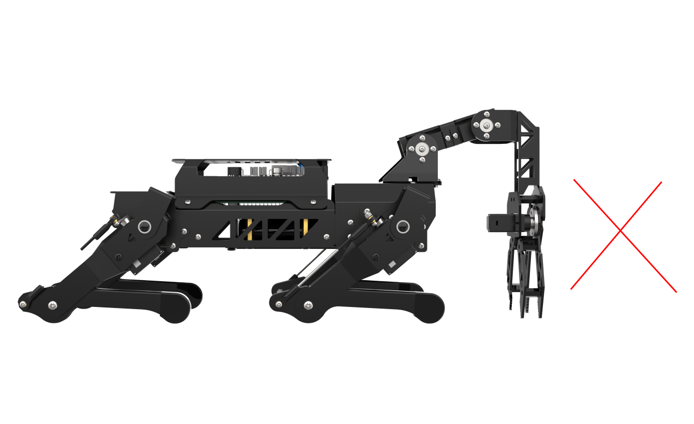

(2) Then, push the switch on the expansion board from `OFF` to `ON`. After powering on, the digital display at the tail of the robot dog will show the current battery level (it lights up at 8V as pictured). when the battery level is below 6.8V, the battery needs to be charged as soon as possible. LED1 and LED2 will emit a faint blue light. After a short wait, LED1 will stay on continuously, and LED2 will blink every two seconds, indicating that the network configuration is ready. Finally, wait for a `beep` from the buzzer, indicating that the ROS configuration is complete and the device has successfully started.


(3) The device defaults to AP direct connection mode out of the factory. After successful boot-up, it will generate a hotspot starting with `HW`.


### 18.2.2 Inspection

(1) Click the icon in the top-left corner 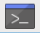 of the desktop to open the system terminal.

(2) Enter the following command to navigate to the puppypi directory:

```
cd puppypi/
```

(3) Run the following command to execute the robotic arm test script:

```
./arm_test.sh
```

During the test, the robotic arm gripper will first open and close, then perform a complete grasping motion. Once the sequence is complete, servos 9 and 10, as well as servos 10 and 11, should form a 90-degree angle with the tabletop or other flat surface, as illustrated below:


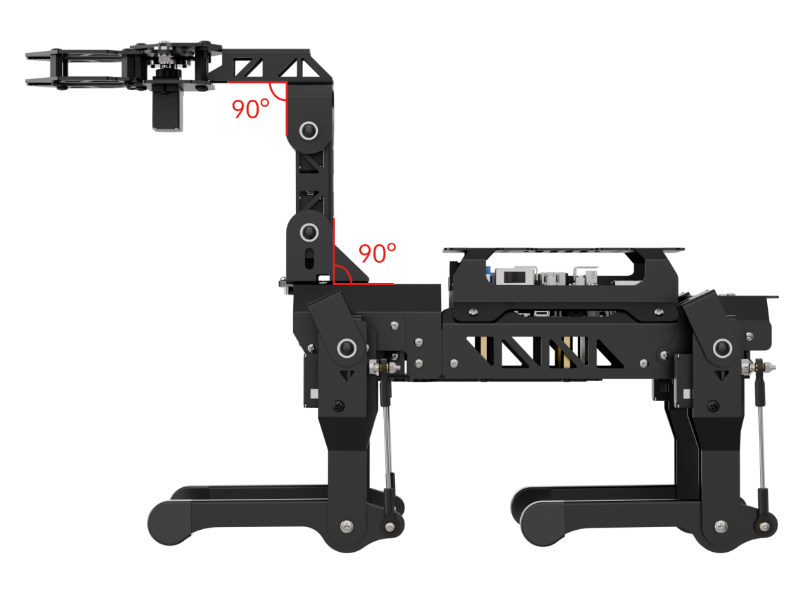

If there is any noticeable deviation after the test, please proceed to the next section, [18.3 Robotic Arm Deviation Adjustment](), for calibration instructions.

## 18.3 Robotic Arm Deviation Adjustment

### 18.3.1 Determine Whether Offset Adjustment is Required

Offset adjustment is **not necessary** if the PuppyPi robotic arm meets the following initial posture conditions after powering on:

(1) The arm remains **vertically aligned** with the main body

(2) The **two connecting rods** form a **90-degree right angle**

(3) The **gripper is properly closed**


If the robotic arm appears misaligned, as shown in the reference image, **offset calibration is required**.

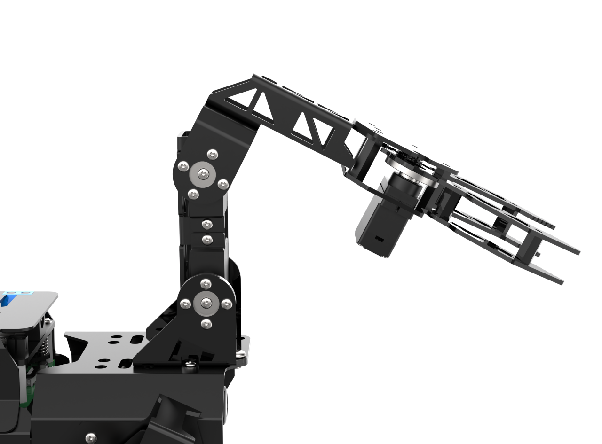

### 18.3.2 Causes of Offset

Offset may occur under the following conditions:

(1) Incorrect horn installation: If the servo horn is installed while the shaft is not in its neutral (midpoint) position, it can cause an angular deviation. (Note: Servos are factory-calibrated to their midpoint by default.)

(2) Slight mounting misalignment: Even if the horn is installed correctly, small deviations in how the servo is mounted to the bracket can result in minor offsets.

- Offsets within ±100 units (approximately ±30°) are considered within the normal adjustment range and can be corrected through software.

- Offsets exceeding ±100 units require manual adjustment by removing the horn, repositioning it, and reinstalling it correctly.

### 18.3.3 Offset Adjustment Steps

Ensure the `Reset Servo` operation has been performed before proceeding.


(1) Double-click the control software icon 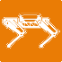 on the desktop.

(2) In the prompt window, click `Execute` to launch the host software.


(3) Once the software is open, check the `Arm` option under Normal Mode to display the servo control panel.

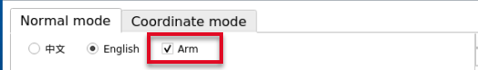


(4) Servos with ID 9, 10, and 11 correspond to the robotic arm's joints.

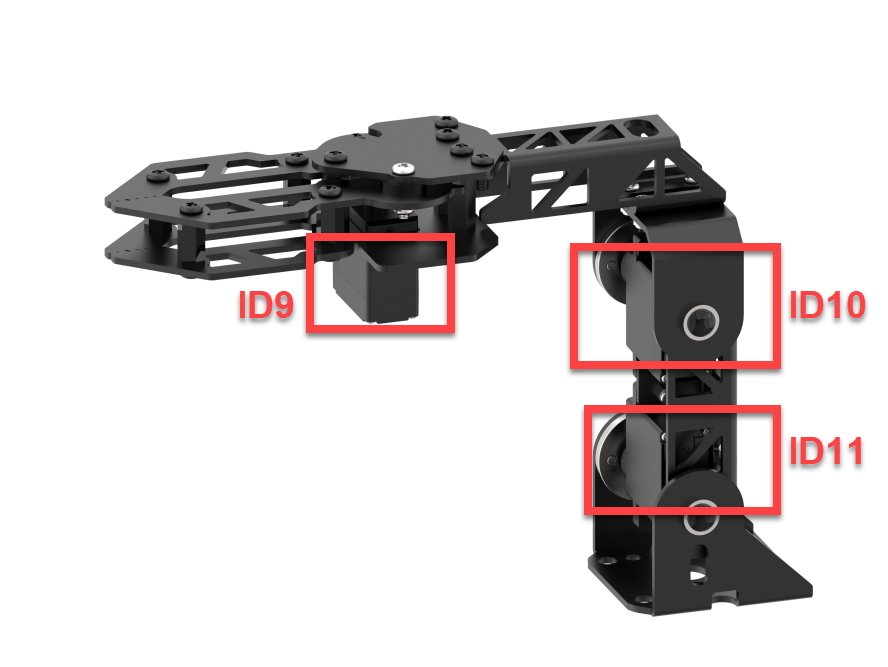

(5) Click the `Reset Servo` button to bring PuppyPi into its default position.


(6) In Normal Mode, observe the servo positions. If Servo ID10 is misaligned, proceed with adjustment.

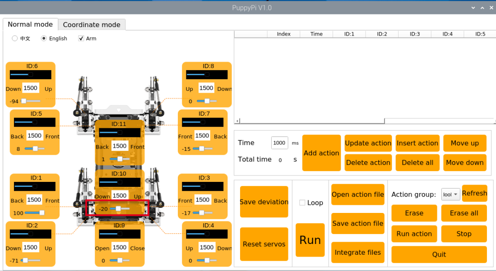

(7) The software will automatically read the current offset value. Use the slider below ID10 to adjust its position until the two connecting rods are perpendicular. You can click the slider or use the mouse scroll wheel to fine-tune the value.

(8) After adjustment, click `Save Deviation`, then `OK` to store the offset in the control board.

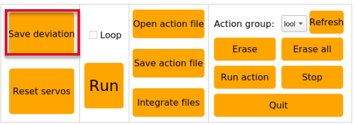

## 18.4 Center of Gravity Calibration

### 18.4.1 Center of Gravity Explanation

The robotic dog's center of gravity is positioned at the center of its body to ensure balanced weight distribution from front to back and side to side. During movement, the system continuously makes dynamic adjustments to the posture of each component to maintain a stable center of gravity—similar to how a person adjusts their balance when walking with or without carrying a load.

By default, the robot is configured without a robotic arm, and its center of gravity is pre-calibrated at the factory, so no further adjustment is required. However, when a robotic arm is installed, the shift in weight alters the center of gravity. In such cases, users must follow the instructions in this section to manually recalibrate the balance. This helps prevent issues such as body tilting or instability during operation.

### 18.4.2 Program Configuration Guide

The source code for the ROS1 program is located inside the Docker container at:

[/home/ubuntu/puppypi/src/puppy_control/scripts/puppy.py]()


As shown in the figure above, the `x_shift` parameter in the program defines the distance (in centimeters) by which all four legs of the quadruped robot move along the X-axis in the same direction. This parameter determines the robot's gait balance point and can be adjusted within a range of -10 to 10.

:::{Note}
When `with_arm = 0` (i.e., the robot does not have a robotic arm installed), the default value of `x_shift` is -0.5, which corresponds to the standard center of gravity for the base model.
:::

When adjusting this parameter:

- A smaller value shifts the balance point forward, causing the robot to lean slightly forward.

- A larger value shifts the balance point backward, causing it to lean slightly toward the rear.

Tuning the `x_shift` parameter is essential for maintaining walking stability, especially after hardware modifications such as mounting a robotic arm.

### 18.4.3 Center of Gravity Instructions

:::{Note}
Commands are case-sensitive. You may use the Tab key for auto-completion.
:::

(1) Power on the PuppyPi robot. Use VNC to remotely connect to the Raspberry Pi desktop environment.

(2) Click the icon at the top-left corner  of the desktop to open the Terminator terminal.


(3) Enter the following command to navigate to the control script directory:

```
cd puppypi/src/puppy_control/scripts
```

(4) Open the script using the following command:

```
vim puppy.py
```

(5) Press the `i` key to enter insert mode for editing.


(6) Locate the line `with_arm=0` and change it to `with_arm = 1`. This adjustment sets the **offset** to 0.1, and modifies the `x_shift` value to -0.4 (i.e., -0.5 + 0.1). It is recommended to adjust the `x_shift` value gradually, in increments of ±0.01, for better stability.

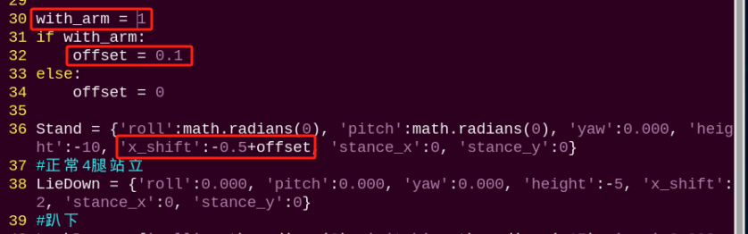

(7) After editing, press the Esc key, then type and enter the following command to save and exit:

```
:wq
```

(8) Click-on 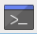 to open the command-line terminal.

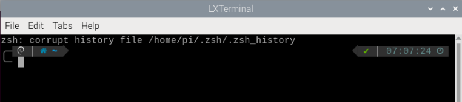

(9) Restart the robot's startup service to apply the updated settings:

```
sudo systemctl restart start_node.service
```

(10) Wait a few moments until you hear a short beep from the buzzer, indicating the system has restarted. Open the terminal again  and run the following command to test the walking behavior:

```
rosrun puppy_control puppy_demo.py
```

(11) Allow PuppyPi to walk for approximately 5 seconds. If it walks smoothly and maintains balance, the center of gravity has been successfully adjusted.

(12) If instability persists, repeat steps **2 through 13** to continue fine-tuning.

## 18.5 Robotic Arm Debugging

This document outlines troubleshooting solutions for common issues encountered during PuppyPi's robotic arm extension activities, such as inaccurate gripping or failure to detect the target object.

:::{Note}
While the adjustment procedures for the robotic arm are the same in both ROS1 and ROS2 environments, the steps for launching the activities differ. Please follow the instructions specific to your version.
:::

### 18.5.1 Adjusting Color Thresholds Using LAB_TOOL

Open the LAB_TOOL software on the Raspberry Pi desktop and verify whether the three sponge blocks used in the activity are correctly detected. If any color is not fully recognized, adjust the corresponding color threshold accordingly.
(In the example image, the object to be detected appears white on the left side, while the background appears black, indicating successful color recognition.)


For detailed instructions, please refer to the tutorial saved in: [9.6 AI Vision and Tracking Course->9.6.1 Color Threshold Adjustment]()

* **Acceptance Criteria**: All three sponge blocks are accurately and fully detected.

### 18.5.2 Color Recognition and Grasping Debugging

:::{Note}
Before debugging this game, please complete the color threshold adjustments for the three sponge blocks as described in **"18.5.1 Adjusting Color Thresholds with LAB_TOOL."**
:::

(1) Power on the robot, then follow the steps in [7. Remote Tool Installation Connection → 7.3 Docker Container Introduction and Entry]() and [7.4 ROS Version Switch Tool Guide]() to connect via the VNC remote control software and switch to the ROS 2 environment.

(2) Open the Terminator terminal by clicking the system desktop icon .

(3) Stop the auto-start service by entering the following command and pressing Enter:

```
~/.stop_ros.sh
```

(4) Launch the robotic arm gameplay by entering the command below and pressing Enter:

```
ros2 launch example color_detect_with_arm.launch.py
```

(5) A real-time video window will appear. The yellow rectangular area at the bottom is the recognition zone for the sponge blocks. Place the blue and green sponge blocks inside this zone, ensuring the bottom of each block aligns with the bottom edge of the yellow box (see image reference).


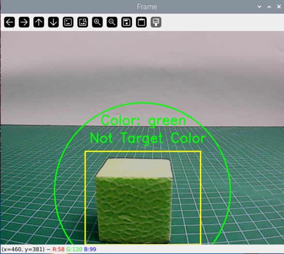

(6) If no recognition box appears around the sponge blocks, the color is not being detected. This may be due to an incorrect minimum color area threshold in the program. To stop the program, press `Ctrl + C` in the terminal.

(7) Navigate to the program directory by entering:

```
cd ros2_ws/src/example/example/puppy_with_arm
```

(8) Open the gameplay script with:

```
gedit color_detect_with_arm.py
```

(9) Scroll to line 127 and check the value of `max_area`, which defines the minimum recognized area for a single color block. The recommended value is 4000, based on extensive testing.

- If the program fails to detect the blocks, try decreasing this value slightly.

- Save the file and rerun the program to verify recognition.

- Repeat adjustments until all sponge blocks are reliably recognized.

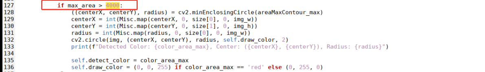

(10) After successful recognition, proceed to test grasping. Place the red sponge block in the recognition zone as described in step 5.

- If the robot does not grasp securely or misses the block, check the gripper servo offsets.

- Confirm the gripper is fully closed when no grasp command is issued.

- Adjust the servo offset as needed.

(11) Once stable grasping is achieved, verify the grasping position. If it is too high, fine-tune the grasp position by adjusting the `grab.d6a` motion group.


(12) **Acceptance Criteria**: The game must reliably recognize all three sponge blocks by color and grasp them accurately without dropping during operation.

### 18.5.3 Line-Following Grasping Debugging

(1) Power on the robot, then follow the steps in [7. Remote Tool Installation Connection → 7.3 Docker Container Introduction and Entry]() and [7.4 ROS Version Switch Tool Guide]() to connect via the VNC remote control software and switch to the ROS 2 environment.

(2) Open the LTX terminal  at the top-left corner of the desktop, enter the following command to stop the button service, and press Enter:

```
sudo systemctl stop button_scan.service
```

(3) Click the system desktop's top-left icon  to open the Terminator terminal.

(4) Enter the command below to stop auto-start game services, then press Enter:

```
~/.stop_ros.sh
```

(5) Start the line-following grasping gameplay by entering the command and pressing Enter:

```
ros2 launch example visual_patrol_with_arm.launch.py
```

(6) Press the Key1 button on the expansion board to start the game. If the robot fails to grasp the sponge block properly (e.g., grasping too early or too late), stop the program by pressing `Ctrl + C` in the terminal.

(7) Enter the following command to navigate to the course program directory:

```
cd ros2_ws/src/example/example/puppy_with_arm
```

(8) Open the game script by entering:

```
gedit visual_patrol_with_arm.py
```

(9) Locate line 355 and adjust the corresponding value:

- If Puppypi grasps too late (with the gripper behind the sponge block), increase this value to initiate earlier grasping.

- Adjust in increments of about 10 for each modification.

- If the robot fails to grasp after increasing the value, it means the value is too high—revert to the previous value and fine-tune in increments of 1.

- Test repeatedly until the robot can successfully grasp 3 times consecutively at a given value.


(10) **Acceptance Criteria**: The game runs successfully and the robot grasps the sponge block correctly 3 times in a row without failure.

### 18.5.4 Auto Recognition Grasping Debugging

(1) Power on the robot, then follow the steps in [7. Remote Tool Installation Connection → 7.3 Docker Container Introduction and Entry]() and [7.4 ROS Version Switch Tool Guide]() to connect via the VNC remote control software and switch to the ROS 2 environment.

(2) Open the LTX terminal  at the top-left corner of the desktop, enter the following command to stop the button service, and press Enter:

```
sudo systemctl stop button_scan.service
```

(3) Click the system desktop's top-left icon  to open the Terminator terminal.

(4) Enter the command below to stop auto-start gameplay services, then press Enter:

```
~/.stop_ros.sh
```

```
ros2 launch example color_grab.launch.py
```

(5) Press the **KEY1** button on the Raspberry Pi expansion board to start the program.

- If the robot fails to grasp the sponge block correctly (grasping too early or too late), this indicates that the parameter range controlling the grasp action is improperly set.

- To stop the program, press `Ctrl + C` in the terminal.

(6) In the terminal, enter the following command to navigate to the course program directory:

```
cd ros2_ws/src/example/example/puppy_with_arm
```

(7) Open the corresponding gameplay script by running:

```
gedit color_grab.py
```

(8) Within the script:

- Lines **102** and **117** define the lower limit for `block_center_point[1]` (e.g., the value **355** in the diagram), which determines when Puppypi moves forward. These two values must be kept consistent—any change to one must be reflected in the other.

- Lines **102** and **120** define the upper limit for `block_center_point[1]` (e.g., the value **370**), which determines when Puppypi moves backward. This value is typically not changed, but if adjusted, both lines must be updated accordingly.

- After making any changes, save the file and rerun the gameplay to test the grasping action. The robot should be able to successfully grasp the sponge block **three consecutive times**.


(9) **Acceptance Criteria**: The robot consistently grasps the sponge block **three times in a row** during game.

### 18.5.5 Follow-up Procedure

After completing the above steps, carefully organize the robotic arm's servo cables and secure them with cable ties. Make sure to power off the system before handling the cables.

**Acceptance Criteria:** Move each servo of the robotic arm to its full range of motion repeatedly, and check that none of the servo cables become loose or disconnected.

Once the cable management is confirmed secure, the robotic arm can be safely removed. This completes the entire debugging process.

## 18.6 Color Recognition Gripping

### 18.6.1 Program Logic

First, subscribe to the topic messages published by the camera node to obtain real-time image data. Then, convert the RGB color space to grayscale and read the camera's intrinsic parameters.

Next, perform thresholding, erosion, and dilation on the image to obtain the largest contour of the target color within the image, and outline the detected color.

Finally, control the PuppyPi to perform feedback actions. When red is detected, control the robot to perform the `grasping` action.

### 18.6.2 Operation Steps

:::{Note}
Command input must strictly differentiate between uppercase and lowercase letters as well as spaces.
:::

(1) Turn on PuppyPi, and connect it to Raspberry Pi desktop via VNC.

(2) Click the icon  on the upper left corner to open the Terminator terminal.


(3) Input the following command and press Enter to close auto-start program.

```
sudo ./.stop_ros.sh
```

(4) Input the following command and press Enter start robotic arm game.

```
roslaunch puppy_bringup start_node_with_arm.launch
```

(5) Launch a new terminal window, enter the command to activate the color recognition and object-grasping feature, and press Enter to start the function.

```
roslaunch puppy_with_arm color_detect_with_arm.launch
```

(6) To close this program, press `Ctrl+C` in the LX terminal interface. If closing fails, try pressing multiple times.

(7) After closing the program, you still need to enter the following command and press Enter to start the app auto-start service.

```
sudo systemctl restart start_node.service
```

After startup completion, the buzzer will emit a short beep sound `beep`.

:::{Note}
If the app auto-start service is not initiated, it will affect the normal implementation of the corresponding game in the app. If the command for auto-start is not entered, restarting the robot will also initiate the app auto-start service again.
:::

### 18.6.3 Program Outcome

:::{Note}
After starting the game, please ensure that there are no other objects with the recognized color within the field of view of the camera, to avoid affecting the implementation effect of the game.
:::

After starting the game, place the color block in front of PuppyPi. When the color block is recognized, it will be identified with a circle in the corresponding color, and the color name will be printed in the center of the window. The program can recognize color blocks of `red`, `blue`, and `green`, but only performs `grasping` operation on red color blocks.

:::{Note}
If the color recognition is inaccurate, please refer to [8.5 AI Vision and Tracking Course->8.5.1 Color Threshold Adjustment]() for adjustment.
:::


### 18.6.4 Program Analysis

[Source Code]()

:::{Note}
Before making any program modifications, it is essential to backup the original factory program. Avoid directly modifying the source code files to prevent accidentally changing parameters in the wrong way, leading to robot malfunctions that cannot be repaired!
:::

* **Launch File Analysis**

During the execution of the functionality, the launch file of the current package will be started (`color_detect_with_arm.launch`) as pictured:

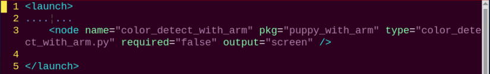

From the above diagram, it can be seen that the node name for this game functionality is `color_detect_with_arm`, and this node is located in the package `puppy_with_arm`. The node displays the processed information through the terminal.

Finally, the color recognition and gripping function is executed by calling the source code file `color_detect_with_arm.py`.

* **Source Code Program Analysis**

The source code of this program is stored at: [/home/ubuntu/puppypi/src/puppy_with_arm/scripts/color_detect_with_arm.py]()

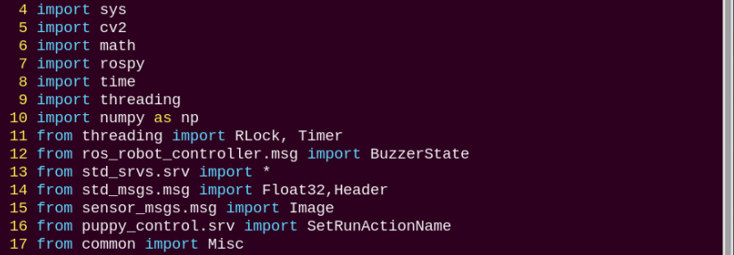

① `sys` is used for handling command-line arguments and exiting the program;

② `cv2` is used for OpenCV image processing;

③ `math` is used for mathematical calculations;

④ `rospy` is used for ROS communication;

⑤ `time` is used for timing and delays;

⑥ `threading` is used for implementing parallel processing;

⑦ `Rlock`、`Time` are used for thread synchronization;

⑧ Import service types from `std_srvs.srv`.

⑨ Import message types from `sensor_msgs.msg`.

⑩ Import corresponding message types and service types from `hiwonder_interfaces`;

⑪ Import ROS image message module from `sensor_msgs.msg` for processing image messages;

⑫ Import action groups from `puppy_control.srv`.

* **Main Program**

{lineno-start=}
```python

```

Subscribes to the `/usb_cam/image_raw` topic to receive image messages and calls the `image_callback` function for processing. Additionally, it retrieves a list of color ranges from the parameter server and creates proxies for motion control services and a buzzer publisher. Upon execution, the program initializes movement operations and then enters a loop to wait for incoming image messages. If an exception occurs, the program prints the log message `Shutting down`. The overall logic is to implement image processing and control robot movement within the ROS environment.

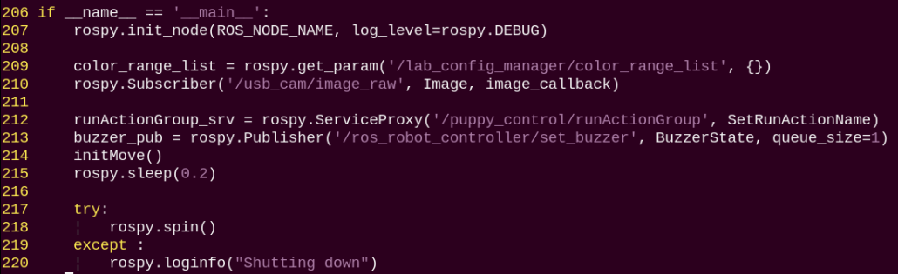

(1) Use `rospy.Subscriber` to create a message subscriber to handle camera information.

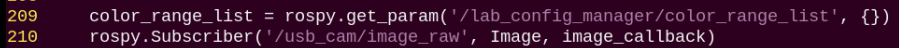

The first parameter `/usb_cam/image_raw` indicates the topic name of image data;

The second parameter `Image` indicates message type.

The third parameter indicates calling `image_callback` function to process the returned image.

(2) Create `buzzer_pub` buzzer publisher. Use `rospy.Publisher` to create a message publisher.

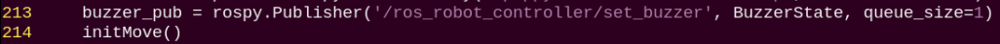

The first parameter `/sensor/buzzer` indicates the topic name of buzzer control.

The second parameter `Float32` indicates message type.

The third parameter `queue_size=1` specify the size of message queue.

* **Image_callback Callback Function**

{lineno-start=}
```python

```

The following image is a screenshot of the code inside the `image_callback` callback function:

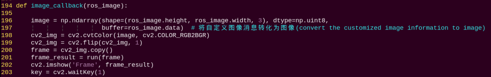

First, convert the ROS image message to a numpy array format of image data and convert it from RGB format to BGR format. Then, horizontally flip the image and create a copy of the image data for further processing. Next, call a function named `run` to process the image and obtain the processing result. Finally, use the cv2 module to display the processed image and wait for key input. The overall logic is to process the received image upon receiving the image message and display the processing result in real-time for monitoring and debugging of the image processing algorithm.

* **Run Image Process Function**

{lineno-start=}
```python

```

The following image is a screenshot of part of the code for the `run` function:

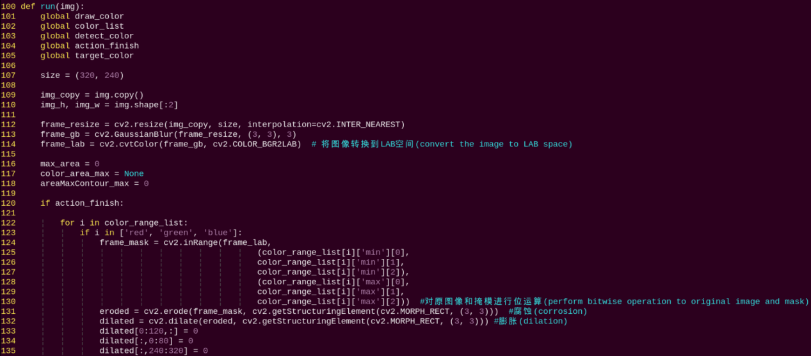

First, preprocess the image, including resizing and Gaussian blur. Then, based on the preset color ranges, locate the color blocks in the image and mark them using minimum enclosing circles. Next, based on the matching between the detected color blocks and the target colors, display the corresponding text in the image. The overall logic is to detect target color blocks, mark them, and display text based on image processing and color matching.

(1) Preprocess the image, including resizing, Gaussian blur, and converting RGB colors to LAB space.

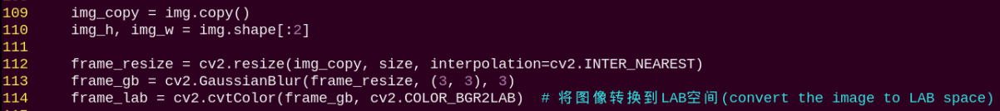

(2) Iterate through each element in the color range list (`color_range_list`) for the three colors (red, green, blue), and perform a mask operation on the image based on the specified color range.

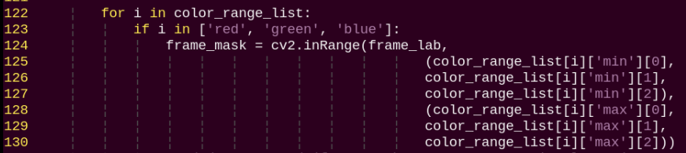

(3) After the mask operation, perform erosion and dilation operations on the image, as well as cropping the image. Then, call the `getAreaMaxContour()` function for contour detection, and finally find the contour with the largest area and its corresponding color.

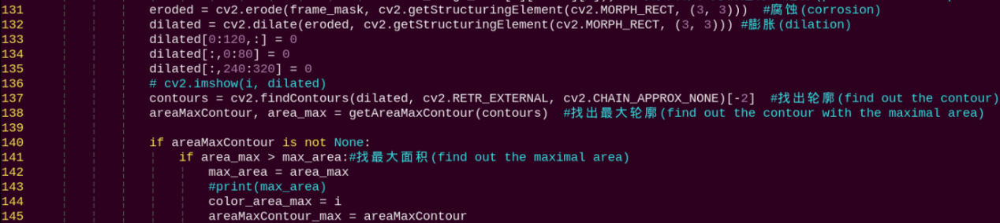

(4) Calculate the pixel value of the contour and filter out those with less than 8500 to ensure that the recognized colors are target color blocks. Use the `cv2.minEnclosingCircle()` function to obtain the center point (`centerX`, `centerY`) and radius (`radius`) of the minimum enclosing circle of the contour with the largest area, and use the `cv2.circle()` function to draw the minimum enclosing circle on the image with the color corresponding to the color block.

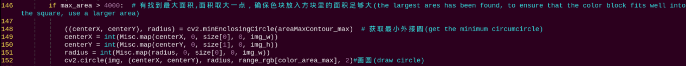

(5) Differentiate the largest color block based on color, and mark the colors as 1 (red), 2 (green), or 3 (blue), and add them to the `color_list`. By repeatedly checking the length of the `color_list`, assign the corresponding color value to `detect_color` and `draw_color`.

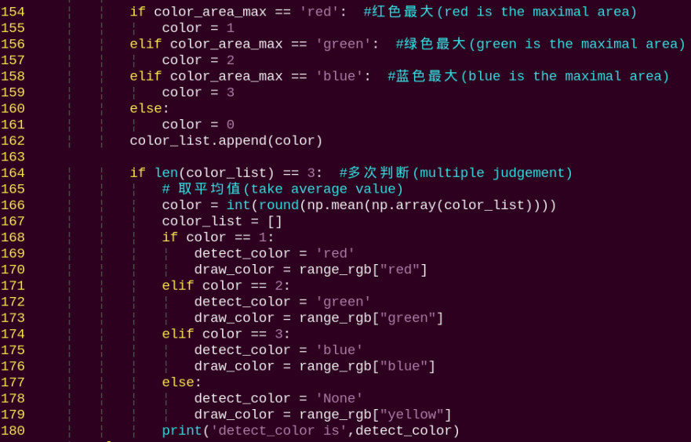

(6) Based on the matching between the detected color (`detect_color`) and the target color (`target_color`), use the `cv2.putText()` function to draw the text `Color: ` + `detect_color` on the image, with the position (225, 210), font `cv2.FONT_HERSHEY_SIMPLEX`, size 1, color `draw_color`, line width 2, and return the processed image.

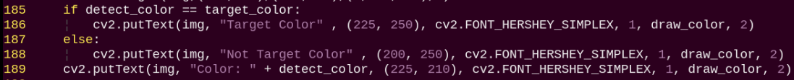

* **Move Execute Action Function**

{lineno-start=}
```python

```

The following image is a screenshot of part of the code for the `move` function:

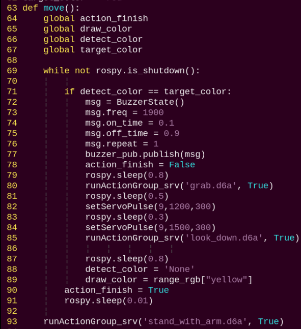

Based on the matching between the detected color and the target color, control the robot to perform the corresponding actions. If the color matches (red), send a buzzer signal of 0.1 second duration using `buzzer_pub.publish(0.1)`, execute a series of actions (grabbing and placing actions), and then reset the detected color to `None`. If the colors do not match, do not execute the action group.

* **Execute Sub-thread**

{lineno-start=}
```python

```

Create a sub-thread named `th` and pass the move function as the target function to the sub-thread. Set the daemon parameter to True, indicating that the sub-thread is set as a daemon thread. Use `th.start()` to start the sub-thread, causing it to begin executing the move function.


By creating a sub-thread and passing the move function as the target function to the sub-thread, it's possible to execute other tasks in the main thread simultaneously without blocking the execution of the move function. The move function in the sub-thread can execute in the background and can run concurrently with the main thread.

* **getAreaMaxContour Function**

{lineno-start=}
```python

```

The following image is a screenshot of part of the code for the `getAreaMaxContour` function:


From a group of contours, find the contour with the largest area. The function iterates through all contours, calculates their areas, and retains the contour with the largest area. Additionally, a condition is added during area calculation to consider only contours with an area greater than or equal to 50, filtering out smaller disturbances. Finally, the function returns the found largest contour and its corresponding area.

### 18.6.5 Function Extension

When recognizing red, PuppyPi executes action of `gripping` and `placing` color block. To change to color to be detected, such as the `green` color block, follow these steps:

(1) Input the following command to edit color recognition gripping program. Then press Enter.

```
rosed puppy_with_arm color_detect_with_arm.py
```

(2) Find the code as pictured:

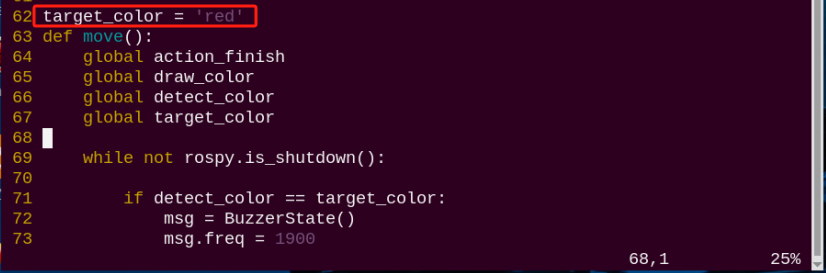

:::{Note}
After entering the code position number on the keyboard, press the `Shift+G` keys to directly navigate to the corresponding position. The code position number shown in the illustration is for reference only, please refer to the actual position.
:::

(3) Press `i` to go to the editing mode. And change `red` to `green`.

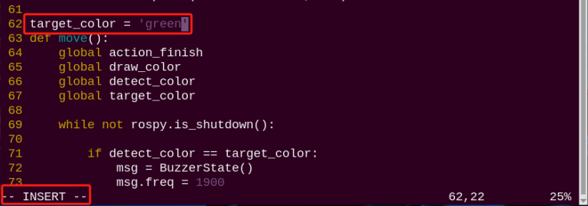

(4) After modification, press Esc and input `:wq`. Then press Enter to save and exit.

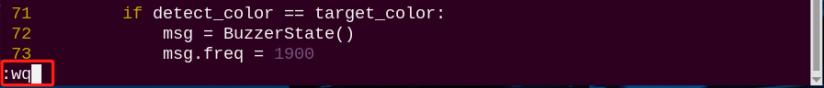

(5) Refer to [18.6.2 Operation Steps]() to restart the program to check the modified game effects.

## 18.7 Auto Recognition Gripping

### 18.7.1 Program Logic

First, subscribe to the topic messages published by the camera node to obtain real-time image data. Then, convert the RGB color space to grayscale and read the camera's intrinsic parameters.

Next, perform thresholding, erosion, and dilation on the image to obtain the largest contour of the target color within the image, and outline the detected color.

Then, control the PuppyPi to perform feedback actions. When red is detected, control the robot to perform the `grasping` action.

Finally, PuppyPi moves forward and then turns left to search for the red placement point. When red is detected, control the robot to perform the `placement` action, placing the color block at the red placement point.

### 18.7.2 Operation Steps

:::{Note}
Instructions must be entered with strict attention to case sensitivity and spacing.
:::

(1) Turn on PuppyPi, and connect it to Raspberry Pi desktop via VNC.

(2) Click the icon  on the upper left corner, or use shortcut `Ctrl+Alt+T` to open the LX terminal.

(3) Input command and press Enter to close the auto-start program.

```
sudo systemctl stop button_scan.service
```

(4) Click the icon  on the upper left corner to open Terminator terminal.


(5) Input the following command and press Enter to close auto-start program.

```
sudo ./.stop_ros.sh
```

(6) Input the following command and press Enter to start the auto-start program.

```
roslaunch puppy_with_arm color_grab.launch
```

(7) Pressing KEY1 on the Raspberry Pi expansion board starts autonomous recognition and grasping, while pressing KEY2 can pause the game.


(8) If you need to close this game, you can press `Ctrl+C` in the LX terminal interface. If closing fails, you can try pressing multiple times.

(9) After closing the game, you also need to enter the following command and press Enter to start the app auto-start service.

```
sudo systemctl restart start_node.service
```

After the startup is completed, the buzzer will emit a short beep sound `beep`.

:::{Note}
If the app auto-start service is not enabled, it will affect the normal implementation of the corresponding gameplay in the app. If the command is not entered for auto-start, restarting the robot dog will also restart the app auto-start service.
:::

(10) Additionally, input the following command and press Enter to open the button detection service.

```
sudo systemctl restart button_scan.service
```

### 18.7.3 Program Outcome

After the game is initiated, the recognized red color block will be outlined in the feedback screen. PuppyPi will move towards the color block, grasp it, take a small step forward after grasping, then turn left, and proceed to search for the placement point. Here, we use a red box as the placement point (you can choose according to your preference). Once the red box is found, the color block will be placed inside the box.

:::{Note}
If the color recognition is inaccurate, please refer to [8.5 AI Vision and Tracking Course->8.5.1 Color Threshold Adjustment]() for adjustment.
:::

If the gripping position is inaccurate, you can modify the parameter `block_center_point[1]` in the program. A larger value will move the gripper towards the rear, while a smaller value will move it towards the front. Adjusting this parameter will help to fine-tune the gripping position.

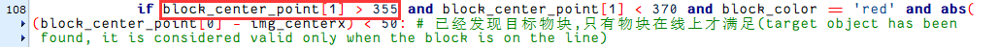

### 18.7.4 Program Analysis

[Source Code]()

* **Launch File Analysis**

The source code of this program is stored at [/home/ubuntu/puppypi/src/puppy_with_arm/launch/color_grab.launch]()

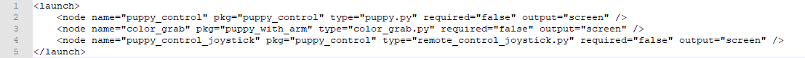

The first `<node>` tag is used to launch a node named `puppy_control`, which controls the movement of the robotic dog. Its definition is as follows:

name=`puppy_control`：Node name is puppy_control.

pkg=`puppy_control`: The software package where the node resides is puppy_control.

type=`puppy`：Node type is puppy, which indicates the execution of an executable file named `puppy.py`.

required=`false`：This node is not essential. Setting it to `false` means that even if this node fails to start, it will not affect the overall execution of the launch file.

output=`screen`：Specify that the output of the node will be displayed on the screen.

The second `<node>` tag is used to launch a node named `color_grab`, which is the main source file for the game. Its definition is as follows:

name=`color_grab`： Set the node name to `color_grab`.

pkg=`puppy_with_arm`：Specify the software package that the node belongs to as `puppy_with_arm`.

type=`color_grab.py`：It indicates the execution of an executable file named `color_grab.py`.

required=`false`：Similar to the first node, setting it to `false` means that its failure to start will not affect the entire launch process.

output=`screen`：The output of the node will be displayed on the screen.

The third `<node>` tag is used to launch a node named puppy_control_joystick, which is used for controlling the robotic arm. Its definition is as follows:

name=`puppy_control_joystick`: set the name of the node to `puppy_control_joystick`.

pkg=`puppy_control`: Specify the software package that the node belongs to as `puppy_control`.

type=`remote_control_joystick.py`: Indicate the executable file named `remote_control_joystick.py` to be launched.

required=`false`： Like other nodes, setting it to false means that a failed launch will not affect the entire startup process.

output=`screen`： The output of the node will be displayed on the screen.

* **Source Code Program Analysis**

The source code of this program is stored at: [/home/ubuntu/puppypi/src/puppy_with_arm/scripts/color_grab.py]()

* **Import Related Application Library**

{lineno-start=}
```python

```


① `sys` is used for handling command-line arguments and exiting the program;

② `cv2` is used for OpenCV image processing;

③ `math` is used for mathematical calculations;

④ `rospy` is used for ROS communication;

⑤ `time` is used for timing and delays;

⑥ `threading` is used for implementing parallel processing;

⑦ Import Raspberry Pi GPIO library

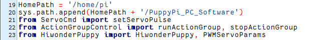

A variable named HomePath is defined to represent the main directory path as `/home/pi`. Then, `/home/pi/PuppyPi_PC_Software` is added to Python's module search path using `sys.path.append`.

The function `setServoPulse` is imported from the module `ServoCmd`. This indicates that the `ServoCmd` module contains a function named `setServoPulse`, which is used to control the pulse signal of servo motors.

The functions `runActionGroup` and `stopActionGroup` are imported from the `ActionGroupControl` module. These functions can now be used directly in the current code without needing to call them with the full module name.

The `HiwonderPuppy` and `PWMServoParams` classes are imported from the `HiwonderPuppy` module. Instances of `HiwonderPuppy` and `PWMServoParams` are created in the current code, allowing their methods and properties to be used.

* **Main Program**

{lineno-start=}
```python

```

Initialize the stance and gait configurations by calling the `stance_config` and `gait_config` methods on the `puppy` object. Start the robot dog with `puppy.start()`. Set the Debug mode to determine whether the robot dog should move. Open the camera to capture images. In the main loop, continuously capture images and call the `run()` function for image processing. The overall logic is to complete the program environment initialization, image acquisition and display, and state machine control running loop. Use the Debug mode to decide whether to enable the robot for line following and object grasping tasks.

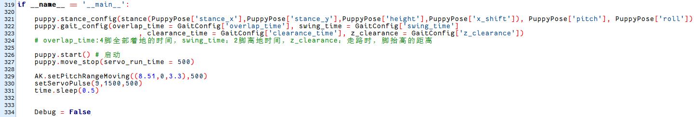

(1) Use `puppy.stance_config` to configure the stance of the robot dog's four legs in a stationary state.

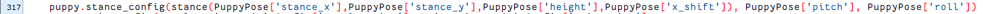

The first parameter `PuppyPose['stance_x']` indicates the additional separation distance of the four legs on the X-axis, in centimeters.

The second parameter `PuppyPose['stance_y']` indicates the additional separation distance of the four legs on the Y-axis, in centimeters.

The third parameter `PuppyPose['height']` indicates the height of the dog, which is the vertical distance from the tips of the feet to the leg pivot axis, in centimeters.

The fourth parameter `PuppyPose['x_shift']` represents the distance that all legs move in the same direction along the X-axis. The smaller the value, the more the dog leans forward while walking; the larger the value, the more it leans backward.

The fifth parameter `PuppyPose['pitch']` represents the pitch angle of the robot dog's body, in radians.

The sixth parameter `PuppyPose['roll']` represents the roll angle of the robot dog's body, in radians.

(2) Use `puppy.gait_config` to configure the parameters for the gait motion of the robot fog.

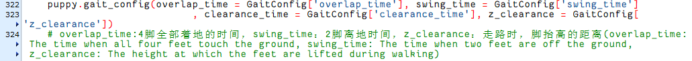

The first parameter `overlap_time` represents the time during which all four legs are simultaneously in contact with the ground.

The second parameter `swing_time` represents the time duration for a single leg to swing off the ground.

The third parameter `clearace_time` represents the time interval between the front and rear legs.

The fourth parameter `z_clearance` represents the height of the feet off the ground during the gait process.

(3) Start the robot dog, set its initial posture, and trigger the buzzer to sound.


(4) Set the Debug variable to toggle between Running modes. If Debug is True, it's a non-real-time mode where only image processing is performed while the robot dog remains stationary. If Debug is False, it's a real-time mode where both image processing and robot dog line following and object grasping tasks are performed simultaneously.

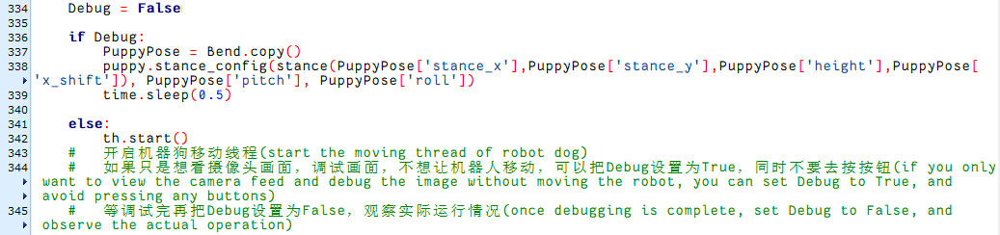

(5) Enter the real-time image processing loop. Capture images from the camera, run processing functions on the images, and display the processed images. Additionally, detect the states of two buttons to set the robot dog's state to start or stop. Continue looping until the user presses `Crtl+C` to exit. Finally, close the camera and release resources.

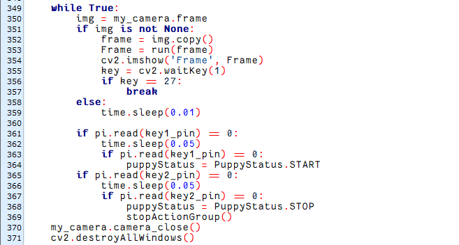

* **Stance Function**

{lineno-start=}
```python

```

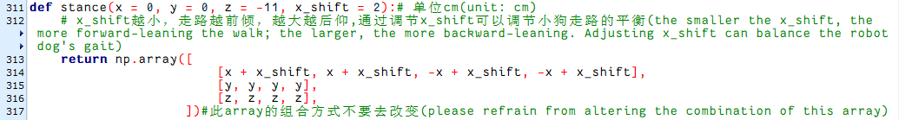

By changing the parameters within the function, describe the spatial relationship between the four limbs of the robot dog in various postures. The returned coordinate array serves as a reference for subsequent posture control and motion calculation modules.

* **getAreaMaxContour Contour Processing Function**

{lineno-start=}
```python

```

By comparing the area of contours and filtering out those with an area less than 50, return the contour object along with its corresponding area value.

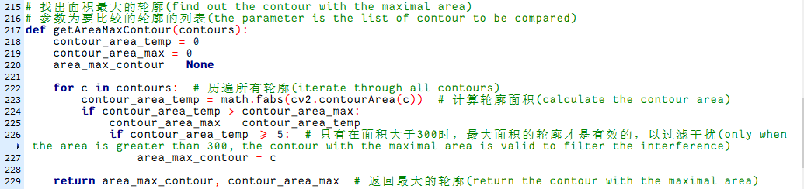

* **Run Image Processing Function**

{lineno-start=}
```python

```

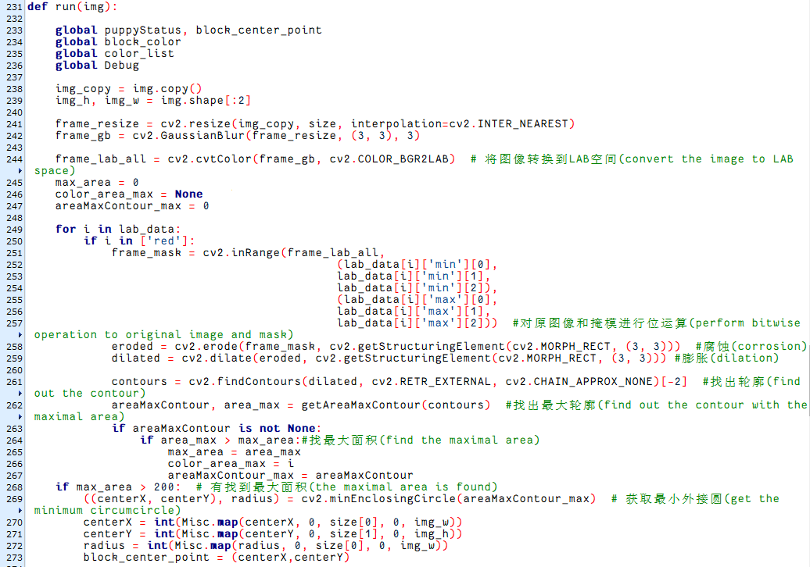

Firstly, preprocess the image by resizing and applying Gaussian blur. Then, identify lines in different ROI regions based on predefined color ranges, calculate the center point positions of the line contours, compute the parameters of the circumscribed circles of the largest area color blocks in the image, determine the recognition status, output different recognition results, and display them in the image. The overall logic involves color recognition and contour extraction from the image, calculating key points of lines, and controlling robot dog movement based on recognition results.

(1) Preprocess the image, including resizing and applying Gaussian blur.

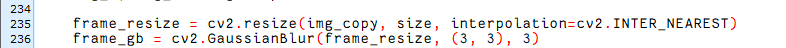

(2) Segment the preprocessed image ROI into three regions: upper, middle, and lower. Convert the RGB color of the image blocks in these three regions to the LAB color space, and perform bitwise operations with the mask.

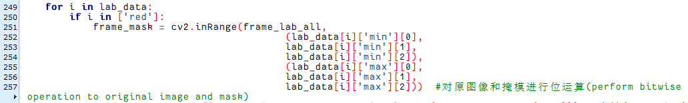

(3) After the mask operation, perform opening and closing operations on the image using mathematical morphology. Extract the outer contours of the targets using the `cv2.findContours()` function, and call the `getAreaMaxContour()` function to detect contours, filtering out those with smaller areas.

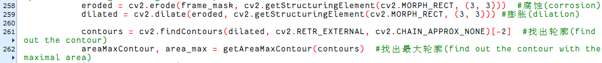

(4) Find the contours of color blocks in the image and filter out those with a maximum contour area less than 200 to improve recognition accuracy. Finally, use the `cv2.circle()` function to draw the minimum enclosing circle on the image with a yellow color.

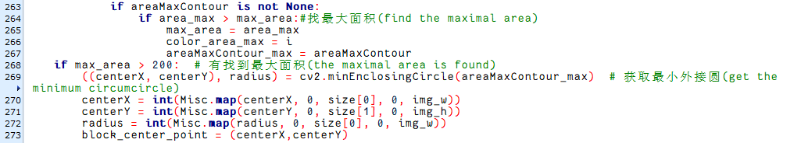

(5) Differentiate the largest color block based on color, marking them as 1 (red), 2 (green), or 3 (blue), and assign the result to `block_color`. Then, check if `weight_sum` is not equal to 0. If it is, draw the center point of the image based on the calculated center point coordinates. Finally, return the processed image based on the values of `block_center_point` and `line_centerx`.

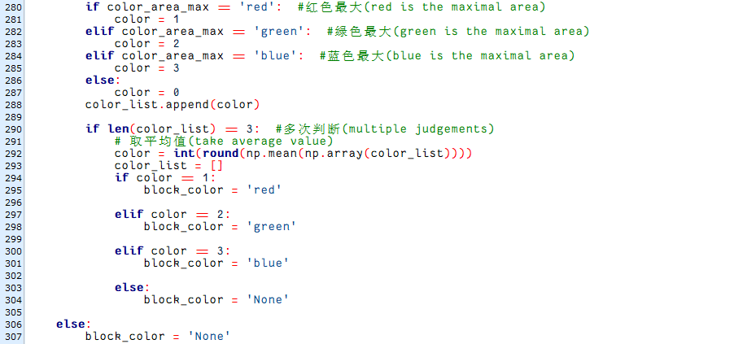

* **Move Execution Action Function**

{lineno-start=}
```python

```

During the startup phase (`PuppyStatus.START`), the robot dog stops moving and initializes its posture. In the normal forward phase (`PuppyStatus.NORMAL`), the robot dog's movement direction and speed are controlled based on the position relationship between the image center point and the color block center point. If a red color block is detected (`PuppyStatus.FOUND_TARGET`), execute the grasping action, and then turn the robot dog to the left for a certain distance. During the placing phase (`PuppyStatus.PLACE`), start searching for red placing points. If a red placing point is found, execute the placing action.

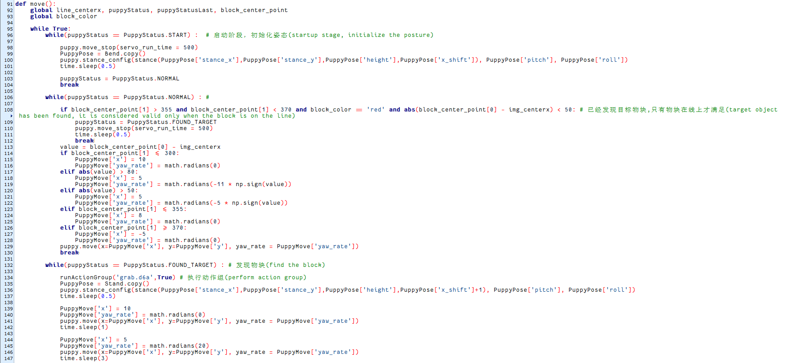

* **getAreaMaxContour Function**

{lineno-start=}
```python

```

Here is a screenshot of the code for the getAreaMaxContour function:

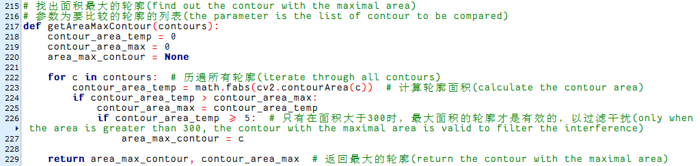

From a group of contours, find the contour with the largest area. The function iterates through all the contours, calculates their areas, and retains the contour with the largest area. Additionally, a condition is added during area calculation to consider only contours with an area greater than or equal to 5, filtering out smaller disturbances. Finally, the function returns the found largest contour along with its corresponding area.

### 18.7.5 Function Extension

When recognizing red, PuppyPi executes action of `gripping` and `placing` color block. To change to color to be detected, such as the `green` color block, follow these steps:

(1) Input the following command to edit color recognition gripping program. Then press Enter.

```
rosed puppy_with_arm color_grab.py
```

(2) Find the code as pictured:

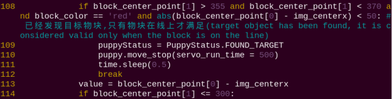

:::{Note}
After entering the code position number on the keyboard, press the `Shift+G` keys to directly navigate to the corresponding position. The code position number shown in the illustration is for reference only, please refer to the actual position.
:::

(3) Press `i` to go to the editing mode. And change `red` to `green`.

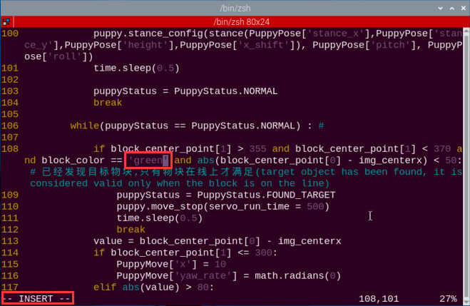

(4) After modification, press Esc and input `:wq`. Then press Enter to save and exit.

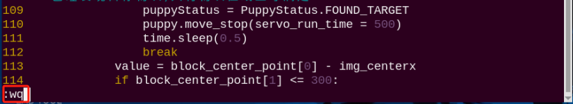

(5) Refer to [18.7.2 Operation Steps]() to restart the program to check the modified game effects.

## 18.8 Line Following Gripping

### 18.8.1 Program Logic

First, it's necessary to recognize the line colors. Here, we're using the Lab color space for processing. We'll convert the image color space from RGB to Lab.

Next, perform operations such as binarization, erosion, and dilation on the image to obtain contours containing only the target color, and mark them with rectangles.

After completing color recognition, calculate based on the feedback of line positions in the image, and control the PuppyPi robot dog to move along the lines, thus achieving autonomous line-following walking.

During line following, if color blocks of the target color are detected, the robot will call action groups to grasp and transport the color blocks. After the transport is completed, it will return to the task of autonomous line following.

### 18.8.2 Operation Steps

:::{Note}
Instructions must be entered with strict attention to case sensitivity and spacing.
:::

(1) Turn on PuppyPi, and connect it to Raspberry Pi desktop via VNC.

(2) Click the icon  on the upper left corner, or use shortcut `Ctrl+Alt+T` to open the LX terminal.

(3) Input command and press Enter to stop button control service.

```
sudo systemctl stop button_scan.service
```

(4) Click the icon  on the upper left corner to open the Terminator terminal.


(5) Input command and press Enter to close auto-start program.

```
sudo ./.stop_ros.sh
```

(6) Input the line follow gripping command and press Enter to start the program.

```
roslaunch puppy_with_arm visual_patrol_with_arm.launch
```

(7) Press Key1 on the expansion board to start the program.

(8) If you need to close this game, you can press `Ctrl+C` in the LX terminal interface. If closing fails, you can try pressing multiple times.

(9) After closing the game, you still need to enter the following command and press Enter to start the app's auto-start service.

```
sudo systemctl restart start_node.service
```

After startup is complete, the buzzer will emit a short beep sound, like `beep`.

:::{Note}
If the app's auto-start service is not initiated, it will affect the normal implementation of the corresponding game in the app. If the command for auto-start is not entered, restarting the robot dog will also restart the app's auto-start service.
:::

(10) Additionally, you need to input the command and press Enter to start button detection service.

```
sudo systemctl restart button_scan.service
```

### 18.8.3 Program Outcome

:::{Note}
After starting the game, please ensure that there are no other objects containing the recognized colors within the field of view of the camera, to avoid affecting the implementation of the game.
:::

After placing the PuppyPi robot dog on a black line, starting the gameplay will prompt the robot dog to move along the black line. If a color block is detected blocking the line ahead, the robot will perform a `transport` action. It will pick up red color blocks and place them on the left side of the line, and pick up green or blue color blocks and place them on the right side of the line. After completing the pick-up action, it will continue with the line-following task.

:::{Note}
If the color recognition is inaccurate, you can refer to [8.5 AI Vision and Tracking Course->8.5.1 Color Threshold Adjustment]() to adjust.
:::

If there are instances of inaccurate gripping positions, you can modify the parameter `block_center_point[1]` in the program. A larger value will position the gripper further back, while a smaller value will position it further forward.

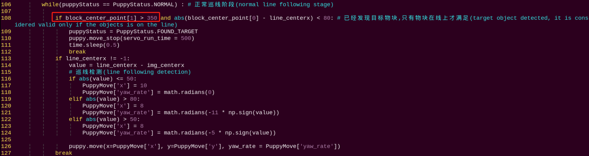

### 18.8.4 Program Analysis

[Source Code]()

:::{Note}
Before modifying the program, it is essential to back up the original factory program. Avoid making direct modifications in the source code files to prevent unintentional changes to parameters that could lead to robot malfunctions and be irreparable!
:::

Based on the camera feed, obtain real-time visual information and use color thresholding algorithms to extract the color lines required for line following. Calculate the robot's required movement speed and heading angle based on the offset of the lines in the image, correcting its position to keep the lines centered in the frame in real-time. If a target color block is detected in front of the line-following position, execute a grasping action to place the color block aside and continue with the line-following task.

* **Launch File Analysis**

During the execution of the functionality, the launch file of the current package will be started (`color_detect_with_arm.launch`) as pictured:

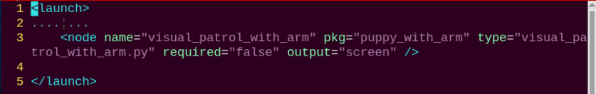

From the above diagram, it can be seen that the node name for this game functionality is `color_detect_with_arm`, and this node is located in the package `puppy_with_arm`. The node displays the processed information through the terminal.

Finally, the line following gripping function is executed by calling the source code file `visual_patrol_with_arm.py`.

* **Source Code Program Analysis**

The source code of this program is stored at: [/home/ubuntu/puppypi/src/puppy_with_arm/scripts/visual_patrol_with_arm.py]()

{lineno-start=}
```python

```

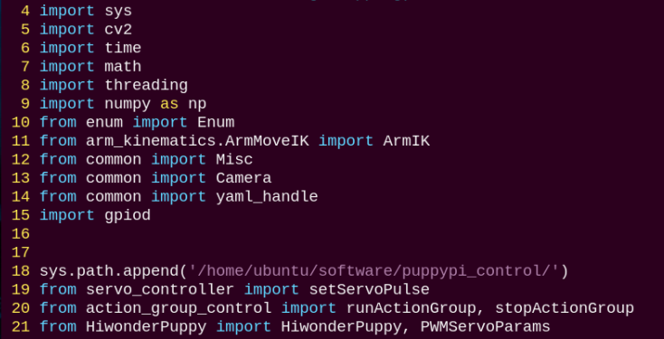

① `sys` is used for handling command-line arguments and exiting the program;

② `cv2` is used for OpenCV image processing;

③ `math` is used for mathematical calculations;

④ `time` is used for timing and delays;

⑤ `threading` is used for implementing parallel processing;

⑥ `numpy` is used for scientific computing.

⑦ `enum` is used to define program running states.

⑧ `ArmMoveIK` is used to control robotic arm movement.

⑨ `pigpio` is used for GPIO control, facilitating communication with peripheral hardware.

⑩ Import functions from servoCmd for setting servo pulse width.

⑪ Import action groups from ActionGroupControl.

* **Main Program**

{lineno-start=}
```python

```

Initialize the posture and gait settings using the `stance_config` and `gait_config` methods of the puppy object, then start the robot dog with `puppy.start()`. Set the Debug mode to control whether the robot dog moves. Next, open the camera to capture images. In the main loop, continuously capture images and call the `run()` function for image processing. The overall logic involves initializing the program environment, acquiring and displaying images, running a state machine control loop, and optionally enabling line-following and object grasping tasks based on the Debug mode.

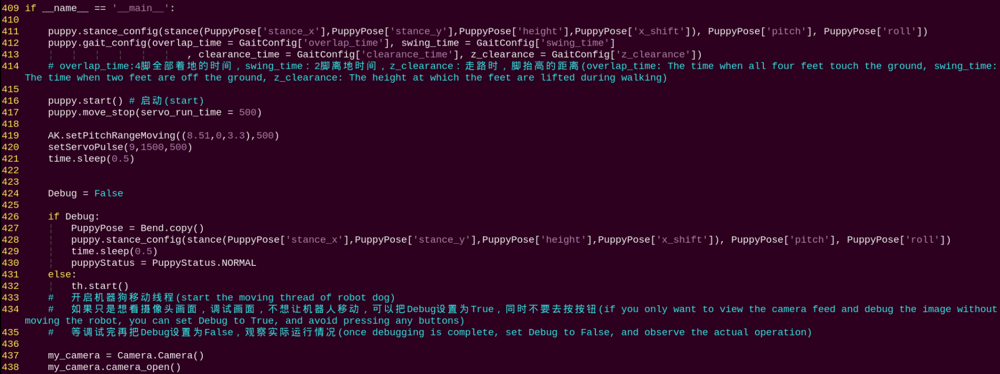

(1) Use `puppy.stance_config` to configure the stance of the robot dog's four legs in a stationary state.

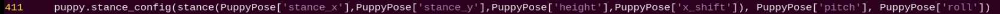

The first parameter `PuppyPose['stance_x']` indicates the additional separation distance of the four legs on the X-axis, in centimeters.

The second parameter `PuppyPose['stance_y']` indicates the additional separation distance of the four legs on the Y-axis, in centimeters.

The third parameter `PuppyPose['height']` indicates the height of the dog, which is the vertical distance from the tips of the feet to the leg pivot axis, in centimeters.

The fourth parameter `PuppyPose['x_shift']` represents the distance that all legs move in the same direction along the X-axis. The smaller the value, the more the dog leans forward while walking; the larger the value, the more it leans backward.

The fifth parameter `PuppyPose['pitch']` represents the pitch angle of the robot dog's body, in radians.

The sixth parameter `PuppyPose['roll']` represents the roll angle of the robot dog's body, in radians.

(2) Use `puppy.gait_config` to configure the parameters for the gait motion of the robot fog.

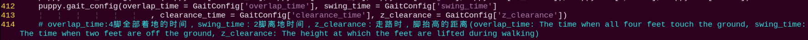

The first parameter `overlap_time` represents the time during which all four legs are simultaneously in contact with the ground.

The second parameter `swing_time` represents the time duration for a single leg to swing off the ground.

The third parameter `clearace_time` represents the time interval between the front and rear legs.

The fourth parameter `z_clearance` represents the height of the feet off the ground during the gait process.

(3) Set the Debug variable to toggle between Running modes. If Debug is True, it's a non-real-time mode where only image processing is performed while the robot dog remains stationary. If Debug is False, it's a real-time mode where both image processing and robot dog line following and object grasping tasks are performed simultaneously.

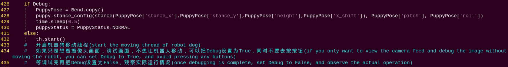

* **Stance Function**

{lineno-start=}
```python

```

The following is a screenshot of the code inside the stance function:

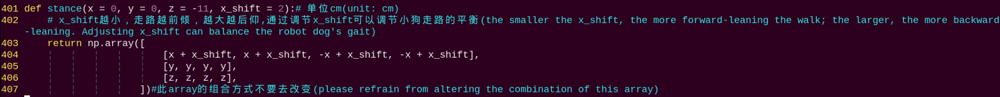

By altering the parameters within the function, describe the spatial relationship of the robot dog's four limbs in various postures. The returned coordinate array provides reference for subsequent posture control and motion calculation modules.

* **Run Image Processing Function**

{lineno-start=}
```python

```

The following is a screenshot of the code inside the run function:


First, preprocess the image, including resizing and applying Gaussian blur. Then, identify lines in different ROI regions based on predefined color ranges, calculate the center point positions of the line contours, and compute the parameters of the minimum enclosing circle for the largest area color block detected in the image. Based on the judgment of recognition status, output different recognition results such as line center points and color block types, and display them in the image. The overall logic involves color recognition and contour extraction from the image, calculating key points of lines, and outputting recognition results for motion control.

(1) Preprocess the image, including resizing and applying Gaussian blur.

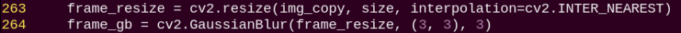

(2) Segment the preprocessed image ROI into three regions: upper, middle, and lower. Convert the RGB color of the image blocks in these three regions to the LAB color space, and perform bitwise operations with the mask.

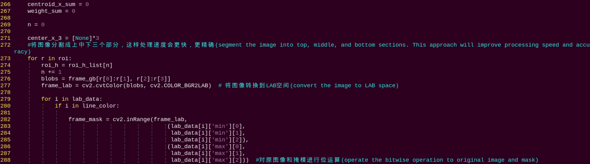

(3) After the mask operation, perform opening and closing operations on the image using mathematical morphology. Extract the outer contours of the targets using the `cv2.findContours()` function, and call the `getAreaMaxContour()` function to detect contours, filtering out those with smaller areas.

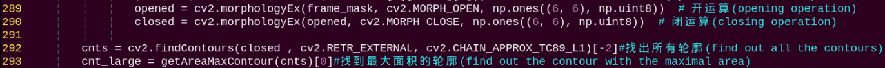

(4) By checking if `cnt_large` is not empty, it indicates the detection of the target color. Using the `cv2.minAreaRect()` function, calculate the minimum bounding rectangle of `cnt_large` and assign the processed result to `rect`. Then, use the `cv2.boxPoints()` function to obtain the four vertices of the minimum bounding rectangle and draw this rectangle and its center point on the image. Additionally, add the X-coordinate of the rectangle's center point to `centroid_x_sum` based on the weight value for subsequent calculations.

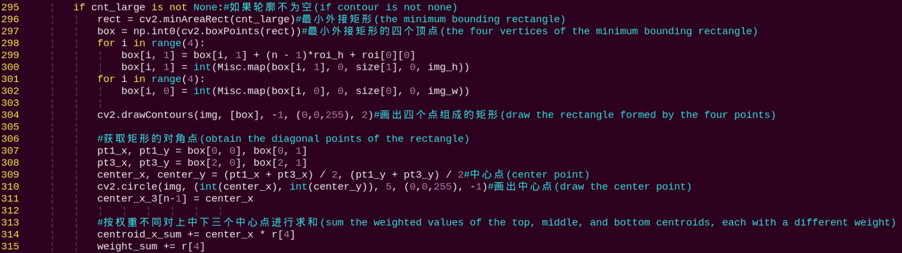

(5) By checking the value of `puppyStatus`, it indicates that the robot is currently performing the line-following and object grasping task. Then, the image is converted to the LAB color space. Based on the color threshold ranges defined in `lab_data`, bitwise operations, erosion, and dilation operations are performed on the image to find color block contours. Contours with a maximum area less than 200 are filtered out to improve recognition accuracy. Finally, the `cv2.circle()` function is used to draw the minimum enclosing circle on the image with the color corresponding to the color block.

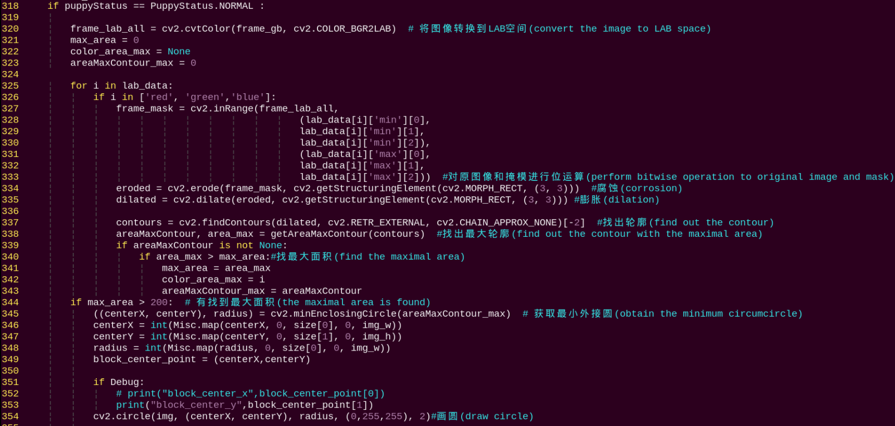

(6) Differentiate the largest color block based on color, marking them as 1 (red), 2 (green), or 3 (blue), and assign the result to `block_color`. Then, check if `weight_sum` is not equal to 0. If it is, draw the center point of the image based on the calculated center point coordinates. Finally, return the processed image based on the values of `block_center_point` and `line_centerx`.

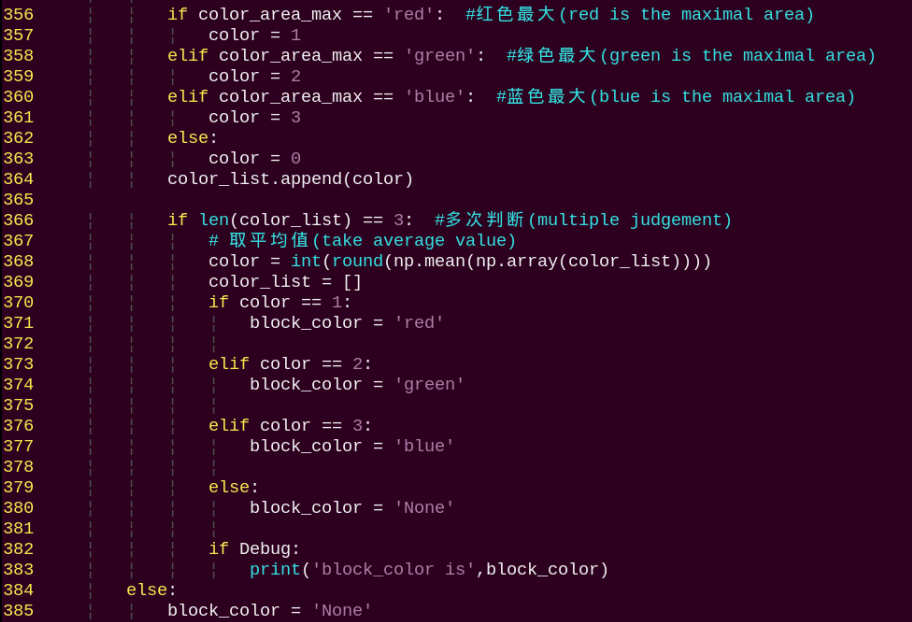

* **Move Execution Action Function**

{lineno-start=}
```python

```

The following is a screenshot of the code portion inside the move function:

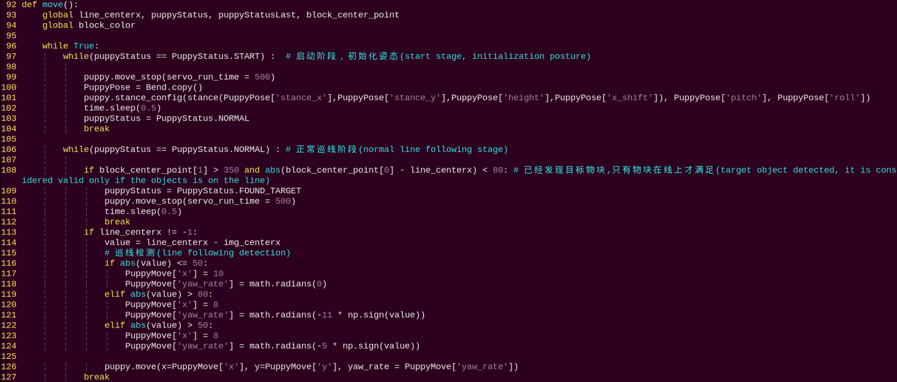

During the startup phase (`PuppyStatus.START`), the robot dog stops moving and initializes its posture. During normal line-following phase (`PuppyStatus.NORMAL`), the robot dog's movement direction and speed are controlled based on the position relationship between the image center point and the block center point. If a color block is detected (`PuppyStatus.FOUND_TARGET`), the corresponding action group is executed based on the color of the block. If the block is red, the robot first performs the grasping action, then moves to the left side of the line, and finally executes the placing action. If the block is green or blue, the robot first performs the grasping action, then moves to the right side of the line, and finally executes the placing action.

* **getAreaMaxContour Function**

{lineno-start=}
```python

```

The following is a screenshot of the code portion inside the getAreaMaxContour function:

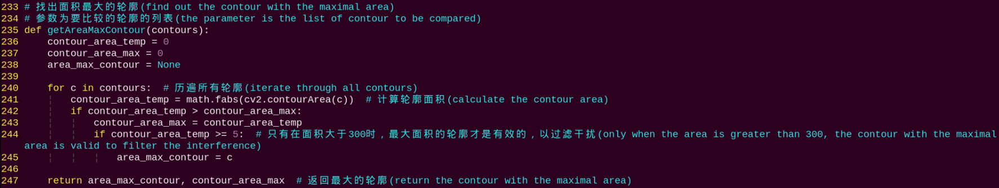

From a group of contours, find the contour with the largest area. The function iterates through all the contours, calculates their areas, and retains the contour with the largest area. Additionally, a condition is added during area calculation to consider only contours with an area greater than or equal to 5, filtering out smaller disturbances. Finally, the function returns the found largest contour along with its corresponding area.

### 18.8.5 Function Extension

When the game default recognizes red, the robot dog executes the `grasping` action group and places the red color block on the left side of the line. When the game default recognizes green, the robot dog executes the `grasping` action group and places the green color block on the right side of the line. If you need to change the placement position, for example, swapping the positions of the `red` and `green` color blocks, you can follow these steps:

(1) Input the following command and press Enter to edit the line following gripping program.

```
rosed puppy_with_arm visual_patrol_with_arm.py
```

(2) Find the following code:

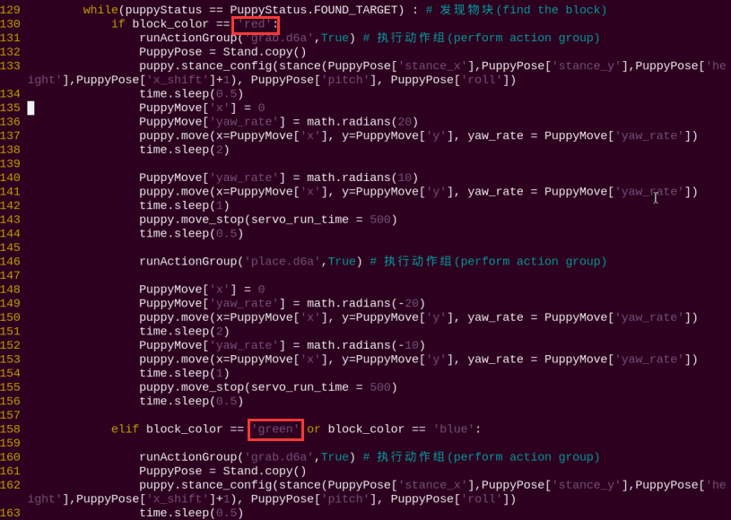

:::{Note}
After entering the code position number on the keyboard, press the `Shift+G` keys to directly navigate to the corresponding position. The code position number shown in the illustration is for reference only, please refer to the actual position.
:::

(3) Press `i` to go to the editing mode. And swap the positions of the `red` and `green`.

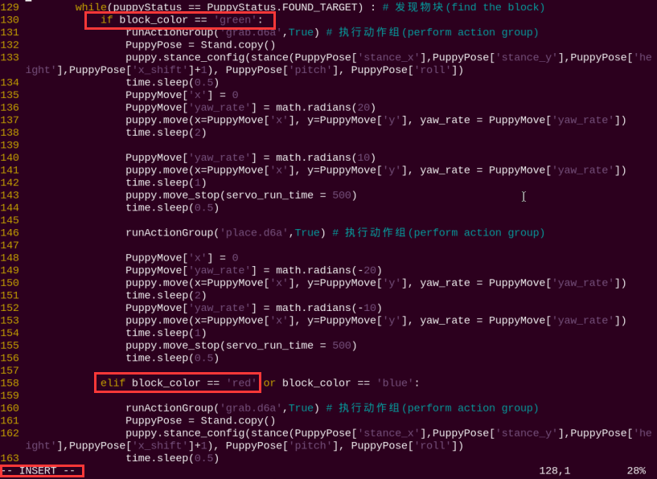

(4) After modification, press Esc and input `:wq`. Then press Enter to save and exit.

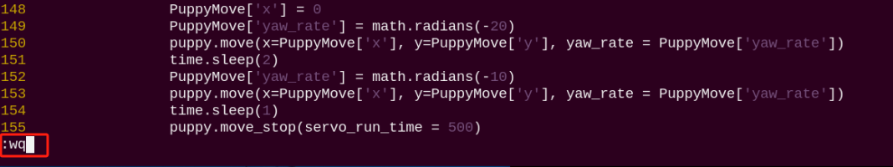

(5) Refer to [18.8.2 Operation Steps]() to restart the program to check the modified game effects.

## 18.9 Control Robotic Arm Using Gesture

### 18.9.1 Program Logic

First, subscribe to the topic messages published by the camera node to obtain real-time image data.

Next, use the Mediapipe library to connect the recognized keypoints of the hand. Normalize the coordinates of the keypoints of the thumb and index finger, then convert them to pixel coordinates in the image. Calculate the distance between these two points.

Finally, the robotic gripper performs opening and closing movements based on the calculated distance.

### 18.9.2 Operation Steps

:::{Note}
Instructions must be entered with strict attention to case sensitivity and spacing.
:::

(1) Turn on PuppyPi, and connect it to Raspberry Pi desktop via VNC.

(2) Click the icon  on the upper left corner to open the Terminator terminal.


(3) Input the following command and press Enter to close the auto-start program.

```
sudo ./.stop_ros.sh
```

(4) Input the following command and press Enter to start the program.

```
roslaunch puppy_with_arm hand_control_with_arm.launch
```

To reduce memory usage and ensure the normal use of the game here, the camera feed is not displayed. If you want to enable the camera feed, you can follow the steps below.

:::{Note}
Before starting the camera feed, ensure that the gesture control gameplay is functioning properly, as otherwise, the camera feed may not start properly.
:::

After starting the game, if the camera feed is not displayed via VNC, you can view the camera feed in a web browser by opening the `web_video_server` service.

(5) Use any web browser and enter the address [192.168.149.1:8080]().

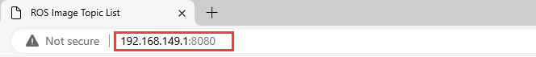

(6) Select the corresponding node's image to view.

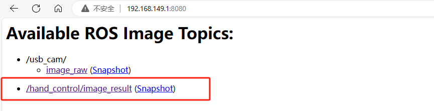

(7) Enter the camera feedback interface for gesture-controlled robotic arm game as pictured:


(8) If you need to close this game, you can press `Ctrl+C` in the LX terminal interface. If closing fails, you can try pressing multiple times.

(9) After closing the game, you still need to enter the command and press Enter to start the app auto-start service.

After the startup is completed, the buzzer will emit a short beep sound `beep`.

:::{Note}
If the app auto-start service is not enabled, it will affect the normal implementation of the corresponding gameplay in the app. If the command for auto-start is not entered, restarting the robot dog will also restart the app auto-start service.
:::

### 18.9.3 Program Outcome

After the game starts, when hand features are recognized, they will be connected by dots and lines. A yellow line connects the thumb and index finger, and the distance between them is calculated and displayed in the lower-left corner. The mechanical gripper of Puppypi will follow the changes in distance between the thumb and index finger.


### 18.9.4 Program Analysis

[Source Code]()

* **Launch File Analysis**

The source code of this program is stored at [/home/ubuntu/puppy_pi/src/puppy_with_arm/launch/hand_control_with_arm.launch]()

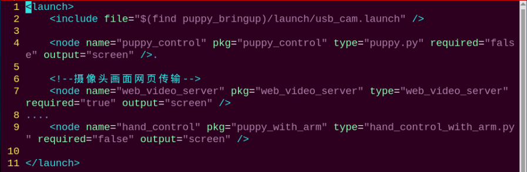

The `<include>` tag is used to include the launch file named `config_manager.launch`, which is located in the `launch` folder of the `puppy_pi_bringup` package. This file contains some tags and configuration parameters related to colors.

The `<include>` tag is used to include the launch file named `start_camera.launch`, which is located in the `launch` folder of the `puppy_pi_bringup` package. This file is used to start the camera node.

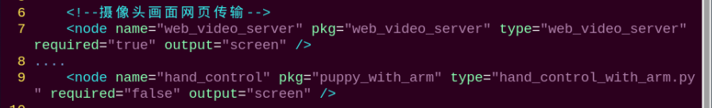

The first `<node>` tag is used to launch a node named `web_video_server`, which is used for camera web transmission. Its definition is as follows:

name=`web_video_server`：Node name is web_video_server.

pkg=`web_video_server`：The software package where the node resides is web_video_server.

type=`web_video_server`：Node type is puppy, which indicates the execution of an executable file named `web_video_server`.

required=`true`：This node is not essential. Setting it to `true` means that if this node fails to start, it will cause the entire launch file to stop.

output=`screen`：The output of the specified node will be displayed on the screen.

The second `<node>` tag is used to launch a node named `hand_control`, which is used to control the robotic arm. Its definition is as follows:

name=`hand_control`：Then node name is hand_control.

pkg=`puppy_with_arm`：The software package where the node belongs to is puppy_with_arm.

type=`hand_control_with_arm.py`：The node type is hand_control_with_arm.py, which indicates running a Python executable file named `hand_control_with_arm.py`.

required=`false`：This node is essential. Setting it to `false` means that even if this node fails to start, it will not affect the overall execution of the launch file.

output=`screen`：Specify that the output of the node will be displayed on the screen.

* **Source Code Program Analysis**

The source code of this program is stored at: [home/ubuntu/puppy_pi/src/puppy_with_arm/scripts/hand_control_with_arm.py]()

* **Import Related Application Library**

{lineno-start=}
```python

```

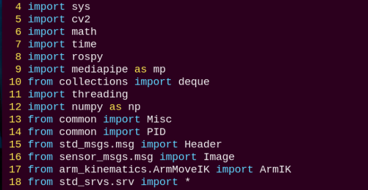

① `sys` is used for handling command-line arguments and exiting the program;

② `cv2` is used for OpenCV image processing;

③ `math` is used for mathematical calculations;

④ `rospy` is used for ROS communication;

⑤ `time` is used for timing and delays;

⑥ mediapipe is used for gesture recognition

⑦ threading is used for implementing parallel processing.

⑧ `Misc`、`PID` are used for PID control of robotic arm movement;

⑨ Import service type from `std_srvs.srv`.

⑩ Import ROS image message module from `sensor_msgs.msg` for handling image messages;

⑪ Import `ArmIK` from `arm_kinematics.ArmMoveIK` for inverse kinematics control;

⑫ Import all service types from the `std_srvs.srv` package.

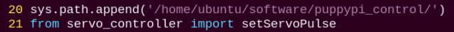

A variable named HomePath is defined to represent the main directory path as `/home/pi`. Then, `/home/pi/PuppyPi_PC_Software` is added to Python's module search path using `sys.path.append`.

The function `setServoPulse` is imported from the module `ServoCmd`. This indicates that the `ServoCmd` module contains a function named `setServoPulse`, which is used to control the pulse signal of servo motors.

* **Distance Calculation Between Two Points**

{lineno-start=}
```python

```


Using the Python math library, the Euclidean distance between two points is calculated. It computes the distance between two points (`point_1[0]`, `point_1[1]`) and (`point_2[0]`, `point_2[1]`) on a two-dimensional plane.

(`point_1[0]` - `point_2[0]`) ** 2 and (`point_1[1]` - `point_2[1]`) ** 2: These calculate the squares of the differences in the x and y directions, respectively. Then, these squares are added together to obtain the square of the Euclidean distance.

`math.sqrt`：Calculate the square root of the sum to obtain the final Euclidean distance.

* **Coordinates Conversion**

{lineno-start=}
```python

```

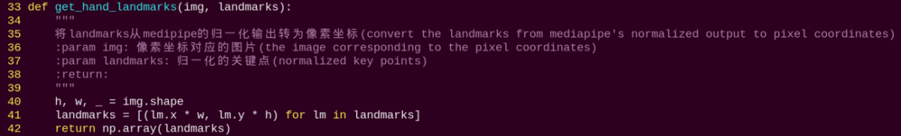

landmarks = `[(lm.x * w, lm.y * h) for lm in landmarks]`：Using list comprehension, multiply each key point's x and y coordinates by the width and height of the image, respectively, to obtain the actual coordinates. Here, `lm` represents the object containing key points.

return `np.array(landmarks)`：Convert the mapped key point coordinates to a NumPy array and return it as the function's result.

* **Convert the OpenCV Image to the Image Message of the ROS**

{lineno-start=}
```python

```

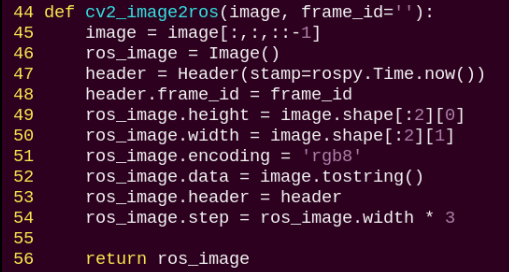

The function `cv2_image2ros` converts an image in OpenCV format to the ROS image message format. It first converts the image channels from BGR to RGB, then creates a ROS image message, setting its header information, dimensions, encoding, and data. Finally, it returns the converted ROS image message.

* **HandControlWithArmNode Class Initialization**

{lineno-start=}
```python

```

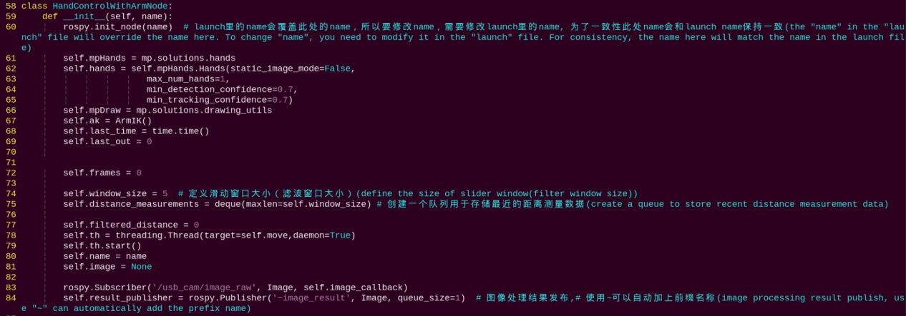

① `rospy.init_node(name)`: Initialize a ROS node. The node name is `name`.

② `self.mpHands = mp.solutions.hands`: Import hands module of the mp library.

③ `self.hands = self.mpHands.Hands(...)`: Create a hand detection object configured with parameters such as whether to use static image mode, maximum number of hands, minimum confidence for detection and tracking.

④ `self.mpDraw = mp.solutions.drawing_utils`: Import the drawing tool module.

⑤ `self.ak = ArmIK()`: Create a ArmIK object, = is used for inverse kinematics computation.

⑥ `self.last_time = time.time()`: Record current time.

⑦ `self.last_out = 0`: Initialize a variable.

⑧ `self.frames = 0`: Initialize a frame counter.

⑨ `self.window_size = 5`: Define the size of the sliding window as 5.

`self.distance_measurements = deque(maxlen=self.window_size)`: Create a double-ended queue to store the most recent distance measurement data, with a maximum capacity of 5 data points.

⑩ `self.filtered_distance = 0`: Initialize a filtered distance variable.

⑪ `self.th = threading.Thread(target=self.move,daemon=True)`: Create a new thread to execute the move method and set it as a daemon thread.

⑫ `self.th.start()`: Start new thread.

⑬ `self.name = name`: Assign the passed name value to `self.name`.

⑭ `self.image = None`: Initialize a image variable to None.

⑮ `rospy.Subscriber('/usb_cam/image_raw', Image, self.image_callback)`: Subscribe to the ROS topic named `/usb_cam/image_raw` with the message type Image. When a message is received, call the `self.image_callback` callback function.

⑯ `self.result_publisher = rospy.Publisher('~image_result', Image, queue_size=1)`: Create a publisher that publishes on the ROS topic named `~image_result`, with the message type Image and a queue size of 1.

* **Image Callback Function**

{lineno-start=}
```python

```

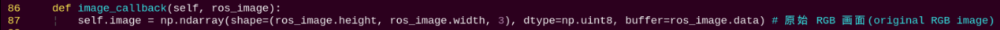

A callback function named `image_callback` is defined to handle ROS image messages. It uses NumPy to create an array, converts ROS image data to RGB format, and stores it in the object's image attribute.

* **Set the Initial State of Robotic Arm**

{lineno-start=}
```python

```

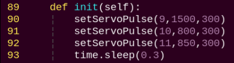

Use `setServoPulse` function to control servo. Take `setServoPulse(9,1500,300)` as example here:

The fist parameter `9` is servo ID; the second parameter `1500` is servo pulse-width; the third parameter `300` is the servo running time in ms.

* **Claw Movement Function**

{lineno-start=}
```python

```

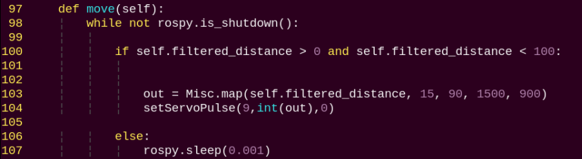

Within the loop, the code checks if the value of `self.filtered_distance` is between 0 and 100. If it is, some operations are performed:

The `Misc.map` function is used to map `self.filtered_distance` to a new range, specifically mapping [15, 90] to [1500, 900]. This mapping is used to scale the measured distance between the two fingers into the range of control signals.

The `setServoPulse` function is called, passing the mapped value as a parameter to the servo motor. The function takes three parameters: the servo ID, the pulse width, and the time. Setting the time to 0 indicates that the servo will execute a single movement to the target position. This function is used to adjust the position of the claw servo motor.

If the value of `self.filtered_distance` is not between 0 and 100, the code sleeps for 0.001 seconds using `rospy.sleep(0.001)`.

* **Main Function**

{lineno-start=}
```python

```

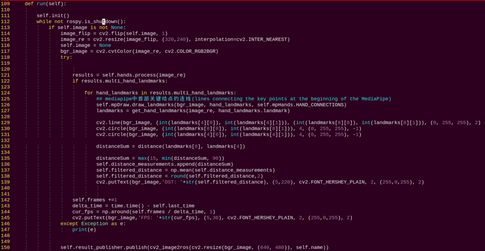

`self.init()`：The `init` method is called to perform some parameter settings and initialize ROS-related components.

The main loop `while not rospy.is_shutdown()` executes the loop as long as the ROS node is not shut down.

if `self.image is not None`: Check if there is image data available. If there is image data, perform the following operations:

① Image processing: First, flip the image horizontally. Resize the image to (320, 240). Clear the original image. Finally, convert the RGB format image to BGR format.

② Hand pose detection:

Perform hand pose detection using MediaPipe to obtain the coordinates of hand keypoints, then draw the hand keypoints and connecting lines on the image.

Calculate the distance between fingers, update the distance measurement list `self.distance_measurements`, compute the mean distance, update `self.filtered_distance`, and display the distance information on the image.

③ Compute the frame rate information: Record the frame count and calculate the frame rate, then display the frame rate information on the image.

④ Publish result image: `self.result_publisher.publish(cv2_image2ros(cv2.resize(bgr_image, (640, 480)), self.name))`：Publish the processed image via ROS.

## 18.10 Fixed Point Navigation Handling

:::{Note}
Before starting this game, you should have the map constructed. The completeness of the map will affect the navigation effect. You can refer to [8.13 SLAM Mapping Course->8.13.2 Gmapping Mapping Algorithm]() for mapping. To ensure the mapping effect, you need to disassemble the robotic arm on the robot or use an PC software to change the posture of the robotic arm. Do not obstruct the LiDAR.
:::

### 18.10.1 Working Principle

Firstly, start the navigation service and obtain the location information of the destination.

Next, perform navigation path planning to drive to the destination.

Then, subscribe to the topic messages published by the camera node to obtain the image, and perform color recognition.

Finally, locate the placement point and execute action group to control the robotic arm to complete the color block placement task.

### 18.10.2 The Installation and Configuration of Virtual Machine

Due to the limited computing power of the Raspberry Pi, it is necessary to offload part of the mapping work to a virtual machine. Both mapping and navigation require communication between the virtual machine and the PuppyPi, so we need to modify the configurations of both.

* **Install Virtual Machine Software**

You can refer to the document [Virtual Machine Installation.docx]() in the same directory for instructions on installing the virtual machine.

* **Open and Import of Virtual Machine**

(1) Unzip the virtual machine files from the appendix to any path that does not contain Chinese characters.


(2) Open a virtual machine.


(3) Select the folder where virtual machine file is extracted, then open it.


(4) Enter the name and set the storage path for virtual machine. Then click `Import`.

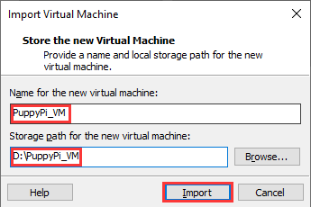

:::{Note}
After the first importing, you can directly select the storage path for the previous virtual machine, and open it without importing it again.
:::

* **Network Configuration of Virtual Machine**

:::{Note}
If you are using desktop computer, please prepare a wireless LAN adapter or USB wireless adapter.
:::

(1) Firstly, start PuppyPi, and join the WiFi created by PuppyPi on computer.


(2) Return to the virtual machine interface, and click `edit->virtual machine editor`.


(3) Select the wireless network card to be bridged. Then click OK.


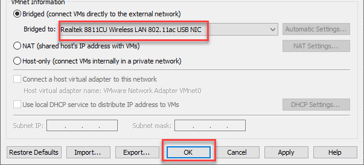

(4) Open virtual machine, and power on virtual machine.


(5) When entering the system desktop, right click the desktop and select `open in terminal`.


:::{Note}
The input command should be case sensitive and the keywords can be complemented by `Tab` key.
:::

(6) Input the following command and press Enter to check the IP of virtual machine. And the IP is as the red frame shown.

```
ifconfig
```

(7) Right click the system desktop, and open a new command line terminal. Then input the following command and press Enter to configure the network.

```
sudo nano /etc/hosts
```

(8) Modify the IP in the second and the third lines as the IP of virtual machine and Raspberry Pi you got in the previous step. And the fixed IP of Raspberry Pi under direct connection mode is `192.168.149.1`.


:::{Note}
When modifying the IP, please ensure the indent is consistent.
:::

(9) After modification, press `Ctrl+x`, and `Y` key to save modified buffer, then press Enter.


* **PuppyPi Network Configuration**

(1) Get access to Raspberry Pi desktop via VNC.

(2) Click  or use shortcut `Ctrl+Alt+T` to open terminal.

(3) Enter the following command and press Enter to change network configuration.

```
sudo vim /etc/hosts
```

(4) Find the code marked in the below figure, then enter the IP of virtual machine which can be obtained in step 1.2. After that， press `Esc` key, enter `:wq` and press Enter key to save and exit.


(5) Run the command below to update the configuration.

```
source .bashrc
```

(6) Open the virtual machine and enter the command to view the relevant topics of the robot. If they are successfully displayed, communication with the robot is successful. If they cannot be displayed successfully, you need to recheck the above steps for errors.

```
rostopic list
```

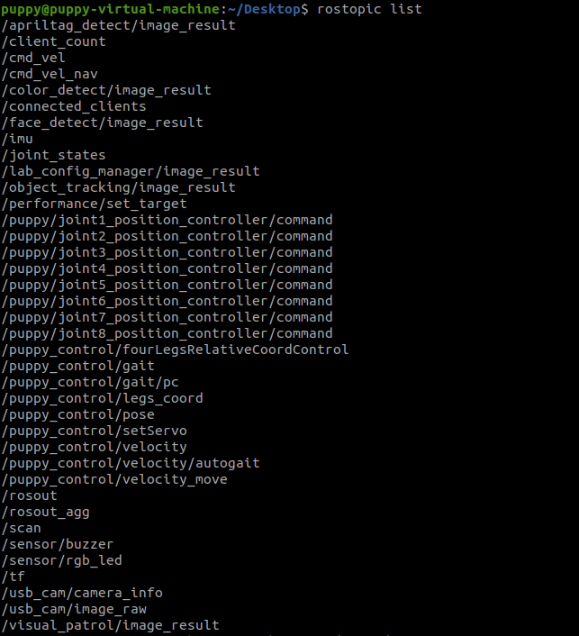

(7) Open the virtual machine and enter the command to synchronize the time with PuppyPi. If the time is not synchronized, it will affect the subsequent navigation effects.

```
sudo ntpdate 192.168.149.1
```

If the following error occurs, you can retry several times and check if the network configuration is successful.

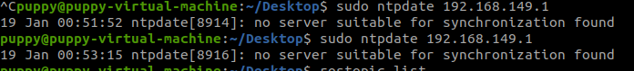

### 18.10.3 Start Navigation

(1) Open the PuppyPi system, open the command prompt, enter the following command, and press Enter to start the basic configuration of the robot.

```
roslaunch puppy_pi_bringup start_node_nav.launch
```

(2) Open the PuppyPi system, open the command prompt, enter the following command, and press Enter to start the navigation service of robot.

```
roslaunch puppy_navigation navigation.launch
```

:::{Note}
By default, the map recorded here is map1.
:::

If the following content appears, the opening is successful:


(3) Click `File` > `New Tab` at the top of the terminal window. Since a large volume of data will be generated during the mapping process, placing fast-refreshing tabs at the bottom of the terminal interface helps reduce system load and conserve computing resources.

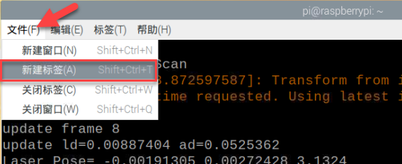

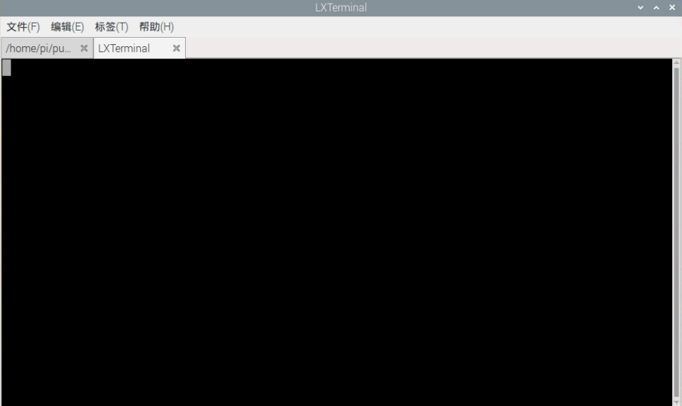

If you encounter a memory-related error (as shown below), it is caused by insufficient system memory. This does not affect the functionality of the gameplay and can be safely ignored.

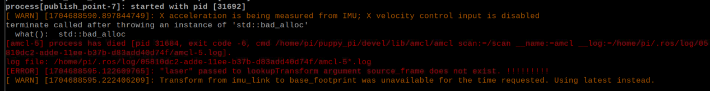

(4) On the PuppyPi system, open a terminal and enter the following command to launch the navigation-based object placement feature:

No output will appear in the terminal immediately. Status messages will be displayed only after the robot successfully reaches a navigation point.

```
rosrun puppy_with_arm color_place_nav.py
```

(5) Open a terminal in the virtual machine and run the corresponding command to start the parameter server. Starting the parameter server is essential. Without it, the robot's joints will not be driven, and its joint movements will not be visible in RVIZ.


(6) Open a new command line terminal window, enter the following command to start the model viewing software, and press Enter.

```
roslaunch puppy_description rviz_with_urdf.launch
```


(7) Click `File->Open Config`.

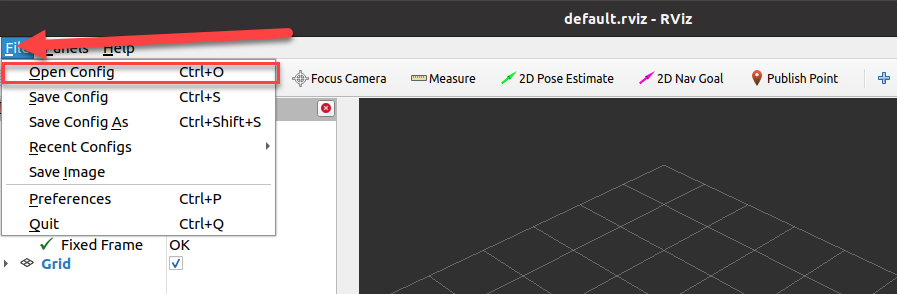

As shown in the following image, navigate to the corresponding path, select `navigation.rviz`, and then click `Open`.

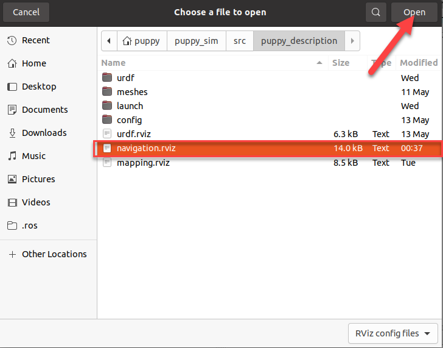

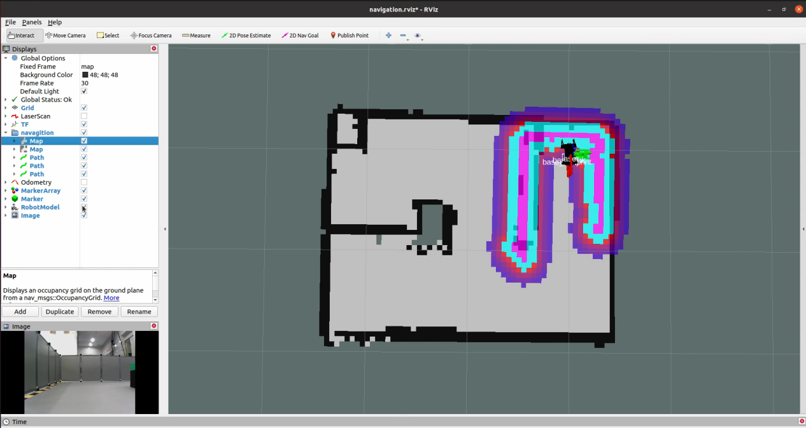

### 18.10.4 Program Outcome

* **Grasp Color Block**

Before starting the navigation, we need to have Puppypi grasp the color block. Here, we need to use the upper computer to control the opening of the mechanical arm gripper and place the color block inside the gripper.

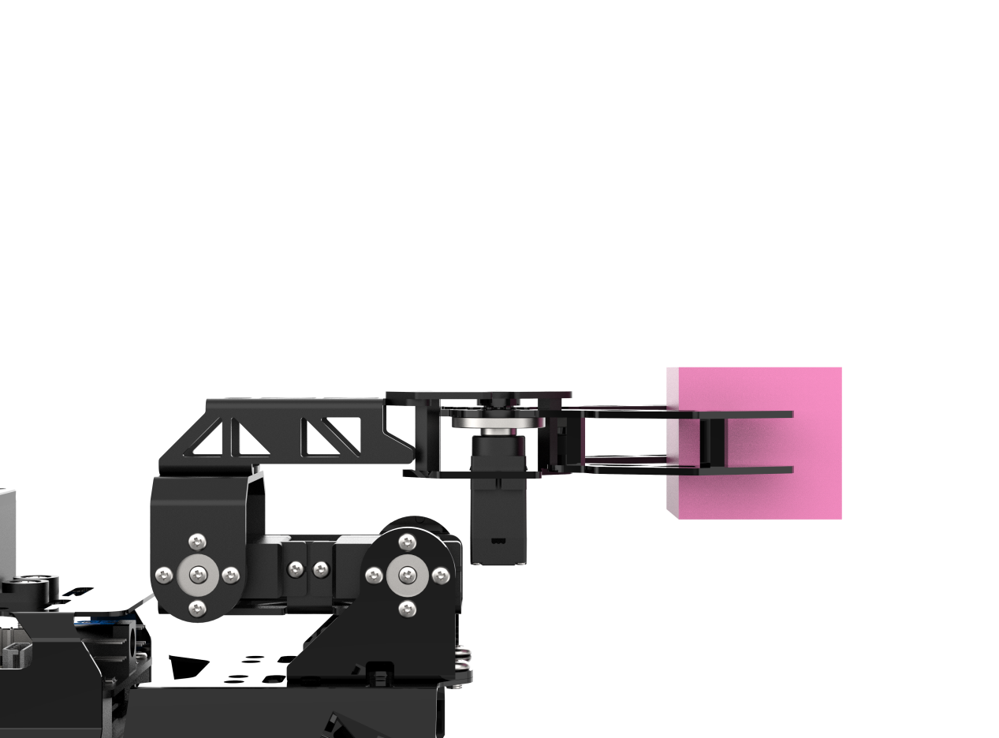

* **Start Navigation**

Based on the content in the red box in the following image, issue commands to the robot dog. When navigating, we need to use the first tool to set the initial position of the robot dog, and the second tool to set the target point. The robot dog will automatically set the route according to the map, avoid obstacles, and reach the target point.

:::{Note}
If you need to interrupt navigation, simply set a new target point using the second tool at the current location of the robot dog. If you pick up the robot dog or its position is altered by external force, you will need to reset its position manually.
:::

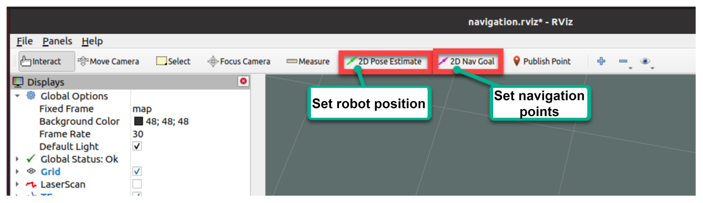

After setting the target point, two lines will be generated: one green and one red. The green line represents the global route that the robot dog will take to reach the target, while the red line represents the local route planned by the robot dog.


* **Begin Placing the Color Blocks**

After reaching the navigation point, the robot dog enters the next state and begins to search for the red box. Once the red box is found, it executes action group control to move the mechanical arm and place the color block into the red box.

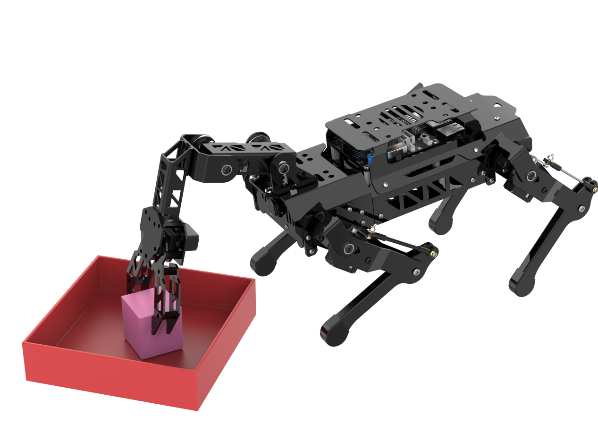

### 18.10.5 Program Analysis

[Source Code]()

* **Launch File Analysis**

(1) Basic configuration files for robot navigation and transportation are located in the Docker container. The source code for this program is also within the Docker container：

[/home/ubuntu/puppypi/src/puppy_bringup/launch/start_node_nav.launch]()

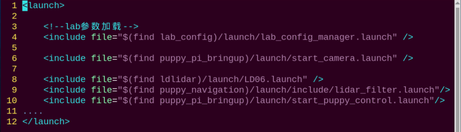

`lab_config_manager.launch`: This file contains the relevant information for lab parameter configuration.

`start_camera.launch`: This file contains the configuration for starting the camera.

`LD06.launch`: This file contains the configuration for starting the LD06 laser radar.

`lidar_filter.launch`: This file contains the configuration for laser radar data filtering.

`start_puppy_control.launch`: This file contains the configuration for starting the robot dog control node.

(2) Robot dog navigation files. The source code for this program is also within the Docker container：

[/home/ubuntu/puppypi/src/puppy_navigation/launch/navigation.launch]()

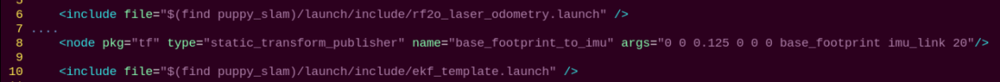

Launch the nodes for the odometry, coordinate transformation, and extended Kalman filter for the laser radar：

`rf2o_laser_odometry.launch`: This file contains the relevant configuration for the RF2O laser odometry.

A `static_transform_publisher` node from the tf package is launched to publish a static coordinate transformation from `base_footprint` to `imu_link`, with parameters specifying the translation and rotation of the transformation.

`ekf_template.launch`: This file contains the relevant configuration for the Extended Kalman Filter (EKF).

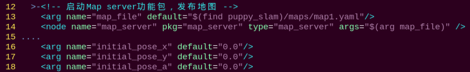

Start the Map Server package, publish the specified map, and set the initial pose of the robot using parameters.

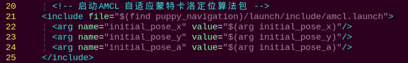

Start the AMCL algorithm package and pass some initial pose parameters to the AMCL algorithm node. This helps with adaptive Monte Carlo localization, enabling precise localization of the robot in the environment.

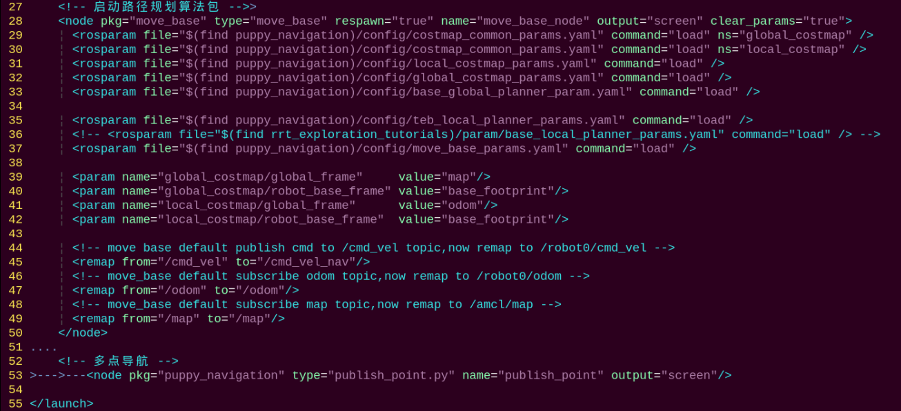

Configure the ROS Move Base node, including loading different parameter files and performing some remapping operations:

The `costmap_common_params.yaml` file is used to configure the global and local costmaps.

The `local_costmap_params.yaml` and `global_costmap_params.yaml` files are used to configure specific parameters for the local and global costmaps.

The `base_global_planner_param.yaml` file is used to configure parameters for the global planner.

The `teb_local_planner_params.yaml` file is used to configure parameters for the local planner.

The `move_base_params.yaml` file contains additional parameters for the Move Base node.

`<param>` tags: Set some specific parameters for the Move Base node:

`global_costmap/global_frame` and `local_costmap/global_frame`: Set the coordinate frame for the global and local costmaps.

`global_costmap/robot_base_frame` and `local_costmap/robot_base_frame`: Set the coordinate frame for the robot base of the global and local costmaps.

`<remap>` tags: Remap some topics, remapping topics originally published to `/cmd_vel`, subscribed to `/odom`, and subscribed to `/map` to `/cmd_vel_nav`, `/odom`, and `/map` respectively.

(3) RVIZ configuration file for the robot dog virtual machine: [/home/puppy_sim/src/puppy_description/launch/rviz_with_urdf.launch]()

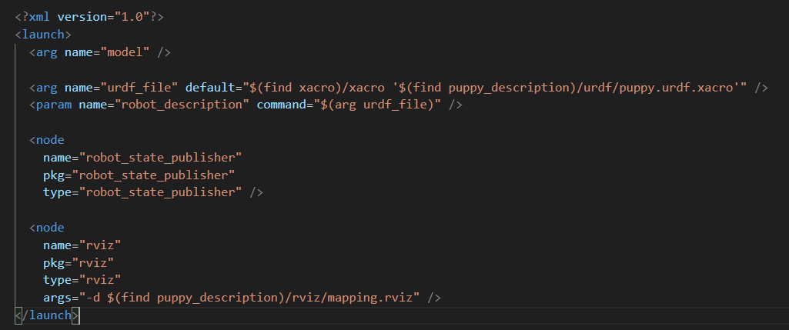

Start the robot's URDF model and related ROS nodes:

Define a parameter `model` for passing model information.

Define `urdf_file`, where the URDF file is compiled into a URDF description file using the xacro tool. The path to the URDF file is `$(find puppy_description)/urdf/puppy.urdf.xacro`.

The content of the URDF description file is set as the parameter `robot_description`. This is provided to the `robot_state_publisher` node to publish the robot's state.

A `robot_state_publisher` node is launched to publish the robot's state information, making it available in the ROS system.

An `rviz` node is launched for visualizing the robot model. The path to the RViz configuration file is specified with the `-d` parameter, which is `$(find puppy_description)/rviz/mapping.rviz`.

* **Source Code Program Analysis**

The source code for this program is located in the Docker container：[/home/ubuntu/puppypi/src/puppy_with_arm/scripts/color_place_nav.py]()

* **Import Related Application Library**

{lineno-start=}
```python

```

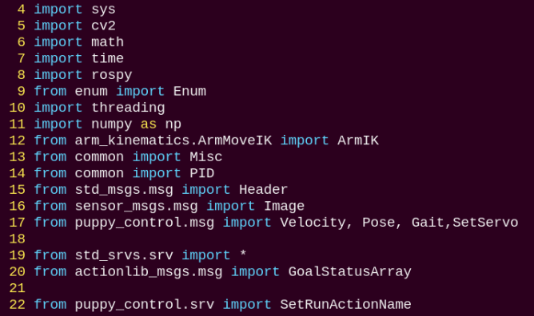

① `sys` is used for handling command-line arguments and exiting the program;

② `cv2` is used for OpenCV image processing;

③ `math` is used for mathematical calculations;

④ `time` is used for timing and delays;

⑤ `enum` is used for defining program running state;

⑥ `threading` is used for implementing parallel processing.

⑦ Import `ArmIK` from `arm_kinematics.ArmMoveIK` for inverse kinematics control;

⑧ Import `Velocity`, `Pose`, and `Gait` message types from `puppy_control.msg` for controlling the velocity, pose, and gait of the robot dog.

⑨ Import `ArmIK` from `arm_kinematics.ArmMoveIK` for inverse kinematics control.

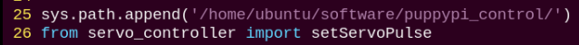

A variable named HomePath is defined, representing the home directory path as `/home/pi`. Then, `/home/pi/PuppyPi_PC_Software` is added to the Python module search path using `sys.path.append`.

The function `setServoPulse` is imported from the module `ServoCmd`. This indicates that the `ServoCmd` module contains a function named `setServoPulse`, which is used to control the pulse signal of servo motors.

* **Main Function**

{lineno-start=}
```python

```

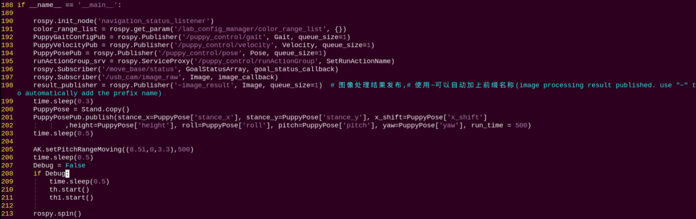

In the main program, initialize the ROS node, set up ROS topic publishers and subscribers, and perform some initialization actions.

\- Create ROS topic publishers: used to control the robot dog's gait, velocity, and pose.

\- Create ROS topic subscribers: used to obtain the status of navigation targets and image data, set the initial pose of the robot dog, and publish it.

\- If the debug mode is enabled, start two threads, th and th1.

* **State Call Back Function goal_status_callback**

{lineno-start=}
```python

```

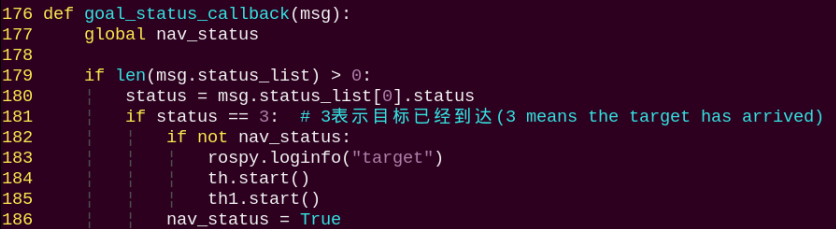

Listen to the `/move_base/status` topic. When the received target status is 3 (target has been reached), output information through ROS logging, and start two threads named th and th1. At the same time, set the global variable `nav_status` to True to indicate that the target has been reached.

* **Function image_callback**

{lineno-start=}
```python

```

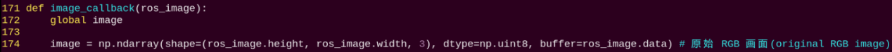

Convert the ROS image message `ros_image` data to a NumPy array for later use in image processing.

* **Run Image Processing Function**

{lineno-start=}
```python

```


First, preprocess the image, including resizing and Gaussian blurring. Then, identify lines in different regions of interest (ROIs) based on predefined color ranges, calculate the center point positions of the line contours, calculate the parameters of the minimum enclosing circle for the largest area color block, output different recognition results based on judgment, and display the recognition results in the image. The overall logic is to control the motion of the robot dog by identifying colors, extracting contours, finding the largest area, and outputting recognition results based on the image.

(1) Preprocess the image, including resizing and Gaussian blurring.

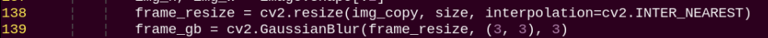

(2) Convert the image from BGR to LAB format, then segment the preprocessed image into three regions: upper, middle, and lower. Convert the RGB color of the image blocks in the three regions to LAB color space, and then perform bitwise operations with the mask.

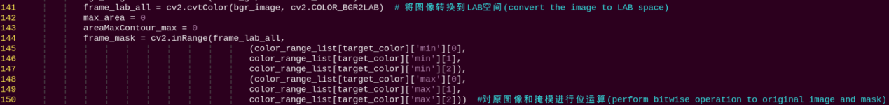

(3) After masking, perform erosion and dilation operations on the image. Extract the outer contours of the target using the `cv2.findContours()` function, and call the `getAreaMaxContour()` function to detect contours and find the largest contour.

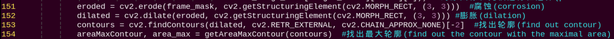

(4) Find the contours of color blocks in the image. Filter out contours with an area less than 200 for higher recognition accuracy. Finally, use the `cv2.circle()` function to draw the minimum enclosing circle on the image with a yellow color.

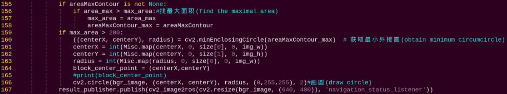

* **Move Perform Action Function**

{lineno-start=}
```python

```

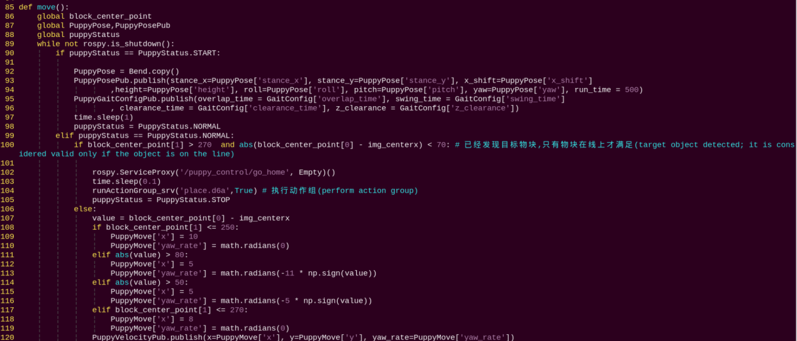

During the startup phase (`PuppyStatus.START`), the robot dog stops moving and initializes its posture. During normal forward movement (`PuppyStatus.NORMAL`), it moves control based on the position information of the target block. If the target block is found within the specified area, it executes the `place.d6a` action group to place the block at the target point and switches to the `PuppyStatus.STOP` status. Otherwise, it adjusts the robot dog's movement speed and angular velocity based on the position of the target block. If puppyStatus is `PuppyStatus.STOP`, the robot dog's posture is switched to the standing posture (Stand), and the corresponding posture information is published.

* **getAreaMaxContour Function**

{lineno-start=}
```python

```

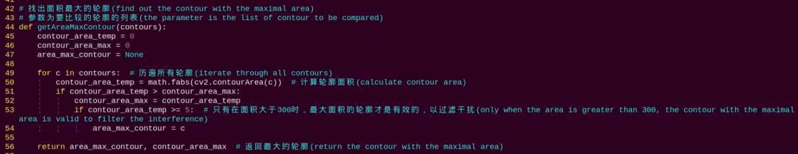

To find the contour with the largest area from a group of contours, the function iterates through all contours, calculates their areas, and retains the contour with the largest area. It also adds a condition to only consider contours with an area greater than or equal to 5 to filter out smaller disturbances. Finally, the function returns the found largest contour along with its corresponding area.

* **cv2_image2ros Image Information Processing**

{lineno-start=}
```python

```

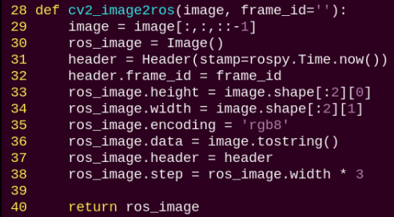

The function converts OpenCV format image data to a ROS Image message (`sensor_msgs/Image`). It reverses the channel colors of the image and then creates and sets the relevant attributes of the ROS Image message, including height, width, encoding format, etc. Finally, it returns the created ROS Image message. This function is useful for processing OpenCV image data in ROS and publishing it as ROS Image messages.

### 18.10.6 Function Extension

The default game recognizes red color, and the robot dog performs `grab` and `place` actions for the color blocks. If you need to change the recognized color, for example, to `green` color blocks, you can follow the steps below:

(1) Enter the following command to edit the color recognition and grabbing game program, and press Enter.

```
rosed puppy_with_arm color_grab.py
```

(2) Find the following code:

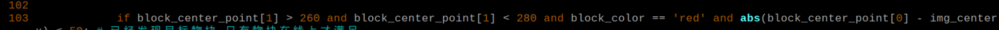

:::{Note}
After entering the code position number on the keyboard, press `Shift+G` to directly jump to the corresponding position. (The numbering of code positions in the diagram is for reference only, please refer to the actual positions.)
:::

(3) Press the `i` key to enter edit mode, and change `red` to `green`.

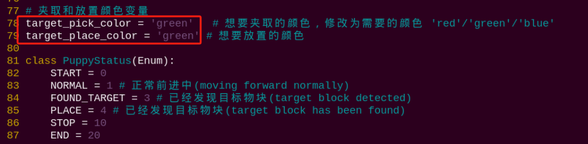

(4) After making the modifications, press the `Esc` key, enter the command `:wq`, and press Enter to save and exit.

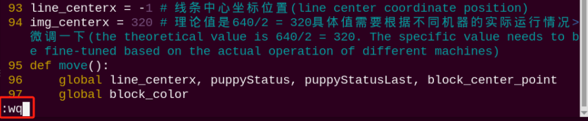

(5) Refer to [18.10.3 Start Navigation]() to restart the game and view the effects of the modification.

## 18.11 Install and Import Virtual Machine

### 18.11.1 Installation of VMware Virtual Machine

* **Install VMware**

In simple terms, a virtual machine is software that allows us to run other operating systems within an operating system. Here we take VMware Workstation software as an example, and the installation steps are as follows:

(1) Unzip the virtual machine software package located at the path `Vmware 16.0 Pro.zip`.

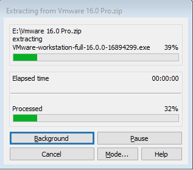

(2) Locate the virtual machine folder after extracting it, then double-click the virtual machine executable file (with the .exe extension).

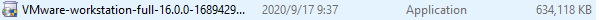

(3) Then follow the sequence shown in the illustrations to complete the installation of the virtual machine.

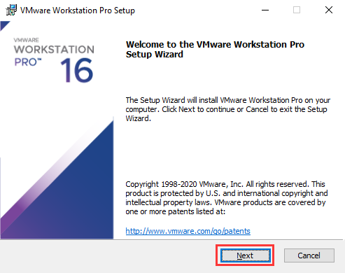

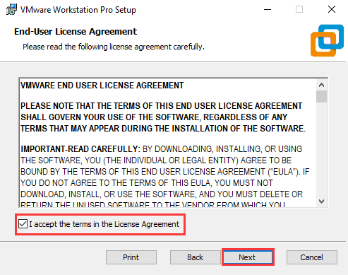

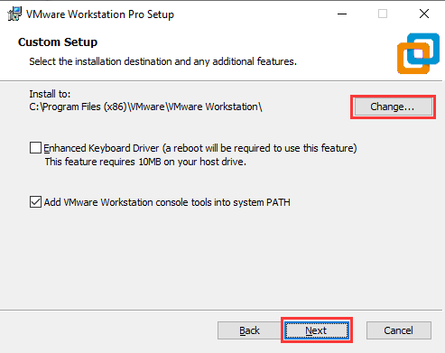

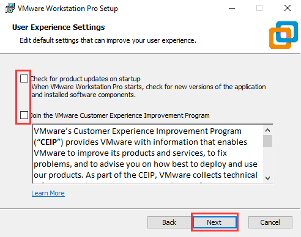

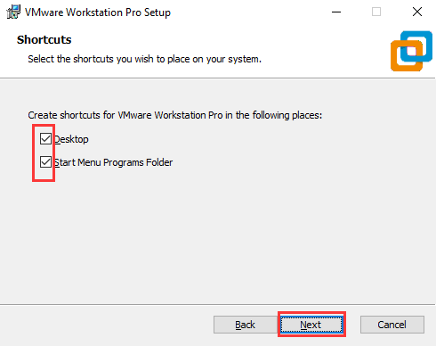

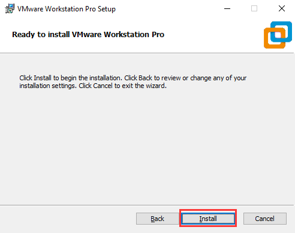

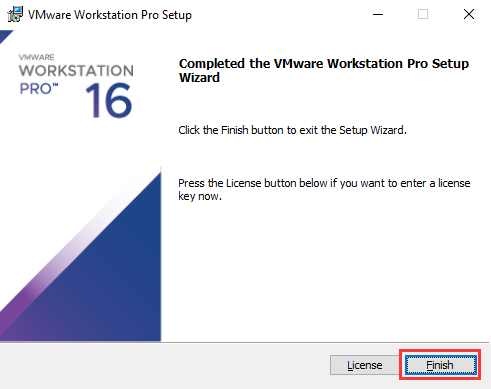

* **Start the VMware-related Services on Your Local Computer**

(1) Switch to your local computer and use the shortcut `WIN+R` to open the running window. Then, type `control` and press Enter to open the `Control Panel`.

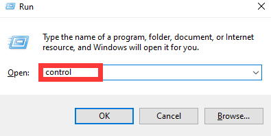

(2) Click on `Management Tool` to enter the panel, then double-click on the `Services` option.

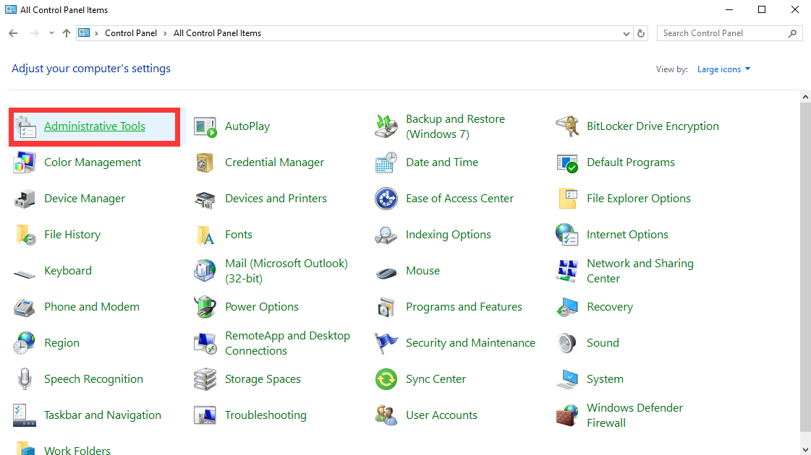

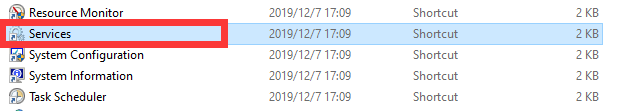

(3) Find the VMware related service as pictured:

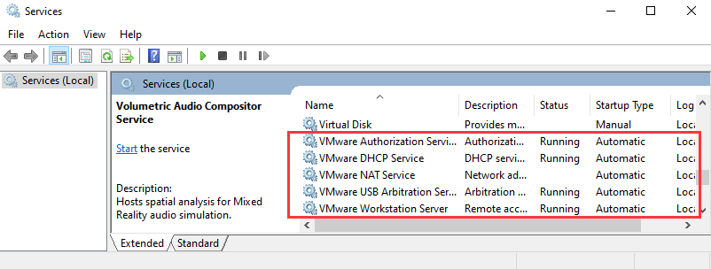

(4) Right-click on the `Start` button to start all VMware-related services.

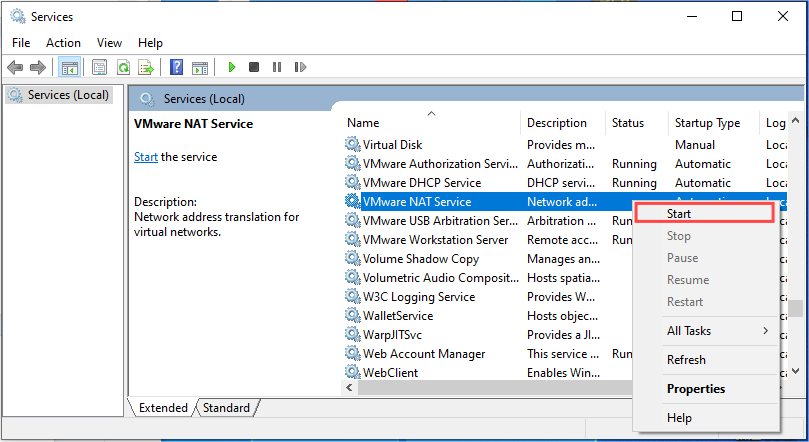

### 18.11.2 Opening and Importing a Virtual Machine

(1) Extract the virtual machine files from the same directory to any non-Chinese path.

:::{Note}
The virtual machine shown in the screenshot is for illustration purposes only. The specific virtual machine should be based on the name of the virtual machine in the actual directory path.
:::


(2) Open the virtual machine software, then click on `Open Virtual Machine`.


(3) Locate the path where the virtual machine files were extracted, then click `Open`.

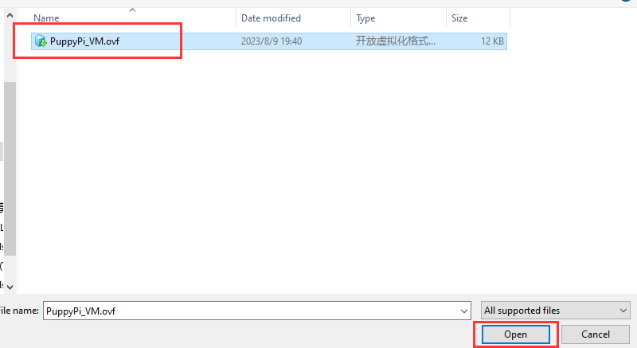

(4) According to your needs, set the name and storage path for the virtual machine. Once you have finished setting up, click on `Import`.


:::{Note}
After the import is completed, you can directly choose the storage path of the virtual machine that was set. You can open the virtual machine directly without needing to import it again next time.
:::

### 18.11.3 The Network Configuration of Virtual Machine

:::{Note}
When configuring the following settings on a desktop computer, make sure it is equipped with a wireless network card or have a USB wireless network card ready.
:::

(1) First, start the robot dog and connect to its hotspot using the computer's host.


(2) Return virtual machine, click `edit` and then click `the network configuration of virtual machine`.

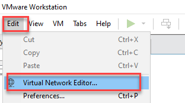

(3) At the bridge mode option, select your wireless network card, then click OK.


(4) Open the virtual machine and wait for it to boot up completely.


(5) After entering the system desktop, right-click on the desktop, then open the command line terminal.


:::{Note}
When entering commands, it's important to strictly distinguish between uppercase and lowercase letters, and you can use the `Tab` key to autocomplete keywords.
:::

(6) Enter the command, then press Enter to view the IP address of the virtual machine as shown in the red box.

```
ifconfig
```

(7) Right-click on the system desktop again, then open a new command line terminal. Enter the command and press Enter to configure the network.

```
sudo nano /etc/hosts
```

(8) Modify the IP addresses on the second and third lines of the image to match the IP address of the virtual machine and the IP address of the Raspberry Pi. The virtual machine IP address should be filled in based on the actual situation, and the Raspberry Pi IP address, when in direct connection mode, is fixed as `192.168.149.1`.

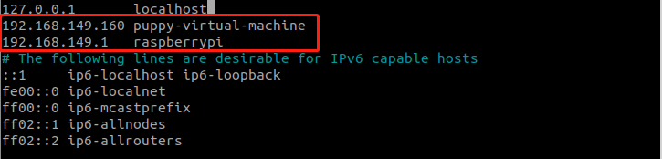

:::{Note}
When modifying the IP, make sure to maintain the same indentation as the line above.
:::

(9) After finishing the modifications, press `Ctrl+x`, then press the Y key to save, and finally press Enter to confirm.


### 18.11.4 The Network Configuration of PuppyPi

(1) Next, connect to the Raspberry Pi desktop remotely via VNC.

(2) Click on the icon  in the top left corner of the desktop, or use the shortcut `Ctrl+Alt+T` to open the command line terminal.

(3) Enter the command and press Enter to modify the PuppyPi network configuration.

```
sudo vim /etc/hosts
```

(4) Locate the the red box area as follows, and enter your own virtual machine IP address (obtained in step 1.2). Press `Esc` key, and type `:wq` to save and exit.


(5) Input command and press Enter to update the configuration.

```
source .bashrc
```

## 18.12 Inverse Kinematics Analysis of Robotic Arm

### 18.12.1 Inverse Kinematics Introduction

* **Brief Introduction of Inverse Kinematics**

Inverse kinematics is the process of determining the parameters of the joint movable object to be set to achieve the required posture.

The inverse kinematics of the robotic arm is an important foundation for its trajectory planning and control. Whether the inverse kinematics solution is fast and accurate will directly affect the accuracy of the robotic arm's trajectory planning and control. so it is important to design a fast and accurate inverse kinematics solution method for a six-degree-of-freedom robotic arm.

* **Brief Analysis of Inverse Kinematics**

For the robotic arm, the position and orientation of the gripper are given to obtain the rotation angle of each joint. The three-dimensional motion of the robotic arm is complicated. In order to simplify the model, we remove the rotation joint of the pan-tilt so that the kinematics analysis can be performed on a two-dimensional plane.

Inverse kinematics analysis generally requires a large number of matrix operations, and the process is complex and computationally expensive, so it is difficult to implement. In order to better meet our needs, we use geometric methods to analyze the robotic arm


We simplify the model of the robotic arm by removing the XOY plane, leaving us with the main body of the arm. From the diagram, we can see that the coordinates of the end effector P of the gripper are (X, Y, Z). Since the robotic arm has no rotation, the coordinates of P can be written as (X, Z). In this case, theta and beta in the diagram represent the rotation angles of the robotic arm that we need to solve for. Based on this, we can formulate the following equations:

```
PA = √(l2² + l3²)
```

```
PO = √(X² + Z²)
```

```
cosOAP = (l1² + PA² - PO²) / (2 * l1 * PA)
```

```
cosPAC = (l2² + PA² - l3²) / (2 * l2 * PA)
```

Angle OAC = arccos(cosOAP) + arccos(cosPAC)

```
beta = angle OAC - 90
```

```
cosAOP = (l1² + PO² - PA²) / (2 * l1 * PO)
```

```
sinPOB = PB / PO
```

```
angle AOB = arccos(cosAOP) + arcsin(sinPOB)
```

```
theta = 180 - angle AOB
```

### 18.12.2 Inverse Kinematics Analysis of Robotic Arm


According to the structure design of the robot dog, we can determine that the length of l1 is 4.21 centimeters, the length of l2 is 3.3 centimeters, and the length of l3 is 12.7 centimeters. Therefore, the length of PA is √(l2² + l3²).

The source code of this program is stored at: [puppy_pi/src/puppy_pi_common/arm_kinematics/InverseKinematics.py]()

### 18.12.3 Inverse Kinematics Solution and Program Implementation

:::{Note}
Instructions must be entered with strict attention to case sensitivity and spacing.
:::

(1) Turn on PuppyPi, and connect it to Raspberry Pi desktop via VNC.

(2) Click the icon  on the upper left corner to open the Terminator terminal.

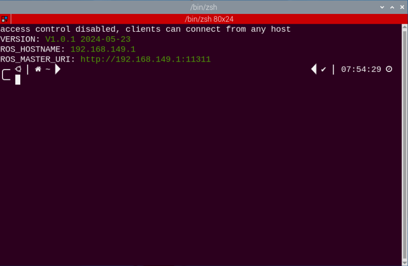

(3) Input the following command and press Enter to switch to the directory containing the inverse kinematics program file.

```
cd puppypi/src/puppy_common/kinematics_sdk/arm_kinematics
```

(4) Input the command below and press Enter to open the inverse kinematics program file.

```
vim InverseKinematics.py
```

(5) Here is a screenshot of the code for the InverseKinematics.py function.

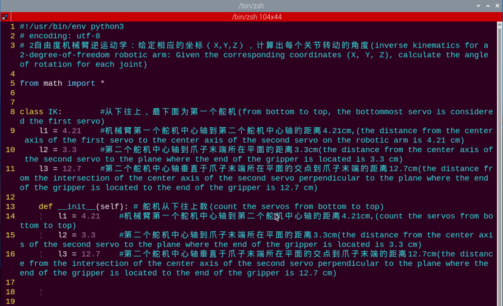

* **The Calculation of the Pitch Angle beta**


(1) According to the cosine theorem, calculate the value, then round it to four decimal places.

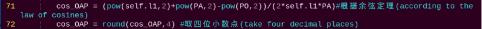

(2) Because the range of the cosine value is [-1, 1], check if the absolute value is greater than 1. If it is greater than 1, it means that the given end coordinates cannot form a linkage structure.

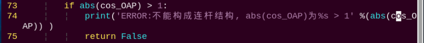

(3) Next, calculate the cosPAC value, and then round it to four decimal places.

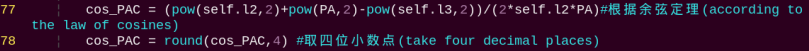

(4) Check again whether the absolute value exceeds 1.

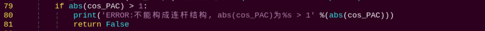

(5) Next, use the inverse cosine function to find the angle in radians for both OAP and PAC, then add them together to get the angle for OAC.


(6) Finally, convert the angle value of OAC from radians to degrees, and subtract 90 degrees (initial pitch joint angle of the arm) to obtain the pitch joint angle beta rotation.


* **The Calculation of the Base Joint Angle theta**


(1) According to the cosine theorem, calculate the value, then round it to four decimal places.

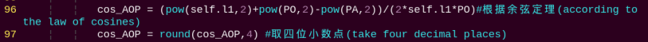

(2) Because the range of the cosine value is [-1, 1], check if the absolute value of cosAOP is greater than 1. If it is greater than 1, it means that the given end coordinates cannot form a linkage structure.

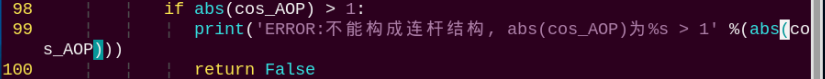

(3) Then calculate the sinPOB value, round it to four decimal places, and check again whether its absolute value is greater than 1.


(4) Next, use the inverse cosine function and the inverse sine function to find the radians of the angles AOP and POB, then add them together to obtain the value of the angle AOB.

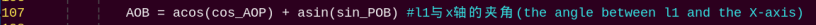

(5) Finally, subtract the angle OAB, converted to degrees, from 180 degrees to obtain the rotation angle of the base joint theta.

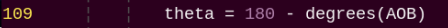