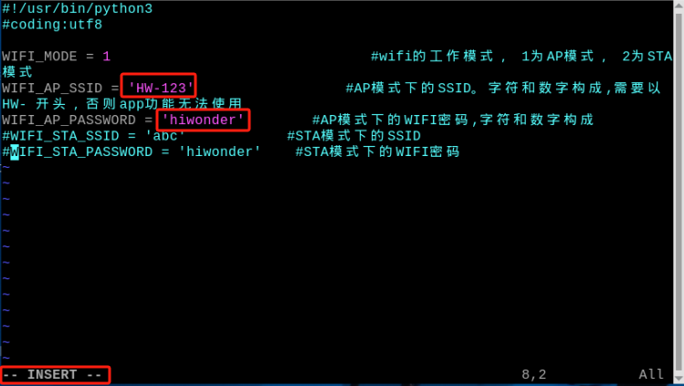
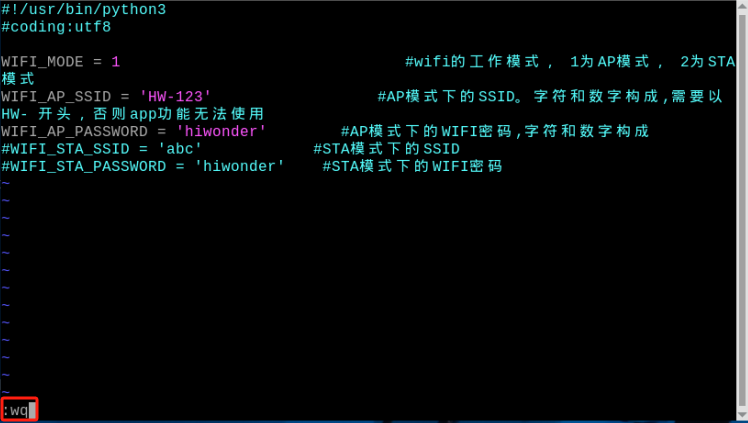
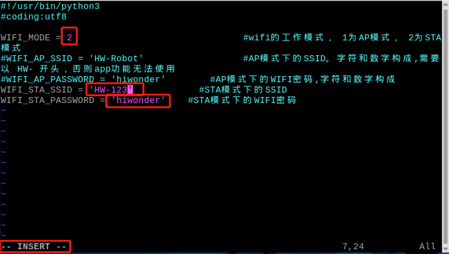
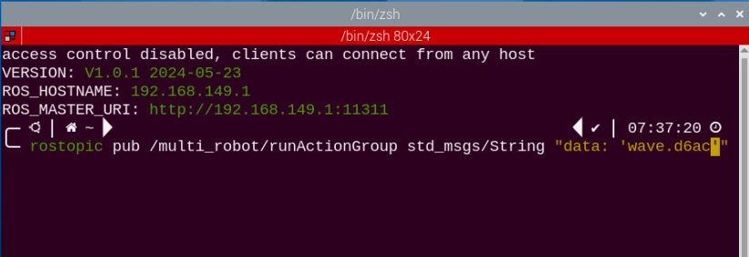
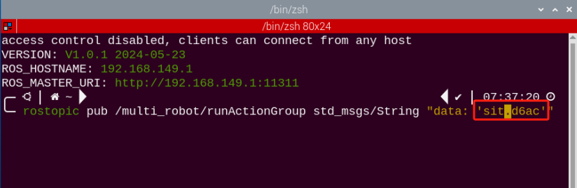

# 18. ROS1-ROS Robot Group Sending Control

## 18.1 Master and Slave Machine Configuration

### 18.1.1 Getting Ready

(1)  Please prepare at least 2 or more PuppyPi. Two PuppyPi are used in this lesson for demonstration.

(2) Set development environment. Please download and install VNC according to "[**3.Remote Desktop Tool Installation and Connection**](https://docs.hiwonder.com/projects/PuppyPi/en/latest/docs/8_remote_tool.html)". 

### 18.1.2 Working Principle

By configuring the master and the slave machine in the same network, the master sends motion commands to the slave via a multicast program, achieving the effect of controlling the slave.

<p id="anchor_12_1_3"></p>

### 18.1.3 Operation Steps

* **Network Configuration**

(1) Configure Master Network

① Firstly, select one PuppyPi as the master, power it on, and then remotely connect to its system desktop.

② Then open the command line terminal to go to the directory. Input command  and press Enter.

```bash
cd hiwonder-toolbox
```

③ Use vim editor to open Wi-Fi. Configure file and input command. Then press Enter.

```bash
sudo vim wifi_conf.py
```

④ After modification, press Esc to exit editing mode. Then input **":wq"** to save and exit.



⑤ After modification, press Esc to exit editing mode. Then input **":wq"** to save and exit.

```bash
:wq
```



⑥ Input the command to restart the master.

```bash
sudo systemctl restart wifi.service
```

⑦ After the master restarts, when reconnecting to the master's Wi-Fi, you will need to enter the Wi-Fi password "**hiwonder**".

(2) Configure Slave Network

① Turn on the slave, and remote connect it to the system desktop.

② Open the command line terminal. Input the command and press Enter.

```bash
cd hiwonder-toolbox
```

③ Use vim editor to open wifi. Configure the file and input command. Then press Enter.

```bash
sudo vim wifi_conf.py
```

④ Press **"i"** to go to the editing mode. Change the two lines of code for the WI-FI name and password as shown in the figure below. Find the four lines of code highlighted in the box.



Setting the network mode of the slave device to '2' will be in LAN mode, while 'HW-123' and 'hiwonder'.

⑤ After modification, press Esc once to exit the editing mode. Then type **":wq"** and press Enter to save and exit.

```bash
:wq
```

⑥ Input command **"sudo reboot"** to restart the device. Do not skip this step!

```bash
sudo reboot
```

## 18.2 Group Sending Control Startup Method

### 18.2.1 Enable Group Sending Control

:::{Note}
Commands must be entered with strict attention to capitalization and 
spaces.
:::

(1) Select a PuppyPi robot dog as the host and start it, then connect to the Raspberry Pi desktop remotely via VNC.

(2) Click  on the upper left corner to open the Terminator terminal.

(3) Input the command and press Enter to close auto-start program.

```bash
sudo ./.stop_ros.sh
```

(4) Input the  command  to configure master the host's environment variable.

```bash
source multi_master_env.sh
```

(5) Return to the terminal interface of the slave device, enter the command  to disable the automatic startup feature, and press Enter.

```bash
sudo ./.stop_ros.sh
```

(6) In the terminal interface of the slave device, enter the command  to start the slave group control program.

```bash
rosrun puppy_control puppy_mul.py
```

(7) Then open a new terminal, type 'ssh 192.168.149.119' and press Enter, enter the password 'raspberrypi', and type 'source multi_slave_env.sh 192.168.149.1' to set up the environment variables for the slave (this is for starting the multi-slave control topic, and you can also set it up as host environment variables before proceeding with steps (8) to (11). The command is :

```bash
ssh 192.168.149.119
```

```bash
source multi_slave_env.sh 192.168.149.1
```

(8) Enter the command  to view the topic information of the master/slave (if the topic information of the master/slave does not appear, it means that the corresponding multi-slave control program of the master/slave is not started, refer to the previous 'steps 1~6' for reoperation).

```bash
rostopic info /multi_robot/runActionGroup
```

(9) Enter 'rostopic pub /multi_robot/runActionGroup', then press the Tab key 3 times to complete the command as `rostopic pub /multi_robot/runActionGroup std_msgs/String "data: ''"`.

```bash
rostopic pub /multi_robot/runActionGroup std_msgs/String "data: ''"
```

(10) Fill in the name of the action group in "**data: ''**" (The action group can be found in the directory '/home/ubuntu/software/puppypi_control/ActionGroups').



(11)  Enter the command to excute the action group.

```
rosrun puppy_control puppy_mul.py
```

(12) If you want to execute other actions, in the terminal where the multi-slave control topic is started, press 'Ctrl+C' to close it, then press the 'ï¿? arrow key on the keyboard, modify the action group name, and press Enter to execute.



(13)  If you need to close this gameplay, you can press **'Ctrl+C'** in the LX terminal interface. If closing fails, you can press it multiple times.

(14) Next, in the terminal interface of both the host and the slave, refer to '[12.1.3 Operation Steps -> Network Configuration](#anchor_12_1_3)' and add comments to the Wi-Fi configuration file. Restore it to direct connection mode.

### 18.2.2 Program Outcome

Once the game is initiated, both the master and the slave will execute the same actions. After the action group is completed, you can also observe the printed action group names in the terminal interface of both the master and the slave running the multicast control program.


