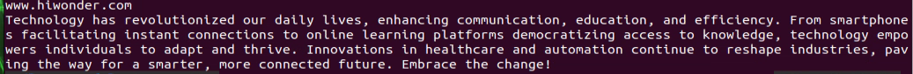
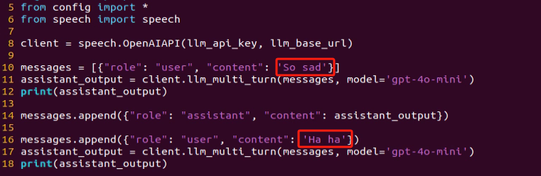
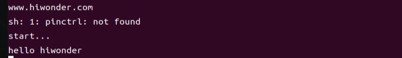
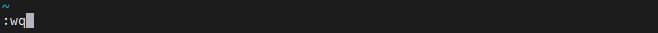
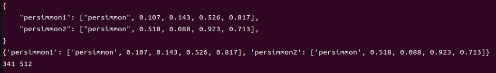
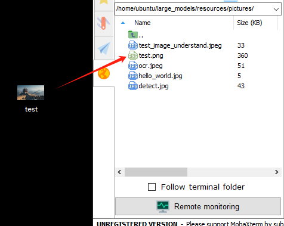

# 19.ROS1_AI Large Model Courses

## 19.1 Large Language Model Courses

### 19.1.1 Overview of Large Language Model

A Large Language Model (LLM) is an advanced artificial intelligence model developed to comprehend and generate human language.


* **Basic Concept**

A Large Language Model (LLM) is a deep learning model trained on extensive text data, designed to either generate natural language text or comprehend the meaning of language. LLM is capable of performing various natural language tasks, such as text classification, question answering, and dialogue, making them a crucial step toward achieving advanced artificial intelligence. Unlike smaller models, LLM leverages a similar Transformer architecture and pretraining objectives (like Language Modeling), but are distinguished by their larger model size, greater training data, and enhanced computational resources.

* **Features**

**Massive Scale:** LLM are characterized by their vast parameter sizes, often reaching billions or even trillions of parameters. This immense scale allows them to capture a wealth of linguistic knowledge and complex syntactic structures.

**Pretraining and Fine-tuning:** LLM utilize a two-stage learning process: pretraining and fine-tuning. Initially, they are pretrained on large-scale, unlabeled text data, learning general language representations and knowledge. Subsequently, they are fine-tuned using labeled data to specialize in specific tasks, allowing them to excel across a wide range of NLP applications.

**Contextual Awareness:** LLM demonstrate exceptional contextual awareness, with their ability to understand and generate language deeply dependent on preceding text. This enables them to perform exceptionally well in tasks like dialogue, article generation, and contextual comprehension.

**Multilingual Capabilities:** LLM support multiple languages, extending beyond just English. This multilingual proficiency enables them to power cross-lingual and cross-cultural applications, enhancing their versatility and global reach.

**Multimodal Support:** Some LLMs have expanded to handle multimodal data, including text, images, and speech. This capability allows them to understand and generate content across various media types, opening up more diverse application possibilities.

**Emergent Properties:** LLM exhibit remarkable emergent properties, where performance improvements become apparent in large models but are absent in smaller ones. This makes them adept at handling more complex tasks and challenges.

**Cross-domain Applications:** LLM have been widely adopted across numerous fields, including text generation, machine translation, information retrieval, summarization, chatbots, and virtual assistants. Their influence is profound, impacting both daily life and work in significant ways.

**Ethical and Risk Considerations:** While LLM showcase impressive capabilities, they also raise important ethical and risk-related concerns, such as the potential generation of harmful content, privacy violations, and cognitive biases. As such, the development and deployment of LLM must be approached with careful consideration and caution.

* **Working Principle**

Large Language Model (LLM) are built on deep learning principles and are trained using massive datasets and substantial computational resources to develop neural networks with billions of parameters. Through iterative training and parameter optimization, these models learn to perform a wide range of tasks with high accuracy. The `large` in LLM reflects their immense scale—encompassing a vast number of parameters, extensive training data, and significant computational demands. This scale enables advanced models to achieve superior generalization capabilities and deliver increasingly accurate results, even in highly specialized domains.

Today, some of the most popular applications revolve around generative AI, such as language generation tools (e.g., ChatGPT) and image generation platforms (e.g., Midjourney). At the core of these applications is the concept of generation—the model's ability to predict and produce coherent content based on a given input.

* **Application Scenarios**

(1) Text Generation

Large Language Models are capable of generating diverse types of text, including news articles, stories, poems, and more. These capabilities make them well-suited for applications in content creation, creative writing, and automated storytelling.

(2) Text Classification

Large Language Models can classify text into various categories, such as sentiment analysis and topic identification. These capabilities are especially valuable in scenarios like public opinion analysis, information retrieval, and content moderation.

(3) Machine Translation

Large Language Models excel at machine translation, enabling the conversion of text from one language to another. These capabilities are essential for cross-language communication, localization, and global collaboration.

(4) Question-Answering Systems

Large Language Models can be used to build question-answering systems that respond to user queries. These applications are particularly valuable in areas such as intelligent customer support, knowledge retrieval, and information lookup.

### 19.1.2 Large Language Model Deployment

:::{Note}
This section outlines the steps to register on the official OpenAI website and obtain the API key for the Large Language Model.
:::

* **OpenAI Account Registration and Setup**

(1) Copy the following URL: [https://platform.openai.com/docs/overview]()

Open the OpenAI website and click on the `Sign Up` button in the top right corner.


(2) Follow the prompts to register and log in using your Google, Microsoft, or Apple account.


(3) Click on the settings icon, then select Billing, followed by Payment Methods, to link your payment method. Recharge your account to purchase tokens.


(4) After completing the setup, click on API Keys, then select Create New Secret Key. Follow the prompts to fill in the required information. Once the key is created, make sure to save it for future use.


(5) With these steps, the large model has been successfully created and deployed. You can now use the API in the upcoming lessons.

* **OpenRouter Account Registration and Setup**

(1) Copy the following URL: [https://openrouter.ai/]()

Open the webpage in your browser and click `Sign In`. Register using your Google account or another available login option.


(2) After logging in, click the icon in the top-right corner and select `Credits` to link your payment method.


(3) To create an API key, go to **API Keys**, then click **Create Key**. Follow the prompts to complete the process. Once the key is generated, make sure to save it for future use.


(4) At this point, the large model is successfully created and deployed. You can now use the API in the upcoming lessons.

### 19.1.3 Large Language Model Accessing

:::{Note}
* To proceed with this section, you will need to register on the appropriate website and obtain the API key for the large model (please refer to the file [19 ROS1_AI Large Model Courses -> 19.1 Large Language Model Courses -> 19.1.2 Large Language Model Deployment]()).
* It is important to ensure a stable network connection for the development board. For optimal performance, we also recommend connecting the main controller to a wired network for enhanced stability.

:::


* **Environment Configuration**

:::{Note}
If you have purchased a robot from our company with built-in large model functionality, the environment is already pre-configured in the robot's image. You can directly proceed to Section 3 of this document to configure the API key.
:::

Install Vim and Gedit by running the corresponding commands. Install the necessary software packages and audio libraries required for PyAudio.

```
sudo apt update
sudo apt install vim
sudo apt install gedit
sudo apt install python3 python3-pip python3-all-dev python3-pyaudio portaudio19-dev libsndfile1
```


* **Importing the Large Model Program Directory**

(1) In this section, locate the `Appendix -> 3. Source Code` folder within the same directory as this tutorial document.


(2) Using the MobaXterm remote connection tool (as outlined in the [3 Remote Tool Installation and Docker Entry Method -> 3.1. VNC Installation and Connection]() tutorial), drag the folder into the root directory of the main controller. The software installation package can be found in the [3 Remote Tool Installation and Docker Entry Method -> 3.1. VNC Installation and Connection]() directory.


(3) Next, execute the command to navigate to the `speech_pkg` directory.

```
cd ~/large_models/speech_pkg/
```

(4) Execute the following commands to install the necessary third-party libraries.

```
pip3 install -r requirements.txt --break-system-packages
pip3 install dashscope --break-system-packages
pip3 install opencv-python --break-system-packages
pip3 install sympy==1.13.1 --break-system-packages
pip3 install torch --break-system-packages
```

(5) Then, use the command in the terminal to navigate to the `speech` directory.

```
cd ~/large_models/speech_pkg/speech
```

(6) Run the command to list the files in the `speech` directory.

```
ls
```

(7) Depending on the type of main controller and Python version you're using, switch to the appropriate folder for packaging and distribution. This tutorial uses the Jetson Orin controller as an example.

| **Type of main controller** | **Python version** |
|-----------------------------|---------------------|
| jetson_nano                 | 3.6                 |
| jetson_orin                 | 3.10                |
| rpi5                        | 3.11                |
| rpi5_docker                 | 3.8                 |

(8) Execute the following command to navigate to the Jetson Orin folder.

```
cd jetson_orin/
```

(9) Enter the command to copy the **speech.so** file to the parent directory.

```
cp -r speech.so ..
```

(10) Enter the command to navigate to the parent directory.

```
cd ../..
```

(11) Execute the command to package the speech file for the Python environment.

```
pip3 install .
```

(12) Enter the command to install and update the OpenAI Python library.

```
pip3 install openai -U
```

* **Key Configuration**

(1) Open the terminal and enter the following command to navigate to the directory for configuring the large model keys:

```
cd ~/large_models
```

(2) Then, open the configuration file by running:

```
vim config.py
```

(3) Once the file is open, configure the OpenAI and OpenRouter keys by filling in the `llm_api_key` and `vllm_api_key` parameters, respectively (you can obtain these keys from the [19 ROS1_AI Large Model Courses -> 19.1 Large Language Model Courses -> 19.1.2 Large Language Model Deployment]() course).


For instance, copy the key created in Section 1.2 of this chapter and paste it into the appropriate field. To paste the key, place the cursor between the quotation marks, hold the **Shift** key, right-click, and select **Paste** 

:::{Note}
Do not mix keys from different models, as this may cause the functionality to malfunction.
:::


(4) After pasting, press the **Esc.** key, then type the following command and press Enter to save the file:

```
:wq
```


* **Running the Demo Program**

Once the keys are configured, you can run the demo program ([openai_llm_demo.py]()) to experience the text generation capabilities of the large model. For example, the program's prompt might be: **Write a 50-word article about how technology is changing life.**


(1) To run the demo, enter the following command in the terminal:

```
python3 openai_llm_demo.py
```

(2) After running the program, the output will appear as shown in the image below.



### 19.1.4 Semantic Understanding with Large Language Model

Before starting this section, make sure you have completed the API key configuration outlined in the file [19 ROS1_AI Large Model Courses -> 19.1 Large Language Model Courses -> 19.1.3 Large Language Model Accessing]().

In this lesson, we'll use a large language model to analyze and summarize short passages of text.

[Source Code]()

(1) Start by opening a new terminal window, then navigate to the large model project directory:

```
cd large_models/
```

(2) Next, run the demo program with the following command:

```
python3 openai_llm_nlu_demo.py
```

(3) As shown in the output, the model demonstrates strong summarization abilities.


(4) The result matches the prompt defined in the program — where a passage of text is provided to the model, and it generates a concise summary.


### 19.1.5 Emotional Perception with Large Language Model

To proceed with this section, ensure that you have completed the API key configuration as described in the file [19 ROS1_AI Large Model Courses -> 19.1 Large Language Model Courses -> 19.1.3 Large Language Model Accessing]().

In this lesson, we will use a large language model to assess its ability to perceive emotions based on descriptive words. We'll provide the model with emotional expressions and evaluate its response.

[Source Code]()

(1) Start by opening a new terminal window, then navigate to the large model project directory:

```
cd large_models/
```

(2) Next, run the demo program with the following command:

```
python3 openai_llm_er_demo.py
```

(3) From the output, you will see that the model successfully identifies and understands the emotions conveyed, providing a text-based response accordingly.


(4) In this program, we send two emotional expressions to the model: the first is an expression of sadness, **So Sad**. After the model responds, we then send an expression of happiness, **Ha Ha**, and observe how the model reacts.



## 19.2 Large Speech Model Courses

### 19.2.1 Overview of Large Speech Model

* **What is a Large Speech Model?**

A Speech Large Model (LSM) refers to a machine learning model that uses deep learning techniques to process and understand speech data. These models can be applied in a variety of tasks, such as speech recognition, speech synthesis, speech translation, and emotional analysis of speech. The design and training of these models typically require large amounts of speech data and substantial computational resources, which is why they are referred to as **large models.**

* **Why Do We Need Large Speech Model?**

With the advancement of artificial intelligence and deep learning, traditional speech processing methods face many limitations. Large models leverage vast amounts of data and deep neural networks to learn and understand the complex features within speech, thereby improving the accuracy and naturalness of speech recognition and generation.

Their advantages include:

(1) High Accuracy: They maintain a high recognition rate even in noisy environments and with various accents.

(2) Naturalness: Speech generated by synthesis models is more natural, closely resembling human speech.

(3) Versatility: These models support a wide range of languages and tasks, such as multilingual speech recognition, speech-to-text (STT), text-to-speech (TTS), and emotion recognition.

* **Development of Speech Recognition Technology**

**Word-Level Speech Recognition:** At this stage, speech recognition systems could only recognize individual words

**Phrase-Level Speech Recognition:** With the expansion of data and advancements in algorithms, speech recognition systems gradually gained the ability to recognize longer phrases, such as **Please turn on my computer.**

**Sentence-Level Speech Recognition:** In recent years, with the emergence of AI large models, speech recognition systems have become capable of recognizing entire sentences and understanding their underlying meaning.

* **Differences Between Large Speech Model and Traditional Speech Processing Technologies**

(1) Processing Methods

**Traditional Speech Processing Technologies:** These typically rely on manual feature extraction and shallow models, such as Gaussian Mixture Models (GMM) and Hidden Markov Models (HMM), to process speech signals.

**Large Speech Model:** These use end-to-end learning, directly mapping raw speech waveforms to target outputs (such as text or another speech signal), reducing the reliance on manual feature extraction. They are typically based on deep learning architectures, such as Convolutional Neural Networks (CNN), Recurrent Neural Networks (RNN), and Transformers.

(2) Model Complexity

**Traditional Speech Processing Technologies:** These models are relatively simple, with fewer parameters.

**Large Speech Model:** These models have complex structures and a large number of parameters, enabling them to capture more subtle speech features and contextual information.

(3) Recognition Capability

**Traditional Speech Processing Technologies:** These are highly adaptable to specific scenarios and conditions, but their recognition capability is limited when encountering new, unseen data.

**Large Speech Model:** Due to their large number of parameters and powerful learning ability, they offer superior recognition capabilities and can adapt to a wider variety of speech data and environments.

(4) Training Data Requirements

**Traditional Speech Processing Technologies:** These typically require less data for training, but the data must be highly annotated and of high quality.

**Large Speech Model:** These require vast amounts of training data to fully learn the complexities of speech, often necessitating large quantities of annotated data or the use of unsupervised/self-supervised learning methods.

* **Core Technologies of Speech Large Model**

(1) Automatic Speech Recognition (ASR)

ASR is the technology that converts human speech into text. The core steps of a speech recognition system include feature extraction, acoustic modeling, and language modeling.

(2) Text-to-Speech (TTS)

TTS is the technology that converts text into speech. Common speech synthesis models include the Tacotron series, FastSpeech, and VITS.

(3) Speech Enhancement and Noise Reduction

Speech enhancement techniques are used to improve the quality of speech signals, typically for eliminating background noise and echoes. This is crucial for speech recognition applications in noisy environments.

* **Applications of Speech Large Model**

Intelligent Voice Assistants: For instance, Amazon Alexa and Google Home, which engage with users through voice interactions.

Customer Service Chatbots: In the customer service sector, speech large models assist businesses in enhancing service efficiency by swiftly processing customer inquiries through speech recognition technology, enabling 24/7 support.

Healthcare: Helping doctors with medical record-keeping, thus improving work efficiency.

Speech-to-Text: Speech large models excel in converting speech to text, offering accurate recognition and transcription in a variety of contexts. They are widely used in applications such as meeting transcription and subtitle generation.

### 19.2.2 Voice Device Introduction and Testing

* **Device Overview**

(1) WonderEchoPro

① Introduction

WonderEcho Pro, also known as the AI Voice Interaction Box, is equipped with a high-performance noise-canceling microphone and a high-fidelity speaker. It utilizes a USB-to-audio module, making it plug-and-play with no drivers required, and is compatible with multiple operating systems for both playback and recording.

Integrating various voice processing technologies, WonderEcho Pro features advanced noise suppression algorithms that effectively filter background noise from the environment. It supports a complete voice interaction process—from wake-up to recognition and response. With its modular design, each functional component (e.g., wake word detection, sound detection, speech recognition, and synthesis) can be developed and tested independently.

② Features and Specifications

1. Built-in microphone and speaker interface, supporting both audio input and output

2. Driver-free, plug-and-play functionality compatible with Windows, macOS, Linux, Android, and more

3. Standard USB 2.0 interface

4. Control interface: USB

5. Voice chip model: CL1302

6. Speaker output: 3.0W per channel (4Ω BTL)

7. Power supply voltage: 5V

(2) 6-Microphone Circular Array

① Introduction

The 6-Microphone Circular Array is a high-sensitivity, high signal-to-noise ratio microphone board. It features six analog silicon microphones arranged in a circular pattern. When paired with a main control board, it supports high-performance Acoustic Echo Cancellation (AEC), environmental noise reduction, and factory-level voice pickup from up to 10 meters.


② Features and Specifications

**Operating Voltage:** 3.3V (typical)

**Operating Current:** 0.8mA (typical)

**Operating Temperature:** -20°C (min), 25°C (typical), 70°C (max)

**Operating Humidity:** Up to 95% relative humidity (max)

* **Recording and Playback Test**

The following demonstration uses the Raspberry Pi 5 as an example. The connection and testing steps are also applicable to other compatible devices such as the Jetson series:

(1) Connection Illustration and Detection


If the main controller is a Raspberry Pi, you can use VNC remote desktop access (refer to the appendix: [3 Remote Tool Installation and Docker Entry Method -> 3.1. VNC Installation and Connection]()) to log into the Raspberry Pi system. Once connected, check the upper right corner of the desktop for microphone and speaker icons. As shown in the image below, the presence of these icons indicates a successful connection.


If you're using a NVIDIA Jetson device, you can connect via the NoMachine remote access tool. After logging in, check the upper right corner of the system interface for the speaker icon to confirm successful detection.


(2) Recording Test

① Next, open a new terminal window and enter the following command to check the available recording devices. Note that the **-l** option is a lowercase **L**. You should see the card number (card) listed—for example, card 0. This is just an example; please refer to your actual query result.

```
arecord -l
```


② Then, use the following command to start recording. Replace the red-marked card number (**hw:0,0**) with the actual number you found in the previous step:

```
arecord -D hw:0,0 -f S16_LE -r 16000 -c 2 test.wav
```

③ This will create a **test.wav** audio file in the current directory.


④ You can record a short 5-second sample, then press **Ctrl + C** to stop the recording.

(3) Playback Test

① After the recording is complete, you can check whether the audio file was successfully created by listing the contents of the current directory:

```
ls
```

② If **test.wav** appears in the list, the recording was successful. To play back the recording, use the following command:

```
aplay test.wav
```

### 19.2.3 Voice Wake-Up

In this lesson, we'll learn how to use a large speech model to activate the voice device by speaking a predefined wake word through a program.

[Source Code]()

* **WonderEcho Pro Wake-Up**

(1) Device Check

To proceed, we need to identify the USB device name assigned to the connected WonderEcho Pro or Circular Microphone Array (hereafter referred to as the voice device). Please follow the steps below carefully.

:::{Note}
Do not connect any other USB devices during this process to avoid confusion.
:::

- First, disconnect the voice device, then open a terminal and run the following command:

```
ll /dev | grep USB
```

- Next, reconnect the voice device to the USB port on your main board and run the same command again:

```
ll /dev | grep USB
```

- You should now see a newly listed USB port, such as **ttyCH341USB1**.

:::{Note}
Please take note of this device name—it may vary depending on the main controller being used.
:::

(2) Wake-Up Test

① To begin, update the port number used in the program by editing the script. You'll also need to uncomment the line for the port you're using and comment out any unused ports.

```
vim wakeup_demo.py
```

Press "**i**" to enter edit mode and make the necessary changes as shown below (update the port number accordingly and adjust comments as needed).


Once the changes are complete, press **Esc.**, then type **:wq** and press Enter to save and exit the editor.

② Next, return to the system interface and run the wake-up demo using the command below. Speak the wake word **HELLO HIWONDER** clearly toward the WonderEcho Pro voice device.

If the output includes **keyword detect**, it indicates that the firmware has been successfully flashed and the wake word is functioning correctly.

```
python3 ~/large_models/wakeup_demo.py
```


* **6-Microphone Circular Array**

As with the WonderEcho Pro, you can connect the 6-Microphone Circular Array to your main board (Raspberry Pi or NVIDIA Jetson) using a Type-C to USB cable.

(1) Device Check

For Jetson users, connect to the Jetson system using the NoMachine remote access tool. Once connected, check the desktop interface.

If the 6-Microphone Circular Array icon appears on the left side of the desktop, it indicates the device has been successfully recognized.

(2) Wake-Up Test

① Open a new terminal window and run the following command to edit the **wakeup_demo.py** script:

```
vim ~/large_models/wakeup_demo.py
```


② Press "**i**" to enter edit mode.

③ Update the port to match the device port number you previously identified. Comment out the WonderEcho Pro configuration (add `#` at the beginning of the corresponding line), and uncomment the line using the circular microphone array on line 11 as the input device (see red box in the referenced image).


④ Press **Esc.** to return to command mode, then type **:wq** and press Enter to save and exit.


⑤ In the terminal, run the wake-up program with the following command:

```
python3 ~/large_models/wakeup_demo.py
```


⑥ After about 30 seconds of initialization, speak the wake word `hello hiwonder` to test the device.



* **Brief Program Overview**

This is a Python-based wake word detection script that utilizes the speech module to process audio input and detect a specific wake word (e.g., **HELLO_HIWONDER**).

Source Code Path: [/home/ubuntu/large_models/wakeup_demo.py]()

(1) Importing Required Modules

{lineno-start=5}
```python
import os
import time
from config import *
from speech import awake
from speech import speech
```

`os`: Used for handling file paths and executing system-level commands.

`time`: Provides delay functions to prevent overly frequent detection attempts.

`speech`: The core module responsible for processing audio input and detecting the wake word.

(2) Initializing the wonderecho Class

{lineno-start=9}
```python
port = '/dev/ttyUSB0'
kws = awake.WonderEchoPro(port)
# kws = awake.CircleMic(port)
```

(3) Attempts to Turn Off the Cooling Fan on Raspberry Pi 5

{lineno-start=13}
```python
try:  # If a fan is present, it's recommended to turn it off before detection to reduce interference(如果有风扇，检测前推荐关掉减少干扰)
    os.system('pinctrl FAN_PWM op dh')
except:
    pass
```

Purpose: Attempts to turn off the cooling fan by executing the system command `pinctrl FAN_PWM op dh`. This helps minimize background noise from the fan that could interfere with wake word detection.

Error Handling: If the command fails (e.g., due to unsupported hardware), the program catches the exception and continues running without interruption.

(4) Main Wake Word Detection Loop

{lineno-start=18}
```python
kws.start() # Start detection(开始检测)
print('start...')
```

The program starts the wake word detection thread using `kws.start()`.

It prints **start...** to indicate that detection has been successfully initiated.

(5) Main Program Logic

{lineno-start=20}
```python
while True:
    try:
        if kws.wakeup(): # Wake-up detected(检测到唤醒)
            print('hello hiwonder')
        time.sleep(0.02)
    except KeyboardInterrupt:
        kws.exit() # Cancel processing (关闭处理)
        try:
            os.system('pinctrl FAN_PWM a0')
        except:
            pass
        break
```

During each iteration, the program checks whether the wake word has been detected. If the wake word is detected, it prints `keyword detected`.

The detection frequency is controlled using `time.sleep(0.02)` to prevent excessive CPU usage.

Pressing **Ctrl+C** triggers a `KeyboardInterrupt`, which gracefully exits the detection loop.

Upon exit, the program calls `kws.exit()` to stop the wake word detection process.

The fan is then restored to its original state (if applicable).

* **Extended Functionality**

(1) Modifying the Wake-Up Response Text

In this section, you'll learn how to change the message that appears after a successful wake word detection.

① For example, if the wake word **HELLO_HIWONDER** is detected, and you'd like the program to print `hello` instead of the default message, follow the steps below. Navigate to the `large_models` directory and open the script with:

```
vim wakeup_demo.py
```

② Press "**i**" to enter INSERT mode (you'll see `-- INSERT --` at the bottom of the screen). Locate the line `print('hello hiwonder')`, and modify it to `print('hello')`

```
i
```


③ Press **Esc.**, then type **:wq** and press Enter to save and exit.

```
:wq
```



④ Finally, run the program with:

```
python3 wakeup_demo.py
```


(2) Creating Custom Firmware for WonderEchoPro

If you'd like to create more advanced or customized wake words and voice commands, please refer to the document titled:
[Appendix → 1. Firmware Flashing Tool → Creating Firmware for WonderEchoPro]().

### 19.2.4 Speech Recognition

* **What is Speech Recognition?**

Speech Recognition (Speech-to-Text, STT) is a technology that converts human speech signals into text or executable commands. In this course, we will implement speech recognition functionality using Alibaba OpenAI's Speech Recognition API.

* **How It Works**

The wave library is used to extract audio data. The extracted audio is then sent to OpenAI's ASR (Automatic Speech Recognition) model. The recognized text returned by the ASR model is stored in `speech_result` for use in subsequent processes.

* **Preparation Before the Experiment**

Before proceeding, refer to the course [19 ROS1_AI Large Model Courses -> 19.1 Large Language Model Courses -> 19.1.2 Large Language Model Deployment]() to obtain your API key, and make sure to add it into the configuration file (config).

* **Experiment Steps**

[Source Code]()

(1) Power on the device and connect to it using MobaXterm.

For detailed instructions, please refer to [3 Remote Tool Installation and Docker Entry Method -> 3.1. VNC Installation and Connection]().

(2) Navigate to the program directory by entering the following command:

```
cd large_models/
```


(3) Open the configuration file to input your API Key by entering the command below. Press "**i**" to enter INSERT mode and enter your API Key. Once finished, press **Esc.**, type **:wq**, and hit Enter to save and exit.

```
vim config.py
```


(4) Run the speech recognition program with:

```
python3 openai_asr_demo.py
```


* **Function Realization**

After the program starts, the microphone will recognize the recorded audio content from the user and print the converted text output.


* **Brief Program Analysis**

This program implements a speech recognition system by calling OpenAI's Speech-to-Text API to convert audio files into text.

The program source code is located at: [/home/ubuntu/large_models/openai_asr_demo.py]()

(1) Module Import

{lineno-start=5}
```python
from config import *
from speech import speech
```

The speech module encapsulates ASR (Automatic Speech Recognition) functionalities, such as connecting to an external ASR service.

(2) Define ASR Class

{lineno-start=11}
```python
asr = speech.RealTimeOpenAIASR()
# whisper-1 fast than gpt-4o-transcribe
asr.update_session(model='whisper-1', language='en', threshold=0.2, prefix_padding_ms=300, silence_duration_ms=800)
```

`asr = speech.RealTimeOpenAIASR()`

This line creates a real-time speech recognition object named `asr`. The `RealTimeOpenAIASR` class is used to interact with the speech recognition service.

(3) Speech Recognition Functionality

{lineno-start=15}
```python
print('start talking...')
print(asr.asr())
```

* **Function Extension**

You can modify the model name to enable speech recognition in various languages, such as Chinese, English, Japanese, and Korean.

(1) Enter the following command to edit the script:

```
vim openai_asr_demo.py
```


(2) Press the "**i**" key to enter INSERT mode, and update the model setting. For example, modify it to use the `gpt-4o-transcribe` model.

```
i
```


(3) Then, run the program with the command:

```
python3 asr_demo.py
```


(4) Record a sample sentence such as `Hello, can you hear me clearly?`, and the recognized text will be printed on the console.


### 19.2.5 Speech Synthesis

* **What is Speech Synthesis?**

Speech synthesis (SS) is a technology that converts written text into intelligible spoken audio. It enables computers to generate natural, human-like speech for communication or information delivery.

In this course, we will run a program that processes text using a large language model and generates corresponding audio.

* **How It Works**

The program first sends the text to the OpenAI TTS (Text-to-Speech) model. The model returns the generated audio data, which is saved as a file named `tts_audio.wav` for playback or storage.

* **Preparation Before the Experiment**

Refer to the course [19 ROS1_AI Large Model Courses -> 19.1 Large Language Model Courses -> 19.1.2 Large Language Model Deployment]() to obtain your API key, and update the configuration file accordingly.

* **Experiment Steps**

[Source Code]()

(1) Power on the device and connect to it using MobaXterm (refer to the appendix [3 Remote Tool Installation and Docker Entry Method -> 3.1. VNC Installation and Connection]() for detailed guidance).

(2) Navigate to the program directory by entering the following command:

```
cd large_models/
```

(3) Open the configuration file to enter your API Key. After editing, press **Esc.**, type **:wq**, and hit Enter to save and exit:

```
vim config.py
```


(4) Finally, run the program with the following command:

```
python3 openai_tts_demo.py
```

* **Function Realization**

Upon running the program, it will play an audio message saying `Hello, Can I Help You`, and simultaneously save the audio file with the same content to the following directory:
[/home/ubuntu/large_models/resources/audio/]()


* **Brief Program Analysis**

This program is a speech synthesis system based on OpenAI's Text-to-Speech (TTS) API, capable of converting text into audio files. It supports input text and outputs audio in formats like PCM, WAV, FLAC, AAC, Opus, and MP3. By specifying the desired text, the program sends the request to the API and returns the synthesized audio, which can be played or saved locally.

The source code for this program is located at:
[/home/ubuntu/large_models/openai_tts_demo.py]()

(1) Module Import

{lineno-start=5}
```python
from config import *
from speech import speech
```

`speech`: This module encapsulates the TTS functionalities.

(2) Definition for TTS Class

{lineno-start=8}
```python
tts = speech.RealTimeOpenAITTS()
tts.tts("Hello, Can I help you?")
tts.tts("Hello, Can I help you?", model="tts-1", voice="onyx", speed=1.0, instructions='Speak in a cheerful and positive tone.')
tts.save_audio("Hello, Can I help you?", model="gpt-4o-mini-tts", voice="onyx", speed=1.0, instructions='Speak in a cheerful and positive tone.', audio_format='wav', save_path="./resources/audio/tts_audio.wav")
```

`tts = speech.RealTimeOpenAITTS()`

This line creates a real-time text-to-speech object named `tts`. The `RealTimeOpenAITTS` class is used to interact with the text-to-speech service.

(3) Function Extension

To change the voice, follow these steps:

① Open the program by entering the command:

```
vim openai_tts_demo.py
```

② Press "**i**" on your keyboard to enter INSERT mode. Locate the line `voice="onyx"` and modify it to `voice="nova"`.

```
i
```


③ Press **Esc.**, then type **:wq** and hit Enter to save and exit.

```
:wq
```

④ Execute the program with the following command:

```
python3 openai_tts_demo.py
```


Once the program starts, the speaker will play the synthesized audio using the newly selected voice style.

### 19.2.6 Voice Interaction

* **What is Voice Interaction?**

Voice Interaction (VI) refers to a method of communication between humans and computers or devices through spoken language. It integrates speech recognition and speech synthesis, enabling devices to both understand user commands and respond naturally, creating true two-way voice communication. To achieve natural voice interaction, factors such as semantic understanding and sentiment analysis must also be considered, allowing the system to accurately interpret user intent and provide appropriate responses.

This approach can be used as the foundation for developing our own AI assistant features.

* **How It Works**

First, the wake word detection module listens for a specific wake-up word. Once detected, it initiates audio recording. After recording, Automatic Speech Recognition (ASR) converts the audio into text, which is then sent to a Large Language Model (LLM) to generate an appropriate response. The generated text is subsequently converted into speech through a Text-to-Speech (TTS) module and played back to the user. This entire process enables seamless and natural interaction between the user and the voice assistant.

* **Experiment Steps**

[Source Code]()

(1) Power on the device and connect to it via MobaXterm (refer to [3 Remote Tool Installation and Docker Entry Method -> 3.1. VNC Installation and Connection]() for connection guidance).

(2) To check the microphone's port number, first disconnect the microphone and run the command. Then reconnect the microphone and run the command again to determine the port number 

:::{Note}
Do not connect any other USB devices during this process.
:::

```
ll /dev | grep USB
```

- After disconnecting the microphone, no USB device should appear.

- Upon reconnecting the microphone, a USB port (e.g., `ttyCH341USB1`) will be listed (make sure to note this device name). The device name may vary depending on the main controller.

(3) Navigate to the program directory:

```
cd large_models/
```

(4) Open the configuration file to enter your API Key. After editing, press **Esc.**, then type **:wq** and hit Enter to save and exit:

```
vim config.py
```


(5) Enter the port number you obtained and modify the corresponding microphone port settings for either WonderEcho Pro or the six-microphone setup. Uncomment the configuration for the port you intend to use and comment out the settings for any unused ports.

```
vim openai_interaciton_demo.py
```

If you are using the WonderEcho Pro, modify the corresponding section:

If you are using the 6-Microphone Array, modify the relevant section:


(6) Run the program:

```
python3 openai_interaciton_demo.py
```


(7) To stop the program at any time, simply press **Ctrl+C**.

* **Function Realization**

After successful execution, the voice device will announce **I'm ready.** Then, upon hearing the wake-up word **HELLO_HIWONDER,**the device will respond with **I'm here,** indicating that the assistant has been successfully awakened. You can now ask the AI assistant any questions:

For example: **What are some fun places to visit in New York?**


* **Brief Program Analysis**

The program integrates voice recognition, speech synthesis, and intelligent response functionalities to create a voice assistant. Interaction is initiated through the wake-up word (**HELLO_HIWONDER**). Users can converse with the assistant via voice commands, and the assistant will respond using text-to-speech technology. The overall structure is clear, with distinct modules that are easy to expand and maintain.

The source code for this program is located at: [/home/ubuntu/large_models/openai_interaction_demo.py]()

(1) Module Import

{lineno-start=5}
```python
import os
import time
from config import *
from speech import awake
from speech import speech
```

`speech`: The core module, integrating wake-up word detection, speech activity detection, speech recognition, TTS, and LLM.

(2) Definition of Audio File Paths

{lineno-start=11}
```python
wakeup_audio_path = './resources/audio/en/wakeup.wav'
start_audio_path = './resources/audio/en/start_audio.wav'
no_voice_audio_path = './resources/audio/en/no_voice.wav'

port = '/dev/ttyUSB0'
kws = awake.WonderEchoPro(port)
# kws = awake.CircleMic(port)

asr = speech.RealTimeOpenAIASR()
asr.update_session(model='whisper-1')
tts = speech.RealTimeOpenAITTS()
client = speech.OpenAIAPI(llm_api_key, llm_base_url)
```

This section configures the audio file paths used by various functional modules, such as wake-up sounds, recording storage paths, and prompt sounds.

The text-to-speech (TTS) module is initialized to convert LLM responses into speech.

(3) Main Functional Logic

{lineno-start=33}
```python
def main():
    kws.start()
    while True:
        try:
            if kws.wakeup(): # Wake word detected(检测到唤醒词)
                speech.play_audio(wakeup_audio_path)  # Play wake-up sound(唤醒播放)
                asr_result = asr.asr() # Start voice recognition(开启录音识别)
                print('asr_result:', asr_result)
                if asr_result:
                    # Send the recognition result to the agent for a response(将识别结果传给智能体让他来回答)
                    response = client.llm(asr_result, model='gpt-4o-mini')
                    print('llm response:', response)
                    tts.tts(response)
                else:
                    speech.play_audio(no_voice_audio_path)
            time.sleep(0.02)
        except KeyboardInterrupt:
            kws.exit() 
            try:
                os.system('pinctrl FAN_PWM a0')
            except:
                pass
            break
        except BaseException as e:
            print(e)
```

## 19.3 Vision Language Model Courses

### 19.3.1 Overview of Vision Language Model

Vision Language Model (VLM) integrate visual recognition capabilities into traditional Language Model (LLM), enabling more powerful interactions between vision and language through multimodal inputs.

* **Basic Concept**

Vision Language Model (VLM) are a type of artificial intelligence model that leverages deep learning techniques to learn from and process large-scale visual data. These models often adopt convolutional neural network (CNN) architectures, enabling them to extract rich visual features from images or video streams and perform various tasks such as image classification, object detection, and facial recognition. In theory, VLM possess powerful capabilities in feature extraction and pattern recognition, making them widely applicable in fields like autonomous driving, facial recognition, and medical imaging analysis.

* **Features**

**Multimodal Input and Output**: VLM can process both images and text as input and generate various forms of output, including text, images, charts, and more.

**Powerful Visual-Semantic Understanding**: With extensive knowledge accumulated from large-scale visual datasets, VLM excel at tasks such as object detection, classification, and image captioning.

**Visual Question Answering (VQA):** VLM can engage in natural language conversations based on the content of input images, accurately answering vision-related questions.

**Image Generation:** Some advanced VLM are capable of generating simple image content based on given conditions.

**Deep Visual Understanding:** These models can recognize intricate details within images and explain underlying logical and causal relationships.

**Cross-Modal Reasoning:** VLM can leverage visual and linguistic information together, enabling reasoning across modalities, such as inferring from language to vision and vice versa.

**Unified Visual and Language Representation Space:** By applying attention mechanisms, VLM establish deep connections between visual and semantic information, achieving unified multimodal representations.

**Open Knowledge Integration:** VLM can integrate both structured and unstructured knowledge, enhancing their understanding of image content.

* **How It Works**

The working principle of Vision Language Model is primarily based on deep learning techniques, particularly Convolutional Neural Networks (CNNs) and Transformer architectures. Through multiple layers of neurons, these models perform feature extraction and information processing, enabling them to automatically recognize and understand complex patterns within images.

In a VLM, the input image first passes through several convolutional layers, where local features such as edges, textures, and shapes are extracted. Each convolutional layer is typically followed by an activation function (e.g., ReLU) to introduce non-linearity, allowing the model to learn more complex representations. Pooling layers are often used to reduce the dimensionality of the data while preserving important information, helping to optimize computational efficiency.

As the network deepens, it gradually transitions from extracting low-level features (like edges and corners) to higher-level features (such as objects and scenes). For classification tasks, the final feature vector is passed through fully connected layers to predict the probability of different target categories. For tasks like object detection and segmentation, the model outputs bounding boxes or masks to indicate the location and shape of objects within the image.

Transformer-based VLM divide images into small patches, treating them as sequential data, and apply self-attention mechanisms to capture global relationships within the image. This approach is particularly effective at modeling long-range dependencies, enabling VLM to excel at understanding complex visual scenes.

Training VLM typically requires large-scale labeled datasets. Through backpropagation, the model optimizes its parameters to minimize the loss between predictions and ground-truth labels. Pretraining on massive datasets allows the model to acquire general-purpose visual features, while fine-tuning on specific tasks further improves performance for specialized applications.

Thanks to this design, Visual Language Models are able to process and understand visual data effectively, and are widely used in applications like image classification, object detection, and image segmentation, driving rapid progress in the field of computer vision.

* **Application Scenarios**

(1) Image Captioning

VLM can automatically generate textual descriptions based on input images. This capability is particularly valuable for social media platforms, e-commerce websites, and accessibility technologies, such as providing visual content descriptions for visually impaired users.

(2) Visual Question Answering

Users can ask questions related to an image, such as `What is in this picture?` or `What color is the car?` The model analyzes the image content and provides accurate, natural-language responses, making it highly applicable in fields such as education, customer support, and information services.

(3) Image Retrieval

In image search engines, users can perform searches using text descriptions, and Vision Language Model (VLM) can understand the descriptions and return relevant images. This capability is especially important on e-commerce platforms, where it allows users to find desired products more intuitively.

(4) Augmented Reality (AR)

Vision Language Model (VLM) can provide real-time visual feedback and language-based explanations in augmented reality applications. When users view real-world scenes through a device's camera, the system can overlay relevant information or guidance, enhancing the overall user experience.

(5) Content Creation and Editing

In design and creative tools, Vision Language Model (VLM) can generate relevant text content or suggestions based on a user's visual input (such as sketches or images), helping users complete creative work more efficiently.

(6) Social Media Interaction

On social media platforms, VLM can generate appropriate comments or tags based on user-uploaded images, enhancing engagement and interaction.

(7) Medical Imaging Analysis

In the healthcare field, VLM can be used to analyze medical images (such as X-rays and CT scans) and generate diagnostic reports or recommendations, assisting doctors in making more accurate decisions.

### 19.3.2 Vision Language Model Accessing

:::{Note}
* This section requires the configuration of the API key in [19 ROS1_AI Large Model Courses -> 19.3 Vision Language Model Courses -> 19.3.2 Vision Language Model Accessing]() before proceeding. Additionally, ensure that the images to be used in this section are imported.
* This experiment requires either an Ethernet cable or Wi-Fi connection to ensure the main control device can access the network properly.
:::

* **Experiment Steps**

[Source Code]()

(1) Execute the following command to navigate to the directory of Large Model.

```
cd large_models/
```

(2) Run the program:

```
python3 openai_vllm_understand.py
```

* **Function Realization**

After running the program, the output printed matches our request of `Describe the image.`


### 19.3.3 Vision Language Model: Object Detection

:::{Note}
* This section requires the configuration of the API key in [19 ROS1_AI Large Model Courses -> 19.3 Vision Language Model Courses -> 19.3.2 Vision Language Model Accessing]() before proceeding. Additionally, ensure that the images to be used in this section are imported.
* This experiment requires either an Ethernet cable or Wi-Fi connection to ensure the main control device can access the network properly.
* In this course, we will use a program to transmit an image to the large model for recognition, which will then identify and locate the objects within the image by drawing bounding boxes around them.

:::

* **Experiment Steps**

[Source Code]()

(1) Execute the following command to navigate to the directory of Large Model.

```
cd large_models/
```

(2) Run the program:

```
python3 qwen_vllm_detect_demo.py
```

* **Function Realization**

After running the program, the positions of the fruits in the image will be circled.




* **Function Expansion**

We can switch the image and change the large model to experience different functionalities of various models.

(1) Change Pictures

① Click on the path box to navigate to the following directory: [/home/ubuntu/large_models/resources/pictures/]()

Here, you can drag in other images, for example, in the `apples.png` format.


② Then, input the command:

```
vim large_models/qwen_vllm_detect_demo.py
```

③ Press the "**i**" key on your keyboard, which will display **INSERT** at the bottom.

```
i
```


④ Change the image recognition path from: `./resources/pictures/test_image_understand.jpeg`

To: `image = cv2.imread('./resources/pictures/apples.png')`


⑤ Next, input the following command and execute the program again to see the results

```
python3 qwen_vllm_detect_demo.py
```


### 19.3.4 Vision Language Model: Scene Understanding

:::{Note}
* This section requires the configuration of the API key in [19 ROS1_AI Large Model Courses -> 19.3 Vision Language Model Courses -> 19.3.2 Vision Language Model Accessing]() before proceeding. Additionally, ensure that the images to be used in this section are imported.
* This experiment requires either an Ethernet cable or Wi-Fi connection to ensure the main control device can access the network properly.
* In this course, we will use a program to send an image to the large model for recognition and generate a description of the content within the image.

:::

* **Experiment Steps**

[Source Code]()

(1) Execute the following command to navigate to the directory of Large Model.

```
cd large_models/
```

(2) Run the program:

```
python3 openai_vllm_understand.py
```

* **Function Realization**

After running the program, the output printed matches our request of `Describe the image.`


* **Function Expansion**

If you need to recognize your own image, you should place the image in the corresponding path and modify the image path in the program.

(1) First, drag your image directly into the [~/large_models/resources/pictures/]() path using MobaXterm, and rename the image to **test.png**.



(2) Then, open the scene understanding script by entering the following command in the terminal:

```
vim ~/large_models/vllm_understand.py
```

(3) Change the image path in the code to reflect the name of your image (e.g., `test.png`).


(4) Run the program:

```
python3 ~/large_models/openai_vllm_understand.py
```


### 19.3.5 Vision Language Model: Optical Character Recognition

:::{Note}
* This section requires the configuration of the API key in [19 ROS1_AI Large Model Courses -> 19.3 Vision Language Model Courses -> 19.3.2 Vision Language Model Accessing]() before proceeding. Additionally, ensure that the images to be used in this section are imported.
* This experiment requires either an Ethernet cable or Wi-Fi connection to ensure the main control device can access the network properly.
* In this course, we use a program to transmit an image to the large model for recognition, extracting and identifying the text within the image.

:::

* **Experiment Steps**

[Source Code]()

(1) Execute the following command to navigate to the directory of Large Model.

```
cd large_models/
```

(2) Run the program:

```
python3 openai_vllm_ocr.py
```

* **Function Realization**

After running the program, the output printed will be consistent with the content of the image sent.


* **Function Expansion**

We can switch the image and change the large model to experience different functionalities of various models.

(1) Change Pictures

① Drag the image directly into the [~/large_models/resources/pictures/]() path using MobaXterm. Here, we can drag in the image named **ocr1.png** as an example, and let the program recognize the text **COME ON**.


② Then, input the command:

```
vim ~/large_models/openai_vllm_ocr.py
```

③ Press the "**i**" key on your keyboard, which will display **INSERT** at the bottom.

```
i
```


④ Change the image recognition path from: `./resources/pictures/ocr.jpeg`

To: `image = cv2.imread('./resources/pictures/ocr1.png')`


⑤ Run the program:

```
python3 ~/large_models/openai_vllm_ocr.py
```


## 19.4 Multimodal Model Courses

### 19.4.1 Overview of Multimodal Model

The emergence of Multimodal Model is built upon continuous advancements in the fields of Large Language Model (LLM) and Vision Language Model (VLM).

* **Basic Concept**

As LLM continue to improve in language understanding and reasoning capabilities, techniques such as instruction tuning, in-context learning, and chain-of-thought prompting have become increasingly widespread. However, despite their strong performance on language tasks, LLM still exhibit notable limitations in perceiving and understanding visual information such as images. At the same time, VLM have made significant strides in visual tasks such as image segmentation and object detection, and can now be guided by language instructions to perform these tasks, though their reasoning abilities still require further enhancement.

* **Features**

The core strength of Multimodal Model lies in their ability to understand and manipulate visual content through language instructions. Through pretraining and fine-tuning, these models learn the associations between different modalities—such as how to generate descriptions from images or how to identify and classify objects in visual data. Leveraging self-attention mechanisms from deep learning, Multimodal Model can effectively capture relationships across modalities, allowing them to synthesize information from multiple sources during reasoning and decision-making processes.

**Multimodal Fusion Capability:** Multimodal Model can process and understand multiple types of data simultaneously, including text, images, and audio. This fusion ability enables the models to build connections across modalities, leading to a more comprehensive understanding of information. For instance, a model can generate natural language descriptions based on an image or identify specific objects within an image based on a text query.

**Enhanced Contextual Understanding:** By integrating information from different modalities, Multimodal Model excel at contextual understanding. They can not only recognize content within a single modality but also combine clues from multiple sources to make more accurate judgments and decisions in complex tasks.

**Flexible Interaction Methods:** Users can interact with Multimodal Model through natural language instructions, making communication with the models more intuitive without requiring knowledge of complex programming or operations. For example, users can simply ask about details in an image, and the model can provide relevant answers.

**Scalability:** The architecture and training methods of Multimodal Model allow them to adapt to new modalities and tasks. As technology evolves, additional types of data—such as videos or sensor readings—can be incorporated, expanding their range of applications and capabilities.

**Strong Generative Capabilities:** Similar to large language models, Multimodal Model perform exceptionally well in generating both textual and visual content. They can produce natural language descriptions, summaries, and even create novel visual outputs, meeting a wide variety of application needs.

**Improved Reasoning Abilities:** Although challenges remain, Multimodal Model demonstrate significantly enhanced reasoning capabilities compared to traditional single-modality models. By integrating multimodal information, they can reason effectively in more complex scenarios, supporting advanced tasks such as logical reasoning and sentiment analysis.

**Adaptability and Personalization:** Multimodal Model can be fine-tuned to meet user-specific needs and preferences, enabling highly personalized services. This adaptability offers great potential for applications in fields such as education, entertainment, and customer service.

* **How It Works**

The working principle of Multimodal Model is built upon advanced deep learning and neural network technologies, with a core focus on fusing data from different modalities to understand and tackle complex tasks. At the foundation, Multimodal Model often adopt architectures similar to Transformers, which are highly effective at capturing relationships between different parts of input data. During training, these models are exposed to massive amounts of multimodal data—such as images, text, and audio—and leverage large-scale unsupervised learning for pretraining. Through this process, the models learn the commonalities and differences across modalities, enabling them to grasp the intrinsic connections between various types of information.

In practice, incoming text and visual data are first embedded into a shared representation space. Text inputs are transformed into vectors using word embedding techniques, while images are processed through methods like Convolutional Neural Networks (CNNs) to extract visual features. These vectors are then fed into the model's encoder, where self-attention mechanisms analyze the relationships across modalities, identifying and focusing on the most relevant information.

After encoding, the model generates a multimodal contextual representation that blends both the semantic information of the text and the visual features of the image. When a user provides a natural language instruction, the MLLM parses the input and interprets the intent by leveraging the contextual representation. This process involves reasoning and generation capabilities, allowing the model to produce appropriate responses based on its learned knowledge, or to perform specific actions in visual tasks.

Finally, the Multimodal Model's decoder translates the processed information into outputs that users can easily understand—such as generating textual descriptions or executing targeted visual operations. Throughout this process, the emphasis is on the fusion and interaction of information across different modalities, enabling Multimodal Model to excel at handling complex combinations of natural language and visual content. This integrated working mechanism empowers Multimodal Model with powerful functionality and flexibility across a wide range of application scenarios.

* **Application Scenarios**

(1) Education

Multimodal Model can be used to create personalized learning experiences. By combining text and visual content, the model can provide students with rich learning materials—for example, explaining scientific concepts through a mix of images and text to enhance understanding. Additionally, in online courses, the model can dynamically adjust content based on the learner's performance, offering customized learning suggestions in real time.

(2) Healthcare

Multimodal Model can assist doctors in diagnosis and treatment decisions. By analyzing medical images (such as X-rays or MRIs) alongside relevant medical literature, the model helps doctors access information more quickly and provides evidence-based recommendations. This application improves diagnostic accuracy and efficiency.

(3) Entertainment

Multimodal Model can be used for content generation, such as automatically creating stories, scripts, or in-game dialogues. By incorporating visual elements, the model can provide rich scene descriptions for game developers, enhancing immersion. Additionally, on social media platforms, Multimodal Model can analyze user-generated images and text to help recommend suitable content.

(4) Advertising and Marketing

Multimodal Model can analyze consumer behavior and preferences to generate personalized advertising content. By combining text and images, ads can better capture the attention of target audiences and improve conversion rates.

Finally, Multimodal Model also play a role in scientific research. By processing large volumes of literature and image data, the model can help researchers identify trends, generate hypotheses, or summarize findings, accelerating scientific discovery.

### 19.4.2 Agent Behavior Orchestration

:::{Note}
* This section requires the configuration of the API key in [19 ROS1_AI Large Model Courses -> 19.3 Vision Language Model Courses -> 19.3.2 Vision Language Model Accessing]() before proceeding. Additionally, ensure that the images to be used in this section are imported.
* This experiment requires either an Ethernet cable or Wi-Fi connection to ensure the main control device can access the network properly.
* The purpose of this course experiment is to obtain data in a specified format returned by the large model based on the prompt words set in the model. During development, you can use the returned data for further tasks.

:::

* **Experiment Steps**

[Source Code]()

(1) To check the microphone's port number, first disconnect the microphone and run the command. Then reconnect the microphone and run the command again to determine the port number 

:::{Note}
Do not connect any other USB devices during this process.
:::

```
ll /dev | grep USB
```

- After disconnecting the microphone, no USB device should appear.

- Upon reconnecting the microphone, a USB port (e.g., `ttyCH341USB1`) will be listed (make sure to note this device name). The device name may vary depending on the main controller.

(2) Execute the following command to navigate to the directory of Large Model.

```
cd large_models/
```

(3) Open the configuration file to enter your API Key. After editing, press **Esc.**, then type **:wq** and hit Enter to save and exit:

```
vim config.py
```


(4) Fill in the detected port number and update the corresponding microphone port settings for either the WonderEcho Pro or the Six-channel Microphone.

Uncomment the port you wish to use and comment out the settings for any unused ports.

```
vim openai_agent_demo.py
```

Modify the settings as follows. For WonderEcho Pro, update the corresponding configuration


For 6-channel Microphone, update the respective settings:


(5) Run the program:

```
python3 openai_agent_demo.py
```


(6) The program will print the prompts configured for the large model. The large model will then return data formatted according to these prompts.


* **Function Realization**

(1) After running the program, the voice device will announce, **I'm ready.** At this point, say **HELLO_HIWONDER** to the device to activate the agent.

When the device responds with **I'm here,** it indicates that the agent has been successfully awakened. To modify the wake word. For the Six-channel Microphone, refer to [19 ROS1_AI Large Model Courses -> 19.2 Large Speech Model Courses -> 19.2.3 Voice Wake-Up]() for instructions on customizing the wake word. For WonderEcho Pro, refer to the section `Appendix -> 1. Firmware Flashing Tool -> WonderEchoPro Firmware Generation.`

(2) After updating the wake word, you can say: **Take two steps forward, turn left and take one step back**. The agent will respond according to the format we have defined.


## 19.5 Multimodal Model Applications

### 19.5.1 Obtaining and Configuring the Large Model API Key

* **OpenAI Account Registration and Setup**

(1) OpenAI Registration

① Visit the following link to access the OpenAI platform: [https://platform.openai.com/docs/overview](), and sign up.


② You can register using your Google, Microsoft, or Apple account as prompted.


③ Once registered, click on the Settings icon, navigate to Billing, and then select Payment Methods to add a payment option. This is required to purchase tokens.


④ After setting up your billing information, go to the API Keys section, click Create New Secret Key, and follow the on-screen instructions. Be sure to save the key for future use.


With these steps completed, you've successfully created and deployed your large model API key, which will be used in the upcoming course sessions.

(2) Deploying the API Key

The program's configuration file is located within the Docker container at:
[`/home/ubuntu/puppypi/src/large_models/scripts/config.py`]()

① Use the following command and press Enter to navigate to the directory containing the configuration file:

```
cd /home/ubuntu/puppypi/src/large_models/scripts
```


② Enter the following command to open the configuration file and insert the OpenAI key:

```
gedit config.py
```


* **OpenRouter API Configuration**

(1) Visit the following link to access the OpenAI platform: [https://openrouter.ai/]()

Click on **Login** and use your Google account or another supported account to register or log in.


(2) After logging in, click on the icon in the top-right corner, select **Credits**, and link your payment method.


(3) To create an API key: Navigate to **API Keys** and click **Create Key.** Then follow the prompts to generate your API key, and make sure to save it for future use.


(4) Use the following command and press Enter to navigate to the directory containing the configuration file:

```
cd /home/ubuntu/puppypi/src/large_models/scripts
```


(5) Open the configuration file using the following command, then paste your OpenRouter API key into it:

```
gedit config.py
```


### 19.5.2 Multimodal Model: Voice Control

* **Brief Game Instructions**

Once the program starts running and WonderEcho Pro announces **I am ready.**

Say the wake-up word (the wake-up word depends on the firmware flashed, and by default, the wake-up word for our factory firmware is **Hello, HiWonder**) to activate WonderEcho Pro. It will respond with **I am here.**

You can then control PuppyPi using voice commands—for example, say, `Hello, please take two steps forward.` After the command is recognized, the terminal will display the detected speech, the system will respond verbally, and PuppyPi will carry out the requested action.

* **Preparation**

(1) Verifying the WonderEcho Pro Firmware

By default, the wake-up word for the WonderEcho Pro factory firmware is **Hello, Hiwonder.** If you wish to change the wake-up word to **PuppyPi,** please refer to the tutorial titled [12. ROS AI Voice Interaction Courses -> 12.1 Introduction to WonderEcho Pro and Installation -> 12.1.6 Firmware Flashing Method]() for step-by-step instructions.

(2) Obtaining and Configuring the Large Model API Key

By default, the program does not include the configuration of the Large AI Model-related API keys. Before activating features related to the Large AI Model, please refer to the section [19. ROS1_AI Large Model Courses -> 19.5 Multimodal Model Applications -> 19.5.1 Obtaining and Configuring the Large Model API Key]() to configure the necessary keys. This step is mandatory and cannot be skipped, as it is crucial for the proper functioning and experience of the large model features.

(3) Network Configuration

The robot must be connected to the internet, either in **STA (local network) mode** or **AP (direct connection) mode** via Ethernet. For detailed instructions on network configuration, please refer to the course [3.5 Network Configuration Instructions]()

* **Starting and Stopping the Game**

:::{Note}
* The input commands must strictly observe case sensitivity and spacing.
* The robot must be connected to the internet, either in **STA (local network) mode** or **AP (direct connection) mode** via Ethernet.
:::

(1) Power on the robot and remotely connect to the Raspberry Pi desktop via VNC.

(2) Double-click the **Terminator** icon on the Raspberry Pi desktop  to open the command-line terminal.

(3) Then, input the command to disable the auto-start service:

```
~/.stop_ros.sh
```

(4) Then, input the command to start the game:

```
roslaunch large_models multimodel_large_models.launch
```

(5) Once the command line outputs the message below and the device announces **I am ready,** it indicates that the voice device has been initialized. You can now say the wake word, `hello hi wonder.`


(6) When the following output appears in the command line, WonderEcho Pro will announce **I am Here,** indicating that WonderEcho Pro has been successfully activated. At this point, the system will begin recording the user's command.

You can freely express your commands to control PuppyPi's movements—for example, **Take three steps forward, two steps back, then do a push-up**. When the command line shows the output below, it indicates that the cloud-based large speech model's speech recognition service has successfully processed the user's command audio. The recognition result will be displayed under `publish_asr_result.`


(7) When the command line shows the output below, it indicates that the cloud-based large language model has successfully processed the user's command, thought through the instruction, and provided a verbal response (`response`), as well as designed an action that aligns with the user's command meaning.

:::{Note}
The response is automatically generated by the large model, ensuring the accuracy of the meaning, though the wording and structure of the reply may vary.
:::


(8) When the command line shows the output as pictured below, it means the current interaction has ended. You can then say the wake-up phrase **Hello, HiWonder** to initiate a new conversation.


(9) To exit this feature, simply press **Ctrl+C** in the terminal. If it doesn't close on the first attempt, you may need to press it multiple times.

* **How It Works**

Once the game is activated, we can freely give commands to control PuppyPi, instructing it to perform the following actions either individually or in sequence.

| **NO.** | **Actions** | **NO.** | **Actions** |
|:--:|:--:|:--:|:--:|
| 1 | Stand: `stand()` | 10 | Sit：`sit()` |
| 2 | Move a step forward: `forward()` | 11 | `kick_ball_left/right()` |
| 3 | Move backward: Step backwards: `back()` | 12 | Dance: `moonwalk()` |
| 4 | Turn left: `turn_left()` | 13 | Lie down: `lie_down()` |
| 5 | Turn right: `turn_right()` | 14 | Have a good stretch: `temp()` |
| 6 | Box: `boxing()` | 15 | Bow: `bow()` |
| 7 | Push up: `push_up()` | 16 | Kick red ball: `kick_ball('red')` |
| 8 | Handshake: `shake_hands()` | 17 | Trace red line: `visual_patrol('red')` |
| 9 | Nod: `nod()` | 18 |  |

:::{Note}
For the rules governing text responses and action design by the large model, please refer to the prompt settings within the program. Detailed instructions can be found in the PROMPT section of  [/home/ubuntu/puppypi/src/large_models/scripts/function_call.py]().
:::

* **Brief Program Analysis**

(1) Main Control Program Analysis

The launch file is saved in: [/home/ubuntu/puppypi/src/large_models/launch/multimodal_large_models.launch]()

```python
<launch>
    <include file="$(find lab_config)/launch/lab_config_manager.launch" />
      
    <!-- Include other launch files -->
    
    <include file="$(find large_models)/launch/start.launch" />

    <!-- Launch the visual_patrol node -->
    <pause duration="5.0"/>
    <node pkg="large_models" type="visual_patrol_demo.py" name="visual_patrol_demo" output="screen"/>

    <!-- Launch the kick_ball node -->
    <node pkg="large_models" type="kick_ball_demo.py" name="kick_ball_demo" output="screen"/>
    
    <!-- Launch the function_call node -->
    <node pkg="large_models" type="function_call.py" name="function_call" output="screen"/>

</launch>
```

- **Initialize Core Services**

Launch the following files to start essential services:
`lab_config_manager`: Handles color configuration.
`ros_robot_controller_node`: Manages robot control functions.
`usb_cam`: Starts the camera service.
`start`: Initializes additional components such as speech recognition and synthesis nodes.

- **Start the Line-Following Node**

The `visual_patrol` node activates the line-following functionality. Control requests—such as entering the mode, setting the target color, and starting the task—are sent via the **function_call** node.

- **Start the Ball-Kicking Node**

The `kick_ball` node launches the ball-tracking and kicking feature. Similar to the patrol function, it is managed through the **function_call** node, which sends requests to enter the mode, configure target color, and initiate execution.

- **Start the Main Control Node**

The **function_call** node serves as the central control module for the multimodal model. It coordinates multiple subsystems, including speech recognition, speech synthesis, and robot action execution.

(2) Overview and Code Analysis of the Main Control Logic

The main processing program is located at:
[/home/ubuntu/puppypi/src/large_models/scripts/function_call.py]().

- **Library Files Import**

Import the required modules for operating PuppyPi, including those for control services, large language model integration, and voice processing.

{lineno-start=6}
```python
import time
import math
import rospy
import threading
from config import *
from speech import speech
from std_msgs.msg import String, Bool
from puppy_control.srv import SetRunActionName
from large_models.srv import SetModel, SetString
from std_srvs.srv import Trigger, Empty, SetBool
from puppy_control.msg import Velocity, Pose, Gait
```

- **Create a Publisher**

{lineno-start=135}
```python
# Create topic publishers (创建话题发布者)
self.tts_text_pub = rospy.Publisher('/tts_node/tts_text', String, queue_size=1)
self.pose_publisher = rospy.Publisher('/puppy_control/pose', Pose, queue_size=10)
self.gait_publisher = rospy.Publisher('/puppy_control/gait', Gait, queue_size=10)
self.velocity_publisher = rospy.Publisher('/puppy_control/velocity', Velocity, queue_size=10)
```

Set up multiple publishers dedicated to handling TTS (text-to-speech), posture control, gait coordination, and speed adjustment.

- **Create service proxies and clients as follows:**

{lineno-start=144}
```python
# Create service proxies (创建服务代理)
self.cli = rospy.ServiceProxy('/puppy_control/go_home', Empty)
self.set_model_client = rospy.ServiceProxy('/agent_process/set_model', SetModel)
self.set_prompt_client = rospy.ServiceProxy('/agent_process/set_prompt', SetString)

self.awake_client = rospy.ServiceProxy('/vocal_detect/enable_wakeup', SetBool)
rospy.Subscriber('/tts_node/play_finish', Bool, self.play_audio_finish_callback)
rospy.Subscriber('/agent_process/result', String, self.llm_result_callback)
self.run_action_group_srv = rospy.ServiceProxy('/puppy_control/runActionGroup', SetRunActionName)

# kick_ball client (kick_ball 客户端)
self.enter_client_kick_ball = rospy.ServiceProxy('/kick_ball_demo/enter', Trigger)
self.start_client_kick_ball = rospy.ServiceProxy('/kick_ball_demo/enable_running', SetBool)
self.set_target_client_kick_ball = rospy.ServiceProxy('/kick_ball_demo/set_color_target', SetString)

# visual_patrol client (visual_patrol 客户端)
self.enter_client_visual_patrol = rospy.ServiceProxy('/visual_patrol_demo/enter', Trigger)
self.start_client_visual_patrol = rospy.ServiceProxy('/visual_patrol_demo/enable_running', SetBool)
self.set_target_client_visual_patrol = rospy.ServiceProxy('/visual_patrol_demo/set_color_target', SetString)
```

### 19.5.3 Multimodal Model: Ball Tracking and Shooting

* **Brief Game Instructions**

When the program starts, WonderEcho Pro announces **I am ready** and immediately begins monitoring the surrounding environment for sounds.

Say the wake-up word (the wake-up word depends on the firmware flashed, and by default, the wake-up word for our factory firmware is **Hello, HiWonder**) to activate WonderEcho Pro. It will respond with **I am here.**

You can then control PuppyPi using voice commands—for example, saying **Kick the red ball.** Once the command is recognized, the terminal will display the detected input, a thoughtful response will be generated and spoken, and the kick-ball routine will be executed in real time.

* **Preparation**

(1) Verifying the WonderEcho Pro Firmware

By default, the wake-up word for the WonderEcho Pro factory firmware is **Hello, Hiwonder.** If you wish to change the wake-up word to **PuppyPi,** please refer to the tutorial titled [12. ROS AI Voice Interaction Courses -> 12.1 Introduction to WonderEcho Pro and Installation -> 12.1.6 Firmware Flashing Method]() for step-by-step instructions.

(2) Obtaining and Configuring the Large Model API Key

By default, the program does not include the configuration of the Large AI Model-related API keys. Before activating features related to the Large AI Model, please refer to the section [19. ROS1_AI Large Model Courses -> 19.5 Multimodal Model Applications -> 19.5.1 Obtaining and Configuring the Large Model API Key]() to configure the necessary keys. This step is mandatory and cannot be skipped, as it is crucial for the proper functioning and experience of the large model features.

(3) Network Configuration

The robot must be connected to the internet, either in **STA (local network) mode** or **AP (direct connection) mode** via Ethernet. For detailed instructions on network configuration, please refer to the course [3.5 Network Configuration Instructions]().

* **Starting and Stopping the Game**

:::{Note}
* The input commands must strictly observe case sensitivity and spacing.
* The robot must be connected to the internet, either in **STA (local network) mode** or **AP (direct connection) mode** via Ethernet.
:::

(1) Power on the robot and remotely connect to the Raspberry Pi desktop via VNC.

(2) Double-click the **Terminator** icon  on the Raspberry Pi desktop to open the command-line terminal.

(3) Then, input the command to disable the auto-start service:

```
~/.stop_ros.sh
```

(4) Then, input the command to start the game:

```
roslaunch large_models multimodel_large_models.launch
```

(5) Once the command line outputs the message below and the device announces **I am ready,** it indicates that the voice device has been initialized. You can now say the wake word, `hello hi wonder.`


(6) When the following output appears in the command line, WonderEcho Pro will announce **I am Here,** indicating that WonderEcho Pro has been successfully activated. At this point, the system will begin recording the user's command.

(7) You can freely organize your language and issue commands to control PuppyPi to start tracking and kicking the ball, such as **kick the red ball away.** When the command line shows the output below, it indicates that the cloud-based large speech model's speech recognition service has successfully processed the user's command audio. The recognition result will be displayed under `publish_asr_result.`


(8) When the command line shows the output below, it indicates that the cloud-based large language model has successfully processed the user's command, thought through the instruction, and provided a verbal response (`response`), as well as designed an action that aligns with the user's command meaning.

:::{Note}
The response is automatically generated by the large model, ensuring the accuracy of the meaning, though the wording and structure of the reply may vary.
:::


(9) When the command line shows the output as pictured below, it means the current interaction has ended. You can then say the wake-up phrase **Hello, HiWonder** to initiate a new conversation.


(10) To exit this feature, simply press **Ctrl+C** in the terminal. If it doesn't close on the first attempt, you may need to press it multiple times.

* **How It Works**

After the mode is activated, you can control PuppyPi to autonomously kick the ball using voice commands. If the target-colored ball is not detected within three seconds, or after the ball has been successfully kicked, PuppyPi will automatically exit Kick Ball mode. You're free to phrase your commands naturally, allowing PuppyPi to perform the following actions either individually or in sequence.

| **NO.** | **Actions** | **NO.** | **Actions** |
|:--:|:--:|:--:|:--:|
| 1 | Stand: `stand()` | 10 | Sit：`sit()` |
| 2 | Move a step forward: `forward()` | 11 | Left/ right foot kick: `kick_ball_left/right()` |
| 3 | Step backwards: `back()` | 12 | Dance: `moonwalk()` |
| 4 | Turn left: `turn_left()` | 13 | Lie down: `lie_down()` |
| 5 | Turn right: `turn_right()` | 14 | Have a good stretch: `temp()` |
| 6 | Box: `boxing()` | 15 | Bow: `bow()` |
| 7 | Push up: `push_up()` | 16 | Kick red ball: `kick_ball('red')` |
| 8 | Handshake: `shake_hands()` | 17 | Trace red line: `visual_patrol('red')` |
| 9 | Nod: `nod()` | 18 |  |

:::{Note}
For the rules governing text responses and action design by the large model, please refer to the prompt settings within the program. Detailed instructions can be found in the PROMPT section of [/home/ubuntu/puppypi/src/large_models/scripts/function_call.py]().
:::

* **Brief Program Analysis**

(1) Main Control Program Analysis

The launch file is saved in: [/home/ubuntu/puppypi/src/large_models/launch/multimodal_large_models.launch]()

{lineno-start=1}

```xml
<launch>
    <include file="$(find lab_config)/launch/lab_config_manager.launch" />
      
    <!-- Include other launch files -->
    
    <include file="$(find large_models)/launch/start.launch" />

    <!-- Launch the visual_patrol node -->
    <pause duration="5.0"/>
    <node pkg="large_models" type="visual_patrol_demo.py" name="visual_patrol_demo" output="screen"/>

    <!-- Launch the kick_ball node -->
    <node pkg="large_models" type="kick_ball_demo.py" name="kick_ball_demo" output="screen"/>
    
    <!-- Launch the function_call node -->
    <node pkg="large_models" type="function_call.py" name="function_call" output="screen"/>

</launch>
```

- **Initialize Core Services**

Launch the following files to start essential services:
`lab_config_manager`: Handles color configuration.
`ros_robot_controller_node`: Manages robot control functions.
`usb_cam`: Starts the camera service.
`start`: Initializes additional components such as speech recognition and synthesis nodes.

- **Start the Line-Following Node**

The `visual_patrol` node activates the line-following functionality. Control requests—such as entering the mode, setting the target color, and starting the task—are sent via the **function_call** node.

- **Start the Ball-Kicking Node**

The `kick_ball` node launches the ball-tracking and kicking feature. Similar to the patrol function, it is managed through the **function_call** node, which sends requests to enter the mode, configure target color, and initiate execution.

- **Start the Main Control Node**

The **function_call** node serves as the central control module for the multimodal model. It coordinates multiple subsystems, including speech recognition, speech synthesis, and robot action execution.

(2) Overview and Code Analysis of the Main Control Logic

The main processing program is located at:
[/home/ubuntu/puppypi/src/large_models/scripts/function_call.py]().

- **Library Files Import**

Import the required modules for operating PuppyPi, including those for control services, large language model integration, and voice processing.

{lineno-start=6}
```python
import time
import math
import rospy
import threading
from config import *
from speech import speech
from std_msgs.msg import String, Bool
from puppy_control.srv import SetRunActionName
from large_models.srv import SetModel, SetString
from std_srvs.srv import Trigger, Empty, SetBool
from puppy_control.msg import Velocity, Pose, Gait
```

- **Create a Publisher**

{lineno-start=135}
```python
# Create topic publishers (创建话题发布者)
self.tts_text_pub = rospy.Publisher('/tts_node/tts_text', String, queue_size=1)
self.pose_publisher = rospy.Publisher('/puppy_control/pose', Pose, queue_size=10)
self.gait_publisher = rospy.Publisher('/puppy_control/gait', Gait, queue_size=10)
self.velocity_publisher = rospy.Publisher('/puppy_control/velocity', Velocity, queue_size=10)
```

Set up multiple publishers dedicated to handling TTS (text-to-speech), posture control, gait coordination, and speed adjustment.

- **Create service proxies and clients as follows:**

{lineno-start=144}
```python
# Create service proxies (创建服务代理)
self.cli = rospy.ServiceProxy('/puppy_control/go_home', Empty)
self.set_model_client = rospy.ServiceProxy('/agent_process/set_model', SetModel)
self.set_prompt_client = rospy.ServiceProxy('/agent_process/set_prompt', SetString)

self.awake_client = rospy.ServiceProxy('/vocal_detect/enable_wakeup', SetBool)
rospy.Subscriber('/tts_node/play_finish', Bool, self.play_audio_finish_callback)
rospy.Subscriber('/agent_process/result', String, self.llm_result_callback)
self.run_action_group_srv = rospy.ServiceProxy('/puppy_control/runActionGroup', SetRunActionName)

# kick_ball client (kick_ball 客户端)
self.enter_client_kick_ball = rospy.ServiceProxy('/kick_ball_demo/enter', Trigger)
self.start_client_kick_ball = rospy.ServiceProxy('/kick_ball_demo/enable_running', SetBool)
self.set_target_client_kick_ball = rospy.ServiceProxy('/kick_ball_demo/set_color_target', SetString)

# visual_patrol client (visual_patrol 客户端)
self.enter_client_visual_patrol = rospy.ServiceProxy('/visual_patrol_demo/enter', Trigger)
self.start_client_visual_patrol = rospy.ServiceProxy('/visual_patrol_demo/enable_running', SetBool)
self.set_target_client_visual_patrol = rospy.ServiceProxy('/visual_patrol_demo/set_color_target', SetString)
```

### 19.5.4 Multimodal Model: Autonomous Cruise

* **Brief Game Instructions**

When the program starts, WonderEcho Pro announces **I am ready** and immediately begins monitoring the surrounding environment for sounds.

Say the wake-up word (the wake-up word depends on the firmware flashed, and by default, the wake-up word for our factory firmware is **Hello, HiWonder**) to activate WonderEcho Pro. It will respond with **I am here.**

You can then control PuppyPi using voice commands—for example, saying `Follow the black line.` Once the command is recognized, the terminal will display the detected input, a thoughtful response will be generated and spoken, and the kick-ball routine will be executed in real time.

* **Preparation**

(1) Verifying the WonderEcho Pro Firmware

By default, the wake-up word for the WonderEcho Pro factory firmware is **Hello, Hiwonder.** If you wish to change the wake-up word to **PuppyPi,** please refer to the tutorial titled [12. ROS AI Voice Interaction Courses -> 12.1 Introduction to WonderEcho Pro and Installation -> 12.1.6 Firmware Flashing Method]() for step-by-step instructions.

(2) Obtaining and Configuring the Large Model API Key

By default, the program does not include the configuration of the Large AI Model-related API keys. Before activating features related to the Large AI Model, please refer to the section [19. ROS1_AI Large Model Courses -> 19.5 Multimodal Model Applications -> 19.5.1 Obtaining and Configuring the Large Model API Key]() to configure the necessary keys. This step is mandatory and cannot be skipped, as it is crucial for the proper functioning and experience of the large model features.

(3) Network Configuration

The robot must be connected to the internet, either in **STA (local network) mode** or **AP (direct connection) mode** via Ethernet. For detailed instructions on network configuration, please refer to the course [3.5 Network Configuration Instructions]()

* **Starting and Stopping the Game**

:::{Note}
* The input commands must strictly observe case sensitivity and spacing.
* The robot must be connected to the internet, either in **STA (local network) mode** or **AP (direct connection) mode** via Ethernet.

:::

(1) Power on the robot and remotely connect to the Raspberry Pi desktop via VNC.

(2) Double-click the **Terminator** icon  on the Raspberry Pi desktop to open the command-line terminal.

(3) Then, input the command to disable the auto-start service:

```
~/.stop_ros.sh
```

(4) Then, input the command to start the game:

```
roslaunch large_models multimodel_large_models.launch
```

(5) Once the command line outputs the message below and the device announces **I am ready,** it indicates that the voice device has been initialized. You can now say the wake word, `hello hi wonder.`


(6) When the following output appears in the command line, WonderEcho Pro will announce **I am Here,** indicating that WonderEcho Pro has been successfully activated. At this point, the system will begin recording the user's command.

(7) You can freely express your commands to control PuppyPi's movements—for example, **Walk forward with big steps along the black line**. When the command line shows the output below, it indicates that the cloud-based large speech model's speech recognition service has successfully processed the user's command audio. The recognition result will be displayed under `publish_asr_result.`


(8) When the command line shows the output below, it indicates that the cloud-based large language model has successfully processed the user's command, thought through the instruction, and provided a verbal response (`response`), as well as designed an action that aligns with the user's command meaning.

:::{Note}
The response is automatically generated by the large model, ensuring the accuracy of the meaning, though the wording and structure of the reply may vary.
:::


(9) When the output shown below appears in the command line, it indicates that the current round of interaction has concluded. You can now use the wake word to reactivate WonderEcho Pro and begin a new conversation cycle.


(10) To exit this feature, simply press **Ctrl+C** in the terminal. If it doesn't close on the first attempt, you may need to press it multiple times.

* **How It Works**

Once the activity is activated, you can freely issue voice commands—for example, **Walk forward with big steps along the black line**—to guide PuppyPi in autonomous cruising mode. In this mode, PuppyPi can follow a black line or other predefined paths. If it fails to detect the guiding line for more than 3 seconds, it will automatically exit autonomous cruising and return to standby, ready to be reactivated with a new command.

* **Brief Program Analysis**

(1) Main Control Program Analysis

The launch file is saved in: [/home/ubuntu/puppypi/src/large_models/launch/multimodal_large_models.launch]()

{lineno-start=1}

```python
<launch>
    <include file="$(find lab_config)/launch/lab_config_manager.launch" />
      
    <!-- Include other launch files -->
    
    <include file="$(find large_models)/launch/start.launch" />

    <!-- Launch the visual_patrol node -->
    <pause duration="5.0"/>
    <node pkg="large_models" type="visual_patrol_demo.py" name="visual_patrol_demo" output="screen"/>

    <!-- Launch the kick_ball node -->
    <node pkg="large_models" type="kick_ball_demo.py" name="kick_ball_demo" output="screen"/>
    
    <!-- Launch the function_call node -->
    <node pkg="large_models" type="function_call.py" name="function_call" output="screen"/>

</launch>

```

- **Initialize Core Services**

Launch the following files to start essential services:
`lab_config_manager`: Handles color configuration.
`ros_robot_controller_node`: Manages robot control functions.
`usb_cam`: Starts the camera service.
`start`: Initializes additional components such as speech recognition and synthesis nodes.

- **Start the Line-Following Node**

The `visual_patrol` node activates the line-following functionality. Control requests—such as entering the mode, setting the target color, and starting the task—are sent via the **function_call** node.

- **Start the Ball-Kicking Node**

The **kick_ball** node launches the ball-tracking and kicking feature. Similar to the patrol function, it is managed through the **function_call** node, which sends requests to enter the mode, configure target color, and initiate execution.

- **Start the Main Control Node**

The **function_call** node serves as the central control module for the multimodal model. It coordinates multiple subsystems, including speech recognition, speech synthesis, and robot action execution.

(2) Overview and Code Analysis of the Main Control Logic

The main processing program is located at:
[/home/ubuntu/puppypi/src/large_models/scripts/function_call.py]().

- **Library Files Import**

Import the required modules for operating PuppyPi, including those for control services, large language model integration, and voice processing.

{lineno-start=6}
```python
import time
import math
import rospy
import threading
from config import *
from speech import speech
from std_msgs.msg import String, Bool
from puppy_control.srv import SetRunActionName
from large_models.srv import SetModel, SetString
from std_srvs.srv import Trigger, Empty, SetBool
from puppy_control.msg import Velocity, Pose, Gait
```

- **Create a Publisher**

Set up multiple publishers dedicated to handling TTS (text-to-speech), posture control, gait coordination, and speed adjustment.

{lineno-start=135}
```python
# Create topic publishers (创建话题发布者)
self.tts_text_pub = rospy.Publisher('/tts_node/tts_text', String, queue_size=1)
self.pose_publisher = rospy.Publisher('/puppy_control/pose', Pose, queue_size=10)
self.gait_publisher = rospy.Publisher('/puppy_control/gait', Gait, queue_size=10)
self.velocity_publisher = rospy.Publisher('/puppy_control/velocity', Velocity, queue_size=10)
```

- **Create service proxies and clients as follows:**

Create multiple service clients:

① `awake_client`: wake up PuppyPi

② `kick_ball`: Service client to initiate the kick ball routine

③ `visual_patrol`: Service client to start the visual line-following service

{lineno-start=144}
```python
# Create service proxies (创建服务代理)
self.cli = rospy.ServiceProxy('/puppy_control/go_home', Empty)
self.set_model_client = rospy.ServiceProxy('/agent_process/set_model', SetModel)
self.set_prompt_client = rospy.ServiceProxy('/agent_process/set_prompt', SetString)

self.awake_client = rospy.ServiceProxy('/vocal_detect/enable_wakeup', SetBool)
rospy.Subscriber('/tts_node/play_finish', Bool, self.play_audio_finish_callback)
rospy.Subscriber('/agent_process/result', String, self.llm_result_callback)
self.run_action_group_srv = rospy.ServiceProxy('/puppy_control/runActionGroup', SetRunActionName)

# kick_ball client (kick_ball 客户端)
self.enter_client_kick_ball = rospy.ServiceProxy('/kick_ball_demo/enter', Trigger)
self.start_client_kick_ball = rospy.ServiceProxy('/kick_ball_demo/enable_running', SetBool)
self.set_target_client_kick_ball = rospy.ServiceProxy('/kick_ball_demo/set_color_target', SetString)

# visual_patrol client (visual_patrol 客户端)
self.enter_client_visual_patrol = rospy.ServiceProxy('/visual_patrol_demo/enter', Trigger)
self.start_client_visual_patrol = rospy.ServiceProxy('/visual_patrol_demo/enable_running', SetBool)
self.set_target_client_visual_patrol = rospy.ServiceProxy('/visual_patrol_demo/set_color_target', SetString)
```

- **Main Loop**

① Extract actions and response text from the large model's results.

{lineno-start=209}
```python
if 'action' in self.llm_result:
    self.result = eval(self.llm_result[self.llm_result.find('{'):self.llm_result.find('}') + 1])
    if 'action' in self.result:
        action_list = self.result['action']
    if 'response' in self.result:
        response = self.result['response']
    else:
        response = self.result
```

② Publish TTS text for voice synthesis

{lineno-start=220}
```python
# Publish TTS text (发布 TTS 文本)
response_msg = String()
response_msg.data = response
self.tts_text_pub.publish(response_msg)
```

③ Execute corresponding actions according to the responses returned by the large language model.

{lineno-start=228}
```python
# Execute action list (执行动作列表)
for a in action_list:
    if a == "forward":
        self.set_move(x=15.0)
        time.sleep(1.05)
        self.set_move(x=0.0)
    elif a == "back":
        self.set_move(x=-5.0)
        time.sleep(1.05)
        self.set_move(x=0.0)
```

④ The goal of this lesson is to send service requests to the `visual_patrol_demo` node to initiate the activity mode, set the target color, and start the line-following task.

{lineno-start=256}
```python
elif a.startswith("visual_patrol("):
    # Handle visual patrol action (处理视觉巡逻动作)
    color = a.split("'")[1]                
    
    self.enter_client_visual_patrol()
    
    self.set_target_client_visual_patrol(color)
    
    self.start_client_visual_patrol(True)                         
```

(3) Program Analysis

The program is located at:
[/home/ubuntu/puppypi/src/large_models/scripts/visual_patrol_demo.py]()

- **Program Initialization**

Initialize the system by publishing PuppyPi's initial state and gait configuration.

{lineno-start=88}
```python
# 初始位置(initial position)
def initMove(delay=True):
    global GaitConfig
    PuppyMove['x'] = 0
    PuppyMove['yaw_rate'] = math.radians(0)
    PuppyVelocityPub.publish(x=PuppyMove['x'], y=PuppyMove['y'], yaw_rate=PuppyMove['yaw_rate'])
    rospy.sleep(0.2)
    rospy.ServiceProxy('/puppy_control/go_home', Empty)()
```

- **Movement Control**

PuppyPi adjusts its direction based on the difference between the X-coordinate of the detected line and the center X-coordinate of the image (`self.line_centerx - self.img_centerx`), enabling it to follow the line accurately.

{lineno-start=115}
```python
def move_robot(error):
    if abs(error) <= 20:
        PuppyMove['x'] = 10
        PuppyMove['yaw_rate'] = math.radians(0)
    elif error > 50:
        PuppyMove['x'] = 8
        PuppyMove['yaw_rate'] = math.radians(-15)
    elif error < -50:
        PuppyMove['x'] = 8
        PuppyMove['yaw_rate'] = math.radians(15)
    else: time.sleep(0.02)
    PuppyVelocityPub.publish(x=PuppyMove['x'], y=PuppyMove['y'], yaw_rate=PuppyMove['yaw_rate'])
```

- **Main Program Workflow**

① Initialize the ROS node using `rospy.init()`.

② Wait for the parameter server to start and retrieve posture-related parameters for PuppyPi.

③ Set up a subscriber to process image data from the camera, and a publisher to control PuppyPi's movement parameters such as velocity and posture.

④ Create additional publishers to send processed images with target annotations (`image_result`) and to broadcast the robot's operational states, including gait, speed, and posture.

⑤ Upon completion, ensure a clean shutdown of the node and release system resources.

## 19.6 Embodied AI Applications

### 19.6.1 Embodied AI Applications in Robotic Watchdog

* **Brief Game Instructions**

In this lesson, you will learn how to use a large AI model to detect and analyze real-time environments for implementing the watchdog function.

While using this mode, you can freely issue commands to PuppyPi to check for obstacles. Upon detecting any, PuppyPi can perform specified actions such as sounding an alert or executing a predefined gesture. For example:
**I'm about to go out. Please check for any obstacles. If there are any, make a sound and do a push-up to alert me.**

* **Preparation**

(1) Verifying the WonderEcho Pro Firmware

By default, the wake-up word for the WonderEcho Pro factory firmware is **Hello, Hiwonder.** If you wish to change the wake-up word to **PuppyPi,** please refer to the tutorial titled [12. ROS AI Voice Interaction Courses -> 12.1 Introduction to WonderEcho Pro and Installation -> 12.1.6 Firmware Flashing Method]() for step-by-step instructions.

(2) Obtaining and Configuring the Large Model API Key

By default, the program does not include the configuration of the Large AI Model-related API keys. Before activating features related to the Large AI Model, please refer to the section [19. ROS1_AI Large Model Courses -> 19.5 Multimodal Model Applications -> 19.5.1 Obtaining and Configuring the Large Model API Key]() to configure the necessary keys. This step is mandatory and cannot be skipped, as it is crucial for the proper functioning and experience of the large model features.

(3) Network Configuration

The robot must be connected to the internet, either in **STA (local network) mode** or **AP (direct connection) mode** via Ethernet. For detailed instructions on network configuration, please refer to the course [3.5 Network Configuration Instructions]()

* **Starting and Stopping the Game**

:::{Note}
* The input commands must strictly observe case sensitivity and spacing.
* The robot must be connected to the internet, either in **STA (local network) mode** or **AP (direct connection) mode** via Ethernet.

:::

(1) Power on the robot and remotely connect to the Raspberry Pi desktop via VNC.

(2) On the Raspberry Pi desktop, double-click the **Terminator** icon  to open the command-line terminal and enter the ROS1 development environment.

(3) Then, input the command to disable the auto-start service:

```
~/.stop_ros.sh
```

(4) Enter the command and press the Enter key to start the game:

```
roslaunch large_models vllm_watch_dogs.launch
```

(5) Once the system starts successfully, PuppyPi will say, **I am ready,** and show the live camera feed. To activate the large AI model, simply say the wake phrase, **Hello, Hiwonder.** The robot will respond with, **I am Here,** confirming it is ready to interact.


(6) When the following output appears in the command line, WonderEcho Pro will announce **I am Here,** indicating that WonderEcho Pro has been successfully activated. At this point, the system will begin recording the user's command.

While using this mode, you can freely issue commands to control PuppyPi. Upon detecting any, PuppyPi can perform specified actions such as sounding an alert or executing a predefined gesture. For example:
**I'm about to go out. Please check if there are any obstacles. If there are, make a sound and do a push-up to alert me.**


(7) When the command line displays the output shown below, it indicates that the Raspberry Pi has successfully accessed the cloud-based speech recognition service powered by the large language model. The message `publish vllm result` represents the recognized result of the user's voice command. Object: Identifies the current obstacle.
Action: Executes the corresponding movement based on the given command.
Response: Plays the appropriate voice feedback.


(8) When the output shown below appears in the command line, it indicates that the current round of interaction has concluded. You can now use the wake word to reactivate WonderEcho Pro and begin a new conversation cycle.


(9) To exit this feature, simply press **Ctrl+C** in the terminal. If it doesn't close on the first attempt, you may need to press it multiple times.

* **How It Works**

(1) Once the program starts running and WonderEcho Pro announces **I am ready.**

To activate WonderEcho Pro, simply say the wake word **Hello, Hiwonder.** The device will respond with the voice prompt, **I am here.**

(2) Upon recognizing the speech, the system retrieves an image from the image queue and passes both the recognition result and the image to the agent for response generation.

(3) You can then control PuppyPi using voice commands such as:
**I'm about to go out. Please check for any obstacles. If there are any, make a sound and do a push-up to alert me.**

WonderEcho Pro will analyze the command, provide a spoken response, and carry out the appropriate actions accordingly.

:::{Note}
* For the rules governing text responses and action design by the large model, please refer to the prompt settings within the program. Detailed instructions can be found in the PROMPT section of [/home/ubuntu/puppypi/src/large_models/scripts/vllm_watch_dogs.py]().
* The actions available in this mode are predefined within the program library and are limited in number. The core mechanism for controlling PuppyPi's movements relies on action strings (function names) generated by the large AI model. These strings are used to call corresponding executable functions from the library. If a user command involves a behavior that is not predefined for PuppyPi, the AI model may generate an unsupported action string. In such cases, the program will not be able to execute the action, and the robot will not perform the requested movement.

:::

* **Brief Program Analysis**

(1) Analysis of Python Files

The program's configuration file is located within the Docker container at:
[/home/ubuntu/puppypi/src/large_models/scripts/vllm_watch_dogs.py]()

- **Feature Package Import**

① Use the import statement to include necessary modules and custom libraries. Examples include:

② `cv_bridge`: Converts ROS image messages to OpenCV format.

③ `PuppyControlNode`: A robot control class responsible for executing predefined actions.

④ `speech`: A speech module that provides Text-to-Speech (TTS) functionality.

⑤ `SetString` and `SetRunActionName`: Custom ROS services for configuring the language model and controlling actions.

⑥ `rclpy`: The Python client library for ROS 2, used to create and manage ROS nodes.

⑦ `sensor_msgs` and `std_msgs`: Message types for subscribing to image data and publishing string data, respectively.

{lineno-start=6}
```python
import os
import cv2
import sys
import math
import json
import time
import rospy
import queue
import threading
from config import *
from speech import speech
from cv_bridge import CvBridge
from sensor_msgs.msg import Image
from action import PuppyControlNode
from std_msgs.msg import String, Bool
from puppy_control.srv import SetRunActionName
from std_srvs.srv import SetBool, Trigger, Empty
from large_models.srv import SetModel, SetString, SetStringRequest
```

- **Global Prompt**

Depending on the system language setting, corresponding instructions in Chinese or English define the model's input-output format and behavior rules:

If an obstacle is detected: identify the object by name, provide a safety alert, and execute the appropriate action. If no obstacle is detected: return the message "**No obstacles**".

{lineno-start=152}
```python
	PROMPT = '''
**Role:
You are an intelligent robot assistant capable of real-time image recognition of obstacles. Based on the following rules, you must output the identified object and related tips in the response.
**Rules:
1. If an obstacle is detected:
object: Return the name of the detected item.
response: Inform the user where the obstacle is and give a friendly safety reminder.
If the instruction includes multiple actions, include all specified actions in the action array in the same order as mentioned in the instruction.
Function names in action must be selected from the following list:
- stand(): Stand  
- boxing(): Punch  
- push_up(): Push-up  
- shake_hands(): Shake hands  
- nod(): Nod  
- sit(): Sit  
- kick_ball_left(): Kick left foot  
- kick_ball_right(): Kick right foot  
- moonwalk(): Dance  
- lie_down(): Lie down  
- temp(): Stretch  
- bow(): Cutesy gesture  
- man(): Bark / make a noise
Example 1:
Input: Check if there are any obstacles. If there are, make a sound to alert me.
Output:{
  "type": "detect",
  "object": "Obstacle Name",
  "action": ["man()"],
  "Play": ["detect"],
  "response": "There is an obstacle at the door. I'll make a sound to alert you—please be careful!"
}
```

- **Subscriptions and Services:**

Subscribe to image data and results from the large language model as needed.

{lineno-start=240}
```python
        rospy.Subscriber('/usb_cam/image_raw', Image, self.image_callback)         
        rospy.Subscriber('/agent_process/result', String, self.vllm_result_callback)
        rospy.Subscriber('/tts_node/play_finish', Bool, self.play_audio_finish_callback)
```

- **Initialize Language Model and Actions:**

Set Prompt: Send customizable instruction prompts to the large language model via service calls.

Load Model: Specify and load the desired model, such as vllm or others.

Start Image Processing Thread: Begin image processing by calling the appropriate method (e.g., `process()`).

{lineno-start=264}
```python
def init_process(self):
    if os.environ['ASR_LANGUAGE'] == 'Chinese':
        self.set_model_client(stepfun_vllm_model, 'vllm', stepfun_api_key, stepfun_base_url)
    else:
        self.set_model_client(vllm_model, 'vllm', vllm_api_key, vllm_base_url)

    self.set_prompt_client(PROMPT)
    
    # Run initial actions （运行初始动作）
    try:
        runActionGroup('look_down.d6ac', True)
        rospy.loginfo("运行初始动作: look_down.d6ac")
    except Exception as e:
        rospy.logerr("运行初始动作失败: %s" % e)
```

- **Image Processing:**

Image Conversion: Convert incoming ROS Image messages into OpenCV format or another desired format.

Queue Management: Manage image frames in a queue, discarding older frames to maintain real-time responsiveness.

{lineno-start=393}
```python
def image_callback(self, ros_image):
    """Image callback: convert ROS Image to OpenCV image and enqueue （图像回调函数，将 ROS Image 转换为 OpenCV 图像并放入队列）"""
    try:
        # Use cv_bridge to convert ROS Image to OpenCV image （使用 cv_bridge 将 ROS Image 转换为 OpenCV 图像）
        rgb_image = self.bridge.imgmsg_to_cv2(ros_image, desired_encoding='bgr8')
        if self.image_queue.full():
            # If queue is full, discard the oldest image （如果队列已满，丢弃最旧的图像）
            discarded = self.image_queue.get()
        # Enqueue the image （将图像放入队列）
        self.image_queue.put(rgb_image)
    except Exception as e:
        rospy.logerr("处理图像时出错: %s" % e)
```

- **Handle Language Model Results and Execute Actions:**

Store the model's response (e.g., in JSON format), parse action commands to control PuppyPi or other devices, and provide feedback through the TTS module or other output methods.

{lineno-start=304}
```python
def handle_vllm_result(self):
    """Logic to process VLLM results, including action parsing and response publishing （处理 VLLM 结果的逻辑，包括动作解析和响应发布）"""
    if not self.vllm_result:
        rospy.logwarn("VLLM 结果为空，跳过处理")
        return

    try:
        # Extract and parse JSON string （提取 JSON 字符串并解析）
        start = self.vllm_result.find('{')
        end = self.vllm_result.rfind('}') + 1
        if start == -1 or end <= start:
            raise ValueError("无效的 JSON 格式")
        result_json = self.vllm_result[start:end]
        result = json.loads(result_json)
        rospy.loginfo("解析后的 JSON: %s" % result_json)
```

- **Processing Loop:**

Continuously retrieve and process images from the queue on a frame-by-frame basis.

Display or handle processed images using OpenCV or an alternative visualization tool.

{lineno-start=373}
```python
def process(self):
    """Image processing thread （图像处理线程）"""
    rospy.loginfo("图像处理线程已启动。")
    while not rospy.is_shutdown() and self.running:
        try:
            image = self.image_queue.get(block=True, timeout=1)
            
            # Display image （显示图像）
            cv2.imshow('image', image)
            if cv2.waitKey(1) & 0xFF == ord('q'):
                self.running = False
                rospy.loginfo("检测到 'q' 按键，关闭图像窗口。")
                break
        except queue.Empty:
            continue
        except Exception as e:
            rospy.logerr("处理图像时出错: %s" % e)
    cv2.destroyAllWindows()
    rospy.loginfo("图像处理线程已结束。")
```

(2) Analysis of launch File

The launch file is saved in: [/home/ubuntu/puppypi/src/large_models/launch/vllm_watch_dogs.launch]()

{lineno-start=1}

```xml
<launch>
    <!-- 启动 vocal_detect 节点 -->
    <include file="$(find large_models)/launch/vocal_detect.launch" />

    <!-- 启动 agent_process 节点 -->
    <include file="$(find large_models)/launch/agent_process.launch" />

    <!-- 启动 tts_node 节点 -->
    <include file="$(find large_models)/launch/tts_node.launch" />

    <!-- 启动 puppy_control 节点 -->
    <node name="puppy_control" pkg="puppy_control" type="puppy.py" required="false" output="screen" />
    <!-- 启动 vllm_with_camera.py 节点 -->
    <node name="vllm_watch_dogs" pkg="large_models" type="vllm_watch_dogs.py" required="false" output="screen" />
    <!-- 启动 USB 摄像头节点 -->
    <arg name="camera_name" default="usb_cam" />

    <node name="$(arg camera_name)" pkg="usb_cam" type="usb_cam_node" respawn="true" respawn_delay="2" output="screen">
        <param name="video_device" value="/dev/video0" />
        <param name="image_width" value="640" />
        <param name="image_height" value="480" />
        <param name="pixel_format" value="yuyv" />
        <param name="camera_frame_id" value="$(arg camera_name)" />
        <param name="io_method" value="mmap"/>
    </node>
</launch>

```

- **Voice Detection Node**

The `vocal_detect.launch` file starts the voice detection program. This program listens for a predefined wake word to activate the agent and converts incoming audio into text for publication.

- **Semantic Understanding Node**

The `agent_process.launch` file starts the semantic understanding program. It subscribes to the text output from the voice detection node, processes the input to interpret user intent, and publishes the results as ROS topics.

- **Response Playback**

The `tts_node.launch` file initiates the text-to-speech module, which subscribes to the response messages published by the functional nodes and vocalizes the corresponding replies.

- **Launch the Low-Level Control Node**

`puppypi_control` is responsible for managing the robot's movement and executing motion commands.

- **Launch the Camera Node**

The `usb_cam_launch` file starts the camera module, enabling access to real-time video feeds by subscribing to the camera topic.

### 19.6.2 Embodied AI Applications in Gender Recognition

* **Brief Game Instructions**

In this lesson, we learn how to use a large AI model to analyze real-time scenes and implement gender recognition functionality.

To use this feature, you can freely issue voice commands for PuppyPi to recognize the gender of the person in front and perform corresponding actions.
For example:
**Is the person in front a boy or a girl? If it's a boy, please make a sound and then do a push-up.**

* **Preparation**

(1) Verifying the WonderEcho Pro Firmware

By default, the wake-up word for the WonderEcho Pro factory firmware is **Hello, Hiwonder.** If you wish to change the wake-up word to **PuppyPi,** please refer to the tutorial titled [12. ROS AI Voice Interaction Courses -> 12.1 Introduction to WonderEcho Pro and Installation -> 12.1.6 Firmware Flashing Method]() for step-by-step instructions.

(2) Obtaining and Configuring the Large Model API Key

By default, the program does not include the configuration of the Large AI Model-related API keys. Before activating features related to the Large AI Model, please refer to the section [19. ROS1_AI Large Model Courses -> 19.5 Multimodal Model Applications -> 19.5.1 Obtaining and Configuring the Large Model API Key]() to configure the necessary keys. This step is mandatory and cannot be skipped, as it is crucial for the proper functioning and experience of the large model features.

(3) Network Configuration

The robot must be connected to the internet, either in **STA (local network) mode** or **AP (direct connection) mode** via Ethernet. For detailed instructions on network configuration, please refer to the course [3.5 Network Configuration Instructions]()

* **Starting and Stopping the Game**

:::{Note}
* The input commands must strictly observe case sensitivity and spacing.
* The robot must be connected to the internet, either in **STA (local network) mode** or **AP (direct connection) mode** via Ethernet.

:::

(1) Power on the robot and remotely connect to the Raspberry Pi desktop via VNC.

(2) On the Raspberry Pi desktop, double-click the **Terminator** icon  to open the command-line terminal and enter the ROS1 development environment.

(3) Run the following command to disable the auto-start service.

```
~/.stop_ros.sh
```

(4) Then, input the command to start the game:

```
roslaunch large_models vllm_gender_identification.launch
```

(5) Once the system starts successfully, PuppyPi will say, **I am ready,** and show the live camera feed. To activate the large AI model, simply say the wake phrase, **Hello, Hiwonder.** The robot will respond with, **I am Here,** confirming it is ready to interact.


(6) When the following output appears in the command line, WonderEcho Pro will announce **I am Here,** indicating that WonderEcho Pro has been successfully activated. At this point, the system will begin recording the user's command.

You can freely phrase your commands to control PuppyPi. For example: **Is the person in front a boy or a girl? If it's a boy, please make a sound and then do a push-up.**


(7) When the command line displays an output like the one shown below, it indicates that the Raspberry Pi has successfully called the cloud-based speech recognition service of the large language model and has processed the user's voice command.
Object: Identifies any obstacles in the current environment
Action: Executes the corresponding action based on the instruction
Response: Plays the appropriate voice feedback


(8) Once this output appears, it means the current round of interaction has concluded. You can then say the wake word again to re-activate WonderEcho Pro and begin a new round of dialogue.


(9) To exit this feature, simply press **Ctrl+C** in the terminal. If it doesn't close on the first attempt, you may need to press it multiple times.

* **How It Works**

(1) Once the program starts running and WonderEcho Pro announces **I am ready.** To activate WonderEcho Pro, simply say the wake word **Hello, Hiwonder.** The device will respond with the voice prompt, **I am here.**

(2) Upon recognizing the speech, the system retrieves an image from the image queue and passes both the recognition result and the image to the agent for response generation.

(3) You can then control PuppyPi via voice commands. For example:
**Is the person in front a boy or a girl? If it's a boy, please make a sound and then do a push-up.**

WonderEcho Pro will generate a response based on the analysis and broadcast it aloud while executing the corresponding actions.

:::{Note}
* The rules for generating text responses and corresponding actions using the large language model can be found in the prompt settings within the program, specifically in the following file: [/home/ubuntu/puppypi/src/large_models/scripts/vllm_gender_identification.py]()
* The actions available in this mode are predefined within the program library and are limited in number. The core mechanism for controlling PuppyPi's movements relies on action strings (function names) generated by the large AI model. These strings are used to call corresponding executable functions from the library. If a user command involves a behavior that is not predefined for PuppyPi, the AI model may generate an unsupported action string. In such cases, the program will not be able to execute the action, and the robot will not perform the requested movement.

:::

* **Brief Program Analysis**

(1) Analysis of Python Files

The program's configuration file is located within the Docker container at:
[/home/ubuntu/puppypi/src/large_models/scripts/vllm_gender_identification.py]()

- **Feature Package Import**

Use the import statement to include necessary modules and custom libraries. Examples include:

② `cv_bridge`: Converts ROS image messages to OpenCV format.

③ `PuppyControlNode`: A robot control class responsible for executing predefined actions.

④ `speech`: A speech module that provides Text-to-Speech (TTS) functionality.

⑤ `SetString` and `SetRunActionName`: Custom ROS services for configuring the language model and controlling actions.

⑥ `rclpy`: The Python client library for ROS 2, used to create and manage ROS nodes.

⑦ `Node`: The base class for ROS 2 nodes.

⑧ `sensor_msgs` and `std_msgs`: Message types for subscribing to image data and publishing string data, respectively.

{lineno-start=6}
```python
import cv2
import math
import json
import time
import rospy
import queue
import threading
import subprocess
import numpy as np
from config import *
from speech import speech
from sensor_msgs.msg import Image
from action import PuppyControlNode
from std_msgs.msg import String, Bool
from cv_bridge import CvBridge, CvBridgeError
from std_srvs.srv import SetBool, Trigger, Empty
from large_models.srv import SetModel, SetString, SetStringRequest
from puppy_control.srv import SetRunActionName, SetRunActionNameRequest
```

- **Global Prompt**

Depending on the system language setting, corresponding instructions in Chinese or English define the model's input-output format and behavior rules:

If a male or female is detected: The system will identify the gender and execute the corresponding action. If no male or female is detected: It will return the message, `No male or female detected in front that requires a response.`

{lineno-start=87}
```python
	    PROMPT = '''
**Role:
You are an intelligent robot assistant capable of recognizing the content in an image and, based on my description, identifying whether it’s a male or a female.
**Rules:
Return a JSON object containing the following fields:
"type": Always set to "detect"
"object": The name of the detected object. If nothing is detected, set to "None"
"action": An array of function names (as strings) in execution order. If no corresponding action functions are found, return an empty array []
"response": Provide a response based on whether the detected target is a man or a woman
If the instruction includes action requirements, provide the corresponding actions in order, using the following allowed function names:
- stand(): Stand  
- boxing(): Punch  
- push_up(): Push-up  
- shake_hands(): Shake hands  
- nod(): Nod  
- sit(): Sit  
- kick_ball_left(): Kick left leg  
- kick_ball_right(): Kick right leg  
- moonwalk(): Dance  
- lie_down(): Lie down  
- temp(): Stretch lazily  
- bow(): Act cute  
- man(): Call out to a man
- woman(): Call out to a woman
If the detected object is "male", then:"object": "man"
If the detected object is "female", then:"object": "women"
If neither male nor female is detected, return:"object": "None","action": ["None"]
Only return the name of the detected object and the corresponding action results.
The response must always be included:
If object is "man", then response should be: "There's a boy in front of me. Should I go bite him?"
If object is "women", then response should be: "It's a girl. Should I go say hello to her?"
Example 1:
Input:Is the person in front of you a boy or a girl?
Output:{
 "type": "detect",
 "object": "man",
 "action": ["man()"],
 "response": "There's a boy in front of me. Should I go bite him?"
}
```

- **Subscriptions and Services:**

Subscribe to image data and results from the large language model as needed.

{lineno-start=144}
```python
class VLLMGENDER(object):
    def __init__(self, name):
        rospy.init_node(name)
        self.action_done_event = threading.Event()
        self.image_queue = queue.Queue(maxsize=2)
        self.bridge = CvBridge()
        self.action = []
        self.vllm_result = ''
        self.running = True
        self.puppy_control_node = PuppyControlNode()
        
        # Publisher （发布者）
        self.tts_text_pub = rospy.Publisher('/tts_node/tts_text', String, queue_size=1)
        
        # Subscriber （订阅者）
        rospy.Subscriber('/usb_cam/image_raw', Image, self.image_callback)
        rospy.Subscriber('/agent_process/result', String, self.vllm_result_callback)
        rospy.Subscriber('/tts_node/play_finish', Bool, self.play_audio_finish_callback)
```

- **Initialize Language Model and Actions:**

Set Prompt: Send customizable instruction prompts to the large language model via service calls.

Load Model: Specify and load the desired model, such as vllm or others.

Start Image Processing Thread: Begin image processing by calling the appropriate method (e.g., `process()`).

{lineno-start=182}
```python
def init_process(self):

    if os.environ['ASR_LANGUAGE'] == 'Chinese':
        self.set_model_client(stepfun_vllm_model, 'vllm', stepfun_api_key, stepfun_base_url)
    else:
        self.set_model_client(vllm_model, 'vllm', vllm_api_key, vllm_base_url)         

    self.set_prompt_client(PROMPT)
    
    # Play start audio （播放开始音频）
    speech.play_audio(start_audio_path)
    
    # Start processing thread （启动处理线程）
    threading.Thread(target=self.process, daemon=True).start()
```

- **Image Processing:**

Image Conversion: Convert incoming ROS Image messages into OpenCV format or another desired format.

Queue Management: Manage image frames in a queue, discarding older frames to maintain real-time responsiveness.

{lineno-start=304}
```python
def image_callback(self, ros_image):
    """Image callback function: convert ROS Image to OpenCV image and enqueue （图像回调函数，将 ROS Image 转换为 OpenCV 图像并放入队列）"""
    try:
        # Use cv_bridge to convert ROS Image to OpenCV image （使用 cv_bridge 将 ROS Image 转换为 OpenCV 图像）
        rgb_image = self.bridge.imgmsg_to_cv2(ros_image, desired_encoding='bgr8')
        
        if self.image_queue.full():
            # If the queue is full, discard the oldest image （如果队列已满，丢弃最旧的图像）
            discarded_image = self.image_queue.get()
        # Enqueue the image （将图像放入队列）
        self.image_queue.put(rgb_image)
    except CvBridgeError as e:
        rospy.logerr("转换图像时出错: %s" % e)
    except Exception as e:
        rospy.logerr("处理图像时出错: %s" % e)
```

- **Handle Language Model Results and Execute Actions:**

Store the model's response (e.g., in JSON format), parse action commands to control PuppyPi or other devices, and provide feedback through the TTS module or other output methods.

{lineno-start=216}
```python
def handle_vllm_result(self):
    """Process VLLM result, including action parsing and response publishing （处理 VLLM 结果，包括解析动作和发布响应）"""
    if not self.vllm_result:
        rospy.logwarn("VLLM 结果为空，跳过处理。")
        return  # If no result, return immediately （如果没有结果，直接返回）
    try:
        # Extract and parse JSON string （提取 JSON 字符串并解析）
        start_idx = self.vllm_result.find('{')
        end_idx = self.vllm_result.rfind('}') + 1
        if start_idx == -1 or end_idx <= start_idx:
            raise ValueError("无效的 JSON 格式")
        result_json = self.vllm_result[start_idx:end_idx]
        rospy.loginfo("解析出的 JSON: %s" % result_json)
        result = json.loads(result_json)   
        
        action_list = result.get('action', [])
        response = result.get('response', '')
```

- **Processing Loop:**

Continuously retrieve and process images from the queue on a frame-by-frame basis.

Display Image: Show the processed images using OpenCV.

{lineno-start=288}
```python
def process(self):
    """Process image queue and display images （处理图像队列并显示图像）"""
    while not rospy.is_shutdown() and self.running:
        try:
            image = self.image_queue.get(block=True)
            
            cv2.imshow('image', image)
            if cv2.waitKey(1) & 0xFF == ord('q'):
                self.running = False
                rospy.loginfo("检测到 'q' 按键，关闭图像窗口。")
                break
        except Exception as e:
            rospy.logerr("处理图像时出错: %s" % e)
    cv2.destroyAllWindows()
    rospy.loginfo("图像处理线程已结束。")
```

(2) Analysis of launch File

The launch file is saved in: [/home/ubuntu/puppypi/src/large_models/launch/vllm_gender_identification.launch]()

{lineno-start=1}

```xml
<launch>
    <!-- 启动 vocal_detect 节点 -->
    <include file="$(find large_models)/launch/vocal_detect.launch" />

    <!-- 启动 agent_process 节点 -->
    <include file="$(find large_models)/launch/agent_process.launch" />

    <!-- 启动 tts_node 节点 -->
    <include file="$(find large_models)/launch/tts_node.launch" />

    <!-- 启动 puppy_control 节点 -->
    <node name="puppy_control" pkg="puppy_control" type="puppy.py" required="false" output="screen" />

    <!-- 启动 vllm_gender_identification.py 节点 -->
    <node name="vllm_gender_identification" pkg="large_models" type="vllm_gender_identification.py" required="false" output="screen" />
    <!-- 启动 USB 摄像头节点 -->
    <arg name="camera_name" default="usb_cam" />

    <node name="$(arg camera_name)" pkg="usb_cam" type="usb_cam_node" respawn="true" respawn_delay="2" output="screen">
        <param name="video_device" value="/dev/video0" />
        <param name="image_width" value="640" />
        <param name="image_height" value="480" />
        <param name="pixel_format" value="yuyv" />
        <param name="camera_frame_id" value="$(arg camera_name)" />
        <param name="io_method" value="mmap"/>
    </node>
</launch>

```

- **Voice Detection Node**

The `vocal_detect.launch` file starts the voice detection program. This program listens for a predefined wake word to activate the agent and converts incoming audio into text for publication.

- Semantic Understanding Node

The `agent_process.launch` file starts the semantic understanding program. It subscribes to the text output from the voice detection node, processes the input to interpret user intent, and publishes the results as ROS topics.

- Response Playback

The `tts_node.launch` file initiates the text-to-speech module, which subscribes to the response messages published by the functional nodes and vocalizes the corresponding replies.

- Launch the Low-Level Control Node

`puppypi_control` is responsible for managing the robot's movement and executing motion commands.

- Launch the Camera Node

The `usb_cam_launch` file starts the camera module, enabling access to real-time video feeds by subscribing to the camera topic.

### 19.6.3 Embodied AI Applications in Temperature Reporting

* **Brief Game Instructions**

In this lesson, you will learn how to use a large AI model to perform real-time temperature detection and implement temperature reporting functionality.

By using this feature, you can freely issue commands to PuppyPi to either measure the current indoor temperature

or retrieve and report temperatures from other cities online.

* **Preparation**

(1) Verifying the WonderEcho Pro Firmware

By default, the wake-up word for the WonderEcho Pro factory firmware is **Hello, Hiwonder.** If you wish to change the wake-up word to **PuppyPi,** please refer to the tutorial titled [12. ROS AI Voice Interaction Courses -> 12.1 Introduction to WonderEcho Pro and Installation -> 12.1.6 Firmware Flashing Method]() for step-by-step instructions.

(2) Obtaining and Configuring the Large Model API Key

By default, the program does not include the configuration of the Large AI Model-related API keys. Before activating features related to the Large AI Model, please refer to the section [19. ROS1_AI Large Model Courses -> 19.5 Multimodal Model Applications -> 19.5.1 Obtaining and Configuring the Large Model API Key]() to configure the necessary keys. This step is mandatory and cannot be skipped, as it is crucial for the proper functioning and experience of the large model features.

(3) Network Configuration

The robot must be connected to the internet, either in **STA (local network) mode** or **AP (direct connection) mode** via Ethernet. For detailed instructions on network configuration, please refer to the course [3.5 Network Configuration Instructions]()

(4) Sensor Installation

Step 1: Connect the temperature and humidity sensor to the indicated I2C port.


Step 2: Mount the WonderEcho Pro and, temperature and humidity sensor onto the back of the robot.


* **Starting and Stopping the Game**

:::{Note}
* The input commands must strictly observe case sensitivity and spacing.
* The robot must be connected to the internet, either in **STA (local network) mode** or **AP (direct connection) mode** via Ethernet.

:::

(1) Power on the robot and remotely connect to the Raspberry Pi desktop via VNC.

(2) On the Raspberry Pi desktop, double-click the **Terminator** icon  to open the command-line terminal and enter the ROS1 development environment.

(3) Then, input the command to disable the auto-start service:

```
~/.stop_ros.sh
```

(4) Enter the command to launch the corresponding game.

```
roslaunch large_models llm_temperature.launch
```

(5) After successful startup, PuppyPi will announce, **I am ready.** Then, say the wake word **Hello, HiWonder** to activate the large AI model, and the robot will respond verbally with, **I am here.**


(6) When the following output appears in the command line, WonderEcho Pro will announce **I am Here,** indicating that WonderEcho Pro has been successfully activated. At this point, the system will begin recording the user's command.

You can freely phrase your commands to control PuppyPi, such as **What is the current indoor temperature?** or **What is the current weather temperature in Sydney?** (or any other location).


(7) When the command line displays output similar to the image below, it indicates that the Raspberry Pi has successfully called the cloud-based large language model's speech recognition service and processed the user's audio command.
`publish llm result`: The recognized result
Object: Identifies the current temperature
Action: Executes the specified action based on the command
Response: Plays the corresponding voice feedback


(8) Once this output appears, it means the current round of interaction has concluded. You can then say the wake word again to re-activate WonderEcho Pro and begin a new round of dialogue.


(9) To exit this feature, simply press **Ctrl+C** in the terminal. If it doesn't close on the first attempt, you may need to press it multiple times.

* **How It Works**

(1) Once the program starts running and WonderEcho Pro announces **I am ready.** To activate WonderEcho Pro, simply say the wake word **Hello, Hiwonder.** The device will respond with the voice prompt, **I am here.**

(2) Upon recognizing the speech, the system retrieves an image from the image queue and passes both the recognition result and the image to the agent for response generation. You can then control PuppyPi by voice, for example, by saying **What is the current indoor temperature?** PuppyPi will obtain the temperature from its sensors and WonderEcho Pro will verbally deliver the generated response after processing.

:::{Note}
* The rules for generating text responses and corresponding actions using the large language model can be found in the prompt settings within the program, specifically in the following file: [/home/ubuntu/puppypi/src/large_models/scripts/llm_temperature.py]()
* The actions available in this mode are predefined within the program library and are limited in number. The core mechanism for controlling PuppyPi's movements relies on action strings (function names) generated by the large AI model. These strings are used to call corresponding executable functions from the library. If a user command involves a behavior that is not predefined for PuppyPi, the AI model may generate an unsupported action string. In such cases, the program will not be able to execute the action, and the robot will not perform the requested movement.
:::

* **Brief Program Analysis**

(1) Analysis of Python Files

The program's configuration file is located within the Docker container at:
[/home/ubuntu/puppypi/src/large_models/scripts/llm_temperature.py]()

- **Feature Package Import**

Use the import statement to include necessary modules and custom libraries.

② `smbus`: Utilized for communication with I2C devices.

③ `time`: Provides functions related to time operations.

④ `rospy`: The Python client library for ROS1, used for node creation and inter-node communication.

⑤ `large_models_msgs.srv`: Custom service definitions for interacting with large AI models.

⑥ `re`: Regular expression module for string matching and manipulation.

⑦ `speech`: Module for speech recognition functionality.

⑧ `puppy_control_msgs.srv`: Custom service definitions for controlling the robot.

{lineno-start=6}
```python
import re
import json
import time
import smbus
import rospy
from config import *
from speech import speech
from std_msgs.msg import String,Bool
from puppy_control.srv import SetRunActionName
from std_srvs.srv import SetBool, Trigger, Empty
from large_models.srv import SetModel, SetString, SetStringRequest
```

- **Acquire the temperature**

This module reads data from the temperature sensor (AHT10). It initializes the sensor by specifying the I2C bus and device address.

Sensor data is read via the I2C protocol and converted to Celsius. Finally, it outputs the current temperature value (`ctemp`).

{lineno-start=99}
```python
# Get temperature and humidity sensor data via I2C (I2C获取温湿度传感器数据)
class AHT10:
    CONFIG = [0x08, 0x00]
    MEASURE = [0x33, 0x00]

    def __init__(self, bus=1, addr=0x38):
        self.bus = smbus.SMBus(bus)
        self.addr = addr
        time.sleep(0.2)

    def getData(self):
        self.bus.write_i2c_block_data(self.addr, 0xAC, self.MEASURE)
        time.sleep(0.5)
        data = self.bus.read_i2c_block_data(self.addr, 0x00)
        temp = ((data[3] & 0x0F) << 16) | (data[4] << 8) | data[5]
        ctemp = ((temp * 200) / 1048576) - 50
        return ctemp
```

- **Initialize the Temperature Sensor**

① Start by initializing the temperature sensor. Publisher: `tts_text`: Publishes TTS (Text-to-Speech) messages.

② Subscriber: Subscribes to the language model (LLM) to receive processing results.

③ Service Clients:

④ `set_llm_client`: Used to configure the LLM.

⑤ `set_llm_content_client`: Sends temperature data to the LLM.

⑥ Wait for Service Availability: Ensure that the LLM configuration and content services are up and running before proceeding.

{lineno-start=117}
```python
class LLMTemperature:
    def __init__(self):
        # Initialize ROS node (初始化ROS节点)
        rospy.init_node('llm_control_sensor', anonymous=False)

        # Flag to prevent handling multiple requests simultaneously (标志位，防止同时处理多个请求)
        self.processing = False

        self.asr_result = ''
        
        # Initialize temperature sensor (初始化温度传感器)
        self.aht10 = AHT10()

        self.client = speech.OpenAIAPI(api_key, base_url)

        # Create publisher (创建发布者)
        self.tts_text_pub = rospy.Publisher('/tts_node/tts_text', String, queue_size=10)

        # Create subscriber (创建订阅者)
        rospy.Subscriber('/tts_node/play_finish', Bool, self.play_audio_finish_callback)
        rospy.Subscriber('/agent_process/result', String, self.llm_result_callback)   
        rospy.Subscriber('/vocal_detect/asr_result', String, self.asr_callback)      
```

- **Configure LLM**

Initiate an asynchronous call to the `/agent_process/set_llm` service to configure the LLM with the appropriate `app_id` and `conversation_id`.

Once the configuration is successfully applied, the `configure_llm_callback` function will be automatically triggered to handle subsequent actions.

{lineno-start=154}
```python
def init_process(self):
           
    self.set_model_client(llm_model, 'llm', api_key, base_url)

    self.set_prompt_client(PROMPT)

    # Play startup sound (播放启动音频)
    speech.play_audio(start_audio_path)

    # Call go_home service (调用 go_home 服务)
    try:
        self.go_home_cli()
    except rospy.ServiceException as e:
        rospy.logerr("调用 /puppy_control/go_home 服务时出错: {}".format(e))
```

- **Temperature Reading**

Attempts to retrieve the current temperature; if unsuccessful, an error message will be displayed.

{lineno-start=176}
```python
def get_temperature(self):
    """
    Get the current temperature and return it(获取当前温度并返回。)
    """
    try:
        temperature = self.aht10.getData()
        if os.environ['ASR_LANGUAGE'] == 'Chinese':
            rospy.loginfo("当前温度: {:.2f} °C".format(temperature))
        else:
            rospy.loginfo("Current temperature: {:.2f} °C".format(temperature))
        return temperature
    except Exception as e:
        rospy.logerr("温度传感器读取失败: {}".format(e))
        return None
```

- **Publishing TTS Message**

Publish the temperature text message to the `tts_node/tts_text` topic, enabling the text-to-speech (TTS) node to broadcast the temperature via voice.

{lineno-start=279}
```python
def publish_tts(self, message):
    """
    Publish TTS message to tts_node/tts_text topic (发布 TTS 消息到 tts_node/tts_text 主题)
    """
    #rospy.loginfo("准备发布 TTS 消息: {}".format(message))
    tts_msg = String()
    tts_msg.data = message
    self.tts_text_pub.publish(tts_msg)
    #rospy.loginfo("发布 TTS 消息: {}".format(tts_msg.data))
```

(2) Analysis of launch File

The launch file for this program is located at:

[/home/ubuntu/puppypi/src/large_models/launch/llm_temperature.launch]()

- **Voice Detection Node**

The `vocal_detect.launch` file starts the voice detection program. This program listens for a predefined wake word to activate the agent and converts incoming audio into text for publication.

- **Semantic Understanding Node**

The `agent_process.launch` file launches the semantic understanding module. It subscribes to the speech recognized by the voice detection node, forwards the audio to the Baidu AI agent for interpretation, and publishes the parsed results as ROS topics for subsequent processing.

- **Response Playback**

The `tts_node.launch` file initiates the text-to-speech module, which subscribes to the response messages published by the functional nodes and vocalizes the corresponding replies.

- Launch the Low-Level Control Node

`puppypi_control` is responsible for managing the robot's movement and executing motion commands.

- **Launch the Camera Node**

The `usb_cam_launch` file starts the camera module, enabling access to real-time video feeds by subscribing to the camera topic.

### 19.6.4 Embodied AI Applications in Scene Understanding

* **Brief Game Instructions**

In this lesson, you'll learn how to leverage large language models to analyze and report on real-time scenarios.

By engaging in this activity, you'll use PuppyPi to recognize the current environment, generate insightful analysis, and deliver a spoken report—all while freely organizing your own language expressions.

* **Preparation**

(1) Verifying the WonderEcho Pro Firmware

By default, the wake-up word for the WonderEcho Pro factory firmware is **Hello, Hiwonder.** If you wish to change the wake-up word to **PuppyPi,** please refer to the tutorial titled [12. ROS AI Voice Interaction Courses -> 12.1 Introduction to WonderEcho Pro and Installation -> 12.1.6 Firmware Flashing Method]() for step-by-step instructions.

(2) Obtaining and Configuring the Large Model API Key

By default, the program does not include the configuration of the Large AI Model-related API keys. Before activating features related to the Large AI Model, please refer to the section [19. ROS1_AI Large Model Courses -> 19.5 Multimodal Model Applications -> 19.5.1 Obtaining and Configuring the Large Model API Key]() to configure the necessary keys. This step is mandatory and cannot be skipped, as it is crucial for the proper functioning and experience of the large model features.

(3) Network Configuration

The robot must be connected to the internet, either in **STA (local network) mode** or **AP (direct connection) mode** via Ethernet. For detailed instructions on network configuration, please refer to the course [3.5 Network Configuration Instructions]()

* **Starting and Stopping the Game**

:::{Note}
* The input commands must strictly observe case sensitivity and spacing.
* The robot must be connected to the internet, either in **STA (local network) mode** or **AP (direct connection) mode** via Ethernet.
:::

(1) Power on the robot and remotely connect to the Raspberry Pi desktop via VNC.

(2) On the Raspberry Pi desktop, double-click the **Terminator** icon  to open the command-line terminal and enter the ROS1 development environment.

(3) Then, input the command to disable the auto-start service:

```
~/.stop_ros.sh
```

(4) Enter the command to launch the corresponding game.

```
roslaunch large_models vllm_with_camera.launch
```

(5) After successful startup, PuppyPi will announce, **I am ready.** Then, say the wake word **Hello, HiWonder** to activate the large AI model, and the robot will respond verbally with, **I am here.**

(6) When the following output appears in the command line, WonderEcho Pro will announce **I am Here,** indicating that WonderEcho Pro has been successfully activated. At this point, the system will begin recording the user's command.

Feel free to phrase your commands in your own words when interacting with PuppyPi—for example: **What do you see? Please describe the scene.**


(7) When the command line displays the output shown below, it indicates that the Raspberry Pi has successfully accessed the cloud-based speech recognition service powered by the large language model. The message `publish vllm result` represents the recognized result of the user's voice command.


(8) Once this output appears, it means the current round of interaction has concluded. You can then say the wake word again to re-activate WonderEcho Pro and begin a new round of dialogue.


(9) To exit this feature, simply press **Ctrl+C** in the terminal. If it doesn't close on the first attempt, you may need to press it multiple times.

* **How It Works**

(1) Once the program starts running and WonderEcho Pro announces **I am ready.** To activate WonderEcho Pro, simply say the wake word **Hello, Hiwonder.** The device will respond with the voice prompt, **I am here.**

(2) Upon recognizing the speech, the system retrieves an image from the image queue and passes both the recognition result and the image to the agent for response generation. From there, you can control PuppyPi using voice commands—for example: **What scene do you see? Please describe it.** PuppyPi will use its camera to capture the surroundings, analyze the scene, and deliver a spoken response through the WonderEcho Pro.

:::{Note}
The actions available in this mode are predefined within the program library and are limited in number. The core mechanism for controlling PuppyPi's movements relies on action strings (function names) generated by the large AI model. These strings are used to call corresponding executable functions from the library. If a user command involves a behavior that is not predefined for PuppyPi, the AI model may generate an unsupported action string. In such cases, the program will not be able to execute the action, and the robot will not perform the requested movement.
:::

* **Brief Program Analysis**

(1) Analysis of Python Files

The program's configuration file is located within the Docker container at:
[/home/ubuntu/puppypi/src/large_models/large_models/scripts]()

- **Feature Package Import**

Use the import statement to include necessary modules and custom libraries.

② `cv2`: OpenCV image processing library.

③ `rospy`: The Python client library for ROS, used to interface with ROS nodes in Python.

④ `std_msgs.msg`: Provides standard message types in ROS, such as string messages.

⑤ `sensor_msgs.msg`: Contains message definitions for sensor data, including image messages.

⑥ `std_srvs.srv`: Defines standard ROS service types, such as trigger services with empty requests and responses.

⑦ `cv_bridge`: A utility for converting between ROS image messages and OpenCV image formats.

⑧ `speech`: A custom module for handling speech recognition.

⑨ `PuppyControlNode`: A robot control class responsible for executing predefined actions.

{lineno-start=6}
```python
import cv2
import sys
import queue
import rospy
import threading
from config import *
from speech import speech
from cv_bridge import CvBridge
from sensor_msgs.msg import Image
from action import PuppyControlNode
from std_msgs.msg import String, Bool
from puppy_control.srv import SetRunActionName
from std_srvs.srv import Trigger, Empty, SetBool
from large_models.srv import SetModel, SetString, SetStringRequest
```

- **Initializing Node**

The ROS node is initialized, setting up an image queue, a speech recognition model, and the robot control node. It subscribes to the image and VLLM result topics, configures the relevant service clients, and completes the startup by invoking the initialization routine.

{lineno-start=25}
```python
class VLLMCamera(object):
    def __init__(self, name):
        rospy.init_node(name)
        self.image_queue = queue.Queue(maxsize=2)
        self.language = os.environ["ASR_LANGUAGE"]
        self.bridge = CvBridge()
        self.vllm_result = ''
        self.running = True
        self.puppy_control_node = PuppyControlNode()

        # Publisher （发布者）
        self.tts_text_pub = rospy.Publisher('/tts_node/tts_text', String, queue_size=1)
        # Subscriber （订阅者）
        rospy.Subscriber('/usb_cam/image_raw', Image, self.image_callback)
        rospy.Subscriber('/agent_process/result', String, self.vllm_result_callback)
        rospy.Subscriber('/tts_node/play_finish', Bool, self.play_audio_finish_callback)
```

- **Initialize Language Model and Actions:**

Set the model to VLLM and initiate the audio service. Next, start the image processing thread by invoking the `process()` method.

{lineno-start=57}
```python
def init_process(self):
    """Initialization process （初始化过程）"""
    if os.environ['ASR_LANGUAGE'] == 'Chinese':
        self.set_model_client(stepfun_vllm_model, 'vllm', stepfun_api_key, stepfun_base_url)
    else:
        self.set_model_client(vllm_model, 'vllm', vllm_api_key, vllm_base_url)

    # Play start audio （播放启动音频）
    speech.play_audio(start_audio_path)

    # Start image processing thread （启动图像处理线程）
    threading.Thread(target=self.process, daemon=True).start()
    rospy.loginfo('启动成功')
    rospy.Service('~/init_finish', Trigger, self.get_node_state)
```

- **Image Processing:**

Image Conversion: Convert incoming ROS Image messages into OpenCV format or another desired format.

Queue Management: Manage image frames in a queue, discarding older frames to maintain real-time responsiveness.

{lineno-start=119}
```python
def image_callback(self, ros_image):
    """Image callback function: convert ROS Image to OpenCV image and enqueue it （图像回调函数，将 ROS Image 转换为 OpenCV 图像并放入队列）"""
    try:
        # Use cv_bridge to convert ROS Image to OpenCV format （使用 cv_bridge 将 ROS Image 转换为 OpenCV 图像）
        rgb_image = self.bridge.imgmsg_to_cv2(ros_image, desired_encoding='bgr8')
        if self.image_queue.full():
            # If the queue is full, discard the oldest image （如果队列已满，丢弃最旧的图像）
            discarded = self.image_queue.get()
            #rospy.logwarn("图像队列已满，丢弃最旧的图像")
        # Add the image to the queue （将图像放入队列）
        self.image_queue.put(rgb_image)
    except Exception as e:
        rospy.logerr("处理图像时出错: %s" % e)
```

(2) Analysis of launch File

The launch file for this program is located at:

[/home/ubuntu/puppypi/src/large_models/launch/start.launch]()

{lineno-start=1}

```xml
<launch>
    <!-- 启动 vocal_detect 节点 -->
    <include file="$(find large_models)/launch/vocal_detect.launch" />

    <!-- 启动 agent_process 节点 -->
    <include file="$(find large_models)/launch/agent_process.launch" />

    <!-- 启动 tts_node 节点 -->
    <include file="$(find large_models)/launch/tts_node.launch" />

    <!-- 启动 puppy_control 节点 -->
    <node name="puppy_control" pkg="puppy_control" type="puppy.py" required="false" output="screen" />

    <!-- 启动 USB 摄像头节点 -->
    <arg name="camera_name" default="usb_cam" />

    <node name="$(arg camera_name)" pkg="usb_cam" type="usb_cam_node" respawn="true" respawn_delay="2" output="screen">
        <param name="video_device" value="/dev/video0" />
        <param name="image_width" value="640" />
        <param name="image_height" value="480" />
        <param name="pixel_format" value="yuyv" />
        <param name="camera_frame_id" value="$(arg camera_name)" />
        <param name="io_method" value="mmap"/>
    </node>
</launch>

```

- **Voice Detection Node**

The `vocal_detect.launch` file starts the voice detection program. This program listens for a predefined wake word to activate the agent and converts incoming audio into text for publication.

- Semantic Understanding Node

The `agent_process.launch` file launches the semantic understanding module. It subscribes to the speech recognized by the voice detection node, forwards the audio to the Baidu AI agent for interpretation, and publishes the parsed results as ROS topics for subsequent processing.

- Response Playback

The `tts_node.launch` file initiates the text-to-speech module, which subscribes to the response messages published by the functional nodes and vocalizes the corresponding replies.

- Launch the Low-Level Control Node

`puppypi_control` is responsible for managing the robot's movement and executing motion commands.

- Launch the Camera Node

The `usb_cam_launch` file starts the camera module, enabling access to real-time video feeds by subscribing to the camera topic.

### 19.6.5 Embodied AI Application in Object Grasping

* **Brief Game Instructions**

This lesson focuses on leveraging large language models to detect and analyze real-time scenes for target grasping tasks.

You'll be able to freely issue commands to PuppyPi to pick up objects, such as: `Help me grab the green block.`

* **Preparation**

(1) Verifying the WonderEcho Pro Firmware

By default, the wake-up word for the WonderEcho Pro factory firmware is **Hello, Hiwonder.** If you wish to change the wake-up word to **PuppyPi,** please refer to the tutorial titled [12. ROS AI Voice Interaction Courses -> 12.1 Introduction to WonderEcho Pro and Installation -> 12.1.6 Firmware Flashing Method]() for step-by-step instructions.

(2) Obtaining and Configuring the Large Model API Key

By default, the program does not include the configuration of the Large AI Model-related API keys. Before activating features related to the Large AI Model, please refer to the section [19. ROS1_AI Large Model Courses -> 19.5 Multimodal Model Applications -> 19.5.1 Obtaining and Configuring the Large Model API Key]() to configure the necessary keys. This step is mandatory and cannot be skipped, as it is crucial for the proper functioning and experience of the large model features.

(3) Network Configuration

The robot must be connected to the internet, either in **STA (local network) mode** or **AP (direct connection) mode** via Ethernet. For detailed instructions on network configuration, please refer to the course [3.5 Network Configuration Instructions]()

(4) Robotic Arm Installation

Please refer to [18. ROS1_ROS Robot with Robot Arm -> 18.1 Robotic Arm Installation and Wiring]() for the robotic arm installation guide.

* **Starting and Stopping the Game**

:::{Note}
* The input commands must strictly observe case sensitivity and spacing.
* The robot must be connected to the internet, either in **STA (local network) mode** or **AP (direct connection) mode** via Ethernet.

:::

(1) Power on the robot and remotely connect to the Raspberry Pi desktop via VNC.

(2) On the Raspberry Pi desktop, double-click the **Terminator** icon  to open the command-line terminal and enter the ROS1 development environment.

(3) Run the following command to disable the auto-start service.

```
~/.stop_ros.sh
```

(4) Enter the command to launch the corresponding game.

```
roslaunch large_models vllm_track_start.launch
```

(5) Once the system starts successfully, PuppyPi will say, **I am ready,** and show the live camera feed. To activate the large AI model, simply say the wake phrase, **Hello, Hiwonder.** The robot will respond with, **I am Here,** confirming it is ready to interact.


(6) When the following output appears in the command line, WonderEcho Pro will announce **I am Here,** indicating that WonderEcho Pro has been successfully activated. At this point, the system will begin recording the user's command.

You'll be able to freely issue commands to PuppyPi to pick up objects, such as: **Help me grab the green block.**


(7) When the command line displays output similar to the image below, it indicates that the Raspberry Pi has successfully called the cloud-based large language model's speech recognition service and processed the user's audio command.
`publish llm result`: The recognized result
Object: Identifies the current temperature
Action: Executes the specified action based on the command
Response: Plays the corresponding voice feedback


(8) Once this output appears, it means the current round of interaction has concluded. You can then say the wake word again to re-activate WonderEcho Pro and begin a new round of dialogue.


(9) To exit this feature, simply press **Ctrl+C** in the terminal. If it doesn't close on the first attempt, you may need to press it multiple times.

* **How It Works**

(1) Once the program starts running and WonderEcho Pro announces **I am ready.** To activate WonderEcho Pro, simply say the wake word **Hello, Hiwonder.** The device will respond with the voice prompt, **I am here.**

(2) Upon recognizing the speech, the system retrieves an image from the image queue and passes both the recognition result and the image to the agent for response generation.

(3) You can control PuppyPi through voice commands, such as **Help me grab the green block.** After processing, WonderEcho Pro will deliver a spoken response and execute the corresponding action.

:::{Note}
* The rules for generating text responses and corresponding actions using the large language model can be found in the prompt settings within the program, specifically in the following file: [/home/ubuntu/puppypi/src/large_models/scripts/vllm_color_tracking.py]()
* The actions available in this mode are predefined within the program library and are limited in number. The core mechanism for controlling PuppyPi's movements relies on action strings (function names) generated by the large AI model. These strings are used to call corresponding executable functions from the library. If a user command involves a behavior that is not predefined for PuppyPi, the AI model may generate an unsupported action string. In such cases, the program will not be able to execute the action, and the robot will not perform the requested movement.
:::

* **Function Expansion**

If the color detection of the object is unsatisfactory during the game, it may be necessary to adjust the robotic arm's grasping range. The instructions are as below:

(1) Enter the following command and press Enter to navigate to the directory where the program is located:

```
cd puppypi/src/large_models/scripts
```

(2) Run the following command to open the program file:

```
vim puppy_controller.py
```


(3) Find the program file, then modify the values of `self.y_close_lower = 410` and `self.y_close_upper = 420` according to the observed results.


(4) Press the "**i**" key to enter edit mode.


(5) Once the modification is complete, press the **Esc.** key. Then, type the following command (note that a colon `:` precedes the `wq`) and press Enter to save the changes:

```
:wq
```


(6) Follow the instructions, re-enter the command, and press Enter to initiate.

* **Brief Program Analysis**

(1) Analysis of Python Files

The program's configuration file is located within the Docker container at:
[/home/ubuntu/puppypi/src/large_models/scripts/vllm_color_tracking.py]()

The large language model functionality is implemented by invoking the script at [/home/ubuntu/puppypi/src/large_models/scripts/llm_tracking.py]().

- **Feature Package Import**

Use the import statement to include necessary modules and custom libraries.

② `cv_bridge`: Converts ROS image messages to OpenCV format.

③ `PuppyControlNode`: A robot control class responsible for executing predefined actions.

④ `speech`: A speech module that provides Text-to-Speech (TTS) functionality.

⑤ `SetString` and `SetRunActionName`: Custom ROS services for configuring the language model and controlling actions.

⑥ `rclpy`: The Python client library for ROS1, utilized for creating ROS nodes.

⑦ `Node`: The base class for ROS1 nodes.

⑧ `sensor_msgs` and `std_msgs`: Message types for subscribing to image data and publishing string data, respectively.

{lineno-start=4}
```python
import rospy
import threading
import time
import cv2
from cv_bridge import CvBridge, CvBridgeError
from sensor_msgs.msg import Image
from std_msgs.msg import Bool
from std_srvs.srv import Trigger, TriggerResponse, SetBool, SetBoolResponse
from large_models.srv import SetColor, SetColorResponse
from puppy_controller import PuppyController, PuppyStatus
```

- **Global Prompt**

Depending on the system language setting, corresponding instructions in Chinese or English define the model's input-output format and behavior rules:

If an obstacle is detected: identify the object by name, provide a safety alert, and execute the appropriate action. If no obstacle is detected: return the message `No obstacles.`

{lineno-start=24}
```python
# Define prompt message (定义提示信息)
language = os.environ["ASR_LANGUAGE"]
if language == 'Chinese':
    PROMPT = '''
# 角色
你是一款智能陪伴四足机器狗，专注机器人动作规划，解析人类指令并以幽默方式描述即将展开的行动序列，为交互增添无限趣味。
## 技能
### 指令解析与创意演绎
- **智能解码**：瞬间领悟用户指令的核心意图。
- **灵动编排**：依据解析成果，精心构建一系列连贯且富有逻辑性的动作指令序列。
- **妙语生花**：为每个动作序列编织一句精炼（5至20字）、风趣且变化无穷的反馈信息，让交流过程妙趣横生。
```

- **Subscriptions and Services:**

Subscribe to image data and results from the large language model as needed.

{lineno-start=15}
```python
class ControlServiceNode:
    def __init__(self):
        self.controller = PuppyController(debug=False)

        self.bridge = CvBridge()
        rospy.Subscriber('/usb_cam/image_raw', Image, self.image_callback)
        # Subscribe to the wake-up topic, stop the interaction when receiving True （订阅唤醒话题，收到 True 时停止玩法）
        rospy.Subscriber('/vocal_detect/wakeup', Bool, self.wakeup_callback)

        self.latest_image = None
        self.image_lock = threading.Lock()

        rospy.Service('color_tracking/enter', Trigger, self.enter_callback)
        rospy.Service('color_tracking/enable_color_tracking', SetBool, self.enable_callback)
        rospy.Service('color_tracking/set_color', SetColor, self.set_color_callback)
        rospy.Service('color_tracking/stop', Trigger, self.stop_callback)
```

- **Initialize Language Model and Actions:**

Set Prompt: Send customizable instruction prompts to the large language model via service calls.

Load Model: Specify and load the desired model, such as vllm or others.

Start Image Processing Thread: Begin image processing by calling the appropriate method (e.g., `process()`).

{lineno-start=126}
```python
class LLMTracking:
    def __init__(self):
        # Initialize ROS node (初始化ROS节点)
        rospy.init_node('llm_tracking', anonymous=False)

        # Initialize variables (初始化变量)
        self.action = []
        self.llm_result = ''
        self.running = True

        # Publisher: publishes to the 'tts_node/tts_text' topic (发布者：发布到 'tts_node/tts_text' 话题)
        self.tts_text_pub = rospy.Publisher('/tts_node/tts_text', String, queue_size=10)

        # Subscriber: subscribes to the '/agent_process/result' topic (订阅者：订阅 '/agent_process/result' 话题)
        rospy.Subscriber('/agent_process/result', String, self.llm_result_callback)
        rospy.Subscriber('/tts_node/play_finish', Bool, self.play_audio_finish_callback)
```

- **Handle Language Model Results and Execute Actions:**

Store the model's response (e.g., in JSON format), parse action commands to control PuppyPi or other devices, and provide feedback through the TTS module or other output methods.

{lineno-start=275}
```python
def handle_result(self, result):
    """
    Process the parsed JSON result (处理解析后的 JSON 结果)
    """
    if 'action' not in result or not isinstance(result['action'], list):
        rospy.logerr("结果格式无效：缺少 'action' 或 'action' 不是列表。")
        return

    if 'grab' in result['action']:
        if 'object' in result and result['object']:
            color = result['object']
            rospy.loginfo("动作: grab, 颜色: %s" % color)

            # Call SetColor service to set the color (调用 SetColor 服务设置颜色)
            try:
                set_color_request = SetColorRequest()
                set_color_request.color = color  # Ensure the 'color' field exists in SetColorRequest (确保 SetColorRequest 中有 'color' 字段)
                set_color_response = self.set_color_client(set_color_request)
                if set_color_response.success:
                    rospy.loginfo("设置颜色为 %s 成功。" % color)
                else:
                    rospy.logerr("设置颜色为 %s 失败: %s" % (color, set_color_response.message))
            except rospy.ServiceException as e:
                rospy.logerr("调用 SetColor 服务失败: %s" % e)
```

- **Processing Loop:**

Continuously retrieve and process images from the queue on a frame-by-frame basis. Display or handle processed images using OpenCV or an alternative visualization tool.

{lineno-start=137}
```python
def display_images(control_node):
    rospy.loginfo("图像显示线程启动")
    while not rospy.is_shutdown():
        img = control_node.get_latest_image()
        if img is not None:
            processed = control_node.controller.process_image(img.copy())
            cv2.imshow('Frame', processed)
            if cv2.waitKey(1) == 27:  # Press ESC to exit(ESC键退出)
                rospy.signal_shutdown('ESC pressed')
                break
        else:
            time.sleep(0.01)
    cv2.destroyAllWindows()
    rospy.loginfo("图像显示线程结束")
```

(2) Analysis of launch File

The launch file is saved in: [`/home/ubuntu/puppypi/src/large_models/large_models/launch/vllm_track_start.launch`]()

{lineno-start=1}

```xml
<launch>
    <!-- 启动 vocal_detect 节点 -->
    <include file="$(find large_models)/launch/vocal_detect.launch" />

    <!-- 启动 agent_process 节点 -->
    <include file="$(find large_models)/launch/agent_process.launch" />

    <!-- 启动 tts_node 节点 -->
    <include file="$(find large_models)/launch/tts_node.launch" />

    <!-- 启动 puppy_control 节点 -->
    <node name="puppy_control" pkg="puppy_control" type="puppy.py" required="false" output="screen" />

    <!-- 启动 llm_tracking 节点 -->
    <node name="llm_tracking" pkg="large_models" type="llm_tracking.py" required="false" output="screen" />
    <!-- 启动 vllm_color_tracking.py 节点 -->
    <node name="vllm_color_tracking" pkg="large_models" type="vllm_color_tracking.py" required="false" output="screen" />
    <!-- 启动 USB 摄像头节点 -->
    <arg name="camera_name" default="usb_cam" />

    <node name="$(arg camera_name)" pkg="usb_cam" type="usb_cam_node" respawn="true" respawn_delay="2" output="screen">
        <param name="video_device" value="/dev/video0" />
        <param name="image_width" value="640" />
        <param name="image_height" value="480" />
        <param name="pixel_format" value="yuyv" />
        <param name="camera_frame_id" value="$(arg camera_name)" />
        <param name="io_method" value="mmap"/>
    </node>
</launch>

```


- **Voice Detection Node**

The `vocal_detect.launch` file starts the voice detection program. This program listens for a predefined wake word to activate the agent and converts incoming audio into text for publication.

- Semantic Understanding Node

The `agent_process.launch` file launches the semantic understanding module. It subscribes to the speech recognized by the voice detection node, forwards the audio to the Baidu AI agent for interpretation, and publishes the parsed results as ROS topics for subsequent processing.

- Response Playback

The `tts_node.launch` file initiates the text-to-speech module, which subscribes to the response messages published by the functional nodes and vocalizes the corresponding replies.

- Launch the Low-Level Control Node

`puppypi_control` is responsible for managing the robot's movement and executing motion commands.

- Launch the Camera Node

The `usb_cam_launch` file starts the camera module, enabling access to real-time video feeds by subscribing to the camera topic.