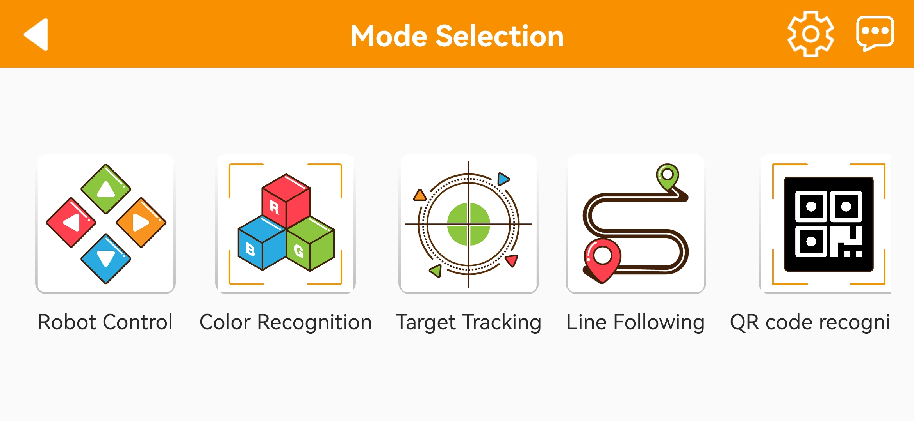

# 2. APP and Handle Control

## 2.1 APP Installation and Connection 

The following instructions use TurboPi as an example and apply to other Hiwonder Raspberry Pi series products as well.
In this section, you will learn how to use APP "**WonderPi**" to control TurboPi. The installation method is as follows.

:::{Note}

* Make sure all APP permissions are turned on in settings, otherwise APP functions will be limited!

* Turn on Location and WiFi before operation.

:::

### 2.1.1 Installation

**[APP Installation Pack (Android)](https://play.google.com/store/apps/details?id=com.Wonder.Pi)**

**[APP Installation Pack (iOS)](https://apps.apple.com/cn/app/wonderpi/id1477946178)**

:::{Note}
- Please turn TurboPi on before connecting. 

- Make sure all APP permissions are turned on in settings, otherwise APP functions will be limited!

- Turn on Location and WiFi before operation.
:::

### 2.1.2 APP Connection

(1) Start robot. (The switch is on Raspberry Pi expansion board). For detailed instruction, please refer to the file in "[**1. Quick Start Guide / 1.3 Start PuppyPi**](1.Quick_Start_Guide.md#start-puppypi)".

(2) After TurboPi boots up successfully, it enters AP direct connection mode, and generates a WiFi starting with **"HW"**. Join this WiFi, and then you can experience robot games

* **Introduction to Connection Mode**

There are two connection modes, namely direct connection mode and LAN mode. APP functions are the same under these two modes.

(1) AP direct connection mode: RaspberryPi generates a WiFi which can be connected by phones. But this WiFi has no internet access. 

(2) STA LAN mode: Raspberry Pi actively connects to specific WiFi. In this mode, you can access internet.

* **Direct Connection Mode (MUST-READ)** 

:::{Note}
After TurboPi boots up successfully, it enters AP direct connection mode, and generates a WiFi starting with **"HW"**.
:::

(1) Open"**WonderPi**". Select **"Standard ->TurboPi"** in sequence.

(2) Tap **"+"** in bottom right corner, and then select **Direct Connection Mode**.

(3) Tap **"Go to connect device hotspot"**. Join WiFi starting with "**HW**". The password is **"hiwonder"**.

(4) Return back to APP after connection.

:::{Note}
 for iOS user, please don't return to APP until WiFi icon appears on status bar, otherwise robot cannot be searched. If robot cannot be searched by APP, tap  to refresh.
:::

(5) APP automatically connects to robot. When robot icon below occurs, connection completes. 

:::{Note}
if you are informed of **"No Internet. Whether to keep connection",** just select "**keep connected**".
:::

(6) Tap robot icon to enter mode selection interface.

For detailed introduction to robot games, please refer to the file in "**[2.2 Start AI Games via APP](#anchor_2_2)**".

* **LAN Connection Mode**

(1) Disconnect the WiFi generated by TurboPi. Connect your phone to a WiFi. Take **"Hiwonder"** as example.

(2) After connection, open **"WonderPi"**. Select **"Standard ->TurboPi"** in sequence.

(3) Tap **"+"** in bottom right corner, and then select LAN Mode.

(4) Input the password of the WiFi your phone joins. Ensure the password you input is correct, otherwise APP fails to connect to robot. Tap **"OK"**.

(5) Tap **"Go to connect device hotspot"**.

(6) Join the WiFi starting with **"HW".** The password is **"hiwonder"**. After connection, return back to APP.

(7) APP automatically configures network.

(8) After a while, robot icon below occurs, and LED on expansion board keeps on.

(9) Long press robot icon to check TurboPi's IP and ID.

(10) Tap robot icon to enter mode selection interface.

For detailed introduction to robot games, please refer to the file in"**2.2 APP Start AI Games via APP**".

## 2.2 Start AI Games via APP

### 2.2.1 Getting Ready

Please install the APP and connect it to PuppyPi according to "[**2.1 APP Installation and Connection**](#anchor_2_1)".

### 2.2.2 Have a Try

Click the PuppyPi icon to enter the game selection interface.

* **Remote Control**

(1) Select **"Remote Control"**. When we successfully enter the game interface, PuppyPi will return to initial posture. There are two modes, including normal mode and advanced mode.

①  In normal mode, you can control PuppyPi to do some simple movements through dragging the button.

② In advanced mode, PuppyPi's motion speed, height and posture can be controlled.

The functions of the buttons under different modes are listed below.

| **Mode** |                                      **Icon**                                      |                                                 **Function**                                                  |
|:--:|:----------------------------------------------------------------------------------:|:-------------------------------------------------------------------------------------------------------------:|
| Normal mode |                       |                             Drag the button to control PuppyPi's moving direction                             |
| Advanced mode |       |                                    Display the level of speed from 0 to 10                                    |
| Advanced mode |                       | Drag the button to control PuppyPi's motion speed. The further you drag the button, the faster PuppyPi moves. |
| Advanced mode |                      |                                   Drag the slider to adjust the Pitch angle                                   |
| Advanced mode |                      |                                  Drag the slider to adjust PuppyPi's height.                                  |
| general |   |                    Capture the current camera returned image and save it to phone gallery                     |
| general |  |                                             Hide the top menu bar                                             |
| general |  |                     Contact with Hiwonder team(support@hiwonder.com) for more information                     |

(2)  If you want to return to the game selection interface, click the blank area to make the menu bar pop up. Then click  to go back to the game selection interface.

* **Performance Mode**

(1) Click **"Performance Mode"** to enter the game interface. The interface is divided into two parts.

① At the left side, it is the action list consisting of built-in actions and customized actions.

② At the right side, it is the self-balancing area.

:::{Note}

For how to customize action, please refer to the tutorial in "[**5. ROS1-PC Software Action Editing Course->5.6 APP Customized Control**](https://docs.hiwonder.com/projects/PuppyPi/en/latest/docs/10_action_editing.html#app-customized-control)".

:::

(2)  Select the actions at left randomly, and then PuppyPi will execute the corresponding action.

(3) Click **"keep balance"** button at right to make PuppyPi adjust and balance its posture automatically according to the tilt of surface.

The functions of buttons are as follow.

| Icon | Function |
|:--:|:--:|
|  | Take **"Lie Down"** for example. When we click this button, PuppyPi will lie down. |
|  | **"keep balance"** function.  (Note: The tilt should not exceed 30 degree.) |

(4)  If you want to return to the game selection interface, click the blank area to make the menu bar pop up. Then click   to go back to the game selection interface.

* **Object Tracking**

:::{Note}
* Please operate in the well-lit indoor and avoid the direct glare 
* Apart from the target object, please remove other stuffs in same or similar color to the target to avoid disturbance.

:::

(1) On the mode selection screen, tap **"Object Tracking"** to enter the feature interface. Using a red ball as an example, tap the **"Pick"** button to select the target color.

(2) The selected color will be displayed under "**Selected Color**" for confirmation.

(3)  Tap "Start" to begin tracking. Once activated, the robot will follow the movement of the selected object.

* **Target Tracking**

:::{Note}
*  Please operate in the well-lit indoor and avoid the direct glare
*  Apart from the target object, please remove other stuffs in same or similar color to the target to avoid disturbance.

:::

To get started, tap **"Tag Recognition"** to enter the feature interface, then tap **"Start"** to initiate the process. Once activated, hold the included label cards one at a time in front of the camera. When a card is successfully recognized, the robot will automatically perform the corresponding action.

<table  class="docutils-nobg" border="1">
    <thead>
        <tr>
            <th>Tag ID</th>
            <th>1</th>
            <th>2</th>
            <th>3</th>
        </tr>
    </thead>
    <tbody>
        <tr>
            <td>Executed action</td>
            <td>Greetings</td>
            <td>Lie down</td>
            <td>Push up</td>
        </tr>
    </tbody>
</table>

* **Face Detection**

:::{Note}
*  Please operate in the well-lit indoor
*  Please ensure the tag is intact. Missing part and dirt will influence the recognition result.
:::

* **Line Following**

:::{Note}

* Use tape to lay out the line-following track.

* Ensure the color selection range is appropriate—not too broad or too narrow—and avoid having objects with similar colors to the target within the camera’s field of view.

:::

(1)  On the mode selection screen, tap **"Line Following"** to enter the operation interface. Using red tape as an example, tap the **"Pick"** button.

(2) Drag the red circle within the live video feed to the track area to select the color, then tap "**OK**" button.

(3) The currently selected color will be displayed under **"Selected Color"**.

(4) Tap **"Start"** to begin. The robot will then follow the track accordingly.

* **Lidar**

:::{Note}

* Place the robot on a wide, flat surface to ensure it has sufficient space to move safely.

* Obstacles should be taller than the robot to ensure proper detection and response.

:::

(1)  Click **"Line Following"** to enter the game interface. The game interface is divided into two parts.

① At left, it is the button to start or stop the game.

② At right, it is the real-time image transmitted by camera.

<table  class="docutils-nobg" border="1">
    <thead>
        <tr>
            <th>Feature</th>
            <th>How it Works</th>
        </tr>
    </thead>
    <tbody>
        <tr>
            <td>Lidar Obstacle Avoidance</td>
            <td>The robot automatically changes direction when it detects an obstacle, helping it navigate safely.</td>
        </tr>
        <tr>
            <td>Lidar Following</td>
            <td>The robot tracks and adjusts its position to stay at a steady distance from the object ahead.</td>
        </tr>
        <tr>
            <td>Lidar guarding</td>
            <td>When an object is detected, the robot turns to face it, staying alert and responsive.</td>
        </tr>
    </tbody>
</table>

## 2.3 Adjust Color Threshold

Different light source will have different influence on the colors, which will result in recognition discrepancy. To tackle this problem, you can adjust color threshold via "**WonderPi**" APP.

### 2.3.1 Preparation

Start TurboPi. Open "**WonderPi**" APP, and connect it to TurboPi. For how to connect robot to APP, operate referring to "**[2.1 APP Installation and Connection](#anchor_2_1)**".

### 2.3.2 Interface Layout

Tap  in upper right corner to enter color threshold adjustment interface.

The table below list function of specific icon.

<table class="docutils-nobg" border="1">
<colgroup>
<col  />
<col  />
</colgroup>
<tbody>
<tr>
<td ><strong>Icon</strong></td>
<td ><strong>Function</strong></td>
</tr>
<tr>
<td ></td>
<td >
Processed camera returned image.

Target object is white, and other area is black.
</td>
</tr>
<tr>
<td ></td>
<td >Raw camera returned image.</td>
</tr>
<tr>
<td ></td>
<td >Select the color to be adjusted.</td>
</tr>
<tr>
<td ></td>
<td >
Adjust L component of camera returned image. "<b>L_min</b>" is lower limit and "<b>L_max</b>" is upper limit.

</tr>
<tr>
<td ></td>
<td >
Adjust A component of camera returned image. "<b>a_min</b>" is lower limit and "<b>a_max</b>" is upper limit.

</tr>
<tr>
<td ></td>
<td >
Adjust B component of camera returned image. "<b>b_min</b>" is lower limit and "<b>b_max</b>" is upper limit.

</tr>
<tr>
<td ></td>
<td >Get instruction to check how to adjust color threshold.</td>
</tr>
<tr>
<td ></td>
<td >Save the adjusted color threshold.</td>
</tr>
<tr>
<td ></td>
<td >Return back to mode selection interface.</td>
</tr>
<tr>
<td ></td>
<td >Hide navigation bar.</td>
</tr>
<tr>
<td ></td>
<td >Display Hiwonder info.</td>
</tr>
</tbody>
</table>

### 2.3.3 Adjust Color Threshold

(1) Select color to be adjusted. Take red as example.

(2) Put red object within camera recognition zone. Set L_min, a_min and b_min to 0, and L_max, a_max and b_max to 255.

(3) Tap "**Instruction**" icon to check how to adjust color threshold.

:::{Note}
if you need to close Instruction window, select "**OK**".
:::

(4) Red approaches "**+a**" zone, so you need to adjust A component.

(5) Keep "**a_max**" value the same, and then increase "**a_min**" value till red object turns white and other area is black.

(6) Adjust "**L**" and "**B**" values. If it belongs to light red, increase L_min. Otherwise, decrease L_max. If it belongs to warm tone, increase B_min. Otherwise, decrease B_max.

(7) Remember to save the value after adjustment.

## 2.4 Wireless Handle Control

### 2.4.1 Getting Ready

(1)  Step 1: insert the handle receiver into any USB interface on PuppyPi.

:::{Note}
please insert the handle receiver before the device boots up.
:::

(2) Step 2: please bring your own two AAA dry batteries. And insert them into the battery slot and please don't invert the positive and negative electrode.

### 2.4.2 Device connection

(1) Turn on PuppyPi.

(2) Turn on the switch on the handle. At this time, two LED lights will flash simultaneously.

(3) Please wait for a while. Then the robot will pair with the handle automatically. After successful pairing, the green light will keep lighting up.

:::{Note}
If the handle doesn't connect to the robot within 30s or there is no operation on the handle within 5 minutes after turning on, it will enter sleep mode. And you can press "**START**" to activate the handle.
:::

### 2.4.3 Key Function

The functions of the keys are listed below.

|                  Key                  |                     Function                     |
| :-----------------------------------: | :----------------------------------------------: |
|                 START                 |        PuppyPi returns to initial posture        |
|                  L1                   |                  raise its head                  |
|                  L2                   |                  bend its head                   |
|                  R1                   |                   tilt forward                   |
|                  R2                   |                  tilt backward                   |
|  ↑ /  Drag the left joystick upwards  |                   move forward                   |
| ↓ / Drag the left joystick downwards  |                  move backward                   |
|  ← / Drag the left joystick to left   |                    turn left                     |
| → /  Drag the left joystick to right  |                    turn right                    |
|  △ / Drag the right joystick upwards  |               increase body height               |
| × / Drag the right joystick downwards |               decrease body height               |
|  ◻ / Drag the right joystick to left  | speed down (combine with the "**↑**" and "**↓**" button) |
| ○ / Drag the right joystick to right  |  speed up (combine with the "**↑**" and "**↓**" button)  |

