# 20. ROS2-Motion Control Course

<p id="anchor_18_1"></p>

## 20.1 Trot Introduction

### 20.1.1 Gait Definition

Gait is the pattern of movement of the limbs of animals. Generally speaking, it is used to describe how the animal walks. The common quadruped gaits include Trot, Walk, Amble, Pace, etc.

The explanation for nouns used in gait is as follow.

|     **Noun**     |                       **Explanation**                        |
| :--------------: | :----------------------------------------------------------: |
|      phase       | Interpreted as Angle which indicates the position in cyclic motion. |
| phase difference |       The angle difference between two motion position       |
|   swing phase    |    When the legs are lifted, the body is without support.    |
|  support phase   |                  The legs touch the ground                   |
|      cycle       | The legs in one side from first to next touching ground is a cycle |
|  gait frequency  |         The number of completed cycle per unit time          |
|   step length    | The motion distance of the leg between lifting and touching ground in one cycle |
|  stride length   |         The motion distance of the body in one cycle         |
|    Duty ratio    | The ratio of the duration of one leg on ground to the gait cycle. |

### 20.1.2 Trot Illustration

Trot is a gait in medium to low speed where the feet at diagonal opposite ends of the body strike the ground together. This most frequently used quadruped gait has a wide motion range, and combines stability and speed.

When PuppyPi is in Trot gait, its feet at diagonal opposite ends of the body strike the ground together. Take the figure below for example.

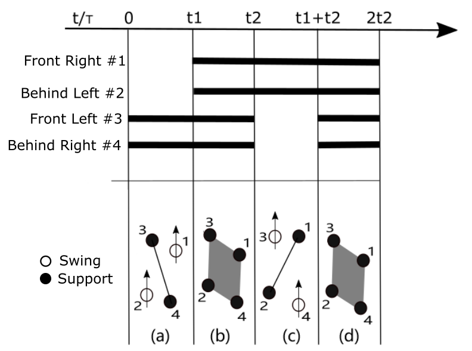

In (a), NO.1 and 2 legs of PuppyPi will lift and swing forward, and NO.3 and 4 legs are in support of the body to ensure that the center of gravity is at the intersection of the diagonal lines. At this time, NO.1 and 2 legs are in swing phase while NO. 3 and 4 legs are in support phase.

In (b), four legs touch the ground at the same time. All the legs are in support phase.

In (c), NO.3 and 4 legs will lift and swing forward, and NO.1 and 2 legs are in support of the body to ensure that the center of gravity is at the intersection of the diagonal lines. At this time, NO.3 and 4 legs are in swing phase while NO. 1 and 2 legs are in support phase.

In (d), four legs touch the ground at the same time. All the legs are in support phase.

Completing (a), (b), (c) and (d) actions indicates that PuppyPi finish a integrate cycle of action.

### 20.1.3 Operation Steps

:::{Note}

The input command should be case sensitive. And the key words can be complemented by "**Tab**" key.

:::

(1) Power on the robot, then follow the steps in  [3.3 Docker Container Introduction and Entry]() and [3.4 ROS Version Switch Tool Guide]() to connect via the VNC remote control software and switch to the ROS 2 environment.

(2) Click 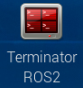 open command line terminal.

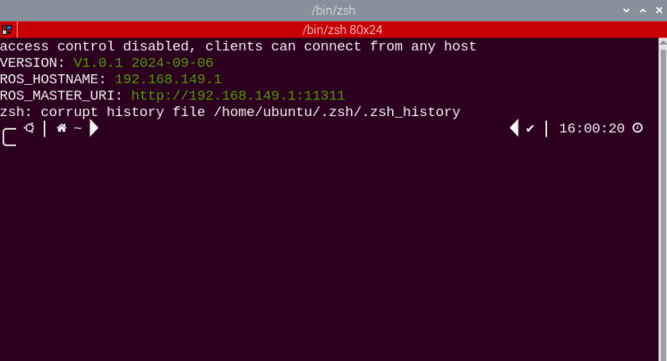

(3) Enter the command below and press Enter to open the program files

```py
ros2 launch puppy_control puppy_control.launch.py
```

(4) Open a new ROS2 terminal, and run the following command to open the program file using the vim editor.

```py
vim ros2_ws/src/driver/puppy_control/puppy_control/puppy_demo.py
```

(5) The code to call the gait can be found in the location shown in the image below. By default, the program executes the Trot gait, so it can be called and run directly.

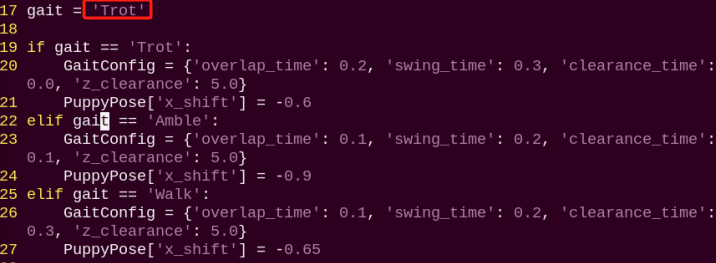

(6) Run the following command to initiate the game.

```py
python3 ros2_ws/src/driver/puppy_control/puppy_control/puppy_demo.py
```

(7) If you need to terminate this game, use shortcut '**Ctrl+C**'. If the terminal cannot be closed, please try again.

###  20.1.4 Program Outcome

After the game starts, PuppyPi will trot, that is to say its feet at diagonal opposite ends of the body lift or strike the ground together at the same time. The leg sequence diagram is as follow.


### 20.1.5 Program Analysis

The source code of this program is located in a Docker container: **[/row2_ws/src/driver/puppy_control/puppy_control/puppy_demo.py](../_static/source_code/ros2/puppy_demo.zip)**

* **Gait Selection**

There are three built-in gaits, including Trot, Amble and Walk. And Trot is the initial gait by default.

{lineno-start=25}

```python
	gait = 'Trot'
# overlap_time:4脚全部着地的时间，单位秒(the time when all four legs touch the ground, measured in seconds)
	# swing_time：单脚离地时间，单位秒(the time duration when a single leg is off the ground, measured in second)
	# clearance_time：前后交叉脚相位间隔时间，单位秒(the time interval between the phases when the front and rear legs cross each other, measured in seconds)
	# z_clearance：走路时，脚尖要抬高的距离，单位cm(the distance the paw needs to be raised during walking, measured in centimeters)
if gait == 'Trot':
    GaitConfig = {'overlap_time': 0.2, 'swing_time': 0.3, 'clearance_time': 0.0, 'z_clearance': 5.0}
    PuppyPose['x_shift'] = -0.6
    # Trot步态 clearance_time = 0(Trot gait clearance_time = 0)
elif gait == 'Amble':
    GaitConfig = {'overlap_time': 0.1, 'swing_time': 0.2, 'clearance_time': 0.1, 'z_clearance': 5.0}
    PuppyPose['x_shift'] = -0.9
	     # Amble步态 0 ＜ clearance_time ＜ swing_time( Amble gait 0 ＜ clearance_time ＜ swing_time)
elif gait == 'Walk':
    GaitConfig = {'overlap_time': 0.1, 'swing_time': 0.2, 'clearance_time': 0.3, 'z_clearance': 5.0}
    PuppyPose['x_shift'] = -0.65
     # Walk步态   swing_time ≤ clearance_time(Walk gait   swing_time ≤ clearance_time)
```

If want to change the gait, we can directly modify "**Trot**" as "**Walk**".

{lineno-start=25}

```python
gait = 'Trot'
```

* **Walking Frequency Adjustment**

We can modify the following parameters to adjust its walking frequency. The shorter the time, the higher the frequency. The longer the time, the lower the frequency.

{lineno-start=30}

```py
if gait == 'Trot':
    GaitConfig = {'overlap_time': 0.2, 'swing_time': 0.3, 'clearance_time': 0.0, 'z_clearance': 5.0}
    PuppyPose['x_shift'] = -0.6
```

The meaning of the parameters in bracket is as follow.

① The first parameter `overlap_time` is the time when all the legs touch the ground. The unit is second.

② The second parameter `swing_time` is the time when one leg is off the ground. The unit is second. 

③ The third parameter `clearance_time` is interval between the lifts of legs at diagonal opposite ends of the body. The unit is second.

④ The fourth parameter `z_clearance` is the lifted height in cm during walking.

⑤ Pay attention, under Trot gait, clearance_time must be 0.

:::{Note}

Under Trot gait, please ensure that clearance_time=0, overlap_time＞0 and swing_time＞0. If you want to better observe the Trot gait, we can extend swing_time and overlap_time, but the walking stability will be influenced due to slower frequency. For example, we modify swing_time as5 and overlap_time as 2.  

:::

## 20.2 Walk Introduction

### 20.2.1 Gait Definition

Gait is the pattern of movement of the limbs of animals. Generally speaking, it is used to describe how the animal walks. The common quadruped gaits include Trot, Walk, Amble, Pace, etc.

The explanation for nouns used in gait is as follow.

|     **Noun**     |                       **Explanation**                        |
| :--------------: | :----------------------------------------------------------: |
|      phase       | Interpreted as Angle which indicates the position in cyclic motion. |
| phase difference |       The angle difference between two motion position       |
|   swing phase    |    When the legs are lifted, the body is without support.    |
|  support phase   |                  The legs touch the ground                   |
|      cycle       | The legs in one side from first to next touching ground is a cycle |
|  gait frequency  |         The number of completed cycle per unit time          |
|   step length    | The motion distance of the leg between lifting and touching ground in one cycle |
|  stride length   |         The motion distance of the body in one cycle         |
|    Duty ratio    | The ratio of the duration of one leg on ground to the gait cycle. |

### 20.2.2 Walk Illustration

Walk is stati c gait where 3 legs are on the ground at least and 1 leg swings at most.

The sequence of different legs to swing is right front-\>left hind-\>left front-\>right hind, that is 1-\>2-\>3-\>4 as the picture shown.


In (a), NO.1 leg of PuppyPi will lift and swing forward, and NO. 2, 3 and 4 legs are in support of the body.

In (b), 4 legs are on the ground.

In (c), NO.2 leg will lift and swing forward, and NO. 1, 3 and 4 legs are in support of the body.

In (d), 4 legs are on the ground.

In (e), NO.3 leg will lift and swing forward, and NO. 1, 2 and 4 legs are in support of the body.

In (f), 4 legs are on the ground.

In (g), NO.4 leg will lift and swing forward, and NO. 1, 2 and 3 legs are in support of the body.

In (h), 4 legs are on the ground.

Completing (a), (b), (c), (d), (e), (f), (g) and (h) actions indicates that PuppyPi finish a integrate cycle of action.

### 20.2.3 Operation Steps

:::{Note}

The input command should be case sensitive. And the key words can be complemented by "**Tab**" key.

:::

(1) Power on the robot, then follow the steps in  [3.3 Docker Container Introduction and Entry]() and [3.4 ROS Version Switch Tool Guide]() to connect via the VNC remote control software and switch to the ROS 2 environment.

(2) Click  to open command line terminal

(3) Enter command and press Enter to access the underlying motion control file.

```py
ros2 launch puppy_control puppy_control.launch.py
```

(4) Run the following command to open the program file using the vim editor.

```py
vim ros2_ws/src/driver/puppy_control/puppy_control/puppy_demo.py 
```

(5) The code to call the gait can be found at the location shown in the image below. By default, the program executes the Trot gait. Press the '**i**' key to enter edit mode.


(6) Change "**Trot**" to "**Walk**", then press the "**Esc**" key, enter the command, and press Enter to save and exit.

```bash
:wq 
```

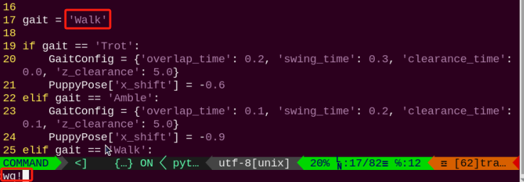

(7) Open a new terminal, enter the command, and press Enter to start the demo:

```py
python3 ros2_ws/src/driver/puppy_control/puppy_control/puppy_demo.py
```

(8) To stop the demo, press "**Ctrl+C**" in the terminal running the lower-level communication service. If it doesn't stop immediately, please try again.

### 20.2.4 Program Outcome

After the game starts, PuppyPi will walk, that is to say its three legs are on the ground at least and one leg is lifted at most. The leg sequence diagram is as follow.

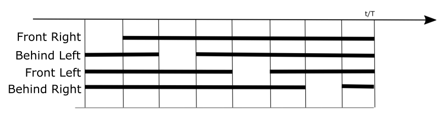

### 20.2.5 Program Analysis

The source code of this program is located in a Docker container **[/row2_ws/src/driver/puppy_control/puppy_control/puppy_demo.py](../_static/source_code/ros2/puppy_demo.zip)**

- **Gait Selection**

There are three built-in gaits, including Trot, Amble and Walk. And Trot is the initial gait by default.

{lineno-start=25}

```python
	gait = 'Trot'
# overlap_time:4脚全部着地的时间，单位秒(the time when all four legs touch the ground, measured in seconds)
	# swing_time：单脚离地时间，单位秒(the time duration when a single leg is off the ground, measured in second)
	# clearance_time：前后交叉脚相位间隔时间，单位秒(the time interval between the phases when the front and rear legs cross each other, measured in seconds)
	# z_clearance：走路时，脚尖要抬高的距离，单位cm(the distance the paw needs to be raised during walking, measured in centimeters)
if gait == 'Trot':
    GaitConfig = {'overlap_time': 0.2, 'swing_time': 0.3, 'clearance_time': 0.0, 'z_clearance': 5.0}
    PuppyPose['x_shift'] = -0.6
    # Trot步态 clearance_time = 0(Trot gait clearance_time = 0)
elif gait == 'Amble':
    GaitConfig = {'overlap_time': 0.1, 'swing_time': 0.2, 'clearance_time': 0.1, 'z_clearance': 5.0}
    PuppyPose['x_shift'] = -0.9
	     # Amble步态 0 ＜ clearance_time ＜ swing_time( Amble gait 0 ＜ clearance_time ＜ swing_time)
elif gait == 'Walk':
    GaitConfig = {'overlap_time': 0.1, 'swing_time': 0.2, 'clearance_time': 0.3, 'z_clearance': 5.0}
    PuppyPose['x_shift'] = -0.65
     # Walk步态   swing_time ≤ clearance_time(Walk gait   swing_time ≤ clearance_time)
```

If want to change the gait, we can directly modify "**Trot**" as "**Walk**".

{lineno-start=25}

```python
gait = 'Trot'
```

- **Walking Frequency Adjustment**

We can modify the following parameters to adjust its walking frequency. The shorter the time, the higher the frequency. The longer the time, the lower the frequency.

{lineno-start=38}

```py
elif gait == 'Walk':
    GaitConfig = {'overlap_time': 0.1, 'swing_time': 0.2, 'clearance_time': 0.3, 'z_clearance': 5.0}
```

The meaning of the parameters in bracket is as follow.

① The first parameter `overlap_time` is the time when all the legs touch the ground. The unit is second.

② The second parameter `swing_time` is the time when one leg is off the ground. The unit is second.

③ The third parameter `clearance_time` is interval between the lifts of legs at diagonal opposite ends of the body. The unit is second.

④ The fourth parameter `z_clearance` is the lifted height in cm during walking.

:::{Note}

Under Walk gait, please ensure clearance_time＞swing_time and overlap_time＞0. If you want to better observe the Walk gait, we can extend **swing_time** and **overlap_time** but the walking stability will be influenced due to lower frequency. For example, we modify clearance_time as 5, swing_time as 3, and overlap_time as 2.

:::

## 20.3 Amble Introduction

### 20.3.1 Gait Definition

Gait is the pattern of movement of the limbs of animals. Generally speaking, it is used to describe how the animal walks. The common quadruped gaits include Trot, Walk, Amble, Pace, etc.

The explanation for nouns used in gait is as follow.

|    **Noun**    |                       **Explanation**                        |
| :------------: | :----------------------------------------------------------: |
|     phase      | Interpreted as Angle which indicates the position in cyclic motion. |
|     phase      |       The angle difference between two motion position       |
|  swing phase   |    When the legs are lifted, the body is without support.    |
| support phase  |                  The legs touch the ground                   |
|     cycle      | The legs in one side from first to next touching ground is a cycle |
| gait frequency |         The number of completed cycle per unit time          |
|  step length   | The motion distance of the leg between lifting and touching ground in one cycle |
| stride length  |         The motion distance of the body in one cycle         |
|   Duty ratio   | The ratio of the duration of one leg on ground to the gait cycle. |

<p id="anchor_18_3_2"></p>

### 20.3.2 Amble Illustration

Amble is static gait which is considered as accelerated Walk gait. During motion, 2 legs are on the ground at least and 2 legs swings at most.

The motion process of **Amble** gait is the same as that of **Walk** gait. And the sequence of different legs to swing is right front-\>left hind-\>left front-\>right hind, that is 1-\>2-\>3-\>4 as the picture shown.

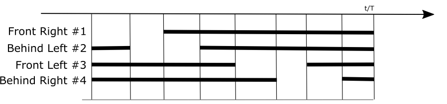

The difference between Amble and Walk gait is NO.2 leg is lifted after NO.1 leg touch the ground under **Walk** gait, while under **Amble** gait, NO.2 leg is lifted after NO.1leg is lifted but not touch the ground.

### 20.3.3 Operation Steps

:::{Note}

The input command should be case sensitive. And the key words can be complemented by "**Tab**" key.

:::

(1) Power on the robot, then follow the steps in  [3.3 Docker Container Introduction and Entry]() and [3.4 ROS Version Switch Tool Guide]() to connect via the VNC remote control software and switch to the ROS 2 environment.

(2) Click  to open command line terminal.

(3) Enter the following command and press Enter to open the program files

```bash
ros2 launch puppy_control puppy_control.launch.py
```

(4) Enter the following command to open the program file using the Vim editor:

```bash
vim ros2_ws/src/driver/puppy_control/puppy_control/puppy_demo.py
```

(5)  The code to call the gait can be found at the location shown in the image below. By default, the program executes the Trot gait. Press the "**I**" key to enter edit mode.

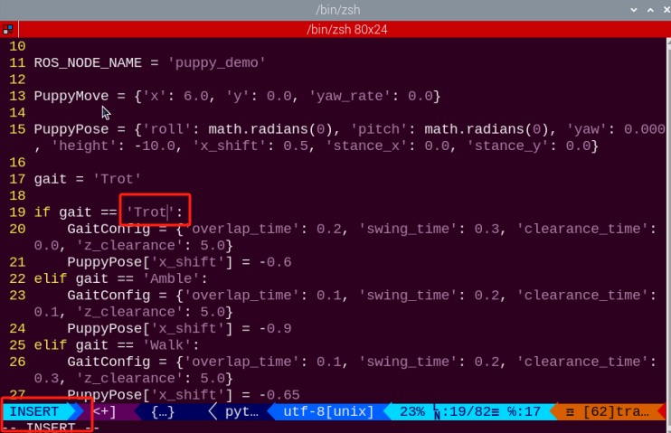

(5) Change "**Trot**" to "**Amble**", then press the "**Esc**" key, enter the command, and press Enter to save and exit:

```bash
:wq!
```

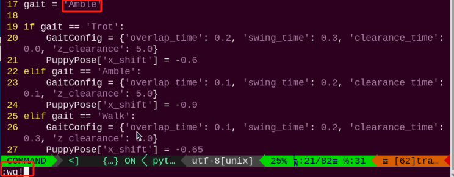

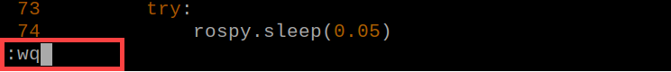

(7) Open a new terminal, enter the following command, and press Enter to start the demo.

```bash
python3 ros2_ws/src/driver/puppy_control/puppy_control/puppy_demo.py
```

(8) To stop the demo, press "**Ctrl+C**" in the terminal window. If it doesn't stop immediately, please try again.

### 20.3.4 Program Outcome

PuppyPi will amble with two legs in support of the body at least and two legs swinging at most. Amble gait is the accelerated Walk gait. The leg sequence diagram is as follow.


### 20.3.5 Program Analysis

The source code lies in **[/row2_ws/src/driver/puppy_control/puppy_control/puppy_demo.py](../_static/source_code/ros2/puppy_demo.zip)**

- **Gait Selection**

There are three built-in gaits, including Trot, Amble and Walk. And Trot is the initial gait by default.

{lineno-start=25}

```python
	gait = 'Trot'
# overlap_time:4脚全部着地的时间，单位秒(the time when all four legs touch the ground, measured in seconds)
	# swing_time：单脚离地时间，单位秒(the time duration when a single leg is off the ground, measured in second)
	# clearance_time：前后交叉脚相位间隔时间，单位秒(the time interval between the phases when the front and rear legs cross each other, measured in seconds)
	# z_clearance：走路时，脚尖要抬高的距离，单位cm(the distance the paw needs to be raised during walking, measured in centimeters)
if gait == 'Trot':
    GaitConfig = {'overlap_time': 0.2, 'swing_time': 0.3, 'clearance_time': 0.0, 'z_clearance': 5.0}
    PuppyPose['x_shift'] = -0.6
    # Trot步态 clearance_time = 0(Trot gait clearance_time = 0)
elif gait == 'Amble':
    GaitConfig = {'overlap_time': 0.1, 'swing_time': 0.2, 'clearance_time': 0.1, 'z_clearance': 5.0}
    PuppyPose['x_shift'] = -0.9
	     # Amble步态 0 ＜ clearance_time ＜ swing_time( Amble gait 0 ＜ clearance_time ＜ swing_time)
elif gait == 'Walk':
    GaitConfig = {'overlap_time': 0.1, 'swing_time': 0.2, 'clearance_time': 0.3, 'z_clearance': 5.0}
    PuppyPose['x_shift'] = -0.65
     # Walk步态   swing_time ≤ clearance_time(Walk gait   swing_time ≤ clearance_time)
```

If want to change the gait, we can directly modify "**Trot**" as "**Walk**" or "**Ample**".

{lineno-start=25}

```python
gait = 'Trot'
```

- **Walking Frequency Adjustment**

We can modify the following parameters to adjust its walking frequency. The shorter the time, the higher the frequency. The longer the time, the lower the frequency.

{lineno-start=34}

```py
elif gait == 'Amble':
    GaitConfig = {'overlap_time': 0.1, 'swing_time': 0.2, 'clearance_time': 0.1, 'z_clearance': 5.0}
```

The meaning of the parameters in bracket is as follow.

① The first parameter `overlap_time` is the time when all the legs touch the ground. The unit is second.

② The second parameter `swing_time` is the time when one leg is off the ground. The unit is second.

③ The third parameter  `clearance_time` is interval between the lifts of legs at diagonal opposite ends of the body. The unit is second.

④ The fourth parameter  `z_clearance` is the lifted height in cm during walking.

:::{Note}

Under Walk gait, please ensure clearance_time＞swing_time and overlap_time＞0. If you want to better observe the Walk gait, we can extend **swing_time** and **overlap_time**, but the walking stability will be influenced due to lower frequency. For example, we modify clearance_time as 5, swing_time as 3, and overlap_time as 2.

:::

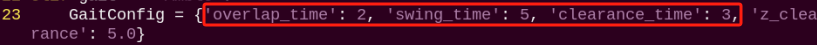

## 20.4 March on Spot under Trot Gait

For detailed introduction to Trot, please refer to the file [**20.1 Trot Introduction**](#anchor_18_1).

### 20.4.1 Operation Steps

:::{Note}

The input command should be case sensitive. And the key words can be complemented by "**Tab**" key.

:::

(1) Power on the robot, then follow the steps in  [3.3 Docker Container Introduction and Entry]() and [3.4 ROS Version Switch Tool Guide]() to connect via the VNC remote control software and switch to the ROS 2 environment.

(2) Click  to open command line terminal

(3) Input the following command and press Enter to open the program file.

```py
ros2 launch puppy_control puppy_control.launch.py
```

(4) Enter the following command to open the program file using the Vim editor:

```py
vim ros2_ws/src/driver/puppy_control/puppy_control/puppy_demo.py
```

(5) Press the "**i**" key to enter edit mode. Modify the code to: .

```py
future = self.set_mark_time_client.call_async(SetBool.Request(data=True))
```

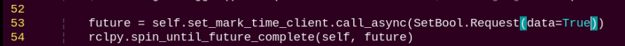

(6) After making the changes, press the "**Esc**" key, then enter the following command and press Enter to save and exit:

```bash
:wq 
```

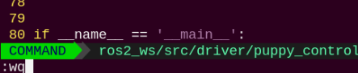

(7) Open a new terminal, enter the following command, and press Enter to start the demo:

```bash
python3 ros2_ws/src/driver/puppy_control/puppy_control/puppy_demo.py
```

(8) To stop the demo, press "**Ctrl+C**" in the terminal window. If it doesn't stop immediately, please try again.

### 20.4.2 Project Outcome

After the game starts, PuppyPi will march on the spot with Trot gait. The legs at diagonal opposite ends of the body lift or touch the ground together. The leg sequence diagram is as the figure below.

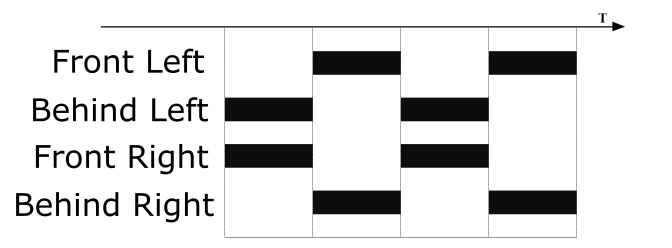

### 20.4.3 Program Analysis

The source code of this program is located in a Docker container **[/row2_ws/src/driver/puppy_control/puppy_control/puppy_demo.py](../_static/source_code/ros2/puppy_demo.zip)**

Through sending the corresponding command, we can control PuppyPi to march on the spot.

```py
future = self.set_mark_time_client.call_async(SetBool.Request(data=False))
rclpy.spin_until_future_complete(self, future)
```

The parameter in the bracket decides whether to send service or not, and it is "**False**" by default, which means that the service will not be sent. After the game starts, PuppyPi will move in the selected gait, for example Trot. When the parameter in the bracket is "**True**", PuppyPi will march on the spot.

If PuppyPi deviates during marching on the spot, we can adjust its center of gravity to tackle this problem. For detailed tutorial, please move to the folder [20.6 Center of Gravity Adjustment]().

## 20.5 Turn under Trot Gait

For detailed introduction to Trot, please refer to the file  '**[20.1 Trot Introduction](#anchor_18_1)**'.

This lesson is based on Trot. Through modifying the corresponding parameter, PuppyPi will turn under **Trot** gait.

### 20.5.1 Operation Steps

:::{Note}

The input command should be case sensitive. And the key words can be complemented by "**Tab**" key.

:::

(1) Power on the robot, then follow the steps in  [3.3 Docker Container Introduction and Entry]() and [3.4 ROS Version Switch Tool Guide]() to connect via the VNC remote control software and switch to the ROS 2 environment.

(2) Click  to open command line terminal

(3) Input command below and press Enter to initiate the underlying control service.

```bash
ros2 launch puppy_control puppy_control.launch.py
```

(4) Enter the following command to open the program file using the Vim editor:

```bash
vim ros2_ws/src/driver/puppy_control/puppy_control/puppy_demo.py
```

(5) Locate the code shown in the image below:

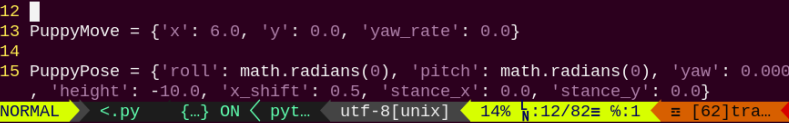

(6) Press the "**i**" key to enter edit mode. For example, to make the robot dog turn counterclockwise at 0.18 rad/s, modify the code to:

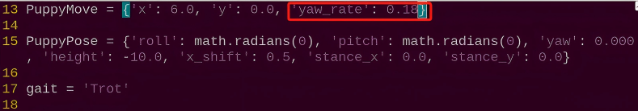

(7) After making the changes, press the "**Esc**" key, then enter the following command and press Enter to save and exit:

```bash
:wq
```

(8) Open a new terminal, enter the following command, and press Enter to start the demo:

```bash
python3 ros2_ws/src/driver/puppy_control/puppy_control/puppy_demo.py
```

(9) To stop the demo, press "**Ctrl+C**" in the terminal window. If it doesn't stop immediately, please try again.

### 20.5.2 Program Outcome

Under Trot gait, PuppyPi will turn in the set direction.

### 20.5.3 Program Analysis

The source code of this program lies in **[/row2_ws/src/driver/puppy_control/puppy_control/puppy_demo.py](../_static/source_code/ros2/puppy_demo.zip)**

* **Motion Parameter Adjustment**

Through setting the corresponding parameters, adjust PuppyPi's moving direction.

{lineno-start=13}

```python
PuppyMove = {'x': 5.0, 'y': 0.0, 'yaw_rate': 0.0}
```

The meaning of parameter in the bracket is as follow.

The third parameter "**yaw_rate**" is used to control PuppyPi to turn, ranging from **-0.89~0.89** rad/s. When the value is positive, PuppyPi will turn counterclockwise. When the value is negative, PuppyPi will turn clockwise. The greater the absolute value, the greater the turning angle.

Take the camera at front as the first-person perspective, and the rotation direction is as the picture shown.

1rad/s corresponds to 57.3°/s. For example, if you want to set the rotation speed as 30°/s, we should set "**yaw_rate**" as 0.52. (**30/57.3�.52**)

* **Gait Adjustment**

(1) Gait Selection

There are three built-in gaits, including Trot, Amble and Walk. And Trot is the initial gait by default.

{lineno-start=19}

```python
if gait == 'Trot':
    GaitConfig = {'overlap_time': 0.2, 'swing_time': 0.3, 'clearance_time': 0.0, 'z_clearance': 5.0}
    PuppyPose['x_shift'] = -0.6
elif gait == 'Amble':
    GaitConfig = {'overlap_time': 0.1, 'swing_time': 0.2, 'clearance_time': 0.1, 'z_clearance': 5.0}
    PuppyPose['x_shift'] = -0.9
elif gait == 'Walk':
    GaitConfig = {'overlap_time': 0.1, 'swing_time': 0.2, 'clearance_time': 0.3, 'z_clearance': 5.0}
    PuppyPose['x_shift'] = -0.65
```

If need to change the gait, we can uncomment the code of the target gait while comment the codes of the rest two gaits.

{lineno-start=17}

```python
gait = 'Trot'
```

(2) Speed Adjustment

Through adjusting the corresponding parameter, we can adjust PuppyPi's moving speed.

{lineno-start=20}

```py
GaitConfig = {'overlap_time': 0.2, 'swing_time': 0.3, 'clearance_time': 0.0, 'z_clearance': 5.0}
```

The meaning of the parameters in bracket is as follow.

The first parameter `overlap_time` is the time when all the legs touch the ground. The unit is second.

The second parameter `swing_time` is the time when one leg is off the ground. The unit is second.

The third parameter `clearance_time` is interval between the lifts of legs at diagonal opposite ends of the body. The unit is second.

The fourth parameter `z_clearance` is the lifted height in cm during walking.

## 20.6 Center of Gravity Adjustment

### 20.6.1 Center of Gravity 

The center of gravity of an object is the point at which weight is evenly dispersed and all sides are in balance. Therefore PuppyPi is in dynamic equilibrium during walking. To achieve dynamic equilibrium, PuppyPi needs to adjust different parts of its body to ensure the center of gravity is within the threshold.

In normal case, there is no need to adjust its center of gravity. However, in secondary development case, it is necessary to lock the center of gravity within the threshold to avoid body deviation and tilt.

Take human for example. Our center of gravity is different when we hold the object with our hands or carry it on back. Hence, we need to adjust our center of gravity to avoid falling down.

### 20.6.2 Program Explanation

The source code of this program is located in a Docker container:**[/row2_ws/src/driver/puppy_control/puppy_control/puppy_demo.py](../_static/source_code/ros2/puppy_demo.zip)**

Take Trot gait for example.

{lineno-start=15}

```python
PuppyPose = {'roll': math.radians(0), 'pitch': math.radians(0), 'yaw': 0.000, 'height': -10.0, 'x_shift': 0.5, 'stance_x': 0.0, 'stance_y': 0.0}
```

In the program above, parameter "**x_shift**" is the distance that PuppyPi' s four legs move in the same direction on X axis. It ranges from -10 to 10 cm. We can adjust this value to balance PuppyPi's body.

"**-0.6**" is the default balance value under Trot gait. As PuppyPi walks in different way under different gaits, the balance value varies.

The smaller the x_shift, the greater PuppyPi leans forward. The larger the x_shift, the greater PuppyPi leans back.

### **20.6.3** Operation Steps

Take controlling PuppyPi to lean 2cm forward. Please follow the steps below to operate.

:::{Note}

The input command should be case sensitive. And the key words can be complemented by "**Tab**" key.

:::

(1) Power on the robot, then follow the steps in  [3.3 Docker Container Introduction and Entry]() and [3.4 ROS Version Switch Tool Guide]() to connect via the VNC remote control software and switch to the ROS 2 environment.

(2) Click  to open command line terminal

(3) Input the following command and press Enter to initiate the underlying motion control node.

```py
ros2 launch puppy_control puppy_control.launch.py
```

(4) Enter the following command to open the program file using the Vim editor:

```py
vim ros2_ws/src/driver/puppy_control/puppy_control/puppy_demo.py
```

(5) Modify the parameter \`PuppyPose\['x_shift'\]\`. The default balance value for the Trot gait is -0.6. In this case, change the value to -2, which is smaller than the balance value, causing the robot dog to lean forward. After making the change, press the "**Esc**" key, then enter the following command to save and exit:

```py
:wq
```

(6) Open a new terminal, enter the following command, and press Enter to start the demo:

```py
python3 ros2_ws/src/driver/puppy_control/puppy_control/puppy_demo.py
```

(7) If you need to terminate the game, use short-cut 'Ctrl+C'. If you fail to close the game, please try again.

:::{Note}

- This modification method applies not only to the Trot gait but also to other gaits.

- In this example, a large adjustment is made to clearly observe the effect. For actual adjustments, it is recommended to make smaller incremental changes.

:::

### 20.6.4 Program Outcome

After the game starts, PuppyPi will walk with body leaning forward under **Trot** gait.

## 20.7 Basic Communication of ROS Robot

### 20.7.1 Communication Method

The ROS system is a distributed computing environment. It not only allows multiple nodes to run on a single robot but also enables them to run on multiple robots that communicate with each other, as long as these robots are on the same network.

Therefore, the communication architecture of ROS is the soul of ROS and also the key to the normal operation of the entire ROS system. There are four communication methods in ROS: Topic (topics), Service (services), Parameter Service (parameter server), and Actionlib (action library).

In ROS, topics use an asynchronous communication mechanism. They employ a publish/subscribe model, where data is transmitted from publishers to subscribers. Multiple subscribers or publishers can exist for the same topic. The topic model is illustrated in the following diagram:

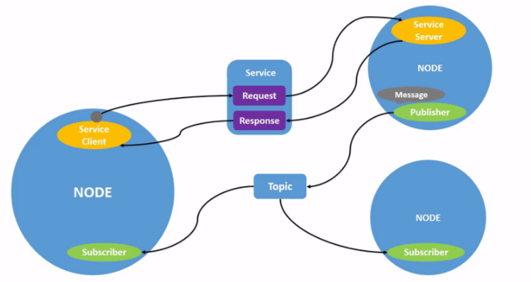

<p > Topic Model (publish/subscribe) </p>

Service adopts Synchronous Communication Mechanism and uses client/ server model. In this model, client will send request, and server will response after processing.

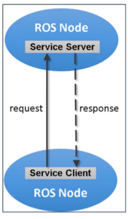

<p >Service Model (request/answer)</p>

### 20.7.2 Topic Communication

* **Check Topic Communication**

ROS comes with RQT tool. And we can use the corresponding tool to check the communication between the nodes of PuppyPi.

:::{Note}

The input command should be case sensitive, and the key words can be complemented by "**Tab**" key.

:::

(1) Power on the robot, then follow the steps in  [3.3 Docker Container Introduction and Entry]() and [3.4 ROS Version Switch Tool Guide]() to connect via the VNC remote control software and switch to the ROS 2 environment.

(2) Click  to open command line terminal

(3) Run the following command and hit Enter key to start the tool.

```py
rqt_graph 
```

(4) Please find the codes as the figure below shown, and set it as "**Nodes/Topics(all)**"

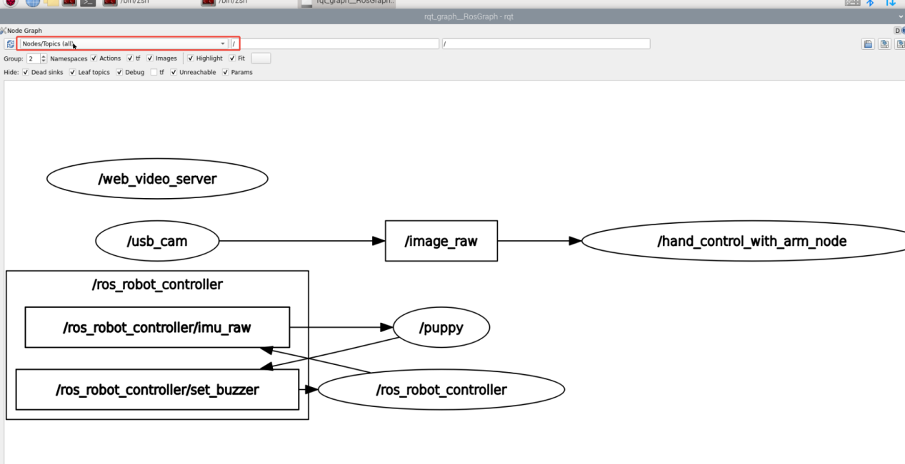

The interface displays the communication graph for the current environment. In the diagram:

① Rectangles represent topics

② Ellipses represent nodes

The visualized communication flow reflects the system's behavior after the robot powers on and initializes communication automatically.

* **Topic Communication**

Communication Flow:

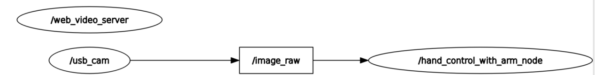

The following outlines the main communication processes:

(1) /usb_cam and /web_video_server Nodes:

① Both nodes publish data to the image_raw topic:

* usb_cam: Captures image data from the physical camera.

* web_video_server: Streams the video feed to remote clients.

② These topics provide image data to downstream nodes, such as /hand_control_with_arm_node.

(2) /ros_robot_controller：

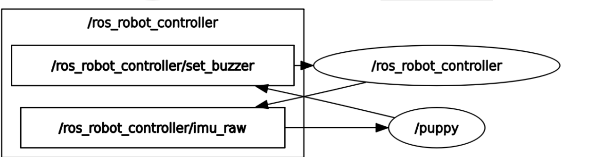 

① IMU Data Handling: Subscribes to /ros_robot_controller/imu_raw to receive IMU data for navigation and control.

② Buzzer Control: Publishes to /ros_robot_controller/set_buzzer to control the robot’s buzzer.

③ Robot Control: Communicates with the puppy topic to control the robot dog's movement.

(3) /hand_control_with_arm_node:

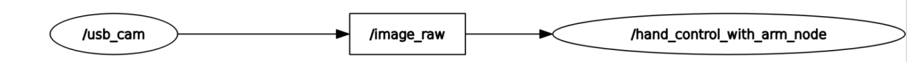 

① Subscribes to the image_raw topic to receive real-time video streams.

② Uses visual input to interact with and control the robot.

(4) Summary of Communication Relationships

① Publishers and Subscribers: ROS 2 nodes communicate using a publish–subscribe model.

* /usb_cam and /web_video_server act as publishers, publishing image data to the image_raw topic.

* /hand_control_with_arm_node is a subscriber that receives image data from this topic for processing.

② Data Flow Overview:

* Image Stream:Image data is published by /usb_cam and /web_video_server to image_raw, which is then utilized by nodes like /hand_control_with_arm_node.

* IMU Data:/ros_robot_controller subscribes to /ros_robot_controller/imu_raw to retrieve IMU data used in movement control.

* Buzzer Control:/ros_robot_controller publishes commands to /ros_robot_controller/set_buzzer to activate the buzzer.


## 20.8 PC Software Control

:::{Note}

To avoid interference, please cut off the connection to app first, then control PuppyPi through PC software.

If the software cannot be opened, please install the driver which can be found in the same folder.

:::

(1) Power on the robot, then follow the steps in [3.4 ROS Version Switch Tool Guide ]() to connect via the VNC remote control software and switch to the **ROS 2 environment**.

(2) Click  to open the Terminator ROS2 terminal, then run the following command to configure the network connection.

```bash
ros2 run rosbridge_server rosbridge_websocket --ros-args -p port:=9090
```

(3) Open a new command-line terminal by clicking the icon . Then execute the command below to enable the motion control node.

```bash
ros2 launch puppy_control puppy_control.launch.py
```

### 20.8.1 Open PC Software

Extract the PC software to any English path, then find the application below and open it. Please turn off the firewall before opening the PC software.

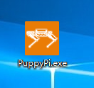

### 20.8.2 PC Software Connection

\(1\) Turn on PuppyPi

\(2\) Please wait until the buzzer beeps, at this time ROS system boots up successfully. Then connect your computer to the WiFi starting with HW. **Note:** if you are using desktop computer, wireless network card is required.

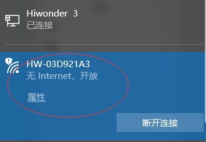

(3) Open PC software, and then click "**Connect**". After a while, PC software will connect to the PuppyPi.

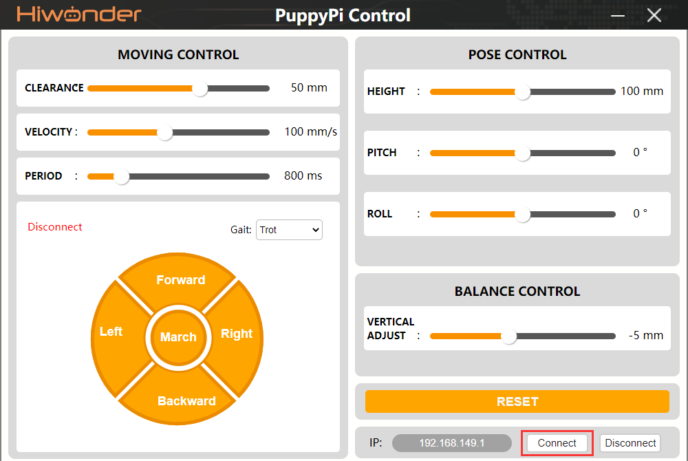

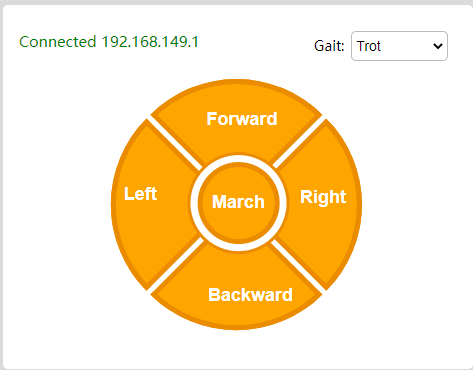

### 20.8.3 Interface Layout

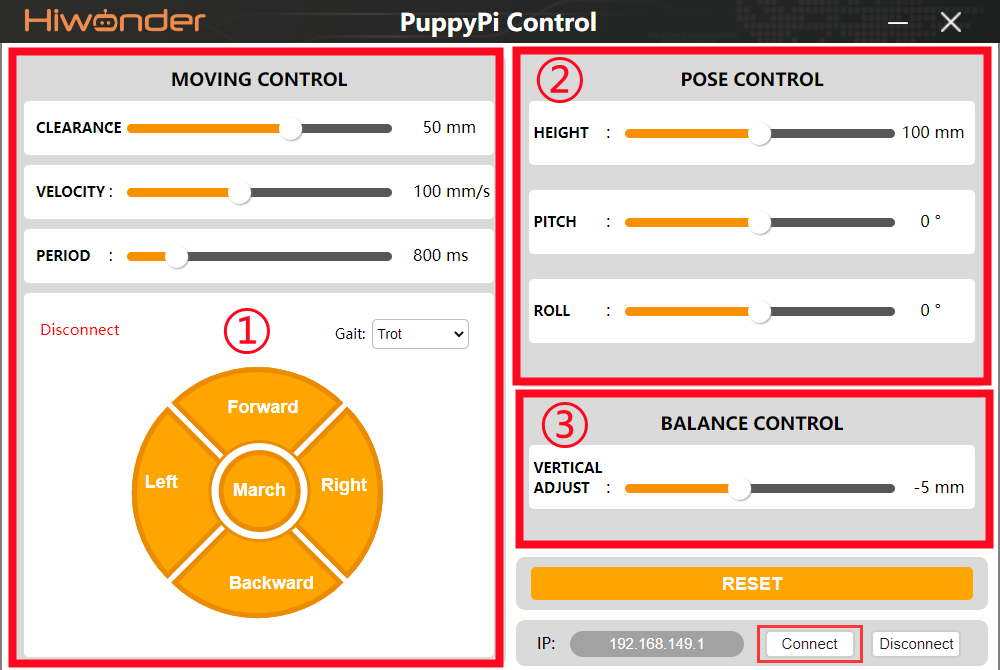

(1) Motion Control Area

|                                **Icon**                                |                         **Function**                         |
|:----------------------------------------------------------------------:| :----------------------------------------------------------: |
| 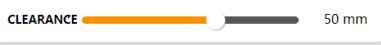  |    The maximum lifted height of leg during walking in mm     |
| 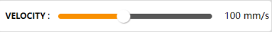 |                     Moving speed in mm/s                     |
| 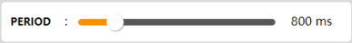 |               Time taken to complete one gait                |
| 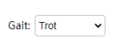 |          Switch between Trot, Amble and Walk gait.           |
| 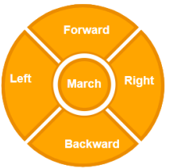 | Buttons for motion control. Click the button or press corresponding key to realize control |

(2) Posture Control Area

|                                **Icon**                                |                         **Function**                         |
|:----------------------------------------------------------------------:| :----------------------------------------------------------: |
| 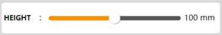 |    Adjust PuppyPi to high, medium or low standing posture    |
| 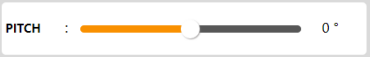 | Angle for PuppyPi to look up and down. When it is positive, PuppyPi will look up. When it is negative, PuppyPi will look down. The greater the absolute value, the larger the pitch angle. |
|  | Angle of left and right tilt. When it is positive, PuppyPi will tilt to right. When it is negative, PuppyPi will tilt to left. The greater the absolute value, the larger the roll angle. |

(3) Center of Gravity Control

|                           **Icon**                           |                         **Function**                         |
| :----------------------------------------------------------: | :----------------------------------------------------------: |
|  | The default value is -5. The smaller the value, the more it leans forward; The larger the value, the more it leans back. |

## 20.9 Coordinate System Establishing

### 20.9.1 Coordinate System Introduction

We take two steps to control PuppyPi to walk. Firstly, input the coordinate of foothold of PuppyPi's four legs. Secondly, use inverse kinematics to output the rotation angle of all the servos.

Therefore, coordinate system of PuppyPi should be established in the beginning. With the center of 4 upper joints as the origin (0,0,0), set the coordinate of foothold of PuppyPi's four legs.

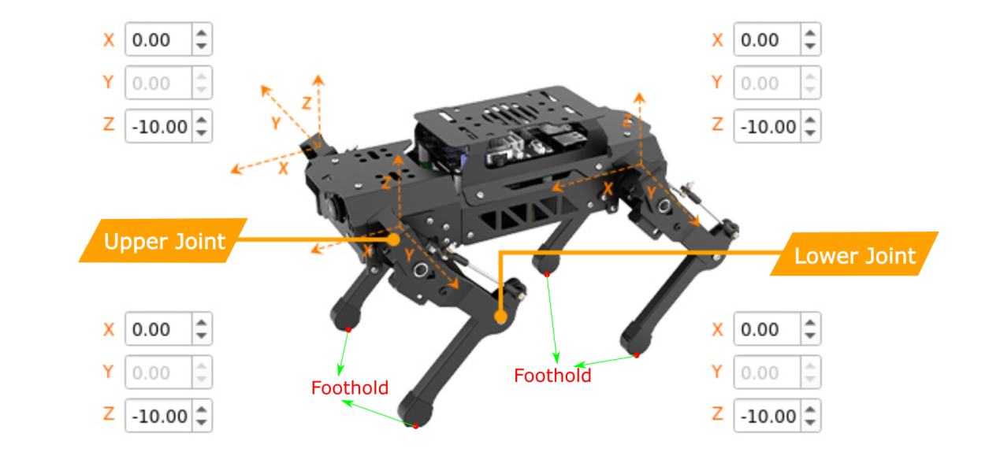

And we just need to set the X axis and Z axis values of coordinate of foothold of PuppyPi's four legs, because there is no servo for controlling PuppyPi to move on Y axis.

### 20.9.2 Coordinate Explanation

For better understanding, take coordinate of standing posture as example for explanation.

The coordinate is as the picture shown.


In PuppyPi's first-person perspective, FR, FL, BL and BL represent the position of 4 legs.

|     FR      |     FL     |      BR      |     BL      |
| :---------: | :--------: | :----------: | :---------: |
| front right | front left | behind right | behind left |

The coordinate corresponds to the distance in cm. When PuppyPi is standing, the coordinate of its four legs are (0, 0, -10). Coordinate of Z axis **-10** represents the perpendicular distance between its foothold and the origin is 10cm.

When the coordinate of X axis is 0, it means that the line connecting the foothold and the origin is perpendicular to the ground. If you want to make PuppyPi move froward 2cm, you can set the coordinate of X axis as 2.

## 20.10 Inverse Kinematics Analysis

### 20.10.1 Inverse Kinematics Introduction

Inverse kinematics matters in PuppyPi's path planning and control, because whether the inverse kinematics solution is fast and accurate directly affect the precision of PuppyPi's path planing and control. Therefore, fast and accurate inverse kinematics solution is essential.

For PuppyPi, what inverse kinematics is that solve the rotation angle of upper joint and lower joint according to the foot coordinate. The joint distribution is as the picture shown.

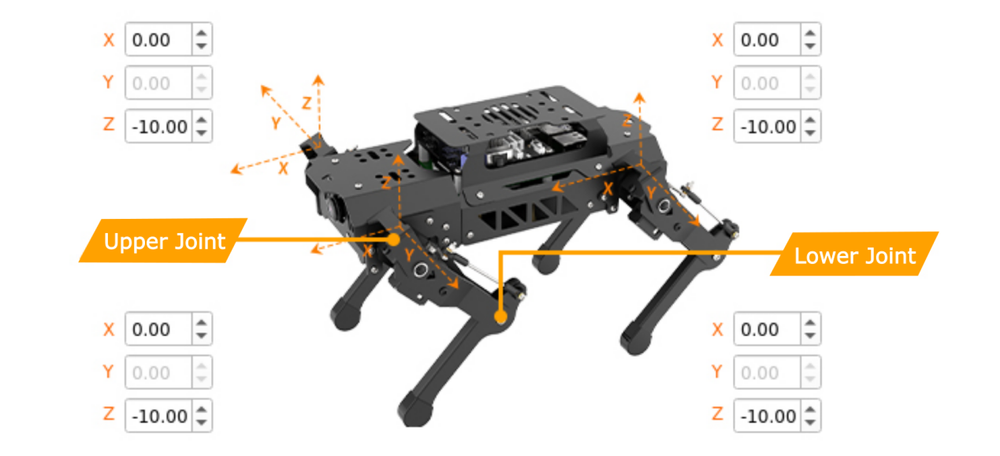

The rotation angle of upper joint is controlled by ID1,3, 5 and 7 servos on PuppyPi's body.

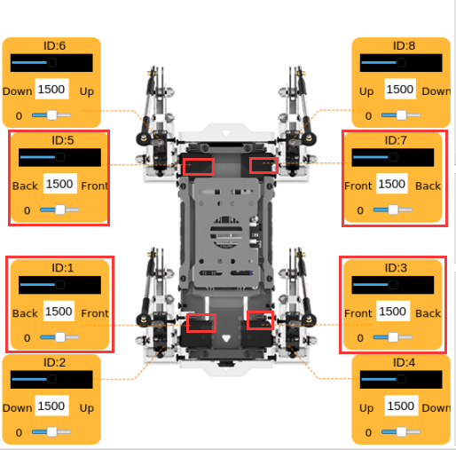

And the rotation angle of lower joint is controlled by ID 2, 4, 6 and 8 servos on upper joints. Linkage mechanism is adopted in the control.

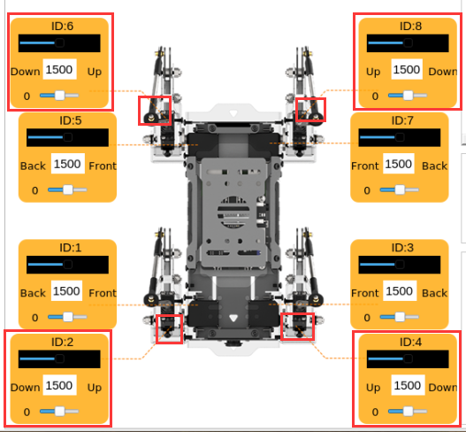

The solution procedure is divided into two steps.

(1) Calculate the position to which the upper and lower joints move so as to solve the rotation angle of the corresponding servo.

(2) According to the rotation angle of servo, calculate the corresponding value, and then directly control the servo to rotate.

### 20.10.2 Case Analysis

* **Storage Path of Source Code**

For better understanding, we will combine program control and inverse kinematics to analyze.

The source code for this program is located within the Docker container at:

**[/row2_ws/src/driver/puppy_control/puppy_control/puppy_IK_demo.py](../_static/source_code/ros2/puppy_IK_demo.zip)**

* **Operation Steps** 

:::{Note}

The input command should be case sensitive. And the key words can be complemented by "**Tab**" key.

:::

(1) Power on the robot, then follow the steps in  [3.3 Docker Container Introduction and Entry]() and [3.4 ROS Version Switch Tool Guide]() to connect via the VNC remote control software and switch to the ROS 2 environment.

(2) Click the icon in the top-left corner of the system desktop to open the Terminator ROS2 terminal. Navigate to the specified directory, enter the command to run the program, and press Enter. (The command consists of two lines; enter one line at a time.)

```bash
cd ros2_ws/src/driver/puppy_control/puppy_control/
```

```bash
python3 puppy_IK_ros2.py
```

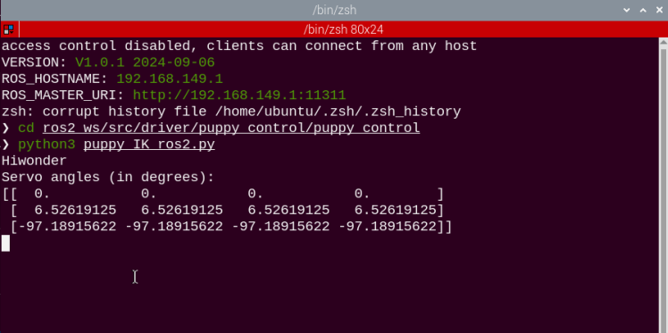

(3) If want to close this game, press "**Ctrl+C**". If it fails to close, please try again.

* **Program Outcome**

After the game starts, all the servos will rotate to the corresponding angle based on the set coordinate. And the rotation angle of all the servos will be printed on the terminal.

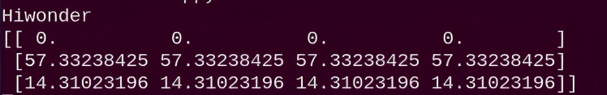

* **Program Analysis**

(1) Set coordinate

During controlling PuppyPi, we need to set the coordinates of 4 footholds.

{lineno-start=11}

```python
                            # FR    FL    BR     BL
foot_locations = np.array([ [ -1.,  -1.,  -1.,   -1.], # X
                            [ 0.,    0.,   0.,    0.], # Y
                            [-10,   -10,  -10,   -10,] # Z
```

With PuppyPi as the first-person perspective, FR, FL, BR and BL respectively represent its 4 legs.

|     FR      |     FL     |      BR      |     BL      |
| :---------: | :--------: | :----------: | :---------: |
| Front right | Front left | Behind right | Behind left |

:::{Note}

the coordinate of X axis ranges from -15 to +15, and Z axis ranges from -15 to -1.

:::

When the coordinate of X axis is set as 0, the line connecting foothold and the origin is perpendicular to the ground. If the coordinate of X axis is positive, the foothold is at the front.

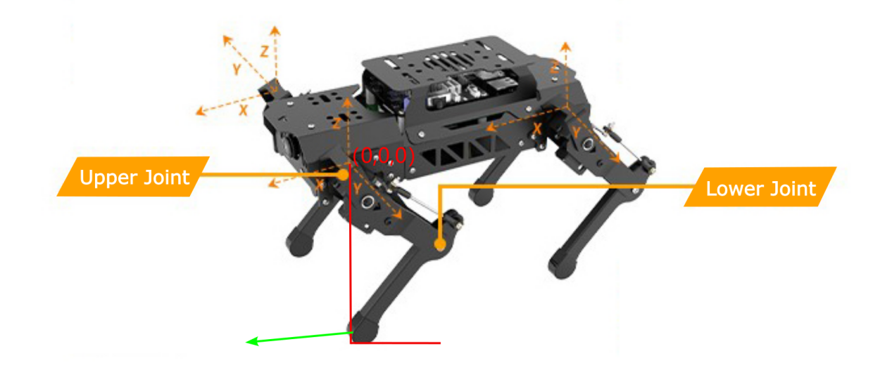

The larger the coordinate of Z axis, the higher its feet lift, which means that the perpendicular distance between foothold and the origin is shorter.

(2) Acquire servo angle

Calculate the servo angle through inverse kinematics.

{lineno-start=24}

```python
joint_angles = puppy.fourLegsRelativeCoordControl(foot_locations)
```

(3) Control servo to rotate

Calculate the pulse width of the servo according to the angle value so as to directly control servo rotation.

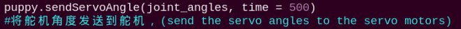

(4) Display servo angle

The servo angle will be displayed on the terminal.


The unit of the "**joint_angles**" is radian. And **joint_angles** times 57.3 equals the final servo angle in degree.

The angle of corresponding servo is as the figure below.

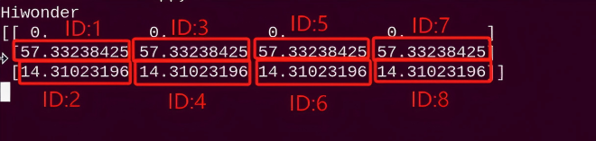

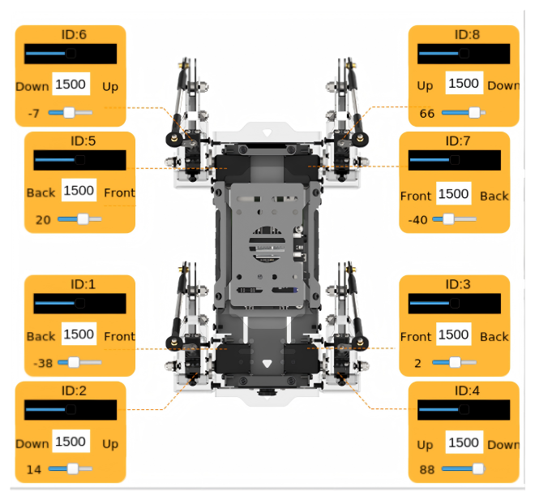

Let's take a look at the relationship between servo angle and PuppyPi's posture. Take ID1 and ID2 for example.

In this program, the angle of ID1 servo is 57.33238425, and the current posture of PuppyPi is as the figure below shown.

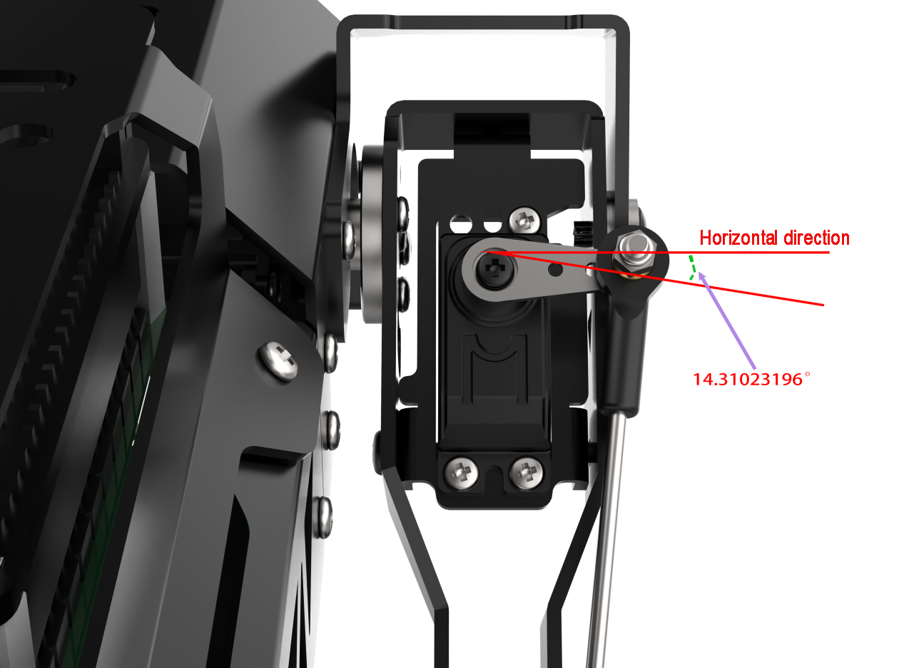

When the angle of ID1 servo is positive, the corresponding leg will swing backward. When it is negative, the leg will swing forward.

The angle of ID2 servo is 14.31023196, and the current posture of PuppyPi is as the figure below shown.

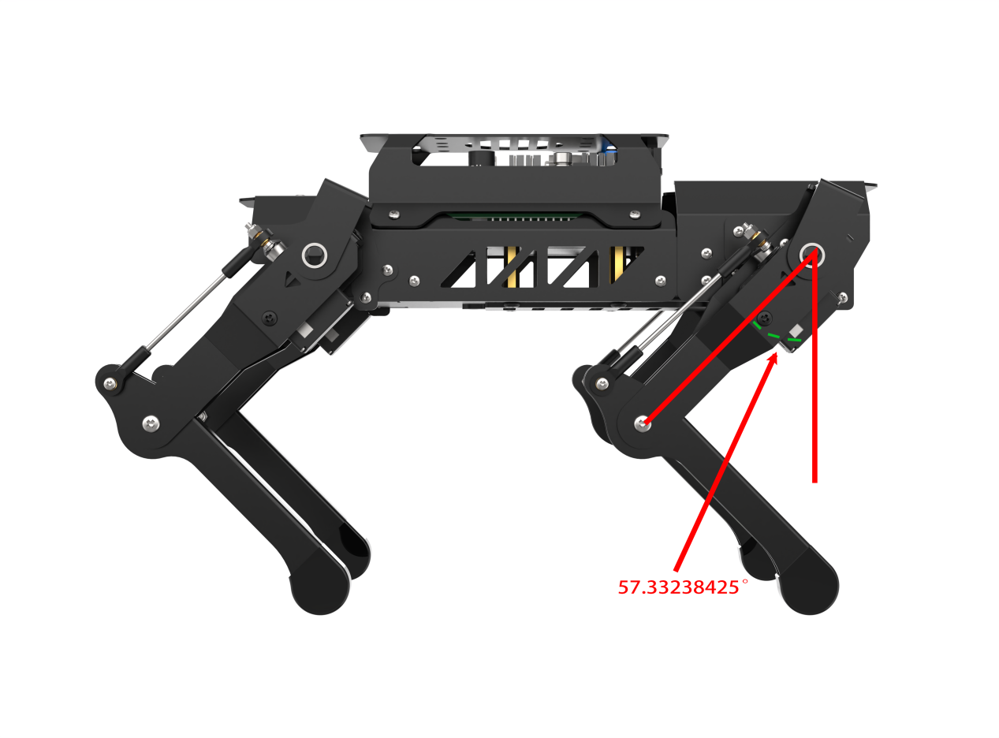

When the value is positive, the servo arm of ID2 servo is below the horizontal. When it is negative, the servo arm is above the horizontal.

<p id="anchor_18_11"></p>

## 20.11 Posture Parameter Instruction

### 20.11.1 Introduction

The parameter of static posture includes standing height, pitch angle, roll angle, etc.

PuppyPi's posture can be changed through adjusting the coordinates of 4 footholds. And we need to call "**puppy_demo.py**" file to set the posture.

This file is stored in **[/row2_ws/src/driver/puppy_control/puppy_control/puppy_demo.py](../_static/source_code/ros2/puppy_demo.zip)**

### 20.11.2 Parameter Illustration

Through modifying the following parameter, we can adjust PuppyPi's posture.

```py
PuppyPose = {'roll':math.radians(0), 'pitch':math.radians(0), 'yaw':0.000, 'height':-10, 'x_shift':-0.6, 'stance_x':0, 'stance_y':0}
```

And we mainly adjust x_shift, height, pitch and roll. The explanation for the parameters are listed in the table.

| **Parameter** |                       **Explanation**                        |
| :-----------: | :----------------------------------------------------------: |
|    x_shift    | It represents that the distance that 4 footholds moves in the same direction on the X axis. It is used to balance PuppyPi's body during moving. It ranges from -10 to +10 cm. |
|    height     | It indicates body height, that is the perpendicular distance between the foothold and the center of upper joint. It ranges from -15 to -5 cm. |
|     pitch     | It refers to the pitch angle of the robot body ranging from -31 to +31 degree. With PuppyPi as the first vision, when the pitch angle is positive, it will look up. When the pitch angle is negative, it will look down. The larger the absolute value, the larger the pitch angle. |
|     roll      | It represents that the roll angle of the body ranging from -31 to +31 degree. With PuppyPi as the first vision, when the pitch angle is positive, it will tilt to right. When the pitch angle is negative, it will tilt to left. The larger the absolute value, the greater it tills. |

For example, set its body height as 10cm, and make it loop down 20° and tilt 15° to the right

```py
PuppyPose = {'roll':math.radians(15), 'pitch':math.radians(-20), 'yaw':0.000, 'height':-10, 'x_shift':-0.6, 'stance_x':0, 'stance_y':0}
```

## 20.12 Standing Angle Adjustment

### 20.12.1 Introduction

Through adjusting the parameter, we can control PuppyPi's posture. For specific parameters, please move to the folder "**[20.11 Posture Parameter Instruction](#anchor_18_11)**"

We can adjust PuppyPi's standing angle through the control program.

The source code of this program is located in a Docker container **[/row2_ws/src/driver/puppy_control/puppy_control/puppy_demo.py](../_static/source_code/ros2/puppy_demo.zip)**

### 20.12.2 Operation Steps

:::{Note}

The input command should be case sensitive. And the key words can be complemented by "**Tab**" key.

:::

(1) Power on the robot, then follow the steps in  [3.3 Docker Container Introduction and Entry]() and [3.4 ROS Version Switch Tool Guide]() to connect via the VNC remote control software and switch to the ROS 2 environment.

(2) Click  to open command line terminal

(3) Input the command to edit "**puppy_demo.py**"

```bash
ros2 launch puppy_control puppy_control.launch.py
```

(4) Then, open a terminal again and enter the command to open the program file using the Vim editor.

```bash
vim ros2_ws/src/driver/puppy_control/puppy_control/puppy_demo.py
```

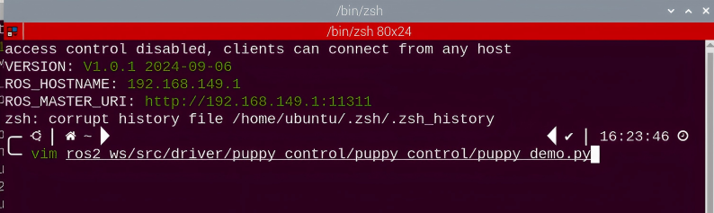

(5) Press '**i**' to enter edit mode. To facilitate observation, set the speed to 0 by modifying the 'x' parameter in '**PuppyMove**' to 0, as shown in the image below:

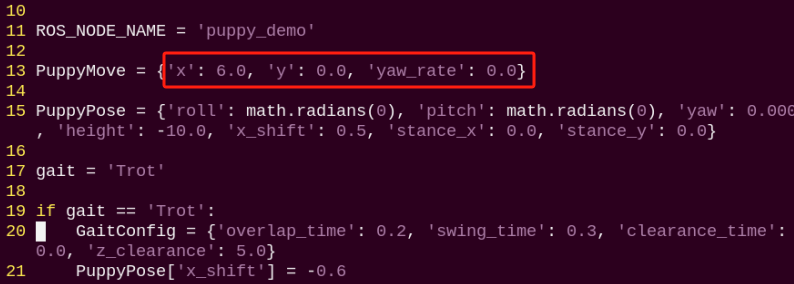

(6) Modify the 'roll' and 'pitch' parameters in 'PuppyPose'. The 'roll' represents the roll angle, and the 'pitch' represents the pitch angle. Both angles have a range of '-31° to 31°', with the unit in degrees.

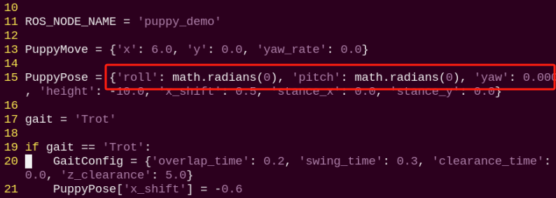

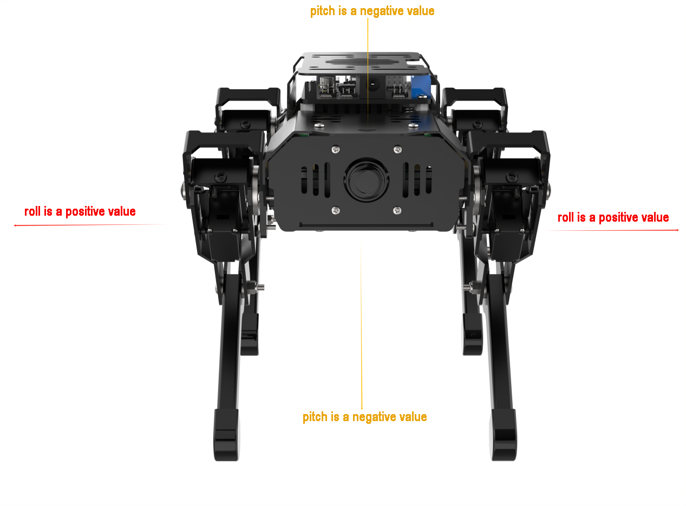

:::{Note} 

we should take PuppyPi as first-person perspective when making adjustment. When the value of "**roll**" is positive, PuppyPi will tilt to left. When it is negative, PuppyPi will tilt to right. When the value of "**pitch**" is positive, PuppyPi will look up. When it is negative, PuppyPi will look down.

:::

(7) For this example, to make the robot dog tilt 15 degrees to the left, modify the 'roll' value to 15. After making the change, press the 'Esc' key, then enter the command and press Enter to save.

```bash
:wq
```

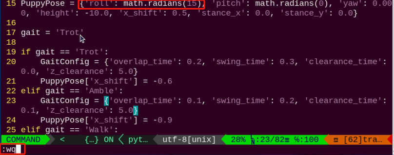

Modifications for other directions follow the same procedure, and you can adjust them as needed.

(8) Enter the command to run the program and press Enter (the command is entered in two steps):

```bash
cd ros2_ws/src/driver/puppy_control/puppy_control
```

```bash
python3 puppy_demo.py
```

To exit this mode, simply press '**Ctrl+C**' in the LX terminal window. If the exit command doesn't work, try pressing '**Ctrl+C**' multiple times.

### 20.12.3 Program Outcome

After the game starts, PuppyPi will stand as tilting 15° to the left.

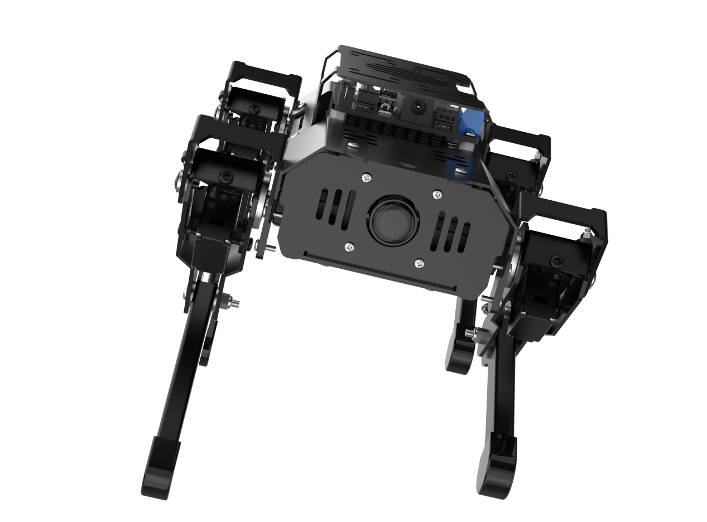

## 20.13 Gait Parameter

### 20.13.1 Gait Definition

Gait is used to describe how animal walks.

### 20.13.2  Types of Gait

In terms of balance method, PuppyPi's gaits are divided into three types, including static gait, dynamic gait and quasi-static gait.

And Walk is static gait, Trot is dynamic gait and Amble quasi-static gait.

### 20.13.3 Leg Distribution

The legs of PuppyPi are numbered in this order as the picture shown.

### 20.13.4 Dynamic Gait Control

* **Gait Introduction**

Trot is a dynamic gait in which the feet at diagonal opposite ends of the body lift and strike the ground together. For example, NO.1 and NO.2 leg, or NO.3 and NO.4 leg, move synchronously.

We can control the gait through the control program.

* **Operation Steps**

:::{Note}

The input command should be case sensitive. And the key words can be complemented by "**Tab**" key.

:::

(1) Power on the robot, then follow the steps in  [3.3 Docker Container Introduction and Entry]() and [3.4 ROS Version Switch Tool Guide]() to connect via the VNC remote control software and switch to the ROS 2 environment.

(2) Click  to open command line terminal.

(3) Input the following command to start editing.

```bash
vim ros2_ws/src/driver/puppy_control/puppy_control/puppy_demo.py
```

(4) Find the code that calls the gait in the position shown in the image below. By default, the program executes the Trot gait, so you can directly call and run it.

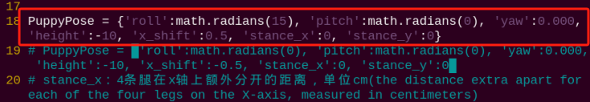

* **Dynamic Gait Setting** 

We need to set three parameters, including the time when 4 legs all touch the ground, the time when one leg lifts and the interval to switch between front leg and hind leg.

The codes to be set are in the red frame.

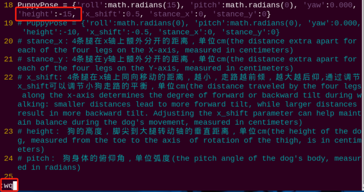

**overlap_time** represents the time when 4 legs all touch the ground, **swing_time** refers to the time when one leg lifts, and **clearance_time** is interval to switch between front leg and hind leg.

Please ensure clearance_time=0, overlap_timeï¼? and swing_timeï¼? when setting.

In Trot gait, PuppyPi's four legs switch in this sequence, 1 2� 4� 2, as shown in the below figure.

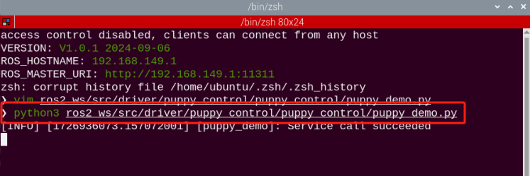

The bulge represents that the leg is lifted, represents the time when four legs all touch the ground and represents the time when one leg lifts the ground.

### 20.13.5 Static Gait Control

* **Gait Introduction**

Gait is used to describe how animal walks.

* **Types of Gait**

In terms of balance method, PuppyPi’s gaits are divided into three types, including static gait, dynamic gait and quasi-static gait. 

And Walk is static gait, Trot is dynamic gait and Amble quasi-static gait.

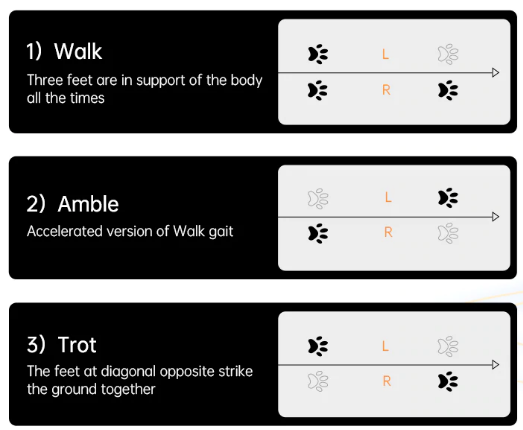

* **Leg Distribution**

The legs of PuppyPi are numbered in this order as the picture shown.


* **Dynamic Gait Control**

(1) Gait Introduction

Trot is a dynamic gait in which the feet at diagonal opposite ends of the body lift and strike the ground together. For example, NO.1 and NO.2 leg, or NO.3 and NO.4 leg, move synchronously.

We can control the gait through the control program.

(2) Operation Steps

:::{Note}

The input command should be case sensitive. And the key words can be complemented by "**Tab**" key.

:::

① Power on the robot, then follow the steps in  [3.3 Docker Container Introduction and Entry]() and [3.4 ROS Version Switch Tool Guide]() to connect via the VNC remote control software and switch to the ROS 2 environment.

② Click 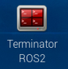 to open command line terminal.

③ Input the command below to access the program file.

```bash
vim ros2_ws/src/driver/puppy_control/puppy_control/puppy_demo.py
```

④ You can find the code calling the gait at the location indicated in the following image. The program is default to execute Trot gait, therefore we need to modify the program. Press "**i**" key to enter editing mode.

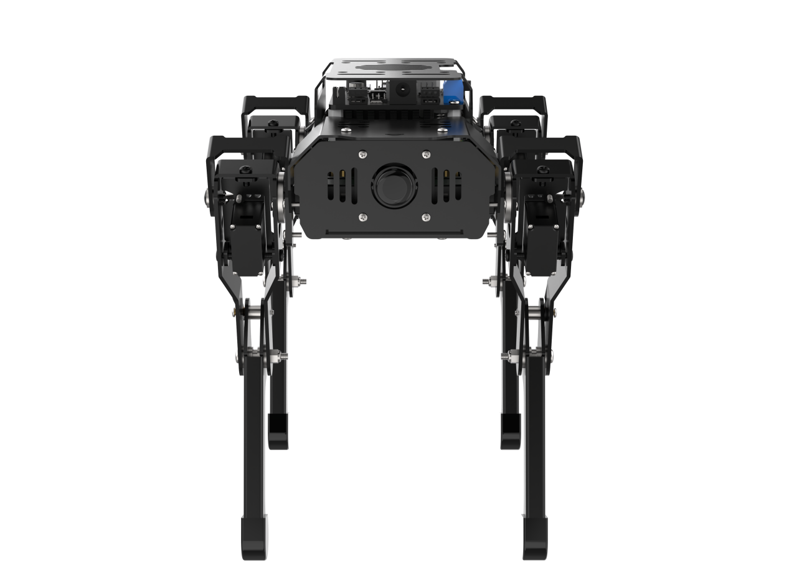

⑤ Modify "**Trot**" as "**Walk**".

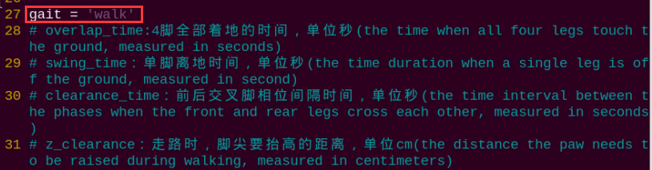

* **Static Gait Setting**

We need to set three parameters, including the time when 4 legs all touch the ground, the time when one leg lifts and the interval to switch between front leg and hind leg.

The codes to be set are in the red frame.

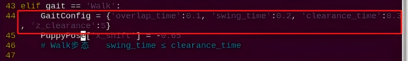

**overlap_time** represents the time when 4 legs all touch the ground, **swing_time** refers to the time when one leg lifts, and **clearance_time** is interval to switch between front leg and hind leg.

Please ensure that clearance_time swing_time and overlap_time when setting.

In Walk gait, PuppyPi's four legs switch in this sequence, 1����, as shown in the below figure.


The bulge represents that the leg is lifted, â‘?represents that the interval to switch between front leg and hind leg, â‘?represents the time when four legs all touch the ground and â‘?represents the time when one leg lifts the ground.

### 20.13.6 Quasi-static Gait Control

* **Gait Introduction**

Amble is a quasi-static gait which is also considered as the accelerated version of Walk gait. Under this gait, two legs are in support of the body at least and two legs swing at most.

We can control the gait through the control program.

* **Operation Steps**

:::{Note}

The input command should be case sensitive. And the key words can be complemented by "**Tab**" key.

:::

(1) Power on the robot, then follow the steps in  [3.3 Docker Container Introduction and Entry]() and [3.4 ROS Version Switch Tool Guide]() to connect via the VNC remote control software and switch to the ROS 2 environment.

(2) Click  to open command line terminal

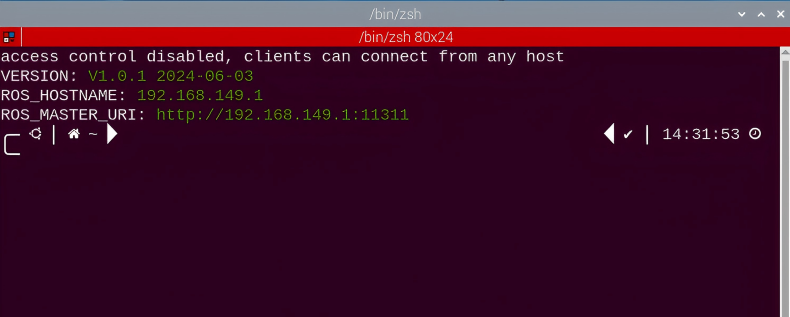

(3) Input the following command to access the program file.

```bash
vim ros2_ws/src/driver/puppy_control/puppy_control/puppy_demo.py
```

(4) The code that calls the gait can be found at the location shown in the image below. By default, the program executes the Trot gait. Press the '**i**' key to enter edit mode.

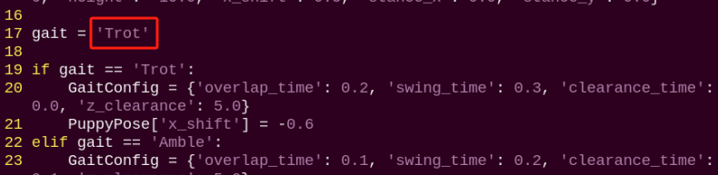

(5) Modify "**Trot**" as "**Amble**"

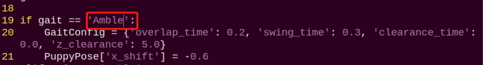

* **Quasi-static Gait Setting**

We need to set three parameters, including the time when 4 legs all touch the ground, the time when one leg lifts and the interval to switch between front leg and hind leg.

The codes to be set are in the red frame.

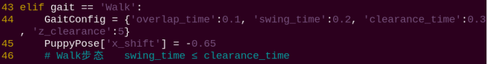

**overlap_time** represents the time when 4 legs all touch the ground, **swing_time** refers to the time when one leg lifts, and **clearance_time** is interval to switch between front leg and hind leg.

Please ensure that 0\<clearance_time\<swing_time and overlap_timeï¼? when setting.

In Amble gait, PuppyPi's four legs switch in this sequence, 1����, as shown in the below figure.

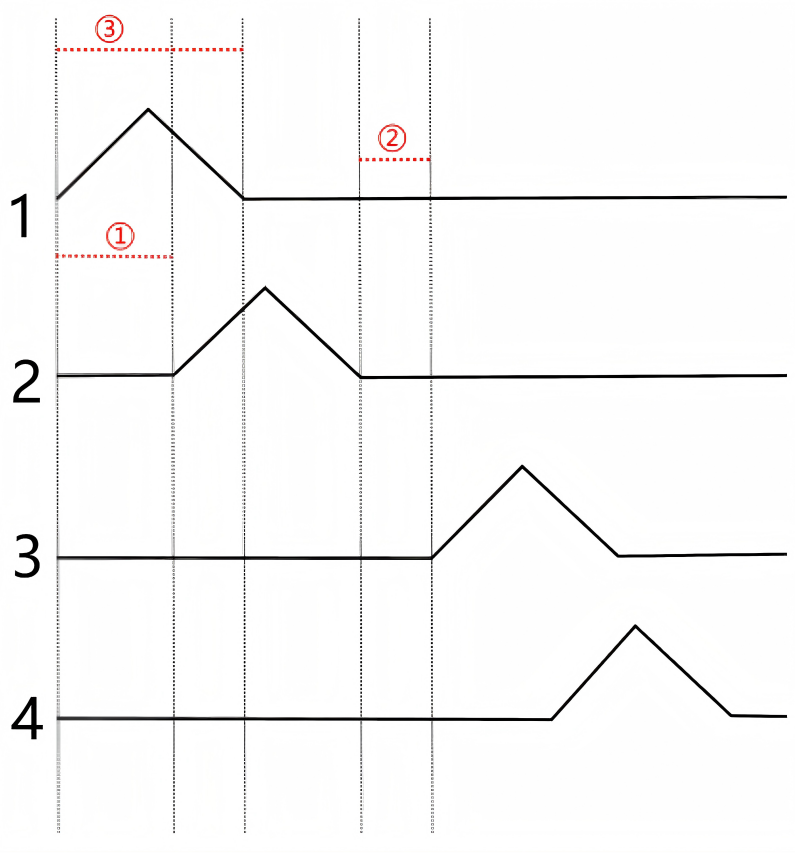

The bulge represents that the leg is lifted, â‘?represents that the interval to switch between front leg and hind leg, â‘?represents the time when four legs all touch the ground and â‘?represents the time when one leg lifts the ground.

### 20.13.7 Program Analysis

During PuppyPi is moving, there are two types of parameters, including motion parameter and gait parameter. The gait parameters include the time when 4 legs all touch the ground, the time when all leg lifts and the interval to switch between front leg and hind leg. And motion parameter includes moving speed and rotation speed.

We need to call "**puppy_demo.py**" file to set the parameter.

The source code of the program is located in the Docker container at: **[/row2_ws/src/driver/puppy_control/puppy_control/puppy_demo.py](../_static/source_code/ros2/puppy_demo.zip)**

The motion status can be adjusted through modifying the parameters.

The parameters to be adjusted is in the red frame.

The parameters in picture 1 is the motion parameters, and picture 2 is the gait parameters.


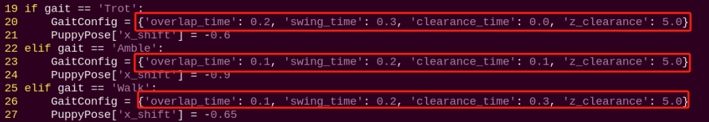

The explanation for the parameter is listed below.

| **Parameter**  |                       **Explanation**                        |
| :------------: | :----------------------------------------------------------: |
|  overlap_time  | Time when the ends of 4 legs all touch the ground. The unit is s. |
|   swing_time   |    Time when the ends of 2 legs all lift. The unit is s.     |
| clearance_time | Interval to switch between front leg and hind leg. The unit is s. |
|  z_clearance   | During moving, the lifted height of the end of the leg. The unit is cm |
|       x        | The moving speed ranging from -20 to +20 cm/s. When the value is positive, PuppyPi moves forward. When it is negative, it moves backward. The larger the absolute value, the faster PuppyPi moves. |
|    yaw_rate    | Turning speed ranging from -0.89 to +0.89 rad/s. With PuppyPi as first-person perspective, when the value is positive, PuppyPi turn clockwise. When it is negative, PuppyPi turns counterclockwise. The larger the absolute value, the faster PuppyPi turns. |

For example, we make PuppyPi turns counterclockwise in 30°/s and moves in 5cm/s. And the parameters are set as the figure shown.

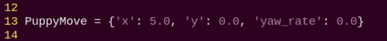

The unit of 0.52 is rad/s and the converted angular velocity is 30°/s (0.52\*57.3°/s�0°/s)

## 20.14 Walking Height Adjustment

### 20.14.1 Introduction

PuppyPi's walking height can be adjusted through adjusting the parameters. For specific parameters, please move to the file folder "**[20.11 Posture Parameter Instruction](#anchor_18_11)**".

We can adjust PuppyPi's walking height in the control program.

The source code for this program is located in the Docker container at: **[/row2_ws/src/driver/puppy_control/puppy_control/puppy_demo.py](../_static/source_code/ros2/puppy_demo.zip)**

### 20.14.2 Operation Steps

:::{Note}

The input command should be case sensitive. And the key words can be complemented by "**Tab**" key.

:::

(1) Power on the robot, then follow the steps in  [3.3 Docker Container Introduction and Entry]() and [3.4 ROS Version Switch Tool Guide]() to connect via the VNC remote control software and switch to the ROS 2 environment.

(2) Click  to open command line terminal

(3) Input the following command to start editing.

```bash
vim ros2_ws/src/driver/puppy_control/puppy_control/puppy_demo.py
```

(4) Press "**i**" key to start editing. For better observation, set the speed as 0, that is set "**x**" in "**PuppyMove**" as 0, as the picture shown.

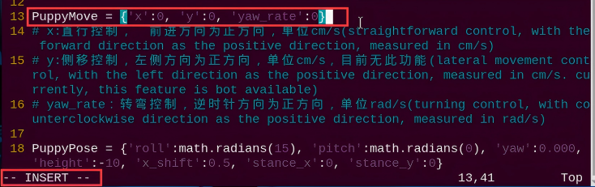

(5) Modify "**height**" in "**PuppyPose**" to adjust PuppyPi's height within **-15**~**-5 cm.**


:::{Note}

the smaller the value, the higher the height. -15 is the maximum height and -5 is the minimum height.
:::

(6) For example, we modify "**height**" as -15. After modification, press "**Esc**", and input "**:wq**" to save

```bash
:wq
```


(7) Input command and press Enter to run the program.

```bash
python3 ros2_ws/src/driver/puppy_control/puppy_control/puppy_demo.py
```

(8) If want to close this game, we can press "**Ctrl+C**". If it fails to close the game, please try again.

### 20.14.3 Program Outcome

After the game starts, the body height will be lifted to the set height.


## 20.15 Walking Speed Adjustment

### 20.15.1 Introduction

PuppyPi's walking speed can be adjusted by parameters. For specific parameters, please move to the folder "**[20.11 Posture Parameter Instruction](#anchor_18_11)**".

We can adjust PuppyPi's walking speed in the control program.

The source code for this program is located in the Docker container at: **[/row2_ws/src/driver/puppy_control/puppy_control/puppy_demo.py](../_static/source_code/ros2/puppy_demo.zip)**

### 20.15.2 Operation Steps

:::{Note}

 The input command should be case sensitive. And the key words can be complemented by "**Tab**" key.

:::

(1) Power on the robot, then follow the steps in  [3.3 Docker Container Introduction and Entry]() and [3.4 ROS Version Switch Tool Guide]() to connect via the VNC remote control software and switch to the ROS 2 environment.

(2) Click  to open command line terminal

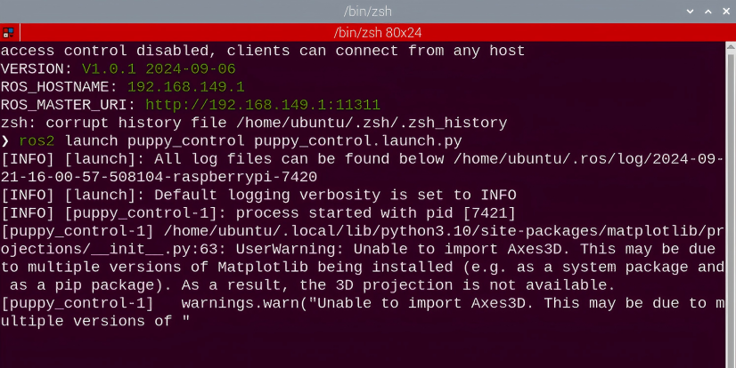

(3) Open a new ROS terminal, and run the following command to edit the file '**puppy_demo.py**'.

```bash
vim ros2_ws/src/driver/puppy_control/puppy_control/puppy_demo.py
```

(4) Modify "**x**" in "**PuppyMove**" to adjust PuppyPi's speed within **-20**~**20** cm/s.

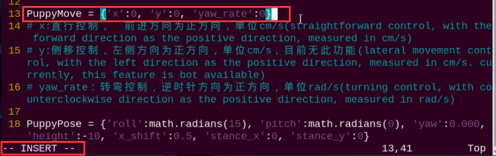

:::{Note}

*  When the parameter is positive, PuppyPi will move forward. When the parameter is negative, PuppyPi will move backward.

* The larger the absolute value of the parameter, the faster the robot moves.

* Under different gaits, speed adjustment has influence on its stability, therefore we should adjust the speed base on the actual performance of robot.

:::

(5) For example, we modify "**x**" as 12 to set the moving speed as 12 cm/s. After modification, press "**Esc**" and then input "**:wq**" to save.

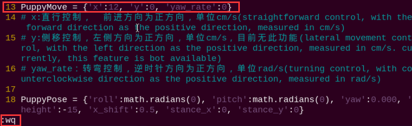

The modification of the backward speed follows the same procedure. Everyone can try different speed settings to compare the changes in the robot dog's speed.

(6) Input the command below to press Enter to run the program.

```bash
python3 ros2_ws/src/driver/puppy_control/puppy_control/puppy_demo.py
```

(7) If want to close this game, we can press "**Ctrl+C**". If it fails to close the game, please try again.

### 20.15.3 Program Outcome

After the game starts, PuppyPi will move in the set speed.

## 20.16 Trot with Head Down

### 20.16.1 Introduction

PuppyPi's gait and dynamic parameters can be adjusted simultaneously through the program, such as standing angle (static), moving speed (dynamic) and moving gait (dynamic).

We can make PuppyPi trot with head down through modifying the program.

The source code of this program is located in a Docker container **[/row2_ws/src/driver/puppy_control/puppy_control/puppy_demo.py](../_static/source_code/ros2/puppy_demo.zip)**

### 20.16.2 Operation Steps

:::{Note}

The input command should be case sensitive. And the key words can be complemented by "**Tab**" key.

:::

(1) Power on the robot, then follow the steps in  [3.3 Docker Container Introduction and Entry]() and [3.4 ROS Version Switch Tool Guide]() to connect via the VNC remote control software and switch to the ROS 2 environment.

(2) Click  to open command line terminal

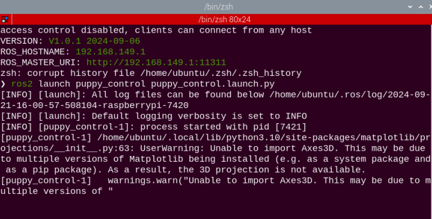

(3) Input the following command to edit "**puppy_demo.py**"

```bash
vim ros2_ws/src/driver/puppy_control/puppy_control/puppy_demo.py
```

(4) Press "**i**" to start editing. For better observation, we need to modify "**x**" in "**PuppyMove**" as 0 to set the speed as **0**.

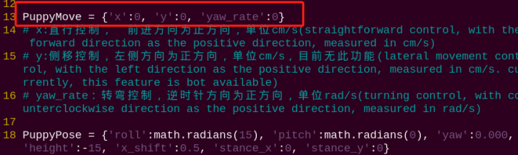

(5) Modify "**pitch**" in "**PuppyPose**" within **-31°~31°**. "**pitch**" represents the pitch angle. When the value is positive, PuppyPi will look up. When it is negative, PuppyPi will look down. For example, we modify "**pitch**" as -15 to make PuppyPi look down 15° .

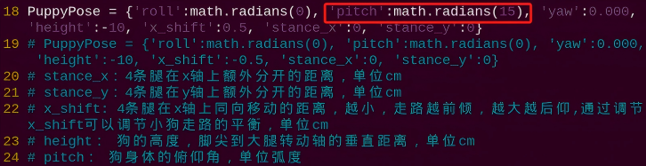

(6) Next, set the robot dog to the Trot gait. Locate and check if the 'gait' parameter is set to 'Trot'. By default, the program uses the Trot gait, so no modification is needed. If it is not set to 'Trot', change it to 'Trot'.

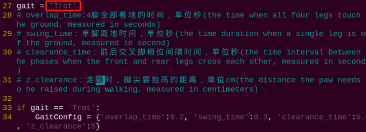

(7) Finally, modify the 'x' parameter in 'PuppyMove'. For example, change the value to the default 5, so the robot dog moves forward at a speed of 5 cm/s. After making the change, press the 'Esc' key, then enter the command to save the changes.

```bash
:wq
```

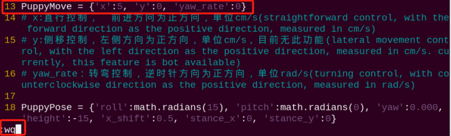

:::{Note}

* You also can modify other gaits in this way.

* The pitch angle should be modified based on the actual situation to avoid the influence on running.

:::

(8) Input the following command and press Enter to run the program.

```bash
python3 ros2_ws/src/driver/puppy_control/puppy_control/puppy_demo.py
```

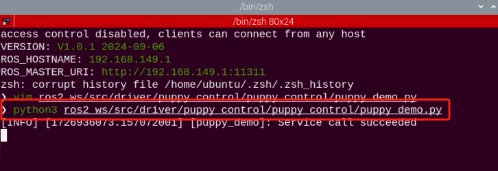

(9) If want to close this game, we can press "**Ctrl+C**". If it fails to close the game, please try again.

### 20.16.3 Program Outcome

After the game starts, PuppyPi will Trot with head down.
