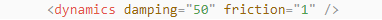

# 22. ROS2-Simulation Course

## 22.1 Introduction to URDF Models and Getting Started

### 22.1.1 URDF Model Introduction

The Unified Robot Description Format (URDF) is an XML file format widely used in ROS (Robot Operating System) to comprehensively describe all components of a robot.

Robots are typically composed of multiple links and joints. A link is defined as a rigid object with certain physical properties, while a joint connects two links and constrains their relative motion.

By connecting links with joints and imposing motion restrictions, a kinematic model is formed. The URDF file specifies the relationships between joints and links, their inertial properties, geometric characteristics, and collision models.

### 22.1.2 Comparison between xacro and URDF Model

The URDF model serves as a description file for simple robot models, offering a clear and easily understandable structure. However, when it comes to describing complex robot structures, using URDF alone can result in lengthy and unclear descriptions.

To address this limitation, the xacro model extends the capabilities of URDF while maintaining its core features. The xacro format provides a more advanced approach to describe robot structures. It greatly improves code reusability and helps avoid excessive description length.

For instance, when describing the two legs of a humanoid robot, the URDF model would require separate descriptions for each leg. On the other hand, the xacro model allows for describing a single leg and reusing that description for the other leg, resulting in a more concise and efficient representation.

### 22.1.3 Basic Syntax of URDF Model

* **XML Basic Syntax**

The URDF model is written using XML standard.

**Elements**:

An element can be defined as desired using the following formula:

```xml
<element>

</element>
```


**Properties**:

Properties are included within elements to define characteristics and parameters. Please refer to the following formula to define an element with properties:

```xml
<element
property_1="property value1"

property_2="property value2">

</element>
```

**Comments**:

Comments have no impact on the definition of other properties and elements. Please use the following formula to define a comment:

```xml
<!-- comment content -->
```

* **Link**

The Link element describes the visual and physical properties of the robot's rigid component. The following tags are commonly used to define the motion of a link:


\<visual\>: Describe the appearance of the link, such as size, color and shape.

\<inertial\>: Describe the inertia parameters of the link, which will used in dynamics calculation.

\<collision\>: Describe the collision inertia property of the link.

Each tag contains the corresponding child tag. The functions of the tags are listed below.

| **Tag**  |                         **Function**                         |
| :------: | :----------------------------------------------------------: |
|  origin  | Describe the pose of the link. It contains two parameters, including xyz and rpy. Xyz describes the pose of the link in the simulated map. Rpy describes the pose of the link in the simulated map. |
|   mess   |                Describe the mess of the link                 |
| inertia  | Describe the inertia of the link. As the inertia matrix is symmetrical, these six parameters need to be input, ixx, ixy, ixz, iyy, iyz and izz, as properties. These parameters can be calculated. |
| geometry | Describe the shape of the link. It uses mesh parameter to load texture file, and em\[ploys filename parameters to load the path for texture file. It has three child tags, namely box, cylinder and sphere. |
| material | Describe the material of the link. The parameter name is the required filed. The tag color can be used to change the color and transparency of the link. |

<p id="anchor_joint"></p>

* **Joint**

The "**Joint**" tag describes the kinematic and dynamic properties of the robot's joints, including the joint's range of motion, target positions, and speed limitations. In terms of motion style, joints can be categorized into six types.


The following tags will be used to write joint motion.


- \<parent_link\>: Parent link

- \<child_link\>: Child link

- \<calibration\>: Calibrate the joint angle

- \<dynamics\>: Describes some physical properties of motion

- \<limit\>: Describes some limitations of the motion

The function of each tag is listed below. Each tag involves one or several child tags.

|      **Tag**      |                         **Function**                         |
| :---------------: | :----------------------------------------------------------: |
|      origin       | Describe the pose of the parent link. It involves two parameters, including xyz and rpy. Both xyz and rpy describe the pose of the link in simulated map. |
|       axis        | Control the child link to rotate around any axis of the parent link. |
|       limit       | The motion of the child link is constrained using the lower and upper properties, which define the limits of rotation for the child link. The effort properties restrict the allowable force range applied during rotation (values: positive and negative; units: N). The velocity properties confine the rotational speed, measured in meters per second (m/s). |
|       mimic       |          Describe the relationship between joints.           |
| safety_controller | Describes the parameters of the safety controller used for protecting the joint motion of the robot. |

* **robot Tag**

The complete top tags of a robot, including the \<link\> and \<joint\> tags, must be enclosed within the \<robot\> tag. The format is as follows:


* **gazebo Tag**

This tag is used in conjunction with the Gazebo simulator. Within this tag, you can define simulation parameters and import Gazebo plugins, as well as specify Gazebo's physical properties, and more.


* **Write Simple URDF Model**

\(1\) Name the model of the robot

To start writing the URDF model, we need to set the name of the robot following this format: "**\<robot name="robot model name"\>**". Lastly, input "**\</robot\>**" at the end to represent that the model is written successfully.


(2) Set links

① To write the first link and use indentation to indicate that it is part of the currently set model. Set the name of the link using the following format: **\<link name="link name"\>**. Finally, conclude with "**\</link\>**" to indicate the successful completion of the link definition.


② Write the link description and use indentation to indicate that it is part of the currently set link, and conclude with "**\</visual\>**".


③ The "**\<geometry\>**" tag is employed to define the shape of a link. Once the description is complete, include "**\</geometry\>**". Within the "**\<geometry\>**" tag, indentation is used to specify the detailed description of the link's shape. The following example demonstrates a link with a cylindrical shape: "**\<cylinder length="0.01" radius="0.2"/\>**". In this instance, "**length="0.01"**" signifies a length of 0.01 meters for the link, while "**radius="0.2"**" denotes a radius of 0.2 meters, resulting in a cylindrical shape.


④ The "**\<origin\>**" tag is utilized to specify the position of a link, with indentation used to indicate the detailed description of the link's position. The following example demonstrates the position of a link: "**\<origin rpy="0 0 0" xyz="0 0 0" /\>**". In this example, "**rpy**" represents the roll, pitch, and yaw angles of the link, while "**xyz**" represents the coordinates of the link's position. This particular example indicates that the link is positioned at the origin of the coordinate system.


⑤ The "**\<material\>**" tag is used to define the visual appearance of a link, with indentation used to specify the detailed description of the link's color. To start describing the color, include "**\<material\>**", and end with "**\</material\>**" when the description is complete. The following example demonstrates setting a link color to yellow: "**\<color rgba="1 1 0 1" /\>**". In this example, "**rgba="1 1 0 1"**" represents the color threshold for achieving a yellow color.


(3) Set joint

① To write the first joint, use indentation to indicate that the joint belongs to the current model being set. Then, specify the name and type of the joint as follows: "**\<joint name="joint name" type="joint type"\>**". Finally, include "**\</joint\>**" to indicate the completion of the joint definition.

:::{Note}

To learn about the type of the joint, please refer to "[**joint**](#anchor_joint)".

:::


② Write the description section for the connection between the link and the joint. Use indentation to indicate that it is part of the currently defined joint. The parent parameter and child parameter should be set using the following format: "**\<parent link="parent link"/\>**", and "**\<child link="child link" /\>**". With the parent link serving as the pivot, the joint rotates the child link.


③ "**\<origin\>**" describes the position of the joint using indention. This example describes the position of the joint: "**\<origin xyz="0 0 0.1" /\>**". xyz is the coordinate of the joint.


④ "**\<axis\>**" describes the position of the joint adopting indention. "**\<axis xyz="0 0 1" /\>**" describes one posture of a joint. Xyz specifies the pose of the joint.


⑤ "**\<limit\>**" imposes restrictions on the joint using indention. The below picture The "**\<limit\>**" tag is used to restrict the motion of a joint, with indentation indicating the specific description of the joint angle limitations. The following example describes a joint with a maximum force limit of 300 Newtons, an upper limit of 3.14 radians, and a lower limit of -3.14 radians. The settings are defined as follows: "**effort='joint force (N)', velocity='joint motion speed', lower='lower limit in radians', upper='upper limit in radians'**".


⑥ "**\<dynamics\>**" describes the dynamics of the joint using indention. "**\<dynamics damping="50" friction="1" /\>**" describes dynamics parameters of a joint.



**The complete code is as below:**


## 22.2 Explanation of the ROS Robot URDF Model

### 22.2.1 Preparation

To understand the URDF model, you can refer to the related syntax   [22.1.3 Basic Syntax of URDF Model](). This section provides a brief analysis of the robot model code and its component models.

### 22.2.2 Access the Robot Model Code

(1) Start the robot, and access the robot system desktop using the VNC.

(2) Double-click  to navigate to the ROS2 environment.

(3) Execute the command below to stop ros program.

```bash
~/.stop_ros.sh
```

(4) Enter the command and press Enter to navigate to the program startup directory:

```bash
colcon_cd puppypi_description
```

(5) Run the following command to navigate to the folder containing the robot simulation model.

```bash
cd urdf
```

(6) Input the command below to access the robot simulation model code.

```bash
vim puppy.xacro
```


(7) Press Esc key and run the following command, then hit Enter key to exit.

```bash
:q
```

(8) Enter the command to load and check the model through rviz.

```bash
ros2 launch puppypi_description robot_description.launch.py
```


### 22.2.3 Brief Analysis of Main Body Model

Open a new command-line terminal, and execute the following command to open the robot model file which describing each part of the model.

```bash
vim puppy.xacro
```

```xml
<?xml version="1.0" ?>

<robot name="puppy" xmlns:xacro="http://ros.org/wiki/xacro">
```

This is the beginning of the URDF file. It specifies the XML version and encoding, and defines a robot model named 'puppy'. Additionally, the xmlns:xacro namespace is used here, which allows the use of Xacro macros to generate the URDF.

This line of code defines two reusable Xacro properties: motor torque and vector.

```xml
<xacro:property name="motor_torque" value="0.5"/>

<xacro:property name="motor_vec" value="2"/>
```

First, the code below defines a link named 'base_footprint', which is of type 'fixed', indicating that this joint is a fixed joint and serves as the reference point for the robot dog. This link connects a parent link named 'base_footprint' and a child link named 'base_link'.

Next, the position ('origin') and axis ('axis') values for the joint are defined.

```xml

<link name="base_footprint" />

<joint name="base_joint" type="fixed">

<parent link="base_footprint" />

<child link="base_link" />

<origin xyz="0.0 0.0 0.11" rpy="0 0 0" />

</joint>
```

First, the code below defines a lidar sensor with the link name 'lidar_frame', including its inertial, visual, and collision properties.

The \<inertial\> section defines the inertial properties of the link, such as mass and inertia. It contains the \<origin\> tag, which specifies the position and orientation of the inertial coordinate system relative to the link's coordinate system. The \<mass\> tag specifies the mass of the link, and the \<inertia\> tag defines the link's inertia matrix around its principal axes.

The \<visual\> section defines the visual representation of the link. It contains the \<origin\> tag, which specifies the position and orientation of the visual coordinate system relative to the link's coordinate system. The \<geometry\> tag defines the shape of the visual representation, which in this case is a mesh. The \<mesh\> tag specifies the file name of the mesh file used to represent the link 's visual appearance. Lastly, the \<material\> tag defines the color or texture of the visual representation, set here to black (rgba="0 0 0 1"), using a material named "**lidar_Link.STL.**"

The \<collision\> section defines the collision properties of the link. It is similar to the \<visual\> section, but it is used for collision detection rather than visualization. It includes the \<origin\> and \<geometry\> tags, which define the position, orientation, and shape of the collision representation.

Overall, this code snippet defines the physical characteristics of the lidar sensor link and its fixed joint, including mass, inertia, visual, and collision models. In a simulation or visualization environment, the mesh files specified in the \<visual\> and \<collision\> sections are used for visual representation and collision detection with the link.

```xml
<link name="lidar_frame">

<inertial>

<origin rpy="0 0 0" xyz="8.65086404290248E-05 9.02624664517182E-05 -0.0183546134707293"/>

<mass value="0.0405423044439003"/>

<inertia ixx="4.98470777040832E-06" ixy="-1.5407626531037E-07" ixz="2.05182756187779E-09" iyy="5.03926730954594E-06" iyz="1.10062857837226E-08" izz="8.25645669795306E-06"/>

</inertial>

<visual>

<origin rpy="0 0 0" xyz="0 0 0"/>

<geometry>

<mesh filename="package://puppypi_description/meshes/lidar_Link.STL"/>

</geometry>

<material name="">

<color rgba="0 0 0 1"/>

</material>

</visual>

<collision>

<origin rpy="0 0 0" xyz="0 0 0"/>

<geometry>

<mesh filename="package://puppypi_description/meshes/lidar_Link.STL"/>

</geometry>

</collision>

</link>

<joint name="lidar_Joint" type="fixed">

<origin rpy="0 0 0" xyz="-0.012242 -8.533E-05 0.092501"/>

<parent link="base_link"/>

<child link="lidar_frame"/>

<axis xyz="0 0 0"/>

</joint>
```

The following code describes a link named "**lb_link1**", which represents the left hind thigh of the robot dog.

The `<inertial>` tag defines the inertial properties of the link, including its mass and inertia tensor. It specifies the link's mass as 0.0101534902703093 and provides the values for the components of the inertia tensor.

The `<visual>` tag defines the visual appearance of the link, including its geometry and color. The visual representation uses an STL mesh model located at `package://puppypi_description/meshes/lb_link1.STL`, and the color is set to black.

The `<collision>` tag defines the collision properties of the link for collision detection. Similar to the visual representation, the collision model also uses an STL mesh model, located at `package://puppypi_description/meshes/lb_link1.STL`.

```xml

<link

name="lb_link1">

<inertial>

<origin

xyz="0.0139910660045694 0.0129616626428829 -0.0150640859057311"

rpy="0 0 0" />

<massvalue="0.0101534902703093" />

<inertia

ixx="4.75129190044601E-06"

ixy="2.10473016237263E-08"

ixz="1.88925228411051E-08"

iyy="2.87659318790812E-06"

iyz="2.14913235084379E-06"

izz="2.92897619209419E-06" />

</inertial>

<visual>

<origin

xyz="0 0 0"

rpy="0 0 0" />

<geometry>

<mesh filename="package://puppypi_description/meshes/lb_link1.STL" />

</geometry>

<material

name="black">

</material>

</visual>

<collision>

<origin

xyz="0 0 0"

rpy="0 0 0" />

<geometry>

<mesh filename="package://puppypi_description/meshes/lb_link1.STL" />

</geometry>

</collision>

</link>
```

Next, let's take a look at the description of the joint:

```xml
<joint

name="lb_joint1"

type="revolute">

<origin

xyz="0.0420105649539 0.0778693100523862 0.0159880060021007"

rpy="-0.752 0 0" />

<parent

link="base_dummy" />

<child

link="lb_link1" />

<axis

xyz="1 0 0" />

<limit

lower="-2"

upper=" 2"

effort="${motor_torque}"

velocity="${motor_vec}" />

</joint>
```

The code above defines a joint named "lb_joint1," which represents the joint of the left hind thigh. The joint type is "revolute," meaning it is a rotating joint that allows movement around an axis.

The `<origin>` tag specifies the position and orientation of the joint, with `xyz="0.0420105649539 0.0778693100523862 0.0159880060021007"` defining the position and `rpy="-0.752 0 0"` indicating the roll, pitch, and yaw angles of the joint's origin. Here, the roll angle has a value, while the pitch and yaw angles are set to 0.

The `<parent>` and `<child>` tags define the parent and child links of the joint. The parent link is "base_dummy," and the child link is "lb_link1," meaning the joint connects the base link with the left hind thigh link.

The `<axis>` tag defines the axis of rotation for the joint. The `xyz="1 0 0"` property specifies the direction of the rotation axis, indicating that the joint rotates around the x-axis.

This code describes a joint in a URDF file that connects the "base_dummy" parent link to the "lb_link1" child link. This joint enables the left hind thigh of the robot model to rotate around the specified axis.
