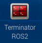
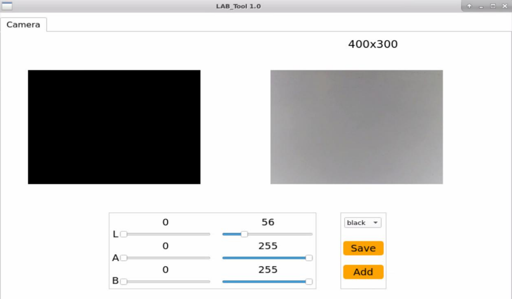
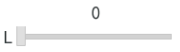
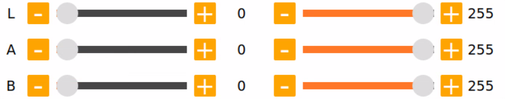
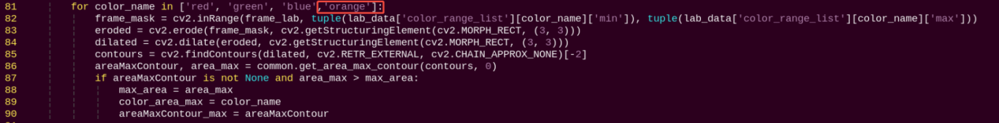
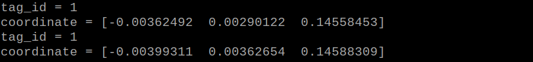
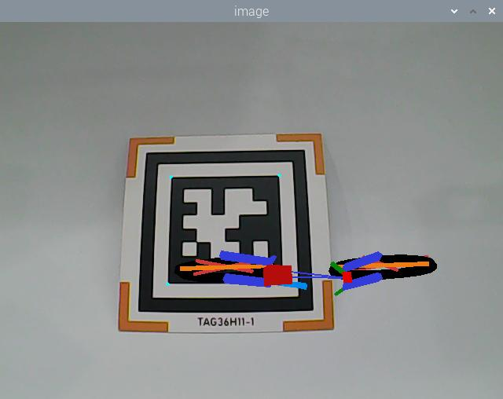
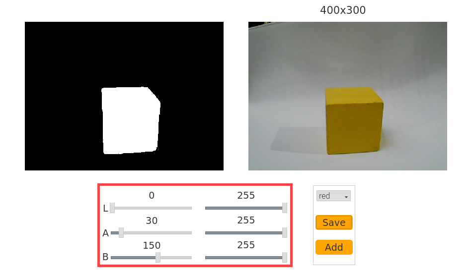
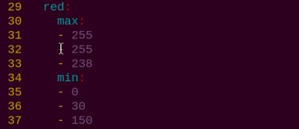
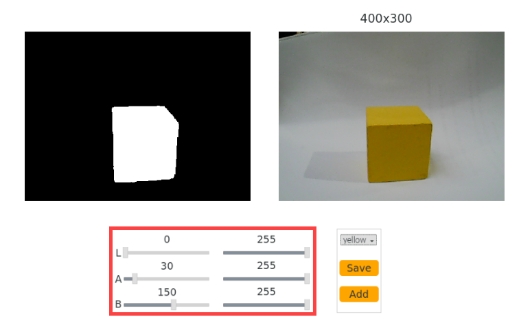

# 23. ROS2_AI Vision and Tracking Course

## 23.1 Color Threshold Adjustment

### 23.1.1 Brief Overview of the Functionality

As we know, different light sources can affect the color of objects, which may lead to variations in color recognition. If these variations impact the functionality, it is necessary to address them.

To solve this issue, this section will guide you through the use of the `LAB_Tool` in the ROS2 environment.

### 23.1.2 Open LAB_Tool

(1) Power on the robot, then follow the steps in  [3.3 Docker Container Introduction and Entry]() and [3.4 ROS Version Switch Tool Guide]() to connect via the VNC remote control software and switch to the ROS 2 environment.

(2) Click-on  to launch the camera node.

```
ros2 launch peripherals usb_cam.launch.py
```

(3) Execute the following command to navigate to the file lab_tool.

```
cd /home/ubuntu/software/lab_tool
```

(4) Then enter the following command to initiate the PC software.

```
python3 main.py
```

(5) The interface of LAB_Tool is as follow.



:::{Note}
If there is not camera returned image, it means that the camera is not connected. Please check the camera wiring.
:::

### 23.1.3 Interface Layout

The interface is divided into two parts, including image display zone and recognition adjustment zone.

| **Area Name** | **Description** |
|----|----|
| Display Area |  |
| Recognition Adjustment Area |  |

* **Display Area**

| **Icon** | **Function Description** |
|----|----|
|  | The left side shows the original image, while the right side shows the processed image. |

* **Recognition Adjustment Area**

In the Recognition Adjustment Area, users can modify color attributes. The functions of each component are listed below:

| **Icon** | **Function Description** |
|----|----|
|  | Adjusts the value of the L component in the image. (The A and B sliders function similarly, adjusting their respective components.) |
|  | Selects the target color to be adjusted. |
|  | Saves the current adjustment values. |
|  | Adds a new color type for recognition. |

### 23.1.4 Adjust Default Color

(1) Open the LAB TOOL, and select the color whose threshold needs to be adjusted from the color list in the recognition adjustment area. Here, we will use red as an example.


(2) Set the `min` values for the L, A, and B components to `0` and the `max` values to `255`.



(3) **Point the camera** at the object whose color you want to calibrate. In the **Recognition Adjustment Area**, use the **L**, **A**, and **B** sliders to fine-tune the threshold values. Adjust the sliders until the **target object appears white** in the **left side of the Display Area**, while all other areas appear black. This indicates successful isolation of the target color.


* **LAB Threshold Adjustment Reference**

| **Component** | **Value Range** | **Color Spectrum** |
|---------------|-----------------|--------------------------------------|
| L | 0~255 | Lightness: Black to White（-L ~ +L） |
| A | 0~255 | Green to Red (−A to +A) |
| B | 0~255 | Blue to Yellow（-b ~ +b） |

* **Understanding LAB Color Space**


When adjusting thresholds, shift the L, A, and B values toward the color range you want to recognize.

For example, to detect red, follow these steps:

① Initialize the range: Set all component ranges (L, A, B) from 0 to 255 by setting the minimum values to 0 and maximum values to 255.

② Focus on the A component: Red is located near the +A region in LAB space. To isolate red:
- Keep the **A_max** value unchanged.
- Gradually increase **A_min** until the target red object appears white in the Display Area, and the background turns black.

③ Fine-tune based on environment:
- If the red appears too light, increase **L_min**.
- If the red appears too dark, decrease **L_max**.
- If the red shifts toward a warm tone, increase **B_min**.
- If it shifts toward a cool tone, decrease **A_max**.


### 23.1.5 Add New Recognition Color

In addition to the three built-in recognizable colors, users can define additional colors for recognition. There are two available methods:

① **Manually modify the LAB values** of an existing default color to match the desired color.
② Use the **Add** button to create a new color entry from scratch.

To ensure ease of use and quick results, this lesson will focus on the first method.

**Follow the steps below to set up orange as a recognizable color:**

(1) Launch the LAB_Tool from the system desktop. After connecting the camera, navigate to the Recognition Adjustment Area and select **red** from the color selection dropdown.


(2) Point the camera at the orange object you want to detect. Adjust the L, A, and B sliders until the area containing the orange object appears white in the left panel of the Display Area, and all other regions appear black.


(3) Once the desired result is achieved, click the `Save` button in the Recognition Adjustment Area to store the modified LAB values.


## 23.2 Color Recognition

### 23.2.1 Program Overview

In this lesson, we will use OpenCV to recognize red, green, and blue objects, with the recognition results displayed in the feedback image.

Before beginning, make sure to prepare one object in each of the red, green, and blue colors.

### 23.2.2 Program Logic

First, capture the RGB image from the camera and apply resizing and Gaussian blur. Then, convert the image color space from RGB to Lab.

Next, use color thresholds to identify the color of the object within the circle. Afterward, apply a mask to the image (masking involves covering the image, shape, or object with a selected region to hide or reveal specific parts of the image).

Then, process the image using morphological operations, such as opening and closing, to refine the image. Finally, highlight the largest object by drawing a circle around it.

* **Opening operation**: This involves erosion followed by dilation. Its purpose is to remove small objects, smooth the shape boundaries, and not alter the area. It can remove small particle noise and separate objects that are connected.

* **Erosion**: Removes boundary points of objects, causing the boundaries to shrink inward. It can eliminate small objects smaller than the structuring element.

* **Dilation**: Expands boundary points, merging all background points touching the object into the object, causing the boundary to expand outward.

Finally, display the recognition results in the feedback image.

### 23.2.3 Operation Steps

:::{Note}
The input command should be case sensitive. And the key words can be complemented by **Tab** key.
:::

(1) Power on the robot, then follow the steps in  [3.3 Docker Container Introduction and Entry]() and [3.4 ROS Version Switch Tool Guide]() to connect via the VNC remote control software and switch to the ROS 2 environment.

(2) Click  or press **Ctrl+Alt+T** to open command line terminal.

```
~/.stop_ros.sh
```

(3) Execute the command below to run the program.

```
ros2 launch example color_detect_demo.launch.py
```

(4) To exit this mode, press **Ctrl+C** in the terminal. If the process does not close successfully on the first attempt, repeat the command until it terminates properly.

### 23.2.4 Program Outcome

:::{Note}
After starting the task, please ensure that there are no other objects with recognizable colors within the camera's field of view to avoid affecting the outcome of the task.
:::

After starting the task, place the target object within the camera's field of view. Once the target object is recognized, it will be highlighted with a circle of the corresponding color, and the color name will be displayed at the bottom left of the window. The program can recognize objects in **red**, **blue**, and **green** colors.


### 23.2.5 Program Analysis

[Source Code]()

The source code of this program is located in: [/home/ubuntu/ros2_ws/src/example/example/opencv_course/color_detect_demo.py]()

* **Basic Configuration**

(1) Read the color threshold settings file

Use the **get_yaml_data** function to obtain the color threshold configuration file.

{lineno-start=19}
```python
lab_data = common.get_yaml_data("/home/ubuntu/software/lab_tool/lab_config.yaml")
```
* **Get the image feed**

Create a subscription to the camera feed by using the following code: `node.create_subscription(Image, 'image_raw', image_callback, 1)` This subscribes to the camera feed and retrieves the real-time video stream.

{lineno-start=39}
```python
    def image_callback(self, ros_image):
        try:
            cv_image = bridge.imgmsg_to_cv2(ros_image, "bgr8")
            if self.image_queue.full():
                # 丢弃队列中最旧的一帧，保持队列大小
                try:
                    _ = self.image_queue.get_nowait()
                except queue.Empty:
                    pass
            self.image_queue.put(cv_image)
        except Exception as e:
            self.get_logger().error(f"转换图像失败: {e}")
```
* **Image Processing**

The `color_detect()` function is mainly invoked to process the image.

{lineno-start=67}
```python
    def color_detect(self, img):
        global detect_color, draw_color, color_list

        img_copy = img.copy()
        img_h, img_w = img.shape[:2]
        frame_resize = cv2.resize(img_copy, size, interpolation=cv2.INTER_NEAREST)
        frame_gb = cv2.GaussianBlur(frame_resize, (3, 3), 3)
        frame_lab = cv2.cvtColor(frame_gb, cv2.COLOR_BGR2LAB)

        max_area = 0
        color_area_max = None
        areaMaxContour_max = 0

        for color_name in ['red', 'green', 'blue']:
            frame_mask = cv2.inRange(frame_lab, tuple(lab_data['color_range_list'][color_name]['min']), tuple(lab_data['color_range_list'][color_name]['max']))
            eroded = cv2.erode(frame_mask, cv2.getStructuringElement(cv2.MORPH_RECT, (3, 3)))
            dilated = cv2.dilate(eroded, cv2.getStructuringElement(cv2.MORPH_RECT, (3, 3)))
            contours = cv2.findContours(dilated, cv2.RETR_EXTERNAL, cv2.CHAIN_APPROX_NONE)[-2]
            areaMaxContour, area_max = common.get_area_max_contour(contours, 0)
            if areaMaxContour is not None and area_max > max_area:
                max_area = area_max
                color_area_max = color_name
                areaMaxContour_max = areaMaxContour

        if max_area > 200:
            ((centerX, centerY), radius) = cv2.minEnclosingCircle(areaMaxContour_max)
            centerX = int(common.val_map(centerX, 0, size[0], 0, img_w))
            centerY = int(common.val_map(centerY, 0, size[1], 0, img_h))
            radius = int(common.val_map(radius, 0, size[0], 0, img_w))
            cv2.circle(img, (centerX, centerY), radius, range_rgb[color_area_max], 2)

            color_value = {'red': 1, 'green': 2, 'blue': 3}.get(color_area_max, 0)
            color_list.append(color_value)

            if len(color_list) == 3:
                color_avg = int(round(np.mean(np.array(color_list))))
                color_list.clear()
                if color_avg == 1:
                    detect_color = 'red'
                    draw_color = range_rgb['red']
                elif color_avg == 2:
                    detect_color = 'green'
                    draw_color = range_rgb['green']
                elif color_avg == 3:
                    detect_color = 'blue'
                    draw_color = range_rgb['blue']
                else:
                    detect_color = 'None'
                    draw_color = range_rgb['black']
        else:
            detect_color = 'None'
            draw_color = range_rgb['black']

        cv2.putText(img, "Color: " + detect_color, (10, img.shape[0] - 10),
                    cv2.FONT_HERSHEY_SIMPLEX, 0.65, draw_color, 2)
        return img
```
* **Gaussian filtering**

Apply Gaussian blur to the image using the `GaussianBlur()` function from the cv2 library to remove noise from the image.

{lineno-start=73}
```python
        frame_gb = cv2.GaussianBlur(frame_resize, (3, 3), 3)
```
The first parameter `frame_resize` is the input image

The second parameter `(3, 3)` is the size of Gaussian kernel

The third parameter `3` is the allowable variance around the average in Gaussian filtering. The larger the value, the larger the allowable variance

* **Color Space Conversion**

Convert the image from the BGR color space to the LAB color space.

{lineno-start=74}
```python
        frame_lab = cv2.cvtColor(frame_gb, cv2.COLOR_BGR2LAB)
```
* **Color Detection and Morphological Operations**

Perform erosion and dilation on the image to smooth the edges of contours, making it easier to identify the target contours in subsequent steps.

{lineno-start=82}
```python
            eroded = cv2.erode(frame_mask, cv2.getStructuringElement(cv2.MORPH_RECT, (3, 3)))
            dilated = cv2.dilate(eroded, cv2.getStructuringElement(cv2.MORPH_RECT, (3, 3)))
```
- `frame_mask`: The input binary image mask.
- `cv2.getStructuringElement(cv2.MORPH_RECT, (3, 3))`: Generates a 3x3 rectangular structuring element (kernel). This matrix defines the shape and size of the erosion operation. `cv2.MORPH_RECT` specifies a rectangular shape.
- `eroded`: The binary image mask after the erosion operation.
- `cv2.getStructuringElement(cv2.MORPH_RECT, (3, 3))`: Uses the same structuring element as in the erosion step for the dilation operation.

* **Acquire the Maximum Area Contour**

Use the `findContours()` function from the cv2 library to identify the largest contour of the target color in the image.

{lineno-start=86}
```python
            if areaMaxContour is not None and area_max > max_area:
                max_area = area_max
                color_area_max = color_name
                areaMaxContour_max = areaMaxContour
```


① Initialization: `contour_area_temp` and `contour_area_max` are used to store the area of the current contour and the maximum contour, respectively. `area_max_contour` is used to store the contour with the maximum area.

② Iterate through contours: Loop through each contour c in the contours list.

③ Calculate area: Use `cv2.contourArea(c)` to calculate the area of contour c.

④ Determine the maximum area: If the area of the current contour is greater than the known maximum area and exceeds the threshold of 50, update the maximum area and the corresponding contour.

⑤ Return values: The function returns the contour with the largest area, `area_max_contour`, and its corresponding maximum area, `contour_area_max`.

* **Feedback information**

(1) Highlight the Target Object

Use the `drawContours` function to outline the target object in the returned image.

{lineno-start=120}
```python
        cv2.putText(img, "Color: " + detect_color, (10, img.shape[0] - 10),
                    cv2.FONT_HERSHEY_SIMPLEX, 0.65, draw_color, 2)
```


Explanation of the function parameters:

① `img`: The target image where the text will be drawn.
② `"Color: " + detect_color`: The text string to be displayed, showing the detected color.
③ `(10, img.shape[0] - 10)`: The starting position of the text in pixels, representing the bottom-left corner of the text.
④ `10`: The x-coordinate of the text, starting 10 pixels from the left edge.
⑤ `img.shape[0] - 10`: The y-coordinate, positioned 10 pixels above the bottom of the image.
⑥ `cv2.FONT_HERSHEY_SIMPLEX`: The font type used for the text.
⑦ `0.65`: The font size of the text.
⑧ `draw_color`: The color of the text, specified as a BGR tuple. For example, `(255, 0, 0)` represents blue.
⑨ Line thickness: Specifies the thickness of the text outline in pixels.

### 23.2.6 Feature Extension

Besides the three built-in recognizable colors, you can add additional custom colors. For example, to add **orange** as a new recognizable color, follow these steps:

(1) Follow the instructions in the course [9.6 AI Vision and Tracking Course > 9.6.1 Color Threshold Adjustment]() to add orange as a recognizable color and save the configuration.


(2) Open a terminal and run:

```
vim /home/ubuntu/software/lab_tool/lab_config.yaml
```

(3) In the opened file, find the LAB values for the orange color you just added.


(4) Navigate to the program directory by running the following command:

```
cd /home/ubuntu/ros2_ws/src/example/example/opencv_course
```

(5) Edit the program script using the Vim editor:

```
vim color_detect_demo.py
```

In this file, add the BGR values used for the display text color in the video feed.


:::{Note}
The BGR values specify the color of the on-screen text labels and **do not affect** the color recognition process. You can look up appropriate BGR values online.
Example: (0, 136, 132) is the BGR value for orange.
:::

Insert the orange LAB values into the relevant section of the color recognition code.




Save your changes and restart the program. Place the orange object in front of the camera to verify that it is correctly recognized and displayed.


## 23.3 Tag Recognition

### 23.3.1 Program Logic

Firstly, program to recognize tag, which involves image graying, positioning and other operations.

Lastly, encode and decode the tag, and display the recognition result on the camera returned image and terminal interface.

### 23.3.2 Operation Steps

:::{Note}
The input command should be case sensitive. And the key words can be complemented by **Tab** key.
:::

(1) Power on the robot, then follow the steps in  [3.3 Docker Container Introduction and Entry]() and [3.4 ROS Version Switch Tool Guide]() to connect via the VNC remote control software and switch to the ROS 2 environment.

(2) Click-on  or input the following command to terminate the app auto-start service.

```
~/.stop_ros.sh
```

(3) Input the following command and press Enter to start the game.

```
ros2 launch example apriltag_detect_demo.launch.py
```

(4) To exit this mode, press **Ctrl+C** in the terminal. If the process does not close successfully on the first attempt, repeat the command until it terminates properly.

### 23.3.3 Program Outcome

After the game starts, place the tag card within the camera frame. When recognizing the tag, Tag ID will be printed on the camera returned image. And tag ID and coordinate will also be printed on the terminal.




### 23.3.4 Program Parameter Description

[Source Code]()

The source code of this program is stored in the Docker container:

[/home/ubuntu/ros2_ws/src/example/example/opencv_course/apriltag_detect_demo.py]()

* **Tag Detection**

* **Image Graying**

Call **cvtColor()** function in cv2 library to convert the collected colored image into grayscale image and collect the tag information.

{lineno-start=39}
```python
        gray = cv2.cvtColor(img, cv2.COLOR_RGB2GRAY)
        detections = self.detector.detect(gray, return_image=False)
```
* **Extract Tag Information**

After collecting the tag information, extract the useful information.

{lineno-start=42}
```python
        if len(detections) != 0:
            for detection in detections:
                M, e0, e1 = self.detector.detection_pose(
                    detection,
                    [self.camera_intrinsic.item(0,0), self.camera_intrinsic.item(1,1),
                     self.camera_intrinsic.item(0,2), self.camera_intrinsic.item(1,2)],
                    0.033
                )                
                P = M[:3,:4]
                self.coordinate = np.matmul(P, np.array([[0],[0],[0],[1]])).flatten()
                
                # ROS2 print for coordinate
                self.get_logger().info(f'坐标 = {self.coordinate}')
                
                corners = np.rint(detection.corners)
                cv2.drawContours(img, [np.array(corners, int)], -1, (0, 255, 255), 5, cv2.LINE_AA)
                tag_family = str(detection.tag_family, encoding='utf-8')
                
                self.times = 0
                if tag_family == 'tag36h11':
                    self.tag_id = str(detection.tag_id)
                    # ROS2 print for tag ID
                    self.get_logger().info(f'标签ID = {self.tag_id}')
                    return self.tag_id
                else:
                    return None
```
`coordinate` represents the tag coordinate, `tag_family` refers to the type of tag, and `tag_id` indicates tag ID.

* **Feedback Information**

(1) After recognition, call `get_logger().info` function to print the tag coordinate and ID on the terminal.

{lineno-start=54}
```python
                self.get_logger().info(f'坐标 = {self.coordinate}')
```
{lineno-start=61}

```python
                    self.get_logger().info(f'标签ID = {self.tag_id}')
```

(2) Then, call `putText()` function in cv2 library to print tag ID on the camera returned image.

{lineno-start=80}
```python
            cv2.putText(img, self.tag_id, (10, img.shape[0] - 20), 
                       cv2.FONT_HERSHEY_SIMPLEX, 2, (0, 255, 255), 1)
```
The meaning of the parameters in bracket is as follow.

① The first parameter `img` is the input image.
② The second parameter `tag_id` is the added text, referring to tag ID.
③ The third parameter `(10, img.shape[0] - 20)` is the coordinate of upper left corner of the added text.
④ The fourth parameter `cv2.FONT_HERSHEY_SIMPLEX` is the font type.
⑤ The fifth parameter `2` is the font size.
⑥ The sixth parameter `(0, 255, 255)` is the color of the font, and the values respectively corresponds to B, G, R. The color here is yellow.
⑦ The seventh parameter `3` is the font weight.

## 23.4 AR Vision

### 23.4.1 Program Logic

Firstly, program to recognize tag, which involves image graying, positioning and other operations.

Next, encode and decode the tag to acquire information of the tag.

Lastly, through model projection, polygon fill and other operations, draw 3D image on the designated area of camera returned image, and print Tag information on the camera returned image and terminal interface.

### 23.4.2 Operation Steps

:::{Note}
The input command should be case sensitive. And the key words can be complemented by **Tab** key.
:::

(1) Power on the robot, then follow the steps in  [3.3 Docker Container Introduction and Entry]() and [3.4 ROS Version Switch Tool Guide]() to connect via the VNC remote control software and switch to the ROS 2 environment.

(2) Click  or enter the command-line terminal to terminate the ros node.

```
~/.ros_stop.sh
```

(3) Execute the following command to start the game:

```
ros2 launch example apriltag_ar_demo.launch.py model:=2
```

(4) To exit this mode, press **Ctrl+C** in the terminal. If the termination fails, try pressing **Ctrl+C** repeatedly.

### 23.4.3 Program Outcome

After the game starts, place the tag card within the camera frame. When the tag is recognized, four corners of the tag will be marked by blue dots, and the 3D image will be displayed on the tag. Besides, the tag ID and coordinate will be printed on the terminal.




### 23.4.4 Program Parameter Description

[Source Code]()

The source code of this program is stored in the Docker container:

[/home/ubuntu/ros2_ws/src/example/example/opencv_course/apriltag_ar_demo.py]()

* **Tag Detection**

(1) Image Graying

Call **cvtColor()** function in cv2 library to convert the collected colored image into grayscale image and collect the tag information.

{lineno-start=172}
```python
            gray = cv2.cvtColor(rgb_image, cv2.COLOR_RGB2GRAY)
            detections = self.tag_detector.detect(gray)
```
* **Extract Tag Information**

After collecting the tag information, extract the useful information.

{lineno-start=184}
```python
                    tag_id = detection.tag_id
                    tag_center = detection.center
                    tag_corners = detection.corners

                    self.get_logger().info(f"Detected tag ID: {tag_id}")
```
`coordinate` represents the tag coordinate, `tag_family` refers to the type of tag, and `tag_id` indicates tag ID.

* **3D Image Rendering**

(1) elative Pose Calculation

To render a 3D image at a specific position in the returned view, the pose of the camera relative to the world coordinate system must first be calculated. This involves determining the rotation vector and translation vector for transforming from the world coordinate system to the camera coordinate system using the `cv2.solvePnP()` function.

{lineno-start=200}
```python
                    ret, rvecs, tvecs = cv2.solvePnP(objp, corners, self.camera_intrinsic, self.dist_coeffs)
```
The parameters in parentheses have the following meanings:

① `OBJP`: The camera's intrinsic matrix.
② `corners`: The camera's distortion parameters.
③ `self.camera_intrinsic`: The 3D coordinates in the world coordinate system (in millimeters).
④ `self.dist_coeffs`: The 2D coordinates in the camera coordinate system (in pixels).

* **Model Projection**

After obtaining the camera's pose relative to the world coordinate system, you can use the `cv2.projectPoints()` function to convert the 3D coordinates of feature points in the world coordinate system into 2D coordinates in the pixel coordinate system.

{lineno-start=202}
```python
                        imgpts, jac = cv2.projectPoints(axis, rvecs, tvecs, self.camera_intrinsic, self.dist_coeffs)
```
* **Image Rendering**

By default, the program renders a 3D model of a bicycle.

{lineno-start=218}
```python
    parser.add_argument('--model', type=str, default='bicycle', help='Model to use (e.g., 1 for bicycle, 2 for fox, etc.)')
```
Apart from the `bicycle` model, several other 3D models are available. These include `cow`, `fox`, `rat`, `wolf`, `pirate-ship-fat` (a pirate ship), and `rectangle` (a cube). All model files are stored in the directory shown below.

(1) To color the rectangle, use functions like `cv2.drawContours()` and `cv2.line()`.

{lineno-start=201}
```python
                    if self.target_model == 'rectangle':
                        imgpts, jac = cv2.projectPoints(axis, rvecs, tvecs, self.camera_intrinsic, self.dist_coeffs)
                        result_image = draw(result_image, corners, imgpts)
```
{lineno-start=49}
```python
def draw(img, corners, imgpts):
    imgpts = np.int32(imgpts).reshape(-1,2)
    cv2.drawContours(img, [imgpts[:4]],-1,(0, 255, 0),-3)
    for i,j in zip(range(4),range(4,8)):
        cv2.line(img, tuple(imgpts[i]), tuple(imgpts[j]),(255),3)
    cv2.drawContours(img, [imgpts[4:]],-1,(0, 0, 255),3)
    return img
```
(2) For other models, you can use the `cv2.fillConvexPoly()` function to fill polygons with color.

{lineno-start=207}
```python
                            imgpts = dst.astype(int)
                            if self.target_model == 'cow':
                                cv2.fillConvexPoly(result_image, imgpts, (0, 255, 255))
                            elif self.target_model == 'wolf':
                                cv2.fillConvexPoly(result_image, imgpts, (255, 255, 0))
                            else:
                                cv2.fillConvexPoly(result_image, imgpts, color)
        return result_image
```
For example, in the code snippet `cv2.fillConvexPoly(result_image, imgpts, (255, 255, 0))`, the parameters mean:

① `result_image`: The input image.
② `imgpts`: The vertices of the polygon.
③ `(255, 255, 0)`: The fill color in RGB format, which in this case is yellow.

* **Feedback Information**

(1) Image Display

To display the rendered image in the returned view, use the `cv2.imshow()` function.

{lineno-start=167}
```python
        cv2.imshow('image', cv2.cvtColor(result_image, cv2.COLOR_RGB2BGR))
        cv2.waitKey(1)
```
The parameters in parentheses mean:

① `'image'`: The name of the display window (a string).
② `frame_result`: The input image.

### 23.4.5 Change Default Displayed Image

The program is default to display 3D bicycle. And other 3D models are available, including cow, fox, rat, wolf, pirate-ship-fat and rectangle.

For example, we can modify the program to display 3D cow. We need to take 6 steps to realize this.

(1) Run the command to restart the program and verify the updated feature in action.

```
ros2 launch example apriltag_ar_demo.launch.py model:=2
```

(2) When Tag ID 1 is detected, the fox model will be displayed.

## 23.5 Colored Block Positioning

### 23.5.1 Program Logic

Firstly, program to recognize color. Use Lab color space to convert the image from RGB into Lab.

Then, perform binaryzation, corrosion, dilation, etc., on the image to obtain the maximum contour which contains the target color.

Lastly, display the recognition result on the camera returned image and terminal interface.

### 23.5.2 Operation Steps

:::{Note}
The input command should be case sensitive. And the key words can be complemented by **Tab** key.
:::

(1) Power on the robot, then follow the steps in  [3.3 Docker Container Introduction and Entry]() and [3.4 ROS Version Switch Tool Guide]() to connect via the VNC remote control software and switch to the ROS 2 environment.

(2) Open a command-line terminal  or execute the following command to terminate the ros node.

```
~/.stop_ros.sh
```

(3) Input the following command below to start the game.

```
ros2 launch example color_tracking_demo.launch.py model:=0
```

(4) To exit the application, press **Ctrl+C** in the terminal. If the process does not close successfully, try pressing **Ctrl+C** repeatedly.

### 23.5.3 Program Outcome

After the game starts, place the red block within the camera frame. When the colored block is recognized, the block will be marked with red circle and its coordinate will be printed on the terminal.


### 23.5.4 Program Parameter

[Source Code]()

The source code of this program lies in the Docker container:

[/home/ubuntu//ros2_ws/src/example/example/opencv_course/color_tracking_demo.py]()

* **Image Processing**

(1) Binaryzation Processing

Adopt `inRange()` function in cv2 library to perform binaryzation on the image.

{lineno-start=195}
```python
	            frame_mask = cv2.inRange(frame_lab, tuple(target_color_range['min']), tuple(target_color_range['max']))
```
The first parameter in the bracket is the input image. The second and the third parameters respectively are the lower limit and upper limit of the threshold. When the RGB value of the pixel is between the upper limit and lower limit, the pixel is assigned 1, otherwise, 0.

* **Corrosion and Dilation**

To reduce the interference and make the image smoother, it is necessary to perform corrosion and dilation on the image.

{lineno-start=196}
```python
	            eroded = cv2.erode(frame_mask, cv2.getStructuringElement(cv2.MORPH_RECT, (3, 3)))
            dilated = cv2.dilate(eroded, cv2.getStructuringElement(cv2.MORPH_RECT, (3, 3)))
```
`erode()` function is used for corrosion. Take `eroded = cv2.erode(frame_mask, cv2.getStructuringElement(cv2.MORPH_RECT, (3, 3)))` for example. The meaning of the parameters in bracket are as follow.

① The first parameter `frame_mask` is the input image.
② The second parameter `cv2.getStructuringElement(cv2.MORPH_RECT, (3, 3))` is the structural element and kernel deciding the nature of the operation. And the first parameter in the parenthesis is the kernel shape and the second parameter is the kernel dimension.
③ `dilate()` function is used for image dilation. And the meaning of the parameters in parenthesis is the same as that of `erode()` function.

* **Acquire the Maximum Contour**

After processing the image, acquire the contour of the target to be recognized, which involves `findContours()` function in cv2 library.

{lineno-start=198}
```python
	            contours = cv2.findContours(dilated, cv2.RETR_EXTERNAL, cv2.CHAIN_APPROX_NONE)[-2]
```


The first parameter in parentheses is the input image; the second parameter is the retrieval mode of the contour; the third parameter is the approximation method of the contour.

* **Feedback Information**

(1) Coordinate Feedback

Call **get_logger().info** function to print the coordinate of the colored block on the camera returned image.

{lineno-start=213}
```python
            self.get_logger().info(f"Center: x={int(center_x)}, y={int(center_y)}")
```
* **Returned Image Indicator**

Use `circle()` function in cv2 library to circle the colored block in corresponding color

{lineno-start=214}
```python
	            cv2.circle(img, (int(center_x), int(center_y)), int(radius), (0, 0, 255), 2)
```


The meaning of the parameters in the bracket is as follow.

① The first parameter `img` is the input image
② The second parameter `(int(center_x), int(center_y))` is the center coordinate
③ The third parameter `int(radius)` is the radius of the circle
④ The fourth parameter `range_rgb[__target_color]` is the color of the circle
⑤ The fifth parameter `2` is thickness of the circle.

### 23.5.5 Function Extension

* **Modify Default Recognition Color**

There are three built-in colors, including red, green and blue. The default recognized color is red.

**Take modifying the default recognition color as green for example.** The specific operation steps are as follow.

(1) Open a new command-line terminal , and run the following command to switch to the program containing the programs.

```
cd ~/ros2_ws/src/example/example/opencv_course
```

(2) Input command and press Enter to open program file.

```
vim color_tracking_demo.py
```

(3) Then, jump to this line of code.


:::{Note}
we can input the line number and press `Shift+G` to jump to the corresponding line.
:::

(4) Press **"i"** to enter the editing mode. Modify the code as `self.set_target('green')`.


(5) After modification, Press `Esc` and input `:wq` and then press Enter to save the file and exit the editor.

```
:wq
```

(6) Enter the following command and press Enter to restart the application and view the updated behavior.

```
ros2 launch example color_tracking_demo.launch.py model:=0
```

* **Add New Recognition Color**

In addition to the built-in recognized colors, you can add other recognition colors in the program. Take adding yellow as example.

(1) Click  to open command line terminal.

(2) Enter the following command and press Enter to navigate to the directory where the Lab color settings file is located.

```
cd software/lab_tool/
```

(3) Open the Lab color configuration file and record the initial data by taking a screenshot or backing up the file.

```
vim lab_config.yaml
```


(4) Double-click the debugging tool icon  on the desktop to open the color threshold adjustment tool. If a prompt appears, click `Execute` to proceed.


(5) Once connected successfully, select **red** in the color options bar at the bottom right of the interface.


(6) Place a yellow object within the camera's field of view and adjust the LAB slider. Ensure that the yellow area in the right-side screen is displayed as white on the left-side screen, while other areas are displayed as black.



(7) After adjusting, click the `Save` button to save the data and close the color threshold adjustment tool.


(8) To verify that the modified data has been successfully saved, enter the following command and press Enter to open the Lab color configuration file:

```
cd software/lab_tool/ && vim lab_config.yaml
```



:::{Note}
After learning how to modify Lab parameters, it is recommended to use the LAB_Tool to restore the values to their default settings to avoid affecting the functionality.
:::

(9) Refer to [23.5.5 Modify Default Recognition Color/Modify Default Recognition Color]() to reset the default recognition color to red.

(10) Enter the following command to restart the color block coordinate tracking process. Place a yellow block within the camera's field of view, and the system will mark it with a circle on the returned image. The terminal will also display the coordinates of the color block:

```
ros2 launch example color_tracking_demo.launch.py model:=0
```

## 23.6 Color Tracking

### 23.6.1 Program Logic

Firstly, program to recognize color. Use Lab color space to convert the image from RGB into Lab.

Then, perform binaryzation, corrosion, dilation, etc., on the image to obtain the maximum contour which contains the target color.

Next, acquire X-axis and Y-axis coordinates of the center of target contour. And adjust PuppyPi's pitch angle and roll angle according to the coordinate.

Lastly, obtain the rotation angle of the servo through inverse kinematics calculation, and program the servo to rotate to the designated angle.

### 23.6.2 Operation Steps

:::{Note}
The input command should be case sensitive. And the key words can be complemented by **Tab** key.
:::

(1) Power on the robot, then follow the steps in  [3.3 Docker Container Introduction and Entry]() and [3.4 ROS Version Switch Tool Guide]() to connect via the VNC remote control software and switch to the ROS 2 environment.

(2) Click  and enter the following command to terminate the app auto-start service.

```
~/.stop_ros.sh
```

(3) Input command the following command to start the game.

```
ros2 launch example color_tracking_demo.launch.py model:=1
```

(4) To stop the program, press **Ctrl+C** in the terminal. If it does not close successfully, please try again.

### 23.6.3 Program Outcome

After the game starts, place the red block within the camera frame. When recognizing the object, PuppyPi will adjust its posture according to the position of the object. Besides, the block will be marked with red circle on the camera returned image and its coordinate will be printed on the terminal.


### 23.6.4 Program Parameter

[Source Code]()

The source code of this program lies in [/home/ubuntu//ros2_ws/src/example/example/opencv_course/color_tracking_demo.py]()

* **Image Processing**

(1) Binaryzation Processing

Adopt `inRange()` function in cv2 library to perform binaryzation on the image.

{lineno-start=195}

```python
	            frame_mask = cv2.inRange(frame_lab, tuple(target_color_range['min']), tuple(target_color_range['max']))
```

The first parameter in the bracket is the input image. The second and the third parameters respectively are the lower limit and upper limit of the threshold. When the RGB value of the pixel is between the upper limit and lower limit, the pixel is assigned 1, otherwise, 0.

* **Corrosion and Dilation**

To reduce the interference and make the image smoother, it is necessary to perform corrosion and dilation on the image.

{lineno-start=196}

```python
	            eroded = cv2.erode(frame_mask, cv2.getStructuringElement(cv2.MORPH_RECT, (3, 3)))
            dilated = cv2.dilate(eroded, cv2.getStructuringElement(cv2.MORPH_RECT, (3, 3)))
```

`erode()` function is used for corrosion. Take `eroded = cv2.erode(frame_mask, cv2.getStructuringElement(cv2.MORPH_RECT, (3, 3)))` for example. The meaning of the parameters in bracket are as follow.

① The first parameter `frame_mask` is the input image.
② The second parameter `cv2.getStructuringElement(cv2.MORPH_RECT, (3, 3))` is the structural element and kernel deciding the nature of the operation. And the first parameter in the parenthesis is the kernel shape and the second parameter is the kernel dimension.
③ `dilate()` function is used for image dilation. And the meaning of the parameters in parenthesis is the same as that of `erode()` function.

* **Acquire the Maximum Contour**

After processing the image, acquire the contour of the target to be recognized, which involves `findContours()` function in cv2 library.

{lineno-start=198}

```python
	            contours = cv2.findContours(dilated, cv2.RETR_EXTERNAL, cv2.CHAIN_APPROX_NONE)[-2]
```


The first parameter in parentheses is the input image; the second parameter is the retrieval mode of the contour; the third parameter is the approximation method of the contour.

* **Feedback Information**

(1) Coordinate Feedback

Call **get_logger().info** function to print the coordinate of the colored block on the camera returned image.

{lineno-start=213}

```python
            self.get_logger().info(f"Center: x={int(center_x)}, y={int(center_y)}")
```

* **Returned Image Indicator**

Use `circle()` function in cv2 library to circle the colored block in corresponding color

{lineno-start=214}

```python
	            cv2.circle(img, (int(center_x), int(center_y)), int(radius), (0, 0, 255), 2)
```


The meaning of the parameters in the bracket is as follow.

① The first parameter `img` is the input image
② The second parameter `(int(center_x), int(center_y))` is the center coordinate
③ The third parameter `int(radius)` is the radius of the circle
④ The fourth parameter `range_rgb[__target_color]` is the color of the circle
⑤ The fifth parameter `2` is thickness of the circle.

* **Action Feedback**

(1) Set Specific Point

Set the center of the camera returned image as the specific point. Then based on the position relation between the center of the target object and the specific point, determine PuppyPi to execute which action.

{lineno-start=221}
```python
	                self.x_pid.SetPoint = img_w / 2.0
```
* **Adjust Roll Angle**

Adjust PuppyPi's Roll angle according to whether the target center is at left or right of the camera returned image center.

{lineno-start=222}
```python
	                if abs(self.x_pid.SetPoint - center_x) > 230:
                    self.x_pid.Kp = 0.004
                self.x_pid.update(center_x)
                self.x_dis = self.x_pid.output
                self.x_dis = np.radians(30) if self.x_dis > np.radians(30) else self.x_dis
                self.x_dis = np.radians(-30) if self.x_dis < np.radians(-30) else self.x_dis
```
* **Adjust Pitch Angle**

Adjust PuppyPi's Pitch angle according to whether the target center is below or above the camera returned image center.

{lineno-start=235}
```python
	                    self.z_pid.Kp = 0.002
                self.z_pid.update(center_y)
                self.z_dis = self.z_pid.output
                self.z_dis = np.radians(30) if self.z_dis > np.radians(30) else self.z_dis
                self.z_dis = np.radians(-20) if self.z_dis < np.radians(-20) else self.z_dis
```
### 23.6.5 Function Extension

* **Modify Default Recognition Color**

There are three built-in colors, including red, green and blue. The default recognized color is red.

Take modifying the default recognition color as green for example. The specific operation steps are as follow.

(1) Open a terminal  and enter the following command. Press Enter to change to the directory where the program is located.

```
cd ~/ros2_ws/src/example/example/opencv_course
```

(2) Input command and press Enter to open game program file.

```
vim color_tracking_demo.py
```

(3) Then, locate the following code.


:::{Note}
we can input the line number and press `Shift+G` to jump to the corresponding line.
:::

(4) Press **"i"** to enter the editing mode. Modify the code as `self.set_target('green')`.


(5) After modification, Press `Esc` and input `:wq` and then press Enter to save the file and exit the editor.

```
:wq
```

(6) Input the following command to restart the game. Then PuppyPi will recognize green.

```
ros2 launch example color_tracking_demo.launch.py model:=1
```

* **Add New Recognition Color**

In addition to the built-in recognized colors, you can add other recognition colors in the program. Take adding yellow as example.

(1) Double click the  in the system desktop to open color threshold adjustment tool. If the prompt box pops up, just click `Execute`.


(2) Next, click `Add` button.


(3) Then enter `yellow` in the pop-up interface.


(4) Select `yellow` in the drop-down menu.


(5) Place the yellow object within the camera frame. Then Drag the sliders of L, A, and B until the yellow block at the left screen becomes white and other areas become black.



(6) After adjustment, click `Save` to keep the data. Then we can close the tool.


(7) Check whether the modified data was successfully written in. Input the command below and press Enter to open Lab color setting file.

```
cd software/lab_tool/ && vim lab_config.yaml
```


(8) According to the steps in [23.6.5 Modify Default Recognition Color/Modify Default Recognition Color](), modify the default recognition color as yellow.

(9) Input the command below and press Enter to restart the game. The PuppyPi will recognize yellow.

```
ros2 launch example color_tracking_demo.launch.py model:=1
```

## 23.7 Tag Positioning

### 23.7.1 Program Logic

Firstly, program to recognize tag, which involves image graying, positioning and other operations.

Lastly, encode and decode the tag, and display the recognition result on the camera returned image and terminal interface.

### 23.7.2 Operation Steps

:::{Note}
The input command should be case sensitive. And the key words can be complemented by **Tab** key.
:::

(1) Power on the robot, then follow the steps in  [3.3 Docker Container Introduction and Entry]() and [3.4 ROS Version Switch Tool Guide]() to connect via the VNC remote control software and switch to the ROS 2 environment.

(2) Click  or execute the following command to terminate the app auto-start service.

```
~/.ros_stop.sh
```

(3) Execute the following command to start the game.

```
ros2 launch example apriltag_tracking_demo.launch.py model:=0
```

(4) To close this functionality, press **Ctrl+C** in the terminal. If it fails to close, please try again.

### 23.7.3 Program Outcome

After the game starts, place the tag card within the camera field of view. When recognizing the tag, Tag ID will be printed on the camera returned image.


### 23.7.4 Program Analysis

[Source Code]()

The source code of this program is stored in [/home/ubuntu/ros2_ws/src/example/example/opencv_course/apriltag_tracking_demo.py]()

* **Tag Detection**

(1) Image Graying

Call **cvtColor()** function in cv2 library to convert the collected colored image into grayscale image and collect the tag information.

{lineno-start=150}
```python
	        gray = cv2.cvtColor(img, cv2.COLOR_BGR2GRAY)
            detections = self.detector.detect(gray, return_image=False)
```
* **Extract Tag Information**

After collecting the tag information, extract the useful information.

{lineno-start=152}
```python
	        if len(detections) != 0:
                for detection in detections:
                    M, e0, e1 = self.detector.detection_pose(detection, [
                        self.camera_intrinsic.item(0, 0), self.camera_intrinsic.item(1, 1),
                        self.camera_intrinsic.item(0, 2), self.camera_intrinsic.item(1, 2)
                    ], 0.033)
                    P = M[:3, :4]
                    self.coordinate = np.matmul(P, np.array([[0], [0], [0], [1]])).flatten()
```
{lineno-start=161}
```python
	                tag_family = str(detection.tag_family, encoding='utf-8')
```
{lineno-start=163}
```python
	                if tag_family == 'tag36h11':
                        tag_id = str(detection.tag_id)
                        self.get_logger().info(f"检测到标签 ID: {tag_id}")
                        return tag_id
```
`coordinate` represents the tag coordinate, `tag_family` refers to the type of tag, and `tag_id` indicates tag ID.

* **Feedback Information**

Call `putText()` function in cv2 library to print the tag ID on the camera returned image.

{lineno-start=143}
```python
	    cv2.putText(img, str(self.tag_id) if self.tag_id else "无标签", (10, img.shape[0] - 20),
                    cv2.FONT_HERSHEY_SIMPLEX, 1, (0, 255, 255), 2)
        return img

```


The meaning of the parameters in bracket is as follow.

① The first parameter `img` is the input image.
② The second parameter `tag_id` is the added text, referring to tag ID.
③ The third parameter `(10, img.shape[0] - 20)` is the coordinate of upper left corner of the added text.
④ The fourth parameter `cv2.FONT_HERSHEY_SIMPLEX` is the font type.
⑤ The fifth parameter `2` is the font size.
⑥ The sixth parameter `(0, 255, 255)` is the color of the font, and the values respectively corresponds to B, G, R. The color here is yellow.
⑦ The seventh parameter `3` is the font weight.

## 23.8 Tag Tracking

### 23.8.1 Program Logic

AprilTag is a visual positioning marker, which is similar to QR code or bar code. It can facilitate the tag detection and relative position calculation. It's mainly applied to AR, robot and camera calibration, etc.

The process of tag tracking is as follow.

Firstly, program to recognize tag, which involves image graying, positioning and other operations.

Next, encode and decode the tag, and display the recognition result on the camera returned image and terminal interface.

Then, according to the distance between the tag and the camera, control PuppyPi to move with the tag so as to realize tag tracking.

### 23.8.2 Operation Steps

:::{Note}
The input command should be case sensitive. And the key words can be complemented by **Tab** key.
:::

(1) Power on the robot, then follow the steps in  [3.3 Docker Container Introduction and Entry]() and [3.4 ROS Version Switch Tool Guide]() to connect via the VNC remote control software and switch to the ROS 2 environment.

(2) Open a new command-line terminal  and execute the following command to terminate the app auto-start service.

```
~/.ros_stop.sh
```

(3) Enter the following command to start the game:

```
ros2 launch example apriltag_tracking_demo.launch.py model:=1
```

(4) To stop this functionality, press **Ctrl+C** in the terminal. If it fails to stop, please try again.

### 23.8.3 Program Outcome

After the game starts, place the tag card within the camera frame. When recognizing the tag, Tag ID will be printed on the camera returned image. If we move the tag, PuppyPi will move forward or backward.


### 23.8.4 Program Parameter

[Source Code]()

The source code of this program is stored in [/home/ubuntu//ros2_ws/src/example/example/opencv_course/apriltag_tracking_demo.py]()

* **Tag Detection**

(1) Image Graying

Call **cvtColor()** function in cv2 library to convert the collected colored image into grayscale image and collect the tag information.

{lineno-start=148}
```python
	        gray = cv2.cvtColor(img, cv2.COLOR_BGR2GRAY)
            detections = self.detector.detect(gray, return_image=False)
```


* **Extract Tag Information**

After collecting the tag information, extract the useful information.

{lineno-start=152}
```python
	        if len(detections) != 0:
                for detection in detections:
                    M, e0, e1 = self.detector.detection_pose(detection, [
                        self.camera_intrinsic.item(0, 0), self.camera_intrinsic.item(1, 1),
                        self.camera_intrinsic.item(0, 2), self.camera_intrinsic.item(1, 2)
                    ], 0.033)
                    P = M[:3, :4]
                    self.coordinate = np.matmul(P, np.array([[0], [0], [0], [1]])).flatten()
```
{lineno-start=161}
```python
	                tag_family = str(detection.tag_family, encoding='utf-8')
```
{lineno-start=163}
```python
	                if tag_family == 'tag36h11':
                        tag_id = str(detection.tag_id)
                        self.get_logger().info(f"检测到标签 ID: {tag_id}")
                        return tag_id
```
`coordinate` represents the tag coordinate, `tag_family` refers to the type of tag, and `tag_id` indicates tag ID.

* **Feedback Information**

Call `putText()` function in cv2 library to print the tag ID on the camera returned image.

{lineno-start=144}
```python
	        cv2.putText(img, str(self.tag_id) if self.tag_id else "无标签", (10, img.shape[0] - 20),
                    cv2.FONT_HERSHEY_SIMPLEX, 1, (0, 255, 255), 2)
```
The meaning of the parameters in bracket is as follow.

The first parameter `img` is the input image.

The second parameter `tag_id` is the added text, referring to tag ID.

The third parameter `(10, img.shape[0] - 20)` is the coordinate of upper left corner of the added text.

The fourth parameter `cv2.FONT_HERSHEY_SIMPLEX` is the font type.

The fifth parameter `2` is the font size.

The sixth parameter `(0, 255, 255)` is the color of the font, and the values respectively corresponds to B, G, R. The color here is yellow.

The seventh parameter `3` is the font weight.

* **Action Feedback**

The program controls PuppyPi's movement through publishing topic.

{lineno-start=185}
```python
	                    if self.coordinate[2] > 0.22:
                            self.set_move(x=5.0)
	                            self.get_logger().info("向前移动：z > 0.22")
                        elif self.coordinate[2] < 0.18:
                            self.set_move(x=-5.0)
	                            self.get_logger().info("向后移动：z < 0.18")
                        else:
                            self.set_move(x=0.0, y=0.0, yaw_rate=0.0)
	                            self.get_logger().info("停止移动：z 在范围内")
            time.sleep(0.05)  #
```
{lineno-start=197}
```python
	    self.velocity_publisher.publish(Velocity(x=0.0, y=0.0, yaw_rate=0.0))
        self.set_move()
```


The meaning of the parameters of `PuppyVelocityPub.publish()` is as follow.

The first parameter is used to control PuppyPi to move straight. Moving forward is taken as the positive direction and Its unit is cm/s. When it is `0`, PuppyPi will stay still. When it is positive, PuppyPi will move forward. When it is negative, PuppyPi will move backward. The greater the absolute value of the parameter, the larger the stride PuppyPi takes.

The second parameter is used to control PuppyPi to walk sideways. Its unit is cm/s. As PuppyPi cannot walk sideways, this parameter is without actual function.

The third parameter is used to control PuppyPi to turn. The counterclockwise direction is taken as the positive direction, and the unit is rad/s. When the value is `0`, PuppyPi will move straight. When the value is positive, PuppyPi will keep turning left as moving. When the value is negative, PuppyPi will keep turning right as moving. The greater the absolute value of the parameter, the greater PuppyPi turns.

(1) When not recognizing the tag, PuppyPi will not take action.

{lineno-start=182}
```python
	                if self.coordinate is None:
                        self.set_move()
```
(2) When the distance between the tag and camera is greater than the set threshold, PuppyPi will move forward in 5cm/s.

{lineno-start=185}
```python
	                    if self.coordinate[2] > 0.22:
                            self.set_move(x=5.0)
	                            self.get_logger().info("向前移动：z > 0.22")
```
(3) When the distance between the tag and camera is smaller than the set threshold, PuppyPi will move backward in 5cm/s.

{lineno-start=}
```python
	                    elif self.coordinate[2] < 0.18:
                            self.set_move(x=-5.0)
	                            self.get_logger().info("向后移动：z < 0.18")
```
### 23.8.5 Function Extension

* **Modify Default**

The distance threshold has been set in the program, which is used to decide PuppyPi perform which action for feedback.

When the distance between the camera and tag is greater than 0.22m, PuppyPi will moves forward. When it is smaller than 0.18m, PuppyPi will move backward continuously till the distance is greater than or equal to 0.18m.

The distance threshold can be modified. For example, we program PuppyPi to move forward when the distance between the camera and tag is greater than 0.20m.

(1) Power on the PuppyPi robot and remotely connect to the Raspberry Pi desktop via VNC.

(2) Open a terminal  and enter the following command to navigate to the program directory:

```
cd ~/ros2_ws/src/example/example/opencv_course
```

(3) Enter the following command and press Enter to open the program file:

```
vim apriltag_tracking_demo.py
```

(4) Locate the code shown in the image below:


:::{Note}
After entering the line number in the code, press `Shift+G` to jump directly to the corresponding position. (The line numbers in the image are for reference only, please refer to the actual code.)
:::

(5) Press the **"i"** key to enter edit mode. Modify the code to: `self.coordinate[2] > 0.20`


(6) After making the changes, press `Esc`, enter the following command, and press Enter to save and exit:

```
:wq
```

(7) Enter the following command to restart the functionality and see the changes:

```
ros2 launch example apriltag_tracking_demo.launch.py model:=1
```

* **Change the Default Moving Speed**

The PuppyPi robot's forward and backward speed is set to 5 cm/s by default. In this example, **we will change the forward speed to 3 cm/s**. The steps are as follows:

(1) Power on the PuppyPi robot and remotely connect to the Raspberry Pi desktop via VNC.

(2) Open a terminal  and enter the following command to navigate to the program directory:

```
cd ~/ros2_ws/src/example/example/opencv_course
```

(3) Enter the following command and press Enter to open the program file:

```
vim apriltag_tracking_demo.py
```

(4) Locate the code shown in the image below:


:::{Note}
After entering the line number in the code, press `Shift+G` to jump directly to the corresponding position. (The line numbers in the image are for reference only; please refer to the actual code.)
:::

(5) Press the **"i"** key to enter edit mode. Modify the code to:

`self.set_move(x = 3.0)`


(6) After making the changes, press `Esc`, enter the following command, and press Enter to save and exit:

```
:wq
```

(7) Enter the following command and press Enter to restart the functionality and view the effect of the changes:

```
ros2 launch example apriltag_tracking_demo.launch.py model:=1
```

