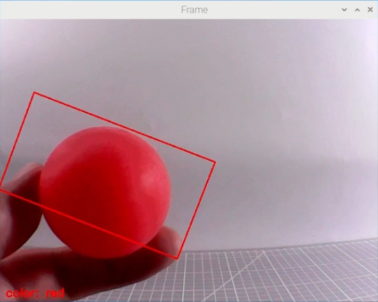

# 25. ROS2-AI Auto Tracking and Shooting Course

## 25.1 Ball Searching and Locating

### 25.1.1 Program Logic

Firstly, program to recognize color. Use Lab color space to convert the image from RGB into Lab. Then, perform binaryzation, corrosion, dilation, etc., on the image to obtain the contour which contains the target color. Next, circle the contour.

Next, judge the ball color. If it is red, acquire the coordinate of the ball.

Lastly, print the x-axis coordinate of the ball on the terminal.

### 25.1.2 Operation Steps 

:::{Note}

The input command should be case and space sensitive.

:::

(1) Power on the robot, then follow the steps in  [3.3 Docker Container Introduction and Entry]() and [3.4 ROS Version Switch Tool Guide]() to connect via the VNC remote control software and switch to the ROS 2 environment.

(2) Click  to open Terminator ROS2 terminal.

(3) Input the command below and press Enter to start the game.

```bash
ros2 launch example kick_ball_demo.launch.py model:=0
```

(4) If want to close this game, we can press “**Ctrl+C**”. If it fails to close the game, please try again.

### 25.1.3 Program Outcome

:::{Note}

The program is default to recognize red.

:::

Once the red ball is detected, a rectangle will be drawn around the ball in the video feed, and the X-axis coordinate will be printed in the terminal.



### 25.1.4 Program Analysis Analysis

The source code is located in **[ros2_ws/src/example/example/advanced_functions/kick_ball_demo.py](../_static/source_code/ros2/kick_ball_demo.zip)**

(1) Import Function Package

{lineno-start=3}

```py
import sys
import cv2
import time
import math
import threading
import numpy as np
from enum import Enum
import yaml
from cv_bridge import CvBridge
import rclpy
from rclpy.node import Node
from sensor_msgs.msg import Image
from puppy_control_msgs.msg import Velocity, Pose, Gait
from puppy_control_msgs.srv import SetRunActionName
```

Import the required module through import statements: math provides a range of mathematical functions and constants for related calculations; rospy is used for ROS communication; from sensor_msgs.msg import Image: import target tracking related service. from puppy_control.msg import Velocity, Pose, Gait: import services for controlling and transmitting the velocity, pose, and gait of the robot.

* **Image Processing**

(1) Gaussian Filtering

Before converting the image from RGB into Lab space, denoise the image and use `GaussianBlur()` function in cv2 library for Gaussian filtering.

{lineno-start=364}

```py
frame_gb = cv2.GaussianBlur(frame_resize, (3, 3), 3)
```

The meaning of the parameters in bracket is as follow

① The first parameter `frame_resize` is the input image

② The second parameter `(3, 3)` is the size of Gaussian kernel

③ The third parameter `3` is the allowable range of variation around the average in Gaussian filtering. The larger the value, the larger the allowable range of variation.

(2) Binaryzation Processing

Adopt `inRange()` function in cv2 library to perform binaryzation on the image.

{lineno-start=372}

```py
	            color_range = self.color_range_list[i]
                frame_mask = cv2.inRange(
                    frame_lab,
                    np.array(color_range['min'], dtype=np.uint8),
                    np.array(color_range['max'], dtype=np.uint8)
                )
```

The first parameter in the bracket is the input image. The second and the third parameters respectively are the lower limit and upper limit of the threshold. When the RGB value of the pixel is between the upper limit and lower limit, the pixel is assigned 1, otherwise, 0.

(3) Erode and Dilate

To reduce interference and make the image smoother, it is necessary to process the image.

{lineno-start=378}

```py
	                eroded = cv2.erode(frame_mask, cv2.getStructuringElement(cv2.MORPH_RECT, (3, 3)))
                dilated = cv2.dilate(eroded, cv2.getStructuringElement(cv2.MORPH_RECT, (3, 3)))
```

`erode()` function is used for image erosion. Take `eroded = cv2.erode(frame_mask, cv2.getStructuringElement(cv2.MORPH_RECT, (3, 3)))` for example. The meaning of the parameters in bracket is as follow.

① The first parameter `frame_mask` is the input image.

② The second parameter `cv2.getStructuringElement(cv2.MORPH_RECT, (3, 3))` is the structural element or kernel deciding the nature of operation. And, the first parameter in the bracket is the shape of kernel, and the second parameter is the dimension of the kernel.

③ `dilate()` function is used for image dilation. The meaning of the parameters in bracket is the same as that of erode() function.

(4) Acquire the Maximum Contour

After processing the image, acquire the contour of the target to be recognized, which involves findContours() function in cv2 library.

{lineno-start=382}

```python
	                contours, _ = cv2.findContours(dilated, cv2.RETR_EXTERNAL, cv2.CHAIN_APPROX_NONE)
```

The first parameter in the parentheses is the input image, usually an image that has undergone dilation for better contour detection. The second parameter specifies the contour retrieval mode, which extracts only the outermost contours, meaning the function will return only the outer contours and not any internal contours or holes. The third parameter defines the contour approximation method, which retains all the points on the contour.

{lineno-start=389}

```py
if max_area > 200:
	rect = cv2.minAreaRect(areaMaxContour_max)
    box = np.int0(cv2.boxPoints(rect))
    centerX = int(map_value(rect[0][0], 0, self.size[0], 0, img_w))
    centerY = int(map_value(rect[0][1], 0, self.size[1], 0, img_h))
    sideX = int(map_value(rect[1][0], 0, self.size[0], 0, img_w))
    sideY = int(map_value(rect[1][1], 0, self.size[1], 0, img_h))
    angle = rect[2]
    for i in range(4):
    	box[i, 1] = int(map_value(box[i, 1], 0, self.size[1], 0, img_h))
    for i in range(4):
        box[i, 0] = int(map_value(box[i, 0], 0, self.size[0], 0, img_w))
    cv2.drawContours(img, [box], -1, (0, 0, 255), 2)
```

* **Display Coordinate**

Lastly, the x-axis coordinate of the red ball will be displayed on the terminal.

{lineno-start=432}

```py
if sideX > sideY:
	self.target_info = {'centerX': centerX, 'centerY': centerY, 'sideX': sideX, 'sideY': sideY, 'scale': sideX/sideY, 'angle': angle}
else:
	self.target_info = {'centerX': centerX, 'centerY': centerY, 'sideX': sideX, 'sideY': sideY, 'scale': sideY/sideX, 'angle': angle}
```

### 25.1.5 Function Extension

* **Modify Default Recognition Color**

By default, the program is configured to recognize the color red as the target. The following steps demonstrate how to modify the default target color to green:

(1) Open a terminal  and run the following command to enter the directory containing the program:

```python
cd ~/ros2_ws/src/example/example/advanced_functions
```

(2) Use the vim editor to open the program file:

```python
vim kick_ball_demo.py
```

(3) Find the line of code responsible for setting the target color. Refer to the image below for guidance.


:::{Note}

In vim, you can jump to a specific line by typing the line number, then pressing Shift + G.(Note: The line number shown in the image is for reference only. Please locate the actual line in your file.)

:::

(4) Press the i key to enter **insert mode**, and change the line to: `self.set_target(‘green’)`


(5) After editing, press the Esc key, then type the following to save and exit:

```python
:wq
```

(6) Run the command below to restart the program and observe the updated behavior:

```python
ros2 launch example kick_ball_demo.launch.py model:=0
```

* **Adding a New Recognizable Color**

In addition to the default colors configured in the program, users can add custom colors for recognition. This section provides step-by-step instructions for adding **yellow** as a new detectable color:

(1) Open a terminal  and run the following command to enter the directory containing the program:

```python
  ~/.stop_ros.sh
```

(2) Start the USB camera node with the following command:

```python
ros2 launch peripherals usb_cam.launch.py
```

(3) Open a new terminal   and navigate to the LAB Tool directory:

```python
cd /home/ubuntu/software/lab_tool
```

(4) Run the PC software:

```python
python3 main.py
```

(5) Click the **“Add”** button located at the bottom right corner of the interface.


(6) In the popup dialog, enter **“yellow”** as the new color name and click **“OK”**.


(7) From the color selection panel at the bottom right, select **“yellow”**.


(8) Place a yellow object within the camera’s field of view. Adjust the **L**, **A**, and **B** sliders until the yellow area appears **white** on the left side of the interface, while all other areas appear **black**.


(9) After adjustment, click **“Save”** to save the settings, then close the LAB Tool.


(10) Verify that the new settings are saved correctly by opening the LAB configuration file:

```python
cd software/lab_tool/ && vim lab_config.yaml
```


(11) Following the instructions in section “5.1 Modify Default Recognition Color”, modify the default detection color to yellow.


:::{Note}

These three values represent the BGR color for the display font only and do not affect recognition accuracy. You can find appropriate BGR values online for customization.
For yellow, use the BGR value **(0, 30, 150)**.
Add the corresponding LAB values for yellow to the color recognition code section as well.

:::


Also, update the program to include the BGR color values for the font color in the output display.

(12) After completing the changes, restart the program with the following command. Place a yellow object in front of the camera to confirm it is correctly recognized in the output:

```python
ros2 launch example kick_ball_demo.launch.py model:=0
```


## 25.2 Auto Tracking and Shooting

:::{Note}
If the demonstration effect is not satisfactory, you can debug the device according to"[**25.2.5 Function Extension -> Close Debugging Interface**](#anchor_23_2_5)".
:::

### 25.2.1 Program Logic

Firstly, program to recognize color. Use Lab color space to convert the image from RGB into Lab. Then, perform binaryzation, corrosion, dilation, etc., on the image to obtain the contour which contains the target color. Next, circle the contour.

PuppyPi will execute color recognition continuously till red ball is recognized. Then acquire the coordinate of ball, and approach it. When PuppyPi stops in front of the ball, control it to shoot the ball according to the X-axis coordinate.

### 25.2.2 Operation Steps

:::{Note}

The input command should be case and space sensitive.

:::

(1) Turn on PuppyPi, and then connect to Raspberry Pi desktop through VNC.

(2) Click  to open Terminator ROS2 terminal.

```bash
ros2 launch example kick_ball_demo.launch.py model:=1
```

(3) If want to close this game, we can press "**Ctrl+C**". If it fails to close the game, please try again.

### 25.2.3 Program Outcome

:::{Note}

The program is default to recognize red, green and blue.

:::

When recognizing red ball, PuppyPi will approach the ball autonomously according to the location of PuppyPi, and then shoot the ball. Besides, the red ball will be marked with red circle and its color will be printed on the camera returned image.


### 25.2.4 Program Analysis Analysis

The source code of this program is located within the Docker container:

[ros2_ws/src/example/example/advanced_functions/kick_ball_demo.py](../_static/source_code/ros2/kick_ball_demo.zip)

* **Direction Judging**

After locating the ball, judge whether the ball is at left or right according to the coordinate of the ball.

{lineno-start=270}

```py
	                    self.puppyStatus = PuppyStatus.CLOSE_TO_TARGET_FINE_TUNE
                        which_foot_kick_ball = 'left' if self.expect_center['X'] > self.target_info['centerX'] else 'right'
```

* **Approach the Red Ball**

According to the coordinate of the ball, control PuppyPi to approach the red ball.

```py
	                if self.target_info['centerY'] > 380:
                        velocity_msg = Velocity(x=0.0, y=0.0, yaw_rate=0.0)
                        self.PuppyVelocityPub.publish(velocity_msg)
                        self.puppyStatus = PuppyStatus.CLOSE_TO_TARGET_FINE_TUNE
                        which_foot_kick_ball = 'left' if self.expect_center['X'] > self.target_info['centerX'] else 'right'
                        self.get_logger().info(f'已靠近目标，准备使用 {which_foot_kick_ball} 脚踢球')
                    else:
                        if self.expect_center['X'] - self.target_info['centerX'] < -50:
                            velocity_msg = Velocity(x=3.0, y=0.0, yaw_rate=math.radians(-10))
                            self.PuppyVelocityPub.publish(velocity_msg)
                            self.get_logger().info('目标偏右，微调向左')
                        elif self.expect_center['X'] - self.target_info['centerX'] > 50:
                            velocity_msg = Velocity(x=3.0, y=0.0, yaw_rate=math.radians(10))
                            self.PuppyVelocityPub.publish(velocity_msg)
                            self.get_logger().info('目标偏左，微调向右')
                        else:
                            velocity_msg = Velocity(x=8.0, y=0.0, yaw_rate=0.0)
                            self.PuppyVelocityPub.publish(velocity_msg)
                            self.get_logger().info('目标居中，继续靠近')
                        time.sleep(0.2)

```

This process controls the movement and rotation of the robot dog based on whether the ball is kicked with the right foot and the relationship between the target position and the desired kick position. If specific conditions are met, the robot dog will rotate in place. Otherwise, the robot will move forward, rotate to the correct direction, and then stop to prepare for the kick.

For example, in the first block of code, it checks whether the which_foot_kick_ball variable is set to 'right' (indicating the ball is being kicked with the right foot), and whether the target position's center X coordinate (self.target_info['centerX']) is smaller than the expected center X coordinate for the right foot kick (self.expect_center_kick_ball_right['X']).

If both conditions are met, the code within the first with self.lock: block is executed. Otherwise, the code within the else: block is executed.

* **Shoot the Ball**

After approaching the red ball, the robot uses the ball's position (left or right) to trigger the corresponding action group and perform the kicking motion. The lines if which_foot_kick_ball == 'left': and else: determine which foot will kick the ball based on the value of the which_foot_kick_ball variable. If the value is 'left', the left foot will be used; otherwise, the right foot will be used. See the diagram below:

```py
	                        y=0.0,
                            yaw_rate=math.radians(-10) if which_foot_kick_ball == 'left' else math.radians(10)
                        )
                        self.PuppyVelocityPub.publish(velocity_msg)
                        self.get_logger().info(f'准备踢球，使用 {which_foot_kick_ball} 脚')
```

<p id="anchor_23_2_5"></p>

### 25.2.5 Function Extension

* **Close Debugging Interface**

As the continuous refresh of debugging interface will occupy CPU of Raspberry Pi, we can close debugging interface to tackle choppy running.

(1) Input the following command and press Enter to edit the program file.

```bash
cd ros2_ws/src/example/example/advanced_functions
```

```bash
vim kick_ball_demo.py
```

(2) Next, jump to this line of code.


:::{Note}

After entering the line number for the code on the keyboard, press **'Shift+G'** to jump directly to the corresponding position. (The code line numbers shown in the image are for reference only; please refer to the actual ones.)

:::

(3) Press "**i**" key to enter editing mode. Then add "**\#**" in front of the codes in the red frame to comment.


(4) After modification, press "**Esc**" and input "**:wq**" and press Enter to save and exit editing.

```bash
:wq
```


(5) Input the following command to restart the game and check PuppyPi's performance.

```bash
ros2 launch example kick_ball_demo.launch.py model:= 1
```

(6) If you need to view the debugging screen again (real-time feedback from the camera), you can uncomment the content boxed in step 3), i.e., remove the **"#"** in front of the code, then save, as shown in the following figure:


* **Change Ball Color**

The default color used in the game is red. If you wish to change it—for example, to black—please refer to section [25.1.5 Function Extension]()

Once the modification is complete, simply run the game to see the updated color in effect.

```bash
ros2 launch example kick_ball_demo.launch.py model:=1
```

