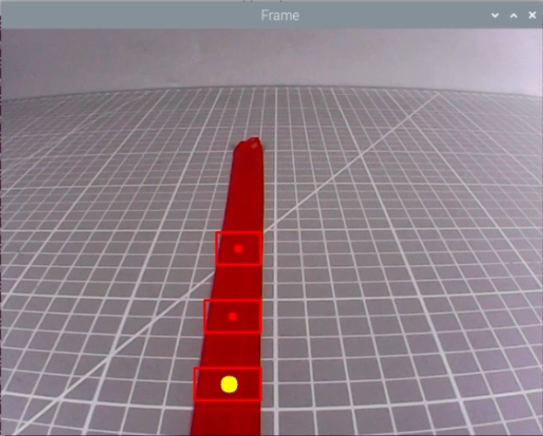
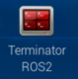

# 26. ROS2-AI Vision Line Following Course

## 26.1 Line Locating

### 26.1.1 Program Logic

Before line following, program PuppyPi to locate the line first.

Firstly, program to recognize color. Use Lab color space to convert the image from RGB into Lab. Then, perform binaryzation, corrosion, dilation, etc., on the image to obtain the contour which contains the target color. Next, mark the contour with rectangle.

Next, acquire the diagonal points of the rectangle, and draw the center of line.

Lastly, display the information about the center of line on the terminal.

### 26.1.2 Operation Steps

:::{Note}

The input command should be case and space sensitive.

:::

(1) Power on the robot, then follow the steps in  [3.3 Docker Container Introduction and Entry]() and [3.4 ROS Version Switch Tool Guide]() to connect via the VNC remote control software and switch to the ROS 2 environment.

(2) Click  to open Terminator ROS2 terminal, then execute the following command in sequence:

```bash
ros2 launch example visual_patrol_demo.launch.py model:=0
```

(3) If want to close this game, we can press "**Ctrl+C**". If it fails to close the game, please try again.

### 26.1.3 Program Outcome

:::{Note}

The program is default to recognize red.

:::

Use red electrical tape to set the line. Then place PuppyPi on the red line. After the line is recognized by PuppyPi, the line will be framed on the camera returned image and the center of line will be drawn. At the same time, the coordinate of the line center will be displayed on the terminal.




### 26.1.4 Program Analysis Analysis

The source code of this program is located within the Docker container at:

[/home/ubuntu/ros2_ws/src/example/example/advanced_functions/visual_patrol_demo.py]()

* **Image Processing**

(1) Import Function Package

{lineno-start=4}

```py
import cv2
import math
import time
import numpy as np
import yaml
from cv_bridge import CvBridge, CvBridgeError
import rclpy
from rclpy.node import Node

from sensor_msgs.msg import Image
from std_srvs.srv import Empty
from puppy_control_msgs.msg import Velocity, Pose, Gait
```

Import the required modules through import statements: math provides a range of mathematical functions and constants for related calculations; rospy is used for ROS communication; from sensor_msgs.msg import Image: import Image information type from sensor_msgs.msg. Sensor_msgs package provides information definition and camera image of various sensor data. Puppy control imports action group.

(2) Obtain the Maximal Contour

{lineno-start=29}

```py
self.__isRunning = False
self.__target_color = 'red' 
self.line_centerx = -1
self.img_centerx = 320  
```

Set the line color to red.

(3) Gussian Filtering

Before converting the image from RGB into Lab space, denoise the image and use `GaussianBlur()` function in cv2 library for Gaussian filtering.

```py
frame_gb = cv2.GaussianBlur(frame_resize, (3, 3), 3)
```

The meaning of the parameters in bracket is as follow

The first parameter `frame_resize` is the input image

The second parameter `(3, 3)` is the size of Gaussian kernel

The third parameter `3` is the allowable variance around the average in Gaussian filtering. The larger the value, the larger the allowable variance.

(4) Binaryzation Processing

Adopt `inRange()` function in cv2 library to perform binaryzation on the image.

{lineno-start=216}

```py
frame_mask = cv2.inRange(frame_lab,
                         np.array(color_range['min'], dtype=np.uint8),
                         np.array(color_range['max'], dtype=np.uint8))
```

The line of code `frame_mask = cv2.inRange(frame_lab, np.array(color_range['min'], dtype=np.uint8), np.array(color_range['max'], dtype=np.uint8))` uses the cv2.inRange function to create a binary mask.

(5) Open Operation and Close Operation

To reduce interference and make the image smoother, it is necessary to process the image.

{lineno-start=220}

```py
opened = cv2.morphologyEx(frame_mask, cv2.MORPH_OPEN, np.ones((5, 5), np.uint8))
closed = cv2.morphologyEx(opened, cv2.MORPH_CLOSE, np.ones((5, 5), np.uint8))
```

`cv2.MORPH_OPEN` refers to open operation where corrosion will be conducted first, then dilation. cv2.MORPH_CLOSE indicates close operation where dilation will be conducted first, then corrosion.

Take `opened = cv2.morphologyEx(frame_mask, cv2.MORPH_OPEN, np.ones((6, 6), np.uint8))` for example. The meaning of the parameters in bracket is as follow.

① The first parameter `frame_mask` is the input image.

② The second parameter `cv2.MORPH_OPEN` refers to processing method, open operation.

③ The third parameter `np.ones((6, 6), np.uint8)` is frame size.

(6) Acquire the Maximum Contour

After processing the image, acquire the contour of the target to be recognized, which involves `findContours()` function in cv2 library.

{lineno-start=231}

```py
contours, _ = cv2.findContours(closed, cv2.RETR_EXTERNAL, cv2.CHAIN_APPROX_SIMPLE)
cnt_large, area = self.getAreaMaxContour(contours)
self.get_logger().debug(f"ROI {idx + 1}: 找到 {len(contours)} 个轮廓，最大面积为 {area}")
```

The first parameter in the function's parentheses is the input image; the second parameter is the contour retrieval mode; the third parameter is the contour approximation method.

The self.getAreaMaxContour function is called, passing the contours list, and it returns the largest contour cnt_large along with its corresponding area area.

{lineno-start=178}

```py
def getAreaMaxContour(self, contours):
    """找出面积最大的轮廓"""
    contour_area_max = 0
    area_max_contour = None

    for c in contours:
        contour_area_temp = math.fabs(cv2.contourArea(c))
        if contour_area_temp > contour_area_max:
            contour_area_max = contour_area_temp
            if contour_area_temp > 50:
                area_max_contour = c

    return area_max_contour, contour_area_max
```

* **Acquire the Position**

(1) Frame the Line

Call `drawContours()` function to set the rectangle pattern and frame the line.

```py
cv2.drawContours(img, [box], -1, (0, 0, 255), 2)
```

(2) Draw the Center

Next, acquire the diagonal points of the rectangle, and draw the line center through circle() function.

{lineno-start=245}

```py
cv2.drawContours(img, [box], -1, (0, 0, 255), 2)
pt1_x, pt1_y = box[0, 0], box[0, 1]
pt3_x, pt3_y = box[2, 0], box[2, 1]
center_x, center_y = (pt1_x + pt3_x) / 2, (pt1_y + pt3_y) / 2
cv2.circle(img, (int(center_x), int(center_y)), 5, (0, 0, 255), -1)
```

### 26.1.5 Function Extension

* **Modify Default Recognition Color**

By default, the program is configured to recognize the color red as the target. The following steps demonstrate how to modify the default target color to green:

(1) Open a terminal  and run the following command to enter the directory containing the program:

```python
cd ~/ros2_ws/src/example/example/advanced_functions
```

(2) Use the vim editor to open the program file:

```python
vim visual_patrol_demo.py
```

(3) Find the line of code responsible for setting the target color. Refer to the image below for guidance.


:::{Note}

In vim, you can jump to a specific line by typing the line number, then pressing Shift + G.(Note: The line number shown in the image is for reference only. Please locate the actual line in your file.)

:::

(4) Press the i key to enter **insert mode**, and change the line to: `self.set_target(‘green’)`


(5) After editing, press the Esc key, then type the following to save and exit:

```python
:wq
```

(6) Run the command below to restart the program and observe the updated behavior:

```python
ros2 launch example visual_patrol_demo.launch.py model:=0
```

* **Adding a New Recognizable Color**

In addition to the default colors configured in the program, users can add custom colors for recognition. This section provides step-by-step instructions for adding **yellow** as a new detectable color:

(1) Open a terminal  and run the following command to enter the directory containing the program:

```python
  ~/.stop_ros.sh
```

(2) Start the USB camera node with the following command:

```python
ros2 launch peripherals usb_cam.launch.py
```

(3) Open a new terminal   and navigate to the LAB Tool directory:

```python
cd /home/ubuntu/software/lab_tool
```

(4) Run the PC software:

```python
python3 main.py
```

(5) Click the **“Add”** button located at the bottom right corner of the interface.




(6) In the popup dialog, enter **“yellow”** as the new color name and click **“OK”**.


(7) From the color selection panel at the bottom right, select **“yellow”**.


(8) Place a yellow object within the camera’s field of view. Adjust the **L**, **A**, and **B** sliders until the yellow area appears **white** on the left side of the interface, while all other areas appear **black**.


(9) After adjustment, click **“Save”** to save the settings, then close the LAB Tool.


(10) Verify that the new settings are saved correctly by opening the LAB configuration file:

```python
cd software/lab_tool/ && vim lab_config.yaml
```


(11) Following the instructions in section “5.1 Modify Default Recognition Color”, modify the default detection color to yellow.


:::{Note}

These three values represent the BGR color for the display font only and do not affect recognition accuracy. You can find appropriate BGR values online for customization.
For yellow, use the BGR value **(0, 30, 150)**.
Add the corresponding LAB values for yellow to the color recognition code section as well.

:::


(12) After completing the changes, restart the program with the following command. Place a yellow object in front of the camera to confirm it is correctly recognized in the output:

```python
ros2 launch example visual_patrol_demo.launch.py model:=0
```


## 26.2 Auto Line Following

:::{Note}

If PuppyPi's performance is not desired, we can debug according to "[**26.2.5 Function Extension -> Close Debugging Interface and Printed Data**]()".

:::

### 26.2.1 Program Logic

PuppyPi can recognize the color of line and use algorithm to process the image so as to realize line following.  

Firstly, program to recognize the color of line. Use Lab color space to convert the image from RGB into Lab. Then, perform binaryzation, corrosion, dilation, etc., on the image to obtain the contour which contains the target color. Next, mark the contour with rectangle. 

After color recognition, perform calculation based on the location of line in the image to control PuppyPi to move along the line.

### 26.2.2 Operation Steps

:::{Note}

The input command should be case and space sensitive.

:::

(1) Power on the robot, then follow the steps in  [3.3 Docker Container Introduction and Entry]() and [3.4 ROS Version Switch Tool Guide]() to connect via the VNC remote control software and switch to the ROS 2 environment.

(2) Click  to open Terminator ROS2 terminal, then enter the following command:

```bash
ros2 launch example visual_patrol_demo.launch.py model:=1
```

(3) If want to close this game, we can press "**Ctrl+C**". If it fails to close the game, please try again.

### 26.2.3 Program Outcome

:::{Note}

The program is default to detect red.

:::

Use the red electrical tape to set the line, and place PuppyPi on the red line. After the game starts, it will move along the red line.


### 26.2.4 Program Analysis

The source code of this program is stored in the Docker container: 

[/home/ubuntu/ros2_ws/src/example/example/advanced_functions/visual_patrol_demo.py]()

* **Move Following the Line**

In the first lesson, we introduced how to locate lines. Following that, we can use the line's center coordinate information to control the robot to follow the line, as shown in the figure below.

{lineno-start=193}

```python
 def run(self, img):
        """处理图像，检测红色线条并计算中心位置"""
        size = (320, 240)
        img_h, img_w = img.shape[:2]

        frame_resize = cv2.resize(img, size, interpolation=cv2.INTER_LINEAR)
        frame_gb = cv2.GaussianBlur(frame_resize, (3, 3), 3)

        centroid_x_sum = 0
        weight_sum = 0

        for idx, r in enumerate(self.roi):
            roi_h = self.roi_h_list[idx]
            blobs = frame_gb[r[0]:r[1], r[2]:r[3]]
            frame_lab = cv2.cvtColor(blobs, cv2.COLOR_BGR2LAB)

            detect_color = self.__target_color
            if detect_color in self.color_range_list:
                color_range = self.color_range_list[detect_color]
                frame_mask = cv2.inRange(frame_lab,
                                         np.array(color_range['min'], dtype=np.uint8),
                                         np.array(color_range['max'], dtype=np.uint8))
                # 形态学操作
                opened = cv2.morphologyEx(frame_mask, cv2.MORPH_OPEN, np.ones((5, 5), np.uint8))
                closed = cv2.morphologyEx(opened, cv2.MORPH_CLOSE, np.ones((5, 5), np.uint8))

                # 调试信息：显示掩模图像
                cv2.imshow('Mask', closed)
                cv2.waitKey(1)
            else:
                self.line_centerx = -1
                self.get_logger().warn(f"目标颜色 '{detect_color}' 不在颜色阈值列表中。")
                return img
```

* **Walk**

We mainly control the robot dog's movement by calling the functions PuppyPosePub.publish(), PuppyGaitConfigPub.publish(), and PuppyVelocityPub.publish().

{lineno-start=135}

```python
	    # 发布初始姿态
        pose_msg = Pose()
        pose_msg.stance_x = float(self.PuppyPose['stance_x'])
        pose_msg.stance_y = float(self.PuppyPose['stance_y'])
        pose_msg.x_shift = float(self.PuppyPose['x_shift'])
        pose_msg.height = float(self.PuppyPose['height'])
        pose_msg.roll = float(self.PuppyPose['roll'])
        pose_msg.pitch = float(self.PuppyPose['pitch'])
        pose_msg.yaw = float(self.PuppyPose['yaw'])
        pose_msg.run_time = int(500)
        self.PuppyPosePub.publish(pose_msg)
        self.get_logger().info("发布初始姿态。")
        time.sleep(0.2)
```

The `PuppyPosePub.publish()` function is used to control the robot dog's posture during movement. 

For example, in the code `PuppyPosePub.publish(stance_x=PuppyPose['stance_x'], stance_y=PuppyPose['stance_y'], x_shift=PuppyPose['x_shift'], height=PuppyPose['height'], pitch=PuppyPose['pitch'], roll=PuppyPose['roll'])`, the parameters inside the parentheses have the following meanings:

(1) The first parameter, `stance_x`, represents the additional distance between the robot dog's four legs along the x-axis, measured in centimeters.

(2) The second parameter, `stance_y`, represents the additional distance between the four legs along the y-axis, measured in centimeters.

(3) The third parameter, `x_shift`, represents the distance the four legs move in the same direction along the x-axis. A smaller value results in the robot leaning forward while walking, and a larger value causes it to lean backward. Adjusting `x_shift` helps maintain the robot's balance during movement, measured in centimeters.

(4) The fourth parameter, `height`, is the height of the robot dog, specifically the vertical distance from the tips of the feet to the thigh joint, measured in centimeters.

(5) The fifth parameter, `roll`, refers to the roll angle of the robot dog, measured in degrees.

(6) The sixth parameter, `pitch`, refers to the pitch angle of the robot dog, measured in degrees.

The `Puppy.gait_config(overlap_time)` function is used to control the robot dog's gait during movement.

{lineno-start=151}

```python
	    # 发布步态配置
        gait_msg = Gait()
        gait_msg.overlap_time = float(self.GaitConfig['overlap_time'])
        gait_msg.swing_time = float(self.GaitConfig['swing_time'])
        gait_msg.clearance_time = float(self.GaitConfig['clearance_time'])
        gait_msg.z_clearance = float(self.GaitConfig['z_clearance'])
        self.PuppyGaitConfigPub.publish(gait_msg)
        self.get_logger().info("发布步态配置。")
        time.sleep(0.2)
```

For example, in the code `Puppy.gait_config(overlap_time = GaitConfig['overlap_time'], swing_time = GaitConfig['swing_time'], clearance_time = GaitConfig['clearance_time'], z_clearance = GaitConfig['z_clearance'])`, the parameters inside the parentheses have the following meanings:

(1) The first parameter, `overlap_time`, represents the duration for which all four knee joints are in contact with the ground, measured in seconds.

(2) The second parameter, `swing_time`, represents the duration for which the knee joints are fully lifted off the ground, measured in seconds.

(3) The third parameter, `clearance_time`, refers to the time interval between the front and rear feet, measured in seconds.

(4) The fourth parameter, `z_clearance`, represents the height that the knee joints are lifted during movement, measured in centimeters.

### 26.2.5 Function Extension

* **Close Debugging Interface and Printed Data**

As the continuous refresh of debugging interface and printed data on terminal will occupy CPU of Raspberry Pi, we can close debugging interface and printed data to tackle choppy running.

(1) Input the following command and press Enter to edit the program file.

```python
cd ros2_ws/src/example/example/advanced_functions/
```

(2) Open the program file using the Vim editor by entering the following command:

```python
vim visual_patrol_demo.py
```

(3) Next, jump to this line of code.


:::{Note}

we can input the line code and press “Shift+G” to jump to the corresponding line.

:::

(4)Press “***\*i\****” key to enter editing mode. Then add “***\*#\****” in front of the codes in the red frame to comment.


(5) After modification, press “***\*Esc\****” and input “***\*:wq\****” and press Enter to save and exit editing.

```py
:wq
```

(6) Input the following command to restart the game and check PuppyPi’s performance.

```python
ros2 launch example visual_patrol_demo.launch.py model:=1
```

(7) If you need to view the debugging screen again (real-time feedback from the camera), you can uncomment the content boxed in step 3), i.e., remove the "#" in front of the code, then save, as shown in the following figure:


* **Change the Followed Color**

The default target color for this feature is red. If you wish to change it—for example, to black—please refer to section [26.1.5 Function Extension]() for detailed instructions.

After making the necessary changes, enter the corresponding command to launch the feature.

```python
ros2 launch example visual_patrol_demo.launch.py model:=1
```

