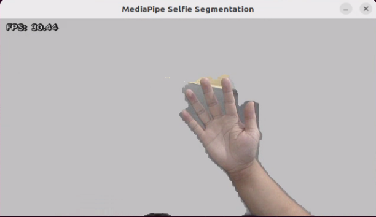

# 27. ROS2 MediaPipe Human-Robot Interaction Courses

## 27.1 Introduction to MediaPipe

### 27.1.1 MediaPipe Description

MediaPipe is an open-source framework of multi-media machine learning models. Cross-platform MediaPipe can run on mobile devices, workspace and servers, as well as support mobile GPU acceleration. It is also compatible with TensorFlow and TF Lite Inference Engine, and all kinds of TensorFlow and TF Lite models can be applied on it. Besides, MediaPipe supports GPU acceleration of mobile and embedded platform.


### 27.1.2 MediaPipe Pros and Cons

* **MediaPipe Pros**

(1) MediaPipe supports various platforms and languages, including iOS, Android, C++, Python, JavaScript, Coral, etc.

(2) Swift running. Models can run in real-time.

(3) Models and codes are with high reuse rate.

* **MediaPipe Cons**

(1) For mobile devices, MediaPipe will occupy 10M or above.

(2) As it greatly depends on Tensorflow, you need to alter large amount of codes if you want to change it to other machine learning frameworks, which is not friendly to machine learning developer.

(3) It adopts static image which can improve efficiency, but make it difficult to find out the errors.

### 27.1.3 How to use MediaPipe

The figure below shows how to use MediaPipe. The solid line represents the part to coded, and the dotted line indicates the part not to coded. MediaPipe can offer the result and the function realization framework quickly.


* **Dependency**

MediaPipe utilizes OpenCV to process video, and uses [FFMPEG](https://www.ffmpeg.org/) to process audio data. Furthermore, it incorporates other essential dependencies, including OpenGL/Metal, Tensorflow, and Eigen.

For seamless usage of MediaPipe, we suggest gaining a basic understanding of OpenCV. To delve into OpenCV, you can find detailed information in `4. OpenCV Basic Courses`.

* **MediaPipe Solutions**

Solutions is based on the open-source pre-constructed sample of TensorFlow or TFLite. MediaPipe Solutions is built upon a framework, which provides 16 Solutions, including face detection, Face Mesh, iris, hand, posture, human body and so on.

### 27.1.4 MediaPipe Learning Resources

- MediaPipe website: [https://developers.google.com/mediapipe]()
- MediaPipe Wiki: [http://i.bnu.edu.cn/wiki/index.php?title=Mediapipe]()
- MediaPipe github: [https://github.com/google/mediapipe]()
- Dlib website: [http://dlib.net/]()
- dlib github: [https://github.com/davisking/dlib]()

## 27.2 Image Background Segmentation

This lesson provides instructions on utilizing MediaPipe's selfie segmentation model to accurately segment trained models, such as human faces and hands, from their backgrounds. Once separated, you can easily add virtual backgrounds to these models.

### 27.2.1 Program Logic

To begin, import the selfie segmentation model from MediaPipe and subscribe to the corresponding topic to access the live camera feed.

Next, flip the image and apply the segmentation to the background image. For improved boundary segmentation, implement dual-border segmentation.

Finally, complete the process by replacing the background with a virtual background.

### 27.2.2 Operation Steps

:::{Note}
The input command should be case sensitive, and keywords can be complemented using Tab key.
:::

(1) Power on the robot, then follow the steps in  [3.3 Docker Container Introduction and Entry]() and [3.4 ROS Version Switch Tool Guide]() to connect via the VNC remote control software and switch to the ROS 2 environment.

(2) Click-on the terminal icon to open the command-line terminal.

(3) Execute the command to disable the ros node.

```
~/.stop_ros.sh
```

(4) Enter the following command to start the game.

```
ros2 launch example self_segmentation.launch.py
```

### 27.2.3 Program Outcome

Once the game starts, the screen will transition to a gray virtual background. As soon as a human figure appears, the program will automatically execute background removal, effectively separating the human from the virtual background.



### 27.2.4 Program Analysis

The source code of this program is saved in: [/home/ubuntu/ros2_ws/src/example/example/mediapipe_example/self_segmentation.py]()

* **Build Selfie Segmentation Model**

{lineno-start=21}
```python
class SegmentationNode(Node):
    def __init__(self, name):
        rclpy.init()
        super().__init__(name)
        self.running = True
        self.mp_selfie_segmentation = mp.solutions.selfie_segmentation
        self.mp_drawing = mp.solutions.drawing_utils
        self.fps = fps.FPS()
        self.image_queue = queue.Queue(maxsize=2)
        self.BG_COLOR = (192, 192, 192)  # gray
        self.image_sub = self.create_subscription(Image, '/image_raw', self.image_callback, 1)
        self.get_logger().info('\033[1;32m%s\033[0m' % 'start')
        self.cli = self.create_client(Empty,'/puppy_control/go_home')
        self.cli.call_async(Empty.Request())
        
        self.bridge = CvBridge()  # Initialize CvBridge
        threading.Thread(target=self.main, daemon=True).start()
```

The `SegmentationNode` is a ROS2-based component designed for real-time image processing, particularly selfie segmentation. Upon initialization, it loads a MediaPipe segmentation model (defaulting to `selfie_segmentation`) and sets up an image subscriber to receive raw image data. Incoming images are handled by the `image_callback` function, which converts the ROS image messages into NumPy arrays and stores them in a queue with a configurable maximum size (default is 2). If the queue reaches capacity, the oldest image is automatically discarded to accommodate new data.

{lineno-start=39}
```python
    def image_callback(self, ros_image):
        try:
            rgb_image = self.bridge.imgmsg_to_cv2(ros_image, desired_encoding='bgr8')
        except Exception as e:
            self.get_logger().error(f"Error converting ROS image to OpenCV: {e}")
            return
        
        if self.image_queue.full():
            self.image_queue.get()
        self.image_queue.put(rgb_image)

    def main(self):
        with self.mp_selfie_segmentation.SelfieSegmentation(model_selection=1) as selfie_segmentation:
            bg_image = None
            while self.running:
                try:
                    image = self.image_queue.get(block=True, timeout=1)
                except queue.Empty:
                    if not self.running:
                        break
                    else:
                        continue
                
                # To improve performance, optionally mark the image as not writeable to pass by reference.
                image.flags.writeable = False
                results = selfie_segmentation.process(image)
                image.flags.writeable = True
                
                # Draw selfie segmentation on the background image.
                condition = np.stack((results.segmentation_mask,) * 3, axis=-1) > 0.1
                
                # 如果没有背景图像，则创建一个灰色背景
                if bg_image is None:
                    bg_image = np.zeros(image.shape, dtype=np.uint8)
                    bg_image[:] = self.BG_COLOR
                
                # 根据分割结果合成输出图像
                output_image = np.where(condition, image, bg_image)
                
                self.fps.update()
                result_image = self.fps.show_fps(output_image)
                
                cv2.imshow('MediaPipe Selfie Segmentation', result_image)
                key = cv2.waitKey(1)
                if key == ord('q') or key == 27:  # Press q or esc to exit
                    break
            
            cv2.destroyAllWindows()
            rclpy.shutdown()
```

The main function is designed to process images from a queue and perform real-time selfie segmentation. It utilizes MediaPipe's `SelfieSegmentation` model to generate segmentation masks, which are then used to separate the foreground from the background. The background is configurable and can be set to either a solid color or an external image.

The segmented output, along with the current FPS (frames per second), is displayed in a window for real-time monitoring. The function includes an efficient queue management mechanism to ensure timely image retrieval and processing. It also allows the user to exit the program gracefully by pressing a designated key.

Upon termination, all OpenCV windows are closed, and ROS 2 resources are properly released to ensure a clean and stable shutdown.

## 27.3 Face Detection

### 27.3.1 Feature Overview

This function performs real-time face detection. Once a face is identified, it is highlighted in the video stream with a bounding box.

Face recognition is one of the most common applications of image recognition in AI. It's widely used in scenarios such as smart door locks and smartphone facial unlocking.

In this module, a pre-trained face detection model is used. The image is first resized to facilitate detection. After detecting a face, the coordinates are mapped back to the original resolution. The system then identifies the largest detected face and highlights it with a bounding box.

### 27.3.2 Start and Stop the Game

:::{Note}
Commands are case-sensitive. You can use the Tab key to auto-complete commands.
:::

(1) Power on the robot, then follow the steps in  [3.3 Docker Container Introduction and Entry]() and [3.4 ROS Version Switch Tool Guide]() to connect via the VNC remote control software and switch to the ROS 2 environment.

(2) On the desktop, double-click the **Terminator** icon to open a terminal window and enter the ROS2 development environment.

(3) Enable the ros node by entering:

```
~/.stop_ros.sh
```

(4) Start the face detection program by running:

```
ros2 launch example face_detect.launch.py
```

(5) To stop the program, press **Ctrl + C** in the terminal. If it doesn't respond immediately, try pressing it again.

### 27.3.3 Program Outcome

Once the program is running, it will detect faces in the camera feed and highlight them with bounding boxes in real time.


### 27.3.4 Program Analysis

The corresponding script for this feature is located in the Docker container at:

[/home/ubuntu/ros2_ws/src/example/example/mediapipe_example/face_detect.py]()

This script continuously processes images from the camera using the MediaPipe library for face detection. If no face is detected, the program continues to subscribe to the camera topic to retrieve new frames. Once a face is identified, it is outlined in the image.

* **Face Detection**

The face detector is initialized using the `mp.solutions.face_detection()` method, which enables facial feature recognition.

{lineno-start=19}
```python
        # 初始化 MediaPipe 面部检测
        self.face = mp.solutions.face_detection
        self.face_detection = self.face.FaceDetection(min_detection_confidence=0.6)
        self.img_h, self.img_w = 0, 0
        self.bridge = CvBridge()
        
        # 图像队列
        self.image_queue = queue.Queue(maxsize=2)
        self.image_sub = self.create_subscription(
            Image, 'image_raw', self.image_callback, 10)  # 增加队列大小以提高性能
        
        # 创建服务客户端
        self.go_home_client = self.create_client(Empty, '/puppy_control/go_home')
```

* **Image Processing**

{lineno-start=41}
```python
    def image_callback(self, ros_image):
        try:
            # 将 ROS 图像转换为 OpenCV 格式（BGR）
            rgb_image = self.bridge.imgmsg_to_cv2(ros_image, desired_encoding='bgr8')
            self.img_h, self.img_w = rgb_image.shape[:2]
            
            # 转换为 RGB 供 MediaPipe 处理
            img_rgb = cv2.cvtColor(rgb_image, cv2.COLOR_BGR2RGB)
            results = self.face_detection.process(img_rgb)
            
            # 绘制检测结果
            if results.detections:
                for detection in results.detections:
                    bboxC = detection.location_data.relative_bounding_box
                    bbox = (
                        int(bboxC.xmin * self.img_w),
                        int(bboxC.ymin * self.img_h),
                        int(bboxC.width * self.img_w),
                        int(bboxC.height * self.img_h)
                    )
                    cv2.rectangle(rgb_image, bbox, (0, 255, 0), 2)
            
            # 管理图像队列
            if self.image_queue.full():
                self.image_queue.get_nowait()  
            self.image_queue.put(rgb_image)
            
        except Exception as e:
            self.get_logger().error(f"Error in image_callback: {str(e)}")
```

A ROS image callback function receives incoming image messages. The MediaPipe model is then used to detect faces, draw bounding boxes, and store the processed images in a queue for further use.

## 27.4 Skeletal Recognition and Interaction

### 27.4.1 Program Overview

The system first initializes a human pose estimator to detect and extract key body joint positions. These keypoints are then connected to form a skeletal structure.

Next, the joint positions are analyzed using simple 2D geometric features to determine the arm movements.

When both arms are detected in a horizontal position (T-pose), the system prepares to enter imitation mode. Once the arms are fully extended, the robot begins imitating the movement. It controls four servos—left upper arm, right upper arm, left forearm, and right forearm—to replicate the detected limb actions.

### 27.4.2 Start and Stop the Game

:::{Note}
Commands are case-sensitive. You can use the Tab key to auto-complete commands.
:::

(1) Power on the robot, then follow the steps in  [3.3 Docker Container Introduction and Entry]() and [3.4 ROS Version Switch Tool Guide]() to connect via the VNC remote control software and switch to the ROS 2 environment.

(2) On the desktop, double-click the **Terminator** icon to open a terminal window and enter the ROS2 development environment.

(3) Disable the ros node by entering:

```
~/.stop_ros.sh
```

(4) Start the program by running:

```
ros2 launch example mediapipe_pose_node.launch.py
```

(5) To stop the program, press **Ctrl + C** in the terminal. If it doesn't respond immediately, try pressing it again.

### 27.4.3 Program Outcome

Once the mode is activated, the robot will enter pose imitation standby mode.

(1) Stand in front of the robot's camera.

The system will detect key points on your body and draw lines to represent limb connections.

(2) Trigger imitation mode:

When the robot detects both arms extended horizontally, it will emit a beep sound, indicating that it's ready to enter imitation mode.

(3) Start imitation:

Extend your arms horizontally again, and the robot will begin its imitation movements. The robot's front **arms** will move in sync with your gestures.

(4) Exit imitation mode:

Raise and cross both arms above your head. The robot will recognize this gesture and automatically exit imitation mode.


### 27.4.4 Program Analysis

The script for this section is located in the Docker container at:

[/home/ubuntu/ros2_ws/src/example/example/mediapipe_pose/mediapipe_pose_node.py]()

This program captures video from the robot's camera and uses the **MediaPipe** library to perform real-time human pose detection.

If no body landmarks are detected in the current frame, the system continues to subscribe to the camera feed until valid body features are identified. Once detected, it analyzes the pose to determine the user's movement.

When the system recognizes a specific gesture—such as **raising the arms**—the robot will automatically perform the corresponding action in response.

* **Human Pose Recognition**

To perform human pose recognition, the program uses the `mp.solutions.pose.Pose()` function from the MediaPipe library to create a pose estimator, which identifies key body joint landmarks.

The function parameters are explained as follows:

{lineno-start=68}
```python
        # 初始化 MediaPipe Pose
        self.mp_pose = mp.solutions.pose
        self.pose = self.mp_pose.Pose(
            static_image_mode=False,
            model_complexity=1,
            smooth_landmarks=True,
            min_detection_confidence=0.5,
            min_tracking_confidence=0.5
        )
        self.mp_drawing = mp.solutions.drawing_utils
```

① `static_image_mode`: Indicates whether the input is a static image. The default is False, meaning the input is treated as a video stream.

② `model_complexity`: Specifies the complexity level of the pose estimation model.

③ `smooth_landmarks`: Determines whether to smooth landmark coordinates over time for video streams. Typically set to True to reduce jitter.

④ `min_tracking_confidence`: Sets the minimum confidence threshold (between 0 and 1) for the model to consider pose tracking successful. If tracking fails, the model will fall back to detection in the next frame.

⑤ `min_detection_confidence`: Defines the minimum confidence threshold (between 0 and 1) for the initial pose detection to be considered successful.

* **Detecting Arm Poses**

The detected body keypoints are passed to the `is_T_pose` function to determine the user's current arm posture.


By analyzing the angles between the shoulders, elbows, and wrists, the system can recognize whether the user is performing a T-pose (arms extended horizontally) or a crossed-arm gesture, triggering corresponding actions based on the detected pose.

T-Pose Detection and Mode Activation

When a T-pose is detected (i.e., both arms stretched out horizontally), the robot enters Interactive Mode. In this mode, the servo motors are set to specific target angles to perform predefined actions.

The `is_T_pose` function determines whether the body is in a T-pose by calculating joint angles and comparing them against defined thresholds.

{lineno-start=181}
```python
    def is_T_pose(self, pixel_landmarks):
        """判断是否为 T 姿势"""
        try:
            left_shoulder = pixel_landmarks[Landmark.LEFT_SHOULDER.value]
            right_shoulder = pixel_landmarks[Landmark.RIGHT_SHOULDER.value]
            left_elbow = pixel_landmarks[Landmark.LEFT_ELBOW.value]
            right_elbow = pixel_landmarks[Landmark.RIGHT_ELBOW.value]
            left_wrist = pixel_landmarks[Landmark.LEFT_WRIST.value]
            right_wrist = pixel_landmarks[Landmark.RIGHT_WRIST.value]
        except IndexError:
            self.get_logger().info("检测到的关键点数量不足以判断 T 姿势。")
            return False

        angle_threshold = 20
        horizontal_threshold = 20

        left_arm_angle = self.calculate_angle(left_shoulder, left_elbow, left_wrist)
        right_arm_angle = self.calculate_angle(right_shoulder, right_elbow, right_wrist)

        left_straight = abs(left_arm_angle - 180) < angle_threshold
        right_straight = abs(right_arm_angle - 180) < angle_threshold

        left_horizontal = self.is_horizontal(left_shoulder, left_wrist, horizontal_threshold)
        right_horizontal = self.is_horizontal(right_shoulder, right_wrist, horizontal_threshold)

        return left_straight and right_straight and left_horizontal and right_horizontal
```

{lineno-start=258}
```python
    @staticmethod
    def calculate_angle(a, b, c):
        """
        计算点 b 处的夹角，点 a, b, c 坐标为 (x, y)
        """
        try:
            vector1 = (a[0] - b[0], a[1] - b[1])
            vector2 = (c[0] - b[0], c[1] - b[1])

            len1 = math.hypot(*vector1)
            len2 = math.hypot(*vector2)

            if len1 == 0 or len2 == 0:
                return 0.0

            dot = vector1[0] * vector2[0] + vector1[1] * vector2[1]
            angle = math.acos(max(min(dot / (len1 * len2), 1.0), -1.0)) * (180.0 / math.pi)
            return angle
        except Exception as e:
            self.get_logger().info(f"计算角度时出错: {e}")
            return 0.0
```

* **Keypoint Connections**

{lineno-start=400}
```python
            if results.pose_landmarks:
                self.mp_drawing.draw_landmarks(cv_image, results.pose_landmarks, self.mp_pose.POSE_CONNECTIONS)
                pixel_landmarks = self.convert_landmarks_to_pixels(cv_image, results.pose_landmarks.landmark)

                if not self.play_mode:
                    if self.is_T_pose(pixel_landmarks):
                        self.enter_play_mode()
                else:
                    self.process_play_mode(pixel_landmarks)
```

Human body keypoints are visualized using the `draw_landmarks()` function. For example, the following line of code:

`self.mp_drawing.draw_landmarks(cv_image, results.pose_landmarks, self.mp_pose.POSE_CONNECTIONS)`

includes the following parameters:

① `cv_image`: The image frame where the pose is detected.

② `results.pose_landmarks`: The set of detected human pose landmarks (keypoints).

③ `self.mp_pose.POSE_CONNECTIONS`: The connections between the landmarks, used to draw the skeletal structure of the body.

* **Motion Imitation**

After entering Motion Imitation mode, the system analyzes keypoints to determine the angles of the arm joints. These angles are then used to drive the corresponding servos to match the detected positions.

Servo movements are controlled via a ROS topic. The following code demonstrates how to publish servo commands:

{lineno-start=354}
```python
                    pos = PWMServoState()
                    pos.id = [servo.channel]
                    pos.position = [int(servo.current_pulse)]
                    pwm_list.append(pos)
            msg.state = pwm_list
            self.pwm_pub.publish(msg)
```

Servo movements are controlled via a ROS topic. The following code demonstrates how to publish servo commands:

```python
pos = PWMServoState()
pos.id = [servo.channel]
pos.position = [int(servo.current_pulse)]
pwm_list.append(pos)
msg.state = pwm_list
```

Parameter Descriptions:

(1) `pos.id = [servo.channel]`  
Indicates the servo ID number.

(2) `pos.position = [int(servo.current_pulse)]`  
Represents the calculated pulse value (or angle) for the servo rotation.