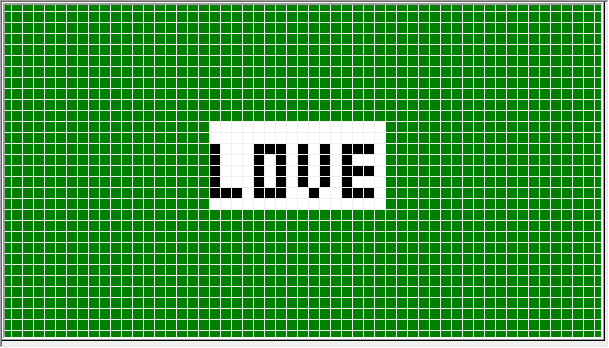
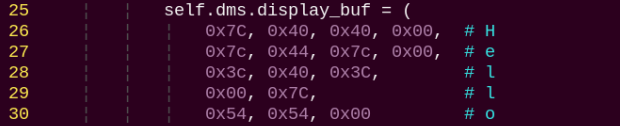

# 29. ROS2 Sensor Development Course

## 29.1 Glowy Ultrasonic Sensor Installation and Control

* **Assembly**


### 29.1.1 Getting Ready

Prepare a glowy ultrasonic sensor and connect it to any IIC interface on Raspberry Pi expansion board with 4PIN wire as the picture shown.


:::{Note}

4PIN wire adopts anti-reverse plug in design, please don't insert violently.

:::

### 29.1.2 Glowy Ultrasonic Sensor Introduction

The ultrasonic ranging chip integrates ultrasonic transmitting circuit, receiving circuit, digital processing circuit, etc. This module adopts IIC communication interface through which the measured distance can be read.

Besides, on each probe, there is RGB light whose brightness can be adjusted and parameters of color channel can be modified to change the color.  

### 29.1.3 Program Logic

Firstly, set the distance range. Then control RGB colored light to light on or get out though the change of the level. Lastly, control the color of light through changing the parameter of color channels.

The source code of this program is stored in [ros2_ws/example/example/puppypi_with_sensor/sonar_avoidance.py]()

### 29.1.4 Operation Steps

:::{Note}

Commands must be entered with strict attention to capitalization and spaces.

:::

(1) Power on the robot, then follow the steps in  [3.3 Docker Container Introduction and Entry]() and [3.4 ROS Version Switch Tool Guide]() to connect via the VNC remote control software and switch to the ROS 2 environment.

(2) Click  at upper left corner to to open Terminator ROS2. 

(3) Run the following command to disable the ros node.

```
~/.stop_ros.sh
```

(4) Execute the following command to star the game.

```
ros2 launch example sonar_control_demo.launch.py
```

(5) If need to close this program, we can press **Ctrl+C**. If it fails to close, please try again.

### 29.1.5 Program Outcome

After the program starts, place an obstacle in front of the glowy ultrasonic sensor. Then the measured distance will be printed on the terminal. And the RGB colored light will illuminate in corresponding color according to the distance.

**Distance ≤ 300mm**: red light on.

**300mm≤ Distance ≤ 500mm**: green light on.

**Distance ≥500mm**: blue light on.


### 29.1.6 Function Extension

* **Modify Distance Range**

The corresponding distance range of different light colors can be modified. For example, we set green light to turn on when **300<distance<550**, and blue light to turn on when **distance>550**.

(1) Click  at upper left corner to open Terminator.

(2) Enter the following command to switch to the directory containing the programs:

```
cd ros2_ws/src/example/example/puppypi_with_sensor
```

(3) Enter the following command and press Enter to open the gameplay program file:

```python
vim sonar_control_demo.py
```

(4) Locate the code section highlighted in the image below. Press the “**i**” key to enter edit mode.


(5) Modify the data as illustrated.


(6) When you finish editing, press the "**Esc**" key. Then type "**:wq**" (with a colon) and press Enter to save your changes and exit.

* **Customizing RGB Light Colors**

You can also change the color of the RGB lights. This example demonstrates how to change the light color from red to yellow by following these steps:

(1) Refer to steps (1) and (2) in Section 6.1: Adjust the Detection Distance for the RGB Light to open the gameplay program file.

(2) In the opened file, locate the code segment highlighted below. Press the "**i**"key to enter edit mode.


(3) Adjust the RGB values to change the light color. 

Replace `s.setRGB(1,(255,0,0))` and `s.setRGB(0,(255,0,0))` with `s.setRGB(1,(255,255,0))`and `s.setRGB(0,(255,255,0))` as shown in the example.


:::{Note}

RGB values correspond to the intensity of Red, Green, and Blue components of a color. By mixing these primary colors in varying proportions, any color can be produced. When the values are similar, the color tends toward gray or white/black tones. Higher values produce lighter colors (closer to white), while lower values produce darker colors (closer to black).

:::

(4) After modification, press **Esc**, input **:wq** and press Enter to save the modified data.


## 29.2 Glowy Ultrasonic Sensor Installation and Distance Ranging

* **Assembly**


### 29.2.1 Getting Ready

Prepare a ultrasonic sensor and connect it to any IIC interface on Raspberry Pi expansion board with 4PIN wire as the picture shown.


:::{Note}

4PIN wire adopts anti-reverse plug in design, please don't insert violently.

:::

### 29.2.2 Ultrasonic Sensor Introduction

The ultrasonic ranging chip integrates ultrasonic transmitting circuit, receiving circuit, digital processing circuit, etc. This module adopts IIC communication interface through which the measured distance can be read.

Besides, on each probe, there is RGB light whose brightness can be adjusted and parameters of color channel can be modified to change the color.

### 29.2.3 Program Logic

Firstly, set the distance range. Then judge whether there is obstacle ahead through the change of level. Next, program PuppyPi to execute different actions based on the previous judgement.

The source code of this program is stored in the Docker container: [ros2_ws/src/example/example/puppypi_with_sensor/sonar_avoidance.py]()

### 29.2.4 Operation Steps

(1) Power on the robot, then follow the steps in  [3.3 Docker Container Introduction and Entry]() and [3.4 ROS Version Switch Tool Guide]() to connect via the VNC remote control software and switch to the ROS 2 environment.

(2) Click  at upper left corner to initiate the Terminator ROS2.

(3) Run the following command to disable the ros node.

```
~/.stop_ros.sh
```

(4) Execute the following command to start the game.

```
ros2 launch example sonar_avoidance.launch.py
```

### 29.2.5 Program Outcome

After the program starts, place an obstacle in front of the glowy ultrasonic sensor. Then the measured distance will be printed on the terminal. When distance is greater than 300mm, RGB light will emit blue light and PuppyPi will keep moving forward. When the distance is less than or equal to 300mm, RGB light will emit red light and PuppyPi will keep turning left.


### 29.2.6 Function Extension

* **Adjust the Detection Distance for the RGB Light**

You can change the distance range that triggers a specific RGB color. In this example, we'll modify the condition for lighting green from distance < 300 to distance < 200. Follow these steps:

(1) Open the **Terminator** terminal by clicking its icon  on the desktop.

(2) Navigate to the program directory by entering the following command and pressing Enter:

```
cd ros2_ws/src/example/example/puppypi_with_sensor
```

(3) Open the program file with the following command:

```
vim sonar_avoidance.py
```

(4) Find the section of code that sets the detection distance. Press `i` to enter edit mode.


(5) Change the value from 300 to 200 as needed.


(6) After editing, press **Esc**, then type **:wq** and press **Enter** to save and exit the editor.

```
:wq
```

* **Customizing RGB Light Colors**

You can also change the color of the RGB lights. This example demonstrates how to change the light color from red to yellow by following these steps:

(1) Refer to steps (1) and (2) in [29.2.6 Function Extension/Adjust the Detection Distance for the RGB Light]() to open the gameplay program file.

(2) In the opened file, locate the code segment highlighted below. Press the `i` key to enter edit mode.


(3) Adjust the RGB values to change the light color. Replace `s.setRGB(1,(255,0,0))` and `s.setRGB(0,(255,0,0))` with `s.setRGB(1,(255,255,0))` and `s.setRGB(0,(255,255,0))` as shown in the example.


:::{Note}

RGB values correspond to the intensity of Red, Green, and Blue components of a color. By mixing these primary colors in varying proportions, any color can be produced. When the values are similar, the color tends toward gray or white/black tones. Higher values produce lighter colors (closer to white), while lower values produce darker colors (closer to black).

:::

(4) Once the changes are complete, press **Esc**, then type **:wq** (including the colon) and press **Enter** to save and exit the editor.

```
:wq
```

(5) Run the following command to start the game.

```
ros2 launch example sonar_avoidance.launch.py
```

## 29.3 Touch Sensor Installation and Sensing

* **Assembly**


### 29.3.1 Getting Ready

Prepare a touch sensor and connect it to **5V GND IO22 IO24** interface on Raspberry Pi expansion board with 4PIN wire as the picture shown.


:::{Note}

4PIN wire adopts anti-reverse plug in design, please don't insert violently.

:::

### 29.3.2 Touch Sensor Introduction

Based on capacitive sensing, Hiwonder touch sensor can sense the touch from human body or metal. In addition, the contact between plastic, paper and other materials of certain thickness can also be sensed. Its sensitivity is related to contact area and material thickness.

After powering, signal terminals OUT will output high-level signal when sensor does not sense the touch signal. When the touch signal is sensed, signal terminal OUT will output low-level signal. It is applicable in switch control, such as light switch and doorbell touch buttons. The holes on the module are compatible with Lego for more creative DIY designs.

### 29.3.3 Program Logic

When sensing the touch, touch sensor will output high level, otherwise out low level. We can judge the status of the sensor through the level change of I/O interface.

The source code of this program is stored in the Docker container [ros2_ws/src/example/example/puppypi_with_sensor/touch_detect_demo.py]()

GPIO.input function is used to acquire the value given by touch sensor so as to judge the status of the sensor.

### 29.3.4 Operation Steps

(1) Power on the robot, then follow the steps in  [3.3 Docker Container Introduction and Entry]() and [3.4 ROS Version Switch Tool Guide]() to connect via the VNC remote control software and switch to the ROS 2 environment.

(2) Click  at upper left corner to initiate the Terminator ROS2 terminal.

(3) Disable the ros node by entering the following command:

```
~/.stop_ros.sh
```

(4) Execute the following command to start the game.

```
ros2 launch example touch_detect_demo.launch.py
```

### 29.3.5 Program Outcome

After the program starts, buzzer will beep once when sensing the touch on metal plate.

## 29.4 Dot-matrix Installation and Display

* **Assembly**


### 29.4.1 Getting Ready

Prepare a dot matrix display and connect it to **5V GND IO7 IO8** interface on Raspberry Pi expansion board with 4PIN wire as the picture shown.


:::{Note}

4PIN wire adopts anti-reverse plug in design. Please do not insert it to the interface violently.

:::

### 29.4.2 Dot Matrix Display Introduction

Dot matrix display module composed of two 8x8 LED dot matrix screens, which can be controlled through driving the control chip. It features high brightness, no-flicker display, convenient wiring, etc. And it can display various content, including number, text, pattern, etc.

### 29.4.3 Program Logic

In this program, a set of hexadecimal data is used to control the dot matrix screen to display the content. A set of hexadecimal data consists of 16 data each of which controls a column of LED.


It is simple to set the data. For example, control the dot matrix display to display **Hello**.


The parameter in brackets of 32nd and 33rd line are the array for setting the displayed pattern. The converted binary number of its first element `0x7f` is 01111111 which represents the light status, that is off on on on on on on on.

As the same, the rest 15 elements are also for controlling the LED lights to display "**Hello**".

:::{Note}

You can find "Instructions for Using the Font Software" in the same directory of this section, where you can quickly obtain control arrays using the font software.

:::

The source code of this program locates in the Docker container: [ros2_ws/src/example/example/puppypi_with_sensor/lattice_display_demo.py]()


### 29.4.4 Operation Steps

(1) Power on the robot, then follow the steps in  [3.3 Docker Container Introduction and Entry]() and [3.4 ROS Version Switch Tool Guide]() to connect via the VNC remote control software and switch to the ROS 2 environment.

(2) Click  to initiate the Terminator ROS2 terminal.

(3) Enter the following command and press Enter to start the game.

```
~/.stop_ros.sh
```

(4) Enter the following command to start the game.

```
ros2 launch example lattice_display_demo.launch.py
```

### 29.4.5 Project Outcome

After the program runs, the dot matrix display will display **Hello** for 5s. Then, the program will automatically exit and the dot matrix display will be closed.


### 29.4.6 Function Extension

The current displayed content is **Hello**. If you need to modify the content, like **Love**, please follow the below steps to operate.

Before modification, we need to obtain the address of the character on the dot matrix display through the Internet.

(1) Double-click to open the CharacterMatrix software in this directory.


(2) First, click on "New Image", then in the pop-up settings box, set the size parameters for the dot matrix module. Here, set it to "16*8". After setting, click "OK".


(3) Then click "Simulated Animation" and "Enlarge Grid" in order to enlarge the dot matrix simulation area on the right side.


(4) Then, use the mouse to click and draw the display content in the right area.



(5) After finishing the drawing, click "Modeling Method" and then "51 Format" in sequence to obtain the address symbol (please remember the address symbol for the subsequent steps).


(6) Open a new command-line terminal by clicking the icon . Then enter the following command to navigate to the directory containing the programs.

```
cd ros2_ws/src/example/example/puppypi_with_sensor
```

(7) Run the command below to access the program file.

```
vim lattice_display_demo.py
```

(8) Locate the code as indicated.


(9) Press `i` key on the keyboard to enter the editing mode.


(10) Replace the default address symbol in the program with the address symbol obtained from the font software, as shown in the following figure:



(11) After modification, press **Esc** and enter **:wq** and the press Enter to save the modified content

```
:wq
```

## 29.5 Touch Sensor Installation and Detection


* **Touch Detection**

### 29.5.1 Preparation

Prepare a touch sensor and connect it to **5V GND IO22 IO24** interface on Raspberry Pi expansion board with 4PIN wire as the picture shown.


:::{Note}

4PIN wire adopts anti-reverse plug in design, please don't insert violently.

:::

### 29.5.2 Touch Sensor Introduction

Based on capacitive sensing, Hiwonder touch sensor can sense the touch from human body or metal. In addition, the contact between plastic, paper and other materials of certain thickness can also be sensed. Its sensitivity is related to contact area and material thickness.

After powering, signal terminals OUT will output high-level signal when sensor does not sense the touch signal. When the touch signal is sensed, signal terminal OUT will output low-level signal. It is applicable in switch control, such as light switch and doorbell touch buttons. The holes on the module are compatible with Lego for more creative DIY designs.

### 29.5.3 Program Logic

When sensing the touch, touch sensor will output high level, otherwise out low level. We can judge the status of the sensor through the level change of I/O interface.

The source code of this program is saved in the Docker container [ros2_ws/src/example/example/puppypi_with_sensor/touch_control_demo.py]()

**GPIO.input** function is used to acquire the value given by touch sensor so as to judge the status of the sensor.

### 29.5.4 Operation Steps

(1) Power on the robot, then follow the steps in  [3.3 Docker Container Introduction and Entry]() and [3.4 ROS Version Switch Tool Guide]() to connect via the VNC remote control software and switch to the ROS 2 environment.

(2) Click  at upper left corner to open the Terminator ROS2 terminal.

(3) Enter the following command to disable the ros code.

```
~/.stop_ros.sh
```

(4) Enter the following command to start the game.

```
ros2 launch example touch_control_demo.launch.py
```

(5) If need to close this program, we can press **Ctrl+C**. If it fails to close, please try again.

### 29.5.5 Program Outcome

After the program starts, PuppyPi will keep standing. When we first touch the metal plate of touch sensor, PuppyPi will squat when sensing the touch. When we touch the metal plate twice, PuppyPi will shake.

