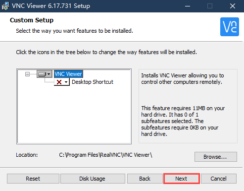
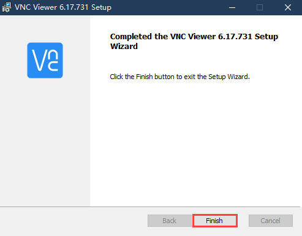
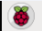
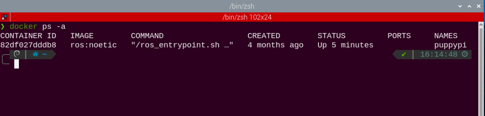
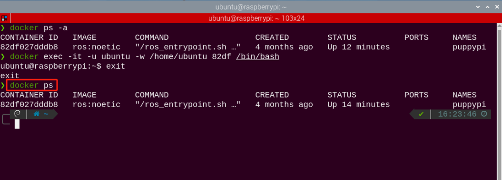
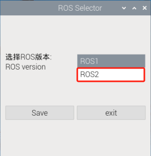
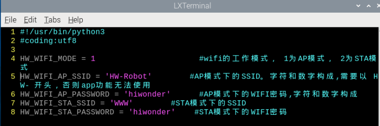

#  3. Remote Tool Installation and Docker Entry Method

<p id="anchor_3_1"></p>

## 3.1 VNC Installation and Connection

### 3.1.1 Preparation

* **Hardware**

Prepare a computer. If you are using desktop computer, wireless network card is required. The network card should support 5G band.

* **Install VNC**

VNC is a graphical remote desktop control software. Through connecting your computer to the WiFi generated by Raspberry Pi, you can control Raspberry Pi. Installation of VNC is as below.

(1) Double-click the installation program **"VNC-Viewer-6.17.731-Windows"** in the same directory as this section. Select the installation language as "**English**" and lick "**OK**".


(2) Click "**Next**".


(3) Tick **"I accept the terms in the License Agreement"**. Then click **"Next"**.


(4) Remain default location where the software is installed. Click **"Next"** to proceed next interface. Then directly click **"Install"**.



(5) When the installation completes, click **"Finish"**.



(6) Click  to open VNC.

* **Start Robot**

Start Robot When LED1 on expansion board starts flickering and buzzer emits one beep, robot boots up successfully.

### 3.1.2 Connect to Robot

(1) After turning Robot on successfully, the default mode is AP direct connection mode. Robot generates a WiFi starting with HW. Connect your computer to this WiFi.


(2) Input password. The password is **"hiwonder"**.


(3) After connection, open VNC Viewer. Input the default IP address of Raspberry Pi, **192.168.149.1**, and then press Enter. If you receive security warning, select **"Continue"**.


(4) Input username and password. **(Username: pi;Password: raspberrypi)**. Click **"OK"** to enter Raspberry Pi desktop.


(5) The desktop is as pictured. If black screen occurs or only cursor leaves on the screen, restart Raspberry Pi.


### 3.1.3 Introduction to Desktop

The desktop is as pictured after connecting Robot through VNC successfully.


The following table demonstrates common functions:

<table  class="docutils-nobg" border="1">
<colgroup>
<col  />
<col  />
</colgroup>
<tbody>
<tr>
<td >Icon</td>
<td >Function</td>
</tr>
<tr>
<td ></td>
<td ><p>Application menu. Click to select different applications.</p>
<p></p></td>
</tr>
<tr>
<td ></td>
<td >Browser.</td>
</tr>
<tr>
<td ></td>
<td >File manager.</td>
</tr>
<tr>
<td ></td>
<td >LX terminal. Click to input command line in the opened interface.</td>
</tr>
<tr>
<td ></td>
<td >Trash. You can find the files deleted here.</td>
</tr>
<tr>
<td ></td>
<td >PC software. You can adjust pan tilt and adjust color threshold on it.</td>
</tr>
<tr>
<td ></td>
<td >Full screen or exit full screen.。</td>
</tr>
<tr>
<td ></td>
<td >Exit full screen.</td>
</tr>
<tr>
<td ></td>
<td ><p>Shut down, reboot and logout</p>
<p></p></td>
</tr>
</tbody>
</table>

## 3.2 Brief Instruction to System Directory

### 3.2.1 Desktop Layout

After remotely connecting to VNC, Raspberry Pi system desktop is as follow:


Desktop mainly includes the following programs:

|                                                 Icon                                              | Function |
|:-------------------------------------------------------------------------------------------------------:|:--:|
|  | PuppyPi PC Software contains action programming and calling functions, etc. |
|  | Color model parameter adjustment tool |
|  | Command line terminal, which is used to input command to operate |
|  | Command line terminal ROS2, which is used to input command to operate |
|  | Version configuration tool, used to switch between ROS1 and ROS2 functions |
|  | Trash |
|  | Application menu |
|  | System file management |

### 3.2.2 Program Structure

:::{Note}

The entered command should be case sensitive, as well as spaces. And **"TAB"** key can auto-complement key words.

:::

(1) Click the icon on the top left corner of the desktop to open the command line terminal.

(2) Input "**ls**" command, then press enter to list all the current files.

```bash
ls
```


|     **Name**     |                      **Function**                      |
| :--------------: | :------------------------------------------------: |
|     puppypi      | Store PuppyPi's debugging scripts and other files. |
| hiwonder-toolbox |               Wi-Fi management tool                |

Since the functionalities, play features, and source code of PuppyPi are all stored in a Docker container, you need to enter the container to view them.

(1)  Click the icon  on the upper left corner to open the Terminator terminal.


(2) In the command line terminal, enter the command "**docker ps -a**" and press Enter to display the currently running and previously run containers. The container id is the ID of the container, the image is the name of the image used by the container, created is the container creation time, and status is the current state of the container.

```bash
docker ps -a
```



(3) Based on the obtained container ID (unique), enter the command "**docker exec -it -u ubuntu -w /home/ubuntu 82df /bin/bash**" (The container ID can be abbreviated as long as it uniquely identifies the container) to access the container containing the functional programs.

```bash
docker exec -it -u ubuntu -w /home/ubuntu 82df /bin/bash
```


(4) Enter the command "**ls**" and press Enter to list all the current files. Focus on these two directories, as shown below:

```bash
ls
```


|   Name   |                           Function                           |
| :------: | :----------------------------------------------------------: |
| puppypi  | The ROS workspace storing PuppyPi's functionalities and play features |
|  share   |        The shared drive with the Raspberry Pi system         |
| softwave | Store the upper computer and color threshold adjustment tools, etc. |

(5) Next, you will proceed the game and program source code directory. Input command to list all the folders and files of this directory.

```bash
cd puppypi/src/
```

```bash
ls
```


The following table is the program directory:

|           Name           |                           Function                           |
| :----------------------: | :----------------------------------------------------------: |
| puppy_advanced_functions | Store the program used in "**9. Ros Robot Comprehensive Development Course**" |
|      puppy_control       |           Store gait, joystick and other programs.           |
| puppy_standard_functions |            Store "**8. ROS Robot AI Visual Course**".            |

The following table lists game files and their corresponding descriptions:

|      Name       |       Function        |
| :-------------: | :-------------------: |
| apriltag_detect |    Tag recognition    |
|  color_detect   |   Color recognition   |
|   face_detect   |    Face detection     |
| object_tracking |    Target tracking    |
|  visual_patrol  | Visual Line Following |

## 3.3 Docker Container Introduction and Entry

### 3.3.1 Docker Introduction

Docker, an open-source platform and tool, helps you to package, distribute, and run apps within containers. Container is a lightweight, independent, executable software package that includes the application code, runtime environment, system tools, system libraries and settings. Docker allows developers to package applications along with their dependencies, not just the application itself, facilitating rapid and consistent deployment across different environments. 
In technical terms, Docker utilizes Linux containerization technology of operating system, making the isolation between applications more efficient. And it can run multiple containers on the same physical machine, with each container being independent and not affecting each other.
After all, Docker can be understood as a tool that makes applications and their dependencies more portable and easier to manage, bringing great convenience to software development and deployment.


<p style="margin:0 auto 24px">Docker Sign</p>

You can go to "**Docker Container Basic Course**" or relevant Docker websites to learn Docker.

Docker official website：[http://www.docker.com](http://www.docker.com)

Docker Chinese website：[https://www.docker-cn.com](https://www.docker-cn.com)

Docker Hub (warehouse) official website：[https://hub.docker.com](https://hub.docker.com)

### 3.3.2 Docker General Commands

All the games and programs of this product will be run in the Docker container. In order to help users to quickly understand and get started with this product, the following introduces the general commands of Docker. 

(1) Start up the device and connect it with VNC remote connection tool according to "[**3.1 VNC Installation and Connection**](#anchor_3_1)".

(2)  Click the icon  on the left top corner of the system desktop to open Terminator terminal. 

<p id="anchor_3_3_2_1"></p>

* **Check Containers**

Command parameters instruction：`docker ps [OPTIONS]`

General parameters instruction:

(1) -a ：list all currently running containers + containers that have been run in the past.

(2) -l ：display recently created containers

(3) -n=? ：display recently created n containers

(4) -q ：silent mode, only display container number

In the command line terminal, enter "**docker ps -a**" to display running and previously run containers. "**container id**" is the ID of containers, "**image**" is the image name of this container, "**created**" is the created time of the container, "**status**" is current state of container.

```bash
docker ps -a
```


* **Enter Containers**

According to "[**3.3.2 Docker General Commands -> Check Containers**](#anchor_3_3_2_1)" to get container ID (the only one). Input command "**docker exec -it -u ubuntu -w /home/ubuntu 82df /bin/bash**" to enter the container where the functional program is installed. The container ID can be abbreviated as long as it is the unique identification of this container.

```bash
docker exec -it -u ubuntu -w /home/ubuntu 82df /bin/bash
```


* **Exit Containers**

There are two commands to exit containers:

(1) Input "**exit**" directly in terminal and press enter key. While the container will stop running and exit.

```bash
exit
```


(2) Use the shortcut key combination **"ctrl+P+Q"**. The container will exit directly but remain running. You can input command "**docker ps**" in terminal to check the running containers. 

```bash
docker ps
```



### 3.3.3 Convenient Tool Usage (MUST READ)

It is inconvenient to input command in the terminator terminal every time. Therefore, you can set command to enter the container in the terminator tool. 


(1)  Right-click the terminator window, and click "**Preference**".


(2) Select **"Profiles->Command"**.


(3)  In the  column, input command **"xhost + && docker exec -it -u ubuntu -w /home/ubuntu puppypi /bin/zsh"** to enter the container. 

:::{Note}

82df is the container ID of the container with the functional games.

:::

```bash
xhost + && docker exec -it -u ubuntu -w /home/ubuntu puppypi /bin/zsh
```


(4)  Then click to close. In this way, every time you open the terminal, you can enter directly to the container with the functional program. 


## 3.4 ROS Version Switch Tool Guide

PuppyPi leverages Docker container technology to support both ROS1 and ROS2 functionalities within the system. By default, ROS1 is enabled. Before switching, please ensure you are clear on which ROS version is required for your application to ensure smooth and efficient operation.

If you need to switch between ROS1 and ROS2, simply follow the steps outlined below.

(1) **Power on the robot** and establish a connection to the remote control software **VNC**. For detailed instructions on how to connect via remote desktop, refer to: [3.1 VNC Installation and Connection](#anchor_3_1)

(2) Once connected to the remote desktop, **double-click**  Then, click the **"Execute"** button to launch the tool.


(3) In the interface, locate the option **"Select ROS Version"** and choose the desired ROS version you wish to switch to, as shown in the red box in the image.


①　**ROS1** refers to the ROS1 system.

②　**ROS2** refers to the ROS2 system.

(4) For example, to switch to **ROS2**, select the option highlighted in the red box in the image.



(5) After making your selection, click **"Save"** to apply the changes.


(6) Wait a moment for a confirmation dialog to appear. This indicates that the system environment has been successfully switched to ROS2.


(7) Click **"OK"** to close the confirmation dialog, then click **"Exit"** to exit the ROS version switch tool.


(8) **Double-click**  (as shown in the image) and click **"Execute"** to start the process.


(9) Once the environment has refreshed, if the information displayed matches the image shown, this confirms that you have successfully entered the **ROS2 development environment**.


(10) To switch back to **ROS1**, refer to step 3 and select the appropriate **ROS1 version** from the **"Select ROS Version"** dropdown menu.

## 3.5 Network Configuration Overview

This tutorial uses the MasterPi Pi5 version as an example, and it applies to other Pi5 models in this series as well.

The robot's network can be configured in two modes:

**① AP Mode:** The controller creates a hotspot that can be connected to by a smartphone. (Note: This mode does not connect to the external internet.)

**② STA mode:** The controller connects directly to a specified hotspot/Wi-Fi network. (This mode allows access to the external internet.)

By default, the robot operates in AP (direct connection) mode. The features and functions of the robot remain the same whether in AP mode or STA (local area network) mode.

### 3.5.1 AP Direct Connection Mode

* Mode Switching through Phone

Using t**he Android system** as an example, these instructions also apply to iOS.

(1) Open the "**WonderPi**" app on your phone. Then, go to "**Basic**" and select "**MasterPi**".


(2)  Tap the "**+**" button in the bottom right corner of the screen, and choose **"Direct Connection Mode".**


(3) Tap **"Connect to Device Hotspot"**. This will take you to your phone's settings to connect to the hotspot created by the robot.


(4) Look for a hotspot name starting with "**HW**". The password is "**hiwonder**".


:::{Note}
for iOS: Wait until the Wi-Fi icon  appears in your phone's status bar before returning to the app. If you don't see the device listed, you can refresh by tapping the refresh icon  in the upper-right corner of the app.
:::

(5) Return to the app, and tap the robot icon to enter the mode selection screen.


:::{Note}
If a pop-up message appears saying "**Network Unavailable, Continue Connection?**", simply tap "**Keep Connection**".
:::

(6) If you see a prompt asking **"Switch to and Enter Found Device Screen?",** it indicates that an incorrect product version was selected in Step 1. Tap "**OK**" to switch directly to the correct version's mode selection screen.


(7)  The mode selection screen appears as shown below:


For details on each mode, refer to the documentation provided earlier.

<p id="anchor_1_2_2"></p>

### 3.5.2 Switching via Network Configuration File

(1) Power on the robot and connect it to the remote control software, VNC.

(2) Double-click the terminal icon  on the desktop to open the command line terminal.

(3) Enter the command and press Enter to navigate to the configuration file directory.

```bash
cd hiwonder-toolbox/
```

(4) Enter the command  and press Enter to open the configuration file.

```bash
vim wifi_conf.py
```

:::{Note}
The configuration file defaults to AP Direct Connection Mode. If all code lines are commented out, it will be set to AP Direct Connection Mode.
:::


(5) If there are multiple devices nearby, you can modify **"HW_WIFI_AP_SSID"** and **"HW_WIFI_AP_PASSWORD"** to set a unique name and password for each device. For example, use **"HW-Robot"** as the name and **"hiwonder"** as the password, as shown below.



(6) After verifying the entries, press the ESC key, then type **:wq** to save and exit the file.

(7) Change the value of `HW_WIFI_AP_GATEWAY` to set a new IP address, such as **'192.168.149.2'** for example.

```bash
vim wifi.py
```

(8) After confirming the entries, press the ESC key, then type "**:wq**" to save and exit the file.


(9) After confirming the entries, press the ESC key, then type **":wq"** to save and exit the file.

(10) Enter the command to restart the robot's Wi-Fi service.

```bash
sudo systemctl restart hw_wifi.service
```

(11) Wait for the service to restart. You should see that the hotspot has been successfully updated.


(12) To connect using VNC, enter the new IP address in the search bar, and click on the connection icon that appears. Log in with the username "**pi**" and password "**raspberry**", then click "**OK**" to access the system desktop. (For the Pi5 version, the username is the same as the 4B version, but the password is **"raspberrypi"**.)


<p id="anchor_1_3"></p>

## 3.6 Connecting in LAN Mode (optional)

:::{Note}

* To configure the LAN mode using a smartphone, you must first enable the phone's location services.
* Switching to LAN mode cannot be done directly through the system's network settings, as the Wi-Fi has custom configurations. Please follow the instructions in Section 1.3.2 to switch modes using the network configuration file.

:::

### 3.6.1 Switching via the Mobile App

:::{Note}
For LAN mode, please enable location services on your smartphone.
:::

(1) First, connect your phone to Wi-Fi. In this example, we connect to **"Hiwonder_5G"** Wi-Fi. (For dual-band routers with separated frequencies, the Wi-Fi names may differ, such as **"Hiwonder"** for the 2.4G band and **"Hiwonder_5G"** for the 5G band.)


(2) Open the "**WonderPi**" app on your phone, then select **"Basic"** and "**MasterPi**".


(3) Tap the "**+**" button in the bottom right corner, and choose **"LAN Mode".**


(4) The app will prompt you to enter the password for the connected Wi-Fi network. (Please ensure the password is correct, as an incorrect password will result in connection failure.) After entering the password, tap "**OK**".


(5) Tap "**Connect to Device Hotspot**".


(6) Your phone will automatically navigate to the Wi-Fi settings page. Find the hotspot starting with "**HW**" and enter the password **"hiwonder"**. Once connected, tap the "**Return**" button.


(7) The app will now begin the connection process.


(8) After a short wait, the robot's icon will appear on the main screen, and the LED on the expansion board will remain steadily lit.


(9) Press and hold the robot icon in the app to view the robot's assigned IP address and device ID.

(10) Use a remote desktop tool to search for the robot's IP address and connect to the remote desktop.

(11) To switch back to direct connection mode from LAN mode, press and hold the KEY1 button on the expansion board until the blue LED flashes, indicating that the switch is complete.

### 3.6.2 Switching via Network Configuration File

(1) Power on the robot and connect it to the remote control software, NoMachine.

(2) Click the terminal iconat the top of the system screen to open the command line terminal.

(3) Enter the command and press Enter to access the configuration file directory.

```bash
cd hiwonder-toolbox
```

(4) Enter the command and press Enter to open the configuration file

```bash
vim wifi_conf.py
```

(5) First, change the value of "**HW_WIFI_MODE**" to 2:

① 1 represents Direct Connection Mode

② 2 represents LAN Mode

③ 3 represents Direct Sharing Mode

```py
HW_WIFI_MODE = 2    #wifi的工作模式，1为AP模式，2为STA模式
```

(6) Next, modify **"HW_WIFI_STA_SSID"** and **"HW_WIFI_STA_PASSWORD"** to match your router's Wi-Fi name and password.

:::{Note}
 Selecting a 5G Wi-Fi signal will provide higher transfer speeds. If there is lag on standard Wi-Fi, consider switching to a 5G signal.
:::


(7) After confirming the entries are correct, press the ESC key, then type **":wq"** to save and exit the file.

(8) Enter the command to restart the robot's Wi-Fi service.

```bash
sudo systemctl restart wifi.service
```

(9) To switch back to Direct Connection Mode, edit the configuration file again, comment out all lines, save, and restart.