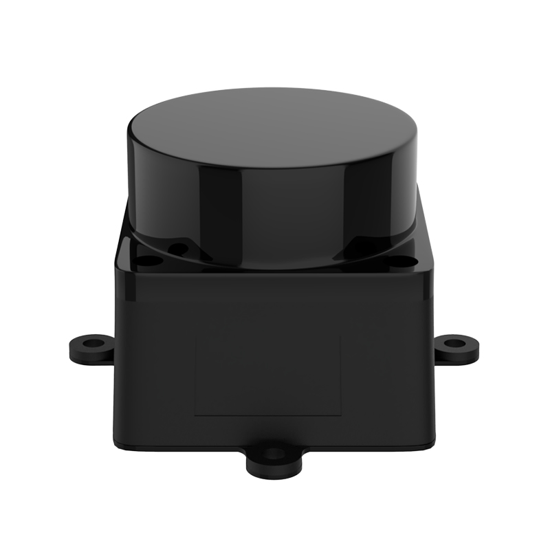
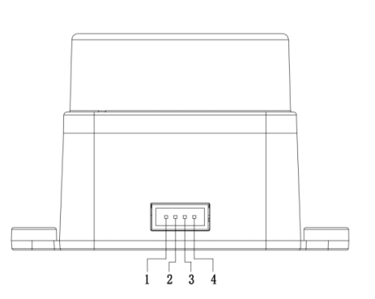
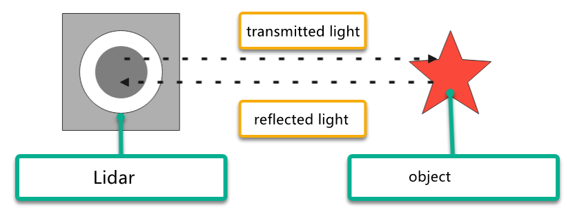

# 30. ROS2-Lidar Course

## 30.1 Introduction to Lidar

### 30.1.1 Lidar Description

Lidar is a remote sensing device that utilizes laser technology to detect the position and speed of targets. Lidar offers high-ranging resolution, strong penetrability, excellent anti-interference ability, and remarkable anti-stealth capability.

There are three types of Lidar based on ranging principles: Triangulation Lidar, Pulse Lidar, and Coherent Lidar. The Lidar used by PuppyPi is a Pulse Lidar.



### 30.1.2 Lidar Working Principle

Lidar is composed of laser emitting system, scanning system, laser receiving system and signal processing system.

Firstly, laser emitting system will send the detection signal (laser beam), and the scanning system takes charge of scanning the surrounding to receive the related information.

Next, the laser receiving system will receive the laser reflected by the target object to generate receiving signal.

Lastly, the signal system will process the receiving signal to get the features of the target, such as shape and physical properties (position, height and speed), then build the model.

### 30.1.3 Lidar Parameter

The specifications of the laser radar used in the PuppyPi robot dog are as follows:

* **Electrical and Mechanical Parameters**


* **Optics Parameter**


* **Performance Parameter**


* **Interface and Communication Protocol**

LD19 connects to the external system through ZH1.5T-4P 1.5mm connector to supply power and receive data. And the specific interface and parameter are listed on the table.




* **Serial Port Specification**

You can connect Lidar to external system through the interfaces on Lidar. Based on communication protocol, it can acquire the point cloud data, device information and device status in real-time. And you can also set the working mode.


## 30.2 Lidar Ranging Principle

### 30.2.1 Lidar Ranging

Lidar can range the distance in two ways, including triangulation ranging and TOF.

The working principle of TOF is as pictured. Firstly, Lidar will cast the light on the object, and the object will reflect the light on the Lidar. Then Lidar will calculate the time taken for light to return, and multiply the time times the speed of light to get the distance between object and it.



Triangulation ranging is as the picture shown. During Lidar production, its angle of light casting on the object will be adjusted to let the light not directly hit on the object, but at a certain angle. This angle is set in advance and will not change during operation. And we can calculate the distance from the object to the Lidar by substituting this angle into the trigonometric function.


### 30.2.2 Lidar Working Result

Its working result is as follows. Lidar will emit light and shine it on the object surface. When receiving the light reflected by the object, Lidar will mark the contour of the object at the position where the light is reflected.


## 30.3 Lidar Obstacle Avoidance

### 30.3.1 Function Overview

The PuppyPi robot is designed to track objects directly in front of it. If the target deviates more than 10 degrees from the center of its field of view, the robot will rotate in place to realign with the target. Additionally, when an obstacle is detected, PuppyPi will automatically steer away to avoid a collision.

### 30.3.2 Operation Steps

(1) Power on the robot, then follow the steps in  [3.3 Docker Container Introduction and Entry]() and [3.4 ROS Version Switch Tool Guide]() to connect via the VNC remote control software and switch to the ROS 2 environment.

(2) Click the upper left icon  to open Terminator terminal.

(3) Input the following command and press Enter to terminate all ROS2 node.

```bash
~/.stop_ros.sh
```

(4) Open a new command-line terminal, and execute the following command to initiate the Lidar game.

```bash
ros2 launch app lidar_node.launch.py
```

(5) Input the command below and press Enter to start the Lidar game.

```bash
ros2 service call /lidar_app/enter std_srvs/srv/Trigger {}
```

(6) After a successful startup, enter the following command and press Enter to enable the Lidar obstacle avoidance feature.

```bash
ros2 service call /lidar_app/set_running puppy_control_msgs/srv/SetInt64 data:\ 1
```

:::{Note}

 If you want to view the source code, you can find the **lidar.py** file in the **/home/ubuntu/ros2_ws/src/app/app** folder within the Docker container.

:::

(7) To stop the obstacle avoidance feature, enter the following command and press Enter:

```bash
ros2 service call /lidar_app/set_running puppy_control_msgs/srv/SetInt64 data:\ 0
```

(8) To completely exit the feature, enter the following command and press Enter:

```bash
ros2 service call /lidar_app/exit std_srvs/srv/Trigger {}
```

:::{Note}

The feature will continue to run as long as the Raspberry Pi remains powered on, unless explicitly exited. To prevent excessive memory usage, ensure the current feature is closed using the above command before starting another one.

:::

### 30.3.3 Program Outcome

Here, we use a book as the object to be detected. It is important to note that when using the lidar tracking function, the object to be detected should be higher than the scanning height of the lidar. This allows PuppyPi onboard lidar to effectively scan its position information. Then, the PuppyPi moves straight ahead. When an obstacle is detected, the PuppyPi will automatically turn to avoid the obstacle.

### 30.3.4 Program Analysis

* **Launch Brief Analysis**

The Launch file path is **[/home/ubuntu/ros2_ws/src/app/launch/lidar_node.launch.py](../_static/source_code/ros2/lidar_node.launch.zip)**

```python
from launch import LaunchDescription
from launch.actions import IncludeLaunchDescription
from launch_ros.actions import Node
from launch.launch_description_sources import PythonLaunchDescriptionSource
from ament_index_python.packages import get_package_share_directory
import os

def generate_launch_description():
    # Define the paths to the launch files
    lidar_launch_path = os.path.join(get_package_share_directory('peripherals'), 'launch', 'lidar.launch.py')
    puppy_control_launch_path = os.path.join('/home/ubuntu/ros2_ws/src/driver/puppy_control/launch', 'puppy_control.launch.py')

    return LaunchDescription([
        # Include the lidar launch file
        IncludeLaunchDescription(
            PythonLaunchDescriptionSource(lidar_launch_path)
        ),

        # Node for lidar application
        Node(
            package='app',
            executable='lidar',
            name='lidar_app',
            output='screen'
        ),
        
        # Include the puppy control launch file
        IncludeLaunchDescription(
            PythonLaunchDescriptionSource(puppy_control_launch_path)
        ),
    ])
```

First, launch the lidar with the following command: "**\$(find ldlidar)/launch/LD06.launch**". Then, start a node named lidar_app, using the lidar.py file from the lidar_app package. The parameters "output="screen"" indicate that the node's output will be displayed in the terminal, while "respawn="false"" means that the node will not restart if it unexpectedly terminates.

"**lidar.py**" is the source code file of this program, you can check it in this path "**/home/ubuntu/ros2_ws/src/app/app**".

* **Source Code Program Brief Analysis**

The source code of this program is stored in **[/home/ubuntu/ros2_ws/src/app/app/lidar.py]()**

(1) Initialization

{lineno-start=20}

```python
class LidarController(Node):
    def __init__(self, name):
        super().__init__(name)
        self.running_mode = 0  # 雷达避障模式 2: 雷达警卫模式 (1: Radar obstacle avoidance mode, 2: Radar guard mode)
        self.threshold = 0.9  # meters  距离阈值(distance threshold)
        self.scan_angle = math.radians(90)  # radians  向前的扫描角度(the forward scanning angle)
        self.speed = 0.12  # 单位米，避障模式的速度 (speed in meters per second for obstacle avoidance mode)
        self.timestamp = 0
        self.lock = RLock()
        self.lidar_sub = None
        self.heartbeat_timer = None

        # 创建Publisher
        self.velocity_pub = self.create_publisher(Twist, '/cmd_vel_nav', 10)
        self.velocity_pub.publish(Twist())

        # 创建服务
        self.enter_srv = self.create_service(Trigger, '/lidar_app/enter', self.enter_func)
        self.exit_srv = self.create_service(Trigger, '/lidar_app/exit', self.exit_func)
        self.heartbeat_srv = self.create_service(SetBool, '/lidar_app/heartbeat', self.heartbeat_srv_cb)
        self.set_running_srv = self.create_service(SetInt64, "/lidar_app/set_running", self.set_running_srv_callback)
        self.set_parameters_srv = self.create_service(SetFloat64List, "/lidar_app/adjust_parameters", self.set_parameters_srv_callback)
```

① `super().init(name)`: Invokes the constructor of the parent class to initialize the node with the specified name.

② `self.running_mode`: Defines the operating mode—1 for "Lidar Obstacle Avoidance Mode" and 2 for "Lidar Guard Mode."

③ `self.threshold`: Sets a distance threshold of 0.9 meters. In Obstacle Avoidance Mode, if an object is detected within this range, avoidance behavior may be triggered.

④ `self.scan_angle`: Specifies the scan angle, set to 90 degrees (converted to radians), representing the forward detection range.

⑤ `self.speed`: Defines the robot’s movement speed in Obstacle Avoidance Mode, measured in meters per second.

⑥ `self.timestamp, self.lock, self.lidar_sub, self.heartbeat_timer`: These components are used to manage data synchronization and locking to ensure consistent and reliable data handling.

(2) Create ROS service

```python
# 创建服务
self.enter_srv = self.create_service(Trigger, '/lidar_app/enter', self.enter_func)
self.exit_srv = self.create_service(Trigger, '/lidar_app/exit', self.exit_func)
self.heartbeat_srv = self.create_service(SetBool, '/lidar_app/heartbeat', self.heartbeat_srv_cb)
self.set_running_srv = self.create_service(SetInt64, "/lidar_app/set_running", self.set_running_srv_callback)
self.set_parameters_srv = self.create_service(SetFloat64List, "/lidar_app/adjust_parameters", self.set_parameters_srv_callback)
```

A ROS service named `/enter` has been created with the type Trigger, and the callback function is set to enter_func. When this service is called, it will execute the enter_func function.

① `self.velocity_pub = self.create_publisher(Twist, '/cmd_vel_nav', 10)`:Creates a publisher that sends movement commands (Twist messages) to the /cmd_vel_nav topic.

② `self.velocity_pub.publish(Twist())`:Sends a Twist message—typically used to stop the robot or reset its motion.

③ `self.enter_srv and self.exit_srv`:Create services of type Trigger for entering and exiting a specific mode.

④ `self.set_running_srv`:Defines a service of type SetInt64 used to change the robot's operating mode.

⑤ `self.set_parameters_srv`:Creates a service of type SetFloat64List to adjust parameters like distance threshold or scan angle.

(3) Lidar obstacle avoidance

```python
    def lidar_callback(self, lidar_data: LaserScan):
        ranges = list(lidar_data.ranges)
        ranges = [9999.0 if r < 0.05 else r for r in ranges]  # 小于5cm当作无限远(treat distances less than 5cm as infinity)
        twist = Twist()

        with self.lock:
            min_index = np.nanargmin(np.array(ranges))  # 找出距离最小值(find out the minimum value of distance)
            dist = ranges[min_index]
            angle = lidar_data.angle_min + lidar_data.angle_increment * min_index  # 计算最小值对应的角度 (calculate the angle corresponding to the minimum value)
            angle = angle if angle < math.pi else angle - math.pi * 2  # 处理角度 (handle angle)

            # 避障 (obstacle avoidance)
            if self.running_mode == 1 and self.timestamp <= time.time():
                if abs(angle) < self.scan_angle / 2 and dist < self.threshold:
                    twist.linear.x = self.speed / 6
                    twist.angular.z = self.speed * 3 * -np.sign(angle)
                    self.timestamp = time.time() + 0.8
                else:
                    twist.linear.x = self.speed
                    twist.angular.z = 0.0
                self.velocity_pub.publish(twist)
```

① `if self.running_mode == 1 and self.timestamp <= time.time()`:Checks whether the robot is in obstacle avoidance mode (`running_mode == 1`) and if the timestamp condition is met.

② `if abs(angle) < self.scan_angle / 2 and dist < self.threshold`:Determines if the target obstacle is within the forward scanning range and if the distance to the obstacle is less than the set threshold.

③ `twist.linear.x = self.speed / 6`: Sets the linear velocity to one-sixth of **self.speed**, slowing down the robot's forward movement.

④ `twist.angular.z = self.speed * 3 * -np.sign(angle)`:Sets the angular velocity to rotate the robot away from the obstacle based on its direction.

⑤ `self.timestamp = time.time() + 0.8`: Updates the timestamp to delay further obstacle avoidance actions for 0.8 seconds.

⑥ `else`: If no obstacle is within range, the robot continues to move forward with a linear velocity of **self.speed** and an angular velocity of 0.

⑦ `self.velocity_pub.publish(twist)`:Publishes the Twist message to update the robot's velocity accordingly.

### 30.3.5 Function Extension

* **Modifying the Default Threshold Distance**

(1) Open a terminal , enter the following command, and press **Enter** to navigate to the program directory:

```python
cd ros2_ws/src/app/app/
```

(2) Run the following command to open the feature script in the Vim editor:

```python
vim lidar.py
```

(3) Locate the line of code as shown in the image below:


:::{Note}

In Vim, you can quickly jump to a specific line by typing the line number followed by Shift + G. The line number shown in the image is for reference only. Please refer to the actual file.

:::

(4) Press the "**i**" key to enter edit mode. Modify the code as follows:


(5) After making the change, press **Esc**, then type the following command and press **Enter** to save and exit:

```python
:wq
```

* **Modifying the Default Obstacle Avoidance Speed**

(1) Refer to [30.3.5 Function Extension/Modifying the Default Threshold Distance]() to open the program file, then locate the code shown in the image below:


(2) Press the "**i**" key to enter edit mode. Modify the line of code to: **self.speed = 0.15**


(3) After editing, press Esc, then type the following command and press Enter to save and exit:

```python
:wq
```

## 30.4 Lidar Following

### 30.4.1 Game Overview

PuppyPi moves forward at a constant speed (default: 0.12 m/s). When an obstacle is detected within a 90-degree forward-facing range (configurable) and the distance to the obstacle is less than 0.9 meters, PuppyPi automatically adjusts its position to maintain an approximate distance of 0.35 meters from the object.

### 30.4.2 Operation Steps

(1) Power on the robot, then follow the steps in  [3.3 Docker Container Introduction and Entry]() and [3.4 ROS Version Switch Tool Guide]() to connect via the VNC remote control software and switch to the ROS 2 environment.

(2) Click the upper left icon  to open Terminator terminal.

(3) Input the following command and press Enter to terminate all ROS2 node.

```bash
~/.stop_ros.sh
```

(4) Open a new command-line terminal, and execute the following command to initiate the Lidar game.

```bash
ros2 launch app lidar_node.launch.py
```

(5) Input the command below and press Enter to start the Lidar game.

```bash
ros2 service call /lidar_app/enter std_srvs/srv/Trigger {}
```

(6) After a successful startup, enter the following command and press Enter to enable the Lidar obstacle avoidance feature.

```bash
ros2 service call /lidar_app/set_running puppy_control_msgs/srv/SetInt64 data:\ 2
```

:::{Note}

If you want to view the source code, you can find the  **lidar.py**  file in the **/home/ubuntu/ros2_ws/src/app/app** folder within the Docker container.

:::

(7) To stop the obstacle avoidance feature, enter the following command and press Enter:

```bash
ros2 service call /lidar_app/set_running puppy_control_msgs/srv/SetInt64 data:\ 0
```

(8) To completely exit the feature, enter the following command and press Enter:

```bash
ros2 service call /lidar_app/exit std_srvs/srv/Trigger {}
```

:::{Note}

The feature will continue to run as long as the Raspberry Pi remains powered on, unless explicitly exited. To prevent excessive memory usage, ensure the current feature is closed using the above command before starting another one.

:::

### 30.4.3 Program Outcome

Here, we use a book as the object to be detected. It is important to note that when using the lidar tracking function, the object to be detected should be higher than the scanning height of the lidar. This allows PuppyPi onboard lidar to effectively scan its position information. Then, the PuppyPi will adjust it’s position to maintain a distance of approximately 0.35 meters between itself and the obstacle at all times.

### 30.4.4 Program Analysis

* **Launch Brief Analysis**

The path to the launch file is located in the Docker container at: **[/home/ubuntu/ros2_ws/src/app/launch/lidar_node.launch.py](../_static/source_code/ros2/lidar_node.launch.zip)**

```python
from launch import LaunchDescription
from launch.actions import IncludeLaunchDescription
from launch_ros.actions import Node
from launch.launch_description_sources import PythonLaunchDescriptionSource
from ament_index_python.packages import get_package_share_directory
import os

def generate_launch_description():
    # Define the paths to the launch files
    lidar_launch_path = os.path.join(get_package_share_directory('peripherals'), 'launch', 'lidar.launch.py')
    puppy_control_launch_path = os.path.join('/home/ubuntu/ros2_ws/src/driver/puppy_control/launch', 'puppy_control.launch.py')

    return LaunchDescription([
        # Include the lidar launch file
        IncludeLaunchDescription(
            PythonLaunchDescriptionSource(lidar_launch_path)
        ),

        # Node for lidar application
        Node(
            package='app',
            executable='lidar',
            name='lidar_app',
            output='screen'
        ),
        
        # Include the puppy control launch file
        IncludeLaunchDescription(
            PythonLaunchDescriptionSource(puppy_control_launch_path)
        ),
    ])
```

First, launch the lidar with the following command: "**\$(find ldlidar)/launch/LD06.launch**". Then, start a node named lidar_app, using the lidar.py file from the lidar_app package. The parameters "output="screen"" indicate that the node's output will be displayed in the terminal, while "respawn="false"" means that the node will not restart if it unexpectedly terminates.

`lidar.py` is the source code file of this program, you can check it in this path "**/home/ubuntu/ros2_ws/src/app/app**".

* **Source Code Program Brief Analysis**

(1) Initialization

{lineno-start=20}

```python
class LidarController(Node):
    def __init__(self, name):
        super().__init__(name)
        self.running_mode = 0  # 雷达避障模式 2: 雷达警卫模式 (1: Radar obstacle avoidance mode, 2: Radar guard mode)
        self.threshold = 0.9  # meters  距离阈值(distance threshold)
        self.scan_angle = math.radians(90)  # radians  向前的扫描角度(the forward scanning angle)
        self.speed = 0.12  # 单位米，避障模式的速度 (speed in meters per second for obstacle avoidance mode)
        self.timestamp = 0
        self.lock = RLock()
        self.lidar_sub = None
        self.heartbeat_timer = None

        # 创建Publisher
        self.velocity_pub = self.create_publisher(Twist, '/cmd_vel_nav', 10)
        self.velocity_pub.publish(Twist())

        # 创建服务
        self.enter_srv = self.create_service(Trigger, '/lidar_app/enter', self.enter_func)
        self.exit_srv = self.create_service(Trigger, '/lidar_app/exit', self.exit_func)
        self.heartbeat_srv = self.create_service(SetBool, '/lidar_app/heartbeat', self.heartbeat_srv_cb)
        self.set_running_srv = self.create_service(SetInt64, "/lidar_app/set_running", self.set_running_srv_callback)
        self.set_parameters_srv = self.create_service(SetFloat64List, "/lidar_app/adjust_parameters", self.set_parameters_srv_callback)
```

① `super().init(name)`: Invokes the constructor of the parent class to initialize the node with the specified name.

② `self.running_mode`: Defines the operating mode—1 for "Lidar Obstacle Avoidance Mode" and 2 for "Lidar Guard Mode."

③ `self.threshold`: Sets a distance threshold of 0.9 meters. In Obstacle Avoidance Mode, if an object is detected within this range, avoidance behavior may be triggered.

④ `self.scan_angle`: Specifies the scan angle, set to 90 degrees (converted to radians), representing the forward detection range.

⑤ `self.speed`: Defines the robot’s movement speed in Obstacle Avoidance Mode, measured in meters per second.

⑥ `self.timestamp, self.lock, self.lidar_sub, self.heartbeat_timer`: These components are used to manage data synchronization and locking to ensure consistent and reliable data handling.

(2) Create ROS service

```python
# 创建服务
self.enter_srv = self.create_service(Trigger, '/lidar_app/enter', self.enter_func)
self.exit_srv = self.create_service(Trigger, '/lidar_app/exit', self.exit_func)
self.heartbeat_srv = self.create_service(SetBool, '/lidar_app/heartbeat', self.heartbeat_srv_cb)
self.set_running_srv = self.create_service(SetInt64, "/lidar_app/set_running", self.set_running_srv_callback)
self.set_parameters_srv = self.create_service(SetFloat64List, "/lidar_app/adjust_parameters", self.set_parameters_srv_callback)
```

A ROS service named `/enter` has been created with the type Trigger, and the callback function is set to enter_func. When this service is called, it will execute the enter_func function.

① `self.velocity_pub = self.create_publisher(Twist, '/cmd_vel_nav', 10)`:Creates a publisher that sends movement commands (Twist messages) to the /cmd_vel_nav topic.

② `self.velocity_pub.publish(Twist())`:Sends a Twist message—typically used to stop the robot or reset its motion.

③ `self.enter_srv and self.exit_srv`:Create services of type Trigger for entering and exiting a specific mode.

④ `self.set_running_srv`:Defines a service of type SetInt64 used to change the robot's operating mode.

⑤ `self.set_parameters_srv`:Creates a service of type SetFloat64List to adjust parameters like distance threshold or scan angle.

(3) Lidar Following

```python
            # 追踪模式
            elif self.running_mode == 2 and self.timestamp <= time.time():
                if abs(angle) < self.scan_angle / 2:
                    if dist < self.threshold and abs(math.degrees(angle)) > 10:
                        twist.linear.x = 0.01
                        twist.angular.z = self.speed * 3 * np.sign(angle)
                        self.timestamp = time.time() + 0.4
                    else:
                        if dist < self.threshold and dist > 0.35:
                            twist.linear.x = self.speed
                            twist.angular.z = 0.0
                            self.timestamp = time.time() + 0.4
                        else:
                            twist.linear.x = 0.0
                            twist.angular.z = 0.0
                else:
                    twist.linear.x = 0.0
                    twist.angular.z = 0.0
                self.velocity_pub.publish(twist)
```

① Determine target position: If the target is within the robot's forward scanning angle range (within a certain angle to the left or right), proceed to evaluate the target's distance.  

② Evaluate target distance:  

③ If the target is very close and deviates by more than 10 degrees: Move forward slowly and adjust the direction based on the angle.  

④ If the target distance is moderate (between 0.35 meters and the threshold): Move forward at the set speed while maintaining a straight path.  

⑤ If the target distance is unsuitable (greater than the threshold or less than 0.35 meters): Stop moving.  

⑥ Target not in front: If the target is outside the scanning range, stop moving.  

⑦ Send commands: Finally, publish velocity and direction commands. 

### 30.4.5 Function Extension

You may refer to  [30.3 Lidar Obstacle Avoidance > 30.3.5 Function Extension]() for detailed instructions.

For information on connecting via the mobile app, please see: [2.2 Start AI Games via APP]()

## 30.5Lidar Guard

### 30.5.1 Game Overview

In Lidar Guarding mode, PuppyPi remains stationary, continuously monitoring its surroundings. When an object enters the designated detection zone, the robot automatically adjusts its orientation to face the object, ensuring that its camera is aligned directly toward the target.

### 30.5.2 Operation Steps

(1) Power on the robot, then follow the steps in  [3.3 Docker Container Introduction and Entry]() and [3.4 ROS Version Switch Tool Guide]() to connect via the VNC remote control software and switch to the ROS 2 environment.

(2) Click the upper left icon  to open Terminator terminal.

(3) Input the following command and press Enter to terminate all ROS2 node.

```bash
~/.stop_ros.sh
```

(4) Open a new command-line terminal, and execute the following command to initiate the Lidar game.

```bash
ros2 launch app lidar_node.launch.py
```


(5) Input the command below and press Enter to start the Lidar game.

```bash
ros2 service call /lidar_app/enter std_srvs/srv/Trigger {}
```

(6) After a successful startup, enter the following command and press Enter to enable the Lidar obstacle avoidance feature.

```bash
ros2 service call /lidar_app/set_running puppy_control_msgs/srv/SetInt64 data:\ 3
```

:::{Note}

 If you want to view the source code, you can find the \`**lidar.py**\` file in the \`**/home/ubuntu/ros2_ws/src/app/app**\` folder within the Docker container.

:::

(7) To stop the obstacle avoidance feature, enter the following command and press Enter:

```bash
ros2 service call /lidar_app/set_running puppy_control_msgs/srv/SetInt64
data:\ 0
```

(8) To completely exit the feature, enter the following command and press Enter:

```bash
ros2 service call /lidar_app/exit std_srvs/srv/Trigger {}
```

:::{Note}

The feature will continue to run as long as the Raspberry Pi remains powered on, unless explicitly exited. To prevent excessive memory usage, ensure the current feature is closed using the above command before starting another one.

:::

### 30.5.3 Program Outcome

Here, we use a book as the object to be detected. It is important to note that when using the lidar tracking function, the object to be detected should be higher than the scanning height of the lidar. This allows PuppyPi onboard lidar to effectively scan its position information. Then, the PuppyPi will adjust its orientation so that its body faces the obstacle, with the camera directly facing the obstacle.

### 30.5.4 Program Analysis

* **Launch Brief Analysis**

The path of the launch file in the Docker container is: **[/home/ubuntu/ros2_ws/src/app/launch/lidar_node.launch.py](../_static/source_code/ros2/lidar_node.launch.zip)**

```python
from launch import LaunchDescription
from launch.actions import IncludeLaunchDescription
from launch_ros.actions import Node
from launch.launch_description_sources import PythonLaunchDescriptionSource
from ament_index_python.packages import get_package_share_directory
import os

def generate_launch_description():
    # Define the paths to the launch files
    lidar_launch_path = os.path.join(get_package_share_directory('peripherals'), 'launch', 'lidar.launch.py')
    puppy_control_launch_path = os.path.join('/home/ubuntu/ros2_ws/src/driver/puppy_control/launch', 'puppy_control.launch.py')

    return LaunchDescription([
        # Include the lidar launch file
        IncludeLaunchDescription(
            PythonLaunchDescriptionSource(lidar_launch_path)
        ),

        # Node for lidar application
        Node(
            package='app',
            executable='lidar',
            name='lidar_app',
            output='screen'
        ),
        
        # Include the puppy control launch file
        IncludeLaunchDescription(
            PythonLaunchDescriptionSource(puppy_control_launch_path)
        ),
    ])
```

First, launch the lidar with the following command: "**\$(find ldlidar)/launch/LD06.launch**". Then, start a node named lidar_app, using the lidar.py file from the lidar_app package. The parameters "output="screen"" indicate that the node's output will be displayed in the terminal, while "respawn="false"" means that the node will not restart if it unexpectedly terminates.

"**lidar.py**" is the source code file of this program, you can check it in this path "**/home/ubuntu/ros2_ws/src/app/app**".

* **Source Code Program Brief Analysis**

The source code of this program is stored in **/home/ubuntu/ros2_ws/src/app/app/lidar.py**

(1) Initialization

{lineno-start=20}

```python
class LidarController(Node):
    def __init__(self, name):
        super().__init__(name)
        self.running_mode = 0  # 雷达避障模式 2: 雷达警卫模式 (1: Radar obstacle avoidance mode, 2: Radar guard mode)
        self.threshold = 0.9  # meters  距离阈值(distance threshold)
        self.scan_angle = math.radians(90)  # radians  向前的扫描角度(the forward scanning angle)
        self.speed = 0.12  # 单位米，避障模式的速度 (speed in meters per second for obstacle avoidance mode)
        self.timestamp = 0
        self.lock = RLock()
        self.lidar_sub = None
        self.heartbeat_timer = None

        # 创建Publisher
        self.velocity_pub = self.create_publisher(Twist, '/cmd_vel_nav', 10)
        self.velocity_pub.publish(Twist())

        # 创建服务
        self.enter_srv = self.create_service(Trigger, '/lidar_app/enter', self.enter_func)
        self.exit_srv = self.create_service(Trigger, '/lidar_app/exit', self.exit_func)
        self.heartbeat_srv = self.create_service(SetBool, '/lidar_app/heartbeat', self.heartbeat_srv_cb)
        self.set_running_srv = self.create_service(SetInt64, "/lidar_app/set_running", self.set_running_srv_callback)
        self.set_parameters_srv = self.create_service(SetFloat64List, "/lidar_app/adjust_parameters", self.set_parameters_srv_callback)
```

① `super().init(name)`: Invokes the constructor of the parent class to initialize the node with the specified name.

② `self.running_mode`: Defines the operating mode—1 for "Lidar Obstacle Avoidance Mode" and 2 for "Lidar Guard Mode."

③ `self.threshold`: Sets a distance threshold of 0.9 meters. In Obstacle Avoidance Mode, if an object is detected within this range, avoidance behavior may be triggered.

④ `self.scan_angle`: Specifies the scan angle, set to 90 degrees (converted to radians), representing the forward detection range.

⑤ `self.speed`: Defines the robot’s movement speed in Obstacle Avoidance Mode, measured in meters per second.

⑥ `self.timestamp, self.lock, self.lidar_sub, self.heartbeat_timer`: These components are used to manage data synchronization and locking to ensure consistent and reliable data handling.

(2) Create ROS service

```python
# 创建服务
self.enter_srv = self.create_service(Trigger, '/lidar_app/enter', self.enter_func)
self.exit_srv = self.create_service(Trigger, '/lidar_app/exit', self.exit_func)
self.heartbeat_srv = self.create_service(SetBool, '/lidar_app/heartbeat', self.heartbeat_srv_cb)
self.set_running_srv = self.create_service(SetInt64, "/lidar_app/set_running", self.set_running_srv_callback)
self.set_parameters_srv = self.create_service(SetFloat64List, "/lidar_app/adjust_parameters", self.set_parameters_srv_callback)
```

A ROS service named `/enter` has been created with the type Trigger, and the callback function is set to enter_func. When this service is called, it will execute the enter_func function.

① `self.velocity_pub = self.create_publisher(Twist, '/cmd_vel_nav', 10)`:Creates a publisher that sends movement commands (Twist messages) to the /cmd_vel_nav topic.

② `self.velocity_pub.publish(Twist())`:Sends a Twist message—typically used to stop the robot or reset its motion.

③ `self.enter_srv and self.exit_srv`:Create services of type Trigger for entering and exiting a specific mode.

④ `self.set_running_srv`:Defines a service of type SetInt64 used to change the robot's operating mode.

⑤ `self.set_parameters_srv`:Creates a service of type SetFloat64List to adjust parameters like distance threshold or scan angle.

(3) Lidar guarding

```python
            # 警卫看守 (guard duty)
            elif self.running_mode == 3 and self.timestamp <= time.time():
                if dist < self.threshold and abs(math.degrees(angle)) > 10:
                    twist.linear.x = 0.01
                    twist.angular.z = self.speed * 3 * np.sign(angle)
                    self.timestamp = time.time() + 0.4
                else:
                    twist.linear.x = 0.0
                    twist.angular.z = 0.0
                self.velocity_pub.publish(twist)
```

① Obstacle Detection: If an obstacle is detected within the set distance threshold and with a deviation angle greater than 10 degrees, the robot enters an avoidance state.

② `twist.linear.x = 0.01`: Sets a forward movement speed.

③ `twist.angular.z = self.speed * 3 * np.sign(angle)`: Adjusts the rotation direction based on the obstacle's position, moving away from it.

④ `self.timestamp = time.time() + 0.4`: Updates the timestamp to ensure commands are refreshed every 0.4 seconds.

⑤ No Obstacles: If no qualifying obstacles are detected, the robot stops moving.

⑥ `twist.linear.x = 0.0` and `twist.angular.z = 0.0`: Sets both linear and angular velocities to zero, stopping the robot.

⑦ Command Publishing: Publishes the defined movement commands to control the robot's motion.

### 30.5.5 Function Extension

You may refer to  [30.3 Lidar Obstacle Avoidance > 30.3.5 Function Extension]() for detailed instructions.

For information on connecting via the mobile app, please see: [2.2 Start AI Games via APP]().
