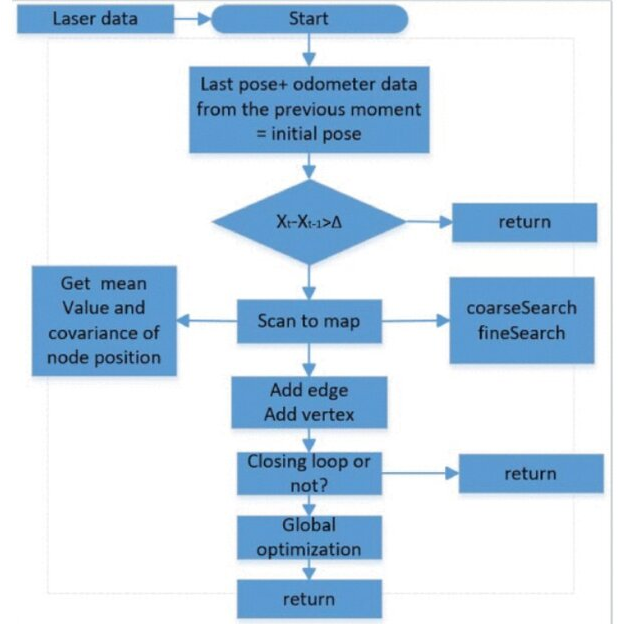
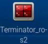
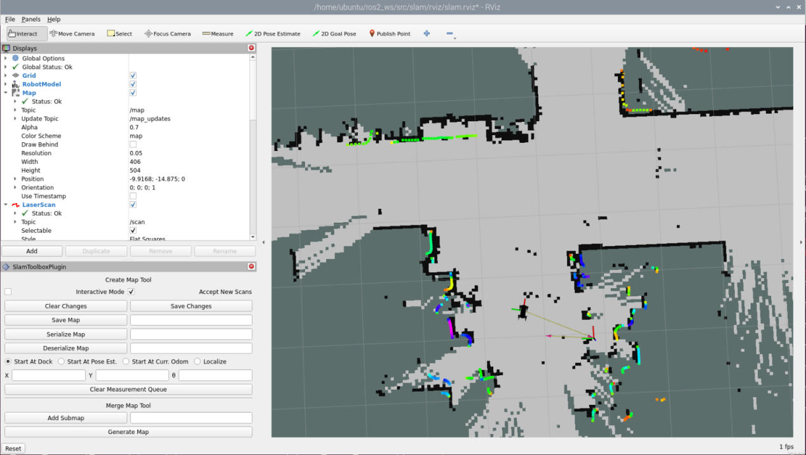
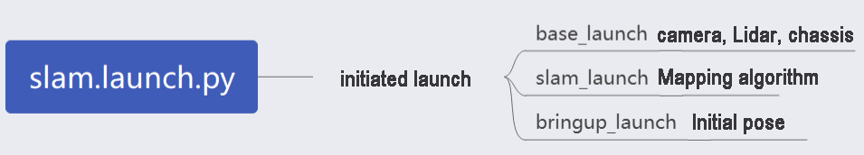

# 31. ROS2-SLAM Mapping Course

## 31.1 SLAM Mapping Principle

### 31.1.1 SLAM Introduction

Before starting the journey, both humans and robots need to know their current location. However, the way they do it differs. Humans use their eyes, while robots use Lidar sensors.

SLAM (Simultaneous Localization and Mapping) comprises two processes: localization and mapping. Localization determines the robot's position in the coordinate system. The origin of the coordinate system and the robot's pose can be determined using the first keyframe, the existing global map, road sign points, and GPS.

Mapping involves creating a map of the robot's surroundings. The primary geometric element of this map is a point. Navigation involves two parts: global planning/local planning and the control of the robot's movements.

### 31.1.2 Mapping Principle 


Mapping contains three main processes:

(1) Preprocessing: optimize the original point cloud data of Lidar by removing any wrong data and filtering it.

The point cloud is a collection of surrounding information acquired by Lidar. It contains a series of accurate angle and distance information for objects in the surroundings, but it may also include some irrelevant or inaccurate data.

(2) Matching: find the position on the map that corresponds to the point cloud data collected in a local area.

The laser SLAM system compares two point clouds collected at different times and calculates the change in distance and pose of the Lidar to locate the robot.

(3) Map integration: integrate the latest data received by Lidar into the existing map to update it.

Lidar uses a pulse laser as the signal source to scan the surrounding obstacles and gather information about the target points. The scattered laser will then be reflected on the receiver of Lidar, enabling it to calculate the distance from the target points. By scanning the target points, the Lidar can gather data for all points and create a 3D image through processing.

### 31.1.3 Mapping Skill

\(1\) Place the robot in front of a wall or a box before enabling mapping, which allows the robot to scan more points.


\(2\) Try to keep the robot moving straight instead of turning to avoid sparse feature point collection by the Lidar. When the features in the environment are weak, it's best to map areas where feature points are obvious to improve accuracy.


(3) To map large environments effectively, it's recommended that the robot completes the mapping loop first and then focuses on scanning smaller details in the environment.

In environments like shopping malls, which have a lot of transparent glass and unclear environmental features, it's helpful to stop the robot at a suitable location if there are distinct features ahead, such as columns, left and right passages, or diagonal walls. The robot can then rotate in place towards the feature position and wait until the Lidar has scanned the feature environment before rotating back and continuing forward. However, it's best to avoid backing up during the rotation process to ensure accurate mapping.


### 31.1.4 Evaluation of Map Building Results

After the map construction is completed, the following points can be used to determine if the results meet the navigation requirements:

(1) Whether the edges of obstacles in them map are clear.

(2) Whether there are areas in the map that do not match the actual environment (e.g. loop closures).

\(3\) Whether there are gray areas within the robot's operational area in the map (e.g. unscanned areas).

\(4\) Whether there are obstacles in the map that will not exist during subsequent localization (e.g. moving obstacles).

\(5\) Whether the map ensures that the robot has explored every position within its operational area, with a 360-degree field of view.

## 31.2 slam_toolbox Mapping Algorithm

### 31.2.1 Algorithm Definition

Slam Toolbox is a software package for 2D SLAM (Simultaneous Localization and Mapping) that processes LaserScan messages from a laser rangefinder to create 2D maps of the environment. It utilizes **TF transforms** between the  **odom**  and **base_link** frames to align sensor data. The package supports saving and reloading serialized SLAM maps and pose graphs for tasks like continuous mapping, localization, merging maps, and other operations.

Slam Toolbox operates in two modes:

(1) Synchronous mode: Processes all valid sensor measurements regardless of delays.

(2) Asynchronous mode: Processes valid sensor measurements whenever possible, without waiting for full synchronization.

This package serves as a robust alternative to tools like **gmapping, cartographer, karto, and hector,** offering a complete SLAM solution. It is built on Karto's powerful scan matcher, widely used and optimized for this application. Additionally, it introduces:

A new optimization plugin based on **Google Ceres**.

A novel localization method called **Elastic Pose-Graph Localization**, which uses a sliding measurement window added to the graph for optimization and refinement. This method enables tracking of changes in local features of the environment without treating them as errors. When leaving a specific area, redundant nodes are removed to avoid affecting the long-term map.

Slam Toolbox is a comprehensive suite of tools for 2D SLAM with key features including:

- Mapping and Saving: Generate maps and save them as **.pgm** files.

- Map Refinement and Updates: Refine existing maps, remap, or continue mapping on a previously saved map.

- Long-Term Mapping: Load a saved map to continue mapping while removing irrelevant information from new laser point clouds.

- Optimized Localization Mode: Improve localization on an existing map, or run in "Lidar Odometry" mode for localization without mapping.

- Synchronous and Asynchronous Mapping: Supports both mapping modes.

- Dynamic Map Merging: Merge maps dynamically during operation.

- Plugin-Based Optimization Solvers: Includes a new optimization plugin based on Google Ceres.

- Interactive RViz Plugin: Provides interactive features in RViz for visualization.

- Graphical Tools in RViz: Offers tools for manipulating nodes and connections during mapping.

- Map Serialization and Lossless Data Storage: Enables saving maps with complete data integrity.

* **KARTO：**

Karto_SLAM is a graph-based SLAM approach that uses sparse system decoupling as its solution, leveraging highly optimized, non-iterative Cholesky decomposition. In this method, graph optimization represents the map as a graph where each node corresponds to a position in the robot's trajectory and its associated sensor measurements. Each time a new node is added, the graph is updated through computation.

The ROS version of Karto_SLAM incorporates Sparse Pose Adjustment (SPA), which is closely tied to scan matching and loop closure detection. While increasing the number of landmarks requires more memory, graph optimization offers significant advantages in large-scale mapping. This is because it focuses only on the robot's poses in the graph, optimizing the trajectory before reconstructing the map.

The algorithmic framework of Karto_SLAM is outlined as follows:



From the diagram, it is evident that the process is relatively straightforward. Karto_SLAM follows the traditional soft real-time SLAM mechanism: each incoming frame of data is processed sequentially, with results returned immediately.

Karto_SLAM Source Code and Wiki:

- Karto_SLAM ROS Wiki: http://wiki.ros.org/slam_karto

- slam_karto Package: https://github.com/ros-perception/slam_karto

- open_karto Open-Source Algorithm: https://github.com/ros-perception/open_karto

### 31.2.2 SLAM Mapping Instructions

(1) Click-on  to initiate the ROS2 command-line terminal.

(2) Run the command below to terminate the ros.

```bash
~/.stop_ros.sh
```

(3) Run the command below to start mapping.

```bash
ros2 launch slam slam.launch.py
```

(4) Open a new command-line terminal, then input the following command to launch RViz tool to display the mapping results.

```bash
ros2 launch slam rviz_slam.launch.py
```



* **Robot Handle Control Setup**

(1) Power on the device and refer to the course material, "**[2.4 Wireless Handle Control](https://docs.hiwonder.com/projects/PuppyPi/en/latest/docs/2_play_first_hand.html#wireless-handle-control)**" to connect via the wireless handle.

(2) Turn on the controller. Both the red and green LED lights on the controller will start flashing simultaneously.

(3) Wait for a few seconds, and the robot dog will automatically pair with the controller. Once paired successfully, the green light will remain solid.

If the controller is not connected to the robot dog within 30 seconds of turning on, or if there is no action within 5 minutes of connection, the controller will enter sleep mode. To wake the controller, press the "START" button.

(4) Use the controller to move the robot dog in the current space to build a more complete map. The following table shows the buttons on the controller and their corresponding functions for controlling the robot dog's movement:

<!DOCTYPE html>
<html>
<head>
    <title>Controller Functions</title>
    <style>
        table {
            border-collapse: collapse;
            width: 100%;
            max-width: 600px;
            margin: 20px auto;
            font-family: Arial, sans-serif;
        }
        th, td {
            border: 1px solid #dddddd;
            text-align: left;
            padding: 12px;
        }
        th {
            background-color: #f2f2f2;
            font-weight: bold;
        }
        tr:nth-child(even) {
            background-color: #f9f9f9;
        }
        caption {
            font-size: 1.2em;
            margin-bottom: 10px;
            font-weight: bold;
        }
    </style>
</head>
<body>
    <table>
        <caption>Controller Functions</caption>
        <thead>
            <tr>
                <th>Button</th>
                <th>Function</th>
            </tr>
        </thead>
        <tbody>
            <tr>
                <td>START</td>
                <td>Reset body to initial posture</td>
            </tr>
            <tr>
                <td>L1</td>
                <td>Pitch up</td>
            </tr>
            <tr>
                <td>L2</td>
                <td>Pitch down</td>
            </tr>
            <tr>
                <td>R1</td>
                <td>Lean forward</td>
            </tr>
            <tr>
                <td>R2</td>
                <td>Lean backward</td>
            </tr>
            <tr>
                <td>↑ / Left stick up</td>
                <td>Move forward</td>
            </tr>
            <tr>
                <td>↓ / Left stick down</td>
                <td>Move backward</td>
            </tr>
            <tr>
                <td>← / Left stick left</td>
                <td>Turn left</td>
            </tr>
            <tr>
                <td>→ / Left stick right</td>
                <td>Turn right</td>
            </tr>
            <tr>
                <td>△ / Right stick up</td>
                <td>Increase body height</td>
            </tr>
            <tr>
                <td>× / Right stick down</td>
                <td>Decrease body height</td>
            </tr>
            <tr>
                <td>□ / Right stick left</td>
                <td>Decrease speed (use with "↑" or "↓")</td>
            </tr>
            <tr>
                <td>○ / Right stick right</td>
                <td>Increase speed (use with "↑" or "↓")</td>
            </tr>
        </tbody>
    </table>
</body>
</html>

(5) When using the controller to move the robot dog for mapping, it is recommended to reduce the robot's speed. The lower the robot's speed, the smaller the odometry error, resulting in better mapping accuracy. As the robot dog moves, the map displayed in RViz will continuously update and expand until the entire environment is mapped.

### 31.2.3 Map Saving

(1) Click-on  to launch the command-line terminal.

(2) Enter the command below and hit Enter key:

```bash
cd ~/ros2_ws/src/slam/maps && ros2 run nav2_map_server map_saver_cli -f "map_01" --ros-args -p map_subscribe_transient_local:=true
```

(3) If you need to terminate this game, press short-cut '**Ctrl+C**'.

### 31.2.4 Parameter Description

The parameter file can be found at the following path in the Docker container: **ros2_ws\src\slam\config\slam.yaml**.

For a detailed explanation of the parameters, please refer to the official documentation: **https://wiki.ros.org/slam_toolbox**

### 31.2.5 Launch File Analysis



The launch file is located in the Docker container at: [/home/ubuntu/ros2_ws/src/slam/launch/slam.launch.py](../_static/source_code/ros2/slam.launch.zip)

(1) Import library

The launch library can be referenced in the official ROS documentation for detailed explanations:

https://docs.ros.org/en/humble/How-To-Guides/Launching-composable-nodes.html

```python
import os
from ament_index_python.packages import get_package_share_directory

from launch_ros.actions import PushRosNamespace
from launch import LaunchDescription, LaunchService
from launch.substitutions import LaunchConfiguration
from launch.launch_description_sources import PythonLaunchDescriptionSource
from launch.actions import DeclareLaunchArgument, IncludeLaunchDescription, GroupAction, OpaqueFunction, TimerAction
```

(2) Setting the Path

Use `get_package_share_directory` to obtain the path of the slam package.

```python
if compiled == 'True':
	slam_package_path = get_package_share_directory('slam')
else:
	slam_package_path = '/home/ubuntu/ros2_ws/src/slam'
```

(3) Launching Other Files

```python
    base_launch = IncludeLaunchDescription(
        PythonLaunchDescriptionSource(
            os.path.join(slam_package_path, 'launch/include/robot.launch.py')),
        launch_arguments={
            'sim': sim,
            'master_name': master_name,
            'robot_name': robot_name
        }.items(),
    )

    slam_launch = IncludeLaunchDescription(
        PythonLaunchDescriptionSource(
            os.path.join(slam_package_path, 'launch/include/slam_base.launch.py')),
        launch_arguments={
            'use_sim_time': use_sim_time,
            'map_frame': map_frame,
            'odom_frame': odom_frame,
            'base_frame': base_frame,
            'scan_topic': '{}/scan'.format(frame_prefix),
            'enable_save': enable_save
        }.items(),
    )

    if slam_method == 'slam_toolbox':
        bringup_launch = GroupAction(
         actions=[
             PushRosNamespace(robot_name),
             base_launch,
             TimerAction(
                 period=6.0, 
                 actions=[slam_launch],
             ),
          ]
        )
```

`base_launch`: Launches the required hardware for the system.

`slam_launch`: Launches the basic mapping setup.

`puppy_control`: Launches the motion control setup.
