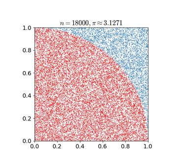
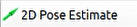

# 32. ROS2-Autonomous Navigation Course

## 32.1 ROS Robot Autonomous Navigation Principle

### 32.1.1 Autonomous Navigation Description

Autonomous navigation is a method used to guide a device from one point to another along a designated route. The primary application scenarios for navigation include:

(1) Land-based applications: such as autonomous vehicle navigation, vehicle tracking and monitoring, intelligent vehicle information systems, Internet of Vehicles (IoV) applications, and railway operation monitoring.

(2) Maritime applications: such as ocean transport, inland waterway navigation, vessel docking, and dry-docking operations.

(3) Aviation applications: such as flight route navigation, airport surveillance, and precision approaches.


ROS follows the principle of not reinventing the wheel and provides a set of general implementations for robot navigation through navigation-related packages. Developers no longer need to focus on complex, lower-level tasks such as navigation algorithms or hardware interactions. These implementations are managed, iterated, and maintained by specialized research and development teams, allowing developers to focus on higher-level functionality. Developers can also customize specific requirements based on existing packages through secondary development, significantly improving development efficiency and shortening product launch time.

In conclusion, for general developers, using the ROS navigation package collection has significant advantages. Developed and maintained by professional teams, it offers stable and comprehensive functionality, allowing developers to focus on higher-level features and enabling more efficient development.

### 32.1.2 Detailed Explanation of the Package

In this section, we will provide a detailed analysis and explanation of the navigation package, including instructions on the use of its parameters.

* **Principle and Structural Framework**

The Nav2 project builds upon and extends the spirit of the ROS navigation stack. Its goal is to enable mobile robots to move safely from point A to point B. Nav2 can also be applied to other scenarios, including robot navigation and dynamic point tracking. During this process, tasks such as dynamic path planning, motor speed calculation, obstacle avoidance, and recovery behaviors need to be completed.

Nav2 uses behavior trees to call modular servers to perform actions. These actions may include path computation, force control, recovery, or any other navigation-related tasks. These actions are executed through independent nodes that communicate with the behavior tree (BT) via ROS Action servers. The diagram below provides an overview of Nav2's architecture:


The above architecture can be broadly divided into one major component and three smaller components.

(1) The Major Component:

BT Navigator Server: This is the main service that orchestrates and calls the three smaller services mentioned below. It serves as the central hub for navigation tasks.

(2) The Three Smaller Components:

① Planner Server: The Planner Server's task is to compute a path that satisfies some goal functions. Depending on the selected naming convention and algorithm, this path may also be referred to as a route. Essentially, it is responsible for finding a path on the map.

② Controller Server: Known as the local planner in ROS1, the Controller Server follows the global path or completes local tasks. In simple terms, it controls the robot's movement based on the path found by the Planner Server.

③ Recovery Server: The Recovery Server acts as a fault-tolerant system. Its goal is to handle unexpected situations or failures and autonomously resolve these issues. For example, if the robot falls into a pit during navigation, the recovery server helps it find a way to recover and continue its task.

By continuously switching between path planning, robot control, and autonomous recovery, the robot can perform autonomous navigation. However, using a static SLAM-built map alone is insufficient during navigation. New obstacles may appear during the robot's movement, or previously detected obstacles may disappear. Therefore, the map maintained during navigation is dynamic. Based on the update frequency and usage, the map can be categorized into the following two types:

(3) Global Cost Map:

The Global Cost Map is primarily used for global path planning. As seen in the above structure diagram, it is part of the Planner Server. It typically contains the following layers:

Static Map Layer: A static map, usually created by SLAM.

Obstacle Map Layer: A dynamic map that records obstacles detected by sensors.

Inflation Layer: This layer expands outward from the obstacle map to avoid the robot's shell from colliding with obstacles.

(4) Local Cost Map

The Local Cost Map is mainly used for local path planning. As seen in the above structure diagram, it is part of the Controller Server. It generally contains the following layers:

Obstacle Map Layer: A dynamic map that records obstacles detected by sensors.

Inflation Layer: This layer expands outward from the obstacle map to avoid the robot's shell from colliding with obstacles.

* **Feature Pack Installation (Optional)**

:::{Note}

The robot comes with the navigation package pre-installed, so there is no need for the user to install it again. This section of the tutorial is for informational purposes only.

:::

The navigation system takes navigation goals, localization information, and map data as inputs, and produces the robot's control commands as outputs. First, we need to know the robot's current position, and then determine the target it needs to reach.

There are two methods to install the navigation package:

Install directly using `apt-get` with the following command:

```bash
sudo apt install ros-yoursystem-navigation2
```

Replace **yoursystem** with your ROS version (for MentorPi, the ROS version is Humble).

Additionally, you can install the navigation bring-up package with:

```bash
sudo apt install ros-yoursystem-nav2-bringup
```

Again, replace **yoursystem** with your ROS version (Humble for MentorPi).

:::{Note}

You can check your ROS version by running the command `echo $ROS_DISTRO` in the terminal.

:::


Alternatively, you can download the source code of the package, manually compile, and install it. If you only need to use the navigation package for learning purposes, the binary installation is quick and convenient. If you need to modify the code to improve algorithms, then manual installation via the source code is required. For detailed instructions, refer to the video tutorial.

For more information, refer to the Navigation Wiki: **https://wiki.ros.org/Robots/Nav2**

## 32.2 Adaptive Monte Carlo Localization

###  28.2.1 AMCL Localization

Localization involves estimating the robot's position in the global map. While SLAM includes localization algorithms, SLAM's localization is used to construct the global map and is part of the pre-navigation phase. Current localization is used during navigation when the robot needs to move along a predefined route. Through localization, we can assess whether the robot's actual trajectory matches the expected one. The ROS navigation function package, ros-navigation, provides the AMCL localization system for implementing robot localization during navigation.

AMCL (Adaptive Monte Carlo Localization) is a probabilistic localization system designed for 2D mobile robots. It implements the adaptive Monte Carlo localization method, which uses a particle filter to estimate the robot's position based on the existing map.

Localization resolves the association issue between robots and obstacles, as path planning essentially involves decision-making based on obstacles around the robot. In theory, as long as the robot's global positioning is known and real-time obstacle avoidance is achieved through sensor scan information from devices like laser radar, navigation tasks can be accomplished. However, the real-time accuracy of global positioning is generally not high, provided by local positioning methods such as odometers and IMUs, which ensure the real-time accuracy of the robot's motion trajectory with the IMU. The amcl node in the navigation function package provides global positioning by publishing map_odom. Global positioning by amcl is not mandatory; users can replace amcl global positioning with other methods that can provide map_odom, such as using SLAM, UWB, or QR code positioning.

Global positioning and local positioning have established a dynamic set of TF coordinates: map_odom, base_footprint, and the static TF coordinates between various sensors in the robot are provided through the robot's URDF model. This part of the TF relationship resolves the association problem between the robot and obstacles. For example, if a laser radar detects an obstacle 3 meters ahead, using the TF coordinates between the laser radar and the robot's chassis, the transformation from base_link to laser_link can be obtained, which reveals the relationship between the obstacle and the robot's chassis.

###  28.2.2 Particle Filter

Monte Carlo Localization (MCL) involves a particle update process for a one-dimensional robot. Initially, a group of particles is randomly generated, each representing possible states of the robot, including position, direction, or other estimated state variables. Each particle has a weight, indicating its similarity to the actual system state. Next, the state of each particle for the next time step is predicted based on the expected behavior of the real system. Subsequently, the weights of particles are updated based on measurements, with particles that match the measurement being assigned higher weights. Afterward, resampling is performed, discarding highly unlikely particles and replacing them with more probable ones. Finally, the weighted mean and covariance of the particle set are calculated to obtain the estimated state.




* Monte Carlo methods vary, but tend to follow a specific pattern:

(1) Define the domain of possible inputs.

(2) Randomly generate inputs from the probability distribution over the domain.

(3) Perform deterministic computations on the inputs.

(4) Summarize the results.

* Two important considerations are:

(1) If these points are not uniformly distributed, the approximation may be poor.

(2) This process requires many points. If only a few points are randomly placed within the entire square, the approximation is usually poor. On average, increasing the number of points improves the accuracy of the approximation.

The Monte Carlo particle filtering algorithm has wide-ranging applications in various fields such as physics, engineering, climatology, and computational biology.

###  28.2.3 Adaptive Monte Carlo Localization

AMCL can be regarded as an improved version of the Monte Carlo localization algorithm. It reduces execution time and enhances real-time performance by employing a small number of samples in the Monte Carlo localization algorithm. It implements an adaptive or KLD-sampling Monte Carlo localization method, which utilizes particle filtering to track a robot's pose with respect to a known map.

The Adaptive Monte Carlo Localization (AMCL) node primarily utilizes laser scans and laser map data to propagate messages and compute pose estimates. In the implementation process, it first initializes the particle filter of the Adaptive Monte Carlo Localization algorithm based on various initialization parameters provided by the ROS system. If the initial pose is not specified, the AMCL algorithm assumes that the robot starts running from the origin of the coordinate system, which can lead to relatively complex calculations.

Therefore, it is recommended to set the initial pose using the "**2D Pose Estimate**" button in rviz. For more information about Adaptive Monte Carlo Localization, you can also refer to the wiki page at the following link: https://github.com/ros-planning/navigation.

###  28.2.4 Costmap

Whether generated by a laser scanner or depth camera, 2D or 3D SLAM maps cannot be directly used for actual navigation. They must be converted into costmaps. In ROS, costmaps are typically represented in grid format. Each grid cell in the grid map occupies one byte, which is eight bits, capable of storing data from 0 to 255. This means that each cell cost (the value of the grid) ranges from 0 to 255, with only three scenarios considered: Occupied (presence of obstacles), Free (open space without obstacles), and Unknown Space (areas where information is lacking).

Before introducing costmap_2d, let's first talk about the Bresenham algorithm. The Bresenham Line Algorithm is used to draw a straight line determined by two points. It calculates the closest points on an n-dimensional grid to the line segment. This algorithm only requires relatively fast integer addition, subtraction, and bit shifting operations, making it commonly used for drawing lines in computer graphics. It is one of the earliest developed algorithms in computer graphics.


Scan through the center of pixels in each row and column to construct a set of virtual grid lines as shown in the diagram above. Calculate the intersections of the line with each vertical grid line in the order from the starting point to the endpoint of the line, and then determine the pixel closest to this intersection point within the column of pixels based on the sign of the error term.

Algorithm Core Idea: Assume: k = dy/dx. Because the starting point of the line is at the center of a pixel, the initial value of the error term d is set to d0 = 0. As X increases by 1, the value of d increases correspondingly by the slope value k of the line, that is, d = d + k. Once d �1, subtract 1 from it to ensure that d remains between 0 and 1. When d �0.5, the pixel closest to the current pixel is the one at the upper right corner (x+1, y+1), and when d \< 0.5, it is closer to the right pixel (x+1, y). For convenience in computation, let e = d - 0.5, where the initial value of e is -0.5, and the increment is k. When e �0, take the pixel at the upper right corner of the current pixel (xi, yi) as (x+1, y+1), and when e \< 0, it is closer to the right pixel (x+1, y). To avoid division, integers can be used. Since only the sign of the error term is used in the algorithm, it can be replaced as follows: e1 = 2\*e\*dx.


The Costmap2D class maintains the cost values for each grid. The Layer class is a virtual base class that provides a unified interface for various plugin costmap layers. The most important interface functions include:

The `initialize` function, which calls the `onInitialize` function, initializes each costmap layer separately.

The `matchSize` function, used in both the StaticLayer and ObstacleLayer classes, calls the `matchSize` function of the CostmapLayer class. This function initializes the size, resolution, origin, and default cost of each costmap layer, ensuring consistency with the layered_costmap. For the InflationLayer class, it calculates a cost table that varies with distance based on the inflation radius. This allows for querying the cost values of inflated grid cells based on distance. Additionally, the `seen_` array is defined to mark whether a grid cell has been traversed. For the VoxelLayer class, it initializes the size of voxel grids.

The `updateBounds` function adjusts the size range that the current costmap layer needs to update. For the StaticLayer class, it sets the update range of the costmap to the size of the static map (note: the static layer is generally used only in the global costmap). For the ObstacleLayer class, it traverses the sensor data in "clearing_observations" to determine the boundaries of the obstacles.

The `initialize`  and   `matchSize` functions are executed only once. The  `updateBounds`  and `updateCosts` functions are executed periodically, with their execution frequency determined by `map_update_frequency`.

The CostmapLayer class inherits from both the Layer class and the Costmap2D class and provides several methods for updating cost values. The StaticLayer and ObstacleLayer classes need to store the cost values of the instantiated costmap layer, so they both inherit from the CostmapLayer class. The StaticLayer class updates its costmap using static grid map data, while the ObstacleLayer class updates its costmap using sensor data. The VoxelLayer class, compared to the ObstacleLayer class, additionally considers data along the z-axis. The main difference in their effects is reflected in the clearing of obstacles: one performs clearing in a two-dimensional plane, while the other handles it in three dimensions.


The costmap is highly flexible in measuring obstacles, allowing for the creation of specific layers as needed, where obstacle information can be maintained. If the robot is equipped only with a laser scanner, an Obstacles layer should be created to maintain the obstacle information detected by the laser scanner. If the robot also has ultrasonic sensors, a new Sonar layer should be created to maintain the obstacle information detected by the sonar sensors. Each layer can have its own rules for updating obstacles, such as adding obstacles, removing obstacles, and updating the confidence of obstacle points, which greatly enhances the scalability of the navigation system.

For more information, you can refer to:

ROS navigation wikiďź?http://wiki.ros.org/navigation>

ROS move_base wikiďź?http://wiki.ros.org/move_base>

###  28.2.5 Global Path Planning

**Preface:** Based on the mobile robot's understanding of the environment, the nature of the environment, and the algorithms used, path planning can be divided into environment-based path planning algorithms, map-based path planning algorithms, and completeness-based path planning algorithms.


Commonly used path planning algorithms in robot autonomous navigation include Dijkstra, A\*, D\*, PRM, RRT, genetic algorithms, ant colony algorithms, fuzzy algorithms, and others.

Dijkstra and A\* are both graph-based path search algorithms commonly used in robotics. The navigation package integrates global path planning plugins such as navfn, global planner, and carrot planner. Users can choose one of them to load into move_base for navigation. Alternatively, third-party global path planning plugins like SBPL_Lattice_Planner and srl_global_planner can be selected and loaded into move_base. Additionally, users have the option to develop their own global path planning plugins according to the nav_core interface specifications.


Robot navigation utilizes path planning to enable it to reach its destination. The navigation planning layer can be divided into global path planning layer, local path planning layer, behavior execution layer, and so on.

(1) Global Path Planning Layer: Based on the given target, it accepts costmap information to generate a global costmap, plans the global path from the starting point to the target location, and serves as a reference for local path planning.

(2) Local Path Planning Layer: As the local planning part of the navigation system, it accepts the generated local costmap information based on the costmap, and performs local path planning based on nearby obstacle information.

(3) Behavior Execution Layer: Combining the commands sent from the upper layers and the path planning results, it determines the current behavior of the mobile robot.

As a key focus area in mobile robot research, the quality of path planning algorithms largely determines the efficiency of the robot's operations.

* **Dijkstra algorithm**

The Dijkstra algorithm is a typical shortest path algorithm. It is a single-source shortest path algorithm characterized by expanding outward from the starting point in a breadth-first search manner until reaching the destination. It is a breadth-first algorithm that considers edge weights and is one of the most commonly used algorithms in global path planning problems.

Below is an illustration of the Dijkstra algorithm.

(1) At the beginning, we initialize dis\[start\] to 0, and the rest of the points are initialized to inf.


(2) In the first loop, we find the point 1 with the minimum dis value. We then mark 1 as visited and update the dis values of all adjacent blue points. Specifically, we set dis\[2\] = 2, dis\[3\] = 4, and dis\[4\] = 7.


(3) In the second loop, we find the point 2 with the minimum dis value. We then mark 2 as visited and update the dis values of all adjacent blue points. Specifically, we set dis\[3\] = 3 and dis\[5\] = 4.


(4) In the third loop, we find the point 3 with the minimum dis value. We then mark 3 as visited and update the dis value of the adjacent blue point. Specifically, we set dis\[4\] = 4.


(5) In the following two loops, we mark points 4 and 5 as visited, respectively, and the algorithm ends. We have found the shortest paths from the start node to all other nodes.

For information and usage instructions on the Dijkstra algorithm, you can visit the following link: **http://wiki.ros.org/navfn**

* **A\* algorithm**

A\* algorithm is a modification of the Dijkstra algorithm, optimized for a single destination. While Dijkstra's algorithm can find paths to all locations, A\* searches for the closest path to one or several locations. It prioritizes paths that appear to be closer to the goal.

A\* algorithm's formula is: F = G + H, where G is the cost of moving from the starting point to the specified grid, and H is the estimated cost of moving from the specified grid to the endpoint. There are two common methods to calculate the H value:

(1) Calculate the distance of horizontal and vertical movement; diagonal movement is not considered (Manhattan distance).


(2) Calculate the distance of horizontal and vertical movement, allowing diagonal movement (Euclidean distance).


For information and instructions on using the A\* algorithm, please refer to the video tutorials or visit the following link on the wiki: [http://wiki.ros.org/global_planner](http://wiki.ros.org/global_planner)

And redblobgames websiteď https://www.redblobgames.com/pathfinding/a-star/introduction.html#graphs>

## 32.3 Single-point and Multi-points Navigation and Obstacle Avoidance

### 32.3.1 Navigation Instructions

(1) Click  on the system desktop to open the ROS2 command-line terminal.

(2) Enter the following command to disable the app auto-start service:

```bash
~/.stop_ros.sh
```

(3) Enter the command to start the navigation service and press Enter:

```bash
ros2 launch navigation navigation.launch.py map:=map_01
```

The "**map_01**" at the end of the command refers to the map name. You can modify this parameter based on your needs. The map files are stored in the Docker container under the path: **/home/ubuntu/ros2_ws/src/slam/maps**.

(4) Open a new terminal, enter the following command to launch the RViz tool and display the navigation:

```bash
ros2 launch navigation rviz_navigation.launch.py
```

* **Single-Point Navigation**

In the software menu, the "**2D Pose Estimate**" is used to set the initial position of the PuppyPi robot; the "**2D Goal Pose**" is used to set a single goal point for the robot; and the "Publish Point" is used to set multiple goal points for the robot.


To set the robot’s initial position, click on . On the map interface, select the location and click and drag the mouse to set the robot’s pose.


(1) After setting the initial position, it will appear as shown below:


(2) To set the goal point, click  and select a location on the map. Click once on the point you wish to set as the target. Once selected, the robot will automatically generate a route and move to the goal point.


(3) After confirming the goal point, the map will display two paths: the straight line (green) between the robot and the goal point, and the planned path (dark blue) for the robot.


(4) If an obstacle is encountered, the robot will navigate around it while continuously adjusting its pose and travel path.


* **Multi-Point Navigation**

(1) Click the **"Waypoint"** button to begin multi-point navigation.


(2) Set multiple navigation points using  as shown below:


(3) Finally, click **"Start Nav Through Poses"** or **"Start Waypoint Following"** to enable navigation. **"Start Nav Through Poses"** will not focus on the robot's pose at each navigation point, while **"Start Waypoint Following"** will control the robot's pose at each point.


(4) The multi-point navigation will proceed as shown below, with the robot reaching each goal point in order:


(5) The multi-point navigation effect is as below:


(6) If you need to terminate the game, use short-cut '**Ctrl+C**'.

### 32.3.2 Launch File Description


The path to the launch file is located within the Docker container:[/home/ubuntu/ros2_ws/src/navigation/launch/navigation.launch.py](../_static/source_code/ros2/navigation.launch.zip)

- **Setting Path**

Retrieve the file paths for the slam and navigation packages.

{lineno-start=12}

```python
    if compiled == 'True':
        slam_package_path = get_package_share_directory('slam')
        navigation_package_path = get_package_share_directory('navigation')
    else:
        slam_package_path = '/home/ubuntu/ros2_ws/src/slam'
        navigation_package_path = '/home/ubuntu/ros2_ws/src/navigation'
```

- **Initiate Other Launch Files**

base_launch: Used for initializing various hardware components.

navigation_launch: Launches the navigation algorithm.

puppy_control: Handles motion control.

{lineno-start=34}

```python
    base_launch = IncludeLaunchDescription(
        PythonLaunchDescriptionSource(os.path.join(slam_package_path, 'launch/include/robot.launch.py')),
        launch_arguments={
            'sim': sim,
            'master_name': master_name,
            'robot_name': robot_name
        }.items(),
    )
    
    navigation_launch = IncludeLaunchDescription(
        PythonLaunchDescriptionSource(os.path.join(navigation_package_path, 'launch/include/bringup.launch.py')),
        launch_arguments={
            'use_sim_time': use_sim_time,
            'map': os.path.join(slam_package_path, 'maps', map_name + '.yaml'),
            'params_file': os.path.join(navigation_package_path, 'config', 'nav2_params.yaml'),
            'namespace': robot_name,
            'use_namespace': use_namespace,
            'autostart': 'true',
            'use_teb': use_teb,
        }.items(),
    )

    bringup_launch = GroupAction(
     actions=[
         PushRosNamespace(robot_name),
         base_launch,
         TimerAction(
             period=10.0,  # 延时等待其它节点启动ĺĽ?
             actions=[navigation_launch],
         ),
      ]
    )
```

### 32.3.3 Feature Pack Description

The path to the navigation package is located within the Docker container:`/home/ubuntu/ros2_ws/src/navigation/`


**(1) config:** Contains configuration parameters related to navigation, as shown in the figure below.


**(2) launch:** Includes launch files related to navigation, such as those for localization, map loading, navigation modes, and simulation models, as illustrated below.


**(3) rviz:** Loads parameters for the RViz visualization tool, including RViz configuration files for different navigation algorithms and navigation setups, as depicted below.


**(4) Package.xml:** Configuration file for the current package
