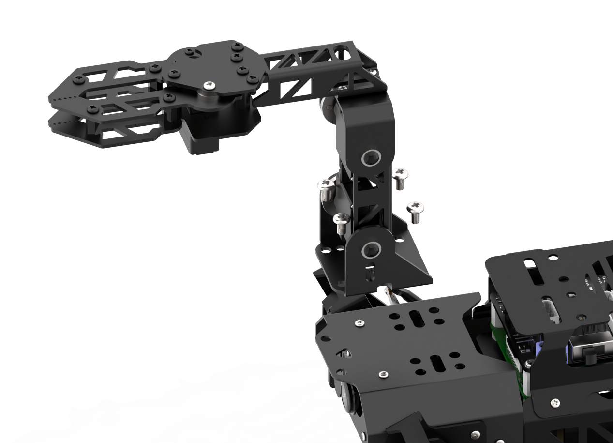
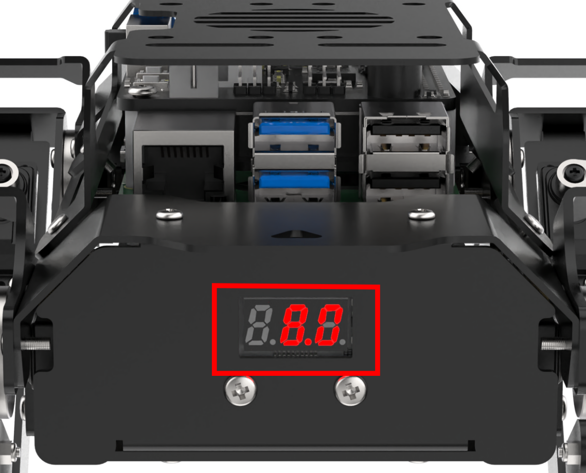
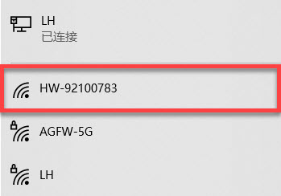
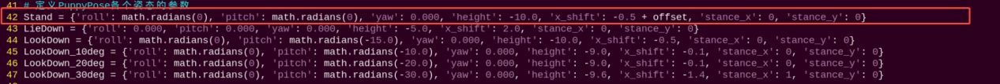
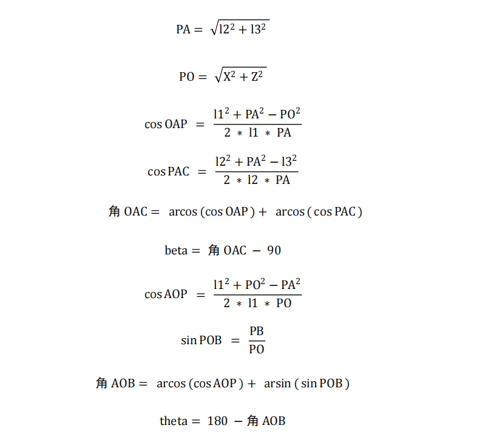

# 33. ROS2-Robot Arm Course

## 33.1 Robotic Arm Installation and Wiring

The installation tutorial video for the PuppyPi robotic arm can be referred to in the same directory under **Robotic Arm Installation**. Below is a schematic diagram for the installation of the PuppyPi robotic arm:

Use four **M4*6** round head machine screw to secure the robotic arm to the PuppyPi. Due to the replacement of old and new versions of PuppyPi sheet metal parts, some sheet metal parts can only be installed with two **M4*6** round head machine screws. Please refer to the actual PuppyPi sheet metal parts for specifics.




**M4*6** round head screw

Connect the servos `ID9`, `ID10`, and `ID11` on the robotic arm to the PWM servo interfaces 9, 10, and 11 on the Raspberry Pi expansion board as pictured:


## 33.2 Power-on Inspection

### 33.2.1 Robot Power-on

:::{Note}

* Do not start PuppyPi on rough or uneven surfaces.

* Do not forcibly move the servos after powering on to avoid damaging them.

:::

* **Power-on Positioning**

(1) Before powering on, to avoid servo damage from sudden movement, place PuppyPi in a lying position on a flat surface. The robotic arm should be positioned facing forward, as shown in the diagram below:


:::{Note}
Before powering on, the robotic arm must be positioned facing straight forward. Do not position it hanging downwards to prevent damage to the robotic arm when the servos are powered on.
:::


(2) Then, push the switch on the expansion board from **OFF** to **ON**. After powering on, the digital display at the tail of the robot dog will show the current battery level (it lights up at 8V as pictured). When the battery level is below 6.8V, the battery needs to be charged as soon as possible. **LED1** and **LED2** will emit a faint blue light. After a short wait, **LED1** will stay on continuously, and **LED2** will blink every two seconds, indicating that the network configuration is ready. Finally, wait for a **beep** from the buzzer, indicating that the ROS configuration is complete and the device has successfully started.




(3) The device defaults to **AP direct connection mode** out of the factory. After successful boot-up, it will generate a hotspot starting with **HW**.



### 33.2.2 Inspection

(1) Power on the robot, then follow the steps in  [3.3 Docker Container Introduction and Entry]() and [3.4 ROS Version Switch Tool Guide]() to connect via the VNC remote control software and switch to the ROS 2 environment.

(2) Click the icon  in the top-left corner of the desktop to open the system terminal.

(3) Run the following command to execute the robotic arm test script:

```
ros2 launch puppy_control puppy_arm_test.launch.py
```

During the test, the robotic arm gripper will first open and close, then perform a complete grasping motion. Once the sequence is complete, servos 9 and 10, as well as servos 10 and 11, should form a 90-degree angle with the tabletop or other flat surface, as illustrated below:


If there is any noticeable deviation after the test, please proceed to the next section, [33.3 Robotic Arm Deviation Adjustment](), for calibration instructions.

## 33.3 Robotic Arm Deviation Adjustment

### 33.3.1 Determine Whether Offset Adjustment is Required

Offset adjustment is **not necessary** if the PuppyPi robotic arm meets the following initial posture conditions after powering on:

(1) The arm remains **vertically aligned** with the main body

(2) The **two connecting rods** form a **90-degree right angle**

(3) The **gripper is properly closed**


If the robotic arm appears misaligned, as shown in the reference image, **offset calibration is required**.


### 33.3.2 Causes of Offset

Offset may occur under the following conditions:

(1) Incorrect horn installation: If the servo horn is installed while the shaft is not in its neutral (midpoint) position, it can cause an angular deviation. (Note: Servos are factory-calibrated to their midpoint by default.)

(2) Slight mounting misalignment: Even if the horn is installed correctly, small deviations in how the servo is mounted to the bracket can result in minor offsets.

① Offsets within ±100 units (approximately ±30°) are considered within the normal adjustment range and can be corrected through software.

② Offsets exceeding ±100 units require manual adjustment by removing the horn, repositioning it, and reinstalling it correctly.

### 33.3.3 Offset Adjustment Steps

Ensure the `Reset Servo` operation has been performed before proceeding.


(1) Power on the robot, then follow the steps in  [3.3 Docker Container Introduction and Entry]() and [3.4 ROS Version Switch Tool Guide]() to connect via the VNC remote control software and switch to the ROS 2 environment.

(2) Click on  to launch the Terminator ROS2.

(3) Run the following command to launch the PC software.

```
python3 software/puppypi_control/PuppyPi.py
```

(4) Once the software is open, check the `Arm` option under Normal Mode to display the servo control panel.


(5) Servos with `ID 9`, `10`, and `11` correspond to the robotic arm's joints.


(6) Click the **Reset Servo** button to bring PuppyPi into its default position.


(7) In Normal Mode, observe the servo positions. If **Servo ID10** is misaligned, proceed with adjustment.


(8) The software will automatically read the current offset value. Use the slider below **ID10** to adjust its position until the two connecting rods are perpendicular. You can click the slider or use the mouse scroll wheel to fine-tune the value.

(9) After adjustment, click **Save Deviation**, then **OK** to store the offset in the control board.


## 33.4 Center of Gravity Calibration

### 33.4.1 Center of Gravity Explanation

The robotic dog's center of gravity is positioned at the center of its body to ensure balanced weight distribution from front to back and side to side. During movement, the system continuously makes dynamic adjustments to the posture of each component to maintain a stable center of gravity—similar to how a person adjusts their balance when walking with or without carrying a load.

By default, the robot is configured without a robotic arm, and its center of gravity is pre-calibrated at the factory, so no further adjustment is required. However, when a robotic arm is installed, the shift in weight alters the center of gravity. In such cases, users must follow the instructions in this section to manually recalibrate the balance. This helps prevent issues such as body tilting or instability during operation.

### 33.4.2 Program Configuration Guide

The source code for the ROS2 program is located inside the Docker container at:

[/home/ubuntu/ros2_ws/src/driver/puppy_control/puppy_control/puppy.py]()



As shown in the figure above, the **x_shift** parameter in the program defines the distance (in centimeters) by which all four legs of the quadruped robot move along the X-axis in the same direction. This parameter determines the robot's gait balance point and can be adjusted within a range of -10 to 10.

:::{Note}
When **with_arm = 0** (i.e., the robot does not have a robotic arm installed), the default value of **x_shift** is -0.5, which corresponds to the standard center of gravity for the base model.
:::

When adjusting this parameter:

- A smaller value shifts the balance point forward, causing the robot to lean slightly forward.

- A larger value shifts the balance point backward, causing it to lean slightly toward the rear.

Tuning the **x_shift** parameter is essential for maintaining walking stability, especially after hardware modifications such as mounting a robotic arm.

### 33.4.3 Center of Gravity Instructions

:::{Note}
Commands are case-sensitive. You may use the Tab key for auto-completion.
:::

(1) Power on the robot, then follow the steps in  [3.3 Docker Container Introduction and Entry]() and [3.4 ROS Version Switch Tool Guide]() to connect via the VNC remote control software and switch to the ROS 2 environment.

(2) Click the icon at the top-left corner  of the desktop to open the ROS2 terminal.

(3) Enter the following command to navigate to the control script directory:

```
cd /home/ubuntu/ros2_ws/src/driver/puppy_control/puppy_control
```

(4) Open the script using the following command:

```
vim puppy.py
```

(5) Press the **"i"** key to enter insert mode for editing.


(6) Change **with_arm=0** to **with_arm=1**, which sets the offset value to 0.1. As a result, the value of **x_shift** becomes -0.5 + 0.1 = -0.4.

(It is recommended to adjust the parameter value incrementally by ±0.01 each time for more precise tuning.)


(7) After editing, press the **Esc** key, then type and enter the following command to save and exit:

```
:wq
```


(8) Click on  to open the ROS2 command-line terminal. Then run the following command:

```
ros2 launch puppy_control puppy_control.launch.py
```

(9) Reopen the terminal, enter the command, and press Enter to view the effect of the adjustment. PuppyPi will continue moving forward during the demonstration.

```
ros2 topic pub /puppy_control/velocity puppy_control_msgs/msg/Velocity "x: 5.0
y: 0.0
yaw_rate: 0.0" --once
```

(10) To verify that the center of gravity adjustment is successful, allow PuppyPi to walk for 5 seconds. If it moves steadily during this time, the adjustment is considered complete.

Use the following command to stop its movement:

```
ros2 topic pub /puppy_control/velocity puppy_control_msgs/msg/Velocity "x: 0.0
y: 0.0
yaw_rate: 0.0" --once
```

(11) If the walking motion remains unstable due to an imbalanced center of gravity, please repeat steps (2) to (11) as needed for further fine-tuning.

## 33.5 Robotic Arm Debugging

This document outlines troubleshooting solutions for common issues encountered during PuppyPi's robotic arm extension activities, such as inaccurate gripping or failure to detect the target object.

:::{Note}
While the adjustment procedures for the robotic arm are the same in both ROS2 and ROS2 environments, the steps for launching the activities differ. Please follow the instructions specific to your version.
:::

### 33.5.1 Adjusting Color Thresholds Using LAB_TOOL

Open the `LAB_TOOL` software on the Raspberry Pi desktop and verify whether the three sponge blocks used in the activity are correctly detected. If any color is not fully recognized, adjust the corresponding color threshold accordingly.  
(In the example image, the object to be detected appears white on the left side, while the background appears black, indicating successful color recognition.)


Acceptance Criteria: All three sponge blocks are accurately and fully detected.

### 33.5.2 Color Recognition and Grasping Debugging

:::{Note}
Before debugging this game, please complete the color threshold adjustments for the three sponge blocks as described in **33.5.1 Adjusting Color Thresholds with LAB_TOOL**.
:::

[Source Code]()

(1) Power on the robot, then follow the steps in  [3.3 Docker Container Introduction and Entry]() and [3.4 ROS Version Switch Tool Guide]() to connect via the VNC remote control software and switch to the ROS 2 environment.

(2) Open the Terminator terminal by clicking the system desktop icon .

(3) Stop the auto-start service by entering the following command and pressing Enter:

```
~/.stop_ros.sh
```

(4) Launch the robotic arm gameplay by entering the command below and pressing Enter:

```
ros2 launch example color_detect_with_arm.launch.py
```

(5) A real-time video window will appear. The yellow rectangular area at the bottom is the recognition zone for the sponge blocks. Place the blue and green sponge blocks inside this zone, ensuring the bottom of each block aligns with the bottom edge of the yellow box (see image reference).


(6) If no recognition box appears around the sponge blocks, the color is not being detected. This may be due to an incorrect minimum color area threshold in the program. To stop the program, press **Ctrl+C** in the terminal.

(7) Navigate to the program directory by entering:

```
cd ros2_ws/src/example/example/puppy_with_arm
```

(8) Open the gameplay script with:

```
gedit color_detect_with_arm.py
```

(9) Scroll to line 127 and check the value of **max_area**, which defines the minimum recognized area for a single color block. The recommended value is 4000, based on extensive testing.

- If the program fails to detect the blocks, try decreasing this value slightly.

- Save the file and rerun the program to verify recognition.

- Repeat adjustments until all sponge blocks are reliably recognized.


(10) After successful recognition, proceed to test grasping. Place the red sponge block in the recognition zone as described in step (5).

- If the robot does not grasp securely or misses the block, check the gripper servo offsets.

- Confirm the gripper is fully closed when no grasp command is issued.

- Adjust the servo offset as needed.

(11) Once stable grasping is achieved, verify the grasping position. If it is too high, fine-tune the grasp position by adjusting the `grab.d6a` motion group.


(12) Acceptance Criteria: The game must reliably recognize all three sponge blocks by color and grasp them accurately without dropping during operation.

### 33.5.3 Line-Following Grasping Debugging

[Source Code]()

(1) Power on the robot, then follow the steps in  [3.3 Docker Container Introduction and Entry]() and [3.4 ROS Version Switch Tool Guide]() to connect via the VNC remote control software and switch to the ROS 2 environment.

(2) Open the LTX terminal  at the top-left corner of the desktop, enter the following command to stop the button service, and press Enter:

```
sudo systemctl stop button_scan.service
```

(3) Click the system desktop's top-left icon  to open the Terminator terminal.

(4) Enter the command below to stop auto-start game services, then press Enter:

```
~/.stop_ros.sh
```

(5) Start the line-following grasping gameplay by entering the command and pressing Enter:

```
ros2 launch example visual_patrol_with_arm.launch.py
```

(6) Press the **Key1** button on the expansion board to start the game. If the robot fails to grasp the sponge block properly (e.g., grasping too early or too late), stop the program by pressing **Ctrl+C** in the terminal.

(7) Enter the following command to navigate to the course program directory:

```
cd ros2_ws/src/example/example/puppy_with_arm
```

(8) Open the game script by entering:

```
gedit visual_patrol_with_arm.py
```

(9) Locate line 355 and adjust the corresponding value:

- If Puppypi grasps too late (with the gripper behind the sponge block), increase this value to initiate earlier grasping.

- Adjust in increments of about 10 for each modification.

- If the robot fails to grasp after increasing the value, it means the value is too high—revert to the previous value and fine-tune in increments of 1.

- Test repeatedly until the robot can successfully grasp 3 times consecutively at a given value.


(10) Acceptance Criteria: The game runs successfully and the robot grasps the sponge block correctly 3 times in a row without failure.

### 33.5.4 Auto Recognition Grasping Debugging

[Source Code]()

(1) Power on the robot, then follow the steps in  [3.3 Docker Container Introduction and Entry]() and [3.4 ROS Version Switch Tool Guide]() to connect via the VNC remote control software and switch to the ROS 2 environment.

(2) Open the LTX terminal  at the top-left corner of the desktop, enter the following command to stop the button service, and press Enter:

```
sudo systemctl stop button_scan.service
```

(3) Click the system desktop's top-left icon  to open the Terminator terminal.

(4) Enter the command below to stop auto-start gameplay services, then press Enter:

```
~/.stop_ros.sh
```

```
ros2 launch example color_grab.launch.py
```

(5) Press the **Key1** button on the Raspberry Pi expansion board to start the program.

- If the robot fails to grasp the sponge block correctly (grasping too early or too late), this indicates that the parameter range controlling the grasp action is improperly set.

- To stop the program, press **Ctrl+C** in the terminal.

(6) In the terminal, enter the following command to navigate to the course program directory:

```
cd ros2_ws/src/example/example/puppy_with_arm
```

(7) Open the corresponding gameplay script by running:

```
gedit color_grab.py
```

(8) Within the script:

- Lines **102** and **117** define the lower limit for `block_center_point[1]` (e.g., the value **355** in the diagram), which determines when Puppypi moves forward. These two values must be kept consistent—any change to one must be reflected in the other.

- Lines **102** and **120** define the upper limit for `block_center_point[1]` (e.g., the value **370**), which determines when Puppypi moves backward. This value is typically not changed, but if adjusted, both lines must be updated accordingly.

- After making any changes, save the file and rerun the gameplay to test the grasping action. The robot should be able to successfully grasp the sponge block **three consecutive times**.


(9) Acceptance Criteria: The robot consistently grasps the sponge block **three times in a row** during game.

### 33.5.5 Follow-up Procedure

After completing the above steps, carefully organize the robotic arm's servo cables and secure them with cable ties. Make sure to power off the system before handling the cables. 
**Acceptance Criteria:** Move each servo of the robotic arm to its full range of motion repeatedly, and check that none of the servo cables become loose or disconnected. 
Once the cable management is confirmed secure, the robotic arm can be safely removed. This completes the entire debugging process.

## 33.6 Color Recognition Gripping

### 33.6.1 Program Logic

First, subscribe to the topic messages published by the camera node to obtain real-time image data. Then, convert the RGB color space to grayscale and read the camera's intrinsic parameters.

Next, perform thresholding, erosion, and dilation on the image to obtain the largest contour of the target color within the image, and outline the detected color.

Finally, control the PuppyPi to perform feedback actions. When red is detected, control the robot to perform the **grasping** action.

### 33.6.2 Operation Steps

[Source Code]()

:::{Note}
Command input must strictly differentiate between uppercase and lowercase letters as well as spaces.
:::

(1) Power on the robot, then follow the steps in  [3.3 Docker Container Introduction and Entry]() and [3.4 ROS Version Switch Tool Guide]() to connect via the VNC remote control software and switch to the ROS 2 environment.

(2) Click the icon  on the upper left corner to open the Terminator terminal.

(3) Input the following command and press Enter to close auto-start program.

```
~/.stop_ros.sh
```

(4) Input color recognition command and press Enter to start the program.

```
ros2 launch example color_detect_with_arm.launch.py
```

(5) To close this program, press **Ctrl+C** in the LX terminal interface. If closing fails, try pressing multiple times.

### 33.6.3 Program Outcome

:::{Note}
After starting the game, please ensure that there are no other objects with the recognized color within the field of view of the camera, to avoid affecting the implementation effect of the game.
:::

After starting the game, place the color block in front of PuppyPi. When the color block is recognized, it will be identified with a circle in the corresponding color, and the color name will be printed in the center of the window. The program can recognize color blocks of **red**, `blue`, and **green**, but only performs **grasping** operation on red color blocks.

:::{Note}
If the color recognition is inaccurate, please refer to [23.1 Color Threshold Adjustment]() for adjustment.
:::


### 33.6.4 Program Analysis

:::{Note}
Before making any program modifications, it is essential to backup the original factory program. Avoid directly modifying the source code files to prevent accidentally changing parameters in the wrong way, leading to robot malfunctions that cannot be repaired!
:::

According to the game effect, here is the logical process of this game as pictured:

* **Launch File Analysis**

During the execution of the functionality, the launch file of the current package will be started (`color_detect_with_arm.launch`) as pictured:

{lineno-start=1}

```python
from launch import LaunchDescription
from launch_ros.actions import Node
from launch.launch_description_sources import PythonLaunchDescriptionSource
from launch.actions import IncludeLaunchDescription
import os

def generate_launch_description():
    # Define paths to external launch files
    ros_robot_controller_launch_path = '/home/ubuntu/ros2_ws/src/driver/ros_robot_controller/launch/ros_robot_controller.launch.py'
    usb_cam_launch_path = '/home/ubuntu/ros2_ws/src/peripherals/launch/usb_cam.launch.py'
    puppy_control_launch_path = '/home/ubuntu/ros2_ws/src/driver/puppy_control/launch/puppy_control.launch.py'

    return LaunchDescription([
        # Define the color detect with arm node
        Node(
            package='example',
            executable='color_detect_with_arm',
            name='color_detect_with_arm_node',
            output='screen'
        ),

        # Include ros_robot_controller launch
        IncludeLaunchDescription(
            PythonLaunchDescriptionSource(ros_robot_controller_launch_path)
        ),

        # Include usb_cam launch
        IncludeLaunchDescription(
            PythonLaunchDescriptionSource(usb_cam_launch_path)
        ),

        # Include puppy_control launch
        IncludeLaunchDescription(
            PythonLaunchDescriptionSource(puppy_control_launch_path)
        ),
    ])
```

From the above diagram, it can be seen that the node name for this game functionality is `color_detect_with_arm`, and this node is located in the package `puppy_with_arm`. The node displays the processed information through the terminal.

Finally, the color recognition and gripping function is executed by calling the source code file `color_detect_with_arm.py`.

* **Source Code Program Analysis**

The source code of this program is stored at: [ros2_ws/src/example/example/puppy_with_arm/color_detect_with_arm.py]()

* **Imported Libraries**

Several Python libraries are imported, including:

{lineno-start=3}
```python
import sys
import yaml  
import os  
from cv_bridge import CvBridge
import cv2
import numpy as np
import math
import rclpy
import time
from threading import Timer
from rclpy.node import Node
from ros_robot_controller_msgs.msg import BuzzerState
from sensor_msgs.msg import Image
from puppy_control_msgs.srv import SetRunActionName
from sdk import Misc
```

① `yaml` for YAML file parsing.

② `cv2` (OpenCV library) for image processing.

③ `numpy` and `math` for numerical computations.

④ ROS 2-related libraries include:

⑤ `rclpy` for ROS 2 client library.

⑥ `sensor_msgs` and `ros_robot_controller_msgs` for message handling.

⑦ The `cv_bridge` library is used for image data conversion between ROS and OpenCV.

* **Node Initialization**

① `class ColorDetectWithArm(Node):` Defines a class that inherits from Node, representing a ROS 2 node.

② `def __init__(self):` The constructor initializes the node with the name `color_detect_with_arm`.

③ `self.bridge = CvBridge():` Instantiates a CvBridge object to facilitate conversions between ROS image messages and OpenCV image formats.

* **YAML Configuration File Storage Path**

`yaml_file_path = '/home/ubuntu/software/lab_tool/lab_config.yaml':` Define the YAML color threshold configuration

(1) Creating Publishers and Subscribers

① The program subscribes to the `/image_raw` topic to receive image messages, which are then processed via the `image_callback` function.

② It also initializes a motion control service proxy and a buzzer publisher. Upon execution, the system performs an initial movement and enters a loop, continuously waiting for image data.

③ In the event of an exception, a log message — `Shutting down` — is printed to indicate termination.

{lineno-start=45}

```python
        # 创建发布者和服务客户端
        self.buzzer_pub = self.create_publisher(BuzzerState, '/ros_robot_controller/set_buzzer', 1)
        self.runActionGroup_srv = self.create_client(SetRunActionName, '/puppy_control/runActionGroup')
```

(2) A subscription is created using the `create_subscription` method to handle camera information.

{lineno-start=49}

```python
        # 创建图像订阅
        self.create_subscription(Image, '/image_raw', self.image_callback, 10)
```

① The first parameter, `/image_raw`, specifies the topic name for receiving image data.

② The second parameter, `Image`, defines the message type.

③ The third parameter assigns the `image_callback` function to process the received image data.

(2) Creating a Publisher for the Buzzer: A publisher named `buzzer_pub` is created using the `create_publisher` method to control the buzzer.

{lineno-start=45}

```python
        # 创建发布者和服务客户端
        self.buzzer_pub = self.create_publisher(BuzzerState, '/ros_robot_controller/set_buzzer', 1)
```

① The first parameter, `/ros_robot_controller/set_buzzer`, specifies the topic name for buzzer control.

② The second parameter, `BuzzerState`, defines the message type.

③ The third parameter, `queue_size=1`, sets the size of the message queue.

* **image_callback Callback Function**

Below is a code snippet from the `image_callback` function:

{lineno-start=149}
```python
    def image_callback(self, ros_image):
        try:
            cv2_img = self.bridge.imgmsg_to_cv2(ros_image, "bgr8")
            cv2_img = cv2.flip(cv2_img, 1)
            frame_result = self.run(cv2_img)
            cv2.imshow('Frame', frame_result)
            cv2.waitKey(1)
        except Exception as e:
            self.get_logger().error(f"Failed to process image: {e}")
```

The `image_callback` function is defined to process incoming ROS image messages.

It converts the ROS image messages into OpenCV format, performs image flipping, and displays the processed result.

* **Run Image Processing Function**

Below is a code snippet from the `run` function:

{lineno-start=97}
```python
    def run(self, img):
        size = (320, 240)
        img_copy = img.copy()
        img_h, img_w = img.shape[:2]

        frame_resize = cv2.resize(img_copy, size, interpolation=cv2.INTER_NEAREST)
        frame_gb = cv2.GaussianBlur(frame_resize, (3, 3), 3)
        frame_lab = cv2.cvtColor(frame_gb, cv2.COLOR_BGR2LAB)

        max_area = 0
        color_area_max = None
        areaMaxContour_max = 0

        if self.action_finish:
            for i in self.color_range_list:
                if i in ['red', 'green', 'blue']:
                    frame_mask = cv2.inRange(frame_lab, np.array(self.color_range_list[i]['min']), np.array(self.color_range_list[i]['max']))
                    eroded = cv2.erode(frame_mask, cv2.getStructuringElement(cv2.MORPH_RECT, (3, 3)))
                    dilated = cv2.dilate(eroded, cv2.getStructuringElement(cv2.MORPH_RECT, (3, 3)))
                    dilated[0:120, :] = 0
                    dilated[:, 0:80] = 0
                    dilated[:, 240:320] = 0
                    contours = cv2.findContours(dilated, cv2.RETR_EXTERNAL, cv2.CHAIN_APPROX_NONE)[-2]
                    areaMaxContour, area_max = self.get_area_max_contour(contours)

                    if areaMaxContour is not None and area_max > max_area:
                        max_area = area_max
                        color_area_max = i
                        areaMaxContour_max = areaMaxContour

            if max_area > 4000:
                ((centerX, centerY), radius) = cv2.minEnclosingCircle(areaMaxContour_max)
                centerX = int(Misc.map(centerX, 0, size[0], 0, img_w))
                centerY = int(Misc.map(centerY, 0, size[1], 0, img_h))
                radius = int(Misc.map(radius, 0, size[0], 0, img_w))
                cv2.circle(img, (centerX, centerY), radius, self.draw_color, 2)
                print(f"Detected Color: {color_area_max}, Center: ({centerX}, {centerY}), Radius: {radius}")
                
                self.detect_color = color_area_max
                self.draw_color = (0, 0, 255) if color_area_max == 'red' else (0, 255, 0)
            else:
                print("No valid color detected")

        cv2.rectangle(img, (190, 270), (450, 480), (0, 255, 255), 2)
        if self.detect_color == self.target_color:
            cv2.putText(img, "Target Color", (225, 250), cv2.FONT_HERSHEY_SIMPLEX, 1, self.draw_color, 2)
        else:
            cv2.putText(img, "Not Target Color", (200, 250), cv2.FONT_HERSHEY_SIMPLEX, 1, self.draw_color, 2)

        cv2.putText(img, "Color: " + self.detect_color, (225, 210), cv2.FONT_HERSHEY_SIMPLEX, 1, self.draw_color, 2)
        return img
```

The function first preprocesses the image, including resizing and applying Gaussian blur.

Then, based on predefined color ranges, it identifies color regions in the image and marks them using the minimum enclosing circle.

Next, the function compares the detected color regions with the target color, and displays corresponding text on the image based on the match.

The overall logic involves using image processing and color matching to detect and mark the target color regions, then displaying the results.

(1) Image Preprocessing:

The image is preprocessed by resizing, applying Gaussian blur, and converting RGB colors to the LAB color space.

{lineno-start=99}
```python
        img_copy = img.copy()
        img_h, img_w = img.shape[:2]

        frame_resize = cv2.resize(img_copy, size, interpolation=cv2.INTER_NEAREST)
        frame_gb = cv2.GaussianBlur(frame_resize, (3, 3), 3)
        frame_lab = cv2.cvtColor(frame_gb, cv2.COLOR_BGR2LAB)
```


(2) Color Range Masking:

Iterates through the `color_range_list` (containing red, green, and blue ranges).

Performs masking on the image based on the specified color ranges.

{lineno-start=110}
```python
        if self.action_finish:
            for i in self.color_range_list:
                if i in ['red', 'green', 'blue']:
                    frame_mask = cv2.inRange(frame_lab, np.array(self.color_range_list[i]['min']), np.array(self.color_range_list[i]['max']))
                    eroded = cv2.erode(frame_mask, cv2.getStructuringElement(cv2.MORPH_RECT, (3, 3)))
                    dilated = cv2.dilate(eroded, cv2.getStructuringElement(cv2.MORPH_RECT, (3, 3)))
```

(3) Contour Detection

After masking, the image undergoes erosion and dilation operations.

The image is cropped, and the `getAreaMaxContour()` function is called to detect contours.

Identifies the largest contour and its associated color.

{lineno-start=112}
```python
                if i in ['red', 'green', 'blue']:
                    frame_mask = cv2.inRange(frame_lab, np.array(self.color_range_list[i]['min']), np.array(self.color_range_list[i]['max']))
                    eroded = cv2.erode(frame_mask, cv2.getStructuringElement(cv2.MORPH_RECT, (3, 3)))
                    dilated = cv2.dilate(eroded, cv2.getStructuringElement(cv2.MORPH_RECT, (3, 3)))
                    dilated[0:120, :] = 0
                    dilated[:, 0:80] = 0
                    dilated[:, 240:320] = 0
                    contours = cv2.findContours(dilated, cv2.RETR_EXTERNAL, cv2.CHAIN_APPROX_NONE)[-2]
                    areaMaxContour, area_max = self.get_area_max_contour(contours)
```

(4) Filtering and Circle Drawing:

Calculates the pixel area of the contour, filtering out areas smaller than 8500 to ensure only target color blocks are identified.

Uses the `cv2.minEnclosingCircle()` function to find the smallest enclosing circle for the largest contour, obtaining its center `(centerX, centerY)` and radius.

Draws the circle on the image using `cv2.circle()` with the corresponding color.

{lineno-start=127}
```python
            if max_area > 4000:
                ((centerX, centerY), radius) = cv2.minEnclosingCircle(areaMaxContour_max)
                centerX = int(Misc.map(centerX, 0, size[0], 0, img_w))
                centerY = int(Misc.map(centerY, 0, size[1], 0, img_h))
                radius = int(Misc.map(radius, 0, size[0], 0, img_w))
                cv2.circle(img, (centerX, centerY), radius, self.draw_color, 2)
                print(f"Detected Color: {color_area_max}, Center: ({centerX}, {centerY}), Radius: {radius}")
                
                self.detect_color = color_area_max
                self.draw_color = (0, 0, 255) if color_area_max == 'red' else (0, 255, 0)
            else:
                print("No valid color detected")
```

(5) Displaying Detected Color:

Compares the detected color (`detect_color`) with the target color (`target_color`).

Displays text on the image using `cv2.putText()` in the format `"Color: " + detect_color`.

Text is placed at `(225, 210)`, with font `cv2.FONT_HERSHEY_SIMPLEX`, size `1`, color `draw_color`, and thickness `2`.

Returns the processed image.

{lineno-start=140}
```python
        cv2.rectangle(img, (190, 270), (450, 480), (0, 255, 255), 2)
        if self.detect_color == self.target_color:
            cv2.putText(img, "Target Color", (225, 250), cv2.FONT_HERSHEY_SIMPLEX, 1, self.draw_color, 2)
        else:
            cv2.putText(img, "Not Target Color", (200, 250), cv2.FONT_HERSHEY_SIMPLEX, 1, self.draw_color, 2)

        cv2.putText(img, "Color: " + self.detect_color, (225, 210), cv2.FONT_HERSHEY_SIMPLEX, 1, self.draw_color, 2)
        return img
```

* **move Function Execution**

Below is a code snippet of the `move` function:

{lineno-start=68}
```python
    def move(self):
        if self.detect_color == self.target_color:
            msg = BuzzerState()
            msg.freq = 1900
            msg.on_time = 0.1
            msg.off_time = 0.9
            msg.repeat = 1
            self.buzzer_pub.publish(msg)

            self.action_finish = False
            time.sleep(0.8)

            req = SetRunActionName.Request()
            req.name = 'grab.d6a'
            self.runActionGroup_srv.call_async(req)
            time.sleep(0.5)
            self.set_servo_pulse(9, 1200, 300)
            time.sleep(0.3)
            self.set_servo_pulse(9, 1500, 300)

            req.name = 'look_down.d6a'
            self.runActionGroup_srv.call_async(req)
            time.sleep(0.8)
            
            self.detect_color = 'None'
            self.draw_color = (255, 255, 0)

        self.action_finish = True
```

Based on the match between the detected color and the target color, the robot performs the corresponding actions.

If the color matches (e.g., red), a 0.1-second buzzer signal is sent using `buzzer_pub.publish(0.1)`.

The robot then executes a series of actions (e.g., grasping and placing).

Afterward, the detected color is reset to `None`.

If the color does not match, the action sequence is not executed.

* **getAreaMaxContour Function**

Below is a code snippet from the `getAreaMaxContour` function:

{lineno-start=159}
```python
    def get_area_max_contour(self, contours):
        contour_area_max = 0
        area_max_contour = None
        for c in contours:
            contour_area_temp = math.fabs(cv2.contourArea(c))
            if contour_area_temp > contour_area_max:
                contour_area_max = contour_area_temp
                if contour_area_temp > 50:
                    area_max_contour = c
        return area_max_contour, contour_area_max
```

The function finds the largest contour from a set of contours.

It iterates through all the contours, calculates their areas, and retains the one with the largest area.

During area calculation, a condition is added to only consider contours with an area greater than or equal to 50, filtering out smaller, irrelevant contours.

Finally, the function returns the largest contour and its corresponding area.

### 33.6.5 Function Extension

When recognizing red, PuppyPi executes action of `gripping` and `placing` color block. To change to color to be detected, such as the **green** color block, follow these steps:

(1) Open a new command-line terminal , the input the following command to navigate to the directory containing the programs.

```
cd /home/ubuntu/ros2_ws/src/example/example/puppy_with_arm
```

(2) Input the following command to edit color recognition gripping program. Then press Enter.

```
vim color_detect_with_arm.py
```

(3) Find the code as pictured:


:::{Note}
After entering the code position number on the keyboard, press the **Shift+G**keys to directly navigate to the corresponding position. The code position number shown in the illustration is for reference only, please refer to the actual position.
:::

(4) Press **"i"** to go to the editing mode. And change **red** to **green**.


(5) After modification, press **Esc** and input **:wq**. Then press Enter to save and exit.

```
:wq
```


(6) Refer to [33.6.2 Operation Steps]() to restart the program to check the modified game effects.

## 33.7 Auto Recognition Gripping

### 33.7.1 Program Logic

First, subscribe to the topic messages published by the camera node to obtain real-time image data. Then, convert the RGB color space to grayscale and read the camera's intrinsic parameters.

Next, perform thresholding, erosion, and dilation on the image to obtain the largest contour of the target color within the image, and outline the detected color.

Then, control the PuppyPi to perform feedback actions. When red is detected, control the robot to perform the **grasping** action.

Finally, PuppyPi moves forward and then turns left to search for the red placement point. When red is detected, control the robot to perform the **placement** action, placing the color block at the red placement point.

### 33.7.2 Operation Steps

[Source Code]()

:::{Note}
Instructions must be entered with strict attention to case sensitivity and spacing.
:::

(1) Power on the robot, then follow the steps in  [3.3 Docker Container Introduction and Entry]() and [3.4 ROS Version Switch Tool Guide]() to connect via the VNC remote control software and switch to the ROS 2 environment.

(2) Open the LX terminal  from the top-left corner of the desktop, enter the command below to stop the button service, and press Enter:

```
sudo systemctl stop button_scan.service
```

(3) Switch back to the ROS2 terminal and enter the following command to start the game:

```
ros2 launch example color_grab.launch.py
```

(4) Press **Key1** on the Raspberry Pi expansion board to start autonomous color detection and grasping. Press **Key2** to pause the game.


(5) To exit the game, press **Ctrl+C** in the LX terminal. If the process does not terminate immediately, press the keys multiple times.

(6) After closing the game, re-enable the button service by entering the following command in the LX terminal  and pressing Enter:

```
sudo systemctl restart button_scan.service
```

### 33.7.3 Program Outcome

Once the game begins, detected red color blocks will be highlighted with bounding boxes in the video feed. PuppyPi will approach the red block and perform the grasping action. After successfully grasping the block, PuppyPi moves forward a short distance, then turns left to start searching for the placement area. In this implementation, a red square is designated as the placement target (this can be customized based on your requirements). Upon locating the red square, PuppyPi places the block inside it.


:::{Note}
If the color recognition is inaccurate, please refer to [23.1 Color Threshold Adjustment]() for adjustment.
:::

If the grasping position is inaccurate, you can fine-tune the `block_center_point[1]` parameter in the program. Increasing this value shifts the end-effector position backward, while decreasing it moves the position forward.


### 33.7.4 Program Analysis

* **Launch File Analysis**

The source code for this program is located in the Docker container at: 
[ros2_ws/src/example/example/puppy_with_arm/color_grab.launch]()

* **Source Code Analysis**

The source code of the program is located in the Docker container at: [/home/ubuntu/ros2_ws/src/example/example/puppy_with_arm/color_grab.py]()

* **Import Related Application Library**

{lineno-start=4}
```python
import sys
import cv2
import time
import math
import threading
import numpy as np
from enum import Enum
import rclpy
from rclpy.node import Node
from sensor_msgs.msg import Image
from cv_bridge import CvBridge
from std_msgs.msg import String
import gpiod
import yaml
import os
```

① `sys` is used for handling command-line arguments and exiting the program.

② `cv2` is used for OpenCV image processing.

③ `math` is used for mathematical calculations.

④ `time` is used for timing and delays.

⑤ `threading` is used for implementing parallel processing.

⑥ `ArmIK` is imported from `sdk.ArmMoveIK` for inverse kinematics control.

⑦ The Raspberry Pi GPIO library is imported for GPIO control.

{lineno-start=20}
```python
sys.path.append('/home/ubuntu/software/puppypi_control/')
from servo_controller import setServoPulse
from action_group_control import runActionGroup, stopActionGroup
from puppy_kinematics import HiwonderPuppy, PWMServoParams
from sdk.ArmMoveIK import ArmIK
from sdk import Misc
```

The `setServoPulse` function is imported from the `ServoCmd` module. This indicates that the `ServoCmd` module contains a function named `setServoPulse`, which is used to control the pulse signal of the servo motor.

The `runActionGroup` and `stopActionGroup` functions are imported from the `ActionGroupControl` module. These functions can be used directly in the current code without needing to call them with the full module name.

The `HiwonderPuppy` class and the `PWMServoParams` class are imported from the `HiwonderPuppy` module. Instances of `HiwonderPuppy` and `PWMServoParams` are created in the current code, and their methods and properties are used.

* **Main Program**

Initialize the stance and gait configurations by calling the `stance_config` and `gait_config` methods on the `puppy` object. Start the robot dog with `puppy.start()`. Set the Debug mode to determine whether the robot dog should move. Open the camera to capture images. In the main loop, continuously capture images and call the `run()` function for image processing. The overall logic is to complete the program environment initialization, image acquisition and display, and state machine control running loop. Use the Debug mode to decide whether to enable the robot for line following and object grasping tasks.

{lineno-start=215}
```python
	def move(self):
        # 移动控制线程
        global puppyStatus, puppyStatusLast, block_center_point, block_color
        while rclpy.ok():
            if puppyStatus == PuppyStatus.START:
                # 启动阶段：初始化姿态
                puppy.move_stop(servo_run_time=500)
                PuppyPose = Bend.copy()
                puppy.stance_config(
                    self.stance(PuppyPose['stance_x'], PuppyPose['stance_y'], PuppyPose['height'], PuppyPose['x_shift']),
                    PuppyPose['pitch'], PuppyPose['roll'])
                time.sleep(0.5)
                puppyStatus = PuppyStatus.NORMAL
```

(1) Use `puppy.stance_config` to configure the stance of the robot dog's four legs in a stationary state.

{lineno-start=224}
```python
                puppy.stance_config(
                    self.stance(PuppyPose['stance_x'], PuppyPose['stance_y'], PuppyPose['height'], PuppyPose['x_shift']),
                    PuppyPose['pitch'], PuppyPose['roll'])
                time.sleep(0.5)
```

① The first parameter `PuppyPose['stance_x']` indicates the additional separation distance of the four legs on the X-axis, in centimeters.

② The second parameter `PuppyPose['stance_y']` indicates the additional separation distance of the four legs on the Y-axis, in centimeters.

③ The third parameter `PuppyPose['height']` indicates the height of the dog, which is the vertical distance from the tips of the feet to the leg pivot axis, in centimeters.

④ The fourth parameter `PuppyPose['x_shift']` represents the distance that all legs move in the same direction along the X-axis. The smaller the value, the more the dog leans forward while walking; the larger the value, the more it leans backward.

⑤ The fifth parameter `PuppyPose['pitch']` represents the pitch angle of the robot dog's body, in radians.

⑥ The sixth parameter `PuppyPose['roll']` represents the roll angle of the robot dog's body, in radians.

(2) Use `puppy.gait_config` to configure the parameters for the gait motion of the robot fog.

{lineno-start=113}
```python
	    puppy.gait_config(
            overlap_time=GaitConfig['overlap_time'],
            swing_time=GaitConfig['swing_time'],
            clearance_time=GaitConfig['clearance_time'],
            z_clearance=GaitConfig['z_clearance'])
        puppy.start()
```

① The first parameter `overlap_time` represents the time during which all four legs are simultaneously in contact with the ground.

② The second parameter `swing_time` represents the time duration for a single leg to swing off the ground.

③ The third parameter `clearace_time` represents the time interval between the front and rear legs.

④ The fourth parameter `z_clearance` represents the height of the feet off the ground during the gait process.

(3) Start the robot dog, set its initial posture, and trigger the buzzer to sound.

{lineno-start=118}
```python
	    puppy.start()
        puppy.move_stop(servo_run_time=500)
        AK.setPitchRangeMoving((8.51, 0, 3.3), 500)
        setServoPulse(9, 1500, 500)
        time.sleep(0.5)
```

(4) Set the Debug variable to toggle between Running modes. If Debug is True, it's a non-real-time mode where only image processing is performed while the robot dog remains stationary. If Debug is False, it's a real-time mode where both image processing and robot dog line following and object grasping tasks are performed simultaneously.

{lineno-start=178}
```python
	        if Debug:
                self.get_logger().info(f"block_center_x: {block_center_point[0]}, block_center_y: {block_center_point[1]}")
            cv2.circle(img, (centerX, centerY), int(radius), (0, 255, 255), 2)

            color_map = {'red': 1, 'green': 2, 'blue': 3}
            color_list.append(color_map.get(color_area_max, 0))
            if len(color_list) == 3:
                color = int(round(np.mean(np.array(color_list))))
                color_list = []
                block_color = {1: 'red', 2: 'green', 3: 'blue', 0: 'None'}.get(color, 'None')
```

(5) Enter the real-time image processing loop. Capture images from the camera, run processing functions on the images, and display the processed images. Additionally, detect the states of two buttons to set the robot dog's state to start or stop. Continue looping until the user presses **Ctrl+C** to exit. Finally, close the camera and release resources.

{lineno-start=193}
```python
	def image_callback(self, msg):
        # 图像处理回调
        global puppyStatus
        try:
            cv_image = self.bridge.imgmsg_to_cv2(msg, "bgr8")
            processed_img = self.process_image(cv_image)
            cv2.imshow('Frame', processed_img)
            cv2.waitKey(1)
        except Exception as e:
            self.get_logger().error(f"图像处理错误: {str(e)}")

        # 检查按键
        if key1.get_value() == 0:
            time.sleep(0.05)
            if key1.get_value() == 0:
                puppyStatus = PuppyStatus.START
        if key2.get_value() == 0:
            time.sleep(0.05)
            if key2.get_value() == 0:
                puppyStatus = PuppyStatus.STOP
                stopActionGroup()
```

* **Stance Function**

{lineno-start=124}
```python
	def stance(self, x=0.0, y=0.0, z=-11.0, x_shift=2.0):
        # 姿态配置函数
        return np.array([
            [x + x_shift, x + x_shift, -x + x_shift, -x + x_shift],
            [y, y, y, y],
            [z, z, z, z],
        ])
```

By changing the parameters within the function, describe the spatial relationship between the four limbs of the robot dog in various postures. The returned coordinate array serves as a reference for subsequent posture control and motion calculation modules.

* **getAreaMaxContour Contour Processing Function**

By comparing the area of contours and filtering out those with an area less than 50, return the contour object along with its corresponding area value.

{lineno-start=132}
```python
	def get_area_max_contour(self, contours):
        # 找出面积最大的轮廓
        contour_area_max = 0
        area_max_contour = None
        for c in contours:
            contour_area_temp = math.fabs(cv2.contourArea(c))
            if contour_area_temp > contour_area_max:
                contour_area_max = contour_area_temp
                if contour_area_temp >= 5:
                    area_max_contour = c
        return area_max_contour, contour_area_max
```

* **Run Image Processing Function**

{lineno-start=144}
```python
	def process_image(self, img):
        # 图像处理：识别目标颜色
        global block_color, block_center_point, color_list
        img_copy = img.copy()
        img_h, img_w = img.shape[:2]
        frame_resize = cv2.resize(img_copy, size, interpolation=cv2.INTER_NEAREST)
        frame_gb = cv2.GaussianBlur(frame_resize, (3, 3), 3)
        frame_lab = cv2.cvtColor(frame_gb, cv2.COLOR_BGR2LAB)

        max_area = 0
        color_area_max = None
        area_max_contour = None

        for color in ['red', 'green', 'blue']:
            if color in self.lab_data:
                frame_mask = cv2.inRange(
                    frame_lab,
                    tuple(self.lab_data[color]['min']),
                    tuple(self.lab_data[color]['max']))
                eroded = cv2.erode(frame_mask, cv2.getStructuringElement(cv2.MORPH_RECT, (3, 3)))
                dilated = cv2.dilate(eroded, cv2.getStructuringElement(cv2.MORPH_RECT, (3, 3)))
                contours, _ = cv2.findContours(dilated, cv2.RETR_EXTERNAL, cv2.CHAIN_APPROX_NONE)
                contour, area = self.get_area_max_contour(contours)
                if contour is not None and area > max_area:
                    max_area = area
                    color_area_max = color
                    area_max_contour = contour
```

Firstly, preprocess the image by resizing and applying Gaussian blur. Then, identify lines in different ROI regions based on predefined color ranges, calculate the center point positions of the line contours, compute the parameters of the circumscribed circles of the largest area color blocks in the image, determine the recognition status, output different recognition results, and display them in the image. The overall logic involves color recognition and contour extraction from the image, calculating key points of lines, and controlling robot dog movement based on recognition results.

(1) Preprocess the image, including resizing and applying Gaussian blur.

{lineno-start=149}
```python
	    frame_resize = cv2.resize(img_copy, size, interpolation=cv2.INTER_NEAREST)
        frame_gb = cv2.GaussianBlur(frame_resize, (3, 3), 3)
```

(2) Segment the preprocessed image ROI into three regions: upper, middle, and lower. Convert the RGB color of the image blocks in these three regions to the LAB color space, and perform bitwise operations with the mask.

{lineno-start=157}
```python
	    for color in ['red', 'green', 'blue']:
            if color in self.lab_data:
                frame_mask = cv2.inRange(
                    frame_lab,
                    tuple(self.lab_data[color]['min']),
                    tuple(self.lab_data[color]['max']))
                eroded = cv2.erode(frame_mask, cv2.getStructuringElement(cv2.MORPH_RECT, (3, 3)))
                dilated = cv2.dilate(eroded, cv2.getStructuringElement(cv2.MORPH_RECT, (3, 3)))
                contours, _ = cv2.findContours(dilated, cv2.RETR_EXTERNAL, cv2.CHAIN_APPROX_NONE)
                contour, area = self.get_area_max_contour(contours)
                if contour is not None and area > max_area:
                    max_area = area
                    color_area_max = color
                    area_max_contour = contour

```

(3) Find the contours of color blocks in the image and filter out those with a maximum contour area less than 200 to improve recognition accuracy. Finally, use the `cv2.circle()` function to draw the minimum enclosing circle on the image with a yellow color.

{lineno-start=163}
```python
	            eroded = cv2.erode(frame_mask, cv2.getStructuringElement(cv2.MORPH_RECT, (3, 3)))
                dilated = cv2.dilate(eroded, cv2.getStructuringElement(cv2.MORPH_RECT, (3, 3)))
                contours, _ = cv2.findContours(dilated, cv2.RETR_EXTERNAL, cv2.CHAIN_APPROX_NONE)
                contour, area = self.get_area_max_contour(contours)
                if contour is not None and area > max_area:
                    max_area = area
                    color_area_max = color
                    area_max_contour = contour
```

(4) Differentiate the largest color block based on color, marking them as 1 (red), 2 (green), or 3 (blue), and assign the result to `block_color`. Then, check if `weight_sum` is not equal to 0. If it is, draw the center point of the image based on the calculated center point coordinates. Finally, return the processed image based on the values of `block_center_point` and `line_centerx`.

{lineno-start=182}
```python
	        color_map = {'red': 1, 'green': 2, 'blue': 3}
            color_list.append(color_map.get(color_area_max, 0))
            if len(color_list) == 3:
                color = int(round(np.mean(np.array(color_list))))
                color_list = []
                block_color = {1: 'red', 2: 'green', 3: 'blue', 0: 'None'}.get(color, 'None')
        else:
            block_color = 'None'
```

* **Move Execution Action Function**

During the startup phase (`PuppyStatus.START`), the robot dog stops moving and initializes its posture. In the normal forward phase (`PuppyStatus.NORMAL`), the robot dog's movement direction and speed are controlled based on the position relationship between the image center point and the color block center point. If a red color block is detected (`PuppyStatus.FOUND_TARGET`), execute the grasping action, and then turn the robot dog to the left for a certain distance. During the placing phase (`PuppyStatus.PLACE`), start searching for red placing points. If a red placing point is found, execute the placing action.

{lineno-start=215}
```python
	def move(self):
        # 移动控制线程
        global puppyStatus, puppyStatusLast, block_center_point, block_color
        while rclpy.ok():
            if puppyStatus == PuppyStatus.START:
                # 启动阶段：初始化姿态
                puppy.move_stop(servo_run_time=500)
                PuppyPose = Bend.copy()
                puppy.stance_config(
                    self.stance(PuppyPose['stance_x'], PuppyPose['stance_y'], PuppyPose['height'], PuppyPose['x_shift']),
                    PuppyPose['pitch'], PuppyPose['roll'])
                time.sleep(0.5)
                puppyStatus = PuppyStatus.NORMAL

            elif puppyStatus == PuppyStatus.NORMAL:
                # 正常前进：寻找目标颜色物块
                if (block_center_point[1] > 355 and block_center_point[1] < 370 and
                    block_color == self.target_color and abs(block_center_point[0] - img_centerx) < 50):
                    puppyStatus = PuppyStatus.FOUND_TARGET
                    puppy.move_stop(servo_run_time=500)
                    time.sleep(0.5)
                else:
                    value = block_center_point[0] - img_centerx
                    if block_center_point[1] <= 300:
                        PuppyMove['x'] = 10.0
                        PuppyMove['yaw_rate'] = math.radians(0.0)
                    elif abs(value) > 80:
                        PuppyMove['x'] = 5
                        PuppyMove['yaw_rate'] = math.radians(-11.0 * np.sign(value))
                    elif abs(value) > 50:
                        PuppyMove['x'] = 5.0
                        PuppyMove['yaw_rate'] = math.radians(-5.0 * np.sign(value))
                    elif block_center_point[1] <= 355:
                        PuppyMove['x'] = 8.0
                        PuppyMove['yaw_rate'] = math.radians(0.0)
                    elif block_center_point[1] >= 370:
                        PuppyMove['x'] = -5.0
                        PuppyMove['yaw_rate'] = math.radians(0.0)
                    puppy.move(x=PuppyMove['x'], y=PuppyMove['y'], yaw_rate=PuppyMove['yaw_rate'])

            elif puppyStatus == PuppyStatus.FOUND_TARGET:
                # 发现目标：执行夹取
                runActionGroup('grab.d6a', True)
                PuppyPose = Stand.copy()
                puppy.stance_config(
                    self.stance(PuppyPose['stance_x'], PuppyPose['stance_y'], PuppyPose['height'], PuppyPose['x_shift']+1),
                    PuppyPose['pitch'], PuppyPose['roll'])
                time.sleep(0.5)
                PuppyMove['x'] = 10.0
                PuppyMove['yaw_rate'] = math.radians(0.0)
                puppy.move(x=PuppyMove['x'], y=PuppyMove['y'], yaw_rate=PuppyMove['yaw_rate'])
                time.sleep(1)
                PuppyMove['x'] = 5
                PuppyMove['yaw_rate'] = math.radians(20.0)
                puppy.move(x=PuppyMove['x'], y=PuppyMove['y'], yaw_rate=PuppyMove['yaw_rate'])
                time.sleep(3)
                puppy.move_stop(servo_run_time=500)
                time.sleep(0.5)
                PuppyPose = Bend.copy()
                puppy.stance_config(
                    self.stance(PuppyPose['stance_x'], PuppyPose['stance_y'], PuppyPose['height'], PuppyPose['x_shift']),
                    PuppyPose['pitch'], PuppyPose['roll'])
                time.sleep(0.5)
                puppyStatus = PuppyStatus.PLACE

```

### 33.7.5 Function Extension

When recognizing red, PuppyPi executes action of `gripping` and `placing` color block. To change to color to be detected, such as the **green** color block, follow these steps:

(1) Open a terminal by clicking the icon . Then run the following command to navigate to the directory containing the programs.

```
cd /home/ubuntu/ros2_ws/src/example/example/puppy_with_arm
```

(2) Input the following command to edit color recognition gripping program. Then press Enter.

```
vim color_grab.py
```

(3) Find the code as pictured:


:::{Note}
After entering the code position number on the keyboard, press the **Shift+G**keys to directly navigate to the corresponding position. The code position number shown in the illustration is for reference only, please refer to the actual position.
:::

(4) Press **"i"** to go to the editing mode. And change **red** to **green**.


(5) After modification, press **Esc** and input **:wq**. Then press Enter to save and exit.

```
:wq
```

(6) Refer to [33.7.2 Operation Steps]() to restart the program to check the modified game effects.

## 33.8 Line Following Gripping

### 33.8.1 Program Logic

First, it's necessary to recognize the line colors. Here, we're using the Lab color space for processing. We'll convert the image color space from RGB to Lab.

Next, perform operations such as binarization, erosion, and dilation on the image to obtain contours containing only the target color, and mark them with rectangles.

After completing color recognition, calculate based on the feedback of line positions in the image, and control the PuppyPi robot dog to move along the lines, thus achieving autonomous line-following walking.

During line following, if color blocks of the target color are detected, the robot will call action groups to grasp and transport the color blocks. After the transport is completed, it will return to the task of autonomous line following.

### 33.8.2 Operation Steps

[Source Code]()

:::{Note}
Instructions must be entered with strict attention to case sensitivity and spacing.
:::

(1) Power on the robot, then follow the steps in  [3.3 Docker Container Introduction and Entry]() and [3.4 ROS Version Switch Tool Guide]() to connect via the VNC remote control software and switch to the ROS 2 environment.

(2) Open the LTX terminal from the top-left corner of the desktop , enter the command to disable the button service, and press Enter.

```
sudo systemctl stop button_scan.service
```

(3) Click the icon  to start the Terminator ROS2 terminal, then execute the following command.

```
ros2 launch example visual_patrol_with_arm.launch.py
```

Press the **Key1** button on the expansion board to start the operation.

(4) To stop the operation, press **Ctrl+C** in the LX terminal window. If it fails to stop, press it multiple times.

(5) Finally, enter the following command and press Enter to start the button detection service:

```
sudo systemctl restart button_scan.service
```

### 33.8.3 Program Outcome

:::{Note}
After starting the game, please ensure that there are no other objects containing the recognized colors within the field of view of the camera, to avoid affecting the implementation of the game.
:::

After placing the PuppyPi robot dog on a black line, starting the gameplay will prompt the robot dog to move along the black line. If a color block is detected blocking the line ahead, the robot will perform a `transport` action. It will pick up red color blocks and place them on the left side of the line, and pick up green or blue color blocks and place them on the right side of the line. After completing the pick-up action, it will continue with the line-following task.

:::{Note}
If the color recognition is inaccurate, you can refer to [23.1 Color Threshold Adjustment]() to adjust.
:::

If there are instances of inaccurate gripping positions, you can modify the parameter `block_center_point[1]` in the program. A larger value will position the gripper further back, while a smaller value will position it further forward.


### 33.8.4 Program Analysis

:::{Note}
Before modifying the program, it is essential to back up the original factory program. Avoid making direct modifications in the source code files to prevent unintentional changes to parameters that could lead to robot malfunctions and be irreparable!
:::

Based on the camera feed, obtain real-time visual information and use color thresholding algorithms to extract the color lines required for line following. Calculate the robot's required movement speed and heading angle based on the offset of the lines in the image, correcting its position to keep the lines centered in the frame in real-time. If a target color block is detected in front of the line-following position, execute a grasping action to place the color block aside and continue with the line-following task.

* **Source Code Program Analysis**

The source code of this program is stored at: [/home/ubuntu/ros2_ws/src/example/example/puppy_with_arm/visual_patrol_with_arm.py]()

{lineno-start=4}
```python
import sys
import cv2
import time
import math
import threading
import numpy as np
from enum import Enum
import rclpy
from rclpy.node import Node
from sensor_msgs.msg import Image
from cv_bridge import CvBridge
from std_msgs.msg import String
import gpiod
import yaml
import os
```

① `sys` is used for handling command-line arguments and exiting the program;

② `cv2` is used for OpenCV image processing;

③ `math` is used for mathematical calculations;

④ `time` is used for timing and delays;

⑤ `threading` is used for implementing parallel processing;

⑥ `numpy` is used for scientific computing.

⑦ `enum` is used to define program running states.

⑧ `ArmMoveIK` is used to control robotic arm movement.

⑨ `pigpio` is used for GPIO control, facilitating communication with peripheral hardware.

⑩ Import functions from `servoCmd` for setting servo pulse width.

⑪ Import action groups from `ActionGroupControl`.

* **Main Program**

Initialize the posture and gait settings by calling the `stance_config` and `gait_config` of the puppy object. Then, start the robot using `puppy.start()`. After that, activate the camera to capture images, and retrieve images continuously within the main loop.

{lineno-start=125}
```python
    def init_puppy(self):
        # 初始化机器人姿态和步态
        puppy.stance_config(
            self.stance(PuppyPose['stance_x'], PuppyPose['stance_y'], PuppyPose['height'], PuppyPose['x_shift']),
            PuppyPose['pitch'], PuppyPose['roll'])
        puppy.gait_config(
            overlap_time=GaitConfig['overlap_time'],
            swing_time=GaitConfig['swing_time'],
            clearance_time=GaitConfig['clearance_time'],
            z_clearance=GaitConfig['z_clearance'])
        puppy.start()
        puppy.move_stop(servo_run_time=500)
        AK.setPitchRangeMoving((8.51, 0, 3.3), 500)
        setServoPulse(9, 1500, 500)
        time.sleep(0.5)
```

(1) Use `puppy.stance_config` to configure the stance of the robot dog's four legs in a stationary state.

{lineno-start=127}
```python
        puppy.stance_config(
            self.stance(PuppyPose['stance_x'], PuppyPose['stance_y'], PuppyPose['height'], PuppyPose['x_shift']),
            PuppyPose['pitch'], PuppyPose['roll'])# paste source code here.
```

① The first parameter `PuppyPose['stance_x']` indicates the additional separation distance of the four legs on the X-axis, in centimeters.

② The second parameter `PuppyPose['stance_y']` indicates the additional separation distance of the four legs on the Y-axis, in centimeters.

③ The third parameter `PuppyPose['height']` indicates the height of the dog, which is the vertical distance from the tips of the feet to the leg pivot axis, in centimeters.

④ The fourth parameter `PuppyPose['x_shift']` represents the distance that all legs move in the same direction along the X-axis. The smaller the value, the more the dog leans forward while walking; the larger the value, the more it leans backward.

⑤ The fifth parameter `PuppyPose['pitch']` represents the pitch angle of the robot dog's body, in radians.

⑥ The sixth parameter `PuppyPose['roll']` represents the roll angle of the robot dog's body, in radians.

(2) Use `puppy.gait_config` to configure the parameters for the gait motion of the robot fog.

{lineno-start=131}
```python
        puppy.gait_config(
            overlap_time=GaitConfig['overlap_time'],
            swing_time=GaitConfig['swing_time'],
            clearance_time=GaitConfig['clearance_time'],
            z_clearance=GaitConfig['z_clearance'])
        puppy.start()
```

① The first parameter `overlap_time` represents the time during which all four legs are simultaneously in contact with the ground.

② The second parameter `swing_time` represents the time duration for a single leg to swing off the ground.

③ The third parameter `clearace_time` represents the time interval between the front and rear legs.

④ The fourth parameter `z_clearance` represents the height of the feet off the ground during the gait process.

(3) Set the Debug variable to toggle between Running modes. If Debug is True, it's a non-real-time mode where only image processing is performed while the robot dog remains stationary. If Debug is False, it's a real-time mode where both image processing and robot dog line following and object grasping tasks are performed simultaneously.

{lineno-start=211}
```python
	        if Debug:
                self.get_logger().info(f"line_centerx: {line_centerx}")
        else:
            line_centerx = -1
```

* **Stance Function**

The following is a screenshot of the code inside the stance function:

{lineno-start=142}
```python
	def stance(self, x=0.0, y=0.0, z=-11.0, x_shift=2.0):
        # 姿态配置函数，单位cm
        return np.array([
            [x + x_shift, x + x_shift, -x + x_shift, -x + x_shift],
            [y, y, y, y],
            [z, z, z, z],
        ])
```

By altering the parameters within the function, describe the spatial relationship of the robot dog's four limbs in various postures. The returned coordinate array provides reference for subsequent posture control and motion calculation modules.

* **Run Image Processing Function**

The following is a screenshot of the code inside the `process_image` function:

{lineno-start=162}
```python
	def process_image(self, img):
        # 图像处理：巡线和颜色识别
        global line_centerx, block_color, block_center_point, color_list
        img_copy = img.copy()
        img_h, img_w = img.shape[:2]
        frame_resize = cv2.resize(img_copy, size, interpolation=cv2.INTER_NEAREST)
        frame_gb = cv2.GaussianBlur(frame_resize, (3, 3), 3)

        centroid_x_sum = 0
        weight_sum = 0
        n = 0
        center_x_3 = [None] * 3

        # 巡线处理
        for r in roi:
            roi_h = roi_h_list[n]
            n += 1
            blobs = frame_gb[r[0]:r[1], r[2]:r[3]]
            frame_lab = cv2.cvtColor(blobs, cv2.COLOR_BGR2LAB)
            if self.line_color in self.lab_data:
                frame_mask = cv2.inRange(
                    frame_lab,
                    tuple(self.lab_data[self.line_color]['min']),
                    tuple(self.lab_data[self.line_color]['max']))
                opened = cv2.morphologyEx(frame_mask, cv2.MORPH_OPEN, np.ones((6, 6), np.uint8))
                closed = cv2.morphologyEx(opened, cv2.MORPH_CLOSE, np.ones((6, 6), np.uint8))
                cnts = cv2.findContours(closed, cv2.RETR_EXTERNAL, cv2.CHAIN_APPROX_TC89_L1)[-2]
                cnt_large = self.get_area_max_contour(cnts)[0]
```

First, preprocess the image, including resizing and applying Gaussian blur. Then, identify lines in different ROI regions based on predefined color ranges, calculate the center point positions of the line contours, and compute the parameters of the minimum enclosing circle for the largest area color block detected in the image. Based on the judgment of recognition status, output different recognition results such as line center points and color block types, and display them in the image. The overall logic involves color recognition and contour extraction from the image, calculating key points of lines, and outputting recognition results for motion control.

(1) Preprocess the image, including resizing and applying Gaussian blur.

{lineno-start=166}
```python
	    frame_resize = cv2.resize(img_copy, size, interpolation=cv2.INTER_NEAREST)
        frame_gb = cv2.GaussianBlur(frame_resize, (3, 3), 3)
```

(2) Segment the preprocessed image ROI into three regions: upper, middle, and lower. Convert the RGB color of the image blocks in these three regions to the LAB color space, and perform bitwise operations with the mask.

{lineno-start=170}
```python
	    centroid_x_sum = 0
        weight_sum = 0
        n = 0
        center_x_3 = [None] * 3

        # 巡线处理
        for r in roi:
            roi_h = roi_h_list[n]
            n += 1
            blobs = frame_gb[r[0]:r[1], r[2]:r[3]]
            frame_lab = cv2.cvtColor(blobs, cv2.COLOR_BGR2LAB)
            if self.line_color in self.lab_data:
                frame_mask = cv2.inRange(
                    frame_lab,
                    tuple(self.lab_data[self.line_color]['min']),
                    tuple(self.lab_data[self.line_color]['max']))
                opened = cv2.morphologyEx(frame_mask, cv2.MORPH_OPEN, np.ones((6, 6), np.uint8))
                closed = cv2.morphologyEx(opened, cv2.MORPH_CLOSE, np.ones((6, 6), np.uint8))
                cnts = cv2.findContours(closed, cv2.RETR_EXTERNAL, cv2.CHAIN_APPROX_TC89_L1)[-2]
                cnt_large = self.get_area_max_contour(cnts)[0]
```

(3) After the mask operation, perform opening and closing operations on the image using mathematical morphology. Extract the outer contours of the targets using the `cv2.findContours()` function, and call the `getAreaMaxContour()` function to detect contours, filtering out those with smaller areas.

{lineno-start=186}
```python
	            opened = cv2.morphologyEx(frame_mask, cv2.MORPH_OPEN, np.ones((6, 6), np.uint8))
                closed = cv2.morphologyEx(opened, cv2.MORPH_CLOSE, np.ones((6, 6), np.uint8))
                cnts = cv2.findContours(closed, cv2.RETR_EXTERNAL, cv2.CHAIN_APPROX_TC89_L1)[-2]
                cnt_large = self.get_area_max_contour(cnts)[0]
```


(4) By checking if `cnt_large` is not empty, it indicates the detection of the target color. Using the `cv2.minAreaRect()` function, calculate the minimum bounding rectangle of `cnt_large` and assign the processed result to `rect`. Then, use the `cv2.boxPoints()` function to obtain the four vertices of the minimum bounding rectangle and draw this rectangle and its center point on the image. Additionally, add the X-coordinate of the rectangle's center point to `centroid_x_sum` based on the weight value for subsequent calculations.

{lineno-start=191}
```python
	            if cnt_large is not None:
                    rect = cv2.minAreaRect(cnt_large)
                    box = np.int0(cv2.boxPoints(rect))
                    for i in range(4):
                        box[i, 1] = box[i, 1] + (n - 1) * roi_h + roi[0][0]
                        box[i, 1] = int(Misc.map(box[i, 1], 0, size[1], 0, img_h))
                        box[i, 0] = int(Misc.map(box[i, 0], 0, size[0], 0, img_w))
                    cv2.drawContours(img, [box], -1, (0, 0, 255), 2)  

                    pt1_x, pt1_y = box[0, 0], box[0, 1]
                    pt3_x, pt3_y = box[2, 0], box[2, 1]
                    center_x, center_y = (pt1_x + pt3_x) / 2, (pt1_y + pt3_y) / 2
                    cv2.circle(img, (int(center_x), int(center_y)), 5, (0, 0, 255), -1)
                    center_x_3[n-1] = center_x
                    centroid_x_sum += center_x * r[4]
                    weight_sum += r[4]

        if weight_sum != 0:
            line_centerx = int(centroid_x_sum / weight_sum)
            cv2.circle(img, (line_centerx, int(center_y)), 10, (0, 255, 255), -1)
            if Debug:
                self.get_logger().info(f"line_centerx: {line_centerx}")
        else:
            line_centerx = -1
```

(5) By checking the value of `puppyStatus`, it indicates that the robot is currently performing the line-following and object grasping task. Then, the image is converted to the LAB color space. Based on the color threshold ranges defined in `lab_data`, bitwise operations, erosion, and dilation operations are performed on the image to find color block contours. Contours with a maximum area less than 200 are filtered out to improve recognition accuracy. Finally, the `cv2.circle()` function is used to draw the minimum enclosing circle on the image with the color corresponding to the color block.

{lineno-start=217}
```python
	    # 颜色识别
        if puppyStatus == PuppyStatus.NORMAL:
            frame_lab_all = cv2.cvtColor(frame_gb, cv2.COLOR_BGR2LAB)
            max_area = 0
            color_area_max = None
            area_max_contour = None

            for color in self.target_colors:
                if color in self.lab_data:
                    frame_mask = cv2.inRange(
                        frame_lab_all,
                        tuple(self.lab_data[color]['min']),
                        tuple(self.lab_data[color]['max']))
                    eroded = cv2.erode(frame_mask, cv2.getStructuringElement(cv2.MORPH_RECT, (3, 3)))
                    dilated = cv2.dilate(eroded, cv2.getStructuringElement(cv2.MORPH_RECT, (3, 3)))
                    contours, _ = cv2.findContours(dilated, cv2.RETR_EXTERNAL, cv2.CHAIN_APPROX_NONE)
                    contour, area = self.get_area_max_contour(contours)
                    if contour is not None and area > max_area:
                        max_area = area
                        color_area_max = color
                        area_max_contour = contour

            if max_area > 200:
                ((centerX, centerY), radius) = cv2.minEnclosingCircle(area_max_contour)
                centerX = int(Misc.map(centerX, 0, size[0], 0, img_w))
                centerY = int(Misc.map(centerY, 0, size[1], 0, img_h))
                block_center_point = (centerX, centerY)
                self.get_logger().info(f"检测到物块: 颜色={color_area_max}, 中心=({centerX}, {centerY}), 面积={max_area}")

                cv2.circle(img, (centerX, centerY), int(radius), (0, 255, 255), 2)    
                      
```

(6) Differentiate the largest color block based on color, marking them as 1 (red), 2 (green), or 3 (blue), and assign the result to `block_color`. Then, check if `weight_sum` is not equal to 0. If it is, draw the center point of the image based on the calculated center point coordinates. Finally, return the processed image based on the values of `block_center_point` and `line_centerx`.

{lineno-start=247}
```python
	            color_map = {'red': 1, 'green': 2, 'blue': 3}
                color_list.append(color_map.get(color_area_max, 0))
                if len(color_list) == 3:
                    color = int(round(np.mean(np.array(color_list))))
                    color_list = []
                    block_color = {1: 'red', 2: 'green', 3: 'blue', 0: 'None'}.get(color, 'None')
                    self.get_logger().info(f"确认物块颜色: {block_color}")
            else:
                block_color = 'None'
        else:
            block_center_point = (0, 0)
```

* **Move Execution Action Function**

The following is a screenshot of the code portion inside the move function:

{lineno-start=339}
```python
	def move(self):
        # 移动控制线程
        global puppyStatus, puppyStatusLast, block_center_point, block_color, line_centerx
        while rclpy.ok():
            if puppyStatus == PuppyStatus.START:
                # 启动阶段：初始化姿态
                puppy.move_stop(servo_run_time=500)
                PuppyPose = Bend.copy()
                puppy.stance_config(
                    self.stance(PuppyPose['stance_x'], PuppyPose['stance_y'], PuppyPose['height'], PuppyPose['x_shift']),
                    PuppyPose['pitch'], PuppyPose['roll'])
                time.sleep(0.5)
                puppyStatus = PuppyStatus.NORMAL

            elif puppyStatus == PuppyStatus.NORMAL:
                # 正常巡线：寻找目标颜色物块
                if block_center_point[1] > 350 and block_color in self.target_colors and abs(block_center_point[0] - line_centerx) < 80:
                    puppyStatus = PuppyStatus.FOUND_TARGET
                    puppy.move_stop(servo_run_time=500)
                    time.sleep(0.5)
                elif line_centerx != -1:
                    value = line_centerx - img_centerx
                    if abs(value) <= 50:
                        PuppyMove['x'] = 10
                        PuppyMove['yaw_rate'] = math.radians(0)
                    elif abs(value) > 80:
                        PuppyMove['x'] = 8
                        PuppyMove['yaw_rate'] = math.radians(-11.0)
                    elif abs(value) > 50:
                        PuppyMove['x'] = 8
                        PuppyMove['yaw_rate'] = math.radians(-18.0)
                    puppy.move(x=PuppyMove['x'], y=PuppyMove['y'], yaw_rate=PuppyMove['yaw_rate'])

            elif puppyStatus == PuppyStatus.FOUND_TARGET:
                # 发现目标：执行夹取和放置
                if block_color in self.target_colors:
                    try:
                        runActionGroup('grab.d6a', True)
                        PuppyPose = Stand.copy()
                        puppy.stance_config(
                            self.stance(PuppyPose['stance_x'], PuppyPose['stance_y'], PuppyPose['height'], PuppyPose['x_shift']+1),
                            PuppyPose['pitch'], PuppyPose['roll'])
                        time.sleep(0.5)
                        # 执行放置
                        if self.place_block(block_color):
                            # 恢复巡线姿态
                            PuppyPose = Bend.copy()
                            puppy.stance_config(
                                self.stance(PuppyPose['stance_x'], PuppyPose['stance_y'], PuppyPose['height'], PuppyPose['x_shift']),
                                PuppyPose['pitch'], PuppyPose['roll'])
                            time.sleep(0.5)
                            puppyStatus = PuppyStatus.NORMAL
                        else:
                            self.get_logger().error("放置失败，恢复巡线状态")
                            puppyStatus = PuppyStatus.NORMAL
                    except Exception as e:
                        self.get_logger().error(f"夹取动作失败: {str(e)}")
                        puppyStatus = PuppyStatus.NORMAL
                else:
                    self.get_logger().warn(f"物块颜色{block_color}无效，跳过夹取")
                    puppyStatus = PuppyStatus.NORMAL

            elif puppyStatus == PuppyStatus.STOP:
                # 停止状态
                puppy.move_stop(servo_run_time=500)
                PuppyPose = Stand.copy()
                puppy.stance_config(
                    self.stance(PuppyPose['stance_x'], PuppyPose['stance_y'], PuppyPose['height'], PuppyPose['x_shift']),
                    PuppyPose['pitch'], PuppyPose['roll'])
                time.sleep(0.5)

            if puppyStatusLast != puppyStatus:
                self.get_logger().info(f'当前状态: {puppyStatus}')
                status_msg = String()
                status_msg.data = str(puppyStatus)
                self.status_pub.publish(status_msg)
            puppyStatusLast = puppyStatus
            time.sleep(0.02)

```

During the startup phase (`PuppyStatus.START`), the robot dog stops moving and initializes its posture. During normal line-following phase (`PuppyStatus.NORMAL`), the robot dog's movement direction and speed are controlled based on the position relationship between the image center point and the block center point. If a color block is detected (`PuppyStatus.FOUND_TARGET`), the corresponding action group is executed based on the color of the block. If the block is red, the robot first performs the grasping action, then moves to the left side of the line, and finally executes the placing action. If the block is green or blue, the robot first performs the grasping action, then moves to the right side of the line, and finally executes the placing action.

### 33.8.5 Function Extension

When the game default recognizes red, the robot dog executes the **grasping** action group and places the red color block on the left side of the line. When the game default recognizes green, the robot dog executes the **grasping** action group and places the green color block on the right side of the line. If you need to change the placement position, for example, swapping the positions of the **red** and **green** color blocks, you can follow these steps:

(1) Open a new command-line terminal by clicking . Then execute the following command to navigate to the directory containing the programs.

```
cd /home/ubuntu/ros2_ws/src/example/example/puppy_with_arm
```

(2) Enter the command to open the color recognition and grasping program for editing, then press Enter.

```
vim visual_patrol_with_arm.py
```

(3) Find the following code:


:::{Note}
After entering the code position number on the keyboard, press the **Shift+G**keys to directly navigate to the corresponding position. The code position number shown in the illustration is for reference only, please refer to the actual position.
:::

(4) Press **"i"** to go to the editing mode. And swap the positions of the **red** and **green**.


(5) After modification, press **Esc** and input **:wq**. Then press Enter to save and exit.

```
:wq
```

Refer to [33.8.2 Operation Steps]() to restart the program to check the modified game effects.

## 33.9 Gesture Control Robotic Arm

### 33.9.1 Program Logic

First, subscribe to the topic messages published by the camera node to obtain real-time image data.

Next, use the Mediapipe library to connect the recognized keypoints of the hand. Normalize the coordinates of the keypoints of the thumb and index finger, then convert them to pixel coordinates in the image. Calculate the distance between these two points.

Finally, the robotic gripper performs opening and closing movements based on the calculated distance.

### 33.9.2 Operation Steps

[Source Code]()

:::{Note}
Instructions must be entered with strict attention to case sensitivity and spacing.
:::

(1) Power on the robot, then follow the steps in  [3.3 Docker Container Introduction and Entry]() and [3.4 ROS Version Switch Tool Guide]() to connect via the VNC remote control software and switch to the ROS 2 environment.

(2) Click the icon  on the upper left corner to open the Terminator ROS2 terminal. Then execute the following command to start the game.

```
ros2 launch example hand_control_with_arm.launch.py
```

To minimize memory usage and ensure smooth operation, the camera feed is not displayed by default. If you wish to enable the camera feed, follow the steps below:

:::{Note}
Before starting the camera feed, ensure the gesture control feature is running properly. Otherwise, the camera feed may fail to start.
:::

After the feature is activated, the camera feed will not be visible in VNC. To view the camera feed, you can enable the `web_video_server` service and access it through a browser.

(3) Use any web browser and enter the address [192.168.149.1:8080]().


(4) Select the corresponding node's image to view.


(5) Enter the camera feedback interface for gesture-controlled robotic arm game as pictured:


(6) If you need to close this game, you can press **Ctrl+C** in the LX terminal interface. If closing fails, you can try pressing multiple times.

### 33.9.3 Program Outcome

After the game starts, when hand features are recognized, they will be connected by dots and lines. A yellow line connects the thumb and index finger, and the distance between them is calculated and displayed in the lower-left corner. The mechanical gripper of Puppypi will follow the changes in distance between the thumb and index finger.


### 33.9.4 Program Analysis 

Based on the game's effects, the process logic for this gameplay is summarized as shown in the following diagram:

* **Launch File Analysis**

The source code of this program is saved in the Docker container: [ros2_ws/src/example/example/puppy_with_arm/hand_control_with_arm.launch]()

{lineno-start=1}

```python
from launch import LaunchDescription
from launch_ros.actions import Node
from launch.launch_description_sources import PythonLaunchDescriptionSource
from launch.actions import IncludeLaunchDescription
from launch.substitutions import PathJoinSubstitution
from launch_ros.substitutions import FindPackageShare
def generate_launch_description():
    return LaunchDescription([
        Node(
            package='example', 
            executable='hand_control_with_arm', 
            name='hand_control_with_arm_node', 
            output='screen',
        ),
        IncludeLaunchDescription(
            PythonLaunchDescriptionSource(
                ['/home/ubuntu/ros2_ws/src/driver/ros_robot_controller/launch/ros_robot_controller.launch.py']
            ),
        ),
        IncludeLaunchDescription(
            PythonLaunchDescriptionSource(
                ['/home/ubuntu/ros2_ws/src/peripherals/launch/web_video_server.launch.py']
            ),
        ),
        IncludeLaunchDescription(
            PythonLaunchDescriptionSource(
                ['/home/ubuntu/ros2_ws/src/peripherals/launch/usb_cam.launch.py']
            ),
        ),
        IncludeLaunchDescription(
            PythonLaunchDescriptionSource(
                ['/home/ubuntu/ros2_ws/src/driver/puppy_control/launch/puppy_control.launch.py']
            ),
        ),
    ])
```

(1) Node: Launches an arm control node named `hand_control_with_arm`, responsible for managing the robot's arm control logic.

(2) IncludeLaunchDescription: Includes multiple other launch files for modular management of robot control, video stream processing, and USB camera handling.

* **Source Code Analysis**

The source code for this program is located in the Docker container at:

[ros2_ws/src/example/example/puppy_with_arm/hand_control_with_arm.py]()

* **Import Related Application Library**

{lineno-start=1}
```python
import cv2
import sys
import os
import enum
import math  
import time
import queue
import rclpy
import threading
import numpy as np
import faulthandler
import mediapipe as mp
from rclpy.node import Node
from cv_bridge import CvBridge
from sensor_msgs.msg import Image
from sdk.common import vector_2d_angle, distance
from sdk.ArmMoveIK import ArmIK
from collections import deque
sys.path.append('/home/ubuntu/software/puppypi_control/')
from servo_controller import setServoPulse
```

① `sys` is used for handling command-line arguments and exiting the program;

② `cv2` is used for OpenCV image processing;

③ `math` is used for mathematical calculations;

④ `rospy` is used for ROS communication;

⑤ `time` is used for timing and delays;

⑥ `mediapipe` is used for gesture recognition

⑦ `threading` is used for implementing parallel processing.

⑧ `Misc`, `PID` are used for PID control of robotic arm movement;

⑨ Import service type from `std_srvs.srv`.

⑩ Import ROS image message module from `sensor_msgs.msg` for handling image messages;

⑪ Import `ArmIK` from `arm_kinematics.ArmMoveIK` for inverse kinematics control;

⑫ Import all service types from the `std_srvs.srv` package.

{lineno-start=21}
```python
sys.path.append('/home/ubuntu/software/puppypi_control/')
from servo_controller import setServoPulse
```

A variable named `HomePath` is defined to represent the main directory path as `/home/pi`. Then, `/home/pi/PuppyPi_PC_Software` is added to Python's module search path using `sys.path.append`.

The function `setServoPulse` is imported from the module `ServoCmd`. This indicates that the `ServoCmd` module contains a function named `setServoPulse`, which is used to control the pulse signal of servo motors.

* **Distance Calculation Between Two Points**

{lineno-start=26}
```python
def distance(point_1, point_2):
    """
    计算两个点间的距离(calculate the distance between two points)
    """
    return math.sqrt((point_1[0] - point_2[0]) ** 2 + (point_1[1] - point_2[1]) ** 2)
```

Using the Python math library, the Euclidean distance between two points is calculated. It computes the distance between two points `(point_1[0], point_1[1])` and `(point_2[0], point_2[1])` on a two-dimensional plane.

`(point_1[0] - point_2[0]) ** 2` and `(point_1[1] - point_2[1]) ** 2`: These calculate the squares of the differences in the x and y directions, respectively. Then, these squares are added together to obtain the square of the Euclidean distance.

`math.sqrt`: Calculate the square root of the sum to obtain the final Euclidean distance.

* **Coordinates Conversion**

{lineno-start=32}
```python
def get_hand_landmarks(img, landmarks):
    """
    将landmarks从medipipe的归一化输出转为像素坐标
    """
    h, w, _ = img.shape
    landmarks = [(lm.x * w, lm.y * h) for lm in landmarks]
    return np.array(landmarks)
```

`landmarks = [(lm.x * w, lm.y * h) for lm in landmarks]`: Using list comprehension, multiply each key point's x and y coordinates by the width and height of the image, respectively, to obtain the actual coordinates. Here, `lm` represents the object containing key points.

`return np.array(landmarks)`: Convert the mapped key point coordinates to a NumPy array and return it as the function's result.

* **Convert the OpenCV Image to the Image Message of the ROS**

{lineno-start=40}
```python
def cv2_image2ros(image, frame_id='', node=None):
    """
    将opencv的图片转换为ROS2 Image消息
    """
    bridge = CvBridge()
    ros_image = bridge.cv2_to_imgmsg(image, encoding="rgb8")
    ros_image.header.stamp = node.get_clock().now().to_msg()
    ros_image.header.frame_id = frame_id
    return ros_image
```

The function `cv2_image2ros` converts an image in OpenCV format to the ROS image message format. It first converts the image channels from BGR to RGB, then creates a ROS image message, setting its header information, dimensions, encoding, and data. Finally, it returns the converted ROS image message.

* **HandControlWithArmNode Class Initialization**

{lineno-start=50}
```python
class HandControlWithArmNode(Node):
    def __init__(self, name):
        super().__init__(name)  # ROS2 中的节点初始化
        self.mpHands = mp.solutions.hands
        self.hands = self.mpHands.Hands(static_image_mode=False,
                                        max_num_hands=1,
                                        min_detection_confidence=0.7,
                                        min_tracking_confidence=0.7)
        self.mpDraw = mp.solutions.drawing_utils
        self.ak = ArmIK()
        self.last_time = time.time()
        self.last_out = 0

        self.frames = 0

        self.window_size = 5  # 定义滑动窗口大小（滤波窗口大小）
        self.distance_measurements = deque(maxlen=self.window_size)  # 创建一个队列用于存储最近的距离测量数据

        self.filtered_distance = 0
        self.image = None

        # 定时器用于定期处理图像和发布数据
        self.timer = self.create_timer(0.05, self.timer_callback)  # 每50ms执行一次

        self.image_subscriber = self.create_subscription(
            Image,
            '/image_raw',
            self.image_callback,
            10  # 缓存队列大小
        )
        self.result_publisher = self.create_publisher(Image, '~/image_result', 10)  # 图像处理结果发布

        # 启动线程用于伺服电机控制
        self.th = threading.Thread(target=self.move, daemon=True)
        self.th.start()
```

① `rospy.init_node(name)`: Initialize a ROS node. The node name is `name`.

② `self.mpHands = mp.solutions.hands`: Import hands module of the mp library.

③ `self.hands = self.mpHands.Hands(...)`: Create a hand detection object configured with parameters such as whether to use static image mode, maximum number of hands, minimum confidence for detection and tracking.

④ `self.mpDraw = mp.solutions.drawing_utils`: Import the drawing tool module.

⑤ `self.ak = ArmIK()`: Create a ArmIK object, used for inverse kinematics computation.

⑥ `self.last_time = time.time()`: Record current time.

⑦ `self.last_out = 0`: Initialize a variable.

⑧ `self.frames = 0`: Initialize a frame counter.

⑨ `self.window_size = 5`: Define the size of the sliding window as 5.

`self.distance_measurements = deque(maxlen=self.window_size)`: Create a double-ended queue to store the most recent distance measurement data, with a maximum capacity of 5 data points.

⑩ `self.filtered_distance = 0`: Initialize a filtered distance variable.

⑪ `self.th = threading.Thread(target=self.move,daemon=True)`: Create a new thread to execute the move method and set it as a daemon thread.

⑫ `self.th.start()`: Start new thread.

⑬ `self.name = name`: Assign the passed name value to `self.name`.

⑭ `self.image = None`: Initialize a image variable to None.

⑮ `rospy.Subscriber('/usb_cam/image_raw', Image, self.image_callback)`: Subscribe to the ROS topic named `/usb_cam/image_raw` with the message type Image. When a message is received, call the `self.image_callback` callback function.

⑯ `self.result_publisher = rospy.Publisher('~image_result', Image, queue_size=1)`: Create a publisher that publishes on the ROS topic named `~image_result`, with the message type Image and a queue size of 1.

* **Image Callback Function**

{lineno-start=86}
```python
    def image_callback(self, ros_image):
        """
        图像订阅回调，接收ROS图像消息并强制转换为RGB8格式的OpenCV图像
        """
        bridge = CvBridge()
        try:
            # 强制转换成 RGB8 格式
            cv_image = bridge.imgmsg_to_cv2(ros_image, desired_encoding='bgr8')
            
            # 将图像保存在 self.image 变量中
            self.image = cv_image

        except Exception as e:
            self.get_logger().info(f"Error converting image: {e}")
```

A callback function named `image_callback` is defined to handle ROS image messages. It uses NumPy to create an array, converts ROS image data to RGB format, and stores it in the object's image attribute.

* **Set the Initial State of Robotic Arm**

{lineno-start=102}
```python
    def init_arm(self):
        """
        初始化机械臂位置
        """
        setServoPulse(9, 1500, 300)
        setServoPulse(10, 800, 300)
        setServoPulse(11, 850, 300)
        time.sleep(0.3)
```


Use `setServoPulse` function to control servo. Take `setServoPulse(9,1500,300)` as example here:

The first parameter `9` is servo ID; the second parameter `1500` is servo pulse-width; the third parameter `300` is the servo running time in ms.

* **Claw Movement Function**

{lineno-start=111}
```python
    def move(self):
        """
        伺服电机控制线程，根据手指之间的距离移动机械臂
        """
        while rclpy.ok():
            if self.filtered_distance > 0 and self.filtered_distance < 100:
                out = np.interp(self.filtered_distance, [15, 90], [1500, 900])
                setServoPulse(9, int(out), 0)
            else:
                time.sleep(0.01)
```

Within the loop, the code checks if the value of `self.filtered_distance` is between 0 and 100. If it is, some operations are performed:

The `Misc.map` function is used to map `self.filtered_distance` to a new range, specifically mapping [15, 90] to [1500, 900]. This mapping is used to scale the measured distance between the two fingers into the range of control signals.

The `setServoPulse` function is called, passing the mapped value as a parameter to the servo motor. The function takes three parameters: the servo ID, the pulse width, and the time. Setting the time to 0 indicates that the servo will execute a single movement to the target position. This function is used to adjust the position of the claw servo motor.

If the value of `self.filtered_distance` is not between 0 and 100, the code sleeps for 0.001 seconds using `rospy.sleep(0.001)`.

* **Main Function**

{lineno-start=130}
```python
            bgr_image = cv2.cvtColor(image_re, cv2.COLOR_RGB2BGR)
            try:
                results = self.hands.process(image_re)
                if results.multi_hand_landmarks:
                    for hand_landmarks in results.multi_hand_landmarks:
                        # 绘制手部关键点连线
                        self.mpDraw.draw_landmarks(bgr_image, hand_landmarks, self.mpHands.HAND_CONNECTIONS)
                        landmarks = get_hand_landmarks(image_re, hand_landmarks.landmark)

                        # 计算拇指和食指尖之间的距离
                        cv2.line(bgr_image, (int(landmarks[4][0]), int(landmarks[4][1])),
                                 (int(landmarks[8][0]), int(landmarks[8][1])), (0, 255, 255), 2)
                        cv2.circle(bgr_image, (int(landmarks[8][0]), int(landmarks[8][1])), 4, (0, 255, 255), -1)
                        cv2.circle(bgr_image, (int(landmarks[4][0]), int(landmarks[4][1])), 4, (0, 255, 255), -1)

                        # 计算手指尖的距离
                        distanceSum = distance(landmarks[8], landmarks[4])

                        distanceSum = max(15, min(distanceSum, 90))
                        self.distance_measurements.append(distanceSum)
                        self.filtered_distance = np.mean(self.distance_measurements)
                        self.filtered_distance = round(self.filtered_distance, 2)

                        cv2.putText(bgr_image, 'DST: ' + str(self.filtered_distance), (5, 220),
                                    cv2.FONT_HERSHEY_PLAIN, 2, (255, 0, 255), 2)

                self.frames += 1
                delta_time = time.time() - self.last_time
                cur_fps = np.around(self.frames / delta_time, 1)
                cv2.putText(bgr_image, 'FPS: ' + str(cur_fps), (5, 30),
                            cv2.FONT_HERSHEY_PLAIN, 2, (255, 0, 255), 2)

            except Exception as e:
                self.get_logger().info(f"Error: {e}")

            # 发布处理后的图像
            self.result_publisher.publish(cv2_image2ros(cv2.resize(bgr_image, (640, 480)), self.get_name(), self))

```

`self.init()`: The `init` method is called to perform some parameter settings and initialize ROS-related components.

The main loop `while not rospy.is_shutdown()` executes the loop as long as the ROS node is not shut down.

`if self.image is not None:` Check if there is image data available. If there is image data, perform the following operations:

① Image processing: First, flip the image horizontally. Resize the image to (320, 240). Clear the original image. Finally, convert the RGB format image to BGR format.

② Hand pose detection:

Perform hand pose detection using MediaPipe to obtain the coordinates of hand keypoints, then draw the hand keypoints and connecting lines on the image.

Calculate the distance between fingers, update the distance measurement list `self.distance_measurements`, compute the mean distance, update `self.filtered_distance`, and display the distance information on the image.

③ Compute the frame rate information: Record the frame count and calculate the frame rate, then display the frame rate information on the image.

④ Publish result image: `self.result_publisher.publish(cv2_image2ros(cv2.resize(bgr_image, (640, 480)), self.name))`: Publish the processed image via ROS.

## 33.10 Fixed-Point Navigation Handling

:::{Note}
Before starting this game, you should have the map constructed. The completeness of the map will affect the navigation effect. You can refer to [31. SLAM Mapping Course]() for mapping. To ensure the mapping effect, you need to disassemble the robotic arm on the robot or use a PC software to change the posture of the robotic arm. Do not obstruct the LiDAR.
:::

### 33.10.1 Working Principle

Firstly, start the navigation service and obtain the location information of the destination.

Next, perform navigation path planning to drive to the destination.

Then, subscribe to the topic messages published by the camera node to obtain the image, and perform color recognition.

Finally, locate the placement point and execute action group to control the robotic arm to complete the color block placement task.

### 33.10.2 Operation Steps

[Source Code]()

* **Start Navigation**

(1) Click the icon  on the left upper corner to open the ROS2 Terminator terminal.

(2) Open the PuppyPi system, open the command prompt, enter the following command, and press Enter to enable the navigation.

```
ros2 launch navigation navigation.launch.py map:=map_01
```

(3) Open a new command-line terminal, enter the following command, and press Enter to launch the rviz display.

```
ros2 launch navigation rviz_navigation.launch.py
```

:::{Note}
By default, the map recorded here is map1.
:::

(4) Open the PuppyPi system, open the command prompt, enter the following command, and press Enter to start navigation transportation. Note: There will be no information printed in the terminal here until the robot reaches the navigation point, at which point messages will be printed.

```
ros2 launch example color_place_nav.launch.py
```


### 33.10.3 Program Outcome

* **Grasp Color Block**

Before starting the navigation, we need to have Puppypi grasp the color block. Here, we need to use the upper computer to control the opening of the mechanical arm gripper and place the color block inside the gripper.


* **Start Navigation**

Based on the content in the red box in the following image, issue commands to the robot dog. When navigating, we need to use the first tool to set the initial position of the robot dog, and the second tool to set the target point. The robot dog will automatically set the route according to the map, avoid obstacles, and reach the target point.

:::{Note}
If you need to interrupt navigation, simply set a new target point using the second tool at the current location of the robot dog. If you pick up the robot dog or its position is altered by external force, you will need to reset its position manually.
:::


After setting the target point, two lines will be generated: one green and one red. The green line represents the global route that the robot dog will take to reach the target, while the red line represents the local route planned by the robot dog.


* **Begin Placing the Color Blocks**

After reaching the navigation point, the robot dog enters the next state and begins to search for the red box. Once the red box is found, it executes action group control to move the mechanical arm and place the color block into the red box.


### 33.10.4 Program Analysis

(1) The source code for this program is located in the Docker container at: [/home/ubuntu/ros2_ws/src/navigation/launch/navigation.launch.py]()

{lineno-start=1}

```python
import os
from ament_index_python.packages import get_package_share_directory
from launch_ros.actions import Node
from launch_ros.actions import PushRosNamespace
from launch import LaunchDescription, LaunchService
from launch.substitutions import LaunchConfiguration
from launch.launch_description_sources import PythonLaunchDescriptionSource
from launch.actions import DeclareLaunchArgument, IncludeLaunchDescription, GroupAction, OpaqueFunction, TimerAction

def launch_setup(context):
    compiled = os.environ['need_compile']
    if compiled == 'True':
        slam_package_path = get_package_share_directory('slam')
        navigation_package_path = get_package_share_directory('navigation')
    else:
        slam_package_path = '/home/ubuntu/ros2_ws/src/slam'
        navigation_package_path = '/home/ubuntu/ros2_ws/src/navigation'
```

This file launches the AMCL (Adaptive Monte Carlo Localization) algorithm package and provides initial pose parameters to the AMCL node. These parameters aid in precise robot localization within the environment.


* **Set Paths**

Retrieve the paths for the **slam** and **navigation** functional packages.

{lineno-start=12}
```python
    if compiled == 'True':
        slam_package_path = get_package_share_directory('slam')
        navigation_package_path = get_package_share_directory('navigation')
    else:
        slam_package_path = '/home/ubuntu/ros2_ws/src/slam'
        navigation_package_path = '/home/ubuntu/ros2_ws/src/navigation'
```

* **Launch Supporting Files**

`base_launch`: Manages hardware components.

`navigation_launch`: Starts the navigation algorithm.

`puppy_control`: Handles motion control.

{lineno-start=36}
```python
    base_launch = IncludeLaunchDescription(
        PythonLaunchDescriptionSource(os.path.join(slam_package_path, 'launch/include/robot.launch.py')),
        launch_arguments={
            'sim': sim,
            'master_name': master_name,
            'robot_name': robot_name
        }.items(),
    )

    navigation_launch = IncludeLaunchDescription(
        PythonLaunchDescriptionSource(os.path.join(navigation_package_path, 'launch/include/bringup.launch.py')),
        launch_arguments={
            'use_sim_time': use_sim_time,
            'map': os.path.join(slam_package_path, 'maps', map_name + '.yaml'),
            'params_file': os.path.join(navigation_package_path, 'config', 'nav2_params.yaml'),
            'namespace': robot_name,
            'use_namespace': use_namespace,
            'autostart': 'true',
            'use_teb': use_teb,
            'laser_filter_config': laser_filter_config,  
        }.items(),
    )

    bringup_launch = GroupAction(
     actions=[
         PushRosNamespace(robot_name),
         base_launch,
         TimerAction(
             period=10.0,  
             actions=[navigation_launch],
         ),
      ]
    )
```

### 33.10.5 Function Extension

The default game recognizes red color, and the robot dog performs `grab` and `place` actions for the color blocks. If you need to change the recognized color, for example, to **green** color blocks, you can follow the steps below:

(1) Click the icon  on the left upper corner of the desktop to open the Terminator terminal.

(2) Enter the below command to edit the color recognition and grabbing game program, and press Enter.

```
cd ros2_ws/src/example/example/puppy_with_arm
```

(3) Enter the command to edit the color recognition clip gameplay program, and press Enter.

```python
vim color_place_nav.py
```


:::{Note}
After entering the code position number on the keyboard, press **Shift+G**to directly jump to the corresponding position. (The numbering of code positions in the diagram is for reference only, please refer to the actual positions.)
:::

(4) Press the **"i"** key to enter edit mode, and change **red** to **green**.


(5) After making the modifications, press the **Esc** key, enter the command **:wq**, and press Enter to save and exit.

```
:wq
```


(6) Refer to [33.10.2 Operation Steps]() to restart the game and view the effects of the modification.

### 33.10.6 Feature Pack Description

The navigation package is located in the Docker container at: [/home/ubuntu/ros2_ws/src/navigation/]()


Config: Contains configuration parameters related to navigation, as shown in the figure below.


Launch: Includes launch files related to navigation, such as localization, map loading, navigation modes, and simulation models, as shown in the figure below.


rviz: Contains configuration files for RViz, a visualization tool. These files include RViz settings for different navigation algorithms and navigation configurations, as shown in the figure below.


Package.xml: This is the package configuration file for the current navigation package.

* **Source Code Analysis**

The source code for this program is located in the Docker container at: [/home/ubuntu/ros2_ws/src/example/example/puppy_with_arm/color_place_nav.py]()

* **Import Related Application Library**

{lineno-start=4}
```python
import sys
import cv2
import time
import math
import threading
import numpy as np
from enum import Enum
import rclpy
from rclpy.node import Node
from sensor_msgs.msg import Image
from cv_bridge import CvBridge
from std_msgs.msg import String
from std_srvs.srv import Trigger
import yaml
import os

# 添加PuppyPi控制路径
sys.path.append('/home/ubuntu/software/puppypi_control/')
from servo_controller import setServoPulse
from action_group_control import runActionGroup, stopActionGroup
from puppy_kinematics import HiwonderPuppy, PWMServoParams
from sdk.ArmMoveIK import ArmIK
from sdk import Misc
```

① `sys` is used for handling command-line arguments and exiting the program;

② `cv2` is used for OpenCV image processing;

③ `math` is used for mathematical calculations;

④ `time` is used for timing and delays;

⑤ `enum` is used for defining program running state;

⑥ `threading` is used for implementing parallel processing.

⑦ Import `ArmIK` from `arm_kinematics.ArmMoveIK` for inverse kinematics control;

⑧ Import `Velocity`, `Pose`, and `Gait` message types from `puppy_control.msg` for controlling the velocity, pose, and gait of the robot dog.

⑨ Import `ArmIK` from `arm_kinematics.ArmMoveIK` for inverse kinematics control.

{lineno-start=21}
```python
sys.path.append('/home/ubuntu/software/puppypi_control/')
from servo_controller import setServoPulse
```


A variable named `HomePath` is defined, representing the home directory path as `/home/pi`. Then, `/home/pi/PuppyPi_PC_Software` is added to the Python module search path using `sys.path.append`.

The function `setServoPulse` is imported from the module `ServoCmd`. This indicates that the `ServoCmd` module contains a function named `setServoPulse`, which is used to control the pulse signal of servo motors.

* **Main Function**

{lineno-start=292}
```python
def main(args=None):
    rclpy.init(args=args)
    node = PuppyControlNode()
    try:
        rclpy.spin(node)
    except KeyboardInterrupt:
        node.get_logger().info("节点停止")
    finally:
        cv2.destroyAllWindows()
        node.destroy_node()
        rclpy.shutdown()
```

In the main program, initialize the ROS node, set up ROS topic publishers and subscribers, and perform some initialization actions.

(1) Create ROS topic publishers: used to control the robot dog's gait, velocity, and pose.

(2) Create ROS topic subscribers: used to obtain the status of navigation targets and image data, set the initial pose of the robot dog, and publish it.

(3) If the debug mode is enabled, start two threads, th and th1.

* **State Call Back Function goal_status_callback**

{lineno-start=211}
```python
	def goal_status_callback(self, msg):
        global puppyStatus
        status = msg.data
        if status == 'success':
            if not self.nav_status:
                self.get_logger().info("收到放置请求，开始放置动作")
                puppyStatus = PuppyStatus.PLACE
                self.nav_status = True
            else:
                self.get_logger().error("放置动作已在运行")
```

Listen to the `/move_base/status` topic. When the received target status is 3 (target has been reached), output information through ROS logging, and start two threads named th and th1. At the same time, set the global variable `nav_status` to True to indicate that the target has been reached.

* **Function image_callback**

{lineno-start=201}
```python
	def image_callback(self, msg):
        """图像处理回调"""
        try:
            cv_image = self.bridge.imgmsg_to_cv2(msg, "bgr8")
            processed_img = self.process_image(cv_image)
            cv2.imshow('Frame', processed_img)
            cv2.waitKey(1)
        except Exception as e:
            self.get_logger().error(f"图像处理错误: {str(e)}")
```

Convert the ROS image message `ros_image` data to a NumPy array for later use in image processing.

* **Run image processing function**

{lineno-start=153}

```python
	def process_image(self, img):
        """图像处理：识别目标颜色"""
        global block_color, block_center_point, color_list
        img_copy = img.copy()
        img_h, img_w = img.shape[:2]
        frame_resize = cv2.resize(img_copy, size, interpolation=cv2.INTER_NEAREST)
        frame_gb = cv2.GaussianBlur(frame_resize, (3, 3), 3)
        frame_lab = cv2.cvtColor(frame_gb, cv2.COLOR_BGR2LAB)

        max_area = 0
        color_area_max = None
        area_max_contour = None

        for color in ['red', 'green', 'blue']:
            if color in self.lab_data:
                frame_mask = cv2.inRange(
                    frame_lab,
                    tuple(self.lab_data[color]['min']),
                    tuple(self.lab_data[color]['max']))
                eroded = cv2.erode(frame_mask, cv2.getStructuringElement(cv2.MORPH_RECT, (3, 3)))
                dilated = cv2.dilate(eroded, cv2.getStructuringElement(cv2.MORPH_RECT, (3, 3)))
                contours, _ = cv2.findContours(dilated, cv2.RETR_EXTERNAL, cv2.CHAIN_APPROX_NONE)
                contour, area = self.get_area_max_contour(contours)
                if contour is not None and area > max_area:
                    max_area = area
                    color_area_max = color
                    area_max_contour = contour

        if max_area > 200:
            ((centerX, centerY), radius) = cv2.minEnclosingCircle(area_max_contour)
            centerX = int(Misc.map(centerX, 0, size[0], 0, img_w))
            centerY = int(Misc.map(centerY, 0, size[1], 0, img_h))
            block_center_point = (centerX, centerY)
            if Debug:
                self.get_logger().info(f"物块中心坐标: x={block_center_point[0]}, y={block_center_point[1]}")
            cv2.circle(img, (centerX, centerY), int(radius), (0, 255, 255), 2)

            color_map = {'red': 1, 'green': 2, 'blue': 3}
            color_list.append(color_map.get(color_area_max, 0))
            if len(color_list) == 3:
                color = int(round(np.mean(np.array(color_list))))
                color_list = []
                block_color = {1: 'red', 2: 'green', 3: 'blue', 0: 'None'}.get(color, 'None')
        else:
            block_color = 'None'

        return img

```

First, preprocess the image, including resizing and Gaussian blurring. Then, identify lines in different regions of interest (ROIs) based on predefined color ranges, calculate the center point positions of the line contours, calculate the parameters of the minimum enclosing circle for the largest area color block, output different recognition results based on judgment, and display the recognition results in the image. The overall logic is to control the motion of the robot dog by identifying colors, extracting contours, finding the largest area, and outputting recognition results based on the image.

(1) Preprocess the image, including resizing and Gaussian blurring.


* **Run  Processing Function**

{lineno-start=239}
```python
	def move(self):
        """移动控制线程"""
        global puppyStatus, puppyStatusLast, block_color, block_center_point
        while rclpy.ok():
            if puppyStatus == PuppyStatus.STOP:
                # 停止状态：初始化姿态并等待触发
                puppy.move_stop(servo_run_time=500)
                PuppyPose = Stand.copy()
                puppy.stance_config(
                    self.stance(PuppyPose['stance_x'], PuppyPose['stance_y'], PuppyPose['height'], PuppyPose['x_shift']),
                    PuppyPose['pitch'], PuppyPose['roll'])
                time.sleep(0.5)

            elif puppyStatus == PuppyStatus.PLACE:
                # 放置物块：寻找放置颜色区域
                PuppyPose = Bend.copy()
                puppy.stance_config(
                    self.stance(PuppyPose['stance_x'], PuppyPose['stance_y'], PuppyPose['height'], PuppyPose['x_shift']),
                    PuppyPose['pitch'], PuppyPose['roll'])
                time.sleep(0.5)

                if (block_center_point[1] > 270 and block_color == self.place_color and
                        abs(block_center_point[0] - img_centerx) < 70):
                    puppy.move_stop(servo_run_time=100)
                    self.get_logger().info("开始放置")
                    runActionGroup('place.d6a', True)
                    time.sleep(0.5)
                    puppyStatus = PuppyStatus.STOP
                    self.nav_status = False  # 允许下一次触发
                else:
                    value = block_center_point[0] - img_centerx
                    if block_center_point[1] <= 230:
                        PuppyMove['x'] = 10.0
                        PuppyMove['yaw_rate'] = math.radians(0.0)
                    elif abs(value) > 80:
                        PuppyMove['x'] = 5.0
                        PuppyMove['yaw_rate'] = math.radians(-11.0 * np.sign(value))
                    elif abs(value) > 50:
                        PuppyMove['x'] = 5.0
                        PuppyMove['yaw_rate'] = math.radians(-5.0 * np.sign(value))
                    elif block_center_point[1] <= 270:
                        PuppyMove['x'] = 8.0
                        PuppyMove['yaw_rate'] = math.radians(0.0)
                    puppy.move(x=PuppyMove['x'], y=PuppyMove['y'], yaw_rate=PuppyMove['yaw_rate'])

            if puppyStatusLast != puppyStatus:
                self.get_logger().info(f'当前状态: {puppyStatus}')
                status_msg = String()
                status_msg.data = str(puppyStatus)
                self.status_pub.publish(status_msg)
            puppyStatusLast = puppyStatus
            time.sleep(0.02)
```

This code controls a robotic dog's movement for a "pick-and-place" task, where:

- In the **STOP** state, the dog waits for a task trigger.
- When switched to the **PLACE** state, it locates a target-colored block and moves into position to place it.
- After placement, it returns to the **STOP** state, ready for the next task.

## 33.11 Inverse Kinematics Analysis of Robotic Arm

### 33.11.1 Inverse Kinematics Introduction

* **Brief Introduction of Inverse Kinematics**

Inverse kinematics is the process of determining the parameters of the joint movable object to be set to achieve the required posture.

The inverse kinematics of the robotic arm is an important foundation for its trajectory planning and control. Whether the inverse kinematics solution is fast and accurate will directly affect the accuracy of the robotic arm's trajectory planning and control. So it is important to design a fast and accurate inverse kinematics solution method for a six-degree-of-freedom robotic arm.

* **Brief Analysis of Inverse Kinematics**

For the robotic arm, the position and orientation of the gripper are given to obtain the rotation angle of each joint. The three-dimensional motion of the robotic arm is complicated. In order to simplify the model, we remove the rotation joint of the pan-tilt so that the kinematics analysis can be performed on a two-dimensional plane.

Inverse kinematics analysis generally requires a large number of matrix operations, and the process is complex and computationally expensive, so it is difficult to implement. In order to better meet our needs, we use geometric methods to analyze the robotic arm.


We simplify the model of the robotic arm by removing the XOY plane, leaving us with the main body of the arm. From the diagram, we can see that the coordinates of the end effector P of the gripper are (X, Y, Z). Since the robotic arm has no rotation, the coordinates of P can be written as (X, Z). In this case, theta and beta in the diagram represent the rotation angles of the robotic arm that we need to solve for. Based on this, we can formulate the following equations:



### 33.11.2 Inverse Kinematics Analysis of Robotic Arm 


According to the structure design of the robot dog, we can determine that the length of l1 is 4.21 centimeters, the length of l2 is 3.3 centimeters, and the length of l3 is 12.7 centimeters. Therefore, the length of PA is √(l2² + l3²).

The source code of this program is stored at: [/home/ubuntu/ros2_ws/src/driver/sdk/sdk/InverseKinematics.py]()

{lineno-start=5}

```py
	from math import *


class IK:        #从下往上，最下面为第一个舵机(from bottom to top, the bottommost servo is considered the first servo)
    l1 = 4.21    #机械臂第一个舵机中心轴到第二个舵机中心轴的距离4.21cm,(the distance from the center axis of the first servo to the center axis of the second servo on the robotic arm is 4.21 cm)
    l2 = 3.3     #第二个舵机中心轴到爪子末端所在平面的距离3.3cm(the distance from the center axis of the second servo to the plane where the end of the gripper is located is 3.3 cm)
    l3 = 12.7    #第二个舵机中心轴垂直于爪子末端所在平面的交点到爪子末端的距离12.7cm(the distance from the intersection of the center axis of the second servo perpendicular to the plane where the end of the gripper is located to the end of the gripper is 12.7 cm)
    
    def __init__(self): # 舵机从下往上数(count the servos from bottom to top)
        l1 = 4.21    #机械臂第一个舵机中心轴到第二个舵机中心轴的距离4.21cm,(count the servos from bottom to top)
        l2 = 3.3     #第二个舵机中心轴到爪子末端所在平面的距离3.3cm(the distance from the center axis of the second servo to the plane where the end of the gripper is located is 3.3 cm)
        l3 = 12.7    #第二个舵机中心轴垂直于爪子末端所在平面的交点到爪子末端的距离12.7cm(the distance from the intersection of the center axis of the second servo perpendicular to the plane where the end of the gripper is located to the end of the gripper is 12.7 cm)
```


### 33.11.3 Inverse Kinematics Solution and Program Implementation

[Source Code]()

:::{Note}
Instructions must be entered with strict attention to case sensitivity and spacing.
:::

(1) Power on the robot, then follow the steps in  [3.3 Docker Container Introduction and Entry]() and [3.4 ROS Version Switch Tool Guide]() to connect via the VNC remote control software and switch to the ROS 2 environment.

(2) Click the icon  on the upper left corner to open the Terminator ROS2 terminal.

(3) Input the following command and press Enter to switch to the directory containing the inverse kinematics program file.

```
cd ros2_ws/src/driver/sdk/sdk
```

(4) Input the below command and press Enter to open the inverse kinematics program file.

```
vim InverseKinematics.py
```

(5) Here is a screenshot of the code for the **InverseKinematics.py** function.


* **The Calculation of the Pitch Angle beta**


(1) According to the cosine theorem, calculate the value, then round it to four decimal places.

{lineno-start=71}
```python
	    cos_OAP = (pow(self.l1,2)+pow(PA,2)-pow(PO,2))/(2*self.l1*PA)#根据余弦定理(according to the law of cosines)
        cos_OAP = round(cos_OAP,4) #取四位小数点(take four decimal places)
```

(2) Because the range of the cosine value is [-1, 1], check if the absolute value is greater than 1. If it is greater than 1, it means that the given end coordinates cannot form a linkage structure.

{lineno-start=73}
```python
	    if abs(cos_OAP) > 1:
            print('ERROR:不能构成连杆结构, abs(cos_OAP)为%s > 1' %(abs(cos_OAP)) )
            return False# paste source code here.            
```

(3) Next, calculate the `cos∠PAC` value, and then round it to four decimal places.

{lineno-start=77}
```python
	    cos_PAC = (pow(self.l2,2)+pow(PA,2)-pow(self.l3,2))/(2*self.l2*PA)#根据余弦定理(according to the law of cosines)
        cos_PAC = round(cos_PAC,4) #取四位小数点(take four decimal places)
```

(4) Check again whether the absolute value exceeds 1.

{lineno-start=79}
```python
	    if abs(cos_PAC) > 1:
            print('ERROR:不能构成连杆结构, abs(cos_PAC)为%s > 1' %(abs(cos_PAC)))
            return False
```

(5) Next, use the inverse cosine function to find the angle in radians for both **∠OAP** and **∠PAC**, then add them together to get the angle for **∠OAC**.

{lineno-start=83}
```python
	    OAP = acos(cos_OAP)
        PAC = acos(cos_PAC)
        OAC = OAP + PAC
```

(6) Finally, convert the angle value of **∠OAC** from radians to degrees, and subtract 90 degrees (initial pitch joint angle of the arm) to obtain the pitch joint angle beta rotation.

{lineno-start=89}
```python
        beta = degrees(OAC) - 90
```

* **The Calculation of the Base Joint Angle theta**


(1) According to the cosine theorem, calculate the value, then round it to four decimal places.

{lineno-start=96}
```python
	        cos_AOP = (pow(self.l1,2)+pow(PO,2)-pow(PA,2))/(2*self.l1*PO)#根据余弦定理(according to the law of cosines)
            cos_AOP = round(cos_AOP,4) #取四位小数点(take four decimal places)
```

(2) Because the range of the cosine value is [-1, 1], check if the absolute value of **cos∠AOP** is greater than 1. If it is greater than 1, it means that the given end coordinates cannot form a linkage structure.

{lineno-start=98}
```python
	        if abs(cos_AOP) > 1:
               print('ERROR:不能构成连杆结构, abs(cos_AOP)为%s > 1' %(abs(cos_AOP)))
               return False
```

(3) Then calculate the **sin∠POB** value, round it to four decimal places, and check again whether its absolute value is greater than 1.

{lineno-start=102}
```python
	        sin_POB = round(PB/PO,4)
            if abs(sin_POB) > 1:
               print('ERROR:不能构成连杆结构, abs(sin_POB)为%s > 1' %(abs(sin_POB)) )
               return False
```

(4) Next, use the inverse cosine function and the inverse sine function to find the radians of the angles **∠AOP** and **∠POB**, then add them together to obtain the value of the angle **∠AOB**.

{lineno-start=107}
```python
	            AOB = acos(cos_AOP) + asin(sin_POB) #l1与x轴的夹角(the angle between l1 and the X-axis)
```

(5) Finally, subtract the angle `∠OAB`, converted to degrees, from 180 degrees to obtain the rotation angle of the base joint theta.

{lineno-start=109}
```python
            theta = 180 - degrees(AOB)    
```

