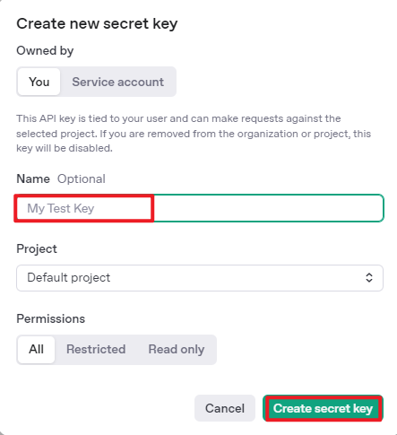
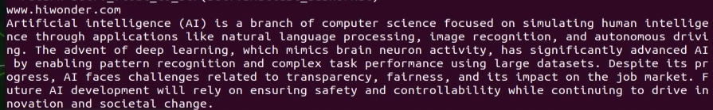
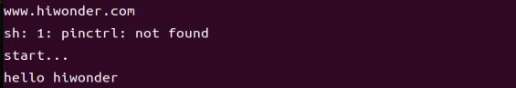
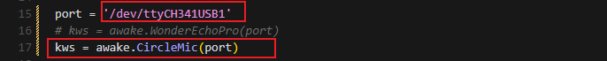
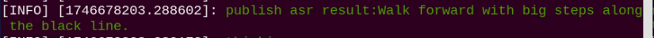
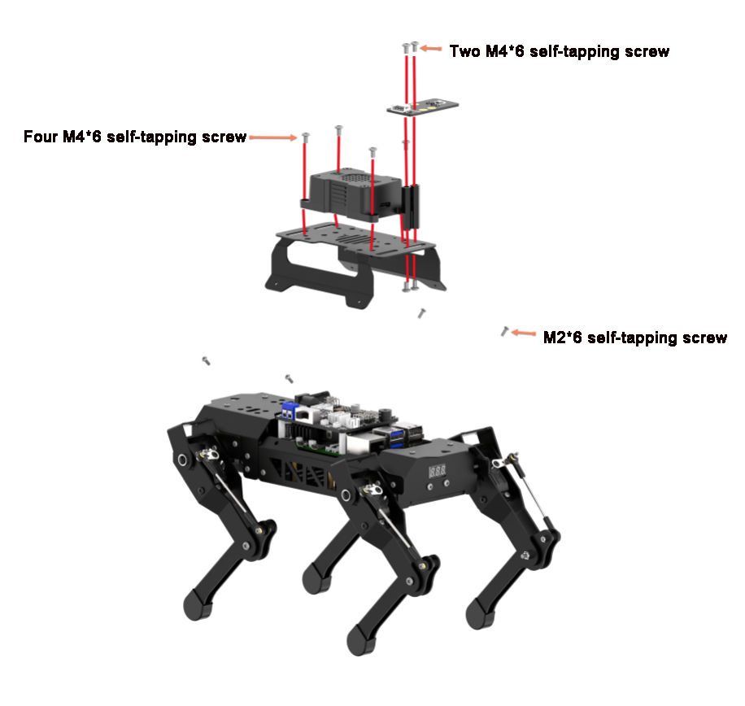
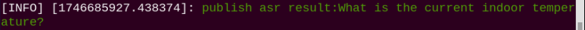

# 34. ROS2 AI Large Model Courses

## 34.1 Large Models Basic Courses

### 34.1.1 Large Language Model Courses

* **Overview of Large Language Model**

A Large Language Model (LLM) is an advanced artificial intelligence model developed to comprehend and generate human language.


(1) Basic Concept

A Large Language Model (LLM) is a deep learning model trained on extensive text data, designed to either generate natural language text or comprehend the meaning of language. LLM is capable of performing various natural language tasks, such as text classification, question answering, and dialogue, making them a crucial step toward achieving advanced artificial intelligence. Unlike smaller models, LLM leverages a similar Transformer architecture and pretraining objectives (like Language Modeling), but are distinguished by their larger model size, greater training data, and enhanced computational resources.

(2) Features

**Massive Scale:** LLM are characterized by their vast parameter sizes, often reaching billions or even trillions of parameters. This immense scale allows them to capture a wealth of linguistic knowledge and complex syntactic structures.

**Pretraining and Fine-tuning:** LLM utilize a two-stage learning process: pretraining and fine-tuning. Initially, they are pretrained on large-scale, unlabeled text data, learning general language representations and knowledge. Subsequently, they are fine-tuned using labeled data to specialize in specific tasks, allowing them to excel across a wide range of NLP applications.

**Contextual Awareness:** LLM demonstrate exceptional contextual awareness, with their ability to understand and generate language deeply dependent on preceding text. This enables them to perform exceptionally well in tasks like dialogue, article generation, and contextual comprehension.

**Multilingual Capabilities:** LLM support multiple languages, extending beyond just English. This multilingual proficiency enables them to power cross-lingual and cross-cultural applications, enhancing their versatility and global reach.

**Multimodal Support:** Some LLMs have expanded to handle multimodal data, including text, images, and speech. This capability allows them to understand and generate content across various media types, opening up more diverse application possibilities.

**Emergent Properties:** LLM exhibit remarkable emergent properties, where performance improvements become apparent in large models but are absent in smaller ones. This makes them adept at handling more complex tasks and challenges.

**Cross-domain Applications:** LLM have been widely adopted across numerous fields, including text generation, machine translation, information retrieval, summarization, chatbots, and virtual assistants. Their influence is profound, impacting both daily life and work in significant ways.

**Ethical and Risk Considerations:** While LLM showcase impressive capabilities, they also raise important ethical and risk-related concerns, such as the potential generation of harmful content, privacy violations, and cognitive biases. As such, the development and deployment of LLM must be approached with careful consideration and caution.

(3) Working Principle

Large Language Model (LLM) are built on deep learning principles and are trained using massive datasets and substantial computational resources to develop neural networks with billions of parameters. Through iterative training and parameter optimization, these models learn to perform a wide range of tasks with high accuracy. The “large” in LLM reflects their immense scale—encompassing a vast number of parameters, extensive training data, and significant computational demands. This scale enables advanced models to achieve superior generalization capabilities and deliver increasingly accurate results, even in highly specialized domains.

Today, some of the most popular applications revolve around generative AI, such as language generation tools (e.g., ChatGPT) and image generation platforms (e.g., Midjourney). At the core of these applications is the concept of generation—the model’s ability to predict and produce coherent content based on a given input.

(4) Application Scenarios

① Text Generation

Large Language Models are capable of generating diverse types of text, including news articles, stories, poems, and more. These capabilities make them well-suited for applications in content creation, creative writing, and automated storytelling.

② Text Classification

Large Language Models can classify text into various categories, such as sentiment analysis and topic identification. These capabilities are especially valuable in scenarios like public opinion analysis, information retrieval, and content moderation.

③  Machine Translation

Large Language Models excel at machine translation, enabling the conversion of text from one language to another. These capabilities are essential for cross-language communication, localization, and global collaboration.

④ Question-Answering Systems

Large Language Models can be used to build question-answering systems that respond to user queries. These applications are particularly valuable in areas such as intelligent customer support, knowledge retrieval, and information lookup.

* **Large Language Model Deployment**

:::{Note}

This section outlines the steps to register on the official OpenAI website and obtain the API key for the Large Language Model.

:::

(1) OpenAI Account Registration and Setup

① Copy the following URL: <https://platform.openai.com/docs/overvie>

Open the OpenAI website and click on the "Sign Up" button in the top right corner.


② Follow the prompts to register and log in using your Google, Microsoft, or Apple account.


③ Click on the settings icon, then select Billing, followed by Payment Methods, to link your payment method. Recharge your account to purchase tokens.


④ After completing the setup, click on API Keys, then select Create New Secret Key. Follow the prompts to fill in the required information. Once the key is created, make sure to save it for future use.




⑤ With these steps, the large model has been successfully created and deployed. You can now use the API in the upcoming lessons.

(2) OpenRouter Account Registration and Setup

① Copy the following URL: https://openrouter.ai/

Open the webpage in your browser and click "Sign In". Register using your Google account or another available login option.


② After logging in, click the icon in the top-right corner and select **"Credits"** to link your payment method.


③ To create an API key, go to **"API Keys"**, then click **"Create Key"**. Follow the prompts to complete the process. Once the key is generated, make sure to save it for future use.


④ At this point, the large model is successfully created and deployed. You can now use the API in the upcoming lessons.

* **Large Language Model Accessing**

:::{Note}

To proceed with this section, you will need to register on the appropriate website and obtain the API key for the large model (please refer to the file [34.1.1 Large Language Model Courses -> Large Language Model Deployment]()).

:::

It is important to ensure a stable network connection for the development board. For optimal performance, we also recommend connecting the main controller to a wired network for enhanced stability.


(1) Environment Configuration

:::{Note}

If you have purchased a robot from our company with built-in large model functionality, the environment is already pre-configured in the robot’s image. You can directly proceed to Section 3 of this document to configure the API key.

:::

Install Vim and Gedit by running the corresponding commands. Install the necessary software packages and audio libraries required for PyAudio.

```
sudo apt update
```

```
sudo apt install vim
```

```
sudo apt install gedit
```

```
sudo apt install python3 python3-pip python3-all-dev python3-pyaudio portaudio34.dev libsndfile1
```


(2) Importing the Large Model Program Directory

① In this section, locate the [Appendix -> Source Code]() folder within the same directory as this tutorial document.


② Using the MobaXterm remote connection tool (as outlined in the '5.5 Remote Access and File Transfer' tutorial), drag the folder into the root directory of the main controller. The software installation package can be found in the [Appendix -\> Remote Access and File Transfer]() directory.


③ Next, execute the command to navigate to the **'speech_pkg' directory"**.

```
cd ~/large_models/speech_pkg/
```

④ Execute the following commands to install the necessary third-party libraries.

```
pip3 install -r requirements.txt --break-system-packages
```

```
pip3 install dashscope --break-system-packages
```

```
pip3 install opencv-python --break-system-packages
```

```
pip3 install sympy==1.13.1 --break-system-packages
```

```
pip3 install torch --break-system-packages
```

⑤ Then, use the command in the terminal to navigate to the **'speech'** directory.

```
cd ~/large_models/speech_pkg/speech
```

⑥ Run the command to list the files in the **'speech'** directory.

```
ls
```


⑦ Depending on the type of main controller and Python version you're using, switch to the appropriate folder for packaging and distribution. This tutorial uses the Jetson Orin controller as an example.

| **Type of main controller** | **Python version** |
| --------------------------- | ------------------ |
| jetson_nano                 | 3.6                |
| jetson_orin                 | 3.10               |
| rpi5                        | 3.11               |
| rpi5_docker                 | 3.8                |

⑧ Execute the following command to navigate to the Jetson Orin folder.

```
cd jetson_orin/
```

⑨ Enter the command to copy the 'speech.so' file to the parent directory.

```
cp -r speech.so ..
```

⑩ Enter the command to navigate to the parent directory.

```
cd ../..
```

⑪ Execute the command to package the speech file for the Python environment.

```
pip3 install .
```

⑫ Enter the command to install and update the OpenAI Python library.

```
pip3 install openai -U
```

(3) Key Configuration

① Open the terminal and enter the following command to navigate to the directory for configuring the large model keys:

```
cd ~/large_models
```

② Then, open the configuration file by running:

```
vim config.py
```

③ Once the file is open, configure the OpenAI and OpenRouter keys by filling in the llm_api_key and vllm_api_key parameters, respectively (you can obtain these keys from the '[34.1.1 Large Language Model Courses -> Large Language Model Deployment]()' course).


For instance, copy the key created in Section 1.2 of this chapter and paste it into the appropriate field. To paste the key, place the cursor between the quotation marks, hold the **"Shift"** key, right-click, and select **"Paste"** .

:::{Note}

Do not mix keys from different models, as this may cause the functionality to malfunction

:::


④  After pasting, press the **'Esc'** key, then type the following command and press Enter to save the file:

```
:wq
```

(4) Running the Demo Program

Once the keys are configured, you can run the demo program (openai_llm_demo.py) to experience the text generation capabilities of the large model. For example, the program's prompt might be: 'Write a 50-word article about how technology is changing life.'


① To run the demo, enter the following command in the terminal:

```
python3 openai_llm_demo.py
```

② After running the program, the output will appear as shown in the image below.


* **Semantic Understanding with Large Language Model**

Before starting this section, make sure you have completed the API key configuration outlined in the file [34.1.1 Large Language Model Courses ->  Large Language Model Accessing]().

In this lesson, we’ll use a large language model to analyze and summarize short passages of text.

(1) Start by opening a new terminal window, then navigate to the large model project directory:

```
cd large_models/
```

(2) Next, run the demo program with the following command:

```
python3 openai_llm_nlu_demo.py
```

(3) As shown in the output, the model demonstrates strong summarization abilities.



(4) The result matches the prompt defined in the program — where a passage of text is provided to the model, and it generates a concise summary.


* **Emotional Perception with Large Language Model**

To proceed with this section, ensure that you have completed the API key configuration as described in the file [34.1.1 Language Model Courses -> Large Language Model Accessing]().

In this lesson, we will use a large language model to assess its ability to perceive emotions based on descriptive words. We’ll provide the model with emotional expressions and evaluate its response.

(1) Start by opening a new terminal window, then navigate to the large model project directory:

```
cd large_models/
```

(2) Next, run the demo program with the following command:

```
python3 openai_llm_er_demo.py
```

(3) From the output, you will see that the model successfully identifies and understands the emotions conveyed, providing a text-based response accordingly.


(4) In this program, we send two emotional expressions to the model: the first is an expression of sadness, **"So Sad."** After the model responds, we then send an expression of happiness, "Ha Ha," and observe how the model reacts.


### 34.1.2 Large Speech Model Courses

* **Overview of Large Speech Model**

(1) What is a Large Speech Model?

A Speech Large Model (LSM) refers to a machine learning model that uses deep learning techniques to process and understand speech data. These models can be applied in a variety of tasks, such as speech recognition, speech synthesis, speech translation, and emotional analysis of speech. The design and training of these models typically require large amounts of speech data and substantial computational resources, which is why they are referred to as "large models."

(2) Why Do We Need Large Speech Model?

With the advancement of artificial intelligence and deep learning, traditional speech processing methods face many limitations. Large models leverage vast amounts of data and deep neural networks to learn and understand the complex features within speech, thereby improving the accuracy and naturalness of speech recognition and generation.

Their advantages include:

① High Accuracy: They maintain a high recognition rate even in noisy environments and with various accents.

② Naturalness: Speech generated by synthesis models is more natural, closely resembling human speech.

③ Versatility: These models support a wide range of languages and tasks, such as multilingual speech recognition, speech-to-text (STT), text-to-speech (TTS), and emotion recognition.

(3) Development of Speech Recognition Technology

Word-Level Speech Recognition: At this stage, speech recognition systems could only recognize individual words

Phrase-Level Speech Recognition: With the expansion of data and advancements in algorithms, speech recognition systems gradually gained the ability to recognize longer phrases, such as "Please turn on my computer."

Sentence-Level Speech Recognition: In recent years, with the emergence of AI large models, speech recognition systems have become capable of recognizing entire sentences and understanding their underlying meaning.

(4) Differences Between Large Speech Model and Traditional Speech Processing Technologies

① Processing Methods

Traditional Speech Processing Technologies: These typically rely on manual feature extraction and shallow models, such as Gaussian Mixture Models (GMM) and Hidden Markov Models (HMM), to process speech signals.

Large Speech Model: These use end-to-end learning, directly mapping raw speech waveforms to target outputs (such as text or another speech signal), reducing the reliance on manual feature extraction. They are typically based on deep learning architectures, such as Convolutional Neural Networks (CNN), Recurrent Neural Networks (RNN), and Transformers.

② Model Complexity

Traditional Speech Processing Technologies: These models are relatively simple, with fewer parameters.

Large Speech Model: These models have complex structures and a large number of parameters, enabling them to capture more subtle speech features and contextual information.

③ Recognition Capability

Traditional Speech Processing Technologies: These are highly adaptable to specific scenarios and conditions, but their recognition capability is limited when encountering new, unseen data.

Large Speech Model: Due to their large number of parameters and powerful learning ability, they offer superior recognition capabilities and can adapt to a wider variety of speech data and environments.

④Training Data Requirements

Traditional Speech Processing Technologies: These typically require less data for training, but the data must be highly annotated and of high quality.

Large Speech Model: These require vast amounts of training data to fully learn the complexities of speech, often necessitating large quantities of annotated data or the use of unsupervised/self-supervised learning methods.

(5) Core Technologies of Speech Large Model

① Automatic Speech Recognition (ASR)

ASR is the technology that converts human speech into text. The core steps of a speech recognition system include feature extraction, acoustic modeling, and language modeling.

② Text-to-Speech (TTS)

TTS is the technology that converts text into speech. Common speech synthesis models include the Tacotron series, FastSpeech, and VITS.

③ Speech Enhancement and Noise Reduction

Speech enhancement techniques are used to improve the quality of speech signals, typically for eliminating background noise and echoes. This is crucial for speech recognition applications in noisy environments.

(6) Applications of Speech Large Model

Intelligent Voice Assistants: For instance, Amazon Alexa and Google Home, which engage with users through voice interactions.

Customer Service Chatbots: In the customer service sector, speech large models assist businesses in enhancing service efficiency by swiftly processing customer inquiries through speech recognition technology, enabling 24/7 support.

Healthcare: Helping doctors with medical record-keeping, thus improving work efficiency.

Speech-to-Text: Speech large models excel in converting speech to text, offering accurate recognition and transcription in a variety of contexts. They are widely used in applications such as meeting transcription and subtitle generation.

* **Voice Device Introduction and Testing**

(1) Device Overview

① WonderEchoPro

Introduction：

WonderEcho Pro, also known as the AI Voice Interaction Box, is equipped with a high-performance noise-canceling microphone and a high-fidelity speaker. It utilizes a USB-to-audio module, making it plug-and-play with no drivers required, and is compatible with multiple operating systems for both playback and recording.

Integrating various voice processing technologies, WonderEcho Pro features advanced noise suppression algorithms that effectively filter background noise from the environment. It supports a complete voice interaction process—from wake-up to recognition and response. With its modular design, each functional component (e.g., wake word detection, sound detection, speech recognition, and synthesis) can be developed and tested independently.

Features and Specifications：

Built-in microphone and speaker interface, supporting both audio input and output

Driver-free, plug-and-play functionality compatible with Windows, macOS, Linux, Android, and more

Standard USB 2.0 interface

Control interface: USB

Voice chip model: CL1302

Speaker output: 3.0W per channel (4Ω BTL)

Power supply voltage: 5V

② 6-Microphone Circular Array

Introduction：

The 6-Microphone Circular Array is a high-sensitivity, high signal-to-noise ratio microphone board. It features six analog silicon microphones arranged in a circular pattern. When paired with a main control board, it supports high-performance Acoustic Echo Cancellation (AEC), environmental noise reduction, and factory-level voice pickup from up to 10 meters.


Features and Specifications：

**Operating Voltage:** 3.3V (typical)

**Operating Current:** 0.8mA (typical)

**Operating Temperature:** -20°C (min), 25°C (typical), 70°C (max)

**Operating Humidity:** Up to 95% relative humidity (max)

(1) Recording and Playback Test

The following demonstration uses the Raspberry Pi 5 as an example. The connection and testing steps are also applicable to other compatible devices such as the Jetson series:

① Connection Illustration and Detection


If the main controller is a Raspberry Pi, you can use VNC remote desktop access (refer to the appendix: Remote Access and File Transfer) to log into the Raspberry Pi system. Once connected, check the upper right corner of the desktop for microphone and speaker icons. As shown in the image below, the presence of these icons indicates a successful connection.


If you're using a NVIDIA Jetson device, you can connect via the NoMachine remote access tool. After logging in, check the upper right corner of the system interface for the speaker icon to confirm successful detection.


② Recording Test

Next, open a new terminal window and enter the following command to check the available recording devices. Note that the -l option is a lowercase "**L**". You should see the card number (card) listed—for example, card 0. This is just an example; please refer to your actual query result.

```
arecord -l
```


Then, use the following command to start recording. Replace the red-marked card number (hw:0,0) with the actual number you found in the previous step:

```
arecord -D hw:0,0 -f S16_LE -r 16000 -c 2 test.wav
```

This will create a test.wav audio file in the current directory.

You can record a short 5-second sample, then press Ctrl + C to stop the recording.

③ Playback Test

After the recording is complete, you can check whether the audio file was successfully created by listing the contents of the current directory:

```
ls
```


If test.wav appears in the list, the recording was successful. To play back the recording, use the following command:

```
aplay test.wav
```

* **Voice Wake-Up**

In this lesson, we’ll learn how to use a large speech model to activate the voice device by speaking a predefined wake word through a program.

(1) WonderEcho Pro Wake-Up

Device Check：

To proceed, we need to identify the USB device name assigned to the connected WonderEcho Pro or Circular Microphone Array (hereafter referred to as the voice device). Please follow the steps below carefully. 

:::{Note}

Do not connect any other USB devices during this process to avoid confusion.

:::

① First, disconnect the voice device, then open a terminal and run the following command:

```
ll /dev | grep USB
```

② Next, reconnect the voice device to the USB port on your main board and run the same command again:

```
ll /dev | grep USB
```

③ You should now see a newly listed USB port, such as ttyCH341USB1.  

Please take note of this device name—it may vary depending on the main controller being used.


Wake-Up Test：

① To begin, update the port number used in the program by editing the script. You’ll also need to uncomment the line for the port you're using and comment out any unused ports.

```
vim wakeup_demo.py
```

Press i to enter edit mode and make the necessary changes as shown below (update the port number accordingly and adjust comments as needed).


Once the changes are complete, press ESC, then type :wq and press Enter to save and exit the editor.

② Next, return to the system interface and run the wake-up demo using the command below. Speak the wake word **“HELLO HIWONDER”** clearly toward the WonderEcho Pro voice device.  

If the output includes **“keyword detect”**, it indicates that the firmware has been successfully flashed and the wake word is functioning correctly.

```
python3 ~/large_models/wakeup_demo.py
```



(2) 6-Microphone Circular Array

As with the WonderEcho Pro, you can connect the 6-Microphone Circular Array to your main board (Raspberry Pi or NVIDIA Jetson) using a Type-C to USB cable.

Device Check:

For Jetson users, connect to the Jetson system using the NoMachine remote access tool. Once connected, check the desktop interface.  

If the 6-Microphone Circular Array icon appears on the left side of the desktop, it indicates the device has been successfully recognized.

Wake-Up Test:

① Open a new terminal window and run the following command to edit the wakeup_demo.py script:

```
vim ~/large_models/wakeup_demo.py
```

② Press i to enter edit mode.

③ Update the port to match the device port number you previously identified. Comment out the WonderEcho Pro configuration (add \# at the beginning of the corresponding line), and uncomment the line using the circular microphone array on line 11 as the input device (see red box in the referenced image).


④ Press ESC to return to command mode, then type :wq and press Enter to save and exit.


⑤ In the terminal, run the wake-up program with the following command:

```
python3 ~/large_models/wakeup_demo.py
```

⑥ After about 30 seconds of initialization, speak the wake word **“hello hiwonder”** to test the device.


(3) Brief Program Overview

This is a Python-based wake word detection script that utilizes the speech module to process audio input and detect a specific wake word (e.g., "**HELLO_HIWONDER**").

Source Code Path: [/home/ubuntu/large_models/wakeup_demo.py]()

Importing Required Modules

{lineno-start=5}

```
import os
import time
from speech import awake
```

`os`: Used for handling file paths and executing system-level commands.

`time`: Provides delay functions to prevent overly frequent detection attempts.

`speech`: The core module responsible for processing audio input and detecting the wake word.

Initializing the wonderecho Class

{lineno-start=9}

```
port = '/dev/ttyUSB0'
kws = awake.WonderEchoPro(port)
```

Attempts to Turn Off the Cooling Fan on Raspberry Pi 5

{lineno-start=13}

```
try:  # If a fan is present, it's recommended to turn it off before detection to reduce interference(如果有风扇，检测前推荐关掉减少干扰)
    os.system('pinctrl FAN_PWM op dh')
except:
    pass
```

Purpose: Attempts to turn off the cooling fan by executing the system command `pinctrl FAN_PWM op dh`. This helps minimize background noise from the fan that could interfere with wake word detection.

Error Handling: If the command fails (e.g., due to unsupported hardware), the program catches the exception and continues running without interruption.

Main Wake Word Detection Loop

{lineno-start=18}

```
kws.start() # Start detection(开始检测)
print('start...')
```

The program starts the wake word detection thread using kws.start().

It prints start... to indicate that detection has been successfully initiated.

Main Program Logic

{lineno-start=20}

```
while True:
    try:
        if kws.wakeup(): # Wake-up detected(检测到唤醒)
            print('hello hiwonder')
        time.sleep(0.02)
    except KeyboardInterrupt:
        kws.exit() # Cancel processing (关闭处理)
        try:
            os.system('pinctrl FAN_PWM a0')
        except:
            pass
        break
```

During each iteration, the program checks whether the wake word has been detected. If the wake word is detected, it prints keyword detected.

The detection frequency is controlled using time.sleep(0.02) to prevent excessive CPU usage.

Pressing Ctrl+C triggers a KeyboardInterrupt, which gracefully exits the detection loop.

Upon exit, the program calls kws.exit() to stop the wake word detection process.

The fan is then restored to its original state (if applicable).

(4) Extended Functionality

Modifying the Wake-Up Response Text

In this section, you'll learn how to change the message that appears after a successful wake word detection.

① For example, if the wake word "HELLO_HIWONDER" is detected, and you'd like the program to print "hello" instead of the default message, follow the steps below. Navigate to the large_models directory and open the script with:

```
vim wakeup_demo.py
```

② Press i to enter INSERT mode (you’ll see -- INSERT -- at the bottom of the screen). Locate the line ‘**print('hello hiwonder')**’, and modify it to ‘print('hello')’

```
i
```


③ Press ESC, then type **:wq** and press Enter to save and exit.

```
:wq
```

④ Finally, run the program with:

```
python3 wakeup_demo.py
```


(5) Creating Custom Firmware for WonderEchoPro

If you'd like to create more advanced or customized wake words and voice commands, please refer to the document titled:  

“[Appendix →  Firmware Flashing Tool → Creating Firmware for WonderEchoPro]()”.

* **Speech Recognition**

(1) What is Speech Recognition?

Speech Recognition (Speech-to-Text, STT) is a technology that converts human speech signals into text or executable commands. In this course, we will implement speech recognition functionality using Alibaba OpenAI's Speech Recognition API.

(2) How It Works

The wave library is used to extract audio data. The extracted audio is then sent to OpenAI’s ASR (Automatic Speech Recognition) model. The recognized text returned by the ASR model is stored in speech_result for use in subsequent processes.

(3) Preparation Before the Experiment

Before proceeding, refer to the course “[34.1.2 Large Speech Model Courses -> Large Language Models Deployment]()” to obtain your API key, and make sure to add it into the configuration file (config).

(4) Experiment Steps

① Power on the device and connect to it using MobaXterm.  

(For detailed instructions, please refer to [Appendix ->Remote Connection Tools and Instructions]().)

② Navigate to the program directory by entering the following command:

```
cd large_models/
```

③ Open the configuration file to input your API Key by entering the command below. Press i to enter INSERT mode and enter your API Key. Once finished, press Esc, type :wq, and hit Enter to save and exit.

```
vim config.py
```


④ Run the speech recognition program with:

```
python3 openai_asr_demo.py
```

(5) Function Realization

After the program starts, the microphone will recognize the recorded audio content from the user and print the converted text output.


(6) Brief Program Analysis

This program implements a speech recognition system by calling OpenAI's Speech-to-Text API to convert audio files into text.

The program source code is located at: [/home/ubuntu/large_models/openai_asr_demo.py]()

① Module Import

{lineno-start=6}

```
from speech import speech
```

The speech module encapsulates ASR (Automatic Speech Recognition) functionalities, such as connecting to an external ASR service.

② Define ASR Class

{lineno-start=11}

```
asr = speech.RealTimeOpenAIASR()
```

asr = speech.RealTimeOpenAIASR()

This line creates a real-time speech recognition object named asr. The RealTimeOpenAIASR class is used to interact with the speech recognition service.

③ Speech Recognition Functionality

{lineno-start=13}

```
asr.update_session(model='whisper-1', language='en', threshold=0.2, prefix_padding_ms=300, silence_duration_ms=800) 
```

An ASR client object is created to prepare for invoking the speech recognition service.

The asr.asr() method is called to send the audio file (wav) to the ASR service for recognition.

The recognized result (typically text) is printed to the console.

(7) Function Extension

You can modify the model name to enable speech recognition in various languages, such as Chinese, English, Japanese, and Korean.

① Enter the following command to edit the script:

```
vim openai_asr_demo.py
```

② Press the i key to enter INSERT mode, and update the model setting. For example, modify it to use the gpt-4o-transcribe model.

```
i
```


③ Then, run the program with the command:

```
python3 openai_asr_demo.py
```

④ Record a sample sentence such as "Hello, can you hear me clearly?", and the recognized text will be printed on the console.


* **Speech Synthesis**

(1) What is Speech Synthesis?

Speech synthesis (SS) is a technology that converts written text into intelligible spoken audio. It enables computers to generate natural, human-like speech for communication or information delivery.

In this course, we will run a program that processes text using a large language model and generates corresponding audio.

(2) How It Works

The program first sends the text to the OpenAI TTS (Text-to-Speech) model. The model returns the generated audio data, which is saved as a file named tts_audio.wav for playback or storage.

(3) Preparation Before the Experiment

Refer to the course “[34.1 Large Models Basic Courses ->34.1.1Large Language Models Courses -> Large Language Models Deployment]()” to obtain your API key, and update the configuration file accordingly.

(4) Experiment Steps

① Power on the device and connect to it using MobaXterm (refer to the [appendix -> Remote Connection Tools and Instructions]()" for detailed guidance).

② Navigate to the program directory by entering the following command:

```
cd large_models/
```

③ Open the configuration file to enter your API Key. After editing, press Esc, type :wq, and hit Enter to save and exit:

```
vim config.py
```


④ Finally, run the program with the following command:

```
python3 openai_tts_demo.py
```

(5) Function Realization

Upon running the program, it will play an audio message saying "Hello, Can I Help You", and simultaneously save the audio file with the same content to the following directory:  

[/home/ubuntu/large_models/resources/audio/]()


(6) Brief Program Analysis

This program is a speech synthesis system based on OpenAI’s Text-to-Speech (TTS) API, capable of converting text into audio files. It supports input text and outputs audio in formats like PCM, WAV, FLAC, AAC, Opus, and MP3. By specifying the desired text, the program sends the request to the API and returns the synthesized audio, which can be played or saved locally.

The source code for this program is located at:  [/home/ubuntu/large_models/openai_tts_demo.py]()

① Module Import

{lineno-start=5}

```
from config import *
from speech import speech  
```

speech: This module encapsulates the TTS functionalities.

② Definition for TTS Class

{lineno-start=8}

```
tts = speech.RealTimeOpenAITTS()
tts.tts("Hello, Can I help you?") # https://platform.openai.com/docs/guides/text-to-speech
tts.tts("Hello, Can I help you?", model="tts-1", voice="onyx", speed=1.0, instructions='Speak in a cheerful and positive tone.')
tts.save_audio("Hello, Can I help you?", model="gpt-4o-mini-tts", voice="onyx", speed=1.0, instructions='Speak in a cheerful and positive tone.', audio_format='wav', save_path="./resources/audio/tts_audio.wav")
```

`speed`: Specifies the playback speed; the default value is 1.

For intelligent real-time applications, it is recommended to use the gpt-4o-mini-tts model. 

Other available models include tts-1 and tts-1-hd. tts-1 offers lower latency but with slightly reduced quality compared to tts-1-hd.

Voice Options: nova, shimmer, echo, onyx, fable, alloy, ash, sage, coral.

For more details, you can refer to the OpenAI documentation:

https://platform.openai.com/docs/guides/text-to-speech

③ Function Extension

To change the voice, follow these steps:

Step1 : Open the program by entering the command:

```
vim openai_tts_demo.py
```

Step2 : Press i on your keyboard to enter INSERT mode. Locate the line voice="onyx" and modify it to voice="nova".

```
i
```


Step3 : Press Esc, then type :wq and hit Enter to save and exit.

```
:wq
```


Step4 : Execute the program with the following command:

```
python3 openai_tts_demo.py
```


Once the program starts, the speaker will play the synthesized audio using the newly selected voice style.

* **Voice Interaction**

(1) What is Voice Interaction?

Voice Interaction (VI) refers to a method of communication between humans and computers or devices through spoken language. It integrates speech recognition and speech synthesis, enabling devices to both understand user commands and respond naturally, creating true two-way voice communication. To achieve natural voice interaction, factors such as semantic understanding and sentiment analysis must also be considered, allowing the system to accurately interpret user intent and provide appropriate responses.

This approach can be used as the foundation for developing our own AI assistant features.

(2) How It Works

First, the wake word detection module listens for a specific wake-up word. Once detected, it initiates audio recording. After recording, Automatic Speech Recognition (ASR) converts the audio into text, which is then sent to a Large Language Model (LLM) to generate an appropriate response. The generated text is subsequently converted into speech through a Text-to-Speech (TTS) module and played back to the user. This entire process enables seamless and natural interaction between the user and the voice assistant.

(3) Experiment Steps

① Power on the device and connect to it via MobaXterm (refer to Appendix "5.1 Remote Connection Tools and Instructions" for connection guidance).

② To check the microphone's port number, first disconnect the microphone and run the command. Then reconnect the microphone and run the command again to determine the port number (Note: do not connect any other USB devices during this process).

```
ll /dev | grep USB
```

After disconnecting the microphone, no USB device should appear.


Upon reconnecting the microphone, a USB port (e.g., ttyCH341USB1) will be listed (make sure to note this device name). The device name may vary depending on the main controller.

③ Navigate to the program directory:

```
cd large_models/
```

④ Open the configuration file to enter your API Key. After editing, press Esc, then type :wq and hit Enter to save and exit:

```
vim config.py
```


⑤ Enter the port number you obtained and modify the corresponding microphone port settings for either WonderEcho Pro or the six-microphone setup. Uncomment the configuration for the port you intend to use and comment out the settings for any unused ports.

```
vim openai_interaciton_demo.py
```

If you are using the WonderEcho Pro, modify the corresponding section:

If you are using the 6-Microphone Array, modify the relevant section:



⑥ Run the program:

```
python3 openai_interaciton_demo.py
```

⑦ To stop the program at any time, simply press Ctrl+C.

(4) Function Realization

After successful execution, the voice device will announce 'I’m ready.' Then, upon hearing the wake-up word 'HELLO_HIWONDER,' the device will respond with 'I’m here,' indicating that the assistant has been successfully awakened. You can now ask the AI assistant any questions:

For example: 'What are some fun places to visit in New York?'


(5) Brief Program Analysis

The program integrates voice recognition, speech synthesis, and intelligent response functionalities to create a voice assistant. Interaction is initiated through the wake-up word (HELLO_HIWONDER). Users can converse with the assistant via voice commands, and the assistant will respond using text-to-speech technology. The overall structure is clear, with distinct modules that are easy to expand and maintain.

The source code for this program is located at: [/home/ubuntu/large_models/openai_interaction_demo.py]()

(1) Module Import

{lineno-start=5}

```
import os
import time
from config import *
from speech import awake
from speech import speech
```

time: Used to control the interval between program executions.

speech: The core module, integrating wake-up word detection, speech activity detection, speech recognition, TTS, and LLM.

(2) Definition of Audio File Paths

{lineno-start=11}

```
wakeup_audio_path = './resources/audio/en/wakeup.wav'
start_audio_path = './resources/audio/en/start_audio.wav'
no_voice_audio_path = './resources/audio/en/no_voice.wav'
```

This section configures the audio file paths used by various functional modules, such as wake-up sounds, recording storage paths, and prompt sounds.

The text-to-speech (TTS) module is initialized to convert LLM responses into speech.

(3) Main Functional Logic

{lineno-start=33}

```
def main():
    kws.start()
    while True:
        try:
            if kws.wakeup(): # Wake word detected(检测到唤醒词)
                speech.play_audio(wakeup_audio_path)  # Play wake-up sound(唤醒播放)
                asr_result = asr.asr() # Start voice recognition(开启录音识别)
                print('asr_result:', asr_result)
                if asr_result:
                    # Send the recognition result to the agent for a response(将识别结果传给智能体让他来回答)
                    response = client.llm(asr_result, model='gpt-4o-mini')
                    print('llm response:', response)
                    tts.tts(response)
                else:
                    speech.play_audio(no_voice_audio_path)
            time.sleep(0.02)
        except KeyboardInterrupt:
            kws.exit() 
            try:
                os.system('pinctrl FAN_PWM a0')
            except:
                pass
            break
        except BaseException as e:
            print(e)
```

Wake-up Detection: Continuously monitors for the wake-up word. Once detected, it stops the wake-up detection and plays the wake-up prompt sound.

Voice Processing: Records and recognizes the user's speech, uses the language model to generate a response, and then converts the response into speech for playback.

Error Handling: Catches exit signals and runtime errors to ensure the program exits safely and releases resources.

### 34.1.3 Vision Language Model Courses

* **Overview of Vision Language Model**

Vision Language Model (VLM) integrate visual recognition capabilities into traditional Language Model (LLM), enabling more powerful interactions between vision and language through multimodal inputs.

(1) Basic Concept

Vision Language Model (VLM) are a type of artificial intelligence model that leverages deep learning techniques to learn from and process large-scale visual data. These models often adopt convolutional neural network (CNN) architectures, enabling them to extract rich visual features from images or video streams and perform various tasks such as image classification, object detection, and facial recognition. In theory, VLM possess powerful capabilities in feature extraction and pattern recognition, making them widely applicable in fields like autonomous driving, facial recognition, and medical imaging analysis.

(2) Features

**Multimodal Input and Output**: VLM can process both images and text as input and generate various forms of output, including text, images, charts, and more.

**Powerful Visual-Semantic Understanding**: With extensive knowledge accumulated from large-scale visual datasets, VLMsexcel at tasks such as object detection, classification, and image captioning.

**Visual Question Answering (VQA):** VLM can engage in natural language conversations based on the content of input images, accurately answering vision-related questions.

**Image Generation:** Some advanced VLM are capable of generating simple image content based on given conditions.

**Deep Visual Understanding:** These models can recognize intricate details within images and explain underlying logical and causal relationships.

**Cross-Modal Reasoning:** VLM can leverage visual and linguistic information together, enabling reasoning across modalities, such as inferring from language to vision and vice versa.

**Unified Visual and Language Representation Space:** By applying attention mechanisms, VLM establish deep connections between visual and semantic information, achieving unified multimodal representations.

**Open Knowledge Integration:** VLM can integrate both structured and unstructured knowledge, enhancing their understanding of image content.

(3) How It Works

The working principle of Vision Language Model is primarily based on deep learning techniques, particularly Convolutional Neural Networks (CNNs) and Transformer architectures. Through multiple layers of neurons, these models perform feature extraction and information processing, enabling them to automatically recognize and understand complex patterns within images.

In a VLM, the input image first passes through several convolutional layers, where local features such as edges, textures, and shapes are extracted. Each convolutional layer is typically followed by an activation function (e.g., ReLU) to introduce non-linearity, allowing the model to learn more complex representations. Pooling layers are often used to reduce the dimensionality of the data while preserving important information, helping to optimize computational efficiency.

As the network deepens, it gradually transitions from extracting low-level features (like edges and corners) to higher-level features (such as objects and scenes). For classification tasks, the final feature vector is passed through fully connected layers to predict the probability of different target categories. For tasks like object detection and segmentation, the model outputs bounding boxes or masks to indicate the location and shape of objects within the image.

Transformer-based VLM divide images into small patches, treating them as sequential data, and apply self-attention mechanisms to capture global relationships within the image. This approach is particularly effective at modeling long-range dependencies, enabling VLM to excel at understanding complex visual scenes.

Training VLM typically requires large-scale labeled datasets. Through backpropagation, the model optimizes its parameters to minimize the loss between predictions and ground-truth labels. Pretraining on massive datasets allows the model to acquire general-purpose visual features, while fine-tuning on specific tasks further improves performance for specialized applications.

Thanks to this design, Visual Language Models are able to process and understand visual data effectively, and are widely used in applications like image classification, object detection, and image segmentation, driving rapid progress in the field of computer vision.

(4) Application Scenarios

① Image Captioning

VLM can automatically generate textual descriptions based on input images. This capability is particularly valuable for social media platforms, e-commerce websites, and accessibility technologies, such as providing visual content descriptions for visually impaired users.

② Visual Question Answering

Users can ask questions related to an image, such as "What is in this picture?" or "What color is the car?" The model analyzes the image content and provides accurate, natural-language responses, making it highly applicable in fields such as education, customer support, and information services.

③ Image Retrieval

In image search engines, users can perform searches using text descriptions, and Vision Language Model (VLM) can understand the descriptions and return relevant images. This capability is especially important on e-commerce platforms, where it allows users to find desired products more intuitively.

④ Augmented Reality (AR)

Vision Language Model (VLM) can provide real-time visual feedback and language-based explanations in augmented reality applications. When users view real-world scenes through a device's camera, the system can overlay relevant information or guidance, enhancing the overall user experience.

⑤ Content Creation and Editing

In design and creative tools, Vision Language Model (VLM) can generate relevant text content or suggestions based on a user’s visual input (such as sketches or images), helping users complete creative work more efficiently.

⑥ Social Media Interaction

On social media platforms, VLM can generate appropriate comments or tags based on user-uploaded images, enhancing engagement and interaction.

⑦ Medical Imaging Analysis

In the healthcare field, VLM can be used to analyze medical images (such as X-rays and CT scans) and generate diagnostic reports or recommendations, assisting doctors in making more accurate decisions.

* **Vision Language Model Accessing**

:::{Note}

* This section requires the configuration of the API key in "[20.1.3 Vision Language Model Accessing -> Vision Language Model Accessing]()" before proceeding. Additionally, ensure that the images to be used in this section are imported.

* This experiment requires either an Ethernet cable or Wi-Fi connection to ensure the main control device can access the network properly.

  :::

(1) Experiment Steps

Execute the following command to navigate to the directory of Large Model.

```
cd large_models/
```

Run the program:

```
python3 openai_vllm_understand.py
```

(2) Function Realization

After running the program, the output printed matches our request of "Describe the image."


* **Vision Language Model: Object Detection**

:::{Note}

* This section requires the configuration of the API key in "[34.1.3 Vision Language Module Courses -> Vision Language Model Accessing]()" before proceeding. Additionally, ensure that the images to be used in this section are imported.

* This experiment requires either an Ethernet cable or Wi-Fi connection to ensure the main control device can access the network properly.

* In this course, we will use a program to transmit an image to the large model for recognition, which will then identify and locate the objects within the image by drawing bounding boxes around them.

:::

(1) Experiment Steps

① Execute the following command to navigate to the directory of Large Model.

```
cd large_models/
```

② Run the program:

```
python3 qwen_vllm_detect_demo.py
```

(2) Function Realization

After running the program, the positions of the fruits in the image will be circled.


(3) Function Expansion

We can switch the image and change the large model to experience different functionalities of various models.

Change Pictures:

① Click on the path box to navigate to the following directory: [/home/ubuntu/large_models/resources/pictures/]()

Here, you can drag in other images, for example, in the apples.png format.


② Then, input the command:

```
vim large_models/qwen_vllm_detect_demo.py
```

③ Press the "i" key on your keyboard, which will display **"INSERT"** at the bottom.

```
i
```


④ Change the image recognition path from: `./resources/pictures/test_image_understand.jpeg`

To: image = cv2.imread('./resources/pictures/apples.png')


⑤ Next, input the following command and execute the program again to see the results

```
python3 qwen_vllm_detect_demo.py
```


* **Vision Language Model: Scene Understanding**

:::{Note}

* This section requires the configuration of the API key in "[Vision Language Model Accessing]() " before proceeding. Additionally, ensure that the images to be used in this section are imported.

* This experiment requires either an Ethernet cable or Wi-Fi connection to ensure the main control device can access the network properly.

* In this course, we will use a program to send an image to the large model for recognition and generate a description of the content within the image.

(1) Experiment Steps

① Execute the following command to navigate to the directory of Large Model.

```
cd large_models/
```

② Run the program:

```
python3 openai_vllm_understand.py
```

(2) Function Realization

After running the program, the output printed matches our request of "Describe the image."


(3) Function Expansion

If you need to recognize your own image, you should place the image in the corresponding path and modify the image path in the program.

① First, drag your image directly into the ~/large_models/resources/pictures/ path using MobaXterm, and rename the image to test.png.


② Then, open the scene understanding script by entering the following command in the terminal:

```
vim ~/large_models/vllm_understand.py
```

③ Change the image path in the code to reflect the name of your image (e.g., test.png).


④ Run the program:

```
python3 ~/large_models/openai_vllm_understand.py
```


* **Vision Language Model: Optical Character Recognition** 

:::{Note}

* This section requires the configuration of the API key in "1.3.2 Vision Language Model Accessing" before proceeding. Additionally, ensure that the images to be used in this section are imported.

* This experiment requires either an Ethernet cable or Wi-Fi connection to ensure the main control device can access the network properly.

* In this course, we use a program to transmit an image to the large model for recognition, extracting and identifying the text within the image.

  :::

(1) Experiment Steps

① Execute the following command to navigate to the directory of Large Model.

```
cd large_models/
```

② Run the program:

```
python3 openai_vllm_ocr.py
```

(2) Function Realization

After running the program, the output printed will be consistent with the content of the image sent.


(3) Function Expansion

We can switch the image and change the large model to experience different functionalities of various models.

Change Pictures：

① Drag the image directly into the `~/large_models/resources/pictures/` path using MobaXterm. Here, we can drag in the image named 'ocr1.png' as an example, and let the program recognize the text 'COME ON'.


② Then, input the command:

```
vim ~/large_models/openai_vllm_ocr.py
```

③ Press the **"i"** key on your keyboard, which will display **"INSERT"** at the bottom.

```
i
```


④ Change the image recognition path from: ./resources/pictures/ocr.jpeg

To: image = cv2.imread('./resources/pictures/ocr1.png')

```
image = cv2.imread('./resources/pictures/ocr1.png)
```

⑤ Run the program:

```
python3 ~/large_models/openai_vllm_ocr.py
```


### 34.1.4 Multimodal Model Basic Courses

* **Overview of Multimodal Model**

The emergence of Multimodal Model is built upon continuous advancements in the fields of Large Language Model (LLM) and Vision Language Model (VLM).

(1) Basic Concept

As LLM continue to improve in language understanding and reasoning capabilities, techniques such as instruction tuning, in-context learning, and chain-of-thought prompting have become increasingly widespread. However, despite their strong performance on language tasks, LLM still exhibit notable limitations in perceiving and understanding visual information such as images. At the same time, VLM have made significant strides in visual tasks such as image segmentation and object detection, and can now be guided by language instructions to perform these tasks, though their reasoning abilities still require further enhancement.

(2) Features

The core strength of Multimodal Model lies in their ability to understand and manipulate visual content through language instructions. Through pretraining and fine-tuning, these models learn the associations between different modalities—such as how to generate descriptions from images or how to identify and classify objects in visual data. Leveraging self-attention mechanisms from deep learning, Multimodal Model can effectively capture relationships across modalities, allowing them to synthesize information from multiple sources during reasoning and decision-making processes.

**Multimodal Fusion Capability:** Multimodal Model can process and understand multiple types of data simultaneously, including text, images, and audio. This fusion ability enables the models to build connections across modalities, leading to a more comprehensive understanding of information. For instance, a model can generate natural language descriptions based on an image or identify specific objects within an image based on a text query.

**Enhanced Contextual Understanding:** By integrating information from different modalities, Multimodal Model excel at contextual understanding. They can not only recognize content within a single modality but also combine clues from multiple sources to make more accurate judgments and decisions in complex tasks.

**Flexible Interaction Methods:** Users can interact with Multimodal Model through natural language instructions, making communication with the models more intuitive without requiring knowledge of complex programming or operations. For example, users can simply ask about details in an image, and the model can provide relevant answers.

**Scalability:** The architecture and training methods of Multimodal Model allow them to adapt to new modalities and tasks. As technology evolves, additional types of data—such as videos or sensor readings—can be incorporated, expanding their range of applications and capabilities.

**Strong Generative Capabilities:** Similar to large language models, Multimodal Model perform exceptionally well in generating both textual and visual content. They can produce natural language descriptions, summaries, and even create novel visual outputs, meeting a wide variety of application needs.

**Improved Reasoning Abilities:** Although challenges remain, Multimodal Model demonstrate significantly enhanced reasoning capabilities compared to traditional single-modality models. By integrating multimodal information, they can reason effectively in more complex scenarios, supporting advanced tasks such as logical reasoning and sentiment analysis.

**Adaptability and Personalization:** Multimodal Model can be fine-tuned to meet user-specific needs and preferences, enabling highly personalized services. This adaptability offers great potential for applications in fields such as education, entertainment, and customer service.

(3) How It Works

The working principle of Multimodal Model is built upon advanced deep learning and neural network technologies, with a core focus on fusing data from different modalities to understand and tackle complex tasks. At the foundation, Multimodal Model often adopt architectures similar to Transformers, which are highly effective at capturing relationships between different parts of input data. During training, these models are exposed to massive amounts of multimodal data—such as images, text, and audio—and leverage large-scale unsupervised learning for pretraining. Through this process, the models learn the commonalities and differences across modalities, enabling them to grasp the intrinsic connections between various types of information.

In practice, incoming text and visual data are first embedded into a shared representation space. Text inputs are transformed into vectors using word embedding techniques, while images are processed through methods like Convolutional Neural Networks (CNNs) to extract visual features. These vectors are then fed into the model’s encoder, where self-attention mechanisms analyze the relationships across modalities, identifying and focusing on the most relevant information.

After encoding, the model generates a multimodal contextual representation that blends both the semantic information of the text and the visual features of the image. When a user provides a natural language instruction, the MLLM parses the input and interprets the intent by leveraging the contextual representation. This process involves reasoning and generation capabilities, allowing the model to produce appropriate responses based on its learned knowledge, or to perform specific actions in visual tasks.

Finally, the Multimodal Model’s decoder translates the processed information into outputs that users can easily understand—such as generating textual descriptions or executing targeted visual operations. Throughout this process, the emphasis is on the fusion and interaction of information across different modalities, enabling Multimodal Model to excel at handling complex combinations of natural language and visual content. This integrated working mechanism empowers Multimodal Model with powerful functionality and flexibility across a wide range of application scenarios.

(4) Application Scenarios

① Education

Multimodal Model can be used to create personalized learning experiences. By combining text and visual content, the model can provide students with rich learning materials—for example, explaining scientific concepts through a mix of images and text to enhance understanding. Additionally, in online courses, the model can dynamically adjust content based on the learner’s performance, offering customized learning suggestions in real time.

② Healthcare

Multimodal Model can assist doctors in diagnosis and treatment decisions. By analyzing medical images (such as X-rays or MRIs) alongside relevant medical literature, the model helps doctors access information more quickly and provides evidence-based recommendations. This application improves diagnostic accuracy and efficiency.

③ Entertainment

Multimodal Model can be used for content generation, such as automatically creating stories, scripts, or in-game dialogues. By incorporating visual elements, the model can provide rich scene descriptions for game developers, enhancing immersion. Additionally, on social media platforms, Multimodal Model can analyze user-generated images and text to help recommend suitable content.

④ Advertising and Marketing

Multimodal Model can analyze consumer behavior and preferences to generate personalized advertising content. By combining text and images, ads can better capture the attention of target audiences and improve conversion rates.

Finally, Multimodal Model also play a role in scientific research. By processing large volumes of literature and image data, the model can help researchers identify trends, generate hypotheses, or summarize findings, accelerating scientific discovery.

* **Agent Behavior Orchestration**

:::{Note}

* This section requires the configuration of the API key in "[Vision Language Model Accessing]()" before proceeding. Additionally, ensure that the images to be used in this section are imported.

* This experiment requires either an Ethernet cable or Wi-Fi connection to ensure the main control device can access the network properly.

* The purpose of this course experiment is to obtain data in a specified format returned by the large model based on the prompt words set in the model. During development, you can use the returned data for further tasks.

:::

(1) Experiment Steps

① To check the microphone's port number, first disconnect the microphone and run the command. Then reconnect the microphone and run the command again to determine the port number (Note: do not connect any other USB devices during this process).

```
ll /dev | grep USB
```

After disconnecting the microphone, no USB device should appear.


Upon reconnecting the microphone, a USB port (e.g., ttyCH341USB1) will be listed (make sure to note this device name). The device name may vary depending on the main controller.

② Execute the following command to navigate to the directory of Large Model.

```
cd large_models/
```

③ Open the configuration file to enter your API Key. After editing, press Esc, then type :wq and hit Enter to save and exit:

```
vim config.py
```


④ Fill in the detected port number and update the corresponding microphone port settings for either the WonderEcho Pro or the Six-channel Microphone.  

Uncomment the port you wish to use and comment out the settings for any unused ports.

```
vim openai_agent_demo.py
```

Modify the settings as follows. For WonderEcho Pro, update the corresponding configuration


For 6-channel Microphone, update the respective settings:


⑤ Run the program:

```
python3 openai_agent_demo.py
```

⑥ The program will print the prompts configured for the large model. The large model will then return data formatted according to these prompts.


(2) Function Realization

① After running the program, the voice device will announce, **"I'm ready."** At this point, say **"HELLO_HIWONDER"** to the device to activate the agent.  

When the device responds with "I'm here," it indicates that the agent has been successfully awakened. To modify the wake word. For the Six-channel Microphone, refer to Section 2.3 Voice Wake-Up – 2. 6-Microphone Circular Array for instructions on customizing the wake word. For WonderEcho Pro, refer to Section “[34.1.5 Appendix->Firmware Flashing Tool->WonderEchoPro Firmware Generation]()”.

② After updating the wake word, you can say: "Take two steps forward, turn left and take one step back". The agent will respond according to the format we have defined.


## 34.2 Obtaining and Configuring the Large Model API Key

### 34.2.1 OpenAI Account Registration and Setup

* **OpenAI Registration**

(1) Visit the following link to access the OpenAI platform: [https://platform.openai.com/docs/overview]() and sign up.


(2) You can register using your Google, Microsoft, or Apple account as prompted.


(3) Once registered, click on the `Settings` icon, navigate to `Billing`, and then select `Payment Methods` to add a payment option. This is required to purchase tokens.


(4) After setting up your billing information, go to the `API Keys` section, click `Create New Secret Key`, and follow the on-screen instructions. Be sure to save the key for future use.


With these steps completed, you've successfully created and deployed your large model API key, which will be used in the upcoming course sessions.

* **Deploying the API Key**

The program's configuration file is located within the Docker container at:  
[/home/ubuntu/ros2_ws/src/large_models/large_models/config.py]()

(1) Use the following command and press `Enter` to navigate to the directory containing the configuration file:

```
cd /home/ubuntu/ros2_ws/src/large_models/large_models
```

(2) Enter the following command to open the configuration file and insert the OpenAI key:

```
gedit config.py
```


### 34.2.2 OpenRouter API Configuration

(1) Visit the following link to access the OpenAI platform: [https://openrouter.ai/]()

Click on `Login` and use your Google account or another supported account to register or log in.


(2) After logging in, click on the icon in the top-right corner, select `Credits`, and link your payment method.


(3) To create an API key: Navigate to `API Keys` and click `Create Key`. Then follow the prompts to generate your API key, and make sure to save it for future use.


(4) Use the following command and press `Enter` to navigate to the directory containing the configuration file:

```
cd /home/ubuntu/ros2_ws/src/large_models/large_models
```

(5) Open the configuration file using the following command, then paste your OpenRouter API key into it:

```
gedit config.py
```


## 34.3 Multimodal Model: Voice Control

### 34.3.1 Brief Game Instructions

When the program starts, WonderEcho Pro announces `I am ready` and immediately begins monitoring the surrounding environment for sounds.

Say the wake-up word (the wake-up word depends on the firmware flashed, and by default, the wake-up word for our factory firmware is `Hello, Hiwonder`) to activate WonderEcho Pro. It will respond with `I am here.`

You can then control PuppyPi using voice commands—for example, say, `Hello, please take two steps forward`. After the command is recognized, the terminal will display the detected speech, the system will respond verbally, and PuppyPi will carry out the requested action.

### 34.3.2 Preparation

* **Verifying the WonderEcho Pro Firmware**

By default, the wake-up word for the WonderEcho Pro factory firmware is `Hello, Hiwonder.` If you wish to change the wake-up word to `PuppyPi,` please refer to the tutorial titled [`28.1.6 Firmware Flashing Method`]() for step-by-step instructions.

If you have previously flashed the device with different firmware—such as the version with the wake word `小幻小幻` or `puppypi`—you must use the corresponding wake word to activate the device.

For example, if the `小幻小幻` firmware was installed, the correct wake word would be `小幻小幻`; if the `puppypi` firmware was installed, the wake word would be `puppypi.`

In the following tutorial, we will use the default factory wake word `Hello, HiWonder` for demonstration purposes.

* **Obtaining and Configuring the Large Model API Key**

By default, the program does not include the configuration of the Large AI Model-related API keys. Before activating features related to the Large AI Model, please refer to the section [`34.2 Obtaining and Configuring the Large Model API Key`]() to configure the necessary keys. This step is mandatory and cannot be skipped, as it is crucial for the proper functioning and experience of the large model features.

* **Network Configuration**

:::{Note}

The large language model used in this lesson is cloud-based. Before starting, please connect the robot to the internet using an Ethernet cable or switch it to local area network `(LAN) mode`.

:::

The robot must be connected to the internet, either in `STA (local network) mode` or `AP (direct connection) mode` via Ethernet. For detailed instructions on network configuration, please refer to the course [`3.5 Network Configuration Instructions`]()

### 34.3.3 Starting and Stopping the Game

:::{Note}

1. The input commands must strictly observe case sensitivity and spacing.

2. The robot must be connected to the internet, either in `STA (local network) mode` or `AP (direct connection) mode` via Ethernet.

:::

(1) Start the robot and follow the instructions in [`7. Remote Tool Installation Connection > 7.3 Docker Container Introduction and Entry`]() and [`7.4 ROS Version Switch Tool Guide`]() to connect via the VNC remote desktop software. Then, switch to the ROS2 environment and select the appropriate language version as needed.

(2) Double-click the `Terminator` icon on the Raspberry Pi desktop  to launch the terminal and access the ROS2 development environment.

(3) Then, input the command to disable the auto-start service:

```
~/.stop_ros.sh
```

(4) Then, input the command to start the game:

```
ros2 launch large_models multimodel_large_models.launch.py
```

(5) Once the command line outputs the message below and the device announces `I am ready`, it indicates that the voice device has been initialized. You can now say the wake word, `hello hi wonder`.


(6) When the following output appears in the command line, WonderEcho Pro will announce `I am Here`, indicating that WonderEcho Pro has been successfully activated. At this point, the system will begin recording the user's command.

You can freely express your commands to control PuppyPi's movements—for example, `Hello, please take two steps forward`.


(7) When the following output appears in the command line, it indicates that WonderEcho Pro has finished recording the user's command audio and is processing it. The parsed result will be shown in the `asr_result`.


(8) When the command line shows the output below, it indicates that the cloud-based large speech model's speech recognition service has successfully processed the user's command audio. The recognition result will be displayed under `publish_asr_result`.


(9) When the terminal displays the following output, it means the Raspberry Pi has successfully accessed the cloud-based large language model, processed the user's command, generated a spoken response, and created a corresponding action group based on the command's intent. At this point, the robot will execute the actions outlined in the `action` sequence.

:::{Note}

The response is automatically generated by the large model, ensuring the accuracy of the meaning, though the wording and structure of the reply may vary.

:::


(10) When the following output appears in the terminal, it indicates that the Raspberry Pi has successfully called the cloud-based voice synthesis service. WonderEcho Pro will then play the audio generated from the `response` in step 9.


(11) Once this output appears, it means the current round of interaction has concluded. You can then say the wake word again to re-activate WonderEcho Pro and begin a new round of dialogue.


(12) To exit this feature, simply press `Ctrl+C` in the terminal. If it doesn't close on the first attempt, you may need to press it multiple times.

### 34.3.4 How It Works

Once the game is activated, we can freely give commands to control PuppyPi, instructing it to perform the following actions either individually or in sequence.

| **NO.** | **Actions** | **NO.** | **Actions** |
|:--:|:--:|:--:|:--:|
| 1 | Stand: `stand()` | 10 | Sit：`sit()` |
| 2 | Move a step forward: `forward()` | 11 | Left/ right foot kick: `kick_ball_left/right()` |
| 3 | Step backwards: `back()` | 12 | Dance: `moonwalk()` |
| 4 | Turn left: `turn_left()` | 13 | Lie down: `lie_down()` |
| 5 | Turn right: `turn_right()` | 14 | Have a good stretch: `temp()` |
| 6 | Box: `boxing()` | 15 | Bow: `bow()` |
| 7 | Push up: `push_up()` | 16 | Kick red ball: `kick_ball('red')` |
| 8 | Handshake: `shake_hands()` | 17 | Trace red line: `visual_patrol('red')` |
| 9 | Nod: `nod()` | 18 |  |

:::{Note}

For the rules governing text responses and action design by the large model, please refer to the prompt settings within the program. Detailed instructions can be found in the PROMPT section of [/home/ubuntu/ros2_ws/src/large_models/large_models/function_call.py]().

:::

## 34.4 Multimodal Model: Ball Tracking and Shooting

### 34.4.1 Brief Game Instructions

When the program starts, WonderEcho Pro announces `I am ready` and immediately begins monitoring the surrounding environment for sounds.

Say the wake-up word (the wake-up word depends on the firmware flashed, and by default, the wake-up word for our factory firmware is `Hello, HiWonder`) to activate WonderEcho Pro. It will respond with `I am here.`

You can then control TonyPi using voice commands. For example, saying `Kick the red ball` will prompt WonderEcho Pro to announce the response generated after processing and execute the corresponding action.

### 34.4.2 Preparation

* **Verifying the WonderEcho Pro Firmware**

By default, the wake-up word for the WonderEcho Pro factory firmware is `Hello, Hiwonder.` If you wish to change the wake-up word to `PuppyPi,` please refer to the tutorial titled[28.1.6 Firmware Flashing Method]()for step-by-step instructions.

* **Obtaining and Configuring the Large Model API Key**

By default, the program does not include the configuration of the Large AI Model-related API keys. Before activating features related to the Large AI Model, please refer to the section [34.2 Obtaining and Configuring Large Model API Keys]() to configure the necessary keys. This step is mandatory and cannot be skipped, as it is crucial for the proper functioning and experience of the large model features.

* **Network Configuration**

:::{Note}

The large language model used in this lesson is cloud-based. Before starting, please connect the robot to the internet using an Ethernet cable or switch it to local area network `(LAN) mode`.

:::

The robot must be connected to the internet, either in `STA (local network) mode` or `AP (direct connection) mode` via Ethernet. For detailed instructions on network configuration, please refer to the course [3.5 Network Configuration Instructions]()

### 34.4.3 Starting and Stopping the Game

:::{Note}

1. The input commands must strictly observe case sensitivity and spacing.

2. The robot must be connected to the internet, either in `STA (local network) mode` or `AP (direct connection) mode` via Ethernet.

:::

(1) Power on the robot, then follow the steps in  [3.3 Docker Container Introduction and Entry]() and [3.4 ROS Version Switch Tool Guide]() to connect via the VNC remote control software and switch to the ROS 2 environment.

(2) Double-click the `Terminator` icon on the Raspberry Pi desktop  to launch the terminal and access the ROS2 development environment.

(3) Then, input the command to disable the auto-start service:

```
~/.stop_ros.sh
```

(4) Then, input the command to start the game:

```
ros2 launch large_models multimodel_large_models.launch.py
```

(5) Once the command line outputs the message below and the device announces `I am ready`, it indicates that the voice device has been initialized. You can now say the wake word, `hello hi wonder`.


(6) When the following output appears in the command line, WonderEcho Pro will announce `I am Here`, indicating that WonderEcho Pro has been successfully activated. At this point, the system will begin recording the user's command.

You can freely organize your language and issue commands to control PuppyPi to start tracking and kicking the ball, such as `Kick the red ball`.


(7) When the following output appears in the command line, it indicates that WonderEcho Pro has finished recording the user's command audio.


(8) When the command line shows the output below, it indicates that the cloud-based large speech model's speech recognition service has successfully processed the user's command audio. The recognition result will be displayed under `publish_asr_result`.


(9) When the terminal displays the following output, it means the Raspberry Pi has successfully accessed the cloud-based large language model, processed the user's command, generated a spoken response, and created a corresponding action group based on the command's intent.

At this point, the robot will execute the actions outlined in the `function_call` sequence.

:::{Note}

The response is automatically generated by the large model, ensuring the accuracy of the meaning, though the wording and structure of the reply may vary.

:::


(10) When the following output appears in the terminal, it indicates that the Raspberry Pi has successfully called the cloud-based voice synthesis service. WonderEcho Pro will then play the audio generated from the `response` in step 8.


(11) Once this output appears, it means the current round of interaction has concluded. You can then say the wake word again to re-activate WonderEcho Pro and begin a new round of dialogue.


(12) To exit this feature, simply press `Ctrl+C` in the terminal. If it doesn't close on the first attempt, you may need to press it multiple times.

### 34.4.4 How It Works

After the mode is activated, you can control PuppyPi to autonomously kick the ball using voice commands. If the target-colored ball is not detected within three seconds, or after the ball has been successfully kicked, PuppyPi will automatically exit Kick Ball mode. You're free to phrase your commands naturally, allowing PuppyPi to perform the following actions either individually or in sequence.

| **NO.** | **Actions** | **NO.** | **Actions** |
|:--:|:--:|:--:|:--:|
| 1 | Stand: `stand()` | 10 | Sit：`sit()` |
| 2 | Move a step forward: `forward()` | 11 | Left/ right foot kick: `kick_ball_left/right()` |
| 3 | Move backward: Step backwards: `back()` | 12 | Dance: `moonwalk()` |
| 4 | Turn left: `turn_left()` | 13 | Lie down: `lie_down()` |
| 5 | Turn right: `turn_right()` | 14 | Have a good stretch: `temp()` |
| 6 | Box: `boxing()` | 15 | Bow: `bow()` |
| 7 | Push up: `push_up()` | 16 | Kick red ball: `kick_ball('red')` |
| 8 | Handshake: `shake_hands()` | 17 | `visual_patrol('black')` |
| 9 | Nod: `nod()` | 18 |  |

:::{Note}

For the rules governing text responses and action design by the large model, please refer to the prompt settings within the program. Detailed instructions can be found in the PROMPT section of [/home/ubuntu/ros2_ws/src/large_models/large_models/function_call.py]().

:::

### 34.4.5 Brief Program Analysis

The launch file is saved in: [/home/ubuntu/ros2_ws/src/large_models/launch/multimodal_large_models.launch.py]()


* **Low-Level Control**

The `ros_robot_controller_launch` command starts the low-level control node responsible for managing hardware components on the expansion board, including the buzzer and servos.

* **Launch the Camera Node**

The `usb_cam_launch` file starts the camera module, enabling access to real-time video feeds by subscribing to the camera topic.

* **Start the Motion Control Node**

The `puppy_control_launch` command starts the kinematics control node, which allows control of the robot dog's gait by subscribing to this node, enabling movement.

* **Voice Detection Node**

The `vocal_detect.launch` file starts the voice detection program. This program listens for a predefined wake word to activate the agent and converts incoming audio into text for publication.

* **Semantic Understanding Node**

The `agent_process.launch` file launches the semantic understanding module. It subscribes to the speech recognized by the voice detection node, forwards the audio to the Baidu AI agent for interpretation, and publishes the parsed results as ROS topics for subsequent processing.

* **Action Execution**

The `function_call_demo` program handles the results from Baidu's intelligent agent. It subscribes to the semantic understanding node to receive processed recognition data, executes the corresponding functions accordingly, and publishes the agent's response.

* **Response Playback**

The `tts_node.launch` file initiates the text-to-speech module, which subscribes to the response messages published by the functional nodes and vocalizes the corresponding replies.

* **Main Control Program Analysis**

The main processing program is located at:  
[/home/ubuntu/ros2_ws/src/large_models/large_models/function_call.py]()

* **Library Files Import**

The program imports the following modules and libraries to enable functionalities such as ROS2 node creation, message publishing, service calls, threading, and audio playback:

{lineno-start=1}
```python
#!/usr/bin/env python3
# encoding: utf-8
# @Author: Aiden
# @Date: 2024/11/18
import time
import math
import rclpy
import threading
from speech import speech
from puppy_control_msgs.srv import SetRunActionName
from std_srvs.srv import Trigger, Empty, SetBool
from std_msgs.msg import String, Bool
from puppy_control_msgs.msg import Velocity, Pose, Gait
from rclpy.node import Node
from large_models.config import *
from large_models_msgs.srv import SetModel, SetString
from rclpy.callback_groups import ReentrantCallbackGroup
```

* **Creates and initializes the ROS2 node**

It initializes the ROS2 environment by calling `rclpy.init()` and creates a node instance by inheriting from the Node class.

{lineno-start=130}
```python
class FunctionCall(Node):
    def __init__(self, name):
        rclpy.init()
        super().__init__(name)
```

* **Global Prompt**

Instructions corresponding to the selected language mode are provided to the language model, defining the input-output format and behavioral rules (prompts), which are then used to execute the appropriate actions.

{lineno-start=34.
```python
if os.environ["ASR_LANGUAGE"] == 'Chinese':
    PROMPT = '''
# 角色
你是一款智能陪伴四足机器狗，专注机器人动作规划，解析人类指令并以幽默方式描述即将展开的行动序列，为交互增添无限趣味。
## 技能
### 指令解析与创意演绎
- **智能解码**：瞬间领悟用户指令的核心意图。
- **灵动编排**：依据解析成果，精心构建一系列连贯且富有逻辑性的动作指令序列。
- **妙语生花**：为每个动作序列编织一句精炼（5至20字）、风趣且变化无穷的反馈信息，让交流过程妙趣横生。
## 技能细则
- **动作指令构造**：确保动作指令既准确反映用户需求，又能在执行层面保持流畅自然。
- **反馈艺术**：创作的回应需富含个性，同时严格遵守长度限制，展现独特的互动魅力。
'''
else:
    PROMPT = '''
Role:
## Examples of Optimized Descriptions for All Action Functions
- **Stand**: `stand` - Response: "I'm ready to stand. Waiting for your next instruction."
- **Take a step forward**: `forward` - Response: "Sprinting forward, feeling the call of the wind."
- **Turn left**: `turn_left` - Response: "Turning left, exploring new directions."
    '''
```

* **Initializing Variables**

Define the following variables:  
action: list of actions  
llm_result: string containing the response from the large language model  
running: flag indicating the running status  
result: parsed result data

{lineno-start=135}
```python
        self.action = []
        self.llm_result = ''
        self.running = True
        self.result = ''
        timer_cb_group = ReentrantCallbackGroup()
```

* **Publisher Initialization**

(1) TTS Text Publisher: The `tts_text_pub` publishes String messages to the `tts_node/tts_text` topic, enabling speech synthesis feedback.

(2) Pose Publisher: The `pose_publisher` publishes Pose messages to the `puppy_control/pose` topic to control the robot's posture.

(3) Gait Publisher: The `gait_publisher` publishes Gait messages to both `puppy_control/gait` and `/puppy_control/gait` topics to manage gait parameters.

(4) Velocity Publisher: The `velocity_publisher` publishes Velocity messages to the `puppy_control/velocity` topic to control the robot's speed and movement.

{lineno-start=142}
```python
        self.tts_text_pub = self.create_publisher(String, 'tts_node/tts_text', 1)
        self.pose_publisher = self.create_publisher(Pose, 'puppy_control/pose', 10)
        self.gait_publisher = self.create_publisher(Gait, 'puppy_control/gait', 10)
        self.velocity_publisher = self.create_publisher(Velocity, 'puppy_control/velocity', 10)
        self.set_gait()
```

* **Service Clients and Subscribers Initialization**

(1) Return-to-Home Service: The `cli` client calls the `puppy_control/go_home` service to command the robot to return to its home position.

(2) Wake-Up Service: The `awake_client` calls the `vocal_detect/enable_wakeup` service to activate voice wake-up functionality.

(3) Kick Ball Service Client: The `kick_ball_client` sends service requests to start the kick ball activity.

(4) Line Patrol Service Client: The `visual_patrol_client` sends service requests to initiate the line patrol activity.

{lineno-start=148}
```python
        self.cli = self.create_client(Empty,'puppy_control/go_home')
        self.awake_client = self.create_client(SetBool, 'vocal_detect/enable_wakeup')
        self.awake_client.wait_for_service()
        self.create_subscription(String, 'agent_process/result', self.llm_result_callback, 1)
        self.create_subscription(Bool, 'tts_node/play_finish', self.play_audio_finish_callback, 1, callback_group=timer_cb_group)
        
        # kick_ball client
        self.enter_client_kick_ball = self.create_client(Trigger, 'kick_ball_demo/enter')
        self.enter_client_kick_ball.wait_for_service()
        
        # visual_patrol client
        self.enter_client_visual_patrol = self.create_client(Trigger, 'visual_patrol_demo/enter')
        self.enter_client_visual_patrol.wait_for_service()
```

* **Main Loop**

(1) Extract actions and response text from the large model's results.

{lineno-start=228}
```python
            if self.llm_result != '':
                if 'action' in self.llm_result:
                    self.result = eval(self.llm_result[self.llm_result.find('{'):self.llm_result.find('}') + 1])
                    if 'action' in self.result:
                        action_list = self.result['action']
                    if 'response' in self.result:
                        response = self.result['response']
                    else:
                        response = self.result
```

(2) Publish TTS text for voice synthesis

{lineno-start=239}
```python
                response_msg = String()
                response_msg.data = response
                self.tts_text_pub.publish(response_msg)
                
                self.get_logger().info(response)
                self.get_logger().info(str(action_list))
```

(3) Execute corresponding actions according to the responses returned by the large language model.

{lineno-start=246}
```python
                for a in action_list:
                    if a == "forward":
                        self.set_move(x=15.0)
                        time.sleep(1.05)
                        self.set_move(x=0.0)
                    elif a == "back":
                        self.set_move(x=-5.0)
                        time.sleep(1.05)
                        self.set_move(x=0.0)
                    elif a == "turn_left":
                        self.set_move(x=-5.0, yaw_rate=math.radians(30))
                        time.sleep(1.05)
                        self.set_move(x=0.0, yaw_rate=math.radians(0))
                    elif a.startswith("kick_ball("):
                        color = a.split("'")[1]
                        self.send_request(self.enter_client_kick_ball, Trigger.Request())
                        msg = SetString.Request()
                        msg.data = color
                        self.send_request(self.set_target_client_kick_ball, msg)
```

* **Program Analysis**

The main processing program is located at:  
[/home/ubuntu/ros2_ws/src/large_models/large_models/kick_ball_demo.py]()

* **Define an Enum Class for Program States**

{lineno-start=34}
```python
class PuppyStatus(Enum):
    LOOKING_FOR = 0  # 寻找
    LOOKING_FOR_LEFT = 1
    LOOKING_FOR_RIGHT = 2
    FOUND_TARGET = 3  # 已经发现目标
    CLOSE_TO_TARGET = 4  # 靠近目标
    CLOSE_TO_TARGET_FINE_TUNE = 5  # 细调
    KICK_BALL = 6  # 踢球
    STOP = 10
    END = 20
```

An enumeration class inheriting from Enum is defined to store and manage the main program's runtime states.

* **Initial State Check**

{lineno-start=208}
```python
                if self.puppyStatus == PuppyStatus.LOOKING_FOR:
                    if self.haved_detect:
                        self.puppyStatus = PuppyStatus.FOUND_TARGET
                        self.start_time = 0
                    else:
                        if self.start_time == 0:
                            self.start_time = time.time()
                        self.PuppyPose = self.PP['LookDown_10deg'].copy()
                        pose_msg = Pose()
                        pose_msg.stance_x = self.PuppyPose['stance_x']
                        pose_msg.stance_y = self.PuppyPose['stance_y']
                        pose_msg.x_shift = self.PuppyPose['x_shift']
                        pose_msg.height = self.PuppyPose['height']
                        pose_msg.roll = self.PuppyPose['roll']
                        pose_msg.pitch = self.PuppyPose['pitch']
                        pose_msg.yaw = self.PuppyPose['yaw']
                        self.PuppyPosePub.publish(pose_msg)
                        time.sleep(0.2)
                        time.sleep(0.8)
                        self.puppyStatus = PuppyStatus.LOOKING_FOR_LEFT
```

(1) At startup, the program checks its current state. If the state is `LOOKING_FOR` and the target is found, the state is updated to `FOUND_TARGET`.

(2) If the target is not found, the state switches to `LOOKING_FOR_LEFT`.

* **Search States**

(1) `LOOKING_FOR_LEFT`: The robot (Puppypi) rotates to the left to search for the target by publishing a message via `self.PuppyVelocityPub.publish(velocity_msg)`. After searching for a while without success, the state changes to `LOOKING_FOR_RIGHT`.

{lineno-start=228}
```python
                elif self.puppyStatus == PuppyStatus.LOOKING_FOR_LEFT:
                    if self.haved_detect:
                        self.puppyStatus = PuppyStatus.FOUND_TARGET
                    else:
                        velocity_msg = Velocity()
                        velocity_msg.x = float(3.0)
                        velocity_msg.y = float(0.0)
                        velocity_msg.yaw_rate = float(math.radians(-12))
                        self.PuppyVelocityPub.publish(velocity_msg)
                        time.sleep(3)
                        velocity_msg.yaw_rate = 0.0
                        self.PuppyVelocityPub.publish(velocity_msg)
                        time.sleep(0.3)
                        time.sleep(0.8)
                        self.puppyStatus = PuppyStatus.LOOKING_FOR_RIGHT
```

(2) `LOOKING_FOR_RIGHT`: The robot (Puppypi) rotates to the right to search for the target by publishing a message via `self.PuppyVelocityPub.publish(velocity_msg)`. After searching for a while without success, the state changes to `LOOKING_FOR_LEFT`.

{lineno-start=245}
```python
                elif self.puppyStatus == PuppyStatus.LOOKING_FOR_RIGHT:
                    if self.haved_detect:
                        self.start_time = 0
                        self.puppyStatus = PuppyStatus.FOUND_TARGET
                    else:
                        self.PuppyPose = self.PP['LookDown_10deg'].copy()
                        pose_msg = Pose()
                        pose_msg.stance_x = self.PuppyPose['stance_x']
                        pose_msg.stance_y = self.PuppyPose['stance_y']
                        pose_msg.x_shift = self.PuppyPose['x_shift']
                        pose_msg.height = self.PuppyPose['height']
                        pose_msg.roll = self.PuppyPose['roll']
                        pose_msg.pitch = self.PuppyPose['pitch']
                        pose_msg.yaw = self.PuppyPose['yaw']
                        self.PuppyPosePub.publish(pose_msg)
                        time.sleep(0.2)
                        velocity_msg = Velocity()
                        velocity_msg.x = 2.0
                        velocity_msg.y = 0.0
                        velocity_msg.yaw_rate = float(math.radians(-12))
                        self.PuppyVelocityPub.publish(velocity_msg)
```

(3) `FOUND_TARGET`: The robot checks the Y-coordinate of the target's center to determine proximity. If the value exceeds a certain threshold, the state transitions to `CLOSE_TO_TARGET`. Otherwise, Puppypi adjusts its orientation and moves toward the target based on the X-coordinate.

{lineno-start=280}
```python
                elif self.puppyStatus == PuppyStatus.FOUND_TARGET:
                    if self.target_info is None:
                        self.puppyStatus = PuppyStatus.LOOKING_FOR
                        continue
                    if self.target_info['centerY'] > 380:
                        self.puppyStatus = PuppyStatus.CLOSE_TO_TARGET
                        self.PuppyPose = self.PP['LookDown_20deg'].copy()
                        pose_msg = Pose()
                        pose_msg.stance_x = self.PuppyPose['stance_x']
                        pose_msg.stance_y = self.PuppyPose['stance_y']
                        pose_msg.x_shift = self.PuppyPose['x_shift']
                        pose_msg.height = self.PuppyPose['height']
                        pose_msg.roll = self.PuppyPose['roll']
                        pose_msg.pitch = self.PuppyPose['pitch']
                        pose_msg.yaw = self.PuppyPose['yaw']
                        self.PuppyPosePub.publish(pose_msg)
                        time.sleep(0.2)
```

(4) `CLOSE_TO_TARGET`: Puppypi continues to adjust its position to ensure the target is within the desired region. If the target's Y-coordinate (e.g., centerY > 380) meets the condition, the state advances to `CLOSE_TO_TARGET_FINE_TUNE`.

{lineno-start=334.
```python
                elif self.puppyStatus == PuppyStatus.CLOSE_TO_TARGET:
                    if self.target_info is None:
                        self.puppyStatus = PuppyStatus.LOOKING_FOR
                        continue
                    if self.target_info['centerY'] > 380:
                        velocity_msg = Velocity()
                        velocity_msg.x = 0.0
                        velocity_msg.y = 0.0
                        velocity_msg.yaw_rate = 0.0
                        self.PuppyVelocityPub.publish(velocity_msg)
                        self.puppyStatus = PuppyStatus.CLOSE_TO_TARGET_FINE_TUNE
                        if self.expect_center['X'] > self.target_info['centerX']:
                            which_foot_kick_ball = 'left'
                        else:
                            which_foot_kick_ball = 'right'
```

(5) `CLOSE_TO_TARGET_FINE_TUNE`: Performs final position adjustments to prepare for the kick.

{lineno-start=356}
```python
                elif self.puppyStatus == PuppyStatus.CLOSE_TO_TARGET_FINE_TUNE:
                    if self.target_info is None:
                        self.puppyStatus = PuppyStatus.LOOKING_FOR
                        continue
                    if self.target_info['centerY'] < self.expect_center_kick_ball_left['Y']:
                        velocity_msg = Velocity()
                        velocity_msg.x = 4.0
                        velocity_msg.y = 0.0
                        velocity_msg.yaw_rate = 0.0
                        self.PuppyVelocityPub.publish(velocity_msg)
                        time.sleep(0.1)
```

(6) `KICK_BALL`: Puppypi halts all movement and triggers a service call to execute the kicking action. After completing the kick, the system transitions back to the `LOOKING_FOR` state, ready to begin the next cycle.

{lineno-start=396}
```python
                elif self.puppyStatus == PuppyStatus.KICK_BALL:
                    velocity_msg = Velocity()
                    velocity_msg.x = 0.0
                    velocity_msg.y = 0.0
                    velocity_msg.yaw_rate = 0.0
                    self.PuppyVelocityPub.publish(velocity_msg)
```

## 34.5 Multimodal Model: Autonomous Cruise

### 34.5.1 Brief Game Instructions

When the program starts, WonderEcho Pro announces `I am ready` and immediately begins monitoring the surrounding environment for sounds.

Say the wake-up word (the wake-up word depends on the firmware flashed, and by default, the wake-up word for our factory firmware is `Hello, HiWonder`) to activate WonderEcho Pro. It will respond with `I am here.`

You can control PuppyPi's line-following function using voice commands, such as `Follow the black line.` PuppyPi converts the spoken command to text via the large model's ASR API, processes it through the large model, then uses the TTS API to vocalize the response and executes the corresponding line-following routine.

### 34.5.2 Preparation

* **Verifying the WonderEcho Pro Firmware**

By default, the wake-up word for the WonderEcho Pro factory firmware is `Hello, Hiwonder.` If you wish to change the wake-up word to `PuppyPi,` please refer to the tutorial titled[`28.1.6 Firmware Flashing Method`]() for step-by-step instructions.

* **Obtaining and Configuring the Large Model API Key**

By default, the program does not include the configuration of the Large AI Model-related API keys. Before activating features related to the Large AI Model, please refer to the section [`34.2 Obtaining and Configuring Large Model API Keys`]() to configure the necessary keys. This step is mandatory and cannot be skipped, as it is crucial for the proper functioning and experience of the large model features.

* **Network Configuration**

:::{Note}

The large language model used in this lesson is cloud-based. Before starting, please connect the robot to the internet using an Ethernet cable or switch it to local area network `(LAN) mode`.

:::

The robot must be connected to the internet, either in `STA (local network) mode` or `AP (direct connection) mode` via Ethernet. For detailed instructions on network configuration, please refer to the course [`3.5 Network Configuration Instructions`]()

### 34.5.3 Starting and Stopping the Game

:::{Note}

1. The input commands must strictly observe case sensitivity and spacing.

2. The robot must be connected to the internet, either in `STA (local network) mode` or `AP (direct connection) mode` via Ethernet.

:::

(1) Power on the robot, then follow the steps in  [3.3 Docker Container Introduction and Entry]() and [3.4 ROS Version Switch Tool Guide]() to connect via the VNC remote control software and switch to the ROS 2 environment.

(2) Double-click the `Terminator` icon on the Raspberry Pi desktop  to launch the terminal and access the ROS2 development environment.

(3) Then, input the command to disable the auto-start service:

```
~/.stop_ros.sh
```

(4) Then, input the command to start the game:

```
ros2 launch large_models multimodel_large_models.launch.py
```

(5) Once the command line outputs the message below and the device announces `I am ready`, it indicates that the voice device has been initialized. You can now say the wake word, `Hello, Hiwonder`.


(6) When the following output appears in the command line, WonderEcho Pro will announce `I am Here`, indicating that WonderEcho Pro has been successfully activated. At this point, the system will begin recording the user's command.

You can freely express your commands to control PuppyPi's movements—for example, `Walk forward with big steps along the black line.`



(7) When the following output appears in the command line, it indicates that WonderEcho Pro has finished recording the user's command audio.


(8) When the command line shows the output below, it indicates that the cloud-based large speech model's speech recognition service has successfully processed the user's command audio. The recognition result will be displayed under `publish_asr_result`.


(9) When the command line shows the output below, it indicates that the cloud-based large language model has successfully processed the user's command, thought through the instruction, and provided a verbal response (`response`), as well as designed an action that aligns with the user's command meaning.

At this point, the robot sends client requests to the `Autonomous Cruise` node to set the color and start the game.

:::{Note}

The response is automatically generated by the large model, ensuring the accuracy of the meaning, though the wording and structure of the reply may vary.

:::


(10) When the following output appears in the terminal, it indicates that the Raspberry Pi has successfully called the cloud-based voice synthesis service. WonderEcho Pro will then play the audio generated from the `response` in step 9.


:::{Note}

Once the Autonomous Cruise mode is activated, the program will continue running this function. To stop it, press `Ctrl+C` in the terminal.

:::

(11) When the command line shows the output below, it indicates that one round of interaction has been completed. You can refer to Step 5) to reactivate the voice device using the wake-up word and begin a new round of interaction.


(12) To exit this feature, simply press `Ctrl+C` in the terminal. If it doesn't close on the first attempt, you may need to press it multiple times.

### 34.5.4 How It Works

Once the activity is activated, you can freely issue voice commands—for example, `Walk forward with big steps along the black line`—to guide PuppyPi in autonomous cruising mode. In this mode, PuppyPi can follow a black line or other predefined paths. If it fails to detect the guiding line for more than 3 seconds, it will automatically exit autonomous cruising and return to standby, ready to be reactivated with a new command.

| **NO.** | **Actions** | **NO.** | **Actions** |
|:--:|:--:|:--:|:--:|
| 1 | Stand: `stand()` | 10 | Sit：`sit()` |
| 2 | Move a step forward: `forward()` | 11 | Left/ right foot kick: `kick_ball_left/right()` |
| 3 | Move backward: Step backwards: `back()` | 12 | Dance: `moonwalk()` |
| 4 | Turn left: `turn_left()` | 13 | Lie down: `lie_down()` |
| 5 | Turn right: `turn_right()` | 14 | Have a good stretch: `temp()` |
| 6 | Box: `boxing()` | 15 | Bow: `bow()` |
| 7 | Push up: `push_up()` | 16 | Kick red ball: `kick_ball('red')` |
| 8 | Handshake: `shake_hands()` | 17 | `visual_patrol('black')` |
| 9 | Nod: `nod()` | 18 |  |

:::{Note}

For the rules governing text responses and action design by the large model, please refer to the prompt settings within the program. Detailed instructions can be found in the PROMPT section of [/home/ubuntu/ros2_ws/src/large_models/large_models/function_call.py]().

:::

### 34.5.5 Brief Program Analysis

The launch file for this program is located at:

[/home/ubuntu/ros2_ws/src/large_models/launch/multimodal_large_models.launch.py]()


* **Low-Level Control**

The `ros_robot_controller_launch` command starts the low-level control node responsible for managing hardware components on the expansion board, including the buzzer and servos.

* **Launch the Camera Node**

The `usb_cam_launch` file starts the camera module, enabling access to real-time video feeds by subscribing to the camera topic.

* **Start the Motion Control Node**

The `puppy_control_launch` command starts the kinematics control node, which allows control of the robot dog's gait by subscribing to this node, enabling movement.

* **Voice Detection Node**

The `vocal_detect.launch` file starts the voice detection program. This program listens for a predefined wake word to activate the agent and converts incoming audio into text for publication.

* **Semantic Understanding Node**

The `agent_process.launch` file launches the semantic understanding module. It subscribes to the speech recognized by the voice detection node, forwards the audio to the Baidu AI agent for interpretation, and publishes the parsed results as ROS topics for subsequent processing.

* **Action Execution**

The `function_call_demo` program handles the results from Baidu's intelligent agent. It subscribes to the semantic understanding node to receive processed recognition data, executes the corresponding functions accordingly, and publishes the agent's response.

* **Response Playback**

The `tts_node.launch` file initiates the text-to-speech module, which subscribes to the response messages published by the functional nodes and vocalizes the corresponding replies.

* **Main Control Program Analysis**

The main processing program is located at:  
[/home/ubuntu/ros2_ws/src/large_models/large_models/function_call.py]()

* **Library Files Import**

The program imports the following modules and libraries to enable functionalities such as ROS2 node creation, message publishing, service calls, threading, and audio playback:

{lineno-start=1}
```python
#!/usr/bin/python3
# coding=utf8
# 第7章 ROS机器狗创意课程\4.AI视觉巡线行走(7.ROS Robot Creative Lesson\4.AI Visual Line Follow Walking)
import os
import cv2
import math
import sys
import time
import numpy as np
import yaml
import threading
from cv_bridge import CvBridge, CvBridgeError
from std_srvs.srv import Trigger, SetBool
from large_models_msgs.srv import SetString
from std_srvs.srv import SetBool, Trigger, Empty
import rclpy
from rclpy.node import Node

from sensor_msgs.msg import Image
from std_srvs.srv import Empty
from puppy_control_msgs.msg import Velocity, Pose, Gait
```

* **Creates and initializes the ROS2 node**

It initializes the ROS2 environment by calling `rclpy.init()` and creates a node instance by inheriting from the Node class.

{lineno-start=29}
```python
class VisualPatrolDemo(Node):
    def __init__(self):
        super().__init__('visual_patrol_demo')

        # 初始化变量
        self.is_shutdown = False
        self.__isRunning = False
        self.start_time = None
        self.elapsed_time = None
        self.enable_running = False

        self.__target_color = 'red'
        self.line_centerx = -1
        self.img_centerx = 320  # 图像中心点x坐标（320/2）
```

* **Global Prompt**

Instructions corresponding to the selected language mode are provided to the language model, defining the input-output format and behavioral rules (prompts), which are then used to execute the appropriate actions. For example, searching for a black line.

{lineno-start=34.
```python
if os.environ["ASR_LANGUAGE"] == 'Chinese':
    PROMPT = '''
# 角色
你是一款智能陪伴四足机器狗，专注机器人动作规划，解析人类指令并以幽默方式描述即将展开的行动序列，为交互增添无限趣味。
## 技能
### 指令解析与创意演绎
- **智能解码**：瞬间领悟用户指令的核心意图。
- **灵动编排**：依据解析成果，精心构建一系列连贯且富有逻辑性的动作指令序列。
- **妙语生花**：为每个动作序列编织一句精炼（5至20字）、风趣且变化无穷的反馈信息，让交流过程妙趣横生。
## 技能细则
- **动作指令构造**：确保动作指令既准确反映用户需求，又能在执行层面保持流畅自然。
- **反馈艺术**：创作的回应需富含个性，同时严格遵守长度限制，展现独特的互动魅力。
'''
else:
    PROMPT = '''
Role:
## Examples of Optimized Descriptions for All Action Functions
- **Stand**: `stand` - Response: "I'm ready to stand. Waiting for your next instruction."
- **Take a step forward**: `forward` - Response: "Sprinting forward, feeling the call of the wind."
- **Turn left**: `turn_left` - Response: "Turning left, exploring new directions."
    '''
```

* **Initializing Variables**

Define the following variables:  
action: list of actions  
llm_result: string containing the response from the large language model  
running: flag indicating the running status  
result: parsed result data

{lineno-start=135}
```python
        self.action = []
        self.llm_result = ''
        self.running = True
        self.result = ''
        timer_cb_group = ReentrantCallbackGroup()
```

* **Publisher Initialization**

(1) TTS Text Publisher: The `tts_text_pub` publishes String messages to the `tts_node/tts_text` topic, enabling speech synthesis feedback.

(2) Pose Publisher: The `pose_publisher` publishes Pose messages to the `puppy_control/pose` topic to control the robot's posture.

(3) Gait Publisher: The `gait_publisher` publishes Gait messages to both `puppy_control/gait` and `/puppy_control/gait` topics to manage gait parameters.

(4) Velocity Publisher: The `velocity_publisher` publishes Velocity messages to the `puppy_control/velocity` topic to control the robot's speed and movement.

{lineno-start=142}
```python
        self.tts_text_pub = self.create_publisher(String, 'tts_node/tts_text', 1)
        self.pose_publisher = self.create_publisher(Pose, 'puppy_control/pose', 10)
        self.gait_publisher = self.create_publisher(Gait, 'puppy_control/gait', 10)
        self.velocity_publisher = self.create_publisher(Velocity, 'puppy_control/velocity', 10)
        self.set_gait()
```

* **Service Clients and Subscribers Initialization**

(1) Return-to-Home Service: The `cli` client calls the `puppy_control/go_home` service to command the robot to return to its home position.

(2) Wake-Up Service: The `awake_client` calls the `vocal_detect/enable_wakeup` service to activate voice wake-up functionality.

(3) Kick Ball Service Client: The `kick_ball_client` sends service requests to start the kick ball activity.

(4) Line Patrol Service Client: The `visual_patrol_client` sends service requests to initiate the line patrol activity.

{lineno-start=148}
```python
        self.cli = self.create_client(Empty,'puppy_control/go_home')
        self.awake_client = self.create_client(SetBool, 'vocal_detect/enable_wakeup')
        self.awake_client.wait_for_service()
        self.create_subscription(String, 'agent_process/result', self.llm_result_callback, 1)
        self.create_subscription(Bool, 'tts_node/play_finish', self.play_audio_finish_callback, 1, callback_group=timer_cb_group)
        
        # kick_ball client
        self.enter_client_kick_ball = self.create_client(Trigger, 'kick_ball_demo/enter')
        self.enter_client_kick_ball.wait_for_service()
        
        # visual_patrol client
        self.enter_client_visual_patrol = self.create_client(Trigger, 'visual_patrol_demo/enter')
        self.enter_client_visual_patrol.wait_for_service()
```

* **Main Loop**

(1) Extract actions and response text from the large model's results.

{lineno-start=228}
```python
            if self.llm_result != '':
                if 'action' in self.llm_result:
                    self.result = eval(self.llm_result[self.llm_result.find('{'):self.llm_result.find('}') + 1])
                    if 'action' in self.result:
                        action_list = self.result['action']
                    if 'response' in self.result:
                        response = self.result['response']
                    else:
                        response = self.result
```

(2) Publish TTS text for voice synthesis

{lineno-start=239}
```python
                response_msg = String()
                response_msg.data = response
                self.tts_text_pub.publish(response_msg)
                
                self.get_logger().info(response)
                self.get_logger().info(str(action_list))
```

(3) Execute corresponding actions according to the responses returned by the large language model.

{lineno-start=246}
```python
                for a in action_list:
                    if a == "forward":
                        self.set_move(x=15.0)
                        time.sleep(1.05)
                        self.set_move(x=0.0)
                    elif a == "back":
                        self.set_move(x=-5.0)
                        time.sleep(1.05)
                        self.set_move(x=0.0)
                    elif a == "turn_left":
                        self.set_move(x=-5.0, yaw_rate=math.radians(30))
                        time.sleep(1.05)
                        self.set_move(x=0.0, yaw_rate=math.radians(0))
                    elif a.startswith("visual_patrol("):
                        color = a.split("'")[1]
                        self.send_request(self.enter_client_visual_patrol, Trigger.Request())
                        msg = SetString.Request()
                        msg.data = color
                        self.send_request(self.set_target_client_visual_patrol, msg)
```

* **Program Analysis**

The main processing program is located at:  
[/home/ubuntu/ros2_ws/src/large_models/large_models/visual_patrol_demo.py]()

* **Program Initialization**

{lineno-start=129}
```python
    def initialize_robot(self):
        """发布初始姿态和步态配置"""
        # 发布初始速度为零
        velocity_msg = Velocity()
        velocity_msg.x = 0.0
        velocity_msg.y = 0.0
        velocity_msg.yaw_rate = 0.0
        self.PuppyVelocityPub.publish(velocity_msg)
        self.get_logger().info("发布初始速度为零。")
        time.sleep(0.2)

        # 发布初始姿态 (publish initial posture)
        pose_msg = Pose()
        pose_msg.stance_x = float(self.PuppyPose['stance_x'])
        pose_msg.stance_y = float(self.PuppyPose['stance_y'])
        pose_msg.x_shift = float(self.PuppyPose['x_shift'])
        pose_msg.height = float(self.PuppyPose['height'])
        pose_msg.roll = float(self.PuppyPose['roll'])
        pose_msg.pitch = float(self.PuppyPose['pitch'])
        pose_msg.yaw = float(self.PuppyPose['yaw'])
        pose_msg.run_time = int(500)
        self.PuppyPosePub.publish(pose_msg)
        self.get_logger().info("发布初始姿态。")
        time.sleep(0.2)

        # 发布步态配置
        gait_msg = Gait()
        gait_msg.overlap_time = float(self.GaitConfig['overlap_time'])
        gait_msg.swing_time = float(self.GaitConfig['swing_time'])
        gait_msg.clearance_time = float(self.GaitConfig['clearance_time'])
        gait_msg.z_clearance = float(self.GaitConfig['z_clearance'])
        self.PuppyGaitConfigPub.publish(gait_msg)
        self.get_logger().info("发布步态配置。")
        time.sleep(0.2)
```

Initialize the system by publishing PuppyPi's initial state and gait configuration.

* **Movement Control**

{lineno-start=216}
```python
    def move_robot(self, error):
        """根据误差调整机器人的速度和转向"""
        if abs(error) <= 20:
            self.PuppyMove['x'] = 10.0
            self.PuppyMove['yaw_rate'] = 0.0
            
        elif error > 50:
            self.PuppyMove['x'] = 8.0
            self.PuppyMove['yaw_rate'] = math.radians(-15.0)
        elif error < -50:
            self.PuppyMove['x'] = 8.0
            self.PuppyMove['yaw_rate'] = math.radians(15.0)

        # 发布速度消息
        velocity_msg = Velocity()
        velocity_msg.x = self.PuppyMove['x']
        velocity_msg.y = 0.0  # 保持 y 轴速度为 0
        velocity_msg.yaw_rate = self.PuppyMove['yaw_rate']
        self.PuppyVelocityPub.publish(velocity_msg)
        self.get_logger().info(f"发布速度指令: x={velocity_msg.x}, yaw_rate={velocity_msg.yaw_rate}")
```

(1) PuppyPi adjusts its direction based on the difference between the X-coordinate of the detected line and the center X-coordinate of the image (`self.line_centerx - self.img_centerx`), enabling it to follow the line accurately.

(2) If the target line is not found, stop the robot.

* **Main program:**

{lineno-start=392}
```python
def main(args=None):
    rclpy.init(args=args)
    visual_patrol_demo = VisualPatrolDemo()
    try:
        rclpy.spin(visual_patrol_demo)
    except KeyboardInterrupt:
        pass
    finally:
        visual_patrol_demo.destroy_node()
        rclpy.shutdown()
```

(1) Initialize the ROS2 node and instantiate the VisualPatrolDemo class.

(2) Use `rclpy.spin()` to keep the node active.

(3) Finally, shut down and properly clean up the node.

## 34.6 Embodied AI Applications in Robotic Watchdog

### 34.6.1 Brief Game Instructions

When the program starts, WonderEcho Pro announces `I am ready` and immediately begins monitoring the surrounding environment for sounds.

Say the wake-up word (the wake-up word depends on the firmware flashed, and by default, the wake-up word for our factory firmware is `Hello, HiWonder`) to activate WonderEcho Pro. It will respond with `I am here.`

While using this mode, you can freely issue commands to PuppyPi to check for obstacles. Upon detecting any, PuppyPi can perform specified actions such as sounding an alert or executing a predefined gesture. For example:  
`I'm about to go out. Please check for any obstacles. If there are any, make a sound and do a push-up to alert me.`

### 34.6.2 Preparation

* **Verifying the WonderEcho Pro Firmware**

By default, the wake-up word for the WonderEcho Pro factory firmware is `Hello, Hiwonder.` If you wish to change the wake-up word to `PuppyPi,` please refer to the tutorial titled [`28.1.6 Firmware Flashing Method`]() for step-by-step instructions.

* **Obtaining and Configuring the Large Model API Key**

By default, the program does not include the configuration of the Large AI Model-related API keys. Before activating features related to the Large AI Model, please refer to the section [`34.2 Obtaining and Configuring Large Model API Keys`]() to configure the necessary keys. This step is mandatory and cannot be skipped, as it is crucial for the proper functioning and experience of the large model features.

* **Network Configuration**

:::{Note}

The large language model used in this lesson is cloud-based. Before starting, please connect the robot to the internet using an Ethernet cable or switch it to local area network `(LAN) mode`.

:::

The robot must be connected to the internet, either in `STA (local network) mode` or `AP (direct connection) mode` via Ethernet. For detailed instructions on network configuration, please refer to the course [`3.5 Network Configuration Instructions`]()

### 34.6.3 Starting and Stopping the Game

:::{Note}

1. The input commands must strictly observe case sensitivity and spacing.

2. The robot must be connected to the internet, either in `STA (local network) mode` or `AP (direct connection) mode` via Ethernet.

:::

(1) Power on the robot, then follow the steps in  [3.3 Docker Container Introduction and Entry]() and [3.4 ROS Version Switch Tool Guide]() to connect via the VNC remote control software and switch to the ROS 2 environment.

(2) Double-click the `Terminator` icon on the Raspberry Pi desktop  to launch the terminal and access the ROS2 development environment.

(3) Then, input the command to disable the auto-start service:

```
~/.stop_ros.sh
```

(4) Enter the command to launch the corresponding game.

```
ros2 launch large_models vllm_watch_dogs.launch.py
```

(5) Once the system starts successfully, PuppyPi will say, `I am ready,` and show the live camera feed. To activate the large AI model, simply say the wake phrase, `Hello, Hiwonder.` The robot will respond with, `I am here,` confirming it is ready to interact.


(6) When the following output appears in the command line, WonderEcho Pro will announce `I am Here,` indicating that WonderEcho Pro has been successfully activated. At this point, the system will begin recording the user's command.

While using this mode, you can freely issue commands to control PuppyPi. Upon detecting any, PuppyPi can perform specified actions such as sounding an alert or executing a predefined gesture. For example:  
`I'm about to go out. Please check if there are any obstacles. If there are, make a sound and do a push-up to alert me.`


(7) When the command line displays output similar to the image below, it indicates that the Raspberry Pi has successfully called the cloud-based large language model's speech recognition service and processed the user's audio command. 

`publish llm result`: The recognized result 
`Object`: Identifies the current temperature 
`Action`: Executes the specified action based on the command  
`Response`: Plays the corresponding voice feedback


(8) Once this output appears, it means the current round of interaction has concluded. You can then say the wake word again to re-activate WonderEcho Pro and begin a new round of dialogue.


(9) To exit this feature, simply press `Ctrl+C` in the terminal. If it doesn't close on the first attempt, you may need to press it multiple times.

### 34.6.4 How It Works

PuppyPi detects obstacles in real time and performs actions according to the given commands. Simultaneously, it plays the audio generated by the cloud-based speech synthesis model.

(1) For the rules governing text responses and action design by the large model, please refer to the prompt settings within the program. Detailed instructions can be found in the PROMPT section of [/home/ubuntu/ros2_ws/src/large_models/large_models/vllm_watch_dogs.py]().

(2) The actions available in this mode are predefined within the program library and are limited in number. The core mechanism for controlling PuppyPi's movements relies on action strings (function names) generated by the large AI model. These strings are used to call corresponding executable functions from the library. If a user command involves a behavior that is not predefined for PuppyPi, the AI model may generate an unsupported action string. In such cases, the program will not be able to execute the action, and the robot will not perform the requested movement.

### 34.6.5 Brief Program Analysis

* **Analysis of Python Files**

The main processing program is located at:  

[/home/ubuntu/ros2_ws/src/large_models/large_models/vllm_watch_dogs.py]()

* **Feature Package Import**

{lineno-start=1}
```python
#!/usr/bin/env python3
# encoding: utf-8
# @Author: liang
# @Date: 2024/12/18
import cv2
import sys
import os
import math
import json
import time
import queue
import rclpy
import threading
from config import *
import numpy as np
import sdk.fps as fps
from sdk import common
from action import PuppyControlNode
from rclpy.node import Node
from sensor_msgs.msg import Image
from std_srvs.srv import SetBool, Trigger, Empty
from std_msgs.msg import String, Bool
from rclpy.executors import MultiThreadedExecutor
from rclpy.callback_groups import ReentrantCallbackGroup
from cv_bridge import CvBridge
from speech import speech
from large_models.config import *
from large_models_msgs.srv import SetModel, SetString, SetInt32
from puppy_control_msgs.srv import SetRunActionName
```

Use the import statement to include necessary modules and custom libraries. Examples include:

`cv_bridge`: Converts ROS image messages to OpenCV format.

`PuppyControlNode`: A robot control class responsible for executing predefined actions.

`speech`: A speech module that provides Text-to-Speech (TTS) functionality.

`SetString` and `SetRunActionName`: Custom ROS services for configuring the language model and controlling actions.

`rclpy`: The Python client library for ROS 2, used to create and manage ROS nodes.

`Node`: The base class for ROS 2 nodes.

`sensor_msgs` and `std_msgs`: Message types for subscribing to image data and publishing string data, respectively.

* **Global Prompt**

Instructions corresponding to the selected language mode are provided to the language model, defining the input-output format and behavioral rules (prompts), which are then used to execute the appropriate actions.

If an obstacle is detected: identify the object by name, provide a safety alert, and execute the appropriate action.

If no obstacle is detected: return the message `No obstacles.`

{lineno-start=94}
```python
    PROMPT = '''
As an intelligent robot assistant, you can recognize obstacles in the image in real time and output item names and related prompt information in the 'response'.
Rule:
If an obstacle is identified:
-'object' returns the name of the recognized item.
-Remind the user of the location of obstacles in the 'response' and pay attention to safety.
-If the instruction contains action requirements, the corresponding 'action' must be provided based on the instruction, and the function name can only be selected from the following list:
*Standing: stand()
*Punching: boxing()
*Push ups: push_up()
*Handshake: shake_hands()
*Nodding: nod()
*Sit down: sit()
*Kick the left foot: kick_ball_left()
*Kick your right foot: kick_ball_right()
*Dancing: moonwalk()
*Get down: lie_down()
*Stretching lazily: temp()
*Being coquettish: bow()
*Call out: man()
-Example:
If the instruction is:
Check if there are any obstacles, and if there are any, let me know
You return:
```json
{
"type": "detect",
"object":  The name of the obstacle,
"action": ["man()"],
"Play": ["detect"],
"response":  There is an obstacle at the door, I'm calling to remind you to avoid it
}
```
If no obstacle is recognized:
-'Object' returns' None '.
-` action ` returns ` ["None"] `.
-Notify the user in the 'response' that there are no obstacles in the environment and remind them to pay attention to safety.
-Example:
If the instruction is:
I'm going out now, help me go to the door and see if there are any obstacles
You return:
```json
{
"type": "detect",
"object": "None",
"action": ["None"],
"Play": ["detect"],
"response":  There are no obstacles at the door, be safe and go home early
}
```
3. Just follow the above rules and return the content in JSON format without adding any other content., You can't do actions randomly. 
   You need to follow the prompts to do actions. Calling out is also an action, and it must be executed
    '''
```

* **Subscriptions and Services:**

{lineno-start=149}
```python
class WATCHDOGS(Node):
    def __init__(self, name):
        super().__init__(name)
        self.image_queue = queue.Queue(maxsize=2)
        self.bridge = CvBridge()
        self.action = []
        self.vllm_result = ''
        self.running = True
        self.client = speech.OpenAIAPI(api_key, base_url)
        self.puppy_control_node = PuppyControlNode()
        self.declare_parameter('camera_topic', 'image_raw')
        camera_topic = self.get_parameter('camera_topic').value
        timer_cb_group = ReentrantCallbackGroup()
        self.tts_text_pub = self.create_publisher(String, 'tts_node/tts_text', 1)
        self.create_subscription(Image, 'image_raw', self.image_callback, 1)
        self.create_subscription(String, 'agent_process/result', self.vllm_result_callback, 1)
        self.create_subscription(Bool, 'tts_node/play_finish', self.play_audio_finish_callback, 1, callback_group=timer_cb_group)
        self.awake_client = self.create_client(SetBool, 'vocal_detect/enable_wakeup')
        self.awake_client.wait_for_service()
        self.run_action_group_srv = self.create_client(SetRunActionName, '/puppy_control/runActionGroup')
        self.set_model_client = self.create_client(SetModel, 'agent_process/set_model')
        self.set_model_client.wait_for_service()
        self.set_mode_client = self.create_client(SetInt32, 'vocal_detect/set_mode')
        self.set_mode_client.wait_for_service()
        self.set_prompt_client = self.create_client(SetString, 'agent_process/set_prompt')
        self.set_prompt_client.wait_for_service()
        self.cli = self.create_client(Empty,'/puppy_control/go_home')
        self.cli.call_async(Empty.Request())
        timer_cb_group = ReentrantCallbackGroup()
        self.timer = self.create_timer(0.0, self.init_process, callback_group=timer_cb_group)
```

Subscribe to image data and results from the large language model as needed.

* **Initialize Language Model and Actions:**

{lineno-start=183}
```python
    def init_process(self):
        self.timer.cancel()
        
        msg = SetModel.Request()
        msg.model = vllm_model
        msg.model_type = 'vllm'
        if os.environ['ASR_LANGUAGE'] == 'Chinese':
            msg.model = stepfun_vllm_model
            msg.api_key = stepfun_api_key
            msg.base_url = stepfun_base_url
        else:
            msg.model = vllm_model
            msg.api_key = vllm_api_key
            msg.base_url = vllm_base_url
        self.send_request(self.set_model_client, msg)

        msg = SetString.Request()
        msg.data = PROMPT
        self.send_request(self.set_prompt_client, msg)
        speech.play_audio(start_audio_path)
        threading.Thread(target=self.process, daemon=True).start()
        self.create_service(Empty, '~/init_finish', self.get_node_state)
        self.get_logger().info('\033[1;32m%s\033[0m' % 'start')
```

Set Prompt: Send customizable instruction prompts to the large language model via service calls.

Load Model: Specify and load the desired model, such as vllm or others.

Start Image Processing Thread: Begin image processing by calling the appropriate method (e.g., `process()`).

* **Handle Language Model Results and Execute Actions:**

{lineno-start=230}
```python
    def handle_vllm_result(self):
        """处理 VLLM 结果的逻辑，包括动作解析和响应发布"""  
        if not self.vllm_result:
            return

        try:
            result_json = self.vllm_result[self.vllm_result.find('{'):self.vllm_result.find('}') + 1]
            result = eval(result_json)
            action_list = result.get('action', [])
            response = result.get('response', '')
            for action in action_list:
                if action and action != "None":
                    try:
                        eval(f'self.puppy_control_node.{action}') 
                    except Exception as e:
                        self.get_logger().error(f"执行动作 '{action}' 失败: {e}")

            time.sleep(6)
            response_msg = String()
            response_msg.data = response
            self.tts_text_pub.publish(response_msg)
            self.cli.call_async(Empty.Request())
            time.sleep(3)
            runActionGroup('look_down.d6ac', True)

        except Exception as e:
            self.get_logger().error(f"处理 VLLM 结果出错: {e}")
        finally:
            self.vllm_result = ''  
```

Store the model's response (e.g., in JSON format), parse action commands to control PuppyPi or other devices, and provide feedback through the TTS module or other output methods.

* **Processing Loop:**

{lineno-start=260}
```python
    def process(self):
            while self.running:
                image = self.image_queue.get(block=True)
                if self.vllm_result != '':
                    msg = String()
                    msg.data = self.vllm_result
                    #self.tts_text_pub.publish(msg)
                    self.vllm_result = ''

                cv2.imshow('image', image)
                cv2.waitKey(1)
            cv2.destroyAllWindows()
```

Continuously retrieve and process images from the queue on a frame-by-frame basis.

Display or handle processed images using OpenCV or an alternative visualization tool.

* **Image Processing:**

{lineno-start=273}
```python
    def image_callback(self, ros_image):
        try:
            # 使用 cv_bridge 将 ROS Image 转换为 OpenCV 图像
            rgb_image = self.bridge.imgmsg_to_cv2(ros_image, desired_encoding='bgr8')

            if self.image_queue.full():
                # 如果队列已满，丢弃最旧的图像
                self.image_queue.get()

            # 将图像放入队列
            self.image_queue.put(rgb_image)
        except Exception as e:
            self.get_logger().error(f"Error processing image: {e}")
```

Image Conversion: Convert incoming ROS Image messages into OpenCV format or another desired format.

Queue Management: Manage image frames in a queue, discarding older frames to maintain real-time responsiveness.

* **Analysis of launch File**

The launch file for this program is located at:

[/home/ubuntu/ros2_ws/src/large_models/large_models/launch/vllm_watch_dogs.launch.py]()

{lineno-start=8}
```python
def generate_launch_description():
    compiled = os.environ.get('need_compile', 'False')
    if compiled == 'True':
        peripherals_package_path = get_package_share_directory('peripherals')
    else:
        peripherals_package_path = '/home/ubuntu/ros2_ws/src/peripherals'

    # 引入 large_models 包中的子 Launch 文件
    vocal_detect_launch = IncludeLaunchDescription(
        PythonLaunchDescriptionSource(
            os.path.join(get_package_share_directory('large_models'), 'launch/vocal_detect.launch.py'))
    )

    agent_process_launch = IncludeLaunchDescription(
        PythonLaunchDescriptionSource(
            os.path.join(get_package_share_directory('large_models'), 'launch/agent_process.launch.py'))
    )

    tts_node_launch = IncludeLaunchDescription(
        PythonLaunchDescriptionSource(
            os.path.join(get_package_share_directory('large_models'), 'launch/tts_node.launch.py'))
    )
```

* **Voice Detection Node**

The `vocal_detect.launch` file starts the voice detection program. This program listens for a predefined wake word to activate the agent and converts incoming audio into text for publication.

* **Semantic Understanding Node**

The `agent_process.launch` file launches the semantic understanding module. It subscribes to the speech recognized by the voice detection node, forwards the audio to the Baidu AI agent for interpretation, and publishes the parsed results as ROS topics for subsequent processing.

* **Response Playback**

The `tts_node.launch` file initiates the text-to-speech module, which subscribes to the response messages published by the functional nodes and vocalizes the corresponding replies.

* **Launch the Low-Level Control Node**

{lineno-start=31}
```python
    # 启动 puppy_control 节点
    puppy_control_node = Node(
        package='puppy_control',
        executable='puppy_control',
        name='puppy',
        output='screen',
        parameters=[
            {'joint_state_pub_topic': 'true'},
            {'joint_state_controller_pub_topic': 'true'}
        ]
    )
```

`puppypi_control` is responsible for managing the robot's movement and executing motion commands.

* **Launch the Camera Node**

{lineno-start=43}
```python
    # 启动 USB 摄像头节点
    camera_node = Node(
        package='usb_cam',
        executable='usb_cam_node_exe',
        name='usb_cam',
        output='screen',
        parameters=[os.path.join(peripherals_package_path, 'config', 'usb_cam_param_1.yaml')],
    )
    with_camera_launch = Node(
            package='large_models',  
            executable='/usr/bin/python3',  
            output='screen',  
            arguments=[
                os.path.join('/home/ubuntu/ros2_ws/src/large_models/large_models', 'vllm_watch_dogs.py') 
            ]
        )
```

The `usb_cam_launch` file starts the camera module, enabling access to real-time video feeds by subscribing to the camera topic.

## 34.7 Embodied AI Applications in Gender Recognition

### 34.7.1 Brief Game Instructions

When the program starts, WonderEcho Pro announces `I am ready` and immediately begins monitoring the surrounding environment for sounds.

Say the wake-up word (the wake-up word depends on the firmware flashed, and by default, the wake-up word for our factory firmware is `Hello, HiWonder`) to activate WonderEcho Pro. It will respond with `I am here.`

To use this feature, you can freely issue voice commands for PuppyPi to recognize the gender of the person in front and perform corresponding actions.  
For example:  
`Is the person in front a boy or a girl? If it's a boy, please make a sound and then do a push-up.`

### 34.7.2 Preparation

* **Verifying the WonderEcho Pro Firmware**

By default, the wake-up word for the WonderEcho Pro factory firmware is `Hello, Hiwonder.` If you wish to change the wake-up word to `PuppyPi,` please refer to the tutorial titled[`28.1.6 Firmware Flashing Method`]() for step-by-step instructions.

* **Obtaining and Configuring the Large Model API Key**

By default, the program does not include the configuration of the Large AI Model-related API keys. Before activating features related to the Large AI Model, please refer to the section [`34.2 Obtaining and Configuring Large Model API Keys`]() to configure the necessary keys. This step is mandatory and cannot be skipped, as it is crucial for the proper functioning and experience of the large model features.

* **Network Configuration**

:::{Note}

The large language model used in this lesson is cloud-based. Before starting, please connect the robot to the internet using an Ethernet cable or switch it to local area network `(LAN) mode`.

:::

The robot must be connected to the internet, either in `STA (local network) mode` or `AP (direct connection) mode` via Ethernet. For detailed instructions on network configuration, please refer to the course [`3.5Network Configuration Instructions`]()

### 34.7.3 Starting and Stopping the Game

:::{Note}

1. The input commands must strictly observe case sensitivity and spacing.

2. The robot must be connected to the internet, either in `STA (local network) mode` or `AP (direct connection) mode` via Ethernet.

:::

(1) Power on the robot, then follow the steps in  [3.3 Docker Container Introduction and Entry]() and [3.4 ROS Version Switch Tool Guide]() to connect via the VNC remote control software and switch to the ROS 2 environment.

(2) Double-click the `Terminator` icon on the Raspberry Pi desktop  to launch the terminal and access the ROS2 development environment.

(3) Then, input the command to disable the auto-start service:

```
~/.stop_ros.sh
```

(4) Enter the command to launch the corresponding game.

```
ros2 launch large_models vllm_gender_identification.launch.py
```

(5) Once the system starts successfully, PuppyPi will say, `I am ready,` and show the live camera feed. To activate the large AI model, simply say the wake phrase, `Hello, Hiwonder.` The robot will respond with, `I am here,` confirming it is ready to interact.


(6) When the following output appears in the command line, WonderEcho Pro will announce `I am Here,` indicating that WonderEcho Pro has been successfully activated. At this point, the system will begin recording the user's command.

You can freely phrase your commands to control PuppyPi. For example: `Is the person in front a boy or a girl? If it's a boy, please make a sound and then do a push-up.`


(7) When the command line displays output similar to the image below, it indicates that the Raspberry Pi has successfully called the cloud-based large language model's speech recognition service and processed the user's audio command.  
`publish llm result`: The recognized result  
`Object`: Identifies the current temperature  
`Action`: Executes the specified action based on the command  
`Response`: Plays the corresponding voice feedback


(8) Once this output appears, it means the current round of interaction has concluded. You can then say the wake word again to re-activate WonderEcho Pro and begin a new round of dialogue.


(9) To exit this feature, simply press `Ctrl+C` in the terminal. If it doesn't close on the first attempt, you may need to press it multiple times.

### 34.7.4 How It Works

(1) Once the program starts running and WonderEcho Pro announces `I am ready.` To activate WonderEcho Pro, simply say the wake word `Hello, Hiwonder.` The device will respond with the voice prompt, `I am here.`

(2) Upon recognizing the speech, the system retrieves an image from the image queue and passes both the recognition result and the image to the agent for response generation.

(3) You can then control PuppyPi via voice commands. For example:  
`Is the person in front a boy or a girl? If it's a boy, please make a sound and then do a push-up.`  
WonderEcho Pro will generate a response based on the analysis and broadcast it aloud while executing the corresponding actions.

:::{Note}

1. The rules for generating text responses and corresponding actions using the large language model can be found in the prompt settings within the program, specifically in the following file:  
[/home/ubuntu/ros2_ws/src/large_models/large_models/vllm_gender_identification.py]()

2. The actions available in this mode are predefined within the program library and are limited in number. The core mechanism for controlling PuppyPi's movements relies on action strings (function names) generated by the large AI model. These strings are used to call corresponding executable functions from the library. If a user command involves a behavior that is not predefined for PuppyPi, the AI model may generate an unsupported action string. In such cases, the program will not be able to execute the action, and the robot will not perform the requested movement.

:::

### 34.7.5 Brief Program Analysis

* **Analysis of Python Files**

The program's configuration file is located within the Docker container at:  
[/home/ubuntu/ros2_ws/src/large_models/large_models/vllm_gender_identification.py]()

* **Feature Package Import**

{lineno-start=1}
```python
#!/usr/bin/env python3
# encoding: utf-8
# @Author: liang
# @Date: 2024/12/18
import cv2
import math
import json
import time
import queue
import rclpy
import threading
from config import *
import numpy as np
import sdk.fps as fps
from sdk import common
from std_msgs.msg import String, Bool
from  action import PuppyControlNode  
from rclpy.node import Node
from sensor_msgs.msg import Image
from std_srvs.srv import SetBool, Trigger, Empty
from rclpy.executors import MultiThreadedExecutor
from rclpy.callback_groups import ReentrantCallbackGroup
from cv_bridge import CvBridge
import subprocess
from speech import speech
from large_models.config import *
from large_models_msgs.srv import SetModel, SetString, SetInt32
from large_models_msgs.srv import SetString
from puppy_control_msgs.srv import SetRunActionName
```

Use the import statement to include necessary modules and custom libraries. Examples include:

`cv_bridge`: Converts ROS image messages to OpenCV format.

`PuppyControlNode`: A robot control class responsible for executing predefined actions.

`speech`: A speech module that provides Text-to-Speech (TTS) functionality.

`SetString` and `SetRunActionName`: Custom ROS services for configuring the language model and controlling actions.

`rclpy`: The Python client library for ROS 2, used to create and manage ROS nodes.

`Node`: The base class for ROS 2 nodes.

`sensor_msgs` and `std_msgs`: Message types for subscribing to image data and publishing string data, respectively.

* **Global Prompt**

Instructions corresponding to the selected language mode are provided to the language model, defining the input-output format and behavioral rules (prompts), which are then used to execute the appropriate actions.

If an obstacle is detected: identify the object by name, provide a safety alert, and execute the appropriate action.

If no obstacle is detected: return the message `No obstacles.`

{lineno-start=32}
```python
if os.environ["ASR_LANGUAGE"] == 'Chinese': 
    PROMPT = '''
你作为智能机器人助手，可以识别出图像中的内容，并根据我的描述识别是男生还是女生。
输出要求：
- 返回一个 JSON 对象，包含以下字段：
  - "type": 始终为 "detect"
  - "object": 识别到的目标物体名称，若未识别到则为 "None"
  - "action": 键下承载一个按执行顺序排列的函数名称字符串数组，当找不到对应动作函数时action输出[]
  - "response": 根据识别到目标是man还是woman进行回复
如果指令包含动作需求，需根据指令提供对应的 `action`（按执行顺序排列的函数名称字符串数组），函数名称只能从以下列表中选择：
* 站立：stand()
* 打拳：boxing()
* 俯卧撑：push_up()
* 打招呼: shake_hands()
* 点头：nod()
* 坐下：sit()
* 踢左脚：kick_ball_left()
* 踢右脚：kick_ball_right()
* 跳舞：moonwalk()
* 趴下：lie_down()
* 伸懒腰：temp()
* 撒娇：bow()
*识别到男生的叫一下:man()
*识别到女生的叫一下:woman()
如果识别到目标为"男"，object:"man", 
如果识别到目标为"女"，object:"woman"

如果并没有识别到男或者女，则需要说明面前没有男生或者女生需要回复"object": "None","action": ["None"],
只需要返回检测到的目标物体的名称以及动作执行结果。
response是固定返回如果object:"man"，response：面前是个男孩子喔，要我去咬他吗，如果object:"woman"，response ：是女孩子要我去打个招呼吗
例如，如果我的指令是：
"你面前的是男生还是女生"
你输出：
{
 "type": "detect",
 "object": "man",
 "action": ["man()"],
 "response": "面前是个男孩子喔，要我去咬他吗"
}
如果指令要求多个动作，例如：
"你面前的男生,做两个俯卧撑，然后叫一下"
你输出：
{
 "type": "detect",
 "object": "man",
 "action": ["push_up()", "push_up()","man()"],
 "response": "面前是个男孩子喔，要我去咬他吗"
}
只回复json本身即可，不要回复其它内容。不能乱做动作需要根据提示做动作，叫一声也是动作，也是要执行的，并且response是一定要返回输出，不管是那个response都需要返回
'''
else:
    PROMPT = '''
As an intelligent robot assistant, you can recognize the content in the image and identify whether it is a boy or a girl based on my description.
Output requirements:
-Return a JSON object containing the following fields:
-'type ': always' detect'
-object ": The name of the recognized target object, or" None "if not recognized
-'action': The key carries an array of function name strings arranged in order of execution. When the corresponding action function cannot be found, the action output is []
-response: Respond based on whether the target is a man or a woman
'''
```

* **Subscriptions and Services:**

{lineno-start=148}
```python
        self.tts_text_pub = self.create_publisher(String, 'tts_node/tts_text', 1)
        self.create_subscription(Image, camera_topic, self.image_callback, 1)
       
        self.create_subscription(String, 'agent_process/result', self.vllm_result_callback, 1)
        self.run_action_group_srv = self.create_client(SetRunActionName, '/puppy_control/runActionGroup')
        self.create_subscription(Bool, 'tts_node/play_finish', self.play_audio_finish_callback, 1, callback_group=timer_cb_group)
        self.awake_client = self.create_client(SetBool, 'vocal_detect/enable_wakeup')
        self.awake_client.wait_for_service()
        self.set_model_client = self.create_client(SetModel, 'agent_process/set_model')
        self.set_model_client.wait_for_service()
        self.set_mode_client = self.create_client(SetInt32, 'vocal_detect/set_mode')
        self.set_mode_client.wait_for_service()
        self.set_prompt_client = self.create_client(SetString, 'agent_process/set_prompt')
        self.set_prompt_client.wait_for_service()
        self.cli = self.create_client(Empty,'/puppy_control/go_home')
        self.cli.call_async(Empty.Request())
```

Subscribe to image data and results from the large language model as needed.

* **Initialize Language Model and Actions:**

{lineno-start=171}
```python
    def init_process(self):
        self.timer.cancel()
        
        msg = SetModel.Request()
        msg.model = vllm_model
        msg.model_type = 'vllm'
        if os.environ['ASR_LANGUAGE'] == 'Chinese':
            msg.model = stepfun_vllm_model
            msg.api_key = stepfun_api_key
            msg.base_url = stepfun_base_url
        else:
            msg.model = vllm_model
            msg.api_key = vllm_api_key
            msg.base_url = vllm_base_url
        self.send_request(self.set_model_client, msg)

        msg = SetString.Request()
        msg.data = PROMPT
        self.send_request(self.set_prompt_client, msg)
        speech.play_audio(start_audio_path)
        threading.Thread(target=self.process, daemon=True).start()
        self.create_service(Empty, '~/init_finish', self.get_node_state)
        self.get_logger().info('\033[1;32m%s\033[0m' % 'start')
```

Set Prompt: Send customizable instruction prompts to the large language model via service calls.

Load Model: Specify and load the desired model, such as vllm or others.

Start Image Processing Thread: Begin image processing by calling the appropriate method (e.g., `process()`).

* **Image Processing:**

{lineno-start=276}
```python
    def image_callback(self, ros_image):
        try:
            # 使用 cv_bridge 将 ROS Image 转换为 OpenCV 图像
            rgb_image = self.bridge.imgmsg_to_cv2(ros_image, desired_encoding='bgr8')

            if self.image_queue.full():
                # 如果队列已满，丢弃最旧的图像
                self.image_queue.get()

            # 将图像放入队列
            self.image_queue.put(rgb_image)
        except Exception as e:
            self.get_logger().error(f"Error processing image: {e}")
```

Image Conversion: Convert incoming ROS Image messages into OpenCV format or another desired format.

Queue Management: Manage image frames in a queue, discarding older frames to maintain real-time responsiveness.

* **Handle Language Model Results and Execute Actions:**

{lineno-start=216}
```python
    def handle_vllm_result(self):
        """处理 VLLM 结果的逻辑，包括解析动作和发布响应"""
        if not self.vllm_result:
            return  # 如果没有结果，直接返回

        try:
            # 提取 JSON 字符串并解析
            start_idx = self.vllm_result.find('{')
            end_idx = self.vllm_result.find('}') + 1
            if start_idx == -1 or end_idx == 0:
                raise ValueError("无效的 JSON 格式")
            result_json = self.vllm_result[start_idx:end_idx]
            result = json.loads(result_json)  

            action_list = result.get('action', [])
            response = result.get('response', '')
            self.publish_response(response)
            time.sleep(6)
            self.execute_actions(action_list)

        except Exception as e:
            self.get_logger().error(f"处理 VLLM 结果时出错: {e}")
        finally:
            self.vllm_result = ''  # 清空结果，避免重复处理
```

Store the model's response (e.g., in JSON format), parse action commands to control PuppyPi or other devices, and provide feedback through the TTS module or other output methods.

* **Processing Loop:**

{lineno-start=263}
```python
    def process(self):
        while self.running:
            image = self.image_queue.get(block=True)
            if self.vllm_result != '':
                msg = String()
                msg.data = self.vllm_result
                # self.tts_text_pub.publish(msg)
                self.vllm_result = ''

            cv2.imshow('image', image)
            cv2.waitKey(1)
        cv2.destroyAllWindows()
```

Continuously retrieve and process images from the queue on a frame-by-frame basis.

Display or handle processed images using OpenCV or an alternative visualization tool.

* **Analysis of launch File**

The launch file for this program is located at:

[/home/ubuntu/ros2_ws/src/large_models/launch/vllm_gender_identification.launch.py]()

{lineno-start=8}
```python
def generate_launch_description():
    compiled = os.environ.get('need_compile', 'False')
    if compiled == 'True':
        peripherals_package_path = get_package_share_directory('peripherals')
    else:
        peripherals_package_path = '/home/ubuntu/ros2_ws/src/peripherals'

    # 引入 large_models 包中的子 Launch 文件
    vocal_detect_launch = IncludeLaunchDescription(
        PythonLaunchDescriptionSource(
            os.path.join(get_package_share_directory('large_models'), 'launch/vocal_detect.launch.py'))
    )

    agent_process_launch = IncludeLaunchDescription(
        PythonLaunchDescriptionSource(
            os.path.join(get_package_share_directory('large_models'), 'launch/agent_process.launch.py'))
    )

    tts_node_launch = IncludeLaunchDescription(
        PythonLaunchDescriptionSource(
            os.path.join(get_package_share_directory('large_models'), 'launch/tts_node.launch.py'))
    )
```

* **Voice Detection Node**

The `vocal_detect.launch` file starts the voice detection program. This program listens for a predefined wake word to activate the agent and converts incoming audio into text for publication.

* **Semantic Understanding Node**

The `agent_process.launch` file starts the semantic understanding program. It subscribes to the text output from the voice detection node, processes the input to interpret user intent, and publishes the results as ROS topics.

* **Response Playback**

The `tts_node.launch` file initiates the text-to-speech module, which subscribes to the response messages published by the functional nodes and vocalizes the corresponding replies.

* **Launch the Low-Level Control Node**

{lineno-start=31}
```python
    # 启动 puppy_control 节点
    puppy_control_node = Node(
        package='puppy_control',
        executable='puppy_control',
        name='puppy',
        output='screen',
        parameters=[
            {'joint_state_pub_topic': 'true'},
            {'joint_state_controller_pub_topic': 'true'}
        ]
    )
```

`puppypi_control` is responsible for managing the robot's movement and executing motion commands.

* **Launch the Camera Node**

{lineno-start=43}
```python
    # 启动 USB 摄像头节点
    camera_node = Node(
        package='usb_cam',
        executable='usb_cam_node_exe',
        name='usb_cam',
        output='screen',
        parameters=[os.path.join(peripherals_package_path, 'config', 'usb_cam_param_1.yaml')],
    )
    with_camera_launch = Node(
            package='large_models',  
            executable='/usr/bin/python3',  
            #name='vllm_gender_identification',  
            output='screen',  
            arguments=[
                os.path.join('/home/ubuntu/ros2_ws/src/large_models/large_models', 'vllm_gender_identification.py') 
            ]
        )
```

The `usb_cam_launch` file starts the camera module, enabling access to real-time video feeds by subscribing to the camera topic.

## 34.8 Embodied AI Applications in Temperature Reporting

### 34.8.1 Brief Game Instructions

When the program starts, WonderEcho Pro announces `I am ready` and immediately begins monitoring the surrounding environment for sounds.

Say the wake-up word (the wake-up word depends on the firmware flashed, and by default, the wake-up word for our factory firmware is `Hello, Hiwonder`) to activate WonderEcho Pro. It will respond with `I am here.`

By using this feature, you can freely issue commands to PuppyPi to either measure the current indoor temperature or retrieve and report temperatures from other cities online.

### 34.8.2 Preparation

* **Verifying the WonderEcho Pro Firmware**

By default, the wake-up word for the WonderEcho Pro factory firmware is `Hello, Hiwonder.` If you wish to change the wake-up word to `PuppyPi,` please refer to the tutorial titled[`28.1.6 Firmware Flashing Method`]() for step-by-step instructions.

* **Obtaining and Configuring the Large Model API Key**

By default, the program does not include the configuration of the Large AI Model-related API keys. Before activating features related to the Large AI Model, please refer to the section [`34.2 Obtaining and Configuring Large Model API Keys`]() to configure the necessary keys. This step is mandatory and cannot be skipped, as it is crucial for the proper functioning and experience of the large model features.

* **Network Configuration**

:::{Note}

The large language model used in this lesson is cloud-based. Before starting, please connect the robot to the internet using an Ethernet cable or switch it to local area network `(LAN) mode`.

:::

The robot must be connected to the internet, either in `STA (local network) mode` or `AP (direct connection) mode` via Ethernet. For detailed instructions on network configuration, please refer to the course [`3.5 Network Configuration Instructions`]()

* **Sensor Installation**

(1) Connect the temperature and humidity sensor to the indicated I2C port.


(2) Mount the WonderEcho Pro and, temperature and humidity sensor onto the back of the robot.



### 34.8.3 Starting and Stopping the Game

:::{Note}

1. The input commands must strictly observe case sensitivity and spacing.

2. The robot must be connected to the internet, either in `STA (local network) mode` or `AP (direct connection) mode` via Ethernet.

:::

(1) Power on the robot, then follow the steps in  [3.3 Docker Container Introduction and Entry]() and [3.4 ROS Version Switch Tool Guide]() to connect via the VNC remote control software and switch to the ROS 2 environment.

(2) Double-click the `Terminator` icon on the Raspberry Pi desktop  to launch the terminal and access the ROS2 development environment.

(3) Then, input the command to disable the auto-start service:

```
~/.stop_ros.sh
```

(4) Enter the command to launch the corresponding game.

```
ros2 launch large_models llm_temperature.launch.py
```

(5) Once the system starts successfully, PuppyPi will say, `I am ready,` and show the live camera feed. To activate the large AI model, simply say the wake phrase, `Hello, Hiwonder.` The robot will respond with, `I am here,` confirming it is ready to interact.


(6) When the following output appears in the command line, WonderEcho Pro will announce `I am Here,` indicating that WonderEcho Pro has been successfully activated. At this point, the system will begin recording the user's command.

You can freely phrase your commands to control PuppyPi, such as `What is the current indoor temperature?` or `What is the current weather temperature in Sydney?` (or any other location).



(7) When the command line displays output similar to the image below, it indicates that the Raspberry Pi has successfully called the cloud-based large language model's speech recognition service and processed the user's audio command.  
`publish llm result`: The recognized result  
`Object`: Identifies the current temperature  
`Action`: Executes the specified action based on the command  
`Response`: Plays the corresponding voice feedback


(8) Once this output appears, it means the current round of interaction has concluded. You can then say the wake word again to re-activate WonderEcho Pro and begin a new round of dialogue.


(9) To exit this feature, simply press `Ctrl+C` in the terminal. If it doesn't close on the first attempt, you may need to press it multiple times.

### 34.8.4 How It Works

(1) Once the program starts running and WonderEcho Pro announces `I am ready.` To activate WonderEcho Pro, simply say the wake word `Hello, Hiwonder.` The device will respond with the voice prompt, `I am here.`

(2) Upon recognizing the speech, the system retrieves an image from the image queue and passes both the recognition result and the image to the agent for response generation. You can then control PuppyPi by voice, for example, by saying `What is the current indoor temperature?` PuppyPi will obtain the temperature from its sensors and WonderEcho Pro will verbally deliver the generated response after processing.

:::{Note}

1. For the rules governing text responses and action design by the large model, please refer to the prompt settings within the program. Detailed instructions can be found in the PROMPT section of [/home/ubuntu/ros2_ws/src/large_models/large_models/llm_temperature.py]()

2. The actions available in this mode are predefined within the program library and are limited in number. The core mechanism for controlling PuppyPi's movements relies on action strings (function names) generated by the large AI model. These strings are used to call corresponding executable functions from the library. If a user command involves a behavior that is not predefined for PuppyPi, the AI model may generate an unsupported action string. In such cases, the program will not be able to execute the action, and the robot will not perform the requested movement.

:::

### 34.8.5 Brief Program Analysis

* **Analysis of Python Files**

The main processing program is located at:  
[/home/ubuntu/ros2_ws/src/large_models/large_models/llm_temperature.py]()

* **Feature Package Import**

{lineno-start=1}
```python
#!/usr/bin/env python3
# encoding: utf-8
# @Author: liang
# @Date: 2024/12/03

import re
import json
import time
import smbus
import rclpy
from rclpy.node import Node
from std_msgs.msg import String, Bool
from puppy_control_msgs.srv import SetRunActionName
from std_srvs.srv import SetBool, Trigger, Empty
from large_models_msgs.srv import *
from speech import speech
from config import *
```

Use the import statement to include necessary modules and custom libraries.

`smbus`: Utilized for communication with I2C devices.

`time`: Provides functions related to time operations.

`rospy`: The Python client library for ROS2, used for node creation and inter-node communication.

`large_models_msgs.srv`: Custom service definitions for interacting with large AI models.

`re`: Regular expression module for string matching and manipulation.

`speech`: Module for speech recognition functionality.

`puppy_control_msgs.srv`: Custom service definitions for controlling the robot.

* **Acquire the temperature**

{lineno-start=80}
```python
class AHT10:
    CONFIG = [0x08, 0x00]
    MEASURE = [0x33, 0x00]

    def __init__(self, bus=1, addr=0x38):
        try:
            self.bus = smbus.SMBus(bus)
            self.addr = addr
            time.sleep(0.2)
        except Exception as e:
            print(f"AHT10初始化失败: {e}")

    def getData(self):
        try:
            self.bus.write_i2c_block_data(self.addr, 0xAC, self.MEASURE)
            time.sleep(0.5)
            data = self.bus.read_i2c_block_data(self.addr, 0x00)
            temp = ((data[3] & 0x0F) << 16) | (data[4] << 8) | data[5]
            ctemp = ((temp * 200) / 1048576) - 50
            return ctemp
        except Exception as e:
            print(f"读取温度失败: {e}")
            return None
```

This module reads data from the temperature sensor (AHT10). It initializes the sensor by specifying the I2C bus and device address.

Sensor data is read via the I2C protocol and converted to Celsius. Finally, it outputs the current temperature value (`ctemp`).

* **Initialize the Temperature Sensor**

{lineno-start=104}
```python
class LLMTemperature(Node):
    def __init__(self):
        super().__init__('llm_temperature')
        self.aht10 = AHT10()
        self.processing = False
        self.asr_result = ''

        self.tts_text_pub = self.create_publisher(String, 'tts_node/tts_text', 10)
        self.play_finish_sub = self.create_subscription(Bool, '/tts_node/play_finish', self.play_audio_finish_callback, 10)
        self.agent_result_sub = self.create_subscription(String, 'agent_process/result', self.llm_result_callback, 10)
        self.asr_result_sub = self.create_subscription(String, 'vocal_detect/asr_result', self.asr_result_callback, 10)

        self.go_home_cli = self.create_client(Empty, '/puppy_control/go_home')
        self.awake_client = self.create_client(SetBool, 'vocal_detect/enable_wakeup')
        self.set_model_client = self.create_client(SetModel, 'agent_process/set_model')
        self.set_prompt_client = self.create_client(SetString, 'agent_process/set_prompt')
```

Start by initializing the temperature sensor. Publisher: `tts_text`: Publishes TTS (Text-to-Speech) messages.

Subscriber: Subscribes to the language model (LLM) to receive processing results.

Service Clients:

* **Global Prompt**

{lineno-start=21}
```python
if language == 'Chinese':
    PROMPT = '''
# 角色
你是一款智能陪伴四足机器狗，专注机器人动作规划，解析人类指令并以幽默方式描述即将展开的行动序列，为交互增添无限趣味。
## 技能
### 指令解析与创意演绎
- **智能解码**：瞬间领悟用户指令的核心意图。
- **灵动编排**：依据解析成果，精心构建一系列连贯且富有逻辑性的动作指令序列。
- **妙语生花**：为每个动作序列编织一句精炼（5至20字）、风趣且变化无穷的反馈信息，让交流过程妙趣横生。
## 技能细则
- **动作指令构造**：确保动作指令既准确反映用户需求，又能在执行层面保持流畅自然。
- **反馈艺术**：创作的回应需富含个性，同时严格遵守长度限制，展现独特的互动魅力。
## 技术规格
- **输出格式**：严格遵循JSON格式，在输出前要去掉开头的```json和结尾的```，以{开头，以}结尾，你只需要回答一个列表即可，不要回答任何中文。
- **结构要求**：
  - "type"键下承载一个字符串，要根据语义判断是动作还是检测。
  - "action"键下承载一个按执行顺序排列的函数名称字符串数组，当找不到对应动作函数时action输出[]。
  - "response"键则配以精心构思的简短回复，完美贴合上述字数与风格要求。
  - "object"键键下承载detect和ocr，当语义不是action时object输出''。
  - "position"键下承载detect和ocr，当语义不是action时position输出[]。
- **特殊处理**：对于特定函数kick_ball与visual_patrol，其参数需精确包裹于双引号中。
## 实施原则
- 在最终输出前，实施全面校验，确保回复不仅格式合规，而且内容充满意趣，无一遗漏上述规范。

## type的类型,只能是 "action"、"ocr" 或 "detect"。其他类型无效。
- 当回答获取城市天气怎么样，需要联网进行获取温度天气，然后把获取的天气温湿度结果填入response里并且带入相关提示，action为空，object也为空。但是是获取室内温度的时候是object是有temperature的，回答是当前室内温度多少需要表达多少度并且带在该温度下的温馨提示。
- action
- detect
- ocr
## 所有动作函数的优化描述示例（所有的动作只是这些没有其他的了，其他的都不算）
* 站立：stand()
- 获取室内温度：get_temperature()
*男生叫一声：man()
*女生叫一声：woman()
-你看到了什么？ image_understanding("图像识别")
## 示例
### 任务示例：当前深圳市的天气温度怎么样。（回答是当前深圳市温度多少并且带温馨提示）
### 期望回应：{'type':'ocr','action':[], 'response':'现在深圳市的温度是24度','object':'','position':''}
### 任务示例：当前室内温度多少。（获取当前温度查询，并且播放当前多度，及降温提醒穿衣等温馨提示
### 期望回应：{'type':'ocr','action':['get_temperature()'], 'response':'','object':temperature'','position':''}
'''
```

Instructions corresponding to the selected language mode are provided to the language model, defining the input-output format and behavioral rules (prompts), which are then used to execute the appropriate actions.

* **Temperature Reading**

{lineno-start=165}
```python
    def get_temperature(self):
        return self.aht10.getData()
```

Attempts to retrieve the current temperature; if unsuccessful, an error message will be displayed.

* **Publishing TTS Message**

{lineno-start=274}
```python
    def publish_tts(self, text: str):
        if text:
            msg = String()
            msg.data = text
            self.tts_text_pub.publish(msg)
            self.get_logger().info(f"播报内容: {text}")
```

Publish the temperature text message to the `tts_node/tts_text` topic, enabling the text-to-speech (TTS) node to broadcast the temperature via voice.

* **Analysis of launch File**

The launch file for this program is located at:

[/home/ubuntu/ros2_ws/src/large_models/launch/llm_temperature.launch.py]()

{lineno-start=8}
```python
def generate_launch_description():
    compiled = os.environ.get('need_compile', 'False')
    if compiled == 'True':
        peripherals_package_path = get_package_share_directory('peripherals')
    else:
        peripherals_package_path = '/home/ubuntu/ros2_ws/src/peripherals'

    # 引入 large_models 包中的子 Launch 文件
    vocal_detect_launch = IncludeLaunchDescription(
        PythonLaunchDescriptionSource(
            os.path.join(get_package_share_directory('large_models'), 'launch/vocal_detect.launch.py'))
    )

    agent_process_launch = IncludeLaunchDescription(
        PythonLaunchDescriptionSource(
            os.path.join(get_package_share_directory('large_models'), 'launch/agent_process.launch.py'))
    )

    tts_node_launch = IncludeLaunchDescription(
        PythonLaunchDescriptionSource(
            os.path.join(get_package_share_directory('large_models'), 'launch/tts_node.launch.py'))
    )
```

* **Voice Detection Node**

The `vocal_detect.launch` file starts the voice detection program. This program listens for a predefined wake word to activate the agent and converts incoming audio into text for publication.

* **Semantic Understanding Node**

The `agent_process.launch` file starts the semantic understanding program. It subscribes to the text output from the voice detection node, processes the input to interpret user intent, and publishes the results as ROS topics.

* **Response Playback**

The `tts_node.launch` file initiates the text-to-speech module, which subscribes to the response messages published by the functional nodes and vocalizes the corresponding replies.

* **Launch the Low-Level Control Node**

{lineno-start=31}
```python
    # 启动 puppy_control 节点
    puppy_control_node = Node(
        package='puppy_control',
        executable='puppy_control',
        name='puppy',
        output='screen',
        parameters=[
            {'joint_state_pub_topic': 'true'},
            {'joint_state_controller_pub_topic': 'true'}
        ]
    )
```

`puppypi_control` is responsible for managing the robot's movement and executing motion commands.

* **Launch the Camera Node**

{lineno-start=43}
```python
    # 启动 USB 摄像头节点
    camera_node = Node(
        package='usb_cam',
        executable='usb_cam_node_exe',
        name='usb_cam',
        output='screen',
        parameters=[os.path.join(peripherals_package_path, 'config', 'usb_cam_param_1.yaml')],
    )
    with_camera_launch = Node(
            package='large_models',  
            executable='/usr/bin/python3',    
            output='screen',  
            arguments=[
                os.path.join('/home/ubuntu/ros2_ws/src/large_models/large_models', 'llm_temperature.py') 
            ]
        )
```

The `usb_cam_launch` file starts the camera module, enabling access to real-time video feeds by subscribing to the camera topic.

## 34.9 Embodied AI Applications in Scene Understanding

### 34.9.1 Brief Game Instructions

When the program starts, WonderEcho Pro announces `I am ready` and immediately begins monitoring the surrounding environment for sounds.

Say the wake-up word (the wake-up word depends on the firmware flashed, and by default, the wake-up word for our factory firmware is `Hello, HiWonder`) to activate WonderEcho Pro. It will respond with `I am here.`

By engaging in this activity, you'll use PuppyPi to recognize the current environment, generate insightful analysis, and deliver a spoken report—all while freely organizing your own language expressions.

### 34.9.2 Preparation

* **Verifying the WonderEcho Pro Firmware**

By default, the wake-up word for the WonderEcho Pro factory firmware is `Hello, Hiwonder.` If you wish to change the wake-up word to `PuppyPi,` please refer to the tutorial titled[`28.1.6 Firmware Flashing Method`]() for step-by-step instructions.

* **Obtaining and Configuring the Large Model API Key**

By default, the program does not include the configuration of the Large AI Model-related API keys. Before activating features related to the Large AI Model, please refer to the section [`34.2 Obtaining and Configuring Large Model API Keys`]() to configure the necessary keys. This step is mandatory and cannot be skipped, as it is crucial for the proper functioning and experience of the large model features.

* **Network Configuration**

:::{Note}

The large language model used in this lesson is cloud-based. Before starting, please connect the robot to the internet using an Ethernet cable or switch it to local area network `(LAN) mode`.

:::

The robot must be connected to the internet, either in `STA (local network) mode` or `AP (direct connection) mode` via Ethernet. For detailed instructions on network configuration, please refer to the course [`3.5 Network Configuration Instructions`]()

### 34.9.3 Starting and Stopping the Game

:::{Note}

1. The input commands must strictly observe case sensitivity and spacing.

2. The robot must be connected to the internet, either in `STA (local network) mode` or `AP (direct connection) mode` via Ethernet.

:::

(1) Power on the robot, then follow the steps in  [3.3 Docker Container Introduction and Entry]() and [3.4 ROS Version Switch Tool Guide]() to connect via the VNC remote control software and switch to the ROS 2 environment.

(2) Double-click the `Terminator` icon on the Raspberry Pi desktop  to launch the terminal and access the ROS2 development environment.

(3) Then, input the command to disable the auto-start service:

```
~/.stop_ros.sh
```

(4) Enter the command to launch the corresponding game.

```
ros2 launch large_models vllm_with_camera.launch.py
```

(5) Once the system starts successfully, PuppyPi will say, `I am ready,` and show the live camera feed. To activate the large AI model, simply say the wake phrase, `Hello, Hiwonder.` The robot will respond with, `I am here,` confirming it is ready to interact.

(6) When the following output appears in the command line, WonderEcho Pro will announce `I am Here,` indicating that WonderEcho Pro has been successfully activated. At this point, the system will begin recording the user's command.

Feel free to phrase your commands in your own words when interacting with PuppyPi—for example: `What do you see? Please describe the scene.`


(7) When the command line displays the output shown below, it indicates that the Raspberry Pi has successfully accessed the cloud-based speech recognition service powered by the large language model. The message `publish vllm result` represents the recognized result of the user's voice command.


(8) Once this output appears, it means the current round of interaction has concluded. You can then say the wake word again to re-activate WonderEcho Pro and begin a new round of dialogue.


(9) To exit this feature, simply press `Ctrl+C` in the terminal. If it doesn't close on the first attempt, you may need to press it multiple times.

### 34.9.4 How It Works

(1) Once the program starts running and WonderEcho Pro announces `I am ready.` To activate WonderEcho Pro, simply say the wake word `Hello, Hiwonder.` The device will respond with the voice prompt, `I am here.`

(2) Upon recognizing the speech, the system retrieves an image from the image queue and passes both the recognition result and the image to the agent for response generation. From there, you can control PuppyPi using voice commands—for example: `What scene do you see? Please describe it.` PuppyPi will use its camera to capture the surroundings, analyze the scene, and deliver a spoken response through the WonderEcho Pro.

:::{Note}

1. For the rules governing text responses and action design by the large model, please refer to the prompt settings within the program. Detailed instructions can be found in the PROMPT section of [/home/ubuntu/ros2_ws/src/large_models/large_models/vllm_with_camera.py]().

2. The actions available in this mode are predefined within the program library and are limited in number. The core mechanism for controlling PuppyPi's movements relies on action strings (function names) generated by the large AI model. These strings are used to call corresponding executable functions from the library. If a user command involves a behavior that is not predefined for PuppyPi, the AI model may generate an unsupported action string. In such cases, the program will not be able to execute the action, and the robot will not perform the requested movement.

:::

### 34.9.5 Brief Program Analysis

* **Analysis of Python Files**

The main processing program is located at:  
[/home/ubuntu/ros2_ws/src/large_models/large_models/vllm_with_camera.py]()

* **Feature Package Import**

{lineno-start=1}
```python
#!/usr/bin/env python3
# encoding: utf-8
# @Author: Aiden
# @Date: 2024/11/18
import cv2
import sys
import os
import math
import json
import queue
import rclpy
import time
from std_msgs.msg import String, Bool
import threading
from config import *
import numpy as np
import sdk.fps as fps
from sdk import common
from action import PuppyControlNode
from rclpy.node import Node
from sensor_msgs.msg import Image
from std_srvs.srv import SetBool, Trigger, Empty
from rclpy.executors import MultiThreadedExecutor
from rclpy.callback_groups import ReentrantCallbackGroup
from cv_bridge import CvBridge
from speech import speech
from large_models.config import *
from large_models_msgs.srv import SetModel, SetString, SetInt32
from puppy_control_msgs.srv import SetRunActionName
```

(1) `cv2`: OpenCV image processing library.

(2) `rospy`: The Python client library for ROS, used to interface with ROS nodes in Python.

(3) `std_msgs.msg`: Provides standard message types in ROS, such as string messages.

(4) `sensor_msgs.msg`: Contains message definitions for sensor data, including image messages.

(5) `std_srvs.srv`: Defines standard ROS service types, such as trigger services with empty requests and responses.

(6) `cv_bridge`: A utility for converting between ROS image messages and OpenCV image formats.

(7) `speech`: A custom module for handling speech recognition.

(8) `PuppyControlNode`: A robot control class responsible for executing predefined actions.

* **Initializing Node**

{lineno-start=38}
```python
class VLLMWithCamera(Node):
    def __init__(self, name):
        rclpy.init()
        super().__init__(name)
        self.image_queue = queue.Queue(maxsize=2)
        self.vllm_result = ''
        self.running = True
        self.action_finish = False
        self.play_audio_finish = False
        self.bridge = CvBridge()
        self.client = speech.OpenAIAPI(api_key, base_url)
        self.puppy_control_node = PuppyControlNode()
        
        self.declare_parameter('camera_topic', 'image_raw')
        camera_topic = self.get_parameter('camera_topic').value
        timer_cb_group = ReentrantCallbackGroup()

        self.tts_text_pub = self.create_publisher(String, 'tts_node/tts_text', 1)
        self.create_subscription(Image, camera_topic, self.image_callback, 1)
        self.create_subscription(String, 'agent_process/result', self.vllm_result_callback, 10)
        self.create_subscription(Bool, 'tts_node/play_finish', self.play_audio_finish_callback, 1, callback_group=timer_cb_group)
        self.awake_client = self.create_client(SetBool, 'vocal_detect/enable_wakeup')
        self.awake_client.wait_for_service()
        self.set_model_client = self.create_client(SetModel, 'agent_process/set_model')
        self.set_model_client.wait_for_service()
        self.set_mode_client = self.create_client(SetInt32, 'vocal_detect/set_mode')
        self.set_mode_client.wait_for_service()
        self.set_prompt_client = self.create_client(SetString, 'agent_process/set_prompt')
        self.set_prompt_client.wait_for_service()
        self.cli = self.create_client(Empty,'/puppy_control/go_home')
        self.cli.call_async(Empty.Request())
        self.timer = self.create_timer(0.1, self.init_process, callback_group=timer_cb_group)
```

The ROS node is initialized, setting up an image queue, a speech recognition model, and the robot control node. It subscribes to the image and VLLM result topics, configures the relevant service clients, and completes the startup by invoking the initialization routine.

* **Initialize Language Model and Actions:**

{lineno-start=75}
```python
    def init_process(self):
        self.timer.cancel()
        
        msg = SetModel.Request()
        msg.model = vllm_model
        msg.model_type = 'vllm'
        if os.environ['ASR_LANGUAGE'] == 'Chinese':
            msg.model = stepfun_vllm_model
            msg.api_key = stepfun_api_key
            msg.base_url = stepfun_base_url
        else:
            msg.model = vllm_model
            msg.api_key = vllm_api_key
            msg.base_url = vllm_base_url
        self.send_request(self.set_model_client, msg)
        msg = SetString.Request()
        msg.data = VLLM_PROMPT
        self.send_request(self.set_prompt_client, msg)
        speech.play_audio(start_audio_path)
        threading.Thread(target=self.process, daemon=True).start()
        self.create_service(Empty, '~/init_finish', self.get_node_state)
        self.get_logger().info('\033[1;32m%s\033[0m' % 'start')
```

Load Model: Specify and load the desired model, such as vllm or others.

Start Image Processing Thread: Begin image processing by calling the appropriate method (e.g., `process()`).

* **Image Processing:**

{lineno-start=130}
```python
    def image_callback(self, ros_image):
        try:
            # 使用 cv_bridge 将 ROS Image 转换为 OpenCV 图像
            rgb_image = self.bridge.imgmsg_to_cv2(ros_image, desired_encoding='rgb8')

            if self.image_queue.full():
                # 如果队列已满，丢弃最旧的图像
                self.image_queue.get()

            # 将图像放入队列
            self.image_queue.put(rgb_image)
        except Exception as e:
            self.get_logger().error(f"Error processing image: {e}")
```

Image Conversion: Convert incoming ROS Image messages into OpenCV format or another desired format.

Queue Management: Manage image frames in a queue, discarding older frames to maintain real-time responsiveness.

* **Analysis of launch File**

The launch file for this program is located at:

[/home/ubuntu/ros2_ws/src/large_models/large_models/launch]()

{lineno-start=8}
```python
def generate_launch_description():
    compiled = os.environ.get('need_compile', 'False')
    if compiled == 'True':
        peripherals_package_path = get_package_share_directory('peripherals')
    else:
        peripherals_package_path = '/home/ubuntu/ros2_ws/src/peripherals'

    # 引入 large_models 包中的子 Launch 文件
    vocal_detect_launch = IncludeLaunchDescription(
        PythonLaunchDescriptionSource(
            os.path.join(get_package_share_directory('large_models'), 'launch/vocal_detect.launch.py'))
    )

    agent_process_launch = IncludeLaunchDescription(
        PythonLaunchDescriptionSource(
            os.path.join(get_package_share_directory('large_models'), 'launch/agent_process.launch.py'))
    )

    tts_node_launch = IncludeLaunchDescription(
        PythonLaunchDescriptionSource(
            os.path.join(get_package_share_directory('large_models'), 'launch/tts_node.launch.py'))
    )
```

* **Voice Detection Node**

The `vocal_detect.launch` file starts the voice detection program. This program listens for a predefined wake word to activate the agent and converts incoming audio into text for publication.

* **Semantic Understanding Node**

The `agent_process.launch` file starts the semantic understanding program. It subscribes to the text output from the voice detection node, processes the input to interpret user intent, and publishes the results as ROS topics.

* **Response Playback**

The `tts_node.launch` file initiates the text-to-speech module, which subscribes to the response messages published by the functional nodes and vocalizes the corresponding replies.

* **Launch the Low-Level Control Node**

{lineno-start=31}
```python
    # 启动 puppy_control 节点
    puppy_control_node = Node(
        package='puppy_control',
        executable='puppy_control',
        name='puppy',
        output='screen',
        parameters=[
            {'joint_state_pub_topic': 'true'},
            {'joint_state_controller_pub_topic': 'true'}
        ]
    )
```

`puppypi_control` is responsible for managing the robot's movement and executing motion commands.

* **Launch the Camera Node**

{lineno-start=43}
```python
    # 启动 USB 摄像头节点
    camera_node = Node(
        package='usb_cam',
        executable='usb_cam_node_exe',
        name='usb_cam',
        output='screen',
        parameters=[os.path.join(peripherals_package_path, 'config', 'usb_cam_param_1.yaml')],
    )
```

The `usb_cam_launch` file starts the camera module, enabling access to real-time video feeds by subscribing to the camera topic.

## 34.10 Embodied AI in Target Tracking

### 34.10.1 Brief Game Instructions

When the program starts, WonderEcho Pro announces `I am ready` and immediately begins monitoring the surrounding environment for sounds.

Say the wake-up word (the wake-up word depends on the firmware flashed, and by default, the wake-up word for our factory firmware is `Hello, HiWonder`) to activate WonderEcho Pro. It will respond with `I am here.`

You'll be able to freely issue commands to PuppyPi to pick up objects, such as: `Help me grab the green block.`

### 34.10.2 Preparation

* **Verifying the WonderEcho Pro Firmware**

By default, the wake-up word for the WonderEcho Pro factory firmware is `Hello, Hiwonder.` If you wish to change the wake-up word to `PuppyPi,` please refer to the tutorial titled[`28.1.6 Firmware Flashing Method`]() for step-by-step instructions.

* **Obtaining and Configuring the Large Model API Key**

By default, the program does not include the configuration of the Large AI Model-related API keys. Before activating features related to the Large AI Model, please refer to the section [`34.2 Obtaining and Configuring Large Model API Keys`]() to configure the necessary keys. This step is mandatory and cannot be skipped, as it is crucial for the proper functioning and experience of the large model features.

* **Network Configuration**

:::{Note}

The large language model used in this lesson is cloud-based. Before starting, please connect the robot to the internet using an Ethernet cable or switch it to local area network `(LAN) mode`.

:::

The robot must be connected to the internet, either in `STA (local network) mode` or `AP (direct connection) mode` via Ethernet. For detailed instructions on network configuration, please refer to the course [`3.5 Network Configuration Instructions`]()

### 34.10.3 Starting and Stopping the Game

:::{Note}

1. The input commands must strictly observe case sensitivity and spacing.

2. The robot must be connected to the internet, either in `STA (local network) mode` or `AP (direct connection) mode` via Ethernet.

:::

(1) Power on the robot, then follow the steps in  [3.3 Docker Container Introduction and Entry]() and [3.4 ROS Version Switch Tool Guide]() to connect via the VNC remote control software and switch to the ROS 2 environment.

(2) Double-click the `Terminator` icon on the Raspberry Pi desktop  to launch the terminal and access the ROS2 development environment.

(3) Then, input the command to disable the auto-start service:

```
~/.stop_ros.sh
```

(4) Then, input the command to start the game:

```
ros2 launch large_models vllm_track_start.launch.py
```

(5) Once the system starts successfully, PuppyPi will say, `I am ready,` and show the live camera feed. To activate the large AI model, simply say the wake phrase, `Hello, Hiwonder.` The robot will respond with, `I am here,` confirming it is ready to interact.

(6) When the following output appears in the command line, WonderEcho Pro will announce `I am Here,` indicating that WonderEcho Pro has been successfully activated. At this point, the system will begin recording the user's command.

You'll be able to freely issue commands to PuppyPi to pick up objects, such as: `Help me grab the green block.`


(7) When the command line displays output similar to the image below, it indicates that the Raspberry Pi has successfully called the cloud-based large language model's speech recognition service and processed the user's audio command.  
`publish llm result`: The recognized result  
`Object`: Identifies the current temperature  
`Action`: Executes the specified action based on the command  
`Response`: Plays the corresponding voice feedback


(8) Once this output appears, it means the current round of interaction has concluded. You can then say the wake word again to re-activate WonderEcho Pro and begin a new round of dialogue.


(9) To exit this feature, simply press `Ctrl+C` in the terminal. If it doesn't close on the first attempt, you may need to press it multiple times.

### 34.10.4 How It Works

(1) Once the program starts running and WonderEcho Pro announces `I am ready.` To activate WonderEcho Pro, simply say the wake word `Hello, Hiwonder.` The device will respond with the voice prompt, `I am here.`

(2) Upon recognizing the speech, the system retrieves an image from the image queue and passes both the recognition result and the image to the agent for response generation.

(3) You can control PuppyPi through voice commands, such as `Help me grab the green block.` After processing, WonderEcho Pro will deliver a spoken response and execute the corresponding action.

:::{Note}

1. For the rules governing text responses and action design by the large model, please refer to the prompt settings within the program. Detailed instructions can be found in the PROMPT section of [/home/ubuntu/ros2_ws/src/large_models/large_models/llm_tracking.py]()

2. The actions available in this mode are predefined within the program library and are limited in number. The core mechanism for controlling PuppyPi's movements relies on action strings (function names) generated by the large AI model. These strings are used to call corresponding executable functions from the library. If a user command involves a behavior that is not predefined for PuppyPi, the AI model may generate an unsupported action string. In such cases, the program will not be able to execute the action, and the robot will not perform the requested movement.

:::

### 34.10.5 Function Expansion

If the color detection of the object is unsatisfactory during the game, it may be necessary to adjust the robotic arm's grasping range. The instructions are as below:

(1) Enter the following command and press `Enter` to navigate to the directory where the program is located:

```
cd /home/ubuntu/ros2_ws/src/large_models/large_models
```

(2) Run the following command to open the program file:

```
vim puppy_controller.py
```


(3) Find the program file, then modify the values of `self.y_close_lower = 410` and `self.y_close_upper = 420` according to the observed results. The larger the value, the farther back the end-effector gripper position; conversely, the smaller the value, the farther forward it is.


(4) Press the `i` key to enter edit mode.


(5) Once the modification is complete, press the `Esc` key. Then, type the following command (note that a colon `:` precedes the `wq`) and press `Enter` to save the changes:

```
:wq
```

(6) Follow the instructions, re-enter the command, and press `Enter` to initiate.

### 34.10.6 Brief Program Analysis

* **Analysis of Python Files**

The source code is stored in the Docker container:

[/home/ubuntu/ros2_ws/src/large_models/large_models/vllm_color_tracking.py]()

[/home/ubuntu/ros2_ws/src/large_models/large_models/llm_tracking.py]()

[/home/ubuntu/ros2_ws/src/large_models/large_models/puppy_controller.py]()

`vllm_color_tracking.py`: Responsible for starting the game and handling the vision processing.

`llm_tracking.py`: Manages the configuration of the large language model and sets the global PROMPT.

`puppy_controller.py`: Handles the motion control.

Game startup and image acquisition are handled in `vllm_color_tracking.py`.

* **Feature Package Import**

{lineno-start=1}
```python
#!/usr/bin/env python3
# encoding: utf-8
# @Author: Aiden
# @Date: 2024/11/18

import re
import time
import rclpy
import threading
import json
from config import *
from speech import speech
from rclpy.node import Node
from std_msgs.msg import *
from std_srvs.srv import Trigger, SetBool,Empty
from large_models.config import *
from large_models_msgs.srv import SetModel, SetString, SetInt32,SetLLM, SetColor
from rclpy.executors import MultiThreadedExecutor
from rclpy.callback_groups import ReentrantCallbackGroup
```

(1) Use the import statement to include necessary modules and custom libraries. Examples include:

(2) `cv_bridge`: Converts ROS image messages to OpenCV format.

(3) `SetString` and `SetRunActionName`: Custom ROS services for configuring the language model and controlling actions.

(4) `rclpy`: The Python client library for ROS 2, used to create and manage ROS nodes.

(5) `Node`: The base class for ROS 2 nodes.

(6) `sensor_msgs` and `std_msgs`: Message types for subscribing to image data and publishing string data, respectively.

If no matching color block is detected, return the message: `No blue block detected ahead.`

* **Subscriptions and Services:**

{lineno-start=133}
```python
class LLMColorSorting(Node):
    def __init__(self, name):
        super().__init__(name)
        
        self.action = []
        self.llm_result = ''
        self.running = True
        self.play_audio_finish = False  

        # 发布者和订阅者
        self.tts_text_pub = self.create_publisher(String, 'tts_node/tts_text', 1)
        self.create_subscription(String, 'agent_process/result', self.llm_result_callback, 1)
        timer_cb_group = ReentrantCallbackGroup()  
        self.create_subscription(Bool, 'tts_node/play_finish', self.play_audio_finish_callback, 1, callback_group=timer_cb_group)

        self.set_model_client = self.create_client(SetModel, 'agent_process/set_model')
        self.set_model_client.wait_for_service()
        self.set_prompt_client = self.create_client(SetString, 'agent_process/set_prompt')
        self.set_prompt_client.wait_for_service()
        
        self.enter_client = self.create_client(Trigger, '/color_tracking/enter')
        if not self.enter_client.wait_for_service(timeout_sec=5.0):
            self.get_logger().error("Service '/color_tracking/enter' not available.")

        self.start_client = self.create_client(SetBool, '/color_tracking/enable_color_tracking')
        if not self.start_client.wait_for_service(timeout_sec=1.0):
            self.get_logger().error("Service '/color_tracking/enable_color_tracking' not available.")

        self.set_color_client = self.create_client(SetColor, '/color_tracking/set_color')
        if not self.set_color_client.wait_for_service(timeout_sec=1.0):
            self.get_logger().error("Service '/color_tracking/set_color' not available.")

        self.stop_client = self.create_client(Trigger, '/color_tracking/stop')
        if not self.stop_client.wait_for_service(timeout_sec=1.0):
            self.get_logger().error("Service '/color_tracking/stop' not available.")

        self.awake_client = self.create_client(SetBool, 'vocal_detect/enable_wakeup')
        if not self.awake_client.wait_for_service(timeout_sec=1.0):
            self.get_logger().error("Service 'vocal_detect/enable_wakeup' not available.")
        self.llm_result_lock = threading.Lock()

        timer_cb_group = ReentrantCallbackGroup()
        self.timer = self.create_timer(0.1, self.init_process, callback_group=timer_cb_group)
```

(1) Subscribe to the `image_raw` topic to receive raw image data, which is processed via `self.image_callback`.

(2) `color_tracking/enter`: Trigger entry into color tracking mode.

(3) `color_tracking/enable_color_tracking`: Enable or disable the color tracking function.

(4) `color_tracking/set_color`: Set the target color to track.

(5) `color_tracking/stop`: Stop the color tracking.

`llm_tracking.py`: Manages the configuration of the large language model and sets the global PROMPT.

* **Global Prompt**

{lineno-start=78}
```python
    PROMPT = '''
Role:
You are an intelligent four-legged robotic dog focused on action planning, decoding human instructions, and describing the upcoming sequence of actions in a humorous way to make the interaction fun.

Skills:
Command Interpretation & Creative Expression
- Smart Decoding: Instantly grasp the core intent of the user's command.
- Dynamic Sequencing: Based on the decoding results, construct a series of coherent and logically connected action commands.
- Witty Responses: Craft a short (5-20 words) and humorous feedback for each action sequence, adding fun to the interaction.

Skill Details:
- Action Command Construction: Ensure action commands are accurate and smooth to execute.
- Response Art: The responses should be unique, amusing, and strictly adhere to the length limitation.

Technical Specifications:
- Output Format: Strictly follow JSON format, starting with `{` and ending with `}`. Only provide a list in the output.
- Structure Requirements:
    - The "type" key should hold a string representing the type of action (action or detection).
    - The "action" key should contain an array of function names in the execution order. If no corresponding action function is found, output an empty array [].
    - The "response" key should include a well-thought-out short response, perfectly fitting the word count and style requirements.
    - The "object" key should contain either "detect" or "ocr". If the semantic meaning is not action, output "".
    - The "position" key should contain detect or ocr as well. If not an action, output an empty array [].
- Special Handling: For the functions kick_ball and visual_patrol, the parameters should be precisely enclosed in double quotes.

Principles of Implementation:
- Perform a comprehensive verification before final output, ensuring the response is not only format-compliant but also filled with humor and creativity.

Type Categories:
- The "type" key can only be "action", "ocr", or "detect". Other types are invalid.
- Color objects should only return "red", "blue", or "green". Other colors should not return any action, and the response should mention the color is missing and requires additional reference material.
- For color capture, only the grab and stop functions should be used, with no others.

Example Action Functions Descriptions (all functions are limited to these):
- You see something? image_understanding("image recognition")

Example Task 1: Grabbing a red color block:
{
  "type": "detect",
  "action": ["grab"],
  "response": "Grabbing the red color block",
  "object": "red",
  "position": {}
}

Example Task 2: Stop grabbing:
{
  "type": "detect",
  "action": ["stop"],
  "response": "Stopped grabbing",
  "object": "",
  "position": {}
}
"""
    '''
```

Instructions corresponding to the selected language mode are provided to the language model, defining the input-output format and behavioral rules (prompts), which are then used to execute the appropriate actions.

If a target is recognized: provide the color and object name, then execute the corresponding action.

If no matching color block is detected, return the message: `No blue block detected ahead.`

Subscribe to image data and results from the large language model as needed.

* **Initialize Language Model and Actions:**

{lineno-start=182}
```python
    def init_process(self):
        self.timer.cancel()
        
        msg = SetModel.Request()
        msg.model = llm_model
        msg.model_type = 'llm'
        if os.environ['ASR_LANGUAGE'] == 'Chinese':
            msg.model = stepfun_vllm_model
            msg.api_key = stepfun_api_key
            msg.base_url = stepfun_base_url
        else:
            msg.model = llm_model
            msg.api_key = llm_api_key
            msg.base_url = llm_base_url
        self.send_request(self.set_model_client, msg)

        msg = SetString.Request()
        msg.data = PROMPT
        self.send_request(self.set_prompt_client, msg)
```

Set Prompt: Send customizable instruction prompts to the large language model via service calls.

Load Model: Specify and load the desired model, such as vllm or others.

Start Image Processing Thread: Begin image processing by calling the appropriate method (e.g., `process()`).

* **Image Processing:**

{lineno-start=250}
```python
    def extract_json(self, data):
        """
        从数据字符串中提取 JSON 内容。
        移除代码围栏并确保 JSON 完整。
        """
        # 移除代码围栏（如果存在）
        data = re.sub(r'^```json\s*', '', data)
        data = re.sub(r'```$', '', data)

        # 使用正则表达式查找 JSON 对象
        match = re.search(r'({.*})', data, re.DOTALL)
        if match:
            json_candidate = match.group(1)
            # 通过尝试解析来验证 JSON 是否完整
            try:
                json.loads(json_candidate)
                return json_candidate
            except json.JSONDecodeError:
                # JSON 不完整
                return None
        return None
```

Image Conversion: Convert incoming ROS Image messages into OpenCV format or another desired format.

Queue Management: Manage image frames in a queue, discarding older frames to maintain real-time responsiveness.

* **Handle Language Model Results and Execute Actions:**

{lineno-start=272}
```python
    def handle_result(self, result):
        """
        处理解析后的 JSON 结果。
        """
        if 'action' not in result or not isinstance(result['action'], list):
            self.get_logger().error("Invalid result format: 'action' missing or not a list.")
            return

        if 'grab' in result['action']:
            if 'object' in result and result['object']:
                color = result['object']
                self.get_logger().info(f"Action: grab, Color: {color}")

                # 调用 SetColor 服务设置颜色
                set_color_request = SetColor.Request()
                set_color_request.color = color  # 确保 SetColor.Request 中有 'color' 字段
                response = self.send_request(self.set_color_client, set_color_request)
                if response:
                    self.get_logger().info(f"Set color to {color} succeeded.")
                else:
                    self.get_logger().error(f"Set color to {color} failed.")

                # 调用 SetBool 服务启用颜色跟踪
                set_bool_request = SetBool.Request()
                set_bool_request.data = True
                response = self.send_request(self.start_client, set_bool_request)
                if response:
                    self.get_logger().info("Enabled color tracking.")
                else:
                    self.get_logger().error("Failed to enable color tracking.")

                # 发布 TTS 消息
                if 'response' in result and result['response']:
                    msg = String()
                    msg.data = result['response']
                    self.tts_text_pub.publish(msg)
                    self.get_logger().info(f"Published TTS message: {msg.data}")
            else:
                self.get_logger().error("'grab' action received but 'object' is missing or empty.")

        elif 'stop' in result['action']:
            if 'object' in result and not result['object']:
                self.get_logger().info("Action: stop")

                # 调用 SetBool 服务禁用颜色跟踪
                set_bool_request = SetBool.Request()
                set_bool_request.data = False
                response = self.send_request(self.start_client, set_bool_request)
                if response:
                    self.get_logger().info("Disabled color tracking.")
                else:
                    self.get_logger().error("Failed to disable color tracking.")

                # 调用 Trigger 服务停止颜色跟踪
                stop_request = Trigger.Request()
                response = self.send_request(self.stop_client, stop_request)
                if response:
                    self.get_logger().info("Color tracking stopped.")
                else:
                    self.get_logger().error("Failed to stop color tracking.")

                # 发布 TTS 消息
                if 'response' in result and result['response']:
                    msg = String()
                    msg.data = result['response']
                    self.tts_text_pub.publish(msg)
                    self.get_logger().info(f"Published TTS message: {msg.data}")
            else:
                self.get_logger().error("'stop' action received but 'object' is not empty.")

        elif not result['action'] and 'response' in result:
            # 处理空动作，发布 TTS 消息
            msg = String()
            msg.data = result['response']
            self.tts_text_pub.publish(msg)
            self.get_logger().info(f"Published TTS message: {msg.data}")

        else:
            self.get_logger().warn("Received message with unhandled 'action'.")
```

Store the model's response (e.g., in JSON format), parse action commands to control PuppyPi or other devices, and provide feedback through the TTS module or other output methods.

* **Processing Loop:**

{lineno-start=224}
```python
    def process(self):
        buffer = ""
        while self.running:
            with self.llm_result_lock:
                buffer += self.llm_result
                self.llm_result = ''
            if buffer:
                # 尝试从缓冲区中提取所有完整的 JSON 对象
                while True:
                    json_str = self.extract_json(buffer)
                    if json_str:
                        try:
                            result = json.loads(json_str)
                            self.handle_result(result)
                            # 移除已处理的 JSON
                            buffer = buffer.replace(json_str, '', 1)
                        except json.JSONDecodeError as e:
                            self.get_logger().error(f"JSON decoding failed: {e}")
                            buffer = ''
                            break
                    else:
                        break
                time.sleep(0.1)
            else:
                time.sleep(0.01)
```

Continuously retrieve and process images from the queue on a frame-by-frame basis.

Display or handle processed images using OpenCV or an alternative visualization tool.

`puppy_controller.py`: Handles the motion control.

* **Initialization**

{lineno-start=26}
```python
class PuppyController:
    def __init__(self, debug=False):
        self.Debug = debug

        # 初始化机器人
        self.puppy = HiwonderPuppy(setServoPulse=setServoPulse, servoParams=PWMServoParams(), dof='8')

        # 姿态定义
        self.stand_pose = {
            'roll': math.radians(0.0),
            'pitch': math.radians(0.0),
            'yaw': 0.0,
            'height': -10.0,
            'x_shift': -1.0,
            'stance_x': 0.0,
            'stance_y': 0.0
        }
        self.bend_pose = {
            'roll': math.radians(0.0),
            'pitch': math.radians(-17.0),
            'yaw': 0.0,
            'height': -10.0,
            'x_shift': 0.5,
            'stance_x': 0.0,
            'stance_y': 0.0
        }
        self.current_pose = self.stand_pose.copy()

        # 步态配置
        self.gait_config = {
            'overlap_time': 0.15,
            'swing_time': 0.15,
            'clearance_time': 0.0,
            'z_clearance': 3
        }

        # 移动指令
        self.puppy_move = {'x': 0, 'y': 0, 'yaw_rate': 0}

        self.arm_ik = ArmIK()

        self.status = PuppyStatus.IDLE
        self.status_last = PuppyStatus.STOP

        self.img_centerx = 320
        self.block_color = 'None'
        self.block_center_point = (0, 0)
        self.radius = 0
        self.size = (640, 480)
        self.lab_data = None
        self.MIN_RADIUS = 129
        self.MAX_RADIUS = 140

        self.color_tracking_enabled = False
        self.target_color = 'None'
        self.color_list = []

        self.adjusting_counter_yaw = 0
        self.required_frames_yaw = 3

        # 夹取范围参数
        self.clamp_y_lower = 380
        self.clamp_y_upper = 390
        self.clamp_x_error_thresh = 50

        self.status_lock = threading.Lock()

        self.load_config()
        self.initialize_puppy()

        self.puppy.start()
        self.puppy.move_stop(servo_run_time=500)
        self.arm_ik.setPitchRangeMoving((8.51, 0, 3.3), 500)
        setServoPulse(9, 1500, 500)
        time.sleep(0.5)
```

Set the robot's initial pose, gait parameters, and target color.

Load configuration file: load color range data (`self.lab_data`) from the config file.

* **Set control states for the robot dog at different stages:**

{lineno-start=17}
```python
class PuppyStatus(Enum):
    IDLE = 0
    START = 1
    NORMAL = 2
    FOUND_TARGET = 3
    ADJUSTING_YAW = 4
    ADJUSTING_X = 5
    STOP = 10
```

Used to control behaviors such as idle, start, normal movement, target detected, adjusting direction, etc.

* **Determine grasping range:**

{lineno-start=147}
```python
    def is_within_clamp_range(self, y, x_error):
        y_close = self.clamp_y_lower < y <= self.clamp_y_upper
        x_close = abs(x_error) < self.clamp_x_error_thresh
        print(f"[夹取范围判断] y_close={y_close}, x_close={x_close}")
        return y_close and x_close

    def is_within_range(self):
        y = self.block_center_point[1]
        x_error = self.block_center_point[0] - self.img_centerx
        y_in_range = self.clamp_y_lower < y < self.clamp_y_upper
        x_in_range = abs(x_error) < self.clamp_x_error_thresh
        color_correct = (self.block_color == self.target_color)
        if self.Debug:
            print(f"[目标范围判断] y_in_range={y_in_range}, x_in_range={x_in_range}, color_correct={color_correct}")
        return y_in_range and x_in_range and color_correct
```

Used to decide whether the robot has reached the grasping position.

* **Motion control method: move**

This is an infinite loop thread function that controls the robot dog's movement based on its current state (`self.status`):

(1) `START`: Initialize the robot dog's posture and transition into a crouching position.

(2) `NORMAL`: Adjust the robot dog's movement direction and speed according to the target's position, attempting to approach the target.

(3) `ADJUSTING_YAW`: Adjust the robot dog's yaw angle to keep the target centered in its field of view.

(4) `ADJUSTING_X`: Adjust the robot dog's forward direction to position the target properly for grasping.

(5) `FOUND_TARGET`: When the target is within the grasping range, perform the grasping action.

(6) `STOP`: Stop the robot dog's movement and return to a standing posture.

* **Analysis of launch File**

The launch file for this program is located at:

[/home/ubuntu/ros2_ws/src/large_models/large_models/launch/vllm_track_start.launch.py]()

{lineno-start=8}
```python
def generate_launch_description():
    compiled = os.environ.get('need_compile', 'False')
    if compiled == 'True':
        peripherals_package_path = get_package_share_directory('peripherals')
    else:
        peripherals_package_path = '/home/ubuntu/ros2_ws/src/peripherals'

    # 启动 vocal_detect 节点
    vocal_detect_launch = IncludeLaunchDescription(
        PythonLaunchDescriptionSource(
            os.path.join(get_package_share_directory('large_models'), 'launch/vocal_detect.launch.py'))
    )

    # 启动 agent_process 节点
    agent_process_launch = IncludeLaunchDescription(
        PythonLaunchDescriptionSource(
            os.path.join(get_package_share_directory('large_models'), 'launch/agent_process.launch.py'))
    )

    # 启动 tts_node 节点
    tts_node_launch = IncludeLaunchDescription(
        PythonLaunchDescriptionSource(
            os.path.join(get_package_share_directory('large_models'), 'launch/tts_node.launch.py'))
    )

    llm_tracking_launch = Node(
        package='large_models',  
        executable='/usr/bin/python3',  
        name='llm_tracking_node',  
        output='screen',  
        arguments=[
            os.path.join('/home/ubuntu/ros2_ws/src/large_models/large_models', 'llm_tracking.py') 
        ]
    )

    # 启动 USB 摄像头节点
    camera_node = Node(
        package='usb_cam',
        executable='usb_cam_node_exe',
        name='usb_cam',
        output='screen',
        parameters=[os.path.join(peripherals_package_path, 'config', 'usb_cam_param_1.yaml')]
    )
    
    color_tracking_launch = Node(
        package='large_models',  
        executable='/usr/bin/python3',  
        #name='color_tracking_node',  
        output='screen',  
        arguments=[
            os.path.join('/home/ubuntu/ros2_ws/src/large_models/large_models', 'vllm_color_tracking.py') 
        ]
    )
    # 返回所有节点和子 Launch
    return LaunchDescription([
        vocal_detect_launch,
        agent_process_launch,
        tts_node_launch,
        llm_tracking_launch, 
        color_tracking_launch,
        camera_node,
    ])
```

* **Voice Detection Node**

The `vocal_detect.launch` file starts the voice detection program. This program listens for a predefined wake word to activate the agent and converts incoming audio into text for publication.

* **Semantic Understanding Node**

The `agent_process.launch` file launches the semantic understanding module. It subscribes to the speech recognized by the voice detection node, forwards the audio to the Baidu AI agent for interpretation, and publishes the parsed results as ROS topics for subsequent processing.

* **Response Playback**

The `tts_node.launch` file initiates the text-to-speech module, which subscribes to the response messages published by the functional nodes and vocalizes the corresponding replies.

`puppypi_control` is responsible for managing the robot's movement and executing motion commands.

* **Launch the Camera Node**

The `usb_cam_launch` file starts the camera module, enabling access to real-time video feeds by subscribing to the camera topic.
