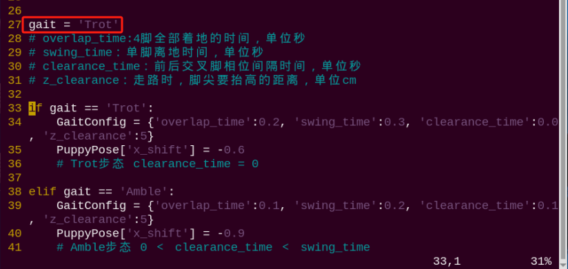

# 4. ROS1-Motion Control Course

<p id="anchor_4_1"></p>

## 4.1 Trot Introduction

### 4.1.1 Gait Definition

Gait is the pattern of movement of the limbs of animals. Generally speaking, it is used to describe how the animal walks. The common quadruped gaits include Trot, Walk, Amble, Pace, etc.

The explanation for nouns used in gait is as follow.  

|       Noun       |                         Explanation                          |
| :--------------: | :----------------------------------------------------------: |
|      phase       | Interpreted as Angle which indicates the position in cyclic motion. |
| phase difference |       The angle difference between two motion position       |
|   swing phase    |    When the legs are lifted, the body is without support.    |
|  support phase   |                  The legs touch the ground                   |
|      cycle       | The legs in one side from first to next touching ground is a cycle |
|  gait frequency  |         The number of completed cycle per unit time          |
|   step length    | The motion distance of the leg between lifting and touching ground in one cycle |
|  stride length   |         The motion distance of the body in one cycle         |
|    Duty ratio    | The ratio of the duration of one leg on ground to the gait cycle. |

### 4.1.2 Trot Illustration

Trot is a gait in medium to low speed where the feet at diagonal opposite ends of the body strike the ground together. This most frequently used quadruped gait has a wide motion range, and combines stability and speed. 
When PuppyPi is in Trot gait, its feet at diagonal opposite ends of the body strike the ground together. Take the figure below for example.


In (a), NO.1 and 2 legs of PuppyPi will lift and swing forward, and NO.3 and 4 legs are in support of the body to ensure that the center of gravity is at the intersection of the diagonal lines. At this time, NO.1 and 2 legs are in swing phase while NO. 3 and 4 legs are in support phase.

In (b), four legs touch the ground at the same time. All the legs are in support phase.

In (c), NO.3 and 4 legs will lift and swing forward, and NO.1 and 2 legs are in support of the body to ensure that the center of gravity is at the intersection of the diagonal lines. At this time, NO.3 and 4 legs are in swing phase while NO. 1 and 2 legs are in support phase. 

In (d), four legs touch the ground at the same time. All the legs are in support phase.
Completing (a), (b), (c) and (d) actions indicates that PuppyPi finish a integrate cycle of action.

### 4.1.3 Operation Steps

:::{Note}
The input command should be case sensitive. And the key words can be complemented by **"Tab"** key.
:::

(1) Turn on PuppyPi, and then connect to Raspberry Pi desktop through VNC.

(2) Click  open command line terminal

(3) Enter command and press Enter to open the program files

```bash
rosed puppy_control puppy_demo.py
```

(4) You can find the code calling the gait at the location indicated in the following image. The program is default to execute Trot gait, hence the codes can be called directly.



(5) There is no need for modification. Press **"Esc"**, and input **":wq"** to save and exit.

```bash
:wq
```

(6) Enter command and press Enter to start the game.

```bash
rosrun puppy_control puppy_demo.py
```

(7) If want to close this game, press **"Ctrl+C"**. If it fails to close, please try again.

### 4.1.4 Program Outcome

After the game starts, PuppyPi will trot, that is to say its feet at diagonal opposite ends of the body lift or strike the ground together at the same time. The leg sequence diagram is as follow.


### 4.1.5 Program Analysis

The source code of this program is located in a Docker containerd [/home/ubuntu/puppypi/src/puppy_control/scripts/puppy_demo.py](../_static/source_code/ros1/puppy_control_scripts.zip)

(1) Gait Selection

There are three built-in gaits, including Trot, Amble and Walk. And Trot is the initial gait by default. 

{lineno-start=27}

```python
gait = 'Trot'
# overlap_time:4脚全部着地的时间，单位秒(the time when all four legs touch the ground, measured in seconds)
# swing_time：单脚离地时间，单位秒(the time duration when a single leg is off the ground, measured in second)
# clearance_time：前后交叉脚相位间隔时间，单位秒(the time interval between the phases when the front and rear legs cross each other, measured in seconds)
# z_clearance：走路时，脚尖要抬高的距离，单位cm(the distance the paw needs to be raised during walking, measured in centimeters)

if gait == 'Trot':
    GaitConfig = {'overlap_time':0.2, 'swing_time':0.3, 'clearance_time':0.0, 'z_clearance':5}
    PuppyPose['x_shift'] = -0.6
    # Trot步态 clearance_time = 0(Trot gait clearance_time = 0)

elif gait == 'Amble':
    GaitConfig = {'overlap_time':0.1, 'swing_time':0.2, 'clearance_time':0.1, 'z_clearance':5}
    PuppyPose['x_shift'] = -0.9
    # Amble步态 0 ＜ clearance_time ＜ swing_time( Amble gait 0 ＜ clearance_time ＜ swing_time)
    
elif gait == 'Walk':
    GaitConfig = {'overlap_time':0.1, 'swing_time':0.2, 'clearance_time':0.3, 'z_clearance':5}
    PuppyPose['x_shift'] = -0.65
    # Walk步态   swing_time ≤ clearance_time(Walk gait   swing_time ≤ clearance_time)
```

If want to change the gait, we can directly modify **"Trot"** as **"Walk"**.

{lineno-start=27}

```python
gait = 'Trot'
```

(2) Walking Frequency Adjustment

We can modify the following parameters to adjust its walking frequency. The shorter the time, the higher the frequency. The longer the time, the lower the frequency.

{lineno-start=27}

```python
if gait == 'Trot':
    GaitConfig = {'overlap_time':0.2, 'swing_time':0.3, 'clearance_time':0.0, 'z_clearance':5}
    PuppyPose['x_shift'] = -0.6
    # Trot步态 clearance_time = 0(Trot gait clearance_time = 0)
```

The meaning of the parameters in bracket is as follow.

The first parameter `overlap_time` is the time when all the legs touch the ground. The unit is second.

The second parameter `swing_time` is the time when one leg is off the ground. The unit is second. 

The third parameter `clearance_time` is interval between the lifts of legs at diagonal opposite ends of the body. The unit is second.

The fourth parameter `z_clearance` is the lifted height in cm during walking. 
Pay attention, under Trot gait, clearance_time must be 0.

:::{Note}

Under Trot gait, please ensure that clearance_time=0, overlap_timed and swing_timed. If you want to better observe the Trot gait, we can extend swing_time and overlap_time, but the walking stability will be influenced due to slower frequency. For example, we modify swing_time as5 and overlap_time as 2.
:::

## 4.2 Walk Introduction

### 4.2.1 Gait Definition

Gait is the pattern of movement of the limbs of animals. Generally speaking, it is used to describe how the animal walks. The common quadruped gaits include Trot, Walk, Amble, Pace, etc.
The explanation for nouns used in gait is as follow.

|       Noun       |                         Explanation                          |
| :--------------: | :----------------------------------------------------------: |
|      phase       | Interpreted as Angle which indicates the position in cyclic motion. |
| phase difference |       The angle difference between two motion position       |
|   swing phase    |    When the legs are lifted, the body is without support.    |
|  support phase   |                  The legs touch the ground                   |
|      cycle       | The legs in one side from first to next touching ground is a cycle |
|  gait frequency  | The legs in one side from first to next touching ground is a cycle |
|   step length    | The motion distance of the leg between lifting and touching ground in one cycle |
|  stride length   |         The motion distance of the body in one cycle         |
|    Duty ratio    | The ratio of the duration of one leg on ground to the gait cycle. |

### 4.2.2 Walk Illustration

Walk is static gait where 3 legs are on the ground at least and 1 leg swings at most. 

 The sequence of different legs to swing is right front->left hind->left front->right hind, that is 1->2->3->4 as the picture shown. 


In (a), NO.1 leg of PuppyPi will lift and swing forward, and NO. 2, 3 and 4 legs are in support of the body.

In (b), 4 legs are on the ground.

In (c), NO.2 leg will lift and swing forward, and NO. 1, 3 and 4 legs are in support of the body.

In (d), 4 legs are on the ground.

In (e), NO.3 leg will lift and swing forward, and NO. 1, 2 and 4 legs are in support of the body.

In (f), 4 legs are on the ground.

In (g), NO.4 leg will lift and swing forward, and NO. 1, 2 and 3 legs are in support of the body.

In (h), 4 legs are on the ground.

Completing (a), (b), (c), (d), (e), (f), (g) and (h) actions indicates that PuppyPi finish a integrate cycle of action.

### 4.2.3 Operation Steps

:::{Note}
The input command should be case sensitive. And the key words can be complemented by "**Tab**" key.
:::

(1) Turn on PuppyPi, and then connect to Raspberry Pi desktop through VNC.

(2) Click to open command line terminal

(3) Enter command and press Enter to open the program files

```bash
rosed puppy_control puppy_demo.py
```

(4) Jump to 24th line to find the called codes. The program is default to execute Trot gait. Then press **"i"** key to enter editing mode.


(5)  Modify **"Trot"** as **"Walk"**.


(6) Press **"Esc"**, and input **":wq"** to save and exit.

```bash
:wq
```

(7) Enter command and press Enter to start the game.

```bash
rosrun puppy_control puppy_demo.py
```

(8) If want to close this game, press **"Ctrl+C"**. If it fails to close, please try again.

### 4.2.4 Program Outcome

After the game starts, PuppyPi will walk, that is to say its three legs are on the ground at least and one leg is lifted at most. The leg sequence diagram is as follow.


### 4.2.5 Program Analysis

The source code of this program is located in a Docker containerd [/home/ubuntu/puppypi/src/puppy_control/scripts/puppy_demo.py](../_static/source_code/ros1/puppy_control_scripts.zip)

(1) Gait Selection

There are three built-in gaits, including Trot, Amble and Walk. And Trot is the initial gait by default.

{lineno-start=27}

```python
gait = 'Trot'
# overlap_time:4脚全部着地的时间，单位秒(the time when all four legs touch the ground, measured in seconds)
# swing_time：单脚离地时间，单位秒(the time duration when a single leg is off the ground, measured in second)
# clearance_time：前后交叉脚相位间隔时间，单位秒(the time interval between the phases when the front and rear legs cross each other, measured in seconds)
# z_clearance：走路时，脚尖要抬高的距离，单位cm(the distance the paw needs to be raised during walking, measured in centimeters)

if gait == 'Trot':
    GaitConfig = {'overlap_time':0.2, 'swing_time':0.3, 'clearance_time':0.0, 'z_clearance':5}
    PuppyPose['x_shift'] = -0.6
    # Trot步态 clearance_time = 0(Trot gait clearance_time = 0)

elif gait == 'Amble':
    GaitConfig = {'overlap_time':0.1, 'swing_time':0.2, 'clearance_time':0.1, 'z_clearance':5}
    PuppyPose['x_shift'] = -0.9
    # Amble步态 0 ＜ clearance_time ＜ swing_time( Amble gait 0 ＜ clearance_time ＜ swing_time)
    
elif gait == 'Walk':
    GaitConfig = {'overlap_time':0.1, 'swing_time':0.2, 'clearance_time':0.3, 'z_clearance':5}
    PuppyPose['x_shift'] = -0.65
    # Walk步态   swing_time ≤ clearance_time(Walk gait   swing_time ≤ clearance_time)
```

If want to change the gait, we can directly modify "**Trot**" as "**Walk**".

{lineno-start=27}

```python
gait = 'Trot'
```

(2)  Walking Frequency Adjustment

We can modify the following parameters to adjust its walking frequency. The shorter the time, the higher the frequency. The longer the time, the lower the frequency.

{lineno-start=42}

```python
elif gait == 'Walk':
    GaitConfig = {'overlap_time':0.1, 'swing_time':0.2, 'clearance_time':0.3, 'z_clearance':5}
    PuppyPose['x_shift'] = -0.65
    # Walk步态   swing_time ≤ clearance_time(Walk gait   swing_time ≤ clearance_time)
```

The meaning of the parameters in bracket is as follow.

The first parameter `overlap_time` is the time when all the legs touch the ground. The unit is second.

The second parameter `swing_time` is the time when one leg is off the ground. The unit is second.

The third parameter `clearance_time` is interval between the lifts of legs at diagonal opposite ends of the body. The unit is second.

The fourth parameter `z_clearance`  is the lifted height in cm during walking.

:::{Note}

under Walk gait, please ensure clearance_timed swing_time and overlap_timed. If you want to better observe the Walk gait, we can extend swing_time and overlap_time, but the walking stability will be influenced due to lower frequency. For example, we modify clearance_time as 5, swing_time as 3, and overlap_time as 2.

:::

## 4.3 Amble Introduction

### 4.3.1 Gait Definition

Gait is the pattern of movement of the limbs of animals. Generally speaking, it is used to describe how the animal walks. The common quadruped gaits include Trot, Walk, Amble, Pace, etc.
The explanation for nouns used in gait is as follow.

|      Noun      |                         Explanation                          |
| :------------: | :----------------------------------------------------------: |
|     phase      | Interpreted as Angle which indicates the position in cyclic motion. |
|     phase      |       The angle difference between two motion position       |
| support phase  |    When the legs are lifted, the body is without support.    |
|     cycle      |                  The legs touch the ground                   |
| gait frequency | The legs in one side from first to next touching ground is a cycle |
|  step length   |         The number of completed cycle per unit time          |
| stride length  |         The motion distance of the body in one cycle         |
|   Duty ratio   | The ratio of the duration of one leg on ground to the gait cycle. |

### 4.3.2 Amble Illustration

Amble is static gait which is considered as accelerated Walk gait. During motion, 2 legs are on the ground at least and 2 legs swings at most.

The motion process of Amble gait is the same as that of Walk gait. And the sequence of different legs to swing is right front->left hind->left front->right hind, that is 1->2->3->4 as the picture shown.


The difference between Amble and Walk gait is NO.2 leg is lifted after NO.1 leg touch the ground under Walk gait, while under Amble gait, NO.2 leg is lifted after NO.1leg is lifted but not touch the ground. 

### 4.3.3 Operation Steps

:::{Note}
The input command should be case sensitive. And the key words can be complemented by "**Tab**" key.
:::

(1) Turn on PuppyPi, and then connect to Raspberry Pi desktop through VNC.

(2) Click  to open command line terminal.

(3) Enter command **"rosed puppy_control puppy_demo.py"** and press Enter to open the program files

```bash
rosed puppy_control puppy_demo.py
```

(4)  Jump to 24th line to find the called codes. The program is default to execute Trot gait. Then press **"i"** key to enter editing mode.


(5) Modify **"Trot"** as **"Ample"**.


(6) After modification, press **"Esc"**, input **":wq"** and press Enter to save and exit.

```bash
:wq
```

(7) Enter command and press Enter to start the game.

```bash
rosrun puppy_control puppy_demo.py
```

(8) Enter command and press Enter to start the game.

### 4.3.4 Program Outcome

PuppyPi will amble with two legs in support of the body at least and two legs swinging at most. Amble gait is the accelerated Walk gait. The leg sequence diagram is as follow.


### 4.3.5 Program Analysis

The source code of this program is located in a Docker containerd [/home/ubuntu/puppypi/src/puppy_control/scripts/puppy_demo.py](../_static/source_code/ros1/puppy_control_scripts.zip)

(1) Gait Selection

There are three built-in gaits, including Trot, Amble and Walk. And Trot is the initial gait by default.

{lineno-start=27}

```python
gait = 'Trot'
# overlap_time:4脚全部着地的时间，单位秒(the time when all four legs touch the ground, measured in seconds)
# swing_time：单脚离地时间，单位秒(the time duration when a single leg is off the ground, measured in second)
# clearance_time：前后交叉脚相位间隔时间，单位秒(the time interval between the phases when the front and rear legs cross each other, measured in seconds)
# z_clearance：走路时，脚尖要抬高的距离，单位cm(the distance the paw needs to be raised during walking, measured in centimeters)

if gait == 'Trot':
    GaitConfig = {'overlap_time':0.2, 'swing_time':0.3, 'clearance_time':0.0, 'z_clearance':5}
    PuppyPose['x_shift'] = -0.6
    # Trot步态 clearance_time = 0(Trot gait clearance_time = 0)

elif gait == 'Amble':
    GaitConfig = {'overlap_time':0.1, 'swing_time':0.2, 'clearance_time':0.1, 'z_clearance':5}
    PuppyPose['x_shift'] = -0.9
    # Amble步态 0 ＜ clearance_time ＜ swing_time( Amble gait 0 ＜ clearance_time ＜ swing_time)
    
elif gait == 'Walk':
    GaitConfig = {'overlap_time':0.1, 'swing_time':0.2, 'clearance_time':0.3, 'z_clearance':5}
    PuppyPose['x_shift'] = -0.65
    # Walk步态   swing_time ≤ clearance_time(Walk gait   swing_time ≤ clearance_time)
```

If want to change the gait, we can directly modify **"Trot"** as **"Walk"** or **"Ample"**.

{lineno-start=27}

```python
gait = 'Trot'
```

(2) Walking Frequency Adjustment

We can modify the following parameters to adjust its walking frequency. The shorter the time, the higher the frequency. The longer the time, the lower the frequency.

{lineno-start=38}

```python
elif gait == 'Amble':
    GaitConfig = {'overlap_time':0.1, 'swing_time':0.2, 'clearance_time':0.1, 'z_clearance':5}
    PuppyPose['x_shift'] = -0.9
    # Amble步态 0 ＜ clearance_time ＜ swing_time( Amble gait 0 ＜ clearance_time ＜ swing_time)
```

The meaning of the parameters in bracket is as follow.

The first parameter `overlap_time` is the time when all the legs touch the ground. The unit is second.

The second parameter `swing_time` is the time when one leg is off the ground. The unit is second.

The third parameter `clearance_time`  is interval between the lifts of legs at diagonal opposite ends of the body. The unit is second.

The fourth parameter `z_clearance`  is the lifted height in cm during walking.

:::{Note}

under Amble gait, please ensure 0<clearance_time<swing_time and overlap_timeďź?. If you want to better observe the Amble gait, we can extend clearance_time, swing_time and overlap_time, but the walking stability will be influenced due to lower frequency. For example, we modify clearance_time as 3, swing_time as 5, and overlap_time as 2.

:::


## 4.4 March on Spot under Trot Gait

For detailed introduction to Trot, please move to the file [**4.1 Trot Introduction**](#anchor_4_1).

### 4.4.1 Operation Steps

:::{Note}
The input command should be case sensitive. And the key words can be complemented by "**Tab**" key.
:::

(1) Turn on PuppyPi, and then connect to Raspberry Pi desktop through VNC.

(2)  Click   to open command line terminal.

(3)  Input command and press Enter to open the program file.

```bash
rosed puppy_control puppy_demo.py
```

(4) Locate to these codes .


(5) Press **"i**" to enter editing mode, and then modify the code as **"set_mark_time_srv(True)"**.


(6) After modification, press **"Esc"** key, input **":wq"** and press Enter to save and exit editing.

```bash
:wq
```

(7) Enter command and press Enter to start the game.

```bash
rosrun puppy_control puppy_demo.py
```

(8) If want to close this game, we can press **"Ctrl+C"**. If it fails to close, please try again. 

### 4.4.2 Project Outcome 

After the game starts, PuppyPi will march on the spot with Trot gait. The legs at diagonal opposite ends of the body lift or touch the ground together. The leg sequence diagram is as the figure below.


### 4.4.3 Program Analysis

The source code of this program is located in a Docker containerd [/home/ubuntu/puppypi/src/puppy_control/scripts/puppy_demo.py](../_static/source_code/ros1/puppy_control_scripts.zip)

Through sending the corresponding command, we can control PuppyPi to march on the spot.

{lineno-start=75}

```python
    set_mark_time_srv(False)
    ## 如果原地踏步期间，小狗仍然在缓慢的向前或向后，那就需要重新调整小狗重心，微调PuppyPose['x_shift']即可(if the dog continues to move slowly forward on backward while stepping in place, it is necessary to readjust the dog's center of gravity. simply fine-tune 'x_shift' in PuppyPose)
```

The parameter in the bracket decides whether to send service or not, and it is "**False**" by default, which means that the service will not be sent. After the game starts, PuppyPi will move in the selected gait, for example Trot. When the parameter in the bracket is "**True**", PuppyPi will march on the spot.
If PuppyPi deviates during marching on the spot, we can adjust its center of gravity to tackle this problem. For detailed tutorial, please move to the folder "**[4.6 Center of Gravity Adjustment](#anchor_4_6)**".

## 4.5 Turn under Trot Gait

For detailed introduction to Trot, please move to the folder "**[4.1 Trot Introduction](#anchor_4_1)**".
This lesson is based on Trot. Through modifying the corresponding parameter, PuppyPi will turn under Trot gait.

### 4.5.1 Operation Steps

:::{Note}
The input command should be case sensitive. And the key words can be complemented by "**Tab**" key.
:::

(1) Turn on PuppyPi, and then connect to Raspberry Pi desktop through VNC.

(2) Click  to open command line terminal.

(3) Input command and press Enter to open the program file.

```bash
rosed puppy_control puppy_demo.py
```

(4) Locate to these codes


(5) Press "**i**" to enter editing mode. For example, make PuppyPi turn 10°/s counterclockwise. Therefore, we should modify the codes as **"PuppyMove = {'x':6, 'y':0, 'yaw_rate':0.18}"**.


(6) After modification, press **"Esc"**, input **":wq"** and press Enter to save and exit the editing.

```bash
:wq
```

(7) Input command and press Enter to start the game.

```bash
rosrun puppy_control puppy_demo.py
```

(8)  If want to close this game, we can press "**Ctrl+C**". If it fails to close the game, please try again.

### 4.5.2 Program Outcome

Under Trot gait, PuppyPi will turn in the set direction.

### 4.5.3 Program Analysis

The source code of this program is located in a Docker containerd[/home/ubuntu/puppypi/src/puppy_control/scripts/puppy_demo.py](../_static/source_code/ros1/puppy_control_scripts.zip)

* **Motion Parameter Adjustment**

Through setting the corresponding parameters, adjust PuppyPi's moving direction.

{lineno-start=13}

```python
PuppyMove = {'x':6, 'y':0, 'yaw_rate':0}
# x:直行控制，  前进方向为正方向，单位cm/s(straightforward control, with the forward direction as the positive direction, measured in cm/s)
# y:侧移控制，左侧方向为正方向，单位cm/s，目前无此功能(lateral movement control, with the left direction as the positive direction, measured in cm/s. currently, this feature is bot available)
# yaw_rate：转弯控制，逆时针方向为正方向，单位rad/s(turning control, with counterclockwise direction as the positive direction, measured in rad/s)
```

The meaning of parameter in the bracket is as follow.
The third parameter`yaw_rate` is used to control PuppyPi to turn, ranging from -0.89~0.89 rad/s. When the value is positive, PuppyPi will turn counterclockwise. When the value is negative, PuppyPi will turn clockwise. The greater the absolute value, the greater the turning angle.
Take the camera at front as the first-person perspective, and the rotation direction is as the picture shown. 


1rad/s corresponds to 57.3 For example, if you want to set the rotation speed as 30°/s, we should set "**yaw_rate**" as 0.52. (30/57.3 ≈ 0.52)

* **Gait Adjustment**

(1) Gait Selection

There are three built-in gaits, including Trot, Amble and Walk. And Trot is the initial gait by default.

{lineno-start=27}

```python
gait = 'Trot'
# overlap_time:4脚全部着地的时间，单位秒(the time when all four legs touch the ground, measured in seconds)
# swing_time：单脚离地时间，单位秒(the time duration when a single leg is off the ground, measured in second)
# clearance_time：前后交叉脚相位间隔时间，单位秒(the time interval between the phases when the front and rear legs cross each other, measured in seconds)
# z_clearance：走路时，脚尖要抬高的距离，单位cm(the distance the paw needs to be raised during walking, measured in centimeters)

if gait == 'Trot':
    GaitConfig = {'overlap_time':0.2, 'swing_time':0.3, 'clearance_time':0.0, 'z_clearance':5}
    PuppyPose['x_shift'] = -0.6
    # Trot步态 clearance_time = 0(Trot gait clearance_time = 0)

elif gait == 'Amble':
    GaitConfig = {'overlap_time':0.1, 'swing_time':0.2, 'clearance_time':0.1, 'z_clearance':5}
    PuppyPose['x_shift'] = -0.9
    # Amble步态 0 ＜ clearance_time ＜ swing_time( Amble gait 0 ＜ clearance_time ＜ swing_time)
    
elif gait == 'Walk':
    GaitConfig = {'overlap_time':0.1, 'swing_time':0.2, 'clearance_time':0.3, 'z_clearance':5}
    PuppyPose['x_shift'] = -0.65
    # Walk步态   swing_time ≤ clearance_time(Walk gait   swing_time ≤ clearance_time)
```

If need to change the gait, we can uncomment the code of the target gait while comment the codes of the rest two gaits.

{lineno-start=27}

```python
gait = 'Trot'
```

(2) Speed Adjustment

Through adjusting the corresponding parameter, we can adjust PuppyPi's moving speed.

{lineno-start=34}

```python
    GaitConfig = {'overlap_time':0.2, 'swing_time':0.3, 'clearance_time':0.0, 'z_clearance':5}
```

The meaning of the parameters in bracket is as follow.

The first parameter `overlap_time` is the time when all the legs touch the ground. The unit is second.

The second parameter  `swing_time`  is the time when one leg is off the ground. The unit is second.

The third parameter  `clearance_time`  is interval between the lifts of legs at diagonal opposite ends of the body. The unit is second.

The fourth parameter `z_clearance`  is the lifted height in cm during walking.

<p id="anchor_4_6"></p>

## 4.6 Center of Gravity Adjustment

### 4.6.1 Center of Gravity

The center of gravity of an object is the point at which weight is evenly dispersed and all sides are in balance. Therefore PuppyPi is in dynamic equilibrium during walking. To achieve dynamic equilibrium, PuppyPi needs to adjust different parts of its body to ensure the center of gravity is within the threshold. 

In normal case, there is no need to adjust its center of gravity. However, in secondary development case, it is necessary to lock the center of gravity within the threshold to avoid body deviation and tilt. 

Take human for example. Our center of gravity is different when we hold the object with our hands or carry it on back. Hence, we need to adjust our center of gravity to avoid falling down.

### 4.6.2 Program Explanation

The source code of this program is located in a Docker containerd? **[/home/ubuntu/puppypi/src/puppy_control/scripts/puppy_demo.py](../_static/source_code/ros1/puppy_control_scripts.zip)**

Take Trot gait for example.

{lineno-start=18}

```python
PuppyPose = {'roll':math.radians(0), 'pitch':math.radians(0), 'yaw':0.000, 'height':-10, 'x_shift':0.5, 'stance_x':0, 'stance_y':0}
# PuppyPose = {'roll':math.radians(0), 'pitch':math.radians(0), 'yaw':0.000, 'height':-10, 'x_shift':-0.5, 'stance_x':0, 'stance_y':0}
# stance_x：4条腿在x轴上额外分开的距离，单位cm(the distance extra apart for each of the four legs on the X-axis, measured in centimeters)
# stance_y：4条腿在y轴上额外分开的距离，单位cm(the distance extra apart for each of the four legs on the Y-axis, measured in centimeters)
# x_shift: 4条腿在x轴上同向移动的距离，越小，走路越前倾，越大越后仰,通过调节x_shift可以调节小狗走路的平衡，单位cm(the distance traveled by the four legs along the x-axis determines the degree of forward or backward tilt during walking: smaller distances lead to more forward tilt, while larger distances result in more backward tilt. Adjusting the x_shift parameter can help maintain balance during the dog's movement, measured in centimeters)
# height： 狗的高度，脚尖到大腿转动轴的垂直距离，单位cm(the height of the dog, measured from the toe to the axis  of rotation of the thigh, is in centimeters)
# pitch： 狗身体的俯仰角，单位弧度(the pitch angle of the dog's body, measured in radians)
```

In the program above, parameter `x_shift` is the distance that PuppyPi' s four legs move in the same direction on X axis. It ranges from -10 to 10 cm. We can adjust this value to balance PuppyPi's body. 
`-0.6` is the default balance value under Trot gait. As PuppyPi walks in different way under different gaits, the balance value varies.
The smaller the x_shift, the greater PuppyPi leans forward. The larger the x_shift, the greater PuppyPi leans back. 

### 4.6.3 Operation Steps

Take controlling PuppyPi to lean 2cm forward. Please follow the steps below to operate.

:::{Note}
The input command should be case sensitive. And the key words can be complemented by **"Tab"** key.
:::

(1) Turn on PuppyPi, and then connect to Raspberry Pi desktop through VNC.

(2) Clickto open command line terminal.

(3) Input command and press Enter to open the program file.

```bash
rosed puppy_control puppy_demo.py
```

(4) The parameter `PuppyPose['x_shift']` for the Trot gait has a default balance value of -0.6. Here, we modify the value to -2, which is smaller than the balance value, causing the robot dog to lean forward. After modification, press **"Esc"**, and then input **":wq"** to save the modified data.

```bash
:wq
```


:::{Note}

* This modification is also applicable to the rest two gaits.
* For obvious change and better observation, we greatly adjust the value, but it is recommended to make minor adjustment on the value. 

:::

(5) Input command and press Enter to check the adjustment effect.

```bash
rosrun puppy_control puppy_demo.py
```

(6) If want to close this game, we can press **"Ctrl+C"**. If it fails to close, please try again.

### 4.6.4 Program Outcome

After the game starts, PuppyPi will walk with body leaning forward under Trot gait.

## 4.7 Basic Communication of ROS Robot

### 4.7.1 Communication Method

The ROS system is a distributed computing environment. It not only allows multiple nodes to run on a single robot but also enables them to run on multiple robots that communicate with each other, as long as these robots are on the same network.

Therefore, the communication architecture of ROS is the soul of ROS and also the key to the normal operation of the entire ROS system. There are four communication methods in ROS: Topic (topics), Service (services), Parameter Service (parameter server), and Actionlib (action library).

In ROS, topics use an asynchronous communication mechanism. They employ a publish/subscribe model, where data is transmitted from publishers to subscribers. Multiple subscribers or publishers can exist for the same topic. The topic model is illustrated in the following diagram:


Service adopts Synchronous Communication Mechanism and uses client/ server model. In this model, client will send request, and server will response after processing.


### 4.7.2 Topic Communication

* **Check Topic Communication**

ROS comes with RQT tool. And we can use the corresponding tool to check the communication between the nodes of PuppyPi.

:::{Note}
The input command should be case sensitive, and the key words can be complemented by "**Tab**" key.
:::

(1) Turn on PuppyPi, and then connect to Raspberry Pi desktop through VNC.

(2) Click  to open command line terminal

(3) Input command "**rqt_graph**" and press Enter to open the tool

```bash
rqt_graph
```

(4) Please find the codes as the figure below shown, and set it as **"Nodes/Topics(all)"**


The communication flow chart under current environment is displayed on the interface. Topics are in the frame, and nodes are in ellipse. The communication process is that the robot automatically starts communication after booting up.

In the picture above, we can notice that some nodes didn't publish topic, like ďź?which means that the corresponding function of the code isn't turned on. After the game of face recognition starts, the communication flow chart changes, as the picture below shown.


* **Analysis of Topic Communication**

For better understanding, let's take the process of face recognition as example for analysis. 


The communication process is as follow.

(1)  node publishes  topic

(2)  node subscribes  topic published by 

(3)  node subscribes topic published by 

### 4.7.3 Service Communication

* **Check Service Communication**

We can check the service communication of PuppyPi in "**puppy.py**" file.
This file is stored in the path [/home/ubuntu/puppy_pi/src/puppy_control/scripts/puppy.py](../_static/source_code/ros1/puppy_control_scripts.zip)

In this file, we can find that **"set_running"**, **"go_home"**, **"set_self_balancing"**, **"runActionGroupFun"** and **"set_mark_time"** requests are mainly sent in service communication.

{lineno-start=157}

```python
	    rospy.Service('/%s/set_running' %ROS_NODE_NAME, SetBool, self.set_running)
        rospy.Service('/%s/go_home' %ROS_NODE_NAME, Empty, self.go_home)
        rospy.Service('/%s/set_self_balancing' %ROS_NODE_NAME, SetBool, self.set_self_balancing)
        rospy.Service('/%s/runActionGroup' %ROS_NODE_NAME, SetRunActionName, self.runActionGroupFun)
        rospy.Service('/%s/set_mark_time' %ROS_NODE_NAME, SetBool, self.set_mark_time)
```

The functions of the service are listed below.

|      Service       |                Function                |
| :----------------: | :------------------------------------: |
|    set_running     |         stop and start PuppyPi         |
|      go_home       | make PuppyPi return to initial posture |
| set_self_balancing |  make PuppyPi perform self-balancing   |
| runActionGroupFun  |    set the action group of PuppyPi     |
|   set_mark_time    |     make PuppyPi march on the spot     |

## 4.8 PC Software Control

:::{Note}

* To avoid interference, please cut off the connection to APP first, then control PuppyPi through PC software.

* If the software cannot be opened, please install the driver which can be found in the same folder.

  :::

### 4.8.1 Open PC Software

Extract the PC software to any English path, then find the application below and open it. Please turn off the firewall before opening the PC software.


### 4.8.2 PC Software Connection

(1) Turn on PuppyPi.

(2) Please wait until the buzzer beeps, at this time ROS system boots up successfully. Then connect your computer to the WiFi starting with HW. Note: if you are using desktop computer, wireless network card is required.


(3) Open PC software, and then click **"Connect"**. After a while, PC software will connect to the PuppyPi.


### 4.8.3 Interface Layout


(1) Motion Control Area

| Icon | Function |
|:--:|:--:|
|  | The maximum lifted height of leg during walking in mm |
|  | Moving speed in mm/s |
|  | Time taken to complete one gait |
|  | Switch between Trot, Amble and Walk gait. |
|  | Buttons for motion control. Click the button or press corresponding key to realize control |

**(2) Posture Control Area**

| Icon | Function |
|:--:|:--:|
|  | Adjust PuppyPi to high, medium or low standing posture |
|  | Angle for PuppyPi to look up and down. When it is positive, PuppyPi will look up. When it is negative, PuppyPi will look down. The greater the absolute value, the larger the pitch angle. |
|  | Angle of left and right tilt. When it is positive, PuppyPi will tilt to right. When it is negative, PuppyPi will tilt to left. The greater the absolute value, the larger the roll angle. |

**(3) Center of Gravity Control**

| Icon | Function |
|:--:|:--:|
|  | The default value is -5. The smaller the value, the more it leans forward; The larger the value, the more it leans back. |

## 4.9 Coordinate System Establishing

### 4.9.1 Coordinate System Introduction

We take two steps to control PuppyPi to walk. Firstly, input the coordinate of foothold of PuppyPi's four legs. Secondly, use inverse kinematics to output the rotation angle of all the servos.
Therefore, coordinate system of PuppyPi should be established in the beginning. With the center of 4 upper joints as the origin (0,0,0), set the coordinate of foothold of PuppyPi's four legs.

 

 And we just need to set the X axis and Z axis values of coordinate of foothold of PuppyPi's four legs, because there is no servo for controlling PuppyPi to move on Y axis.

### 4.9.2 Coordinate Explanation

For better understanding, take coordinate of standing posture as example for explanation. 
The coordinate is as the picture shown.


In PuppyPi's first-person perspective, FR, FL, BL and BL represent the position of 4 legs.

|     FR      |     FL     |      BR      |     BL      |
| :---------: | :--------: | :----------: | :---------: |
| front right | front left | behind right | behind left |

The coordinate corresponds to the distance in cm. When PuppyPi is standing, the coordinate of its four legs are (0, 0, -10). Coordinate of Z axis -10 represents the perpendicular distance between its foothold and the origin is 10cm.

When the coordinate of X axis is 0, it means that the line connecting the foothold and the origin is perpendicular to the ground. If you want to make PuppyPi move froward 2cm, you can set the coordinate of X axis as 2.

## 4.10 Inverse Kinematics Analysis

### 4.10.1 Inverse Kinematics Introduction

Inverse kinematics matters in PuppyPi's path planning and control, because whether the inverse kinematics solution is fast and accurate directly affect the precision of PuppyPi's path planing and control. Therefore, fast and accurate inverse kinematics solution is essential.

For PuppyPi, what inverse kinematics is that solve the rotation angle of upper joint and lower joint according to the foot coordinate. The joint distribution is as the picture shown.


The rotation angle of upper joint is controlled by ID1,3, 5 and 7 servos on PuppyPi's body.


And the rotation angle of lower joint is controlled by ID 2, 4, 6 and 8 servos on upper joints. Linkage mechanism is adopted in the control.


The solution procedure is divided into two steps.

(1) Calculate the position to which the upper and lower joints move so as to solve the rotation angle of the corresponding servo.

(2) According to the rotation angle of servo, calculate the corresponding value, and then directly control the servo to rotate. 

### 4.10.2 Case Analysis

For better understanding, we will combine program control and inverse kinematics to analyze.
../_static/source_code/puppy_demo.zip
The source code of this program is located in a Docker containerd? [/home/ubuntu/puppy_pi/src/puppy_control/scripts/puppy_IK_demo.py](../_static/source_code/ros1/puppy_control_scripts.zip)

### 4.10.3 Operation Steps

:::{Note}
The input command should be case sensitive. And the key words can be complemented by "**Tab**" key.
:::

(1) Turn on PuppyPi, and then connect to Raspberry Pi desktop through VNC.

(2) Click  to open command line terminal.

(3) Enter command and press Enter to open the program files.

```bash
rosrun puppy_control puppy_IK_demo.py
```

(4) If want to close this game, press **"Ctrl+C"**. If it fails to close, please try again.

### **4.10.4 Program Outcome**

After the game starts, all the servos will rotate to the corresponding angle based on the set coordinate. And the rotation angle of all the servos will be printed on the terminal.


### 4.10.5 Program Analysis

(1) Set coordinate

During controlling PuppyPi, we need to set the coordinates of 4 footholds.

{lineno-start=15}

```python
                            # FR    FL    BR     BL
foot_locations = np.array([ [ -1.,  -1.,  -1.,   -1.], # X
                            [ 0.,    0.,   0.,    0.], # Y
                            [-10,   -10,  -10,   -10,] # Z
                            ])
# 相对4条腿各自坐标系的坐标值，单位cm(coordinates relative to the coordinate system of each of the four legs, measured in centimeters)
```

With PuppyPi as the first-person perspective, FR, FL, BR and BL respectively represent its 4 legs. 

|     FR      |     FL     |      BR      |     BL      |
| :---------: | :--------: | :----------: | :---------: |
| Front right | Front left | Behind right | Behind left |

:::{Note}
the coordinate of X axis ranges from -15 to +15, and Z axis ranges from -15 to -1. 
:::

When the coordinate of X axis is set as 0, the line connecting foothold and the origin is perpendicular to the ground. If the coordinate of X axis is positive, the foothold is at the front. 


The larger the coordinate of Z axis, the higher its feet lift, which means that the perpendicular distance between foothold and the origin is shorter. 

(2) Acquire servo angle

Calculate the servo angle through inverse kinematics.

{lineno-start=25}

```python
joint_angles = puppy.fourLegsRelativeCoordControl(foot_locations)
# 输入坐标，通过逆运动学计算得到各个舵机的角度值(input coordinates to calculate the angle values of each servo motor through inverse kinematics)
```

(3) Control servo to rotate

Calculate the pulse width of the servo according to the angle value so as to directly control servo rotation.

{lineno-start=32}

```python
puppy.sendServoAngle(joint_angles, time = 500)
#将舵机角度发送到舵机，(send the servo angles to the servo motors)
```

(4)  Display servo angle

The servo angle will be displayed on the terminal.

{lineno-start=27}

```python
print(joint_angles*57.3)
```

The unit of the **"joint_angles"** is radian. And joint_angles times 57.3 equals the final servo angle in degree. 
The angle of corresponding servo is as the figure below.


Let's take a look at the relationship between servo angle and PuppyPi's posture. Take ID1 and ID2 for example.
In this program, the angle of ID1 servo is 57.33238425, and the current posture of PuppyPi is as the figure below shown.


When the angle of ID1 servo is positive, the corresponding leg will swing backward. When it is negative, the leg will swing forward.
The angle of ID2 servo is 14.31023196, and the current posture of PuppyPi is as the figure below shown.


When the value is positive, the servo arm of ID2 servo is below the horizontal. When it is negative, the servo arm is above the horizontal.

<p id="anchor_4_11"></p>

## 4.11 Posture Parameter Instruction

### 4.11.1 Introduction

The parameter of static posture includes standing height, pitch angle, roll angle, etc.
PuppyPi's posture can be changed through adjusting the coordinates of 4 footholds. And we need to call "**puppy_demo.py**" file to set the posture.
This file is stored in 

The source code of this program is located in a Docker containerd [/home/ubuntu/puppypi/src/puppy_control/scripts/puppy_demo.py](../_static/source_code/ros1/puppy_control_scripts.zip)

### 4.11.2 Parameter Illustration

Through modifying the following parameter, we can adjust PuppyPi's posture. 

```python
PuppyPose = {'roll':math.radians(0), 'pitch':math.radians(0), 'yaw':0.000, 'height':-10, 'x_shift':-0.6, 'stance_x':0, 'stance_y':0}
```

And we mainly adjust x_shift, height, pitch and roll. The explanation for the parameters are listed in the table.

<table class="docutils" border="1">
<colgroup>
<col style="width: 15%" />
<col style="width: 84%" />
</colgroup>
<tbody>
<tr>
<td style="text-align: center;"><strong>Parameter</strong></td>
<td style="text-align: center;"><strong>Explanation</strong></td>
</tr>
<tr>
<td style="text-align: center;">x_shift</td>
<td><p>It represents that the distance that 4 footholds moves in the same direction on the X axis. It is used to balance PuppyPi's body during moving. It ranges from -10 to +10 cm.</p>
<p>"<strong>-10 ~ +10</strong>".</p></td>
</tr>
<tr>
<td style="text-align: center;">height</td>
<td>It indicates body height, that is the perpendicular distance between the foothold and the center of upper joint. It ranges from -15 to -5 cm."<strong>-15 ~ -5</strong>".</td>
</tr>
<tr>
<td style="text-align: center;">pitch</td>
<td>It refers to the pitch angle of the robot body ranging from -31 to +31 degree. With PuppyPi as the first vision, when the pitch angle is positive, it will look up. When the pitch angle is negative, it will look down. The larger the absolute value, the larger the pitch angle. </td>
</tr>
<tr>
<td style="text-align: center;">roll</td>
<td>It represents that the roll angle of the body ranging from -31 to +31 degree. With PuppyPi as the first vision, when the pitch angle is positive, it will tilt to right. When the pitch angle is negative, it will tilt to left. The larger the absolute value, the greater it tills.</td>
</tr>
</tbody>
</table>

For example, set its body height as 10cm, and make it loop down 20° and tilt 15° to the right.

```python
PuppyPose = {'roll':math.radians(15), 'pitch':math.radians(-20), 'yaw':0.000, 'height':-10, 'x_shift':-0.6, 'stance_x':0, 'stance_y':0}
```

## 4.12 Standing Angle Adjustment

### 4.12.1 Introduction

Through adjusting the parameter, we can control PuppyPi's posture. For specific parameters, please move to the file "**[4.11 Posture Parameter Instruction](#anchor_4_11)**".
We can adjust PuppyPi's standing angle through the control program. 
The source code of this program is located in a Docker containerdz **[/home/ubuntu/puppypi/src/puppy_control/scripts/puppy_demo.py](../_static/source_code/ros1/puppy_control_scripts.zip)**

### 4.12.2 Operation Steps

:::{Note}
The input command should be case sensitive. And the key words can be complemented by "**Tab**" key.
:::

(1) Turn on PuppyPi, and then connect to Raspberry Pi desktop through VNC.

(2)  Click  to open command line terminal

(3) Input the command to edit "**puppy_demo.py**".

```bash
rosed puppy_control puppy_demo.py
```

(4) Press "**i**" key to start editing. For better observation, set the speed as 0, that is set **"x"** in **"PuppyMove"** as 0.


(5) Modify "**roll**" and "**pitch**" in "**PuppyPose**". "**roll**" represents roll angle, and "**pitch**" represents pitch angle, both ranging from -31 to 31 degree. 


:::{Note}
we should take PuppyPi as first-person perspective when making adjustment. When the value of "**roll**" is positive, PuppyPi will tilt to left. When it is negative, PuppyPi will tilt to right. When the value of "**pitch**" is positive, PuppyPi will look up. When it is negative, PuppyPi will look down.
:::

(6) For example, make PuppyPi tilt 15° to the left, so modify the value in bracket as "**15**" as the figure below shown. After modification, press **"Esc"** and input **":wq"** to save.

```bash
:wq
```


(7) Input command **"rosrun puppy_control puppy_demo.py"** and press Enter to run the program.

```bash
rosrun puppy_control puppy_demo.py
```

(8) If want to close this game, we can press "**Ctrl+C**". If it fails to close the game, please try again.

### 4.12.3 Program Outcome

After the game starts, PuppyPi will stand as tilting 15° to the left.


## 4.13 Gait Parameter

### 4.13.1 Gait Definition

Gait is used to describe how animal walks.

### 4.13.2 Types of Gait

In terms of balance method, PuppyPi's gaits are divided into three types, including static gait, dynamic gait and quasi-static gait. 
And Walk is static gait, Trot is dynamic gait and Amble quasi-static gait.


### 4.13.3 Leg Distribution

The legs of PuppyPi are numbered in this order as the picture shown.


### 4.13.4 Dynamic Gait Control

(1) Gait Introduction

Trot is a dynamic gait in which the feet at diagonal opposite ends of the body lift and strike the ground together. For example, NO.1 and NO.2 leg, or NO.3 and NO.4 leg, move synchronously.
We can control the gait through the control program.

(2) Operation Steps

:::{Note}
The input command should be case sensitive. And the key words can be complemented by "**Tab**" key. 
:::

(1) Turn on PuppyPi, and then connect to Raspberry Pi desktop through VNC.

(2) Click  to open command line terminal.

(3) Input the command to edit "**puppy_demo.py**"

```bash
rosed puppy_control puppy_demo.py
```

(4) The codes of gait is in 24th line. The program is default to execute Trot gait, therefore the program can be called directly.


(3)  Dynamic Gait Setting

We need to set three parameters, including the time when 4 legs all touch the ground, the time when one leg lifts and the interval to switch between front leg and hind leg.

(5) The codes to be set are in the red frame. 


overlap_time represents the time when 4 legs all touch the ground, swing_time refers to the time when one leg lifts, and clearance_time is interval to switch between front leg and hind leg.

Please ensure clearance_time=0, overlap_timed and swing_timed when setting. 

In Trot gait, PuppyPi's four legs switch in this sequence, 1 2&rarr3 4 &rarr1 2, as shown in the below figure.


The bulge represents that the leg is lifted, represents the time when four legs all touch the ground and represents the time when one leg lifts the ground.

### 4.13.5 Static Gait Control

(1) Gait Introduction

Walk is a static gait in which three legs are in support of the body at least and one leg swings at most during moving.

We can control the gait through the control program.

(2) Operation Steps

:::{Note}
The input command should be case sensitive. And the key words can be complemented by "**Tab**" key.
:::

① Turn on PuppyPi, and then connect to Raspberry Pi desktop through VNC.

② Click  to open command line terminal. 

③ Input the command to edit "**puppy_demo.py**"

```bash
rosed puppy_control puppy_demo.py
```

④ You can find the code calling the gait at the location indicated in the following image. The program is default to execute Trot gait, therefore we need to modify the program. Press "**i**" key to enter editing mode. 


⑤ Modify **"Trot"** as **"Walk"**.


(3) Static Gait Setting

We need to set three parameters, including the time when 4 legs all touch the ground, the time when one leg lifts and the interval to switch between front leg and hind leg.

The codes to be set are in the red frame.


overlap_time represents the time when 4 legs all touch the ground, swing_time refers to the time when one leg lifts, and clearance_time is interval to switch between front leg and hind leg.

Please ensure that clearance_timed swing_time and overlap_timed when setting.

In Walk gait, PuppyPi's four legs switch in this sequence, 1 2→ 3 4→ 1 2, as shown in the below figure.


The bulge represents that the leg is lifted, 

① represents that the interval to switch between front leg and hind leg, 

② represents the time when four legs all touch the ground and represents the time when one leg lifts the ground. 

### 4.13.6 Quasi-static Gait Control

(1) Gait Introduction

Amble is a quasi-static gait which is also considered as the accelerated version of Walk gait. Under this gait, two legs are in support of the body at least and two legs swing at most.
We can control the gait through the control program

(2) Operation Steps

:::{Note}
Turn on PuppyPi, and then connect to Raspberry Pi desktop through VNC.
:::

① Turn on PuppyPi, and then connect to Raspberry Pi desktop through VNC.

② Click  to open command line terminal.

③ Input the command to edit **"puppy_demo.py"**.

```bash
rosed puppy_control puppy_demo.py
```

④ You can find the code calling the gait at the location indicated in the following image. The program is default to execute Trot gait, therefore we need to modify the program. Press "**i**" key to enter editing mode


⑤ Modify **"Trot"** as **"Amble"**.


(3) Quasi-static Gait Setting

We need to set three parameters, including the time when 4 legs all touch the ground, the time when one leg lifts and the interval to switch between front leg and hind leg.
The codes to be set are in the red frame.


overlap_time represents the time when 4 legs all touch the ground, swing_time refers to the time when one leg lifts, and clearance_time is interval to switch between front leg and hind leg.
Please ensure that 0<clearance_time<swing_time and overlap_timed when setting.

In Amble gait, PuppyPi's four legs switch in this sequence, 1 2 → 3 4 → 1 2, as shown in the below figure.


The bulge represents that the leg is lifted, 

① represents that the interval to switch between front leg and hind leg, 

② represents the time when four legs all touch the ground and ③ represents the time when one leg lifts the ground.

### 4.13.7 Program Analysis

During PuppyPi is moving, there are two types of parameters, including motion parameter and gait parameter. The gait parameters include the time when 4 legs all touch the ground, the time when all leg lifts and the interval to switch between front leg and hind leg. And motion parameter includes moving speed and rotation speed.

We need to call "**puppy_demo.py**" file to set the parameter. The source code of this program is located in a Docker containerd [/home/ubuntu/puppypi/src/puppy_control/scripts/puppy_demo.py](../_static/source_code/ros1/puppy_control_scripts.zip)

The motion status can be adjusted through modifying the parameters.

The parameters to be adjusted is in the red frame.

The parameters in picture 1 is the motion parameters, and picture 2 is the gait parameters.

{lineno-start=13}

```python
PuppyMove = {'x':6, 'y':0, 'yaw_rate':0}
# x:直行控制，  前进方向为正方向，单位cm/s(straightforward control, with the forward direction as the positive direction, measured in cm/s)
# y:侧移控制，左侧方向为正方向，单位cm/s，目前无此功能(lateral movement control, with the left direction as the positive direction, measured in cm/s. currently, this feature is bot available)
# yaw_rate：转弯控制，逆时针方向为正方向，单位rad/s(turning control, with counterclockwise direction as the positive direction, measured in rad/s)
```

{lineno-start=33}

```python
if gait == 'Trot':
    GaitConfig = {'overlap_time':0.2, 'swing_time':0.3, 'clearance_time':0.0, 'z_clearance':5}
    PuppyPose['x_shift'] = -0.6
    # Trot步态 clearance_time = 0(Trot gait clearance_time = 0)

elif gait == 'Amble':
    GaitConfig = {'overlap_time':0.1, 'swing_time':0.2, 'clearance_time':0.1, 'z_clearance':5}
    PuppyPose['x_shift'] = -0.9
    # Amble步态 0 ＜ clearance_time ＜ swing_time( Amble gait 0 ＜ clearance_time ＜ swing_time)
    
elif gait == 'Walk':
    GaitConfig = {'overlap_time':0.1, 'swing_time':0.2, 'clearance_time':0.3, 'z_clearance':5}
    PuppyPose['x_shift'] = -0.65
    # Walk步态   swing_time ≤ clearance_time(Walk gait   swing_time ≤ clearance_time)
```

The explanation for the parameter is listed below.

| Parameter | Explanation |
|:--:|:--:|
| overlap_time | Time when the ends of 4 legs all touch the ground. The unit is s. |
| swing_time | Time when the ends of 2 legs all lift. The unit is s. |
| clearance_time | Interval to switch between front leg and hind leg. The unit is s. |
| z_clearance | During moving, the lifted height of the end of the leg. The unit is cm |
| x | The moving speed ranging from -20 to +20 cm/s. When the value is positive, PuppyPi moves forward. When it is negative, it moves backward. The larger the absolute value, the faster PuppyPi moves. |
| yaw_rate | Turning speed ranging from -0.89 to +0.89 rad/s. With PuppyPi as first-person perspective, when the value is positive, PuppyPi turn clockwise. When it is negative, PuppyPi turns counterclockwise. The larger the absolute value, the faster PuppyPi turns. |

For example, we make PuppyPi turns counterclockwise in 30°/s and moves in 5cm/s. And the parameters are set as the figure shown.

{lineno-start=13}

```python
PuppyMove = {'x':6, 'y':0, 'yaw_rate':0}
# x:直行控制，  前进方向为正方向，单位cm/s(straightforward control, with the forward direction as the positive direction, measured in cm/s)
# y:侧移控制，左侧方向为正方向，单位cm/s，目前无此功能(lateral movement control, with the left direction as the positive direction, measured in cm/s. currently, this feature is bot available)
# yaw_rate：转弯控制，逆时针方向为正方向，单位rad/s(turning control, with counterclockwise direction as the positive direction, measured in rad/s)
```

The unit of 0.52 is rad/s and the converted angular velocity is 30°/s (0.52*57.3°/s≈30°/s)

## 4.14 Walking Height Adjustment

### 4.14.1 Introduction

PuppyPi's walking height can be adjusted through adjusting the parameters. For specific parameters, please move to the file folder "**[ 4.11 Posture Parameter Instruction](#anchor_4_11)**".

We can adjust PuppyPi's walking height in the control program.
The source code of this program is located in a Docker containerd **[/home/ubuntu/puppypi/src/puppy_control/scripts/puppy_demo.py](../_static/source_code/ros1/puppy_control_scripts.zip)**

### 4.14.2 Operation Steps

:::{Note}
The input command should be case sensitive. And the key words can be complemented by "**Tab**" key.
:::

(1) Turn on PuppyPi, and then connect to Raspberry Pi desktop through VNC.

(2)  Click  to open command line terminal.

(3) Input the command to edit "**puppy_demo.py**".

```bash
rosed puppy_control puppy_demo.py
```

(4) Press **"i"** key to start editing. For better observation, set the speed as 0, that is set **"x"** in **"PuppyMove"** as 0, as the picture shown.


(5) Modify **"height"** in **"PuppyPose"** to adjust PuppyPi's height within -15~-5 cm.


:::{Note} 
 the smaller the value, the higher the height. -15 is the maximum height and -5 is the minimum height.
:::

(6) For example, we modify "**height**" as -15. After modification, press "**Esc**", and input "**:wq**" to save.

```bash
:wq
```


(7) Input command and press Enter to run the program.

```bash
rosrun puppy_control puppy_demo.py
```

(8) If want to close this game, we can press "**Ctrl+C**". If it fails to close the game, please try again.

### 4.14.3 Program Outcome

After the game starts, the body height will be lifted to the set height.


## 4.15 Walking Speed Adjustment

### 4.15.1 Introduction

PuppyPi's walking speed can be adjusted by parameters. For specific parameters, please move to the folder "**[4.11 Posture Parameter Instruction](#anchor_4_11)**".

We can adjust PuppyPi's walking speed in the control program.
The source code of this program is located in a Docker containerd **[/home/ubuntu/puppypi/src/puppy_control/scripts/puppy_demo.py](../_static/source_code/ros1/puppy_control_scripts.zip)**

### 4.15.2 Operation Steps

:::{Note}
 The input command should be case sensitive. And the key words can be complemented by "**Tab**" key.
:::

(1) Turn on PuppyPi, and then connect to Raspberry Pi desktop through VNC.

(2)  Click  to open command line terminal

(3) Input the command to edit **"puppy_demo.py"**

```bash
rosed puppy_control puppy_demo.py
```

(4) Modify **"x"** in **"PuppyMove"** to adjust PuppyPi's speed within -20~20 cm/s.


:::{Note}

* When the parameter is positive, PuppyPi will move forward. When the parameter is negative, PuppyPi will move backward.
* The larger the absolute value of the parameter, the faster the robot moves.
* Under different gaits, speed adjustment has influence on its stability, therefore we should adjust the speed base on the  actual performance of robot.

:::

(5) For example, we modify "**x**" as 12 to set the moving speed as 12 cm/s. After modification, press "**Esc**" and then input "**:wq**" to save.

```bash
:wq
```


The modification of the backward speed follows the same procedure. Everyone can try different speed settings to compare the changes in the robot dog's speed.

(6) Input command to press Enter to run the program.

```bash
rosrun puppy_control puppy_demo.py
```

(7) If want to close this game, we can press "**Ctrl+C**". If it fails to close the game, please try again.

### 4.15.3 Program Outcome

After the game starts, PuppyPi will move in the set speed.

## 4.16 Trot with Head Down 

### 4.16.1 Introduction

PuppyPi's gait and dynamic parameters can be adjusted simultaneously through the program, such as standing angle (static), moving speed (dynamic) and moving gait (dynamic).
We can make PuppyPi trot with head down through modifying the program.

The source code of this program is located in a Docker containerd [/home/ubuntu/puppypi/src/puppy_control/scripts/puppy_demo.py](../_static/source_code/ros1/puppy_control_scripts.zip)

### 4.16.2 Operation Steps

:::{Note}
The input command should be case sensitive. And the key words can be complemented by "**Tab**" key.
:::

(1)  Turn on PuppyPi, and then connect to Raspberry Pi desktop through VNC.

(2)  Click to open command line terminal

(3)  Input the command to edit **"puppy_demo.py"**

```bash
rosed puppy_control puppy_demo.py
```

(4) Press "**i**" to start editing. For better observation, we need to modify "**x**" in **"PuppyMove"** as 0 to set the speed as 0.


(5) Modify "**pitch**" in "**PuppyPose**" within -31°~31°. "**pitch**" represents the pitch angle. When the value is positive, PuppyPi will look up. When it is negative, PuppyPi will look down. For example, we modify "**pitch**" as -15 to make PuppyPi look down 15° . 


(6) Then set the gait. Please jump to 24th line to check the gait type. If the current gait is "**Trot**", remain the default setting. If not, we need to modify it as "**Trot**".


(7) Lastly, modify "**x**" in "**PuppyMove**". For example, we modify it as 5 to make PuppyPi trot forward with head down in 5cm/s. After modification, press "**Esc**" and input "**:wq**" to keep the modified data.

```bash
:wq
```


:::{Note}
* You also can modify other gaits in this way.
* The pitch angle should be modified based on the actual situation to avoid the influence on running.

:::

(8) Input command and press Enter to run the program.

```bash
rosrun puppy_control puppy_demo.py
```

(9) If want to close this game, we can press **"Ctrl+C"**. If it fails to close the game, please try again.

### 4.16.3 Program Outcome

After the game starts, PuppyPi will Trot with head down.
