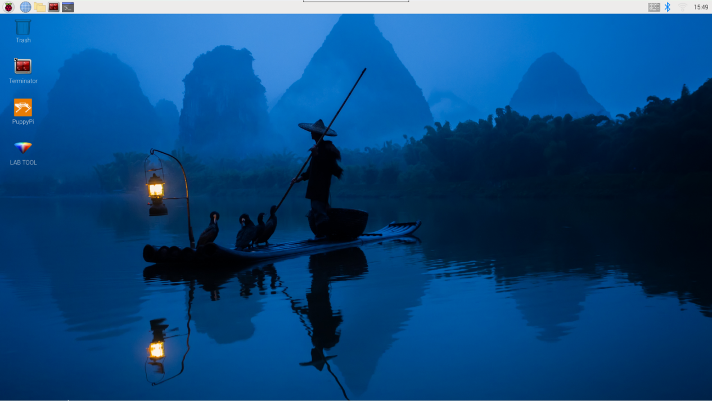
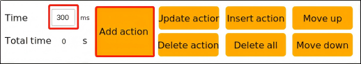

# 5. ROS1-PC Software Action Editing Course

## 5.1 PC Software Introduction

### 5.1.1 Open PC Software

(1) Open through Desktop Icon

① Double click .

② Click **"Execute"** in the pop-up window, and then we can open PC software.


(2) Open through Command

① Click  at the upper left corner to open command line terminal

② Input command and press Enter to open PC software.

```bash
python3 software/puppypi_control/PuppyPi.py
```

### 5.1.2 PC Software Layout

There are two control modes, including normal mode and coordinate mode.


<p id="anchor_5_1_2_1"></p>

(1) Normal Mode

Under normal mode, the interface is divided into 4 zones, including servo control area, action list, action group setting area and deviation setting area.


① Servo Control Area

PuppyPi's posture can be adjusted through modifying the corresponding servo value.

| Icon | Function |
|----|----|
|  | Servo ID |
|  | Used to adjust servo angle within 500~2500 |
|  | Used to adjust servo deviation within -100~100 |

② Action List

The duration and servo parameter of the action are displayed in the action list.


| Icon | Function |
|----|----|
|  | Action number |
|  | The duration of the action |
|  | Angle value of the corresponding servo. We can double click the value to modify |
|  | Run the selected action |

③ Action Group Setting Area

| Icon | Function |
|----|----|
|  | The time taken to run the individual action. We can modify the value directly. |
|  | The total time taken to run the whole action group |
|  | Add the current servo value set in the servo control area to the bottom of action list to form a new action |
|  | Replace the selected servo parameter in the action list with current value set in servo control area. And the Time will be substituted by the value set in |
|  | Insert one action above the selected action in the action list. The value of inserted action is the same as that set in servo control area. And the Time is the same as |
|  | Move the selected action to the previous line |
|  | Delete the selected action in the action list |
|  | Delete all the actions in the action list |
|  | Move the selected action to the next line |
|  | Run the actions in the action list once. If "**Loop**" is selected, the actions will be ran in loop. |
|  | Open the action group file we want |
|  | Save the actions in the action list to the designated path |
|  | Firstly, click  to open a action group, and then click this button to open other action group. After that, two action groups are integrated. |
|  | Display the action groups saved in PC software |
|  | Refresh the selected action group |
|  | Delete the selected action group file |
|  | (⑦) Delete all the action group files. |
|  | Execute the selected action group once |
|  | Stop running action group |
|  | Exit the PC software |

:::{Note}
 the action group files are all saved to the path "**/home/ubuntu/software/puppypi_control/ActionGroups**"
:::

④ Deviation Setting Area (The deviation of PuppyPi has already been adjusted before delivery)

| Icon | Function |
|----|----|
|  | Save the adjusted deviation |
|  | Restore the value of all servos in the servo control area to 1500. |
|  | After clicking it, we can adjust the rotation angle of the servo manually. |

(2) Coordinate Mode

Under coordinate mode, the interface is divided into three zones, including coordinate control area, action list and action group setting area.


① Coordinate Control Area

The posture can be adjusted through modifying the coordinate of PuppyPi's joints.

| Icon | Function |
|:--:|:--:|
|  | X axis coordinate is used to adjust the rotation angle of upper joint. It ranges from -15 to 15. The larger the value, the greater the joint rotates. |
|  | Z axis coordinate is used to adjust the flexion and extension of upper joint. It ranges from -15 to -1 and takes -10 as critical point. When the coordinate is greater than the critical point, the lower joint will flex upward. When it is smaller than the critical point, the lower joint will extend downward. |

② Action List

The running time of the action and the coordinate of joints are displayed in the action list. 


:::{Note}
we need to take PuppyPi as the first-person perspective.
:::

|                                                  Icon                                                   | Function |
|:-------------------------------------------------------------------------------------------------------:|:--:|
|    | Action number |
|   | The duration of the action |
|    | X-axis coordinate of the upper joint on PuppyPi's front right leg. We can double click the value to modify. |
|    | Z-axis coordinate of lower joint on front right leg. We can double click the value to modify. |
|    | X-axis coordinate of upper joint on front left leg. We can double click the value to modify. |
|    | Z-axis coordinate of lower joint on front left leg. We can double click the value to modify. |
|   | X-axis coordinate of upper joint on behind right leg. We can double click the value to modify. |
|   | Z-axis coordinate of lower joint on behind right leg. We can double click the value to modify. |
|   | X-axis coordinate of upper joint on behind left leg. We can double click the value to modify. |
|  | Z-axis coordinate of lower joint on behind left leg. We can double click the value to modify. |
|   | Run the selected action |

③ Action Group Setting Area 

The buttons of the action group setting area is the same as those of normal mode, except the  

For the detailed functions of the buttons, please refer to "[**5.1.2 PC Software Layout->Normal Mode**](#anchor_5_1_2_1)"

| Icon | Function |
|:--:|:--:|
|  | Restore all the X-axis coordinate to 0, and Z-axis coordinate to -11. |

## 5.2 Action Calling

### 5.2.1 Project Objective

This section mainly involves calling the built-in action groups through the PuppyPi PC software.

### 5.2.2 Calling Action Groups

(1)  Power on the device, and refer to the instructions under"[**Remote Tool Installation and Docker Entry Method**](3.Remote_Tool_Installation_Connection.md)" to connect using the VNC remote connection tool.



(2)  Double-click  and select "**Execute**" to open the PC software.

(3) Click "**Open Action File**" to open the action group file located in the same directory as this document.


(4) The action details list will display the opened action group.


(5) Click **"Run"** to execute the action group.


(6) Alternatively, click the dropdown button for the action group, select the desired action group to run, and then click **"Run"** to execute it.


## 5.3 Action Editing

### 5.3.1 Project Goal

There are two control modes on PC software, including normal mode and coordinate mode. Under normal mode, we can adjust PuppyPi's posture through modifying the servo parameters.
In this project, we will edit an action group to make PuppyPi **"wave hand"**, which consists of 13 independent actions.

### 5.3.2 Action Design

(1)  Double click  on the desktop, and select **"Normal Mode"**.


(2)  **Action 1**: click  to make PuppyPi restore to initial posture. And modify the Time as 500ms. Then click  to add this action to the action list.


Then the specific parameters of action1 are updated to the action list.


:::{Note}
 please remember to click "**Add Action**" button after each setting.
:::

(3) Drag the upper slider to 1000 position.


(4) **Action 2:** please set the servo parameter as the figure below shown to lift up front half its body. And click **"Add Action"** button to save this action to the action list.


(5) **Action 3:** follow the picture below to adjust the servo parameter to lift up front half its body more greatly. And click **"Add Action"** button to save this action to the action list.


(6)  **Action 4:** Make PuppyPi repeat action3 to make the transition between actions more natural. Set the time as 300ms, and click **"Add Action"** button.



(7) **Action 5:** adjust the servo parameter of ID1 servo as below to make the upper joint of front right leg swing forward. And set the time as 400ms. Then click "Add Action" button.


(8) **Action 6:** modify the value of ID2 servo as the picture shown to make the lower joint of front right leg to swing upward. Then click **"Add Action"** button.


(9) **Action 7:** modify value of ID2 servo to make the lower joint of front right leg to swing downward. Then click **"Add Action"** button.


(10) **Action8:** repeat action6 to make lower joint of front right leg swing upward. Then click **"Add Action"** button.


(11) **Action 9:** repeat action7 to make lower joint of front right leg swing downward. Then click **"Add Action"** button.


(12) **Action 10:** adjust the parameters to make PuppyPi restore to the posture of **Action3**. And Set the time as 600ms. Then click **"Add Action"** button. 


(13) **Action 11**: to make the transition between the actions more smooth, set the servo parameter of action11 the same as that of action 10. And set the time as 300ms. Then click **"Add Action**" button.


(14) **Action 12**: modify the servo parameter as follow to make PuppyPi look down with two front legs on the ground. And set the time as 600ms. Then click **"Add Action"** button.


(15) **Action 13**: click **"Reset Servo"** button to make PuppyPi return to initial posture. Then click **"Add Action"** button.


The servo parameters of these 13 actions are listed below.


:::{Note}
 the values in red are the values required to adjust in the previous steps. 
:::

### 5.3.3 Save Actions

(1) For the convenience of later debugging and management, click **"Save Action File"** to save this action group.


(2)  Save the action group to **/home/ubuntu/software/puppypi_control/ActionGroups** and we can name it **"sit_wave"**. Then click **"Save"**.


<p id="anchor_5_4"></p>

## 5.4 Coordinate Mode Introduction

### 5.4.1 Project Goal

There are two control modes on PC software, including normal mode and coordinate mode. Under coordinate mode, PuppyPi's posture can be adjusted through setting the coordinate of the corresponding joint. 
In this project, we will edit an action group to make PuppyPi to lean forward, which consists of 6 independent actions.

### 5.4.2 Coordinate Explanation

The joint distribution of PuppyPi is as the picture shown.


X-axis coordinate is used to adjust the rotation angle of upper joint, which ranges from -15 to 15. The larger the value, the greater the upper joint rotates forward. The smaller the value, the greater the upper joint rotates backward.

Z-axis coordinate is used to adjust the flexion and extension of lower joint. It ranges from -15 to -1, and its absolute value is the height of PuppyPi.

Take **-10** as critical point. When Z-axis coordinate is greater than **-10**, the larger the value, the greater the lower joint flexes, which means that the angle between the upper leg and lower leg is smaller. When Z-axis coordinate is smaller than **-10**, the smaller the value, the greater the lower joint extends, which means that the angle between the upper leg and lower leg is bigger.

### 5.4.3 Action Design

:::{Note}
 Please take PuppyPi as the first-person perspective.
:::

(1) Double click  on the desktop to open PC software. Then select **"Coordinate Mode"**.


(2) **Action 1:** click **"Reset Servo"** button to make PuppyPi return to the initial posture. And modify the time as 800ms. Then, click **"Add Action"** button. 


The specific parameters of this action are displayed on the action list. The coordinates of 4 legs are all (0, -10), which means that PuppyPi's height is 10cm.


:::{Note}
Please remember to click **"Add Action"** button after each setting.
:::

(3)  **Action 2:** modify Z-axis coordinate of lower joints as the picture shown. And set the time as 500ms. Then, click **"Add Action"** button. 


(4) **Action 3:** modify the Z-axis coordinate of two front upper joints to lift up front half its body. Then, click **"Add Action"** button.


(5)  **Action 4:** repeat action2 to make PuppyPi lean forward. Then, click **"Add Action"** button.


(6)  **Action5:** repeat action3 to lift up front half its body. Then, click **"Add Action"** button


(7)  **Action6:** click **"Reset Coordinate"** button to make PuppyPi return to initial posture. Then, click **"Add Action"** button


The servo parameters of these actions are listed below.


:::{Note}
 the values in red are the values required to adjust in the previous steps.
:::

### 5.4.4 Save Action

(1) Click **"Save Action File"** to save this action group.


(2)  Save the action group to **"/home/pi/PuppyPi_PC_Software/ActionGroups"** and we can name it **"Lean_forward"**. Then click **"Save"**.


## 5.5 Integrate Action File

### 5.5.1 Project Goal

Integrating action files is to integrate two action groups to form a new action group.

In this project, we will integrate **"raise_hands"** and **"sit"** action groups.

<p id="anchor_5_5_2"></p>

### 5.5.2 Normal Mode

(1)  After connecting VNC, double click  on the desktop to open PC software. Then select "**Normal Mode**". 


(2) Click **"Open Action File"** button, and then double click **"raise_hands"** action group to open it.


At this time, the parameters of "**raise_hands**" is updated to the action list


(3) Click **"Integrate Action File"**, and then open **"sit.d6a"** to completer integration.


At this time, parameters of "**sit**" is added behind the parameters of "**raise_hands**".


(4) Click "**Run**" button. Then PuppyPi will execute this new action group.


(5) Click **"Save Action File"** button, name this new action group **"raise_hands_sit"**, and the click **"Save"**.


### 5.5.3 Coordinate Mode

Double click  to open PC software. Then select **"Coordinate Mode"**.


The operation under Coordinate Mode is the same as that under Normal Mode. For the operation steps, please refer to "[**5.5.2 Normal Mode**](#anchor_5_5_2)".

## 5.6 APP Customized Control

### 5.6.1 Project Goal

In "[**5.4 Coordinate Mode Introduction**](#anchor_5_4)", we have edited an action group "**Lean_forward**". And in this project, we will make PuppyPi execute this action group with customized function on the APP.

<p id="anchor_5_6_2"></p>

### 5.6.2 Getting Ready

(1)  After connecting to VNC, click  at the upper left corner to open Terminator terminal.

(2) Enter the directory to check all the action groups.

```bash
cd software/puppypi_control/ActionGroups
```

```bash
ls
```


### 5.6.3 Operation Steps

(1) Open the APP **"WonderPi"**, then connect to PuppyPi. After successful connection, enter **"Performance Mode"**.


(2)  Next, click "**Custom**" button.


(3)  Click "**Add**" to add the customized action.


(4)  Please enter action name "**Lean Forward**" and the action file name "**Lean_forward**". Then click "**OK**".


```bash
cd software/puppypi_control/ActionGroups
```

:::{Note}
we can input randomly in the bar of "**Action Name**". But in the bar of "**Action File Name**", we need to enter the accurate file names of the existed action groups. And we can follow the steps in "[**5.6.2 Getting Ready**](#anchor_5_6_2)" to check.
:::

(5)  Click "**Custom**" button, and then select "**Lean Forward**" action. Then PuppyPi will execute this action.


(6)  If need to modify this action, we can long press "**Lean Forward**". In the pop-up window, you can edit or delete this action.

