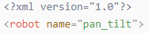
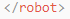
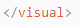

# 6. ROS1-Simulation Course

## 6.1 Introduction to URDF Models and Getting Started

### 6.1.1 URDF Model Introduction

The Unified Robot Description Format (URDF) is an XML file format widely used in ROS (Robot Operating System) to comprehensively describe all components of a robot.

Robots are typically composed of multiple links and joints. A link is defined as a rigid object with certain physical properties, while a joint connects two links and constrains their relative motion.

By connecting links with joints and imposing motion restrictions, a kinematic model is formed. The URDF file specifies the relationships between joints and links, their inertial properties, geometric characteristics, and collision models.

### 6.1.2 Comparison between xacro and URDF Model

The URDF model serves as a description file for simple robot models, offering a clear and easily understandable structure. However, when it comes to describing complex robot structures, using URDF alone can result in lengthy and unclear descriptions.

To address this limitation, the xacro model extends the capabilities of URDF while maintaining its core features. The xacro format provides a more advanced approach to describe robot structures. It greatly improves code reusability and helps avoid excessive description length.

For instance, when describing the two legs of a humanoid robot, the URDF model would require separate descriptions for each leg. On the other hand, the xacro model allows for describing a single leg and reusing that description for the other leg, resulting in a more concise and efficient representation.

### 6.1.3 Basic Syntax of URDF Model

* **XML Basic Syntax**

The URDF model is written using XML standard. 

(1) Elements:

An element can be defined as desired using the following formula:

```xml
<element>
</element>
```

(2) Properties:

Properties are included within elements to define characteristics and parameters. Please refer to the following formula to define an element with properties:

```xml
<element
property_1="property value1"
property_2="property value2">
</element>
```

(3) Comments:

Comments have no impact on the definition of other properties and elements. Please use the following formula to define a comment:

```xml
<!-- comment content -->
```

* **Link**

The Link element describes the visual and physical properties of the robot's rigid component. The following tags are commonly used to define the motion of a link:


(1) \<visual\>：Describe the appearance of the link, such as size, color and shape.

(2) \<inertial\>：Describe the inertia parameters of the link, which will used in dynamics calculation.

(3) \<collision\>：Describe the collision inertia property of the link.

Each tag contains the corresponding child tag. The functions of the tags are listed below.

| Tag | Function |
|:---|:---|
| origin | Describe the pose of the link. It contains two parameters, including xyz and rpy. Xyz describes the pose of the link in the simulated map. Rpy describes the pose of the link in the simulated map. |
| mess | Describe the mess of the link |
| inertia | Describe the inertia of the link. As the inertia matrix is symmetrical, these six parameters need to be input, ixx, ixy, ixz, iyy, iyz and izz, as properties. These parameters can be calculated. |
| geometry | Describe the shape of the link. It uses mesh parameter to load texture file, and em[ploys filename parameters to load the path for texture file. It has three child tags, namely box, cylinder and sphere. |
| material | Describe the material of the link. The parameter name is the required filed. The tag color can be used to change the color and transparency of the link. |

<p id="anchor_6_1_3_joint"></p>

* **Joint**

The "**Joint**" tag describes the kinematic and dynamic properties of the robot's joints, including the joint's range of motion, target positions, and speed limitations. In terms of motion style, joints can be categorized into six types.


The following tags will be used to write joint motion.


(1) `<parent_link>`：Parent link

(2) `<child_link>`：Child link

(3) `<calibration>`：Calibrate the joint angle

(4) `<dynamics>`：Describes some physical properties of motion

(5) `<limit>`：Describes some limitations of the motion

The function of each tag is listed below. Each tag involves one or several child tags.

| Tag | Function |
|:--:|:--:|
| origin | Describe the pose of the parent link. It involves two parameters, including xyz and rpy. Both xyz and rpy describe the pose of the link in simulated map. |
| axis | Control the child link to rotate around any axis of the parent link. |
| limit | The motion of the child link is constrained using the lower and upper properties, which define the limits of rotation for the child link. The effort properties restrict the allowable force range applied during rotation (values: positive and negative; units: N). The velocity properties confine the rotational speed, measured in meters per second (m/s). |
| mimic | Describe the relationship between joints. |
| safety_controller | Describes the parameters of the safety controller used for protecting the joint motion of the robot. |

* **robot Tag**

The complete top tags of a robot, including the <link> and <joint> tags, must be enclosed within the <robot> tag. The format is as follows:


* **gazebo Tag**

This tag is used in conjunction with the Gazebo simulator. Within this tag, you can define simulation parameters and import Gazebo plugins, as well as specify Gazebo's physical properties, and more.


* **Write Simple URDF Model**

(1) Name the model of the robot

To start writing the URDF model, we need to set the name of the robot following this format: "**\<robot name='robot model name'\>**". Lastly, input "**\</robot\>**" at the end to represent that the model is written successfully.





(2) Set links

① To write the first link and use indentation to indicate that it is part of the currently set model. Set the name of the link using the following format: **\<link name="link name"\>**. Finally, conclude with "**\</link\>**" to indicate the successful completion of the link definition.


② Write the link description and use indentation to indicate that it is part of the currently set link, and conclude with "**\</visual\>**". 




③ The "**\<geometry\>**" tag is employed to define the shape of a link. Once the description is complete, include "**\</geometry\>**". Within the "**\<geometry\>**" tag, indentation is used to specify the detailed description of the link's shape. The following example demonstrates a link with a cylindrical shape: "**\<cylinder length='0.01' radius='0.2'/\>**". In this instance, "**length='0.01'**" signifies a length of 0.01 meters for the link, while "**radius='0.2'**" denotes a radius of 0.2 meters, resulting in a cylindrical shape.


④ The "**\<origin\>**" tag is utilized to specify the position of a link, with indentation used to indicate the detailed description of the link's position. The following example demonstrates the position of a link: "**\<origin rpy='0 0 0' xyz='0 0 0' /\>**". In this example, "**rpy**" represents the roll, pitch, and yaw angles of the link, while "**xyz**" represents the coordinates of the link's position. This particular example indicates that the link is positioned at the origin of the coordinate system.


⑤ The "**\<material\>**" tag is used to define the visual appearance of a link, with indentation used to specify the detailed description of the link's color. To start describing the color, include "**\<material\>**", and end with "**\</material\>**" when the description is complete. The following example demonstrates setting a link color to yellow: "**\<color rgba='1 1 0 1' /\>**". In this example, "**rgba='1 1 0 1'**" represents the color threshold for achieving a yellow color.


(3) Set joint

① To write the first joint, use indentation to indicate that the joint belongs to the current model being set. Then, specify the name and type of the joint as follows: "**\<joint name='joint name' type='joint type'\>**". Finally, include "**\</joint\>**" to indicate the completion of the joint definition.

:::{Note}
to learn about the type of the joint, please refer to "[**6.1.3 Basic Syntax of URDF Model -\> joint**](#anchor_6_1_3_joint)". 
:::


② Write the description section for the connection between the link and the joint. Use indentation to indicate that it is part of the currently defined joint. The parent parameter and child parameter should be set using the following format: "**\<parent link='parent link'/\>**", and "**\<child link='child link' /\>**". With the parent link serving as the pivot, the joint rotates the child link.


③ "**\<origin\>**" describes the position of the joint using indention. This example describes the position of the joint: "**\<origin xyz='0 0 0.1' /\>**". xyz is the coordinate of the joint.


④ "**\<axis\>**" describes the position of the joint adopting indention. "**\<axis xyz="0 0 1" /\>**" describes one posture of a joint. Xyz specifies the pose of the joint.


⑤ "**\<limit\>**" imposes restrictions on the joint using indention. The below picture The "**\<limit\>**" tag is used to restrict the motion of a joint, with indentation indicating the specific description of the joint angle limitations. The following example describes a joint with a maximum force limit of 300 Newtons, an upper limit of 3.14 radians, and a lower limit of -3.14 radians. The settings are defined as follows: "**effort='joint force (N)', velocity='joint motion speed', lower='lower limit in radians', upper='upper limit in radians'**".


⑥ "**\<dynamics\>**" describes the dynamics of the joint using indention. "**\<dynamics damping='50' friction='1' /\>**" describes dynamics parameters of a joint.


The complete code is as below:


## 6.2 ROS Robot Dog URDF Model Description

### 6.2.1 Import Virtual Machine

* **Start and Import the Virtual Machine**

(1)  Extract the virtual machine files located in the same directory to any non-Chinese path.

(2)  Extract and open the client from the "**PuppyPi_VM.zip**" file 


(3)  Open a virtual machine.


(4) Navigate to the location where the virtual machine was extracted, select the "**PuppyPi_VM.ovf**" file, and click "**Open**".


(5) Click "**Browse**" to set the virtual machine storage path. It is recommended to store it on a solid-state drive (SSD), as the read/write speed of the storage drive will affect the virtual machine's performance. Finally, click "**Import**".


(6) Click "**Power on this Virtual Machine**" to run it.


### 6.2.2 Open Robot Dog URDF Model File

(1) In the Ubuntu system of the VMware virtual machine, press "**Ctrl+Alt+T**" to open the terminal. Then, enter the following command to navigate to the folder where the URDF model is stored：**cd puppy_sim/src/puppy_description/urdf**.


(2) For example, to open the robot dog's URDF model, enter the following command in this directory:

```bash
vim puppy.urdf.xacro
```


(3) If the screen appears as shown below, it confirms that the PuppyPi robot dog's URDF model file has been successfully opened.


### 6.2.3 Analysis and Understanding of the URDF Model

* **Structure of the URDF Model**

The URDF model of the PuppyPi robot consists of three files: **"puppy.urdf.xacro"**, **"puppy.gazebo.xacro"**, and **"puppy.transmission.xacro"**. Among these, puppy.urdf.xacro is the main URDF file for the entire robot. It includes the other two xacro files, puppy.gazebo.xacro and puppy.transmission.xacro, which together define the robot's complete mechanical structure, dynamics, and simulation information.
The files are organized using include directives and macros, which allow for functional modularization. This makes the model easier to read, maintain, and update, ultimately forming a complete and organized URDF model.

* **Analysis of puppy.urdf.xacro** 

This file defines the basic structure of the robot, including the body, joints, and connections. It also includes some macro and property definitions, which can be reused multiple times in the code to simplify it and avoid redundancy. Since the code is relatively long, it will be divided into three parts for easier explanation, covering the following sections:

(1)  Model Declaration and Property Definitions

The \<robot\> tag defines the robot model's name as "**puppy**". The \<property\> tag defines various property values, such as maximum torque and maximum joint speed.

The \<include\> directive includes two files: puppy.transmission.xacro and puppy.gazebo.xacro. These files contain information about the robot's transmission system and its properties in the Gazebo simulation environment.


(2) Link Definition

The \<link\> element represents a rigid body in the robot model and can contain information such as inertia, visualization, and collision data. Below is an example code for a \<link\> element that includes inertia, visualization, and collision information:


(3) Joint Definition 

The \<joint\> element represents a joint in the robot model, connecting two links and defining their relative motion. Below is an example code for a \<joint\> element that includes joint type, connected links, joint axis direction, and joint limits:


* **Analysis of puppy.gazebo.xacro**

This section is primarily used to define the physical characteristics, joint controls, sensors, and other information of the robot's components for simulation, control, and testing in the Gazebo environment. Since the code is relatively long, it will be divided into three parts for easier explanation, covering the following sections:

(1) Gazebo Plugin Definition

This section defines a Gazebo plugin, "**gazebo_ros_control**", which is used for controlling the robot. The actual implementation of this plugin is provided by the library "**libgazebo_ros_control.so**". Additionally, it sets the Gazebo simulation type and defines the namespace for the robot model.


(2) Macro Definitions

This section defines several Xacro macros, which are used to easily set the color and physical properties of the robot's links. The "**model_color**" macro is used to set the color of a link, while the "**link_setup_block**" macro is used to define the physical properties of a link. 


(3) Using Macro

Use the following macros to set the color and physical properties of each link in the robot model. The "**model_color**" macro simplifies the process of setting the link's color. This macro accepts a link_name parameter and assigns the specified link a black material while enabling gravity for that link.

 

* **Analysis of puppy.transmissions.xacro**

The transmissions.xacro file defines the transmission system within the robot model, including the transmission methods between joints and motors. During runtime, ROS will convert the 'transmissions.xacro' file into the robot's transmission system. This file consists of the following two main parts:

(1) Xacro Macro Definitions

Xacro macros are used to define templates for the transmission system using the \<xacro:macro\> tag. The \<transmission\> tag specifies the type and name of the transmission system, the \<joint\> tag defines the joint actuator interface, and the \<actuator\> tag sets the mechanical reduction ratio and other related properties.


(2) Defining Different Transmission Types

The transmission block Xacro macro is invoked to define the corresponding transmission for each joint. This allows the robot's transmission system to be consistently defined through configuration files.


## 6.3 Gazebo Introduction

### 6.3.1 Gazebo Introduction

Gazebo is a 3D dynamic simulator that accurately and effectively simulates robots in complex indoor and outdoor environments. Similar to game engines providing high-fidelity visual simulation, Gazebo offers high-fidelity physics simulation. It provides a comprehensive set of sensor models and a user-friendly interaction method for both users and programs.

(1)  Typical applications of Gazebo:

• Testing robot algorithms

• Designing robots

• Conducting regression tests in real-world scenarios

(2) Key features of Gazebo:

• Incorporates multiple physics engines

• Includes a diverse range of robot models and environment libraries

• Offers various sensors

• Convenient programming and a simple graphical interface

(3)  Gazebo's official recommendation is to run on Ubuntu or other Linux distributions. Additionally, your computer should have the following capabilities:

• Dedicated GPU: Nvidia cards often perform well on Ubuntu

• At least an Intel I5 or equivalent CPU

• Minimum of 500MB available disk space

• Install the highest version of Ubuntu Trusty whenever possible

### 6.3.2 Gazebo System Structure

Gazebo employs a distributed architecture that encompasses separate libraries for communication, physics simulation, rendering, sensor generation, and the user interface. Additionally, Gazebo provides two executable programs for running simulations:

(1) The server, `gzserver` is responsible for simulating physics, rendering, and sensors.

(2) The client `gzclient`  furnishes a graphical interface for visualizing the simulation and interacting with it.

(3) Communication between the client and server occurs through the Gazebo communication library.

Gazebo's Master is akin to the master node in the ROS system's communication mechanism but operates with topics. It facilitates topic name discovery and management. A single Master can oversee the simulation of multiple physical environments, sensor generation, and graphical interfaces.

* **Communication Related Library**

This library serves as Gazebo's communication and transport mechanism, currently supporting only publish/subscribe. The communication-related library is the foundation for the implementation of all sub-libraries and is typically included in them.

(1) Dependent Libraries: Protobuf and boot::ASIO

(2) External Interface: Supports communication with Gazebo nodes through named topics

(3) Internal Interface: None

(4) Broadcast Topics: None

(5) Subscribed Topics: None

* **Library for Physics Environment**

This physics environment library provides a simple and fundamental interface for the essential components of simulation, including rigid bodies, collision shapes, and constraints related to joints. This interface is embedded with four open-source physics engines: Open Dynamics Engine (ODE), Bullet, Simbody, and Dynamic Animation and Robotics Toolkit (DART).

Model descriptions in XML format, based on the SDF (Simulation Description Format), can be loaded by these physics engines. They offer different implementation algorithms and simulation characteristics.

(1) Dependent Libraries: Dependencies include internal collision detection libraries from dynamic engine libraries.

(2) External Interface: Provides a simple, general interface for physics simulation.

(3) Internal Interface: Offers a basic interface defining the physics library for third-party dynamic engines

* **Rendering Library**

This parsing library utilizes OGRE to provide a simple interface for parsing three-dimensional scenes. It includes simulation of lighting, textures, and the sky, allowing for the creation of plugins for rendering engines.

(1) Dependent Library：OGRE

(2) External Interface: Allows loading, initialization, and scene creation.

(3) Internal Interface: Stores metadata for visualization and calls the OGRE API to render models.

* **Sensor Data Generation Library**

This sensor library enables various types of sensors to listen to updates from the simulated environment in the physics library. It generates different data based on the characteristics of each sensor.

(1) Dependent Libraries: Dependencies include the rendering library and the physics environment library.

(2) External Interface: Provides basic sensor initialization and settings.

(3) Internal Interface: To be determined (TBD).

* **GUI**

The GUI library uses QT to create graphical widgets for user simulation interaction. Users can control the flow of time by pausing or changing the time step through GUI widgets. Additionally, users can modify the scene by adding, modifying, or removing models. There are also tools for visualizing and recording simulated sensor data.

(1) Dependent Libraries: Dependencies include the rendering library and QT.

(2) External Interface: None

(3) Internal Interface: None

### 6.3.3 Coordinate System

Coordinate systems are essential for both forward and inverse kinematic analyses. Below, we'll use the PuppyPi robot model in the Gazebo environment as an example to introduce several commonly used coordinate systems.

(1)  World Coordinate System

The World Coordinate System is a stationary reference coordinate system located on the 'ground.' It undergoes no translation or rotation changes over time. Of course, here, the term 'ground' is broadly defined. For example, if the robot is on a tabletop, the world coordinate system would be situated on the plane of that table.

(2)  Leg Coordinate System

The establishment of the joint coordinate system follows the right-hand rule. Therefore, in the example robot model in the diagram below, the red axis represents the X-axis, the green axis represents the Y-axis, and the blue axis represents the Z-axis.

The number of joint coordinate systems is not fixed and is mainly related to the number of legs. Therefore, extra attention should be paid when establishing joint coordinate systems.  


## 6.4 Gazebo Simulation & Motion Planning

:::{Note}

* Before starting the simulation, ensure that the robot dog has sufficient battery power, preferably fully charged.
* Please note: All the following steps require the use of both the VM virtual machine and the robot dog. Make sure to power on the robot dog in advance.
* It is recommended to set the robot in direct connection mode to fully experience this simulation feature.

:::

### 6.4.1 Install Virtual Machine

* **Install Virtual Machine Software**

Virtual Machine PuppyPi_VM：[PuppyPi_VM](https://pan.baidu.com/share/init?surl=U1ybIJ--KNu5fvi1ayAtGw)

* **Open and Import the Virtual Machine**

(1) Extract the virtual machine files from the provided archive to any directory with a non-Chinese path.

(2) Navigate to the directory "[**Software Tools->PuppyPi_VM.zip**]()". Then, open the virtual machine client. 


(3) Click-on **'Open a Virtual Machine'.**


(4) Navigate to the extracted virtual machine directory, select **'PuppyPi_VM,.ovf'**, and click "**Open**".


(5) Click **"Browse"** to set the storage path for the virtual machine. It is recommended to use an SSD (Solid State Drive) for storage, as the read/write speed of the storage disk will affect the performance of the virtual machine. Finally, click **"Import"**.


### 6.4.2 Configure the Virtual Machine Network

(1) Turn on the PuppyPi robot. On the computer with VMware installed, connect to the robot's hotspot. The hotspot name typically follows the format:


(2) After successfully connecting to the hotspot, open VMware and click "**Edit > Virtual Network Editor**" in the menu. 


(3) In the network card list under "**Bridge Mode**", select the wireless network adapter of your computer. The name of the wireless network adapter may vary by device but typically includes "**802.11ac**" in its name. Select the adapter with "**802.11ac**", and click "**OK**" to confirm.


(4) Click **"Power on this Virtual Machine"** and wait for the boot process to complete.


(5) Once on the Ubuntu desktop, right-click anywhere, select **"Open in Terminal"** to launch the terminal. 


(6) Enter the following command and press Enter. The red box in the terminal output will display the IP address of the Ubuntu system.

```bash
ifconfig
```


:::{Note}
If the IP address is not displayed after entering the ifconfig command, please check whether you are properly connected to the Puppy hotspot. If the connection is correct but the IP is still not found, you can manually obtain the IP address by entering the command sudo dhclient ens33. By default, ens33 is the name of the network interface.
:::

### 6.4.3 Confirm System Environment 

(1) Go to the Ubuntu desktop, right-click, and select **"Open in Terminal"** to open the command line.


(2) In the terminal, enter the following command to open the network configuration file:

```bash
sudo vim /etc/hosts
```

(3) Replace the IP addresses on lines 2 and 3 (shown in the image) with the IP addresses of the virtual machine and Raspberry Pi.


:::{Note}
• Ensure that the indentation of the new IP addresses matches that of the previous lines.
• In direct connection mode, the default IP of PuppyPi is 192.168.149.1.
:::

(4) Enter the following command to update the configuration.

```bash
source ~/.bashrc
```

(5) Access VNC, open the terminal, and enter the following command to send PuppyPi's action data to Gazebo:

```bash
rosparam set /puppy_control/joint_state_controller_pub_topic true
```


### 6.4.4 Start Gazebo Simulation Tool

(1) In the virtual machine terminal, enter the following command to launch Gazebo simulation and wait for the service to start. If the content shown in the image below appears, it means that Gazebo has successfully started:

```bash
roslaunch puppy_description gazebo.launch
```


(2) Click the Gazebo simulation software icon on the left taskbar of the Ubuntu system page to enter the simulation interface. Then, click the **"Start"** button at the bottom of the Gazebo simulation page to begin the simulation.


### 6.4.5 Gazebo GUI Introduction

The simulation interface is as below:


|    Name    |                           Function                           |
| :--------: | :----------------------------------------------------------: |
|  Menu Bar  | Used for configuring or modifying simulation software parameters, and for various interactive features. |
|  Toolbar   | Provides the most commonly used options for interacting with the simulator. |
| Timestamp  |   Allows you to control the time within the virtual space    |
| Action Bar |   Allows you to manipulate the model and modify parameters   |
|   Scene    | The main section of the simulator, where the simulation models are displayed |

### 6.4.6 Using the Simulation Software

We will use the Trot gait as an example.

(1) First, go back to the VNC and enter the following command to check if the gait is set to Trot:

```bash
rosed puppy_control puppy_demo.py
```


(2) Next, enter the following command and press Enter to start the Trot gait:

```bash
rosrun puppy_control puppy_demo.py
```

(3) You will observe that the robot dog starts running with the Trot gait, and it begins to move in the simulation software as well.


(4) By default, the program is set to the Trot gait. If you want to switch to another gait, enter the command in VNC to locate the section in the code shown below. For example, to change to the Amble gait, replace `gait = 'Trot' with "gait = 'Amble'"`.

```bash
rosed puppy_control puppy_demo.py
```


(5) Press **"ESC"** to enter the command mode, then type **":wq"** to save the changes: 

```bash
:wq
```


