# 7.ROS1_AI_Vision_and_Tracking_Course

<p id="anchor_7_1"></p>

## 7.1 Color Threshold Adjustment

Different light sources will have different influence on the colors, which will result in recognition discrepancy. If this discrepancy hinders functions from realizing, we need to tackle this problem with **LAB_Tool**.

### 7.1.1 Open LAB_Tool

(1) Open VNC software, double click 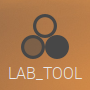 to open LAB_Tool.

(2) Then click **"execute"** in the pop-up window.

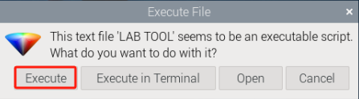

(3) The interface of LAB_Tool is as follows.


:::{Note} 

If there is no camera returned image, it means that the camera is not connected. Please check the camera wiring. 

:::

### 7.1.2 Interface Layout

The interface is divided into two parts, including image display zone and recognition adjustment zone.

| **Zone**                    | **Zone Layout**                                              |
| --------------------------- | ------------------------------------------------------------ |
| Image display zone          |  |
| Recognition adjustment zone |  |

- **Image Display Zone**

| **Icon**                                                     | **Function**                                                 |
| ------------------------------------------------------------ | ------------------------------------------------------------ |
|  | At left, it is the original image. At right, it is the processed image. |

- **Recognition Adjustment Zone**

| **Icon**                                                     | **Function**                                                 |
| ------------------------------------------------------------ | ------------------------------------------------------------ |
| 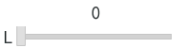 | Used to adjust **L** component of the image. Its function is the same as that of A and B sliders. |
|  | Select the recognized color to adjust                        |
|  | Save the adjusted value                                      |
|  | Add new colors                                               |

### 7.1.3 Adjust Default Color

Take adjusting red color for example. The following operation steps are also applicable to modifying other colors.

(1) Open LAB_Tool. When the camera is ready, select **"red"** in the drop-down menu.

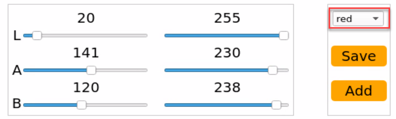

(2) Modify all the values in **"min"** as 0, and **"max"** area as 255.

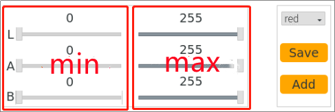

(3) Face the camera to the red block. Drag L, A and B sliders to adjust the color threshold until the red block at left turns white and other area turns black.

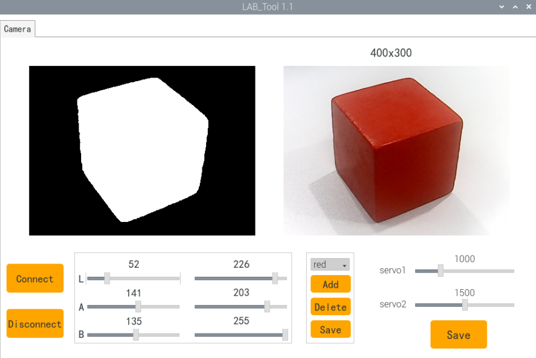

- **LAB Threshold Adjustment Parameter**

| **Color Component** | **Range** | **Corresponding Color Zone** |
| ------------------- | --------- | ---------------------------- |
| L                   | 0~255     | Black-White（-L ~ +L）       |
| A                   | 0~255     | Green-Red（-a ~ +a）         |
| B                   | 0~255     | Blue-Yellow（-b ~ +b）       |

- **LAB Color Space**

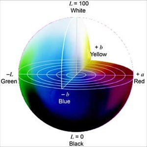

We need to adjust the value of L, A and B to approach the zone of the recognized color. Take **"red"** for example, and please follow these steps to adjust.

① Firstly, set all the parameters at left as 0, and at right as 255.

② In **"LAB Color Space"**, all types of red are around **"+a"**, hence we need to increase A component. Remain the A max value at right unchanged. And increase the A min value at left until the red block at left turns white and other area turns black.

③ Based on the environment, modify the value of **"L"** and **"B"**. If it belongs to light red, increase L min value at left. Otherwise, decrease L max value at right. If it belongs to warm tone, increase B min value at left. Otherwise, decrease B max at right.

(4) Click **"Save"** button to keep the adjusted value.

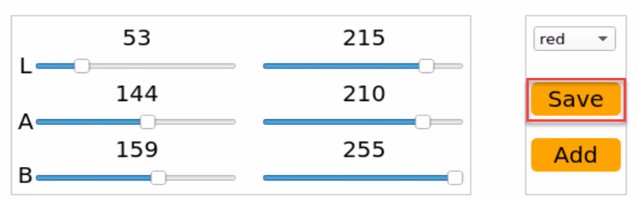

### 7.1.4 Add New Recognition Color

Besides three built-in recognized colors, we can add other recognized color in two ways.

(1) Directly modify the LAB value of red, blue or green as the actual LAB value of the new color.

(2) Use **"Add"** button to add new color option.

Method ① is more convenient. Take adding orange with method ① for example. The specific operation steps are as follows.

- **Take adding orange color as example. Follow the steps below to operate.**

(1) Open **LAB_Tool**. After the camera is ready, select **"red"** in the drop-down menu.


(2) Face the camera to the orange object. And then drag the slider of L, A and B to adjust the color threshold until the orange ball at left turns white and other area turns black.

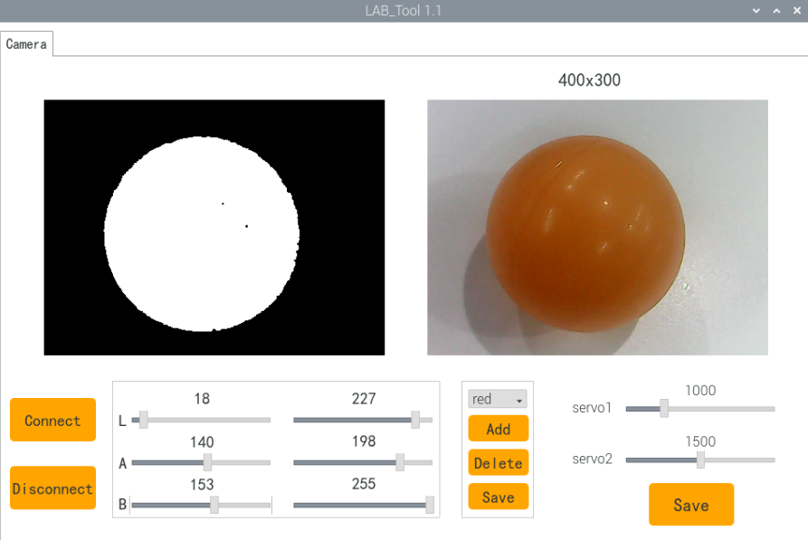

(3) Click **"Save"** buttons to keep the modified data.


## 7.2 Color Recognition

### 7.2.1 Program Logic

Firstly, program to recognize color. Use Lab color space to convert the image from RGB into Lab.

Then, perform binarization, corrosion, dilation, etc., on the image to obtain the maximum contour which contains the target color.

Lastly, display the recognition result on the camera returned image and terminal interface.

### 7.2.2 Operation Steps

:::{Note} 

The input command should be case sensitive. And the key words can be complemented by **"Tab"** key.

:::

(1) Turn on PuppyPi, and then connect to Raspberry Pi desktop through VNC.

(2) Click  to open command line terminal.

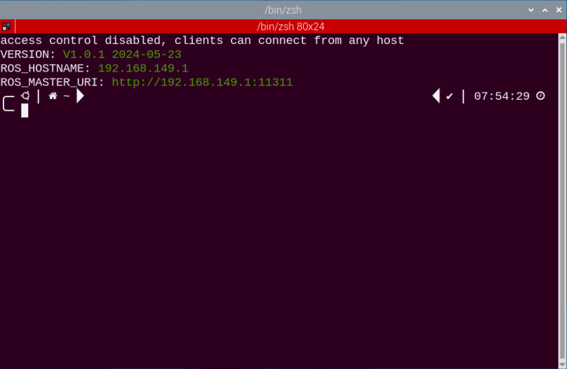

(3) Input the following command and press Enter to start color recognition.

```
rosrun puppy_standard_functions color_detect_demo.py
```

(4) If want to close this game, we can press **"Ctrl+C"**. If it fails to close the game, please try again.

### 7.2.3 Program Outcome

When red, green or blue is recognized, the color type will be displayed on camera returned image and the terminal.

For example, when red block is recognized, **"red"** will show up.

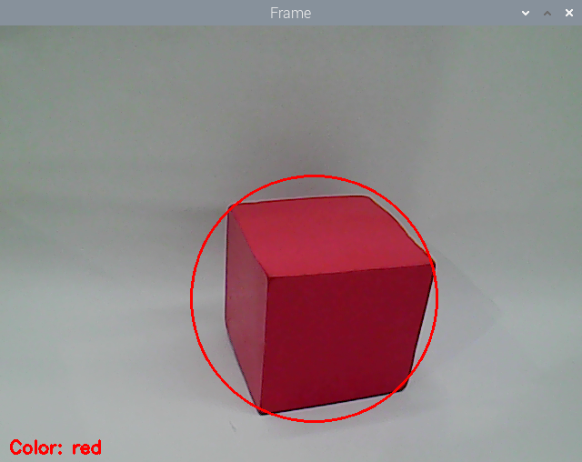 

### 7.2.4 Program Analysis

[Source Code](../_static/source_code/ros1/puppy_standard_functions_scripts.zip)

The source code for this program can be found within the Docker container at: [/home/ubuntu/puppypi/src/puppy_standard_functions/scripts/color_detect_demo.py](../_static/source_code/ros1/puppy_standard_functions_scripts.zip)

- **Image Processing**

(1) Gaussian filtering

Before converting the image from RGB into Lab space, denoise the image and use `GaussianBlur()` function in cv2 library for Gaussian filtering.

{lineno-start=59}

```python
    frame_gb = cv2.GaussianBlur(frame_resize, (3, 3), 3)
```

The meaning of the parameters in bracket is as follows:

The first parameter `frame_resize` is the input image

The second parameter `(3, 3)` is the size of Gaussian kernel

The third parameter `3` is the allowable variance around the average in Gaussian filtering. The larger the value, the larger the allowable variance

(2) Binarization Processing

Adopt `inRange()` function in cv2 library to perform binarization on the image.

{lineno-start=68}

```python
        frame_mask = cv2.inRange(frame_lab,
                                        (color_range_list[i]['min'][0],
                                        color_range_list[i]['min'][1],
                                        color_range_list[i]['min'][2]),
                                        (color_range_list[i]['max'][0],
                                        color_range_list[i]['max'][1],
                                        color_range_list[i]['max'][2]))  #对原图像和掩模进行位运算(perform bitwise operation to original image and mask)
```

The first parameter in the bracket is the input image. The second and the third parameters respectively are the lower limit and upper limit of the threshold. When the RGB value of the pixel is between the upper limit and lower limit, the pixel is assigned 1, otherwise, 0.

(3) Erosion and Dilation Processing

To reduce the interference and make the image smoother, it is necessary to perform corrosion and dilation on the image.

{lineno-start=75}

```python
        eroded = cv2.erode(frame_mask, cv2.getStructuringElement(cv2.MORPH_RECT, (3, 3)))  #腐蚀(corrosion)
        dilated = cv2.dilate(eroded, cv2.getStructuringElement(cv2.MORPH_RECT, (3, 3))) #膨胀(dilation)
```

`erode()` function is used for corrosion. Take `eroded = cv2.erode(frame_mask, cv2.getStructuringElement(cv2.MORPH_RECT, (3, 3)))` for example. The meaning of the parameters in bracket are as follows.

The first parameter `frame_mask` is the input image.

The second parameter `cv2.getStructuringElement(cv2.MORPH_RECT, (3, 3))` is the structural element and kernel deciding the nature of the operation. And the first parameter in the parenthesis is the kernel shape and the second parameter is the kernel dimension.

`dilate()` function is used for image dilation. And the meaning of the parameters in parenthesis is the same as that of `erode()` function.

(4) Acquire the maximum contour

① After processing the image, acquire the contour of the target to be recognized, which involves `findContours()` function in cv2 library.

{lineno-start=79}

```python
        contours = cv2.findContours(dilated, cv2.RETR_EXTERNAL, cv2.CHAIN_APPROX_NONE)[-2]  #找出轮廓(find out contour)
```

The first parameter in parentheses is the input image; the second parameter is the retrieval mode of the contour; the third parameter is the approximation method of the contour.

② Find the contour of the maximum area among the obtained contours. To avoid interference, please set a minimum value. Only when the area is larger than this value, the target contour is valid.

{lineno-start=80}

```python
        areaMaxContour, area_max = getAreaMaxContour(contours)  #找出最大轮廓(find out the contour with the maximal area)
```

- **Feedback information**

(1) After the contour of the maximum area is obtained, call `circle()` function in cv2 library, and circle the recognized target. The color of the circle is in line with the recognized color.

{lineno-start=91}

```python
        cv2.circle(img, (centerX, centerY), radius, range_rgb[color_area_max], 2)#画圆(draw circle)
```

(2) Then call `print()` function to print the recognized color on the terminal.

{lineno-start=120}

```python
            print('detect_color is',detect_color)
```

(3) Use `putText()` function in cv2 library to print the recognized color on the camera returned image

{lineno-start=125}

```python
    cv2.putText(img, "Color: " + detect_color, (10, img.shape[0] - 10), cv2.FONT_HERSHEY_SIMPLEX, 0.65, draw_color, 2)
```

The meaning of the parameters is as follows.

The first parameter `img` is the input image.

The second parameter `"Color: " + detect_color` represents the displayed content.

The third parameter `(10, img.shape[0] - 10)` is where to display.

The fourth parameter `cv2.FONT_HERSHEY_SIMPLEX` represents the font type.

The fifth parameter `0.65` represents the font size.

The sixth parameter `draw_color` represents the color of the font.

The seventh parameter `2` represents the font weight.

### 7.2.5 Function Extension

- **Add new recognized color**

In addition to the three built-in recognized colors, we can also set other colors for recognition. For example, let's take orange as an additional color for recognition. The specific modification steps are as follows:

(1) Based on [**"7.1 Color Threshold Adjustment"**](#anchor_7_1), use LAB_TOOL to add orange and save it.

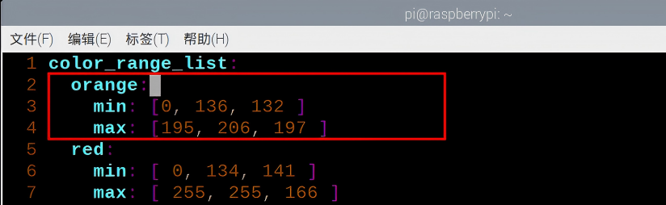

(2) After saving the orange color sample, open the command window, enter the following command, and press **Enter** to navigate to the directory where the files are stored.

```
cd puppypi/src/lab_config/config/lab_config.yaml
```

(3) Open the lab_config.yaml file to locate the LAB values for orange:

```
vim lab_config.yaml
```

In the file, find the LAB values you previously added for the orange color.

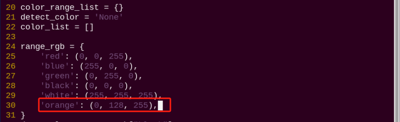

(4) Open a new terminal and navigate to the directory containing lab_config_list.yaml:

```
cd puppypi/src/lab_config/config/lab_config.yaml
```

(5) Open the lab_config_list.yaml file:

```
vim lab_config_list.yaml
```

Copy the orange LAB values from lab_config.yaml and paste them into this file. Save and exit.

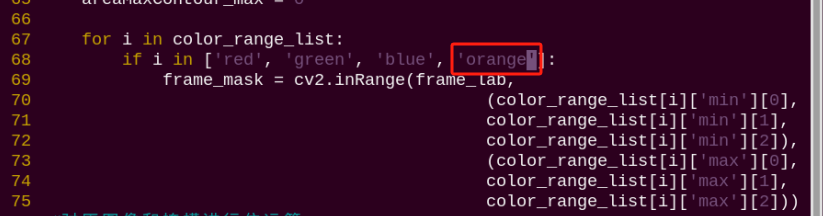

(6) Navigate to the directory containing the color detection script:

```
cd puppypi/src/puppy_standard_functions/scripts
```

(7) Open the color detection program:

```
vim color_detect_demo.py
```

In this file, locate the section where the display color (BGR value) is defined for on-screen annotations. Add the BGR values for orange.


:::{Note}

- The BGR values are only used for display purposes in the live camera feed and do not affect the recognition process.
- You can refer to online BGR color charts to find the correct values.
- For example, (0, 128, 255) represents the orange display color.

:::

Next, find the section of the script responsible for color detection and add the corresponding LAB values for orange there as well.

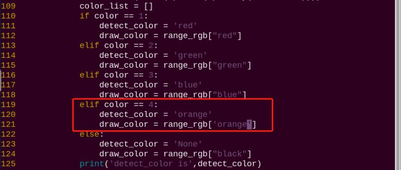 

 

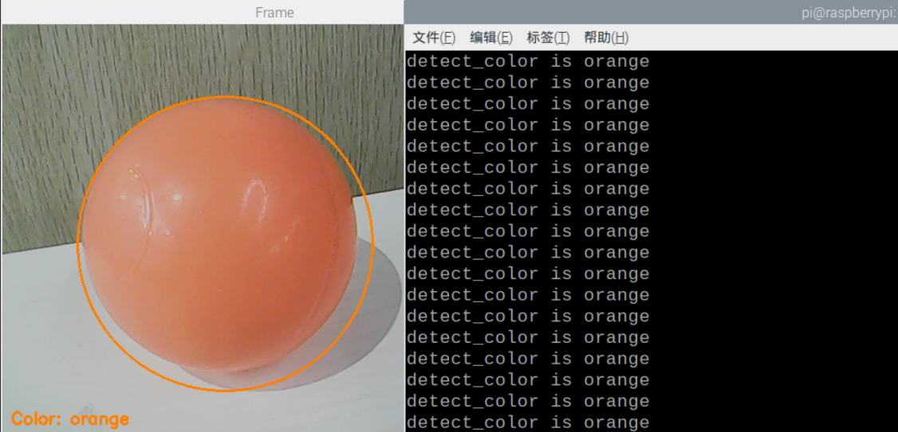

(8) After saving the changes, restart the program. Place an orange object in front of the camera. If configured correctly, the object will be detected as orange in the live feed, and the terminal will output:


## 7.3 Colored Block Positioning

### 7.3.1 Program Logic

Firstly, program to recognize color. Use Lab color space to convert the image from RGB into Lab.

Then, perform binarization, corrosion, dilation, etc., on the image to obtain the maximum contour which contains the target color.

Lastly, display the recognition result on the camera returned image and terminal interface.

### 7.3.2 Operation Steps

:::{Note} 

The input command should be case sensitive. And the key words can be complemented by **"Tab"** key.

:::

(1) Turn on PuppyPi, and then connect to Raspberry Pi desktop through VNC.

(2) Click  to open command line terminal

(3) Input the following command and press Enter to start the game.

```
rosrun puppy_standard_functions color_tracking_demo.py
```

(4) If want to close this game, we can press **"Ctrl+C"**. If it fails to close the game, please try again.

### 7.3.3 Program Outcome

After the game starts, place the red block within the camera frame. When the colored block is recognized, the block will be marked with red circle and its coordinate will be printed on the terminal.

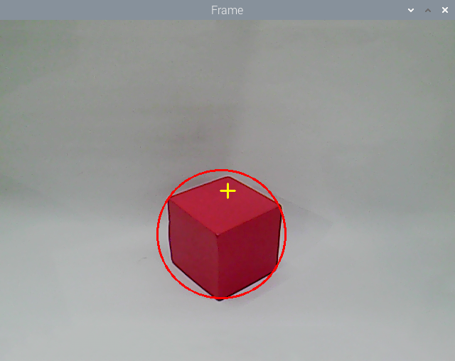 


### 7.3.4 Program Analysis

[Source Code](../_static/source_code/ros1/puppy_standard_functions_scripts.zip)

The source code for this program is located in the Docker container at: [/home/ubuntu/puppypi/src/puppy_standard_functions/scripts/color_tracking_demo.py](../_static/source_code/ros1/puppy_standard_functions_scripts.zip)

- **Image Processing**

(1) Binarization Processing

Adopt `inRange()` function in cv2 library to perform binarization on the image.

{lineno-start=158}

```python
        frame_mask = cv2.inRange(frame_lab, tuple(target_color_range['min']), tuple(target_color_range['max']))  # 对原图像和掩模进行位运算(perform bitwise operation to original image and mask)
```

The first parameter in the bracket is the input image. The second and the third parameters respectively are the lower limit and upper limit of the threshold. When the RGB value of the pixel is between the upper limit and lower limit, the pixel is assigned 1, otherwise, 0.

(2) Corrosion and Dilation

To reduce the interference and make the image smoother, it is necessary to perform corrosion and dilation on the image.

{lineno-start=159}

```python
        eroded = cv2.erode(frame_mask, cv2.getStructuringElement(cv2.MORPH_RECT, (3, 3)))  # 腐蚀(corrosion)
        dilated = cv2.dilate(eroded, cv2.getStructuringElement(cv2.MORPH_RECT, (3, 3)))  # 膨胀(dilation)
```

`erode()` function is used for corrosion. Take `eroded = cv2.erode(frame_mask, cv2.getStructuringElement(cv2.MORPH_RECT, (3, 3)))` for example. The meaning of the parameters in bracket are as follows.

The first parameter `frame_mask` is the input image.

The second parameter `cv2.getStructuringElement(cv2.MORPH_RECT, (3, 3))` is the structural element and kernel deciding the nature of the operation. And the first parameter in the parenthesis is the kernel shape and the second parameter is the kernel dimension.

`dilate()` function is used for image dilation. And the meaning of the parameters in parenthesis is the same as that of `erode()` function.

(3) Acquire the Maximum Contour

① After processing the image, acquire the contour of the target to be recognized, which involves `findContours()` function in cv2 library.

{lineno-start=161}

```python
        contours = cv2.findContours(dilated, cv2.RETR_EXTERNAL, cv2.CHAIN_APPROX_NONE)[-2]  # 找出轮廓(find out the contour)
```

The first parameter in parentheses is the input image; the second parameter is the retrieval mode of the contour; the third parameter is the approximation method of the contour.

② Find the contour of the maximum area among the obtained contours. To avoid interference, please set a minimum value. Only when the area is larger than this value, the target contour is valid.

{lineno-start=162}

```python
        area_max_contour, area_max = getAreaMaxContour(contours)  # 找出最大轮廓(find out the contour with the maximal area)
```

- **Feedback Information**

(1) Coordinate Feedback

Call `print()` function to print the coordinate of the colored block on the camera returned image.

{lineno-start=171}

```python
        print('center_x = %d ,center_y=%d'%(int(center_x), int(center_y)))
```

(2) Block Marking

Use `circle()` function in cv2 library to circle the colored block in corresponding color

{lineno-start=172}

```python
        cv2.circle(img, (int(center_x), int(center_y)), int(radius), range_rgb[__target_color], 2)
```

The meaning of the parameters in the bracket is as follows.

The first parameter `img` is the input image

The second parameter `(int(center_x), int(center_y))` is the center coordinate

The third parameter `int(radius)` is the radius of the circle

The fourth parameter `range_rgb[__target_color]` is the color of the circle

The fifth parameter `2` is thickness of the circle.

## 7.4 Color Tracking

### 7.4.1 Program Logic

Firstly, program to recognize color. Use Lab color space to convert the image from RGB into Lab.

Then, perform binarization, corrosion, dilation, etc., on the image to obtain the maximum contour which contains the target color.

Next, acquire X-axis and Y-axis coordinates of the center of target contour. And adjust PuppyPi's pitch angle and roll angle according to the coordinate.

Lastly, obtain the rotation angle of the servo through inverse kinematics calculation, and program the servo to rotate to the designated angle.

### 7.4.2 Operation Steps

:::{Note} 

The input command should be case sensitive. And the key words can be complemented by **"Tab"** key. 

:::

(1) Turn on PuppyPi, and then connect to Raspberry Pi desktop through VNC.

(2) Click  to open command line terminal

(3) Input the following command and press Enter to start the game.

```
rosrun puppy_standard_functions color_tracking_demo.py --model 1
```

(4) If want to close this game, we can press **"Ctrl+C"**. If it fails to close the game, please try again.

### 7.4.3 Program Outcome

After the game starts, place the red block within the camera frame. When recognizing the object, PuppyPi will adjust its posture according to the position of the object. Besides, the block will be marked with red circle on the camera returned image and its coordinate will be printed on the terminal.


### 7.4.4 Program Analysis

[Source Code](../_static/source_code/ros1/puppy_standard_functions_scripts.zip)

The source code for this program is located inside the Docker container at: [/home/ubuntu/puppypi/src/puppy_standard_functions/scripts/color_tracking_demo.py](../_static/source_code/ros1/puppy_standard_functions_scripts.zip)

- **Image Processing**

(1) Binarization Processing

Adopt `inRange()` function in cv2 library to perform binarization on the image.

{lineno-start=158}

```python
        frame_mask = cv2.inRange(frame_lab, tuple(target_color_range['min']), tuple(target_color_range['max']))  # 对原图像和掩模进行位运算(perform bitwise operation to original image and mask)
```

The first parameter in the bracket is the input image. The second and the third parameters respectively are the lower limit and upper limit of the threshold. When the RGB value of the pixel is between the upper limit and lower limit, the pixel is assigned 1, otherwise, 0.

(2) Corrosion and Dilation

To reduce the interference and make the image smoother, it is necessary to perform corrosion and dilation on the image.

{lineno-start=159}

```python
        eroded = cv2.erode(frame_mask, cv2.getStructuringElement(cv2.MORPH_RECT, (3, 3)))  # 腐蚀(corrosion)
        dilated = cv2.dilate(eroded, cv2.getStructuringElement(cv2.MORPH_RECT, (3, 3)))  # 膨胀(dilation)
```

`erode()` function is used for corrosion. Take `eroded = cv2.erode(frame_mask, cv2.getStructuringElement(cv2.MORPH_RECT, (3, 3)))` for example. The meaning of the parameters in bracket are as follows.

The first parameter `frame_mask` is the input image.

The second parameter `cv2.getStructuringElement(cv2.MORPH_RECT, (3, 3))` is the structural element and kernel deciding the nature of the operation. And the first parameter in the parenthesis is the kernel shape and the second parameter is the kernel dimension.

`dilate()` function is used for image dilation. And the meaning of the parameters in parenthesis is the same as that of `erode()` function

(3) Acquire the Maximum Contour

① After processing the image, acquire the contour of the target to be recognized, which involves `findContours()` function in cv2 library.

{lineno-start=161}

```python
        contours = cv2.findContours(dilated, cv2.RETR_EXTERNAL, cv2.CHAIN_APPROX_NONE)[-2]  # 找出轮廓(find out the contour)
```

The first parameter in parentheses is the input image; the second parameter is the retrieval mode of the contour; the third parameter is the approximation method of the contour.

② Find the contour of the maximum area among the obtained contours. To avoid interference, please set a minimum value. Only when the area is larger than this value, the target contour is valid.

{lineno-start=162}

```python
        area_max_contour, area_max = getAreaMaxContour(contours)  # 找出最大轮廓(find out the contour with the maximal area)
```

- **Feedback Information**

(1) Coordinate Feedback

Call `print()` function to print the coordinate of the colored block on the camera returned image.

{lineno-start=171}

```python
        print('center_x = %d ,center_y=%d'%(int(center_x), int(center_y)))
```

(2) Block Marking

Use `circle()` function in cv2 library to circle the colored block in corresponding color

{lineno-start=172}

```python
        cv2.circle(img, (int(center_x), int(center_y)), int(radius), range_rgb[__target_color], 2)
```

The meaning of the parameters in the bracket is as follows.

The first parameter `img` is the input image

The second parameter `(int(center_x), int(center_y))` is the center coordinate

The third parameter `int(radius)` is the radius of the circle

The fourth parameter `range_rgb[__target_color]` is the color of the circle

The fifth parameter `2` is thickness of the circle.

- **Action Feedback**

(1) Set Specific Point

Set the center of the camera returned image as the specific point. Then based on the position relation between the center of the target object and the specific point, determine PuppyPi to execute which action.

{lineno-start=147}

```python
    cv2.line(img, (int(img_w / 2 - 10), int(img_h / 2)), (int(img_w / 2 + 10), int(img_h / 2)), (0, 255, 255), 2)
    cv2.line(img, (int(img_w / 2), int(img_h / 2 - 10)), (int(img_w / 2), int(img_h / 2 + 10)), (0, 255, 255), 2)
```

(2) Adjust Roll Angle

Adjust PuppyPi's Roll angle according to whether the target center is at left or right of the camera returned image center.

{lineno-start=175}

```python
            x_pid.Kp = 0.003
            x_pid.Ki = 0.00
            x_pid.Kd = 0.00
            x_pid.SetPoint = img_w / 2.0  # 设定(set)
            if abs(x_pid.SetPoint - center_x) > 230:
                x_pid.Kp = 0.004

            x_pid.update(center_x)

            x_dis = x_pid.output

            x_dis = np.radians(30) if x_dis > np.radians(30) else x_dis
            x_dis = np.radians(-30) if x_dis < np.radians(-30) else x_dis
            PuppyPose['roll'] = x_dis
```

(3) Adjust Pitch Angle

Adjust PuppyPi's Pitch angle according to whether the target center is below or above the camera returned image center.

{lineno-start=200}

```python
            z_pid.Kp = 0.0015
            z_pid.Ki = 0.0000
            z_pid.Kd = 0.0000
            z_pid.SetPoint = img_h / 2.0

            if abs(z_pid.SetPoint - center_y) > 180:
                z_pid.Kp = 0.002
            z_pid.update(center_y)
            z_dis = z_pid.output

            z_dis = np.radians(30) if z_dis > np.radians(30) else z_dis
            z_dis = np.radians(-20) if z_dis < np.radians(-20) else z_dis

            PuppyPose['pitch'] = z_dis
            print("z_dis:",z_dis)
            PuppyPosePub.publish(stance_x=PuppyPose['stance_x'], stance_y=PuppyPose['stance_y'], x_shift=PuppyPose['x_shift']
            ,height=PuppyPose['height'], roll=PuppyPose['roll'], pitch=PuppyPose['pitch'], yaw=PuppyPose['yaw'])
```

<p id="anchor_7_4_5"></p>

### 7.4.5 Function Extension

- **Modify Default Recognition Color**

There are three built-in colors, including red, green and blue. The default recognized color is red.

Take modifying the default recognition color as green for example. The specific operation steps are as follows.

(1) Click 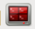 to open command line terminal

(2) Input the following command and press Enter to open program file.

```
rosed puppy_standard_functions color_tracking_demo.py
```

(3) Then, jump to this line of code.

:::{Note} 

We can input the line number and press **"Shift+G"** to jump to the corresponding line. 

:::

(4) Press **"i"** to enter the editing mode. Modify the code as **msg.data = 'green'**.

(5) After modification, Press **"Esc"** and input **":wq"** and then press Enter to save the file and exit the editor.

(6) Input the following command to restart the game. Then PuppyPi will recognize green.

```
rosrun puppy_standard_functions color_tracking_demo.py
```

- **Add New Recognition Color**

In addition to the built-in recognized colors, you can add other recognition colors in the program. Take adding yellow as example.

(1) Double click the 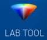 in the system desktop to open color threshold adjustment tool. If the prompt box pops up, just click **"Execute"**.


(2) Next, click **"Add"** button.

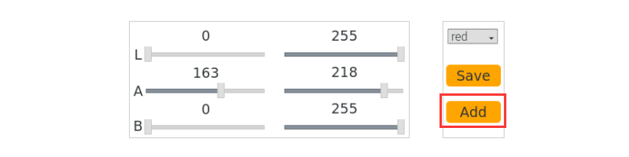

(3) Then enter **"yellow"** in the pop-up interface.

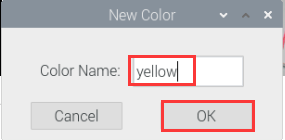

(4) Select **"yellow"** in the drop-down menu.

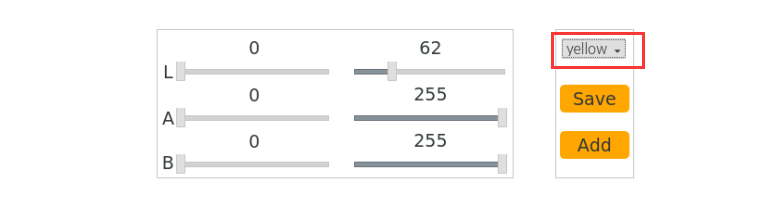

(5) Place the yellow object within the camera frame. Then Drag the sliders of L, A, and B until the yellow block at the left screen becomes white and other areas become black.


(6) After adjustment, click **"Save"** to keep the data. Then we can close the tool.


(7) Click  to open command line terminal

(8) Check whether the modified data was successfully written in. Input the following command and press Enter to open Lab color setting file.

```
rosed lab_config lab_config.yaml
```


(9) According to the steps in [**"7.4.5 Modify Default Recognition Color"**](#anchor_7_4_5), modify the default recognition color as yellow.

(10) Input the following command and press Enter to restart the game. The PuppyPi will recognize yellow.

```
rosrun puppy_standard_functions color_tracking_demo.py
```

## 7.5 Tag Recognition

### 7.5.1 Program Logic

Firstly, program to recognize tag, which involves image graying, positioning and other operations.

Lastly, encode and decode the tag, and display the recognition result on the camera returned image and terminal interface.

### 7.5.2 Operation Steps

:::{Note} 

The input command should be case sensitive. And the key words can be complemented by **"Tab"** key. 

:::

(1) Turn on PuppyPi, and then connect to Raspberry Pi desktop through VNC.

(2) Click  to open command line terminal.

(3) Input the following command and press Enter to start tag recognition.

```
rosrun puppy_standard_functions apriltag_detect_demo.py
```

(4) If want to close this game, we can press **"Ctrl+C"**. If it fails to close the game, please try again.

### 7.5.3 Program Outcome

After the game starts, place the tag card within the camera frame. When recognizing the tag, Tag ID will be printed on the camera returned image. And tag ID and coordinate will also be printed on the terminal.

 


### 7.5.4 Program Analysis

[Source Code](../_static/source_code/ros1/puppy_standard_functions_scripts.zip)

The source code of this program is stored in the Docker container: [/home/ubuntu/puppypi/src/puppy_standard_functions/scripts/apriltag_detect_demo.py](../_static/source_code/ros1/puppy_standard_functions_scripts.zip)

- **Tag Detection**

(1) Image Graying

Call `cvtColor()` function in cv2 library to convert the collected colored image into grayscale image and collect the tag information.

{lineno-start=37}

```python
    gray = cv2.cvtColor(img, cv2.COLOR_RGB2GRAY)
```

(2) Extract Tag Information

After collecting the tag information, extract the useful information.

{lineno-start=38}

```python
    detections = detector.detect(gray, return_image=False)
    if len(detections) != 0:
        for detection in detections:
            M,e0,e1 = detector.detection_pose(detection,[camera_intrinsic.item(0,0), camera_intrinsic.item(1,1),
                                                                camera_intrinsic.item(0,2), camera_intrinsic.item(1,2)],
                                                                0.033)
                    
            P = M[:3,:4]
            coordinate=np.matmul(P,np.array([[0],[0],[0],[1]])).flatten()
            print('coordinate =',coordinate)
```

{lineno-start=49}

```python
            corners = np.rint(detection.corners)  # 获取四个角点(get for corners)
            cv2.drawContours(img, [np.array(corners, int)], -1, (0, 255, 255), 5, cv2.LINE_AA)
            tag_family = str(detection.tag_family, encoding='utf-8')  # 获取tag_family(get tag_family)
            times = 0
            if tag_family == 'tag36h11':
                tag_id = str(detection.tag_id)  # 获取tag_id(get tag_id)
                print('tag_id =',tag_id)
```

`coordinate` represents the tag coordinate, `tag_family` refers to the type of tag, and `tag_id` indicates tag ID.

(3) Feedback Information

① After recognition, call `print()` function to print the tag coordinate and ID on the terminal.

{lineno-start=47}

```python
            print('coordinate =',coordinate)
```

{lineno-start=55}

```python
                print('tag_id =',tag_id)
```

② Then, call `putText()` function in cv2 library to print tag ID on the camera returned image.

{lineno-start=73}

```python
    cv2.putText(img, tag_id, (10, img.shape[0] - 20), cv2.FONT_HERSHEY_SIMPLEX, 2, (0, 255, 255), 3)
```

The meaning of the parameters in bracket is as follows.

The first parameter `img` is the input image.

The second parameter `tag_id` is the added text, referring to tag ID.

The third parameter `(10, img.shape[0] - 20)` is the coordinate of upper left corner of the added text.

The fourth parameter `cv2.FONT_HERSHEY_SIMPLEX` is the font type.

The fifth parameter `2` is the font size.

The sixth parameter `(0, 255, 255)` is the color of the font, and the values respectively corresponds to B, G, R. The color here is yellow.

The seventh parameter `3` is the font weight.

## 7.6 Tag Positioning

### 7.6.1 Program Logic

Firstly, program to recognize tag, which involves image graying, positioning and other operations.

Lastly, encode and decode the tag, and display the recognition result on the camera returned image and terminal interface.

### 7.6.2 Operation Steps

:::{Note} 

The input command should be case sensitive. And the key words can be complemented by **"Tab"** key. 

:::

(1) Turn on PuppyPi, and then connect to Raspberry Pi desktop through VNC.

(2) Click  to open command line terminal.


(3) Input the following command and press Enter to start the game.

```
rosrun puppy_standard_functions apriltag_tracking_demo.py
```

(4) If want to close this game, we can press **"Ctrl+C"**. If it fails to close the game, please try again.

### 7.6.3 Program Outcome

After the game starts, place the tag card within the camera frame. When recognizing the tag, Tag ID will be printed on the camera returned image.

 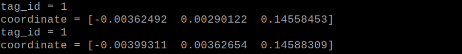

### 7.6.4 Program Analysis

[Source Code](../_static/source_code/ros1/puppy_standard_functions_scripts.zip)

The source code of this program is stored in the Docker container: [/home/ubuntu/puppypi/src/puppy_standard_functions/scripts/apriltag_tracking_demo.py](../_static/source_code/ros1/puppy_standard_functions_scripts.zip)

- **Tag Detection**

(1) Image Graying

Call `cvtColor()` function in cv2 library to convert the collected colored image into grayscale image and collect the tag information.

{lineno-start=102}

```python
    gray = cv2.cvtColor(img, cv2.COLOR_RGB2GRAY)
```

(2) Extract Tag Information

After collecting the tag information, extract the useful information.

{lineno-start=103}

```python
    detections = detector.detect(gray, return_image=False)
    if len(detections) != 0:
        for detection in detections:
            M,e0,e1 = detector.detection_pose(detection,[camera_intrinsic.item(0,0), camera_intrinsic.item(1,1),
                                                                camera_intrinsic.item(0,2), camera_intrinsic.item(1,2)],
                                                                0.033)
                    
            P = M[:3,:4]
            coordinate=np.matmul(P,np.array([[0],[0],[0],[1]])).flatten()
            print('coordinate = ',coordinate)
```

{lineno-start=116}

```python
            tag_family = str(detection.tag_family, encoding='utf-8')  # 获取tag_family(get tag_family)
            times = 0
            if tag_family == 'tag36h11':
                tag_id = str(detection.tag_id)  # 获取tag_id(get tag_id)
                return tag_id
```

`coordinate` represents the tag coordinate, `tag_family` refers to the type of tag, and `tag_id` indicates tag ID.

(3) Feedback Information

Call `putText()` function in cv2 library to print the tag ID on the camera returned image.

{lineno-start=140}

```python
    cv2.putText(img, tag_id, (10, img.shape[0] - 20), cv2.FONT_HERSHEY_SIMPLEX, 2, (0, 255, 255), 3)
```

The meaning of the parameters in bracket is as follows.

The first parameter `img` is the input image.

The second parameter `tag_id` is the added text, referring to tag ID.

The third parameter `(10, img.shape[0] - 20)` is the coordinate of upper left corner of the added text.

The fourth parameter `cv2.FONT_HERSHEY_SIMPLEX` is the font type.

The fifth parameter `2` is the font size.

The sixth parameter `(0, 255, 255)` is the color of the font, and the values respectively corresponds to B, G, R. The color here is yellow.

The seventh parameter `3` is the font weight.

## 7.7 Tag Tracking

### 7.7.1 Program Logic

AprilTag is a visual positioning marker, which is similar to QR code or bar code. It can facilitate the tag detection and relative position calculation. It's mainly applied to AR, robot and camera calibration, etc.

The process of tag tracking is as follows.

Firstly, program to recognize tag, which involves image graying, positioning and other operations.

Next, encode and decode the tag, and display the recognition result on the camera returned image and terminal interface.

Then, according to the distance between the tag and the camera, control PuppyPi to move with the tag so as to realize tag tracking.

### 7.7.2 Operation Steps

:::{Note} 

The input command should be case sensitive. And the key words can be complemented by **"Tab"** key. 

:::

(1) Turn on PuppyPi, and then connect to Raspberry Pi desktop through VNC.

(2) Click  to open command line terminal.

(3) Input the following command and press Enter to start the game.

```
rosrun puppy_standard_functions apriltag_tracking_demo.py --model 1
```

(4) If want to close this game, we can press **"Ctrl+C"**. If it fails to close the game, please try again.

### 7.7.3 Program Outcome

After the game starts, place the tag card within the camera frame. When recognizing the tag, Tag ID will be printed on the camera returned image. If we move the tag, PuppyPi will move forward or backward.


### 7.7.4 Program Analysis

[Source Code](../_static/source_code/ros1/puppy_standard_functions_scripts.zip)

The source code of this program is stored in the Docker container: [/home/ubuntu/puppypi/src/puppy_standard_functions/scripts/apriltag_tracking_demo.py](../_static/source_code/ros1/puppy_standard_functions_scripts.zip)

- **Tag Detection**

(1) Image Graying

Call `cvtColor()` function in cv2 library to convert the collected colored image into grayscale image and collect the tag information.

{lineno-start=102}

```python
    gray = cv2.cvtColor(img, cv2.COLOR_RGB2GRAY)
```

(2) Extract Tag Information

After collecting the tag information, extract the useful information.

{lineno-start=103}

```python
    detections = detector.detect(gray, return_image=False)
    if len(detections) != 0:
        for detection in detections:
            M,e0,e1 = detector.detection_pose(detection,[camera_intrinsic.item(0,0), camera_intrinsic.item(1,1),
                                                                camera_intrinsic.item(0,2), camera_intrinsic.item(1,2)],
                                                                0.033)
                    
            P = M[:3,:4]
            coordinate=np.matmul(P,np.array([[0],[0],[0],[1]])).flatten()
            print('coordinate = ',coordinate)
```

{lineno-start=116}

```python
            tag_family = str(detection.tag_family, encoding='utf-8')  # 获取tag_family(get tag_family)
            times = 0
            if tag_family == 'tag36h11':
                tag_id = str(detection.tag_id)  # 获取tag_id(get tag_id)
                return tag_id
```

`coordinate` represents the tag coordinate, `tag_family` refers to the type of tag, and `tag_id` indicates tag ID.

(3) Feedback Information

Call `putText()` function in cv2 library to print the tag ID on the camera returned image.

{lineno-start=140}

```python
    cv2.putText(img, tag_id, (10, img.shape[0] - 20), cv2.FONT_HERSHEY_SIMPLEX, 2, (0, 255, 255), 3)
```

The meaning of the parameters in bracket is as follows.

The first parameter `img` is the input image.

The second parameter `tag_id` is the added text, referring to tag ID.

The third parameter `(10, img.shape[0] - 20)` is the coordinate of upper left corner of the added text.

The fourth parameter `cv2.FONT_HERSHEY_SIMPLEX` is the font type.

The fifth parameter `2` is the font size.

The sixth parameter `(0, 255, 255)` is the color of the font, and the values respectively corresponds to B, G, R. The color here is yellow.

The seventh parameter `3` is the font weight.

(4) Action Feedback

The program controls PuppyPi's movement through publishing topic.

{lineno-start=79}

```python
            if coordinate is None:
                PuppyVelocityPub.publish(x=0, y=0, yaw_rate=0)
                rospy.sleep(0.01)    
            else:
                if coordinate[2] > 0.22:
                    PuppyVelocityPub.publish(x=5, y=0, yaw_rate=0)
                elif coordinate[2] < 0.18:
                    PuppyVelocityPub.publish(x=-5, y=0, yaw_rate=0)
                else:
                    PuppyVelocityPub.publish(x=0, y=0, yaw_rate=0)
```

The meaning of the parameters of `PuppyVelocityPub.publish()` is as follows.

The first parameter is used to control PuppyPi to move straight. Moving forward is taken as the positive direction and Its unit is cm/s. When it is `0`, PuppyPi will stay still. When it is positive, PuppyPi will move forward. When it is negative, PuppyPi will move backward. The greater the absolute value of the parameter, the larger the stride PuppyPi takes.

The second parameter is used to control PuppyPi to walk sideways. Its unit is cm/s. As PuppyPi cannot walk sideways, this parameter is without actual function.

The third parameter is used to control PuppyPi to turn. The counterclockwise direction is taken as the positive direction, and the unit is rad/s. When the value is `0`, PuppyPi will move straight. When the value is positive, PuppyPi will keep turning left as moving. When the value is negative, PuppyPi will keep turning right as moving. The greater the absolute value of the parameter, the greater PuppyPi turns.

① When not recognizing the tag, PuppyPi will not take action.

{lineno-start=79}

```python
            if coordinate is None:
                PuppyVelocityPub.publish(x=0, y=0, yaw_rate=0)
```

② When the distance between the tag and camera is greater than the set threshold, PuppyPi will move forward in 5cm/s.

{lineno-start=83}

```python
                if coordinate[2] > 0.22:
                    PuppyVelocityPub.publish(x=5, y=0, yaw_rate=0)
```

③ When the distance between the tag and camera is smaller than the set threshold, PuppyPi will move backward in 5cm/s.

{lineno-start=85}

```python
                elif coordinate[2] < 0.18:
                    PuppyVelocityPub.publish(x=-5, y=0, yaw_rate=0)
```

### 7.7.5 Function Extension

- **Modify Default**

The distance threshold has been set in the program, which is used to decide PuppyPi perform which action for feedback.

When the distance between the camera and tag is greater than 0.22m, PuppyPi will moves forward. When it is smaller than 0.18m, PuppyPi will move backward continuously until the distance is greater than or equal to 0.18m.

The distance threshold can be modified. For example, we program PuppyPi to move forward when the distance between the camera and tag is greater than 0.20m.

(1) Click  to open command line terminal.

(2) Input the following command and press Enter to open the program file.

```
rosed puppy_standard_functions apriltag_tracking_demo.py
```

(3) Then jump to this line of code.

:::{Note} We can input the line number and press **"Shift+G"** to jump to the corresponding line. :::

(4) Press **"i"** key to enter the editing mode, and then modify the code as `coordinate[2] > 0.20`.

(5) After modification, press **"Esc"** and input **":wq"** and press Enter to save and exit the editing.

(6) Input command `rosrun puppy_standard_functions apriltag_tracking_demo.py` and press Enter to restart the game to check the PuppyPi's performance.

- **Change the Default Moving Speed**

Both the default speed of moving forward and backward in the program have been set as 5cm/s. And we can modify the value. For example, modify the speed of moving forward as 3cm/s.

(1) Click  to open command line terminal.

(2) Input the following command and press Enter to open the program file.

```
rosed puppy_standard_functions apriltag_tracking_demo.py
```

(3) Then jump to this line of code.

:::{Note} 

We can input the line number and press **"Shift+G"** to jump to the corresponding line. 

:::

(4) Press **"i"** key to enter the editing mode, and then modify the code as `PuppyVelocityPub.publish(x=3, y=0, yaw_rate=0)`.

(5) After modification, press **"Esc"** and input **":wq"** and press Enter to save and exit the editing.

(6) Input command and press Enter to restart the game to check the PuppyPi's performance.

```
rosrun puppy_standard_functions apriltag_tracking_demo.py
```

## 7.8 AR Vision

### 7.8.1 Program Logic

Firstly, program to recognize tag, which involves image graying, positioning and other operations.

Next, encode and decode the tag to acquire information of the tag.

Lastly, through model projection, polygon fill and other operations, draw 3D image on the designated area of camera returned image, and print Tag information on the camera returned image and terminal interface.

### 7.8.2 Operation Steps

:::{Note} 

The input command should be case sensitive. And the key words can be complemented by **"Tab"** key. 

:::

(1) Turn on PuppyPi, and then connect to Raspberry Pi desktop through VNC.

(2) Click  to open command line terminal.

(3) Input the following command and press Enter to start AR vision.

```
rosrun puppy_standard_functions apriltag_AR_demo.py
```

(4) If want to close this game, we can press **"Ctrl+C"**. If it fails to close the game, please try again.

### 7.8.3 Program Outcome

After the game starts, place the tag card within the camera frame. When the tag is recognized, four corners of the tag will be marked by blue dots, and the 3D image will be displayed on the tag. Besides, the tag ID and coordinate will be printed on the terminal.

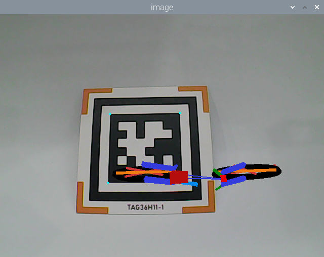 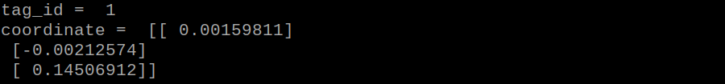

### 7.8.4 Program Analysis

[Source Code](../_static/source_code/ros1/puppy_standard_functions_scripts.zip)

The source code of this program is stored in [/home/ubuntu/puppypi/src/puppy_standard_functions/scripts/apriltag_AR_demo.py](../_static/source_code/ros1/puppy_standard_functions_scripts.zip)

- **Tag Detection**

(1) Image Graying

Call `cvtColor()` function in cv2 library to convert the collected colored image into grayscale image and collect the tag information.

{lineno-start=163}

```python
            gray = cv2.cvtColor(rgb_image, cv2.COLOR_RGB2GRAY)
```

(2) Extract Tag Information

After collecting the tag information, extract the useful information.

{lineno-start=164}

```python
            detections = self.tag_detector.detect(gray)
            if detections != ():
                
                for detection in detections:
                    M,e0,e1 = self.tag_detector.detection_pose(detection,[self.camera_intrinsic.item(0,0), self.camera_intrinsic.item(1,1),
                                                                self.camera_intrinsic.item(0,2), self.camera_intrinsic.item(1,2)],
                                                                0.033)
                    
                    P = M[:3,:4]
                    coordinate=np.matmul(P,np.array([[0],[0],[0],[1]]))
                    print('coordinate = ',coordinate)
```

{lineno-start=176}

```python
                    tag_id = detection.tag_id
                    tag_center = detection.center
                    tag_corners = detection.corners

                    print('tag_id = ',tag_id)
```

`coordinate` represents the tag coordinate, `tag_family` refers to the type of tag, and `tag_id` indicates tag ID.

- **3D Image Drawing**

(1) Relative Pose Calculation

Firstly, acquire the pose of the camera relative to the world coordinate system, that is the rotation vector and translation vector from the world coordinate system to the camera coordinate system. `solvePnP()` function in cv2 library will be called.

{lineno-start=192}

```python
                    ret, rvecs, tvecs = cv2.solvePnP(OBJP, corners, self.camera_intrinsic, self.dist_coeffs)
```

The meaning of the parameters in bracket is as follows.

The first parameter `OBJP` is the intrinsic matrix of the camera.

The second parameter `corners` is the distortion parameter of the camera.

The third parameter `self.camera_intrinsic` is the 3D coordinate in mm under world coordinate system.

The fourth parameter `self.dist_coeffs` is the 2D coordinate in pixel under camera coordinate system

(2) Model Projection

After the pose of the camera relative to the world coordinate system is required, call `projectPoints()` function in cv2 library to convert the 3D coordinate under world coordinate system into 2D coordinate under pixel coordinate system

{lineno-start=194}

```python
                        imgpts, jac = cv2.projectPoints(AXIS, rvecs, tvecs, self.camera_intrinsic, self.dist_coeffs)
```

(3) Image Drawing

The program is default to draw 3D bicycle.

{lineno-start=212}

```python
    ar_app_node.set_model_srv_callback('bicycle')
```

And other 3D models are available, including cow, fox, rat, wolf, pirate-ship-fat and rectangle.

① Color the rectangle through calling `drawContours()` and `line()` function in cv2 library.

{lineno-start=51}

```python
    cv2.drawContours(img, [imgpts[:4]],-1,(0, 255, 0),-3)
    for i,j in zip(range(4),range(4,8)):
        cv2.line(img, tuple(imgpts[i]), tuple(imgpts[j]),(255),3)
    cv2.drawContours(img, [imgpts[4:]],-1,(0, 0, 255),3)
```

{lineno-start=194}

```python
                        imgpts, jac = cv2.projectPoints(AXIS, rvecs, tvecs, self.camera_intrinsic, self.dist_coeffs)
                        result_image = draw(result_image, corners, imgpts)
```

② Call `fillConvexPoly()` function to color other patterns.

{lineno-start=197}

```python
                         for points, color in self.obj:
                             dst, jac = cv2.projectPoints(points.reshape(-1, 1, 3)/100.0, rvecs, tvecs, self.camera_intrinsic, self.dist_coeffs)
                             imgpts = dst.astype(int)
                             # 手动上色(manually apply color)
                             if self.target_model == 'cow':
                                 cv2.fillConvexPoly(result_image, imgpts, (0, 255, 255))
                             elif self.target_model == 'wolf':
                                 cv2.fillConvexPoly(result_image, imgpts, (255, 255, 0))
                             else:
                                 cv2.fillConvexPoly(result_image, imgpts, color)
```

Take `cv2.fillConvexPoly(result_image, imgpts, (255, 255, 0)` for example. The meaning of the parameters in bracket is as follows.

The first parameter `result_image` is the input image.

The second parameter `imgpts` is the vertex of the polygon.

The third parameter `(255, 255, 0)` is the filled color. The values respectively corresponds to R, G and B, and refers to yellow.

- **Feedback Information**

(1) Image Output

Call `imshow()` function in cv2 library to display the image on camera returned image.

{lineno-start=158}

```python
        cv2.imshow('image', cv2.cvtColor(result_image, cv2.COLOR_RGB2BGR))
```

The meaning of the parameters in bracket is as follows.

The first parameter `image` is the window name and the data type is string.

The second parameter `frame_result` is the input image.

(2) print Tag Information

Call `print()` function to print tag coordinate and ID on the terminal.

{lineno-start=174}

```python
                    print('coordinate = ',coordinate)
```

{lineno-start=180}

```python
                    print('tag_id = ',tag_id)
```

### 7.8.5 Function Extension

- **Change Default Displayed Image**

The program is default to display 3D bicycle. And other 3D models are available, including cow, fox, rat, wolf, pirate-ship-fat and rectangle.

For example, we can modify the program to display 3D cow. We need to take 6 steps to realize this.

(1) Click 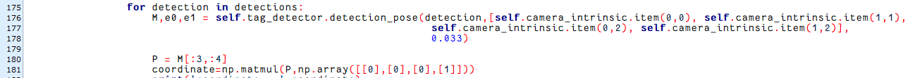 at upper left corner to open command line terminal.

(2) Input the following command and press Enter to open the program file.

```
rosed puppy_standard_functions apriltag_AR_demo.py
```

(3) Please jump to this line of code.

:::{Note} 

Input the line number and press **"Shift+G"** to jump to the corresponding line.

:::

(4) Press **"i"** key to enter editing mode and modify the code as `ar_app_node.set_model_srv_callback('cow')`.

(5) After modification, press **"Esc"**, input **":wq"** and press Enter to save and exit the editing.

(6) Input the following command to restart the game, and then the 3D cow image will be displayed on the camera returned image.

```
rosrun puppy_standard_functions apriltag_AR_demo.py
```