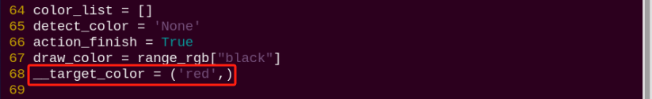
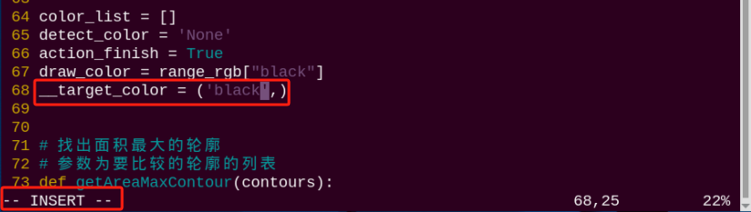

# 8. ROS1-AI Stair Recognition and Negotiating Course

## 8.1 Stair Recognition

### 8.1.1 Program Logic

Before the game, we need to DIY a stair. We can use 20mm height items as stair, such as board and sturdy box. And paste the red electrical tape on the border, because PuppyPi recognize the stair through recognizing the color.

Stair recognition process is as follow.

Firstly, program to recognize the color of line. Use Lab color space to convert the image from RGB into Lab. Then, perform binaryzation, corrosion, dilation, etc., on the image to obtain the contour which contains the target color. Next, mark the contour with rectangle.

Then, acquire the diagonal point of the rectangle and draw the center of the line.
Lastly, display the information about the line center on the terminal.

### 8.1.2 Operation Steps

:::{Note}
The input command should be case and space sensitive. 
:::

(1) Turn on PuppyPi, and then connect to Raspberry Pi desktop through VNC.

(2)  Click  to open LX terminal.

(3) Input command and press Enter to start the game.

```bash
rosrun puppy_advanced_functions negotiate_stairs_demo.py
```

(4) If want to close this game, we can press "**Ctrl+C**". If it fails to close the game, please try again.

### 8.1.3 Program Outcome

:::{Note}
The program is default to detect red.
:::

Paste the red electrical tape on the boarder of the stair, and then place the stair in front of PuppyPi. After the game starts, PuppyPi will recognize the line. When recognized, it will be framed on the camera returned image and its center will be drawn.

### 8.1.4 Program Analysis

The source code of this program is stored in [/home/ubuntu/puppy_pi/src/puppy_advanced_functions/scripts/negotiate_stairs_demo.py](../_static/source_code/ros1/puppy_advanced_functions_scripts.zip)

* **Import Function Package**

```
import sys
import cv2
import time
import math
import threading
import numpy as np
from enum import Enum

from common import Misc

import rospy
from std_srvs.srv import *
from sensor_msgs.msg import Image
from object_tracking.srv import *
from puppy_control.msg import Velocity, Pose, Gait
from puppy_control.srv import SetRunActionName
```

Using import statements to import the required modules: math provides a range of mathematical functions and constants for related calculations; rospy is used for ROS communication. 

`from object_tracking.srv import *` imports services related to object tracking. 

`from puppy_control.msg import Velocity, Pose, Gait` imports services for controlling and transmitting the velocity, pose, and gait of the robot.

* **Image Processing**

(1) Gaussian Filtering

Before converting the image from RGB into Lab space, denoise the image and use `GaussianBlur()` function in cv2 library for Gaussian filtering.

```
frame_gb = cv2.GaussianBlur(frame_resize, (3, 3), 3)
```

The meaning of the parameters in bracket is as follow

The first parameter `frame_resize` is the input image

The second parameter `(3, 3)` is the size of Gaussian kernel

The third parameter `3`  is the allowable range of variation around the average in Gaussian filtering. The larger the value, the larger the allowable range of variation

(2)  Binaryzation Processing

Adopt inRange() function in cv2 library to perform binaryzation on the image.

```
 frame_mask = cv2.inRange(frame_lab,
                                 (color_range_list[detect_color]['min'][0],
                                  color_range_list[detect_color]['min'][1],
                                  color_range_list[detect_color]['min'][2]),
                                  (color_range_list[detect_color]['max'][0],
                                   color_range_list[detect_color]['max'][1],
                                   color_range_list[detect_color]['max'][2]))  #对原图像和掩模进行位运算(perform bitwise operation to original image and mask)
```

The first parameter in the bracket is the input image. The second and the third parameters respectively are the lower limit and upper limit of the threshold. When the RGB value of the pixel is between the upper limit and lower limit, the pixel is assigned 1, otherwise, 0.

(3) Open Operation and Close Operation

:::{Note}
To reduce interference and make the image smoother, it is necessary to process the image.
:::

```
opened = cv2.morphologyEx(frame_mask, cv2.MORPH_OPEN, np.ones((6, 6), np.uint8))  # 开运算(opening operation)
closed = cv2.morphologyEx(opened, cv2.MORPH_CLOSE, np.ones((6, 6), np.uint8))  # 闭运算(closing operation)
```

cv2.MORPH_OPEN refers to open operation where corrosion will be conducted first, then dilation. 

cv2.MORPH_CLOSE indicates close operation where dilation will be conducted first, then corrosion.

Take `opened = cv2.morphologyEx(frame_mask, cv2.MORPH_OPEN, np.ones((6, 6), np.uint8))` for example. The meaning of the parameters in bracket is as follow.

The first parameter `frame_mask` is the input image.

The second parameter `cv2.MORPH_OPEN` refers to processing method, open operation.

The third parameter `np.ones((6, 6), np.uint8)` is frame size.

(4) Acquire the Maximum Contour

After processing the image, acquire the contour of the target to be recognized, which involves `findContours()` function in cv2 library.

```
cnts = cv2.findContours(closed , cv2.RETR_EXTERNAL, cv2.CHAIN_APPROX_TC89_L1)[-2]#找出所有轮廓(find out all the contours)
```

The first parameter in parentheses is the input image; 

the second parameter is the retrieval mode of the contour; 

the third parameter is the approximation method of the contour.

Find the contour of the maximum area among the obtained contours. To avoid interference, please set a minimum value. Only when the area is greater than this value, the target contour is valid.

```
# 找出面积最大的轮廓(find out the contour with the maximal area)
# 参数为要比较的轮廓的列表(the parameter is the list of contour to be compared)
def getAreaMaxContour(contours):
    contour_area_temp = 0
    contour_area_max = 0
    area_max_contour = None

    for c in contours:  # 历遍所有轮廓(iterate through all contours)
        contour_area_temp = math.fabs(cv2.contourArea(c))  # 计算轮廓面积(calculate the contour area)
        if contour_area_temp > contour_area_max:
            contour_area_max = contour_area_temp
            if contour_area_temp >= 5:  # 只有在面积大于300时，最大面积的轮廓才是有效的，以过滤干扰(only when the area is greater than 50, the contour with the largest area is considered valid to filter out interference)
                area_max_contour = c
    return area_max_contour, contour_area_max  # 返回最大的轮廓(return the maximal contour)
```

* **Acquire the Position**

(1) Frame the Line

Call `drawContours()` function to set the rectangle pattern and frame the line.

```
cv2.drawContours(img, [box], -1, (0,0,255,255), 2)#画出四个点组成的矩形(draw a rectangle formed by the four points)
```

(2)  Draw the Center

Next, acquire the diagonal points of the rectangle, and draw the line center through `circle()` function.

```
centerX = rect[0][0]
centerY = rect[0][1]
centerX = int(Misc.map(centerX, 0, size[0], 0, img_w))
centerY = int(Misc.map(centerY, 0, size[1], 0, img_h))
for i in range(4):
    box[i, 1] = int(Misc.map(box[i, 1], 0, size[1], 0, img_h))
for i in range(4):                
    box[i, 0] = int(Misc.map(box[i, 0], 0, size[0], 0, img_w))
            
cv2.drawContours(img, [box], -1, (0,0,255,255), 2)#画出四个点组成的矩形(draw a rectangle formed by the four points)
target_centre_point = [centerX, centerY]      
cv2.circle(img, (int(centerX), int(centerY)), 5, (0,0,255), -1)#画出中心点(draw the center point)
```

## 8.2 Stair Negotiating

:::{Note}
if PuppyPi's performance is not desired, we can close debugging interface according to "[**8.2.5 Function Extension -> Close Debugging Interface**](#anchor_8_2_5)".
:::

### 8.2.1 Program Logic

Before the game, we need to DIY a stair. We can use 20mm height items as stair, such as board and sturdy box. And paste the red electrical tape on the border. Then PuppyPi will recognize the red tape and approach it to finish negotiating the stair.

Stair negotiating process is as follow.

Firstly, program to recognize the color of line. Use Lab color space to convert the image from RGB into Lab. Then, perform binaryzation, corrosion, dilation, etc., on the image to obtain the contour which contains the target color. Next, mark the contour with rectangle. And draw the center of line with red dot.

Next, control PuppyPi to approach the line center to come closer to the stair.

Lastly, control PuppyPi to negotiate the stair.

### 8.2.2 Operation Steps

:::{Note}
The input command should be case and space sensitive.
:::

(1) Turn on PuppyPi, and then connect to Raspberry Pi desktop through VNC.

(2) Click  to open command line terminal

(3) Input command and press Enter to start the game.

```bash
rosrun puppy_advanced_functions negotiate_stairs_demo.py
```

(4) If want to close this game, we can press "**Ctrl+C**". If it fails to close the game, please try again.

### 8.2.3 Program Outcome

:::{Note}
The program is default to detect red.
:::

Paste the red electrical tape on the boarder of the stair, and then place the stair in front of PuppyPi. After the game starts, PuppyPi will recognize the line, and then approach the center of the line to negotiate the stair.


### 8.2.4 Program Analysis

The source code is located in: [/home/ubuntu/puppy_pi/src/puppy_advanced_functions/scripts/negotiate_stairs_demo.py](../_static/source_code/ros1/puppy_advanced_functions_scripts.zip)

* **Approach the Stair**

After stair recognition, program PuppyPi to approach the stair according to the coordinate of the line center.

```
while(puppyStatus == PuppyStatus.LOOKING_FOR) :
    if target_centre_point != None and target_centre_point[1] > 400:
        puppyStatus = PuppyStatus.FOUND_TARGET
        rospy.sleep(2.1) # 继续往前走一点(continue walking forward)
        PuppyVelocityPub.publish(x=0, y=0, yaw_rate = math.radians(0))
        up_stairs_time = time.time()
        break
            
     PuppyVelocityPub.publish(x=10, y=0, yaw_rate = math.radians(0))
            
     rospy.sleep(0.01)
     break
```

Use `PuppyVelocityPub.publish()` function to control the running state of robotic dog.

Take `PuppyVelocityPub.publish(x=0, y=0, yaw_rate = math.radians(0))` as example. The meanings of the parameters within the parentheses are as follows:

The first parameter `x` is the speed in cm/s of moving straight. Moving forward is taken as the positive direction.

The second parameter `y` is the speed in cm/s of moving sideways. PuppyPi cannot move sideways, hence this parameter is useless.

The third parameter `yaw_rate` is the turning speed in rad/s. Counterclockwise direction is taken ad positive direction.

* **Negotiate the Stair**

After PuppyPi approaches the stair, call the built-in action group "**up_stairs_2cm.d6ac**" to control it to negotiate the stair.

```
        while(puppyStatus == PuppyStatus.FOUND_TARGET) :
            runActionGroup_srv('up_stairs_2cm.d6ac',True)
            if time.time() - up_stairs_time > 25:
                puppyStatus = PuppyStatus.DOWN_STAIRS
                PuppyPose = PP['Stand'].copy()
                PuppyPosePub.publish(stance_x=PuppyPose['stance_x'], stance_y=PuppyPose['stance_y'], x_shift=PuppyPose['x_shift']
                    ,height=PuppyPose['height'], roll=PuppyPose['roll'], pitch=PuppyPose['pitch'], yaw=PuppyPose['yaw'], run_time = 500)
                rospy.sleep(0.5)
            break

        while(puppyStatus == PuppyStatus.DOWN_STAIRS) :
            PuppyVelocityPub.publish(x=14, y=0, yaw_rate = math.radians(0))
            rospy.sleep(0.1)
            break

        if puppyStatusLast != puppyStatus:
            print('puppyStatus',puppyStatus)
        puppyStatusLast = puppyStatus

        if is_shutdown:break
```

`PuppyPosePub.publish()` function is used to control PuppyPi's moving posture.  

Take`PuppyPosePub.publish(stance_x=PuppyPose['stance_x'], stance_y=PuppyPose['stance_y'], x_shift=PuppyPose['x_shift'],height=PuppyPose['height'],roll=PuppyPose['roll'], pitch=PuppyPose['pitch'], yaw=PuppyPose['yaw'], run_time = 500)` for example. The meaning of the parameters in bracket is as follow.

 The first parameter `stance_x` refers to the distance in cm that front legs and hind legs move in the opposite direction on x axis.

The second parameter `stance_y` refers to the distance in cm that front legs and hind legs move in the opposite direction on y axis. As there is no servo controlling legs to move along Y axis, this parameter is useless.

The third parameter `x_shift` is the distance that 4 legs move in the same direction on x axis. The smaller the value, the greater PuppyPi leans forward. The greater the value, the greater PuppyPi leans backward. We can adjust x_shift to balance PuppyPi during it is walking. 

The fourth parameter `height` refers to PuppyPi's height that the perpendicular distance between foothold and the upper joint in cm.

The fifth parameter`roll` is PuppyPi's roll angle in degree.

The sixth parameter `pitch` is PuppyPi's pitch angle in degree. 

The seventh parameter `yaw` is yaw angle in degree.

The eighth parameter `run_time` is the motion time in ms.

<p id="anchor_8_2_5"></p>

### 8.2.5 Function Extension

* **Close Debugging Interface**

As the continuous refresh of debugging interface will occupy CPU of Raspberry Pi, we can close debugging interface to tackle choppy running.

(1) Input command and press Enter to edit the stair negotiating program.

```bash
rosed puppy_advanced_functions negotiate_stairs_demo.py
```

(2) Next, jump to this line of code.


:::{Note}
we can input the line code and press "**Shift+G**" to jump to the corresponding line. The numbering of code positions in the diagram is for reference only, please refer to the actual positions.
:::

(3) Press **"i"** key to enter editing mode. Then add **"#"** in front of the codes in the red frame to comment.


(4) After modification, press **"Esc"** and input **":wq"** and press Enter to save and exit editing.

```bash
:wq
```

(5) Input the command  to restart the game and check PuppyPi's performance.

```bash
rosrun puppy_advanced_functions negotiate_stairs_demo.py
```

(6) If you need to view the debugging screen again (real-time feedback from the camera), you can uncomment the content boxed in step 3), i.e., remove the "**#**" in front of the code, then save, as shown in the following figure:


* **Change Line Color**

:::{Note}
The program is default to recognize red line. And we can change the color, for example black.
:::

(1) Enter command and press Enter to edit the program file. 

```bash
rosed puppy_advanced_functions negotiate_stairs_demo.py
```

(2) Next, jump to this line of code. 



:::{Note}
we can input the line code and press "**Shift+G**" to jump to the corresponding line.
:::

(3)  Press "**i**" key to enter editing mode. Modify "**red**" as "**black**".



(4) After modification, press **"Esc"** and input **":wq"** and press Enter to save and exit editing.

```bash
:wq
```

(5) Input command to restart the game and check PuppyPi's performance.

```bash
rosrun puppy_advanced_functions negotiate_stairs_demo.py
```