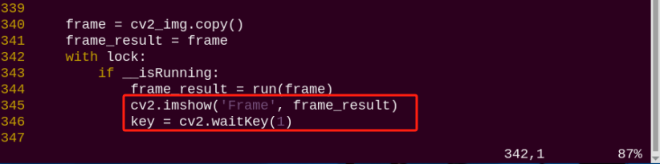

# 9. ROS1-AI Auto Tracking and Shooting Course

## 9.1 Ball Searching and Locating

### 9.1.1 Program Logic

Firstly, program to recognize color. Use Lab color space to convert the image from RGB into Lab. Then, perform binaryzation, corrosion, dilation, etc., on the image to obtain the contour which contains the target color. Next, circle the contour.

Next, judge the ball color. If it is red, acquire the coordinate of the ball.

Lastly, print the x-axis coordinate of the ball on the terminal.

### 9.1.2 Operation Steps 

:::{Note}
The input command should be case and space sensitive.
:::

(1) Turn on PuppyPi, and then connect to Raspberry Pi desktop through VNC.

(2) Click  to open LX terminal

(3) Input the command and press Enter to start the game.

```bash
rosrun puppy_advanced_functions kick_ball_demo.py
```

(4) If want to close this game, we can press "**Ctrl+C**". If it fails to close the game, please try again.

### 9.1.3 Program Outcome

:::{Note}
The program is default to recognize red.
:::

When a red ball is recognized, a rectangle will be used to highlight the ball ibn the feedback screen, and the X-axis coordinate will be printed in the terminal. 


### 9.1.4 Program Analysis

The source code is located in 

[/home/ubuntu/puppy_pi/src/puppy_advanced_functions/scripts/kick_ball_demo.py](../_static/source_code/ros1/puppy_advanced_functions_scripts.zip)

* **Import Function Package**

```PY
import sys
import cv2
import time
import math
import threading
import numpy as np
from enum import Enum

from common import Misc

import rospy
from std_srvs.srv import *
from sensor_msgs.msg import Image
from ros_robot_controller.msg import RGBState, RGBsState
from object_tracking.srv import *
from puppy_control.msg import Velocity, Pose, Gait
from puppy_control.srv import SetRunActionName
```

Import the required module through import statements: math provides a range of mathematical functions and constants for related calculations; rospy is used for ROS communication; from sensor_msgs.msg import Image: import target tracking related service. from puppy_control.msg import Velocity, Pose, Gait: import services for controlling and transmitting the velocity, pose, and gait of the robot.

* **Image Processing**

(1) Gaussian Filtering

Before converting the image from RGB into Lab space, denoise the image and use GaussianBlur() function in cv2 library for Gaussian filtering.

```PY
rame_gb = cv2.GaussianBlur(frame_resize, (3, 3), 3)
```

The meaning of the parameters in bracket is as follow

The first parameter `frame_resize` is the input image

The second parameter `(3, 3)` is the size of Gaussian kernel 

The third parameter `3` is the allowable range of variation around the average in Gaussian filtering. The larger the value, the larger the allowable range of variation.

(2) Binaryzation Processing

Adopt `inRange()` function in cv2 library to perform binaryzation on the image.

```PY
frame_mask = cv2.inRange(frame_lab,
                             (color_range_list[i]['min'][0],
                              color_range_list[i]['min'][1],
                              color_range_list[i]['min'][2]),
                             (color_range_list[i]['max'][0],
                              color_range_list[i]['max'][1],
                              color_range_list[i]['max'][2]))  #对原图像和掩模进行位运算(perform bitwise operation to original image and mask)
```

The first parameter in the bracket is the input image. 

The second and the third parameters respectively are the lower limit and upper limit of the threshold. When the RGB value of the pixel is between the upper limit and lower limit, the pixel is assigned 1, otherwise, 0.

(3) Erode and Dilate

:::{Note} 
To reduce interference and make the image smoother, it is necessary to process the image.
:::

```PY
eroded = cv2.erode(frame_mask, cv2.getStructuringElement(cv2.MORPH_RECT, (3, 3)))  #腐蚀(corrosion)
dilated = cv2.dilate(eroded, cv2.getStructuringElement(cv2.MORPH_RECT, (3, 3))) #膨胀(dilation)
```

erode() function is used for image erosion. 

Take `eroded = cv2.erode(frame_mask, cv2.getStructuringElement(cv2.MORPH_RECT, (3, 3)))` for example. The meaning of the parameters in bracket is as follow.

The first parameter `frame_mask` is the input image.

The second parameter `cv2.getStructuringElement(cv2.MORPH_RECT, (3, 3))` is the structural element or kernel deciding the nature of operation. And, the first parameter in the bracket is the shape of kernel, and the second parameter is the dimension of the kernel.

`dilate()` function is used for image dilation. The meaning of the parameters in bracket is the same as that of `erode()` function.

**(4) Acquire the Maximum Contour**

After processing the image, acquire the contour of the target to be recognized, which involves `findContours()` function in cv2 library.

```PY
contours = cv2.findContours(dilated, cv2.RETR_EXTERNAL, cv2.CHAIN_APPROX_NONE)[-2]  #找出轮廓(find out the contour)
```

The first parameter in parentheses is the input image; 

the second parameter is the retrieval mode of the contour; 

the third parameter is the approximation method of the contour.

Find the contour of the maximum area among the obtained contours. Obtain and identify the minimum bounding rectangle of the target contour through calling the `minAreaRect()` and `drawContours()` function in the cv2 library.

```PY
# 找出面积最大的轮廓(find out the contour with the maximal area)
# 参数为要比较的轮廓的列表(the parameter is the list of contour to be compared)
def getAreaMaxContour(contours):
    contour_area_temp = 0
    contour_area_max = 0
    area_max_contour = None

    for c in contours:  # 历遍所有轮廓(iterate through all contours)
        contour_area_temp = math.fabs(cv2.contourArea(c))  # 计算轮廓面积(calculate the contour area)
        if contour_area_temp > contour_area_max:
            contour_area_max = contour_area_temp
            if contour_area_temp >= 5:  # 只有在面积大于300时，最大面积的轮廓才是有效的，以过滤干扰(only when the area is greater than 300, the contour with the largest area is considered valid to filter out interference)
                area_max_contour = c

    return area_max_contour, contour_area_max  # 返回最大的轮廓(return the maximal contour)
```

After obtaining the contour with the maximum area, use the `minAreaRect()` and `drawContours()` functions from the cv2 library to obtain and mark the minimum bounding rectangle of the target contour.

```PY
rect = cv2.minAreaRect(areaMaxContour_max)#最小外接矩形(the minimal bounding rectangle)
            
box = np.int0(cv2.boxPoints(rect))#最小外接矩形的四个顶点(the four vertices of the minimum bounding rectangle)
centerX = int(Misc.map(rect[0][0], 0, size[0], 0, img_w))
centerY = int(Misc.map(rect[0][1], 0, size[1], 0, img_h))
sideX = int(Misc.map(rect[1][0], 0, size[0], 0, img_w))
sideY = int(Misc.map(rect[1][1], 0, size[1], 0, img_h))
angle = rect[2]
for i in range(4):
    box[i, 1] = int(Misc.map(box[i, 1], 0, size[1], 0, img_h))
for i in range(4):                
     box[i, 0] = int(Misc.map(box[i, 0], 0, size[0], 0, img_w))
cv2.drawContours(img, [box], -1, (0,0,255,255), 2)#画出四个点组成的矩形(draw a rectangle formed by connecting the four points)
```

* **Display Coordinate**

Lastly, the x-axis coordinate of the red ball will be displayed on the terminal.

```PY
puppyStatus = PuppyStatus.CLOSE_TO_TARGET_FINE_TUNE
print('expect_center[X] , target_info[centerX]',expect_center['X'] , target_info['centerX'])
```

## 9.2 Auto Tracking and Shooting

:::{Note}
if the demonstration effect is not satisfactory, you can debug the device according to "[**9.2.5 Close Debugging Interface**](#anchor_9_2_5)".
:::

### 9.2.1 Program Logic

Firstly, program to recognize color. Use Lab color space to convert the image from RGB into Lab. Then, perform binaryzation, corrosion, dilation, etc., on the image to obtain the contour which contains the target color. Next, circle the contour.

PuppyPi will execute color recognition continuously till red ball is recognized. Then acquire the coordinate of ball, and approach it. When PuppyPi stops in front of the ball, control it to shoot the ball according to the X-axis coordinate. 

### 9.2.2 Operation Steps

:::{Note}
The input command should be case and space sensitive.
:::

(1) Turn on PuppyPi, and then connect to Raspberry Pi desktop through VNC.

(2) Click  to open LX terminal

(3) Input command and press Enter to start the game.

```bash
rosrun puppy_advanced_functions kick_ball_demo.py
```

(4) If want to close this game, we can press "**Ctrl+C**". If it fails to close the game, please try again.

### 9.2.3 Program Outcome

:::{Note}
The program is default to recognize red, green and blue.
:::

When recognizing red ball, PuppyPi will approach the ball autonomously according to the location of PuppyPi, and then shoot the ball. Besides, the red ball will be marked with red circle and its color will be printed on the camera returned image.


### 9.2.4 Program Analysis

The source code of this program is stored in [/home/ubuntu/puppy_pi/src/puppy_advanced_functions/scripts/kick_ball_demo.py](../_static/source_code/ros1/puppy_advanced_functions_scripts.zip)

(1) Direction Judging

After locating the ball, judge whether the ball is at left or right according to the coordinate of the ball.

```PY
if expect_center['X'] > target_info['centerX']:
    which_foot_kick_ball = 'left'
else:
    which_foot_kick_ball = 'right'
```

(2) Approach the Red Ball

According to the coordinate of the ball, control PuppyPi to approach the red ball.

```PY
            if target_info['centerY'] < expect_center_kick_ball_left['Y']:
                PuppyVelocityPub.publish(x=4, y=0, yaw_rate = math.radians(0))
                time.sleep(0.1)
            elif which_foot_kick_ball == 'left' and target_info['centerX'] > expect_center_kick_ball_left['X']:
                PuppyVelocityPub.publish(x=0, y=0, yaw_rate = math.radians(-8))
                time.sleep(0.1)
            elif which_foot_kick_ball == 'right' and target_info['centerX'] < expect_center_kick_ball_right['X']:
                PuppyVelocityPub.publish(x=0, y=0, yaw_rate = math.radians(8))
                time.sleep(0.1)
            else:# 最后一次微调(the final fine-tuning)
                if which_foot_kick_ball == 'left':
                    PuppyVelocityPub.publish(x=5, y=0, yaw_rate = math.radians(-10))
                else:
                    PuppyVelocityPub.publish(x=5, y=0, yaw_rate = math.radians(10))
                time.sleep(1.8)
                PuppyVelocityPub.publish(x=0, y=0, yaw_rate = math.radians(0))
                puppyStatus = PuppyStatus.KICK_BALL
            # PuppyVelocityPub.publish(x=0, y=0, yaw_rate = math.radians(0))
            # time.sleep(0.1)#停下来需要稳定的时间(the time required to come to a stable stop)
            time.sleep(0.1)
            break
```

PuppyVelocityPub.publish function will be used to control PuppyPi to move.

`PuppyVelocityPub.publish()` is used to control the motion status of PuppyPi. Take `PuppyVelocityPub.publish(x=4, y=0, yaw_rate = math.radians(0))` for example. The meaning of the parameters in bracket is as follow.

The first parameter `x` is the speed in cm/s of moving straight. Moving forward is taken as the positive direction.

The second parameter `y` is the speed in cm/s of moving sideways. Left is taken as the positive direction. However, PuppyPi cannot move sideways, and this parameter is useless. 

The third parameter `yaw_rate` is the speed in rad/s of turning. Counterclockwise is taken as positive direction.

(3) Shoot the Ball

After PuppyPi approaches the red ball, call the action group to make PuppyPi shoot the ball according to the direction of the ball.

```PY
with lock:
     PuppyVelocityPub.publish(x=0, y=0, yaw_rate = math.radians(0))
     time.sleep(0.2)
     if which_foot_kick_ball == 'left':
          runActionGroup_srv('kick_ball_left.d6ac',True)
      else:
          runActionGroup_srv('kick_ball_right.d6ac',True)
      puppyStatus = PuppyStatus.LOOKING_FOR
      haved_detect = False
```

<p id="anchor_9_2_5"></p>

### 9.2.5 Function Extension

* **Close Debugging Interface**

As the continuous refresh of debugging interface will occupy CPU of Raspberry Pi, we can close debugging interface to tackle choppy running.

(1) Input the command and press Enter to edit the program file.

```bash
rosed puppy_advanced_functions kick_ball_demo.py
```

(2) Next, jump to this line of code.



:::{Note}
we can input the line code and press **"Shift+G"** to jump to the corresponding line.
:::

(3) Press **"i"** key to enter editing mode. Then add **"#"** in front of the codes in the red frame to comment.


(4) After modification, press **"Esc"** and input **":wq"** and press Enter to save and exit editing.

```bash
:wq
```

(5) Input the command  to restart the game and check PuppyPi's performance.

```bash
rosrun puppy_advanced_functions kick_ball_demo.py
```

(6) If you need to view the debugging screen again (real-time feedback from the camera), you can uncomment the content boxed in step 3), i.e., remove the "**#**" in front of the code, then save, as shown in the following figure:


* **Change Ball Color**

**The program is default to recognize and shoot the red ball. If you need to change the color, please follow the below steps to operate.**

(1) Input the command and press Enter to edit auto tracking and shooting program.

```bash
rosed puppy_advanced_functions kick_ball_demo.py
```

(2) Next, jump to this line of code.


:::{Note}
we can input the line code and press **"Shift+G"** to jump to the corresponding line.
:::

(3) Press **"i"** key to enter editing mode. Modify **"red"** as **"blue"**.


(4) After modification, press **"Esc"** and input **":wq"** and press Enter to save and exit editing.

```bash
:wq
```

(5) Input the command to restart the game and check PuppyPi's performance.

```bash
rosrun puppy_advanced_functions kick_ball_demo.py
```
